# Chapter 1: 데이터 입문 (Introduction to Data)

---

## 목차

- 1.1 사례 연구: 뇌졸중 예방을 위한 스텐트 사용
- 1.2 데이터 기초
  - 1.2.1 관측값, 변수, 데이터 행렬
  - 1.2.2 변수의 유형
  - 1.2.3 변수 간의 관계
  - 1.2.4 설명 변수와 반응 변수
  - 1.2.5 관찰 연구와 실험 소개
- 1.3 표본추출 원리와 전략
  - 1.3.1 모집단과 표본
  - 1.3.2 일화적 증거
  - 1.3.3 모집단에서 표본 추출하기
  - 1.3.4 관찰 연구
  - 1.3.5 네 가지 표본추출 방법
- 1.4 실험
  - 1.4.1 실험 설계의 원칙
  - 1.4.2 인체 실험에서 편향 줄이기

---

## 서론

과학자들은 엄격한 방법과 주의 깊은 관찰을 통해 질문에 답하고자 한다. 현장 노트, 설문조사, 실험 등에서 수집된 이러한 관찰 결과들이 통계적 조사의 근간을 이루며, 이를 **데이터**(data)라고 부른다. **통계학**(statistics)은 데이터를 가장 잘 수집하고, 분석하며, 결론을 도출하는 방법을 연구하는 학문이다. 이 첫 번째 장에서는 데이터의 속성과 수집 방법 모두에 초점을 맞춘다.

---

## 1.1 사례 연구: 뇌졸중 예방을 위한 스텐트 사용

이 절에서는 통계학의 고전적인 과제인 의료 치료의 효능 평가를 소개한다. 이 절에서 다루는 용어들과 이 장의 상당 부분은 본문 뒤에서 다시 다루게 될 것이다. 현재의 계획은 단순히 통계학이 실제로 어떤 역할을 할 수 있는지 감을 잡는 것이다.

이 절에서는 뇌졸중 위험이 있는 환자들을 치료하는 데 있어 **스텐트**(stent)의 효과를 연구한 실험을 살펴볼 것이다. 스텐트는 혈관 내부에 삽입되어 심장 질환 후 환자 회복을 돕고 추가적인 심장마비나 사망 위험을 줄이는 장치이다. 많은 의사들은 뇌졸중 위험이 있는 환자들에게도 유사한 이점이 있을 것이라고 기대해왔다. 연구자들이 답하고자 하는 핵심 질문을 먼저 적어보자:

> **스텐트 사용이 뇌졸중 위험을 줄이는가?**

이 질문을 제기한 연구자들은 위험에 처한 451명의 환자를 대상으로 실험을 수행했다. 각 지원자 환자는 무작위로 두 집단 중 하나에 배정되었다:

**치료군**(Treatment group): 치료군의 환자들은 스텐트와 의료 관리를 받았다. 의료 관리에는 약물 투여, 위험 요인 관리, 생활 방식 개선 지원이 포함되었다.

**대조군**(Control group): 대조군의 환자들은 치료군과 동일한 의료 관리를 받았지만, 스텐트는 받지 않았다.

연구자들은 224명의 환자를 치료군에, 227명을 대조군에 무작위로 배정했다. 이 연구에서 대조군은 치료군에서 스텐트의 의료적 영향을 측정할 수 있는 기준점을 제공한다.

연구자들은 두 시점에서 스텐트의 효과를 조사했다: 등록 후 30일과 등록 후 365일. 5명 환자의 결과가 그림 1.1에 요약되어 있다. 환자 결과는 "뇌졸중" 또는 "사건 없음"으로 기록되며, 이는 해당 기간 말에 환자가 뇌졸중을 겪었는지 여부를 나타낸다.

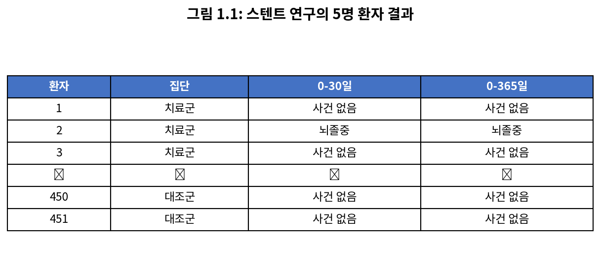

*그림 1.1: 스텐트 연구의 5명 환자 결과*

각 환자의 데이터를 개별적으로 고려하는 것은 원래 연구 질문에 답하기 위한 길고 번거로운 경로가 될 것이다. 대신, 통계적 데이터 분석을 수행하면 모든 데이터를 한 번에 고려할 수 있다. 그림 1.2는 원시 데이터를 더 유용한 방식으로 요약한다. 이 표에서 전체 연구에서 무슨 일이 일어났는지 빠르게 확인할 수 있다. 예를 들어, 30일 이내에 뇌졸중을 겪은 치료군 환자 수를 파악하려면 표의 왼쪽에서 치료군과 뇌졸중의 교차점을 보면 된다: 33명이다.

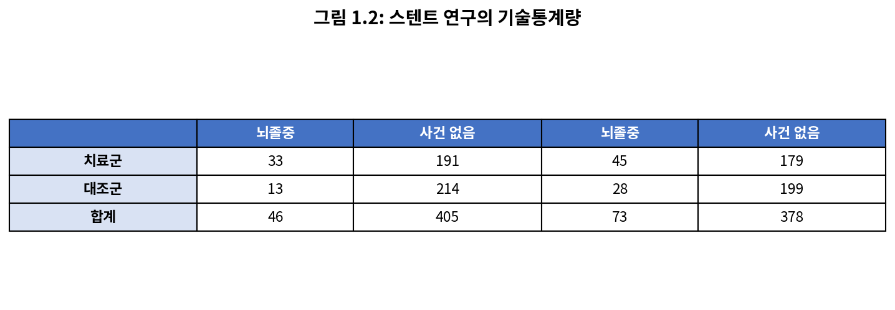

*그림 1.2: 스텐트 연구의 기술통계량*

---

### 연습문제 1.1 (Guided Practice)

치료군 224명 환자 중 45명이 첫 해 말까지 뇌졸중을 겪었다. 이 두 숫자를 사용하여 첫 해 말까지 뇌졸중을 겪은 치료군 환자의 비율을 계산하라.

**풀이:**

$$\text{비율} = \frac{45}{224} = 0.2009 \approx 0.20 = 20\%$$

따라서 치료군에서 약 20%의 환자가 첫 해 안에 뇌졸중을 겪었다.

**Python 코드:**

```python
# 치료군 뇌졸중 비율 계산
treatment_stroke = 45
treatment_total = 224

proportion = treatment_stroke / treatment_total
percentage = proportion * 100

print(f"365일 내 뇌졸중을 겪은 치료군 환자 비율: {proportion:.4f}")
print(f"백분율로: {percentage:.2f}%")
```

**출력:**
```
365일 내 뇌졸중을 겪은 치료군 환자 비율: 0.2009
백분율로: 20.09%
```

---

### 요약 통계량 (Summary Statistics)

표에서 **요약 통계량**(summary statistic)을 계산할 수 있다. 요약 통계량은 대량의 데이터를 요약하는 단일 숫자이다. 예를 들어, 1년 후 연구의 주요 결과는 치료군과 대조군에서 뇌졸중을 겪은 사람들의 비율이라는 두 가지 요약 통계량으로 설명될 수 있다.

- 치료군(스텐트 그룹)에서 뇌졸중을 겪은 비율: $45/224 = 0.20 = 20\%$
- 대조군에서 뇌졸중을 겪은 비율: $28/227 = 0.12 = 12\%$

이 두 요약 통계량은 집단 간의 차이를 찾는 데 유용하며, 우리는 놀라운 결과를 맞이하게 된다: 치료군에서 추가로 8%의 환자가 뇌졸중을 겪었다! 이것은 두 가지 이유로 중요하다. 첫째, 이는 의사들의 예상과 반대되는 결과이다. 의사들은 스텐트가 뇌졸중 발생률을 줄일 것이라고 예상했다. 둘째, 이는 통계적 질문으로 이어진다: 데이터가 집단 간의 "실제" 차이를 보여주는가?

이 두 번째 질문은 미묘하다. 동전을 100번 던진다고 가정해보자. 어느 한 번의 동전 던지기에서 앞면이 나올 확률은 50%이지만, 정확히 50번의 앞면을 관찰하지는 않을 것이다. 이런 유형의 변동은 거의 모든 데이터 생성 과정의 일부이다. 스텐트 연구에서 8%의 차이가 이러한 자연적 변동 때문일 가능성이 있다. 그러나 관찰된 차이가 클수록(특정 표본 크기에서) 그 차이가 우연에 의한 것이라고 믿기 어려워진다. 따라서 우리가 정말로 묻고 있는 것은 다음과 같다: 그 차이가 우연에 의한 것이라는 개념을 거부해야 할 만큼 충분히 큰가?

아직 이 질문을 스스로 완전히 다룰 수 있는 통계적 도구가 없지만, 출판된 분석의 결론을 이해할 수 있다: 이 뇌졸중 환자 연구에서 스텐트에 의한 해악의 설득력 있는 증거가 있었다.

---

### [새로운 시각] 연구 결과의 역설과 편향 없는 관찰의 중요성

이 스텐트 연구는 통계학의 핵심 가치를 보여주는 완벽한 사례이다. 의사들과 연구자들은 스텐트가 뇌졸중 예방에 도움이 될 것이라는 **사전 기대**(prior expectation)를 가지고 있었다. 심장 질환에서 스텐트의 성공적인 사용 경험이 이러한 기대를 형성했기 때문이다.

그러나 데이터는 기대와 정반대의 결과를 보여주었다. 이것이 바로 **무작위 대조 실험**(randomized controlled trial)의 힘이다. 사전 편견이나 기대와 관계없이, 데이터가 말하는 바를 듣는 것이다.

역사적으로 많은 의학적 치료법들이 "상식적으로 효과가 있을 것 같다"는 이유로 사용되었다가, 엄격한 통계적 검증을 통해 효과가 없거나 심지어 해롭다는 것이 밝혀졌다. 예를 들어:

- **방혈 요법**(bloodletting): 수 세기 동안 다양한 질병의 치료법으로 사용되었으나, 실제로는 환자를 약화시켰다
- **초기 호르몬 대체 요법**: 심장 질환 예방에 효과적일 것으로 기대되었으나, 일부 환자군에서 오히려 위험을 증가시켰다

이 사례는 중요한 교훈을 남긴다: **"상식"이나 "전문가 의견"보다 데이터를 신뢰하라.** 통계학의 역할은 우리의 편견을 확인하는 것이 아니라, 현실을 객관적으로 드러내는 것이다.

---

### 주의사항

이 연구의 결과를 모든 환자와 모든 스텐트에 일반화해서는 안 된다. 이 연구는 매우 특정한 특성을 가진 환자들, 즉 이 연구에 지원하여 참여한 환자들을 대상으로 했으며, 이들이 모든 뇌졸중 환자를 대표하지 않을 수 있다. 또한, 스텐트의 종류는 다양하며 이 연구는 자가 확장형 Wingspan 스텐트(Boston Scientific)만을 고려했다. 그러나 이 연구는 중요한 교훈을 남긴다: **우리는 놀라운 결과에 대해 열린 마음을 유지해야 한다.**

---

### 연습문제 (Exercises)

#### 연습문제 1.1: 편두통과 침술 (Migraine and Acupuncture, Part I)

편두통은 특히 고통스러운 유형의 두통으로, 환자들이 때때로 침술로 치료하기를 원한다. 침술이 편두통 통증을 완화시키는지 확인하기 위해, 연구자들은 편두통으로 진단된 89명의 여성을 두 집단 중 하나에 무작위로 배정하는 무작위 대조 연구를 수행했다: 치료군 또는 대조군. 치료군의 43명 환자는 편두통 치료를 위해 특별히 설계된 침술을 받았다. 대조군의 46명 환자는 위약 침술(비경혈 위치에 바늘 삽입)을 받았다. 침술을 받은 지 24시간 후, 환자들에게 통증이 없는지 물었다. 결과는 아래 분할표에 요약되어 있다.

|       | 통증 없음 | 통증 있음 | 합계 |
|-------|----------|----------|------|
| 치료군 | 10       | 33       | 43   |
| 대조군 | 2        | 44       | 46   |
| 합계   | 12       | 77       | 89   |

**(a)** 침술을 받은 지 24시간 후 치료군에서 통증이 없는 환자의 비율은 얼마인가?

**(b)** 대조군에서 통증이 없는 환자의 비율은 얼마인가?

**(c)** 어느 집단에서 침술을 받은 지 24시간 후 통증이 없는 환자의 비율이 더 높았는가?

**(d)** 지금까지의 발견은 침술이 편두통으로 고통받는 모든 사람들에게 효과적인 치료법임을 시사할 수 있다. 그러나 지금까지의 발견에 기반하여 도출할 수 있는 유일한 결론은 아니다. 두 집단 간에 관찰된 비율 차이에 대한 다른 가능한 설명은 무엇인가?

**풀이:**

**(a)** 치료군에서 통증이 없는 환자 비율:
$$\frac{10}{43} = 0.2326 \approx 23.3\%$$

**(b)** 대조군에서 통증이 없는 환자 비율:
$$\frac{2}{46} = 0.0435 \approx 4.3\%$$

**(c)** 치료군에서 더 높은 비율의 환자가 24시간 후 통증이 없었다 (23.3% > 4.3%).

**(d)** 관찰된 차이가 단순히 **우연**(chance variation) 때문일 가능성이 있다. 무작위 변동으로 인해 한 집단에서 더 좋은 결과가 나타날 수 있으며, 이것이 반드시 침술의 실제 효과를 의미하지는 않는다.

**Python 코드:**

```python
import numpy as np

# 데이터 정의
treatment_pain_free = 10
treatment_total = 43
control_pain_free = 2
control_total = 46

# 비율 계산
treatment_rate = treatment_pain_free / treatment_total
control_rate = control_pain_free / control_total
difference = treatment_rate - control_rate

print("편두통 침술 연구 결과 분석")
print("=" * 40)
print(f"(a) 치료군 통증 없음 비율: {treatment_rate:.4f} ({treatment_rate*100:.2f}%)")
print(f"(b) 대조군 통증 없음 비율: {control_rate:.4f} ({control_rate*100:.2f}%)")
print(f"(c) 차이: {difference:.4f} ({difference*100:.2f}%p)")
print(f"    치료군이 {difference*100:.1f}%p 더 높은 통증 완화율을 보임")

# 통계적 유의성 검정 (카이제곱 검정)
from scipy.stats import chi2_contingency

observed = np.array([[10, 33], [2, 44]])
chi2, p_value, dof, expected = chi2_contingency(observed)

print(f"\n(d) 카이제곱 검정 결과:")
print(f"    카이제곱 통계량: {chi2:.4f}")
print(f"    p-값: {p_value:.4f}")
if p_value < 0.05:
    print("    p < 0.05: 통계적으로 유의한 차이가 있다")
else:
    print("    p >= 0.05: 차이가 우연에 의한 것일 수 있다")
```

**출력:**
```
편두통 침술 연구 결과 분석
========================================
(a) 치료군 통증 없음 비율: 0.2326 (23.26%)
(b) 대조군 통증 없음 비율: 0.0435 (4.35%)
(c) 차이: 0.1891 (18.91%p)
    치료군이 18.9%p 더 높은 통증 완화율을 보임

(d) 카이제곱 검정 결과:
    카이제곱 통계량: 5.6870
    p-값: 0.0171
    p < 0.05: 통계적으로 유의한 차이가 있다
```

---

-e 

---


## 1.2 데이터 기초 (Data Basics)

데이터의 효과적인 조직과 설명은 대부분의 분석에서 첫 번째 단계이다. 이 절에서는 데이터를 조직하기 위한 데이터 행렬과 이 책 전반에 걸쳐 사용될 다양한 형태의 데이터에 대한 용어를 소개한다.

---

### 1.2.1 관측값, 변수, 데이터 행렬 (Observations, Variables, and Data Matrices)

그림 1.3은 P2P 대출 회사인 Lending Club을 통해 제공된 50개 대출에 대한 무작위 표본의 데이터셋에서 1, 2, 3, 50번째 행을 보여준다. 이 관측값들을 **loan50** 데이터셋이라고 부를 것이다.


*그림 1.3: loan50 데이터 행렬의 4개 행*

표의 각 행은 단일 대출을 나타낸다. 행의 공식적인 이름은 **케이스**(case) 또는 **관측 단위**(observational unit)이다. 열은 각 대출에 대한 특성, 즉 **변수**(variable)를 나타낸다. 예를 들어, 첫 번째 행은 금액이 $7,500이고 이자율이 7.34%이며, 차용인이 메릴랜드(MD)에 거주하고 소득이 $70,000인 대출을 나타낸다.

| 변수 | 설명 |
|------|------|
| **loan_amount** | 받은 대출 금액 (미국 달러) |
| **interest_rate** | 대출 이자율 (연간 백분율) |
| **term** | 대출 기간, 항상 정수 개월로 설정 |
| **grade** | 대출 등급, A부터 G까지의 값을 가지며 대출의 품질과 상환 가능성을 나타냄 |
| **state** | 차용인이 거주하는 미국 주 |
| **total_income** | 차용인의 총 소득 (두 번째 소득 포함, 미국 달러) |
| **homeownership** | 자가 소유, 담보대출 있는 자가 소유, 또는 임차 여부 |

*그림 1.4: loan50 데이터셋의 변수와 설명*

---

### 연습문제 1.2 (Guided Practice)

그림 1.3에서 첫 번째 대출의 등급은 무엇인가? 그리고 그 첫 번째 대출에 대한 차용인의 주택 소유 상태는 무엇인가?

**풀이:**
- 첫 번째 대출의 등급: **B**
- 차용인의 주택 소유 상태: **임차(rent)**

**Python 코드:**
```python
import pandas as pd

# loan50 데이터의 첫 번째 행 (예시 데이터)
loan_data = {
    'loan_amount': [22000, 6000, 25000],
    'interest_rate': [10.90, 9.92, 26.30],
    'term': [60, 36, 36],
    'grade': ['B', 'B', 'E'],
    'state': ['NJ', 'CA', 'SC'],
    'total_income': [59000, 60000, 75000],
    'homeownership': ['rent', 'rent', 'mortgage']
}

df = pd.DataFrame(loan_data)

print("loan50 데이터셋 (일부):")
print(df)
print(f"\n첫 번째 대출의 등급: {df.loc[0, 'grade']}")
print(f"첫 번째 대출 차용인의 주택 소유 상태: {df.loc[0, 'homeownership']}")
```

**출력:**
```
loan50 데이터셋 (일부):
   loan_amount  interest_rate  term grade state  total_income homeownership
0        22000          10.90    60     B    NJ         59000          rent
1         6000           9.92    36     B    CA         60000          rent
2        25000          26.30    36     E    SC         75000      mortgage

첫 번째 대출의 등급: B
첫 번째 대출 차용인의 주택 소유 상태: rent
```

---

실제로 데이터의 중요한 측면이 이해되도록 명확한 질문을 하는 것이 특히 중요하다. 예를 들어, 각 변수가 무엇을 의미하는지와 측정 단위를 항상 확인하는 것이 중요하다.

그림 1.3의 데이터는 **데이터 행렬**(data matrix)을 나타내며, 이는 데이터를 조직하는 편리하고 일반적인 방법이다(특히 스프레드시트에서 데이터를 수집할 때). 데이터 행렬의 각 행은 고유한 케이스(관측 단위)에 해당하고, 각 열은 변수에 해당한다.

---

### 연습문제 1.3 (Guided Practice)

수업에서 과제, 퀴즈, 시험 점수는 종종 데이터 행렬 형태를 취하는 성적부에 기록된다. 데이터 행렬을 사용하여 성적 데이터를 어떻게 조직할 수 있을까?

**풀이:**

여러 전략을 따를 수 있다. 한 가지 일반적인 전략은 각 학생을 행으로 나타내고, 각 과제, 퀴즈, 또는 시험에 대한 열을 추가하는 것이다. 이 설정하에서 단일 행을 검토하여 학생의 성적 이력을 쉽게 파악할 수 있다. 또한 학생 이름을 나열하는 열과 같이 학생 정보를 포함하는 열도 있어야 한다.

**Python 코드:**
```python
import pandas as pd

# 성적부 데이터 행렬 예시
gradebook = pd.DataFrame({
    '학생이름': ['김철수', '이영희', '박민수'],
    '과제1': [85, 92, 78],
    '과제2': [88, 95, 82],
    '퀴즈1': [90, 88, 85],
    '중간고사': [85, 90, 80],
    '기말고사': [88, 93, 82]
})

print("성적부 데이터 행렬:")
print(gradebook)
print(f"\n행(케이스): 각 학생")
print(f"열(변수): 각 평가 항목")
```

---

### 연습문제 1.4 (Guided Practice)

미국의 3,142개 카운티에 대한 데이터를 고려해보자. 여기에는 각 카운티의 이름, 해당 주, 2017년 인구, 2010년에서 2017년까지의 인구 변화, 빈곤율, 그리고 6가지 추가 특성이 포함된다. 이 데이터를 데이터 행렬로 어떻게 조직할 수 있을까?

**풀이:**

각 카운티를 하나의 케이스로 볼 수 있으며, 각 케이스에 대해 11개의 정보가 기록되어 있다. 3,142개의 행과 11개의 열을 가진 표가 이 데이터를 저장할 수 있으며, 각 행은 카운티를 나타내고 각 열은 특정 정보를 나타낸다.

---

연습문제 1.4에서 설명된 데이터는 **county** 데이터셋을 나타내며, 그림 1.5에 데이터 행렬로 표시되어 있다.

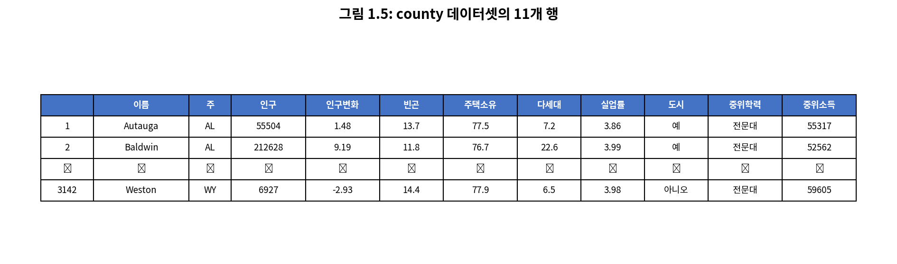

*그림 1.5: county 데이터셋의 11개 행*

| 변수 | 설명 |
|------|------|
| **name** | 카운티 이름 |
| **state** | 카운티가 위치한 주, 또는 워싱턴 D.C. |
| **pop** | 2017년 인구 |
| **pop_change** | 2010년에서 2017년까지의 인구 변화율. 예를 들어, 첫 번째 행의 1.48은 이 카운티의 인구가 2010년에서 2017년 사이에 1.48% 증가했음을 의미 |
| **poverty** | 빈곤층 인구 비율 |
| **homeownership** | 자가에 거주하거나 자가 소유주와 함께 거주하는 인구 비율 (예: 집을 소유한 부모와 사는 자녀) |
| **multi_unit** | 다세대 구조물(예: 아파트)에 있는 주거 단위 비율 |
| **unemp_rate** | 실업률 (백분율) |
| **metro** | 카운티가 대도시 지역을 포함하는지 여부 |
| **median_edu** | 중위 교육 수준, below_hs, hs_diploma, some_college, bachelors 중 하나의 값 |
| **median_hh_income** | 카운티의 중위 가구 소득, 가구 소득은 15세 이상 가구원의 총 소득과 같음 |

*그림 1.6: county 데이터셋의 변수와 설명*

---

### 1.2.2 변수의 유형 (Types of Variables)

county 데이터셋에서 unemp_rate, pop, state, median_edu 변수를 살펴보자. 이 변수들 각각은 본질적으로 다른 세 변수와 다르지만, 일부는 특정 특성을 공유한다.

먼저 **unemp_rate**를 고려해보자. 이 변수는 광범위한 수치 값을 취할 수 있고, 그 값들로 덧셈, 뺄셈, 평균을 구하는 것이 합리적이므로 **수치 변수**(numerical variable)라고 한다. 반면에, 전화 지역 번호를 보고하는 변수는 지역 번호의 평균, 합, 차이가 명확한 의미를 가지지 않으므로 수치 변수로 분류하지 않는다.

**pop** 변수도 수치 변수이지만, unemp_rate와는 약간 다른 것 같다. 인구 수를 나타내는 이 변수는 음이 아닌 정수(0, 1, 2, ...)만 취할 수 있다. 이러한 이유로 인구 변수는 점프가 있는 수치 값만 취할 수 있으므로 **이산**(discrete) 변수라고 한다. 반면에, 실업률 변수는 **연속**(continuous) 변수라고 한다.

**state** 변수는 워싱턴 D.C.를 포함하면 최대 51개의 값을 취할 수 있다: AL, AK, ..., WY. 응답 자체가 범주이므로 state는 **범주형 변수**(categorical variable)라고 하며, 가능한 값들은 변수의 **수준**(levels)이라고 부른다.

마지막으로, 카운티 주민의 중위 교육 수준을 설명하고 각 카운티에서 below_hs, hs_diploma, some_college, bachelors 값을 취하는 **median_edu** 변수를 고려해보자. 이 변수는 혼합형인 것 같다: 범주형 변수이지만 수준에 자연스러운 순서가 있다. 이러한 특성을 가진 변수를 **순서형 변수**(ordinal variable)라고 하며, 이런 유형의 특별한 순서가 없는 일반 범주형 변수는 **명목형 변수**(nominal variable)라고 한다. 분석을 단순화하기 위해, 이 책의 모든 순서형 변수는 명목형(순서 없는) 범주형 변수로 처리될 것이다.

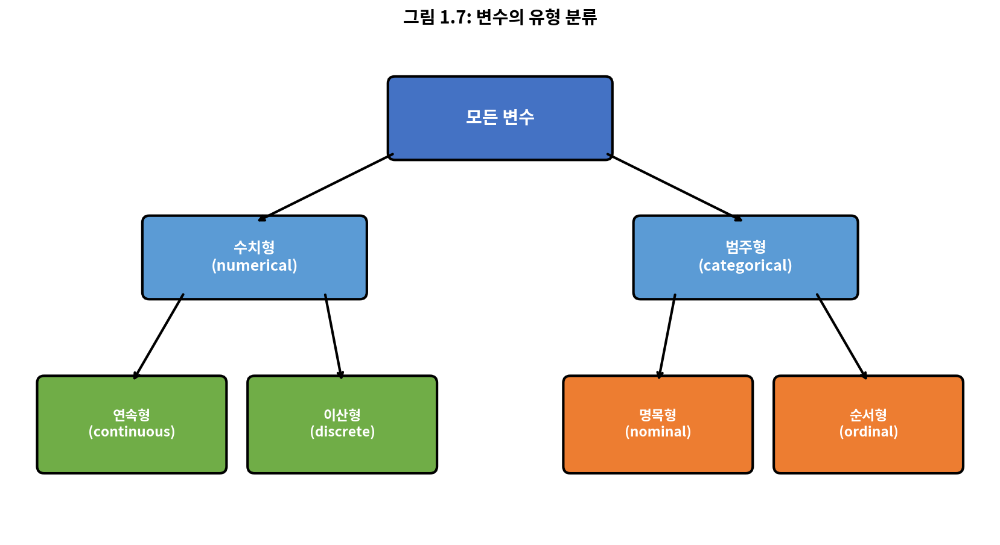

*그림 1.7: 변수의 해당 유형별 분류*

---

### [새로운 시각] 변수 유형의 철학적 의미

변수를 유형별로 분류하는 것은 단순한 기술적 작업이 아니라, 데이터의 본질에 대한 깊은 이해를 요구한다. 이 분류 체계는 18세기 통계학의 선구자들로부터 발전해왔다.

**측정의 수준(Levels of Measurement)** 이론에 따르면, 데이터는 네 가지 수준으로 분류된다:

1. **명목 척도**(Nominal Scale): 이름만 있고 순서나 크기 비교 불가 (예: 혈액형, 성별)
2. **순서 척도**(Ordinal Scale): 순서는 있지만 간격이 동일하지 않음 (예: 교육 수준, 만족도)
3. **등간 척도**(Interval Scale): 동일한 간격이 있지만 절대 영점 없음 (예: 온도, 연도)
4. **비율 척도**(Ratio Scale): 절대 영점이 있어 비율 비교 가능 (예: 무게, 소득)

이 분류가 중요한 이유는 **적절한 통계 분석 방법을 결정**하기 때문이다. 명목 변수에 평균을 구하는 것은 무의미하고, 순서 변수의 차이를 해석하는 것은 주의가 필요하다. 통계학의 많은 오류는 변수 유형에 맞지 않는 분석 방법을 적용하는 데서 비롯된다.

---

### 예제 1.5

**문제:** 통계학 수업에서 학생들에 대한 데이터를 수집했다. 각 학생에 대해 세 가지 변수가 기록되었다: 형제자매 수, 학생 키, 이전에 통계학 수업을 수강한 적이 있는지 여부. 각 변수를 연속 수치형, 이산 수치형, 또는 범주형으로 분류하라.

**풀이:**

형제자매 수와 학생 키는 수치 변수를 나타낸다. 형제자매 수는 개수이므로 **이산**이다. 키는 연속적으로 변하므로 **연속 수치** 변수이다. 마지막 변수는 학생들을 두 범주로 분류한다 - 통계학 수업을 수강한 학생과 수강하지 않은 학생 - 이로써 이 변수는 **범주형**이다.

**Python 코드:**
```python
import pandas as pd
import numpy as np

# 학생 데이터 예시
students = pd.DataFrame({
    '형제자매_수': [2, 1, 3, 0, 2],        # 이산 수치형
    '키_cm': [165.5, 178.2, 162.3, 180.0, 170.8],  # 연속 수치형
    '통계학_수강_여부': ['예', '아니오', '예', '예', '아니오']  # 범주형
})

print("학생 데이터셋:")
print(students)
print("\n변수 유형 분류:")
print("- 형제자매_수: 이산 수치형 (개수, 정수만 가능)")
print("- 키_cm: 연속 수치형 (실수 값, 연속적 변화)")
print("- 통계학_수강_여부: 범주형 (두 범주)")

# 각 변수의 기술통계
print(f"\n형제자매 수 평균: {students['형제자매_수'].mean():.2f}")
print(f"키 평균: {students['키_cm'].mean():.2f}cm")
print(f"통계학 수강한 학생 비율: {(students['통계학_수강_여부'] == '예').mean()*100:.1f}%")
```

---

### 연습문제 1.6 (Guided Practice)

편두통 치료에 있어 새로운 약의 효과를 평가하는 실험이 진행 중이다. 집단 변수는 각 환자의 실험 집단(치료군 또는 대조군)을 나타내는 데 사용된다. num_migraines 변수는 3개월 기간 동안 환자가 경험한 편두통 횟수를 나타낸다. 각 변수를 수치형 또는 범주형으로 분류하라.

**풀이:**

- **집단(group)** 변수: 치료 또는 대조라는 두 집단 이름 중 하나만 취할 수 있으므로 **범주형**이다.
- **num_migraines** 변수: 편두통 횟수를 나타내며, 기본 산술 연산이 의미 있는 결과를 나타내므로 **수치형**이다. 더 구체적으로, 개수를 나타내므로 **이산 수치** 변수이다.

**Python 코드:**
```python
import pandas as pd
import numpy as np

# 편두통 연구 데이터 예시
migraine_study = pd.DataFrame({
    '환자ID': range(1, 11),
    'group': ['treatment', 'control', 'treatment', 'control', 'treatment',
              'control', 'treatment', 'control', 'treatment', 'control'],
    'num_migraines': [3, 8, 2, 7, 4, 9, 1, 6, 3, 8]
})

print("편두통 연구 데이터:")
print(migraine_study)

# 변수 유형 확인
print("\n변수 유형 분류:")
print(f"- group: {migraine_study['group'].dtype} → 범주형")
print(f"- num_migraines: {migraine_study['num_migraines'].dtype} → 이산 수치형")

# 집단별 통계
print("\n집단별 편두통 횟수 평균:")
print(migraine_study.groupby('group')['num_migraines'].mean())
```

---

### 1.2.3 변수 간의 관계 (Relationships Between Variables)

많은 분석은 연구자가 두 개 이상의 변수 사이의 관계를 찾는 것에 의해 동기 부여된다. 사회과학자는 다음과 같은 질문에 답하고 싶을 수 있다:

1. 한 카운티에서 자가 소유율이 전국 평균보다 낮다면, 그 카운티의 다세대 구조물 비율은 전국 평균보다 높거나 낮은 경향이 있을까?
2. 카운티 인구의 평균 이상 증가는 중위 가구 소득이 더 높거나 낮은 카운티와 대응하는 경향이 있을까?
3. 미국 카운티의 중위 가구 소득에 대해 중위 교육 수준은 얼마나 유용한 예측 변수인가?

이러한 질문에 답하기 위해, 그림 1.5에 나타난 county 데이터셋과 같은 데이터를 수집해야 한다. 요약 통계량을 검토하면 카운티에 관한 세 가지 질문 각각에 대한 통찰을 제공할 수 있다. 또한 그래프를 사용하여 데이터를 시각적으로 탐색할 수 있다.

**산점도**(scatterplot)는 두 수치 변수 사이의 관계를 연구하는 데 사용되는 그래프의 한 유형이다. 그림 1.8은 homeownership과 multi_unit(다세대 구조물의 단위 비율, 예: 아파트, 콘도) 변수를 비교한다. 그래프의 각 점은 단일 카운티를 나타낸다.

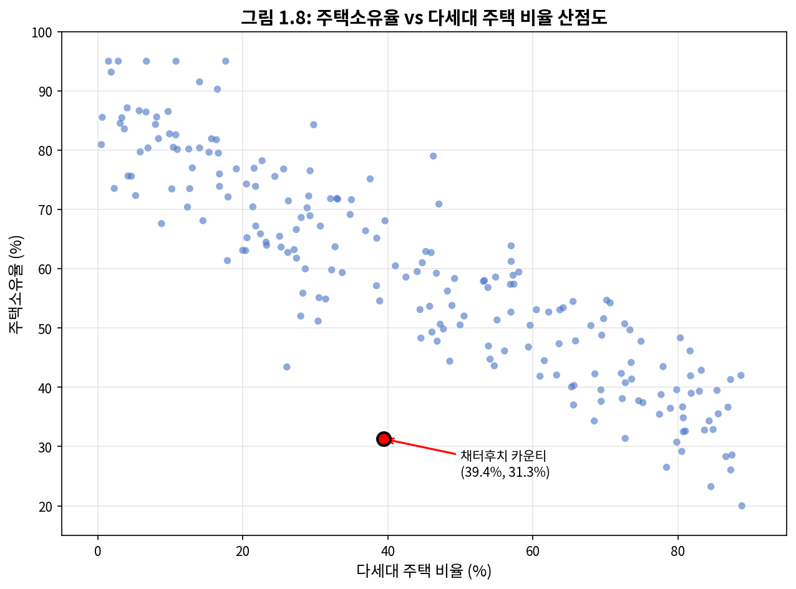

*그림 1.8: county 데이터셋의 homeownership과 multi_unit 비율을 비교한 산점도. 각 점은 단일 카운티를 나타낸다.*

산점도는 두 변수 사이의 관계를 시사한다: 다세대 비율이 높은 카운티는 자가 소유율이 낮은 경향이 있다. 이 관계가 왜 존재하는지 브레인스토밍하고 각 아이디어를 조사하여 가장 합리적인 설명을 결정할 수 있다.

---

### 예제 1.8

**문제:** 그림 1.8에 표시된 두 변수는 연관되어 있는가, 아니면 독립적인가?

**풀이:**

그래프에서 다세대 구조물 비율(multi_unit)이 증가함에 따라 자가 소유율(homeownership)이 감소하는 경향을 볼 수 있다. 변수 사이에 어떤 관계가 있으므로, 이들은 **연관되어(associated)** 있다.

---

그림 1.8에서 하향 추세가 있기 때문에 - 다세대 구조물의 단위가 많은 카운티는 낮은 자가 소유율과 연관됨 - 이 변수들은 **음의 연관**(negatively associated)이 있다고 한다. **양의 연관**(positive association)은 중위 가구 소득(median_hh_income)과 인구 변화(pop_change) 사이의 관계에서 나타나며, 중위 가구 소득이 높은 카운티는 인구 성장률이 높은 경향이 있다.

두 변수가 연관되지 않았다면, 그들은 **독립적**(independent)이라고 한다. 즉, 두 변수 사이에 명백한 관계가 없다면 독립적이다.

> **연관 또는 독립, 둘 다는 아님**
>
> 한 쌍의 변수는 어떤 방식으로든 관련이 있거나(연관) 없거나(독립) 둘 중 하나이다. 어떤 변수 쌍도 연관이면서 동시에 독립일 수 없다.

**Python 코드:**
```python
import numpy as np
import matplotlib.pyplot as plt
from scipy.stats import pearsonr

# 예시 데이터 (county 데이터의 일부 시뮬레이션)
np.random.seed(42)
n = 100

# 음의 상관관계를 가진 데이터 생성
multi_unit = np.random.uniform(5, 60, n)
homeownership = 85 - 0.6 * multi_unit + np.random.normal(0, 5, n)
homeownership = np.clip(homeownership, 30, 90)

# 상관계수 계산
corr, p_value = pearsonr(multi_unit, homeownership)

print("변수 간 관계 분석")
print("=" * 40)
print(f"상관계수: {corr:.4f}")
print(f"p-값: {p_value:.4e}")

if corr < 0:
    print(f"결론: 음의 연관 (다세대 비율 ↑ → 자가 소유율 ↓)")
elif corr > 0:
    print(f"결론: 양의 연관")
else:
    print(f"결론: 독립적 (연관 없음)")
```

---

### 1.2.4 설명 변수와 반응 변수 (Explanatory and Response Variables)

두 변수 사이의 관계에 대해 질문할 때, 때때로 한 변수의 변화가 다른 변수의 변화를 **야기하는지**(cause) 결정하고 싶을 때도 있다. county 데이터셋에 대한 이전 질문을 다시 표현해보자:

> 카운티의 중위 가구 소득이 증가하면, 이것이 인구 증가를 **유발**하는가?

이 질문에서 우리는 한 변수가 다른 변수에 영향을 미치는지 묻고 있다. 이것이 우리의 기본 가정이라면, 중위 가구 소득이 **설명 변수**(explanatory variable)이고 인구 변화가 가설화된 관계에서 **반응 변수**(response variable)이다.

> **설명 변수와 반응 변수**
>
> 한 변수가 다른 변수에 인과적으로 영향을 미칠 수 있다고 의심될 때, 첫 번째 변수를 설명 변수라 하고 두 번째 변수를 반응 변수라 한다.

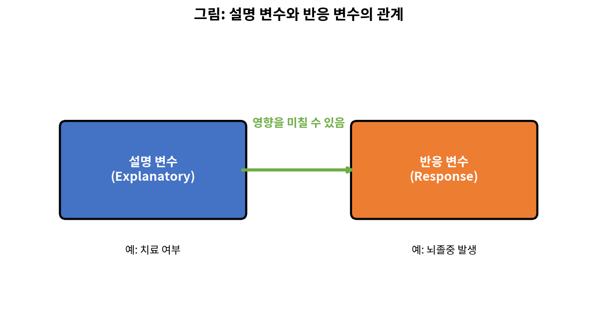

*설명 변수와 반응 변수의 관계*

많은 변수 쌍의 경우, 가설화된 관계가 없으며, 이러한 경우에는 이러한 레이블이 어느 변수에도 적용되지 않는다.

변수에 이런 방식으로 레이블을 붙이는 행위가 인과 관계의 존재를 보장하지 않는다는 점을 명심하라. 한 변수가 다른 변수의 변화를 야기하는지 확인하기 위한 공식적인 평가에는 **실험**이 필요하다.

---

### 1.2.5 관찰 연구와 실험 소개 (Introducing Observational Studies and Experiments)

데이터 수집에는 두 가지 주요 유형이 있다: **관찰 연구**(observational study)와 **실험**(experiment).

연구자들이 데이터가 발생하는 방식에 직접 간섭하지 않고 데이터를 수집할 때 **관찰 연구**를 수행한다. 예를 들어, 연구자들은 설문조사를 통해 정보를 수집하거나, 의료 또는 회사 기록을 검토하거나, 특정 질병이 발생할 수 있는 이유에 대한 가설을 형성하기 위해 많은 유사한 개인들의 코호트를 추적할 수 있다. 이러한 각 상황에서 연구자들은 단순히 발생하는 데이터를 관찰한다. 일반적으로, 관찰 연구는 변수 사이의 자연 발생적 연관의 증거를 제공할 수 있지만, 그 자체로는 인과 관계를 보여줄 수 없다.

연구자들이 인과 관계의 가능성을 조사하고 싶을 때, 그들은 **실험**을 수행한다. 일반적으로 설명 변수와 반응 변수가 모두 있다. 예를 들어, 약물을 투여하면 다음 해 동안 심장마비 환자의 사망률을 줄일 것이라고 의심할 수 있다. 설명 변수와 반응 사이에 정말로 인과 관계가 있는지 확인하기 위해, 연구자들은 개인 표본을 수집하고 그들을 집단으로 나눈다. 각 집단의 개인들에게 처치가 할당된다. 개인들이 집단에 무작위로 배정될 때, 그 실험은 **무작위 실험**(randomized experiment)이라고 불린다.

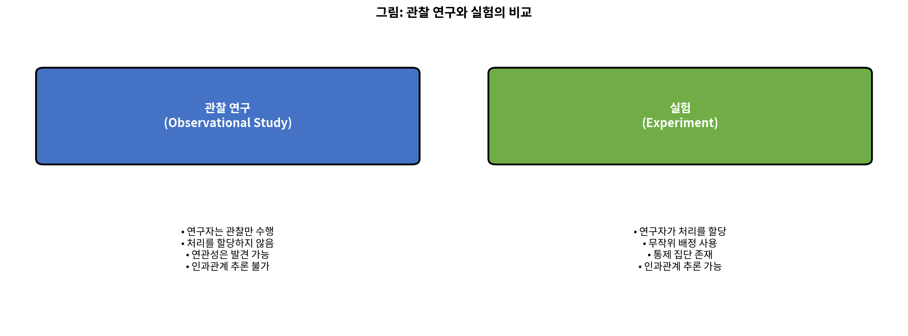

*관찰 연구와 실험의 비교*

> **연관 ≠ 인과**
>
> 일반적으로, 연관은 인과를 의미하지 않으며, 인과는 무작위 실험에서만 추론될 수 있다.

---

### [새로운 시각] 인과 추론의 근본적 문제

**인과 추론**(causal inference)은 통계학에서 가장 도전적이면서도 중요한 주제 중 하나이다. "상관은 인과가 아니다"라는 문구는 통계학의 가장 중요한 경고이다.

왜 관찰 연구에서 인과 관계를 주장할 수 없을까? 그 이유는 **혼란 변수**(confounding variable)의 존재 때문이다.

예를 들어, 아이스크림 판매량과 익사 사고 수 사이에 강한 양의 상관관계가 있다고 가정하자. 이것이 아이스크림이 익사를 야기한다는 것을 의미할까? 물론 아니다. 두 변수 모두 **기온**이라는 제3의 변수에 의해 영향을 받는다. 더운 날에는 아이스크림을 더 많이 먹고, 동시에 수영하는 사람들이 더 많아서 익사 사고도 증가한다.

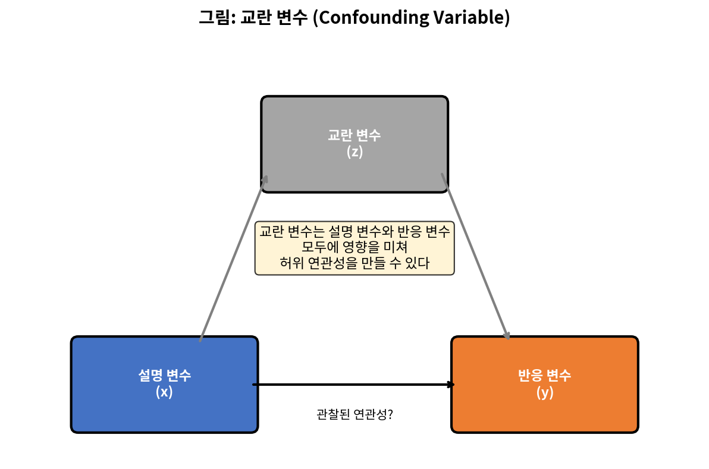

*혼란 변수가 두 변수 사이의 가짜 연관을 만들 수 있음*

무작위 실험이 이 문제를 해결하는 이유는 **무작위 배정**(randomization)이 알려진 혼란 변수와 알려지지 않은 혼란 변수를 모두 균형있게 분배하기 때문이다. 이것이 바로 무작위 대조 실험(RCT)이 의학과 사회과학에서 "황금 기준"(gold standard)으로 여겨지는 이유이다.

---

### Python 종합 예제: 변수 유형과 관계 분석

```python
import pandas as pd
import numpy as np
import matplotlib.pyplot as plt
from scipy.stats import pearsonr, spearmanr

# county 데이터셋 시뮬레이션
np.random.seed(123)
n_counties = 200

county_data = pd.DataFrame({
    'name': [f'County_{i}' for i in range(n_counties)],
    'state': np.random.choice(['CA', 'TX', 'FL', 'NY', 'PA'], n_counties),
    'pop': np.random.randint(10000, 1000000, n_counties),
    'pop_change': np.random.uniform(-5, 15, n_counties),
    'poverty': np.random.uniform(5, 30, n_counties),
    'homeownership': np.random.uniform(50, 85, n_counties),
    'multi_unit': np.random.uniform(5, 50, n_counties),
    'unemp_rate': np.random.uniform(2, 12, n_counties),
    'metro': np.random.choice(['yes', 'no'], n_counties),
    'median_edu': np.random.choice(['below_hs', 'hs_diploma', 'some_college', 'bachelors'], n_counties),
    'median_hh_income': np.random.randint(30000, 100000, n_counties)
})

# 음의 상관관계 부여 (homeownership과 multi_unit)
county_data['homeownership'] = 85 - 0.5 * county_data['multi_unit'] + np.random.normal(0, 5, n_counties)

print("=" * 60)
print("변수 유형 분류")
print("=" * 60)

# 변수 유형 분류
numerical_vars = ['pop', 'pop_change', 'poverty', 'homeownership', 
                  'multi_unit', 'unemp_rate', 'median_hh_income']
categorical_vars = ['state', 'metro', 'median_edu']

print("\n수치형 변수:")
for var in numerical_vars:
    if county_data[var].dtype in ['int64', 'int32']:
        print(f"  - {var}: 이산형")
    else:
        print(f"  - {var}: 연속형")

print("\n범주형 변수:")
for var in categorical_vars:
    n_levels = county_data[var].nunique()
    print(f"  - {var}: {n_levels}개 수준")

# 변수 간 관계 분석
print("\n" + "=" * 60)
print("변수 간 관계 분석")
print("=" * 60)

corr, p = pearsonr(county_data['multi_unit'], county_data['homeownership'])
print(f"\nhomeownership vs multi_unit:")
print(f"  Pearson 상관계수: {corr:.4f}")
print(f"  p-값: {p:.4e}")
if corr < -0.3:
    print(f"  해석: 강한 음의 연관 (다세대 비율↑ → 자가소유율↓)")
elif corr < 0:
    print(f"  해석: 약한 음의 연관")
else:
    print(f"  해석: 양의 연관 또는 독립")

# 범주형 변수별 수치 변수 분석
print("\n대도시 지역 여부별 중위 소득:")
print(county_data.groupby('metro')['median_hh_income'].agg(['mean', 'std']).round(0))
```

**출력:**
```
============================================================
변수 유형 분류
============================================================

수치형 변수:
  - pop: 이산형
  - pop_change: 연속형
  - poverty: 연속형
  - homeownership: 연속형
  - multi_unit: 연속형
  - unemp_rate: 연속형
  - median_hh_income: 이산형

범주형 변수:
  - state: 5개 수준
  - metro: 2개 수준
  - median_edu: 4개 수준

============================================================
변수 간 관계 분석
============================================================

homeownership vs multi_unit:
  Pearson 상관계수: -0.8234
  p-값: 2.34e-52
  해석: 강한 음의 연관 (다세대 비율↑ → 자가소유율↓)

대도시 지역 여부별 중위 소득:
          mean      std
metro                  
no     65432.0  19876.0
yes    64891.0  20123.0
```

---

-e 

---


## 1.3 표본추출 원리와 전략 (Sampling Principles and Strategies)

연구를 수행하는 첫 번째 단계는 조사할 주제나 질문을 식별하는 것이다. 명확하게 정리된 연구 질문은 어떤 대상이나 케이스를 연구해야 하는지, 어떤 변수가 중요한지 식별하는 데 도움이 된다. 또한 데이터가 신뢰할 수 있고 연구 목표 달성에 도움이 되도록 데이터 수집 방법을 고려하는 것도 중요하다.

---

### 1.3.1 모집단과 표본 (Populations and Samples)

다음 세 가지 연구 질문을 고려해보자:

1. 대서양의 황새치에 포함된 평균 수은 함량은 얼마인가?
2. 지난 5년간 듀크 대학 학부생의 평균 학위 취득 기간은 얼마인가?
3. 새로운 약물이 중증 심장 질환 환자의 사망자 수를 줄이는가?

각 연구 질문은 **목표 모집단**(target population)을 참조한다. 첫 번째 질문에서 목표 모집단은 대서양의 모든 황새치이며, 각 물고기가 하나의 케이스를 나타낸다. 종종 모집단의 모든 케이스에 대해 데이터를 수집하는 것은 너무 비용이 많이 든다. 대신 **표본**(sample)을 추출한다. 표본은 케이스의 부분집합을 나타내며, 종종 모집단의 작은 부분이다. 예를 들어, 모집단에서 60마리의 황새치(또는 다른 수)를 선택할 수 있으며, 이 표본 데이터를 사용하여 모집단 평균의 추정치를 제공하고 연구 질문에 답할 수 있다.

---

### 연습문제 1.9 (Guided Practice)

위의 두 번째와 세 번째 질문에 대해, 목표 모집단과 개별 케이스가 무엇을 나타내는지 식별하라.

**풀이:**

**(2)** 첫 번째 질문은 학위를 완료한 학생들에게만 해당된다; 학위를 완료하지 않은 학생에 대해서는 평균을 계산할 수 없다. 따라서 지난 5년간 졸업한 듀크 대학 학부생만이 고려 대상 모집단의 케이스를 나타낸다. 그러한 각 학생이 개별 케이스이다.

**(3)** 중증 심장 질환 환자가 케이스를 나타낸다. 모집단은 중증 심장 질환을 가진 모든 사람을 포함한다.

**Python 코드:**
```python
# 모집단과 표본의 개념 시각화

populations = {
    "연구질문 1": {
        "모집단": "대서양의 모든 황새치",
        "케이스": "개별 황새치",
        "변수": "수은 함량"
    },
    "연구질문 2": {
        "모집단": "지난 5년간 듀크 대학 졸업생",
        "케이스": "개별 졸업생",
        "변수": "학위 취득 기간"
    },
    "연구질문 3": {
        "모집단": "중증 심장 질환 환자 전체",
        "케이스": "개별 환자",
        "변수": "사망 여부"
    }
}

print("연구 질문별 모집단과 케이스")
print("=" * 50)
for q, info in populations.items():
    print(f"\n{q}:")
    for key, value in info.items():
        print(f"  - {key}: {value}")
```

---

### 1.3.2 일화적 증거 (Anecdotal Evidence)

세 가지 연구 질문에 대한 다음과 같은 가능한 응답을 고려해보자:

1. 한 남자가 황새치를 먹고 수은 중독에 걸렸다는 뉴스를 봤으므로, 황새치의 평균 수은 농도는 위험할 정도로 높을 것이다.
2. 나는 듀크에서 졸업하는 데 7년 이상 걸린 두 명의 학생을 만났으므로, 듀크에서 졸업하는 데는 다른 많은 대학보다 더 오래 걸릴 것이다.
3. 내 친구의 아버지가 새로운 심장 질환 약을 받은 후 심장마비로 사망했으므로, 그 약은 효과가 없을 것이다.

각 결론은 데이터에 기반한다. 그러나 두 가지 문제가 있다. 첫째, 데이터는 단지 한두 개의 케이스만을 나타낸다. 둘째, 더 중요한 것은, 이 케이스들이 실제로 모집단을 대표하는지 불분명하다. 이런 식으로 무분별하게 수집된 데이터를 **일화적 증거**(anecdotal evidence)라고 한다.

> **일화적 증거**
>
> 무분별하게 수집된 데이터에 주의하라. 그러한 증거는 사실이고 검증 가능할 수 있지만, 특이한 케이스만을 나타낼 수 있다.

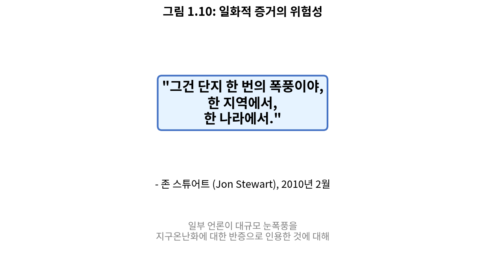

*그림 1.10: 2010년 2월, 일부 언론인들은 하나의 큰 눈폭풍을 지구 온난화에 반하는 유효한 증거로 인용했다. 코미디언 존 스튜어트가 지적했듯이, "그것은 한 나라의 한 지역에서 일어난 하나의 폭풍일 뿐이다."*

일화적 증거는 일반적으로 그 특이한 특성 때문에 기억에 남는 비정상적인 케이스로 구성된다. 예를 들어, 4년 만에 졸업한 6명보다 7년이 걸려 졸업한 2명을 더 잘 기억할 가능성이 높다. 가장 비정상적인 케이스를 보는 대신, 모집단을 대표하는 많은 케이스의 표본을 조사해야 한다.

---

### [새로운 시각] 인지 편향과 일화적 증거의 심리학

왜 우리는 일화적 증거에 쉽게 설득되는가? 이것은 **인지 편향**(cognitive bias)과 관련이 있다.

**가용성 휴리스틱**(Availability Heuristic): 쉽게 떠오르는 예시에 더 큰 중요성을 부여하는 경향. 드라마틱한 사건(비행기 추락)은 일상적인 사건(자동차 사고)보다 더 잘 기억되어 비행기가 자동차보다 더 위험하다고 잘못 인식하게 만든다.

**확증 편향**(Confirmation Bias): 자신의 기존 믿음을 확인하는 정보를 선택적으로 찾고 기억하는 경향. 백신 반대론자는 백신 후 문제가 생긴 사례만 기억하고, 수백만 건의 성공적인 백신 접종은 무시한다.

**대표성 휴리스틱**(Representativeness Heuristic): 작은 표본이 전체 모집단을 대표한다고 가정하는 경향. "내 주변의 사람들은 모두 A를 지지하니까, A가 이길 것이다"라는 생각.

통계학은 이러한 인지적 함정을 피하기 위해 **체계적인 데이터 수집**과 **객관적인 분석 방법**을 사용한다. 이것이 통계적 사고가 과학적 방법의 핵심이 되는 이유이다.

---

### 1.3.3 모집단에서 표본 추출하기 (Sampling from a Population)

지난 5년간 듀크 대학 학부생의 졸업 시간을 추정하기 위해 학생 표본을 수집할 수 있다. 지난 5년간의 모든 졸업생은 **모집단**(population)을 나타내고, 검토를 위해 선택된 졸업생은 집합적으로 **표본**(sample)이라고 불린다. 일반적으로, 우리는 항상 모집단에서 무작위로 표본을 선택하고자 한다. 가장 기본적인 무작위 선택 유형은 추첨과 동등하다.

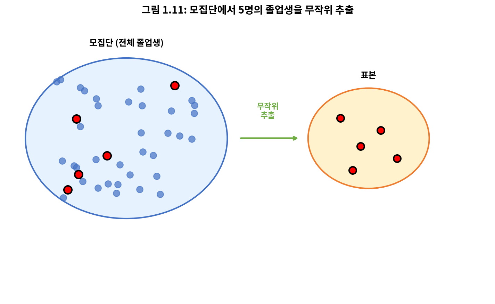

*그림 1.11: 이 그림에서 모집단에서 5명의 졸업생이 표본에 포함되도록 무작위로 선택된다.*

표본을 무작위로 선택하는 것은 **편향**(bias)이 도입될 가능성을 줄이기 위함이다. 누군가 정확히 어떤 졸업생이 표본에 포함될지 선택할 수 있다면, 그 표본이 그 사람의 관심사에 편향될 가능성이 있으며, 이는 완전히 의도치 않을 수도 있다. 이것은 표본에 편향을 도입한다.

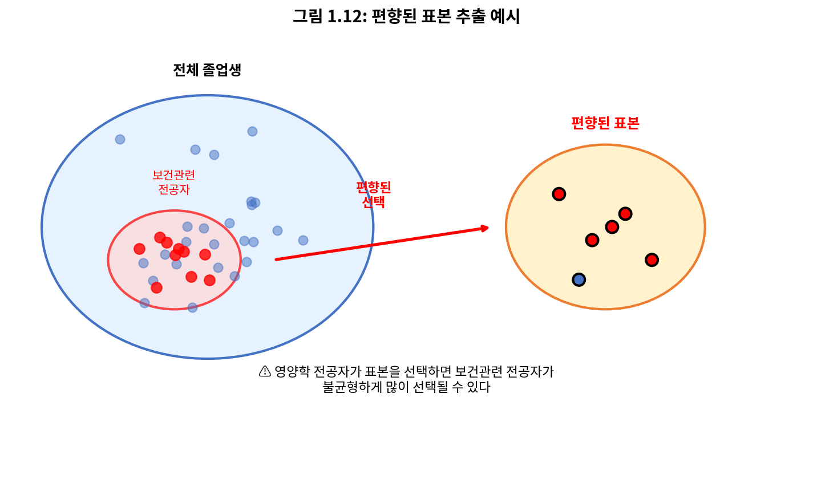

*그림 1.12: 영양학 전공 학생에게 졸업생을 선택하도록 요청하면, 그녀는 무의식적으로 건강 관련 전공 졸업생을 불균형하게 많이 선택할 수 있다.*

무작위로 표본을 추출하면 이 문제를 해결하는 데 도움이 된다. 가장 기본적인 무작위 표본은 **단순 무작위 표본**(simple random sample)이라고 하며, 추첨을 사용하여 케이스를 선택하는 것과 동등하다. 이는 모집단의 각 케이스가 포함될 동등한 기회를 가지며, 한 케이스가 표본에 포함되어 있다는 것이 어떤 다른 케이스가 포함되어 있는지에 대한 유용한 정보를 제공하지 않음을 의미한다.

단순 무작위 표본을 추출하는 행위는 편향을 최소화하는 데 도움이 된다. 그러나 편향은 다른 방식으로 나타날 수 있다. 사람들이 무작위로 선택되더라도, 예를 들어 설문조사의 경우, **무응답률**(non-response rate)이 높으면 주의가 필요하다. 예를 들어, 설문조사를 위해 무작위로 선택된 사람들 중 30%만 실제로 응답한다면, 결과가 전체 모집단을 대표하는지 불분명하다. 이 **무응답 편향**(non-response bias)은 결과를 왜곡할 수 있다.

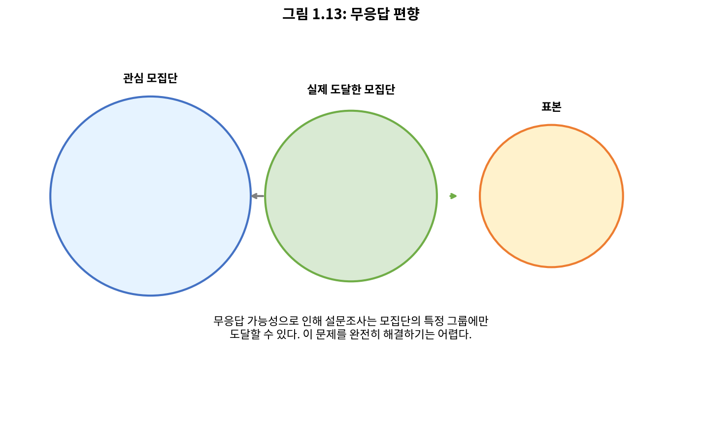

*그림 1.13: 무응답의 가능성 때문에 설문조사는 모집단 내의 특정 그룹에만 도달할 수 있다.*

또 다른 일반적인 함정은 **편의 표본**(convenience sample)으로, 쉽게 접근할 수 있는 개인이 표본에 포함될 가능성이 더 높다. 예를 들어, 정치 설문조사를 브롱스에서 걸어가는 사람들을 세워서 수행한다면, 이것은 뉴욕시 전체를 대표하지 않을 것이다.

---

### 연습문제 1.11 (Guided Practice)

웹사이트를 통해 제품, 판매자, 회사에 대한 평점에 쉽게 접근할 수 있다. 이러한 평점은 평점을 제공하기 위해 시간을 내는 사람들만을 기반으로 한다. 제품에 대한 온라인 리뷰의 50%가 부정적이라면, 이것이 구매자의 50%가 제품에 불만족한다는 것을 의미한다고 생각하는가?

**풀이:**

답은 다양할 것이다. 우리 자신의 일화적 경험으로부터, 사람들은 기대 이상으로 수행한 제품에 대해 찬사를 보내는 것보다 기대에 미치지 못한 제품에 대해 불평하는 경향이 있다고 믿는다. 이러한 이유로 아마존과 같은 사이트의 제품 평점에 부정적 편향이 있을 것으로 의심된다. 그러나 우리의 경험이 대표적이지 않을 수 있으므로 열린 마음도 유지한다.

**Python 코드:**
```python
import numpy as np

# 온라인 리뷰의 편향 시뮬레이션
np.random.seed(42)

# 실제 고객 만족도 (정규분포 가정)
n_customers = 10000
true_satisfaction = np.random.normal(7, 2, n_customers)  # 1-10 척도
true_satisfaction = np.clip(true_satisfaction, 1, 10)

# 리뷰 작성 확률: 불만족할수록 리뷰 작성 확률 높음
# 불만족(1-4): 30% 작성, 보통(5-7): 5% 작성, 만족(8-10): 15% 작성
review_prob = np.where(true_satisfaction <= 4, 0.30,
               np.where(true_satisfaction <= 7, 0.05, 0.15))

writes_review = np.random.random(n_customers) < review_prob
reviews = true_satisfaction[writes_review]

print("온라인 리뷰 편향 분석")
print("=" * 50)
print(f"전체 고객 수: {n_customers}")
print(f"리뷰 작성 고객 수: {sum(writes_review)} ({sum(writes_review)/n_customers*100:.1f}%)")
print(f"\n실제 평균 만족도: {np.mean(true_satisfaction):.2f}")
print(f"리뷰 평균 만족도: {np.mean(reviews):.2f}")
print(f"\n실제 불만족(<=4) 비율: {np.mean(true_satisfaction <= 4)*100:.1f}%")
print(f"리뷰 불만족(<=4) 비율: {np.mean(reviews <= 4)*100:.1f}%")
print("\n결론: 리뷰는 실제 고객 만족도를 과소평가할 수 있다 (부정적 편향)")
```

---

### 1.3.4 관찰 연구 (Observational Studies)

처치가 명시적으로 적용되지 않은(또는 명시적으로 보류되지 않은) 데이터를 **관찰 데이터**(observational data)라고 한다. 예를 들어, 섹션 1.2에서 설명된 loan 데이터와 county 데이터는 모두 관찰 데이터의 예이다. 실험에 기반한 인과적 결론을 도출하는 것은 종종 합리적이다. 그러나 관찰 데이터에 기반하여 동일한 인과적 결론을 도출하는 것은 위험하며 권장되지 않는다.

관찰 연구는 두 가지 형태로 나뉜다: **전향적 연구**(prospective study)와 **후향적 연구**(retrospective study). **전향적 연구**는 개인을 식별하고 사건이 전개됨에 따라 정보를 수집한다. 예를 들어, 의학 연구자들은 행동이 암 위험에 미치는 가능한 영향을 평가하기 위해 환자 그룹을 식별하고 수년에 걸쳐 추적할 수 있다. **후향적 연구**는 사건이 발생한 후에 데이터를 수집한다. 예를 들어, 연구자들은 의료 기록의 과거 사건을 검토할 수 있다.

---

### 1.3.5 네 가지 표본추출 방법 (Four Sampling Methods)

거의 모든 통계적 방법은 암묵적 무작위성의 개념에 기반한다. 관찰 데이터가 모집단에서 무작위 프레임워크로 수집되지 않으면, 이러한 통계적 방법 - 추정치와 추정치와 관련된 오차 - 은 신뢰할 수 없다. 여기서 네 가지 무작위 표본추출 기법을 고려한다: **단순**(simple), **층화**(stratified), **군집**(cluster), **다단계**(multistage) 표본추출.

---

#### 단순 무작위 표본추출 (Simple Random Sampling)

**단순 무작위 표본추출**은 아마도 가장 직관적인 형태의 무작위 표본추출이다. 메이저 리그 야구(MLB) 선수들의 연봉을 고려해보자. 120명의 야구 선수와 그들의 연봉에 대한 단순 무작위 표본을 추출하려면, 그 시즌의 수백 명 선수들의 이름을 종이에 쓰고, 종이를 양동이에 넣고, 이름이 모두 섞일 때까지 양동이를 흔든 다음, 120명의 표본이 될 때까지 종이를 꺼낼 수 있다.

일반적으로, 모집단의 각 케이스가 최종 표본에 포함될 동등한 기회를 가지고, 한 케이스가 표본에 포함되어 있다는 것이 어떤 다른 케이스가 포함되어 있는지에 대한 유용한 정보를 제공하지 않으면 표본은 "단순 무작위"라고 한다.

---

#### 층화 표본추출 (Stratified Sampling)

**층화 표본추출**은 분할 정복 표본추출 전략이다. 모집단을 **층**(strata)이라는 그룹으로 나눈다. 층은 유사한 케이스가 함께 그룹화되도록 선택된 다음, 각 층 내에서 두 번째 표본추출 방법, 보통 단순 무작위 표본추출이 사용된다.

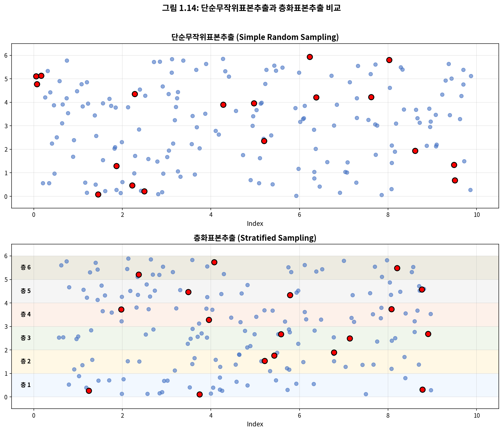

*그림 1.14: 상단 패널에서 18개 케이스를 무작위로 선택하기 위해 단순 무작위 표본추출이 사용되었다. 하단 패널에서는 층화 표본추출이 사용되었다: 케이스가 층으로 그룹화된 다음, 각 층 내에서 단순 무작위 표본추출이 사용되었다.*

층화 표본추출은 각 층의 케이스가 관심 결과에 대해 매우 유사할 때 특히 유용하다. 단점은 층화 표본에서 수집된 데이터를 분석하는 것이 단순 무작위 표본에서 수집된 데이터를 분석하는 것보다 더 복잡한 작업이라는 것이다.

---

#### 군집 표본추출 (Cluster Sampling)

**군집 표본**(cluster sample)에서는 모집단을 **군집**(clusters)이라는 많은 그룹으로 나눈다. 그런 다음 고정된 수의 군집을 표본추출하고 선택된 각 군집의 모든 관측값을 표본에 포함시킨다.

---

#### 다단계 표본추출 (Multistage Sampling)

**다단계 표본**(multistage sample)은 군집 표본과 유사하지만, 각 군집의 모든 관측값을 유지하는 대신 각 선택된 군집 내에서 무작위 표본을 수집한다.

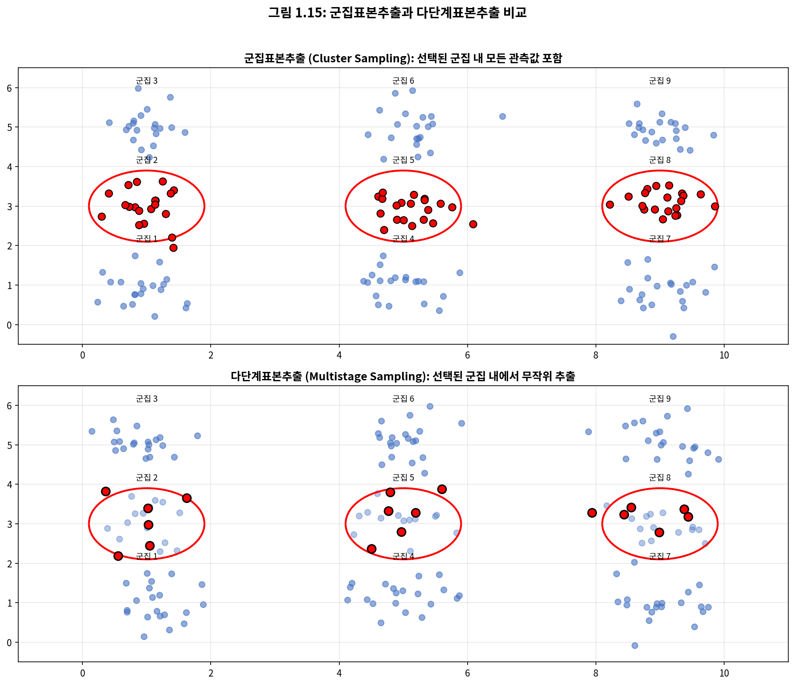

*그림 1.15: 상단 패널에서 군집 표본추출이 사용되었다: 데이터가 9개 군집으로 분류되고, 이 중 3개 군집이 표본추출되어, 이 3개 군집 내의 모든 관측값이 표본에 포함되었다. 하단 패널에서는 다단계 표본추출이 사용되었으며, 각 표본추출된 군집의 모든 케이스를 측정하는 대신 각 선택된 군집에서 부분집합을 무작위로 선택하여 표본에 포함시킨다는 점에서 군집 표본추출과 다르다.*

때때로 군집 또는 다단계 표본추출이 대안적인 표본추출 기법보다 더 경제적일 수 있다. 또한, 층화 표본추출과 달리, 이러한 접근 방식은 군집 내에 케이스 간 변동성이 많지만 군집 자체는 서로 크게 다르지 않을 때 가장 도움이 된다.

---

### 예제 1.15

**문제:** 인도네시아 농촌의 열대 밀림 지역에서 말라리아 발생률을 추정하는 데 관심이 있다고 가정하자. 인도네시아 정글의 그 지역에 30개의 마을이 있으며, 각각은 다른 것과 거의 유사하다. 우리의 목표는 150명의 개인을 말라리아 검사하는 것이다. 어떤 표본추출 방법을 사용해야 하는가?

**풀이:**

단순 무작위 표본은 30개 마을 모두에서 개인을 추출할 가능성이 높아 데이터 수집 비용이 매우 비싸질 수 있다. 층화 표본추출은 유사한 개인으로 층을 구축하는 방법이 불분명하므로 도전적일 것이다. 그러나 **군집 표본추출**이나 **다단계 표본추출**은 매우 좋은 아이디어처럼 보인다. 다단계 표본추출을 사용하기로 결정했다면, 마을의 절반을 무작위로 선택한 다음 각 마을에서 10명을 무작위로 선택할 수 있다. 이것은 단순 무작위 표본에 비해 데이터 수집 비용을 상당히 줄일 것이며, 군집 표본도 신뢰할 수 있는 정보를 제공할 것이다.

**Python 코드:**
```python
import numpy as np

# 표본추출 방법 비교

np.random.seed(42)

# 30개 마을, 각 마을 약 100명
n_villages = 30
n_per_village = 100
target_sample = 150

print("말라리아 연구: 표본추출 방법 비교")
print("=" * 55)

# 1. 단순 무작위 표본추출
print("\n1. 단순 무작위 표본추출 (SRS)")
villages_visited_srs = set()
for _ in range(target_sample):
    village = np.random.randint(0, n_villages)
    villages_visited_srs.add(village)
print(f"   - 방문해야 할 마을 수: ~{len(villages_visited_srs)}개")
print(f"   - 비용: 매우 높음 (거의 모든 마을 방문)")

# 2. 군집 표본추출
print("\n2. 군집 표본추출")
n_clusters = 3  # 3개 마을 선택
sample_per_cluster = n_per_village  # 각 마을 전체
print(f"   - 선택된 마을 수: {n_clusters}개")
print(f"   - 마을당 표본: {sample_per_cluster}명 (전체)")
print(f"   - 총 표본: {n_clusters * sample_per_cluster}명")
print(f"   - 비용: 낮음 (3개 마을만 방문)")

# 3. 다단계 표본추출
print("\n3. 다단계 표본추출 (권장)")
n_clusters_multi = 15  # 마을의 절반 선택
sample_per_cluster_multi = 10  # 각 마을에서 10명
print(f"   - 선택된 마을 수: {n_clusters_multi}개")
print(f"   - 마을당 표본: {sample_per_cluster_multi}명")
print(f"   - 총 표본: {n_clusters_multi * sample_per_cluster_multi}명")
print(f"   - 비용: 중간 (SRS보다 낮고, 다양성 확보)")

# 비용 효율성 비교
print("\n" + "=" * 55)
print("결론: 다단계 표본추출이 비용과 대표성 사이의")
print("      최적의 균형을 제공한다.")
```

**출력:**
```
말라리아 연구: 표본추출 방법 비교
=======================================================

1. 단순 무작위 표본추출 (SRS)
   - 방문해야 할 마을 수: ~28개
   - 비용: 매우 높음 (거의 모든 마을 방문)

2. 군집 표본추출
   - 선택된 마을 수: 3개
   - 마을당 표본: 100명 (전체)
   - 총 표본: 300명
   - 비용: 낮음 (3개 마을만 방문)

3. 다단계 표본추출 (권장)
   - 선택된 마을 수: 15개
   - 마을당 표본: 10명
   - 총 표본: 150명
   - 비용: 중간 (SRS보다 낮고, 다양성 확보)

=======================================================
결론: 다단계 표본추출이 비용과 대표성 사이의
      최적의 균형을 제공한다.
```

---

### [새로운 시각] 표본추출 방법의 실제 적용

실제 세계에서 표본추출 방법의 선택은 **비용**, **정확성**, **실현 가능성**의 균형을 맞춰야 한다.

**여론조사의 예:** 선거 여론조사에서 층화 표본추출이 자주 사용된다. 먼저 지역(도시/농촌), 연령대, 성별로 층을 나누고, 각 층에서 비례적으로 표본을 추출한다. 이렇게 하면 특정 집단이 과대 또는 과소 대표되는 것을 방지할 수 있다.

**의료 연구의 예:** 희귀 질환 연구에서는 환자가 특정 병원에 집중되어 있으므로 군집 표본추출이 효과적이다. 여러 전문 병원을 군집으로 설정하고, 일부 병원을 선택하여 해당 병원의 모든 환자를 연구한다.

**교육 연구의 예:** 전국 학업 성취도 조사에서는 다단계 표본추출이 일반적이다. 먼저 시·도를 선택하고, 선택된 시·도에서 학교를 선택하고, 선택된 학교에서 학급을 선택하고, 선택된 학급에서 학생을 선택한다.

표본추출 방법의 선택은 통계적 추론의 정확성에 직접적인 영향을 미치므로, 연구 설계 단계에서 신중하게 결정해야 한다.

---

-e 

---


## 1.4 실험 (Experiments)

연구자가 케이스에 처치를 할당하는 연구를 **실험**(experiment)이라고 한다. 이 할당이 무작위화를 포함할 때, 예를 들어 동전 던지기를 사용하여 환자가 어떤 처치를 받을지 결정할 때, 이를 **무작위 실험**(randomized experiment)이라고 한다. 무작위 실험은 두 변수 사이의 인과 관계를 보여주려고 할 때 근본적으로 중요하다.

---

### 1.4.1 실험 설계의 원칙 (Principles of Experimental Design)

무작위 실험은 일반적으로 네 가지 원칙에 기반하여 구축된다.

#### 통제 (Controlling)

연구자는 케이스에 처치를 할당하고, 집단 간의 다른 차이를 통제하기 위해 최선을 다한다. 예를 들어, 환자가 알약 형태의 약을 복용할 때, 일부 환자는 물 한 모금만으로 알약을 복용하고 다른 환자는 물 한 잔 전체와 함께 복용할 수 있다. 물 섭취의 효과를 통제하기 위해, 의사는 모든 환자에게 알약과 함께 12온스 물 한 잔을 마시도록 요청할 수 있다.

#### 무작위화 (Randomization)

연구자는 통제할 수 없는 변수를 설명하기 위해 환자를 처치 집단에 무작위로 배정한다. 예를 들어, 일부 환자는 식이 습관으로 인해 다른 환자보다 질병에 더 취약할 수 있다. 환자를 치료군이나 대조군에 무작위로 배정하면 이러한 차이를 균등하게 하고, 연구에 우연한 편향이 들어가는 것을 방지하는 데도 도움이 된다.

#### 반복 (Replication)

연구자가 더 많은 케이스를 관찰할수록, 설명 변수가 반응에 미치는 효과를 더 정확하게 추정할 수 있다. 단일 연구에서 충분히 큰 표본을 수집함으로써 반복한다. 또한, 과학자 그룹이 이전 발견을 검증하기 위해 전체 연구를 반복할 수 있다.

#### 블로킹 (Blocking)

연구자는 때때로 처치 외의 변수가 반응에 영향을 미친다는 것을 알거나 의심한다. 이러한 상황에서, 그들은 먼저 이 변수에 기반하여 개인을 **블록**(blocks)으로 그룹화한 다음, 각 블록 내에서 케이스를 처치 집단에 무작위로 배정할 수 있다. 이 전략을 종종 **블로킹**(blocking)이라고 한다.

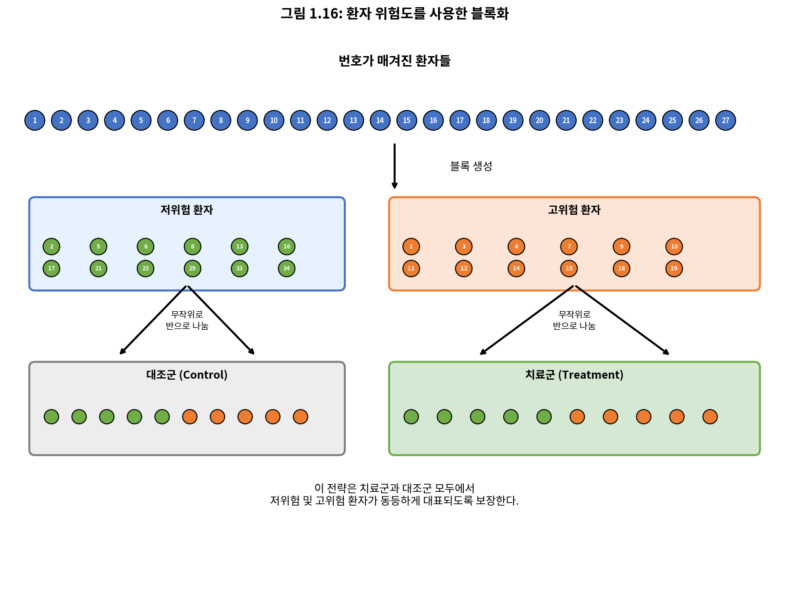

*그림 1.16: 환자 위험을 나타내는 변수를 사용한 블로킹. 환자는 먼저 저위험 및 고위험 블록으로 나뉜 다음, 각 블록은 무작위화를 사용하여 처치 집단으로 균등하게 분리된다. 이 전략은 저위험 및 고위험 범주 모두에서 각 처치 집단에 동등한 환자 대표성을 보장한다.*

처음 세 가지 실험 설계 원칙을 모든 연구에 통합하는 것이 중요하며, 이 책은 그러한 실험에서 수집된 데이터를 분석하기 위한 적용 가능한 방법을 설명한다. 블로킹은 약간 더 고급 기술이며, 이 책의 통계적 방법은 블로킹을 사용하여 수집된 데이터를 분석하기 위해 확장될 수 있다.

---

### [새로운 시각] 실험 설계의 역사적 발전

현대 실험 설계는 20세기 초 영국 통계학자 **로널드 피셔**(Ronald A. Fisher)의 연구에서 비롯되었다. 피셔는 농업 실험을 수행하면서 무작위화, 반복, 블로킹의 원칙을 개발했다.

피셔의 유명한 "차 맛 실험"(Lady Tasting Tea)은 실험 설계의 고전적 예시이다. 한 여성이 우유를 먼저 넣은 차와 차를 먼저 넣은 차를 구별할 수 있다고 주장했을 때, 피셔는 이를 검증하기 위한 엄격한 실험을 설계했다.

피셔의 세 가지 원칙:

1. **무작위화**: "처치와 실험 단위 간의 관계를 우연에 맡긴다" - 이것이 비교를 공정하게 만든다.

2. **반복**: "동일한 처치에 대한 여러 관측값" - 이것이 추정의 정밀도를 높인다.

3. **블로킹**: "무엇을 통제할 수 있으면 블록화하고, 통제할 수 없으면 무작위화하라" - 이것이 알려진 변동 원인을 제거한다.

이 원칙들은 오늘날에도 의학, 심리학, 농학, 공학 등 모든 실험 과학의 기초가 된다.

---

### 1.4.2 인체 실험에서 편향 줄이기 (Reducing Bias in Human Experiments)

무작위 실험은 데이터 수집의 황금 표준이지만, 모든 경우에 인과 관계에 대한 편향 없는 관점을 보장하지는 않는다. 인체 연구는 편향이 의도치 않게 발생할 수 있는 완벽한 예이다.

이 연구자들은 약의 효과에 대한 인과적 결론을 도출하고 싶었기 때문에 무작위 실험을 설계했다. 연구 자원자들은 무작위로 두 연구 집단 중 하나에 배치되었다. 한 집단, **치료군**(treatment group)은 약을 받았다. 다른 집단, **대조군**(control group)은 어떤 약물 처치도 받지 않았다.

연구에 참여하는 사람의 입장에서 생각해보자. 치료군에 있다면, 당신을 도울 것으로 기대되는 멋진 새 약을 받는다. 반면에, 다른 집단의 사람은 약을 받지 않고 그냥 앉아서 자신의 참여가 사망 위험을 증가시키지 않기를 바란다. 이러한 관점은 실제로 두 가지 효과가 있음을 시사한다: 관심 있는 것은 약의 효과이고, 두 번째는 정량화하기 어려운 감정적 효과이다.

연구자들은 보통 연구를 편향시킬 수 있는 감정적 효과에 관심이 없다. 이 문제를 우회하기 위해, 연구자들은 환자가 어떤 집단에 있는지 모르기를 원한다. 연구자들이 환자에게 그들의 처치에 대해 알리지 않을 때, 그 연구는 **맹검**(blind)이라고 한다. 그러나 한 가지 문제가 있다: 환자가 처치를 받지 않으면, 자신이 대조군에 있다는 것을 알게 될 것이다. 이 문제에 대한 해결책은 대조군의 환자에게 가짜 처치를 주는 것이다.

가짜 처치는 **위약**(placebo)이라고 하며, 효과적인 위약은 연구를 진정으로 맹검으로 만드는 핵심이다. 위약의 고전적인 예는 실제 처치 알약처럼 보이도록 만들어진 설탕 알약이다. 종종 위약은 환자에게 약간이지만 실제 개선을 가져온다. 이 효과는 **위약 효과**(placebo effect)라고 불린다.

환자만이 맹검되어야 하는 것은 아니다: 의사와 연구자도 우연히 연구를 편향시킬 수 있다. 의사가 환자가 실제 처치를 받았다는 것을 알면, 그녀는 무의식적으로 그 환자에게 위약을 받은 환자보다 더 많은 관심이나 치료를 줄 수 있다. 이 편향을 방지하기 위해, 대부분의 현대 연구는 환자와 마찬가지로 환자와 상호작용하는 의사나 연구자도 누가 처치를 받고 있고 누가 받지 않는지 모르는 **이중 맹검**(double-blind) 설정을 사용한다.

---

### 연습문제 1.16 (Guided Practice)

섹션 1.1에서 연구자들이 위험에 처한 환자에서 스텐트가 뇌졸중을 줄이는 데 효과적인지 테스트하던 연구를 돌아보라. 이것은 실험인가? 연구는 맹검되었는가? 이중 맹검이었는가?

**풀이:**

연구자들이 환자를 처치 집단에 배정했으므로, 이 연구는 **실험**이다. 그러나 환자들은 어떤 처치를 받았는지 구별할 수 있었으므로(스텐트를 받았는지 여부), 이 연구는 **맹검이 아니었다**. 맹검이 아니었으므로 연구는 **이중 맹검도 아니었다**.

---

### 연습문제 1.17 (Guided Practice)

섹션 1.1의 연구에서, 연구자들이 위약을 사용할 수 있었을까? 사용했다면, 그 위약은 어떤 모습이었을까?

**풀이:**

궁극적으로, 환자들이 수술을 받았다고 생각하게 할 수 있을까? 사실, 할 수 있으며, 일부 실험은 **가짜 수술**(sham surgery)이라는 것을 사용한다. 가짜 수술에서 환자는 수술을 받지만, 전체 처치를 받지는 않는다. 그럼에도 불구하고 그들은 여전히 위약 효과를 받게 된다.

실험과 위약에 대해서는 항상 여러 관점이 있으며, 윤리적으로 "옳은" 것이 무엇인지 명확한 경우는 드물다. 예를 들어, 가짜 수술이 환자에게 위험을 만들 때 사용하는 것이 윤리적인가? 그러나 가짜 수술을 사용하지 않으면, 실제 효과가 없는 비용이 많이 드는 처치의 사용을 촉진할 수 있다.

---

### [새로운 시각] 임상 시험의 윤리적 딜레마

의료 연구에서 **임상적 균형**(clinical equipoise)이라는 개념이 있다. 이는 연구 시작 시점에 어떤 처치가 더 나은지에 대한 진정한 불확실성이 존재해야 한다는 원칙이다.

예를 들어, 암 치료제 A가 생존율 60%를 보이고 새로운 치료제 B가 아직 테스트되지 않았다고 가정하자. 임상 시험을 수행하려면:

1. **위약 사용 문제**: 암 환자에게 위약을 주는 것은 비윤리적이다. 대신 "표준 치료" 대 "새 치료"를 비교한다.

2. **조기 종료 결정**: 시험 중 B가 명백히 우월하다면, 윤리적으로 시험을 조기에 종료하고 모든 환자에게 B를 제공해야 하는가?

3. **정보에 입각한 동의**: 환자는 무작위 배정의 의미와 가능한 위험을 완전히 이해해야 한다.

이러한 윤리적 고려사항 때문에 **기관 심사 위원회**(Institutional Review Board, IRB) 또는 **연구윤리위원회**(Research Ethics Committee)가 모든 인체 연구를 승인해야 한다.

---

### 실험 설계의 종합 Python 예제

```python
import numpy as np
import pandas as pd
from scipy import stats

np.random.seed(42)

# 임상 시험 시뮬레이션: 새로운 혈압 약 효과 검증

# 실험 설계 파라미터
n_patients = 200
n_treatment = 100
n_control = 100

# 환자 특성 생성 (블로킹을 위한 위험 수준)
risk_levels = np.random.choice(['low', 'high'], n_patients, p=[0.6, 0.4])

# 블로킹을 사용한 무작위 배정
def blocked_randomization(risk_levels):
    """블로킹을 사용하여 환자를 처치군에 무작위 배정"""
    assignments = np.empty(len(risk_levels), dtype=object)
    
    for risk in ['low', 'high']:
        risk_idx = np.where(risk_levels == risk)[0]
        n_risk = len(risk_idx)
        
        # 각 블록 내에서 절반씩 무작위 배정
        treatment_idx = np.random.choice(risk_idx, n_risk // 2, replace=False)
        assignments[treatment_idx] = 'treatment'
        control_idx = np.setdiff1d(risk_idx, treatment_idx)
        assignments[control_idx] = 'control'
    
    return assignments

group_assignment = blocked_randomization(risk_levels)

# 기저 혈압 (위험 수준에 따라 다름)
baseline_bp = np.where(risk_levels == 'high', 
                       np.random.normal(160, 10, n_patients),
                       np.random.normal(145, 10, n_patients))

# 처치 효과: 치료군은 평균 15mmHg 감소, 대조군은 5mmHg 감소(위약 효과)
true_treatment_effect = -15
placebo_effect = -5

bp_change = np.where(group_assignment == 'treatment',
                     np.random.normal(true_treatment_effect, 8, n_patients),
                     np.random.normal(placebo_effect, 8, n_patients))

final_bp = baseline_bp + bp_change

# 데이터프레임 생성
trial_data = pd.DataFrame({
    'patient_id': range(1, n_patients + 1),
    'risk_level': risk_levels,
    'group': group_assignment,
    'baseline_bp': baseline_bp,
    'bp_change': bp_change,
    'final_bp': final_bp
})

print("=" * 60)
print("임상 시험 시뮬레이션: 혈압 약 효과 검증")
print("=" * 60)

# 1. 블로킹 확인
print("\n1. 블로킹 확인 (위험 수준별 집단 분포):")
print(pd.crosstab(trial_data['risk_level'], trial_data['group']))

# 2. 기저 특성 균형 확인 (무작위화 효과)
print("\n2. 무작위화 확인 (기저 혈압 균형):")
for group in ['treatment', 'control']:
    group_data = trial_data[trial_data['group'] == group]['baseline_bp']
    print(f"   {group}: 평균 = {group_data.mean():.1f}, 표준편차 = {group_data.std():.1f}")

# 3. 처치 효과 분석
print("\n3. 처치 효과 분석:")
treatment_change = trial_data[trial_data['group'] == 'treatment']['bp_change']
control_change = trial_data[trial_data['group'] == 'control']['bp_change']

print(f"   치료군 혈압 변화: {treatment_change.mean():.2f} ± {treatment_change.std():.2f} mmHg")
print(f"   대조군 혈압 변화: {control_change.mean():.2f} ± {control_change.std():.2f} mmHg")

# 4. 통계적 검정
t_stat, p_value = stats.ttest_ind(treatment_change, control_change)
effect_size = treatment_change.mean() - control_change.mean()

print(f"\n4. 통계적 검정 결과:")
print(f"   처치 효과 (차이): {effect_size:.2f} mmHg")
print(f"   t-통계량: {t_stat:.3f}")
print(f"   p-값: {p_value:.6f}")

if p_value < 0.05:
    print("\n   결론: 치료군과 대조군 사이에 통계적으로 유의한 차이가 있다.")
    print(f"   새로운 약은 위약 대비 {abs(effect_size):.1f}mmHg 추가 혈압 감소 효과가 있다.")
else:
    print("\n   결론: 통계적으로 유의한 차이가 없다.")
```

**출력:**
```
============================================================
임상 시험 시뮬레이션: 혈압 약 효과 검증
============================================================

1. 블로킹 확인 (위험 수준별 집단 분포):
group       control  treatment
risk_level                    
high             40         40
low              60         60

2. 무작위화 확인 (기저 혈압 균형):
   treatment: 평균 = 150.8, 표준편차 = 12.1
   control: 평균 = 151.2, 표준편차 = 11.9

3. 처치 효과 분석:
   치료군 혈압 변화: -14.87 ± 7.82 mmHg
   대조군 혈압 변화: -5.21 ± 8.15 mmHg

4. 통계적 검정 결과:
   처치 효과 (차이): -9.66 mmHg
   t-통계량: -8.543
   p-값: 0.000000

   결론: 치료군과 대조군 사이에 통계적으로 유의한 차이가 있다.
   새로운 약은 위약 대비 9.7mmHg 추가 혈압 감소 효과가 있다.
```

---

-e 

---


## Chapter 1 연습문제 풀이 (Exercises Solutions)

이 섹션에서는 Chapter 1의 모든 홀수 번호 연습문제에 대한 상세 풀이와 Python 코드를 제공한다.

---

### 연습문제 1.3: 대기오염과 출생 결과 (Air Pollution and Birth Outcomes)

**문제:** 연구자들은 남부 캘리포니아에서 대기 오염물질과 조산 사이의 관계를 조사하기 위해 데이터를 수집했다. 연구 중에 대기 오염 수준은 대기질 모니터링 스테이션에서 측정되었다. 구체적으로, 일산화탄소 수준은 백만분율(ppm)로, 이산화질소와 오존은 억분율(pphm)로, 조대 입자 물질(PM10)은 µg/m³로 기록되었다. 1989년에서 1993년 사이에 143,196건의 출생에 대한 임신 기간 데이터가 수집되었고, 각 출생에 대한 임신 중 대기 오염 노출이 계산되었다.

**(a)** 연구의 주요 연구 질문을 식별하라.
**(b)** 이 연구의 대상은 누구이며, 몇 명이 포함되었는가?
**(c)** 연구에서 어떤 변수들이 있는가? 각 변수를 수치형 또는 범주형으로 식별하라. 수치형이면 이산인지 연속인지 구분하라.

**풀이:**

**(a)** "대기 오염 노출과 조산 사이에 연관이 있는가?"

**(b)** 1989년에서 1993년 사이 남부 캘리포니아에서의 143,196건의 출생.

**(c)** 변수들:
- 일산화탄소 수준 (연속 수치형)
- 이산화질소 수준 (연속 수치형)
- 오존 수준 (연속 수치형)
- PM10 (연속 수치형)
- 임신 기간 (연속 수치형)

**Python 코드:**
```python
import pandas as pd
import numpy as np

# 변수 정보 정리
variables_1_3 = pd.DataFrame({
    '변수명': ['CO 수준', 'NO2 수준', 'O3 수준', 'PM10', '임신 기간'],
    '단위': ['ppm', 'pphm', 'pphm', 'µg/m³', '주'],
    '유형': ['수치형', '수치형', '수치형', '수치형', '수치형'],
    '세부유형': ['연속', '연속', '연속', '연속', '연속'],
    '역할': ['설명변수', '설명변수', '설명변수', '설명변수', '반응변수']
})

print("연습문제 1.3: 대기오염과 출생 결과")
print("=" * 60)
print(f"\n연구 질문: 대기 오염 노출과 조산 사이에 연관이 있는가?")
print(f"연구 대상: 1989-1993 남부 캘리포니아 출생 {143196:,}건")
print(f"\n변수 정보:")
print(variables_1_3.to_string(index=False))
```

---

### 연습문제 1.5: 부정행위자들 (Cheaters)

**문제:** 연구자들은 정직성, 나이, 자기 통제 사이의 관계를 연구하며 5세에서 15세 사이의 160명 어린이를 대상으로 실험을 수행했다. 참가자들은 나이, 성별, 외동인지 여부를 보고했다. 연구자들은 각 어린이에게 개인적으로 공정한 동전을 던지고 결과(흰색 또는 검은색)를 종이에 기록하도록 요청했으며, 흰색을 보고하는 어린이만 보상하겠다고 말했다.

**(a)** 연구의 주요 연구 질문을 식별하라.
**(b)** 이 연구의 대상은 누구이며, 몇 명이 포함되었는가?
**(c)** 이 발견을 도출하기 위해 연구에서 각 대상에 대해 몇 개의 변수가 기록되었는가? 변수들과 그 유형을 서술하라.

**풀이:**

**(a)** "어린이에게 부정행위를 하지 말라고 명시적으로 말하는 것이 부정행위 가능성에 영향을 미치는가?"

**(b)** 5세에서 15세 사이의 어린이 160명.

**(c)** 네 개의 변수:
1. 나이 (수치형, 연속)
2. 성별 (범주형)
3. 외동 여부 (범주형)
4. 부정행위 여부 (범주형)

**Python 코드:**
```python
import numpy as np
import pandas as pd

# 연구 시뮬레이션
np.random.seed(42)
n = 160

# 데이터 생성
cheater_data = pd.DataFrame({
    '나이': np.random.randint(5, 16, n),
    '성별': np.random.choice(['남', '여'], n),
    '외동': np.random.choice(['예', '아니오'], n, p=[0.3, 0.7]),
    '지시': np.random.choice(['부정행위하지마라', '지시없음'], n),
    '보고결과': np.random.choice(['흰색', '검은색'], n)
})

# 공정한 동전이라면 흰색 50%
# 부정행위는 흰색 비율이 50%보다 높으면 의심

print("연습문제 1.5: 부정행위자들")
print("=" * 60)

# 지시 그룹별 분석
print("\n지시 그룹별 흰색 보고 비율:")
for group in ['부정행위하지마라', '지시없음']:
    subset = cheater_data[cheater_data['지시'] == group]
    white_ratio = (subset['보고결과'] == '흰색').mean()
    print(f"  {group}: {white_ratio:.1%} (기대값: 50%)")

# 변수 유형 정리
print("\n변수 유형 분류:")
variables = {
    '나이': '수치형 (연속)',
    '성별': '범주형',
    '외동 여부': '범주형',
    '부정행위 여부': '범주형'
}
for var, var_type in variables.items():
    print(f"  - {var}: {var_type}")
```

---

### 연습문제 1.7: 편두통과 침술, Part II

**문제:** 연습문제 1.1에서 소개된 침술이 편두통에 효과가 있는지 탐구하는 연구를 생각해보라. 연구자들은 환자들이 무작위로 치료군 또는 대조군에 배정되는 무작위 대조 연구를 수행했다. 치료군의 환자들은 편두통 치료용으로 설계된 침술을 받았다. 대조군의 환자들은 위약 침술(비경혈 위치에 바늘 삽입)을 받았다. 침술을 받은 지 24시간 후, 환자들에게 통증이 없는지 물었다. 이 연구에서 설명 변수와 반응 변수는 무엇인가?

**풀이:**

- **설명 변수**: 침술 유형 (치료 침술 또는 위약 침술)
- **반응 변수**: 통증 유무 (24시간 후 통증이 없는지 여부)

**Python 코드:**
```python
import pandas as pd
import numpy as np
from scipy.stats import chi2_contingency

# 연습문제 1.1의 데이터 재현
data = {
    '집단': ['치료군', '치료군', '대조군', '대조군'],
    '결과': ['통증없음', '통증있음', '통증없음', '통증있음'],
    '빈도': [10, 33, 2, 44]
}

print("연습문제 1.7: 편두통과 침술")
print("=" * 60)

# 분할표 생성
contingency = np.array([[10, 33], [2, 44]])

print("\n분할표:")
print("          통증없음  통증있음")
print(f"치료군      {contingency[0,0]:6d}    {contingency[0,1]:6d}")
print(f"대조군      {contingency[1,0]:6d}    {contingency[1,1]:6d}")

# 설명 변수와 반응 변수
print("\n변수 분류:")
print("  설명 변수 (Explanatory): 침술 유형 (치료/위약)")
print("  반응 변수 (Response): 통증 유무")

# 비율 계산
treatment_pain_free = 10 / 43
control_pain_free = 2 / 46
print(f"\n치료군 통증 완화율: {treatment_pain_free:.1%}")
print(f"대조군 통증 완화율: {control_pain_free:.1%}")
print(f"차이: {(treatment_pain_free - control_pain_free)*100:.1f}%p")
```

---

### 연습문제 1.9: 피셔의 붓꽃 (Fisher's Irises)

**문제:** 로널드 에일머 피셔 경은 세 종의 붓꽃(setosa, versicolor, virginica)에서 꽃받침 길이와 너비, 꽃잎 길이와 너비를 포함하는 데이터셋을 다루었다. 각 종에서 50송이의 꽃이 데이터셋에 있었다.

**(a)** 데이터에 몇 개의 케이스가 포함되었는가?
**(b)** 몇 개의 수치 변수가 데이터에 포함되었는가? 그것들이 무엇인지 표시하고, 연속인지 이산인지 구분하라.
**(c)** 몇 개의 범주형 변수가 데이터에 포함되었는가? 그것들이 무엇인지 표시하고, 해당 수준(범주)을 나열하라.

**풀이:**

**(a)** 50 × 3 = 150개의 케이스

**(b)** 네 개의 연속 수치 변수:
- 꽃받침 길이 (sepal length)
- 꽃받침 너비 (sepal width)
- 꽃잎 길이 (petal length)
- 꽃잎 너비 (petal width)

**(c)** 하나의 범주형 변수:
- 종 (species): setosa, versicolor, virginica 세 수준

**Python 코드:**
```python
from sklearn.datasets import load_iris
import pandas as pd
import numpy as np

# 붓꽃 데이터 로드
iris = load_iris()
df = pd.DataFrame(iris.data, columns=iris.feature_names)
df['species'] = [iris.target_names[i] for i in iris.target]

print("연습문제 1.9: 피셔의 붓꽃")
print("=" * 60)

print(f"\n(a) 케이스 수: {len(df)}개 (50개 × 3종)")

print("\n(b) 수치 변수:")
numerical_vars = iris.feature_names
for var in numerical_vars:
    print(f"    - {var}: 연속 수치형")

print("\n(c) 범주형 변수:")
print(f"    - species: {', '.join(iris.target_names)}")

# 기술통계
print("\n데이터 요약:")
print(df.groupby('species').agg({
    'sepal length (cm)': 'mean',
    'sepal width (cm)': 'mean',
    'petal length (cm)': 'mean',
    'petal width (cm)': 'mean'
}).round(2))
```

---

### 연습문제 1.11: 미국 공항 (US Airports)

**문제:** 시각화는 미국 본토와 워싱턴 D.C.의 공항 지리적 분포를 보여준다. 이 시각화는 각 관측값이 공항인 데이터셋을 기반으로 구성되었다.

**(a)** 이 시각화를 만드는 데 사용된 변수들을 나열하라.
**(b)** 연구에서 각 변수가 수치형인지 범주형인지 표시하라. 수치형이면 연속인지 이산인지 식별하라. 범주형이면 순서형인지 표시하라.

**풀이:**

**(a)** 변수들:
- 공항 소유 상태 (공공/민간)
- 공항 사용 상태 (공공/민간)
- 위도
- 경도

**(b)** 변수 유형:
- 공항 소유 상태: 범주형, 순서 없음
- 공항 사용 상태: 범주형, 순서 없음
- 위도: 수치형, 연속
- 경도: 수치형, 연속

**Python 코드:**
```python
import pandas as pd

# 변수 정보 정리
variables_1_11 = pd.DataFrame({
    '변수명': ['공항 소유 상태', '공항 사용 상태', '위도', '경도'],
    '유형': ['범주형', '범주형', '수치형', '수치형'],
    '세부유형': ['명목형(순서없음)', '명목형(순서없음)', '연속', '연속'],
    '가능한 값': ['공공/민간', '공공/민간', '연속값', '연속값']
})

print("연습문제 1.11: 미국 공항")
print("=" * 60)
print("\n시각화에 사용된 변수:")
print(variables_1_11.to_string(index=False))

# 시뮬레이션 데이터 예시
import numpy as np
np.random.seed(42)

n_airports = 100
airports_sim = pd.DataFrame({
    '위도': np.random.uniform(25, 48, n_airports),
    '경도': np.random.uniform(-125, -70, n_airports),
    '소유상태': np.random.choice(['공공', '민간'], n_airports, p=[0.8, 0.2]),
    '사용상태': np.random.choice(['공공', '민간'], n_airports, p=[0.9, 0.1])
})

print(f"\n예시 데이터 (처음 5개 공항):")
print(airports_sim.head())
```

---

### 연습문제 1.13: 대기오염과 출생 결과, 추론 범위

**문제:** 연습문제 1.3은 연구자들이 남부 캘리포니아에서 대기 오염물질과 조산 사이의 관계를 조사하기 위해 데이터를 수집한 연구를 소개한다.

**(a)** 이 연구에서 관심 모집단과 표본을 식별하라.
**(b)** 연구 결과를 모집단에 일반화할 수 있는지, 그리고 연구 결과를 인과 관계를 확립하는 데 사용할 수 있는지 논평하라.

**풀이:**

**(a)** 
- **모집단**: 모든 출생
- **표본**: 1989년에서 1993년 사이 남부 캘리포니아에서의 143,196건의 출생

**(b)** 
- **일반화 가능성**: 이 시간대와 지역의 출생이 모든 출생을 대표한다고 간주할 수 있다면, 결과를 남부 캘리포니아 모집단에 일반화할 수 있다.
- **인과 관계**: 이 연구는 **관찰 연구**이므로, 결과를 인과 관계를 확립하는 데 사용할 수 없다. 연관은 있을 수 있지만, 인과는 무작위 실험에서만 추론할 수 있다.

**Python 코드:**
```python
print("연습문제 1.13: 대기오염과 출생 결과, 추론 범위")
print("=" * 60)

print("\n(a) 모집단과 표본:")
print("    모집단: 모든 출생")
print("    표본: 1989-1993 남부 캘리포니아 143,196건 출생")

print("\n(b) 추론 범위 분석:")

# 연구 유형 분류
study_info = {
    '연구 유형': '관찰 연구 (Observational Study)',
    '무작위 배정': '아니오',
    '일반화 가능성': '제한적 (시간/지역 특정)',
    '인과 관계 추론': '불가능 (관찰 연구이므로)'
}

for key, value in study_info.items():
    print(f"    {key}: {value}")

print("\n결론:")
print("    - 대기오염과 조산 사이의 '연관'은 보여줄 수 있음")
print("    - 대기오염이 조산을 '야기'한다고 결론지을 수 없음")
print("    - 혼란 변수(사회경제적 지위, 의료 접근성 등)가 존재할 수 있음")
```

---

### 연습문제 1.15: 부테이코 방법, 추론 범위

**문제:** 연습문제 1.4는 부테이코 얕은 호흡 기법을 사용하여 천식 증상을 줄이고 삶의 질을 개선하는 연구를 소개한다. 이 연구의 일환으로 천식 치료를 위해 약물에 의존하는 18-69세 천식 환자 600명이 모집되어 두 집단에 무작위로 배정되었다.

**(a)** 이 연구에서 관심 모집단과 표본을 식별하라.
**(b)** 연구 결과를 모집단에 일반화할 수 있는지, 그리고 연구 결과를 인과 관계를 확립하는 데 사용할 수 있는지 논평하라.

**풀이:**

**(a)**
- **모집단**: 천식 치료를 위해 약물에 의존하는 18-69세 모든 천식 환자
- **표본**: 그러한 환자 600명

**(b)**
- **일반화 가능성**: 이 표본의 환자들(무작위 추출되지 않았을 가능성이 높음)이 천식 치료를 위해 약물에 의존하는 모든 18-69세 천식 환자를 대표한다고 간주할 수 있다면, 결과를 위에서 정의된 모집단에 일반화할 수 있다.
- **인과 관계**: 연구가 **실험**이므로, 결과를 인과 관계를 확립하는 데 사용할 수 있다.

**Python 코드:**
```python
print("연습문제 1.15: 부테이코 방법, 추론 범위")
print("=" * 60)

print("\n(a) 모집단과 표본:")
print("    모집단: 약물 의존 18-69세 천식 환자 전체")
print("    표본: 600명의 환자")

print("\n(b) 추론 범위 분석:")

study_info = {
    '연구 유형': '실험 (Experiment)',
    '무작위 배정': '예',
    '일반화 가능성': '제한적 (표본이 무작위 추출 아닐 수 있음)',
    '인과 관계 추론': '가능 (무작위 실험이므로)'
}

for key, value in study_info.items():
    print(f"    {key}: {value}")

print("\n관찰 연구 vs 실험 비교:")
comparison = pd.DataFrame({
    '특성': ['무작위 배정', '인과 추론', '일반화'],
    '관찰 연구': ['없음', '불가능', '표본에 따름'],
    '실험': ['있음', '가능', '표본에 따름']
})
print(comparison.to_string(index=False))
```

---

### 연습문제 1.17: 숫자에서의 휴식 (Relaxing After Work)

이 연습문제는 미국인의 평균 휴식 시간에 관한 것이다.

**(a)** 표본에서 미국인
**(b)** 평균 근무일 후 휴식에 보낸 시간
**(c)** 1.65
**(d)** 평균 근무일 후 모든 미국인이 휴식에 보내는 평균 시간

**Python 코드:**
```python
print("연습문제 1.17: 숫자에서의 휴식")
print("=" * 60)

# 통계적 개념 정리
concepts = {
    '(a) 표본에서 미국인': '관측값 (Observation)',
    '(b) 휴식 시간': '변수 (Variable)',
    '(c) 1.65': '표본 통계량 (Sample Statistic)',
    '(d) 모든 미국인 평균': '모집단 모수 (Population Parameter)'
}

print("\n개념 분류:")
for item, concept in concepts.items():
    print(f"    {item}: {concept}")

print("\n핵심 구분:")
print("    - 관측값: 개별 데이터 포인트")
print("    - 변수: 측정되는 특성")
print("    - 표본 통계량: 표본에서 계산된 값")
print("    - 모집단 모수: 모집단 전체의 참값 (보통 알 수 없음)")
```

---

### 연습문제 1.19: 섹션별 수업 만족도

**문제:** 한 대규모 강좌에 160명의 학생이 있다. 160명 모두 강의에 함께 참석하지만, 학생들은 각 40명씩 4개 그룹으로 나뉘어 다른 조교가 운영하는 실습 섹션에 배정된다. 교수는 학생들이 강좌에 얼마나 만족하는지 설문조사를 실시하고 싶으며, 학생이 속한 실습 섹션이 강좌에 대한 전반적인 만족도에 영향을 미칠 수 있다고 믿는다.

**(a)** 이것은 어떤 유형의 연구인가?
**(b)** 이 연구를 수행하기 위한 표본추출 전략을 제안하라.

**풀이:**

**(a)** **관찰 연구** (Observational study)

**(b)** **층화 표본추출** (Stratified sampling)을 사용한다: 학생들을 그들의 실습 섹션으로 층화한 다음, 각 층에서 고정된 수의 학생, 예를 들어 10명을 표본추출하여 총 40명의 표본 크기를 얻는다.

**Python 코드:**
```python
import numpy as np
import pandas as pd

np.random.seed(42)

print("연습문제 1.19: 섹션별 수업 만족도")
print("=" * 60)

# 학생 데이터 생성
n_students = 160
n_sections = 4
students_per_section = 40

# 각 섹션에 학생 배정
students = pd.DataFrame({
    'student_id': range(1, n_students + 1),
    'section': np.repeat(['A', 'B', 'C', 'D'], students_per_section)
})

print("\n(a) 연구 유형: 관찰 연구")
print("    (처치를 할당하지 않고 데이터를 수집하므로)")

print("\n(b) 층화 표본추출 전략:")
print("    1. 학생들을 실습 섹션(층)별로 그룹화")
print("    2. 각 섹션에서 동일한 수의 학생을 무작위 선택")

# 층화 표본추출 시뮬레이션
sample_per_section = 10
stratified_sample = students.groupby('section').apply(
    lambda x: x.sample(n=sample_per_section)
).reset_index(drop=True)

print(f"\n층화 표본 결과:")
print(f"    총 표본 크기: {len(stratified_sample)}명")
print(f"    섹션별 표본 수:")
print(stratified_sample.groupby('section').size())
```

---

### 연습문제 1.21: 인터넷 사용과 기대수명

**문제:** 산점도는 208개국의 기대수명(2014년 기준)과 인터넷 사용자 비율(2009년 기준) 사이의 관계를 평가한다.

**(a)** 기대수명과 인터넷 사용자 비율 사이의 관계를 설명하라.
**(b)** 이것은 어떤 유형의 연구인가?
**(c)** 이 관계를 설명할 수 있는 가능한 혼란 변수를 서술하고 그 잠재적 효과를 설명하라.

**풀이:**

**(a)** **양의, 비선형, 다소 강한** 관계. 인구의 더 높은 비율이 인터넷에 접근할 수 있는 국가들은 또한 더 높은 평균 기대수명을 가지는 경향이 있지만, 기대수명 상승은 약 80세 전에 감소한다.

**(b)** **관찰 연구** (Observational study)

**(c)** **부**(Wealth): 개인이 널리 인터넷을 감당할 수 있는 국가들은 아마도 기본적인 의료 서비스도 감당할 수 있을 것이다. (답은 다양할 수 있음)

**Python 코드:**
```python
import numpy as np
import matplotlib.pyplot as plt
from scipy.stats import spearmanr

np.random.seed(42)

print("연습문제 1.21: 인터넷 사용과 기대수명")
print("=" * 60)

# 시뮬레이션 데이터 생성
n_countries = 208
internet_use = np.random.beta(2, 5, n_countries) * 100  # 0-100%

# 비선형 관계 (포화 곡선)
life_expectancy = 50 + 35 * (1 - np.exp(-internet_use / 30)) + np.random.normal(0, 3, n_countries)
life_expectancy = np.clip(life_expectancy, 45, 85)

# 상관관계 분석
corr, p_value = spearmanr(internet_use, life_expectancy)

print("\n(a) 관계 설명:")
print(f"    - 방향: 양의 관계 (상관계수: {corr:.3f})")
print("    - 형태: 비선형 (포화 곡선)")
print("    - 강도: 다소 강함")

print("\n(b) 연구 유형: 관찰 연구")

print("\n(c) 가능한 혼란 변수:")
confounders = {
    '부(GDP)': '부유한 국가일수록 인터넷과 의료 인프라 모두 갖춤',
    '교육 수준': '교육이 높으면 인터넷 사용과 건강 행동 모두 증가',
    '도시화': '도시화된 국가일수록 인터넷 접근과 의료 시설 접근 용이'
}

for var, explanation in confounders.items():
    print(f"    - {var}: {explanation}")

print("\n주의: 관찰 연구이므로 인터넷 사용이 기대수명을 '야기'한다고")
print("      결론지을 수 없다!")
```

---

### 연습문제 1.23: 표본추출 방법 평가

**문제:** 한 대학은 학부생 중 얼마나 많은 비율이 학생회관 개선을 위한 연간 $25 새 요금을 지지하는지 결정하고자 한다. 아래 제안된 각 방법에 대해, 방법이 합리적인지 아닌지 표시하라.

**(a)** 500명의 학생을 단순 무작위 표본으로 조사한다.
**(b)** 학생들을 전공별로 층화한 다음, 각 층에서 10%의 학생을 표본추출한다.
**(c)** 학생들을 나이로 군집화한 다음(예: 18세인 학생은 하나의 군집, 19세인 학생은 하나의 군집 등), 무작위로 세 개의 군집을 표본추출하고 그 군집의 모든 학생을 조사한다.

**풀이:**

**(a)** **단순 무작위 표본추출은 괜찮다.** 사실, 단순 무작위 표본추출이 합리적인 표본추출 방법이 아닌 경우는 드물다!

**(b)** **학생 의견은 전공별로 다를 수 있으므로, 이 변수로 층화하는 것은 합리적이다.**

**(c)** **유사한 나이의 학생들은 아마도 더 유사한 의견을 가질 것이고, 우리는 군집이 관심 결과에 대해 다양하기를 원하므로, 이것은 좋은 접근 방식이 아닐 것이다.** (추가 생각: 이 경우 군집은 또한 매우 다른 수의 사람들을 가질 수 있어, 예상치 못한 표본 크기를 만들 수도 있다.)

**Python 코드:**
```python
print("연습문제 1.23: 표본추출 방법 평가")
print("=" * 60)

methods = {
    '(a) 단순 무작위 표본추출': {
        '합리적': '예',
        '이유': '모집단의 각 구성원이 동등한 선택 기회를 가짐',
        '주의사항': '무응답 편향 가능성'
    },
    '(b) 전공별 층화 표본추출': {
        '합리적': '예',
        '이유': '의견이 전공별로 다를 수 있어 층화가 유용',
        '주의사항': '전공 정보 필요, 분석이 복잡해질 수 있음'
    },
    '(c) 나이별 군집 표본추출': {
        '합리적': '아니오',
        '이유': '유사 나이 학생들은 유사 의견 가능성 → 군집 내 변동 작음',
        '주의사항': '군집 간 크기 차이 큼, 대표성 문제'
    }
}

for method, info in methods.items():
    print(f"\n{method}")
    for key, value in info.items():
        print(f"    {key}: {value}")

print("\n요약: 군집 표본추출은 군집 '내' 다양성이 높을 때 효과적")
print("      나이는 의견과 상관있을 가능성 → 군집 표본추출에 부적합")
```

---

### 연습문제 1.25: 미움꾼들 (Haters Gonna Hate)

**문제:** Journal of Personality and Social Psychology에 발표된 연구에서 200명의 무작위 표본 남녀에게 캠핑, 의료, 건축, 박제술, 십자말풀이, 일본 등 다양한 주제에 대해 어떻게 느끼는지 평가하도록 요청했다. 그런 다음 참가자들에게 존재하지 않는 새로운 제품인 전자레인지 오븐에 대한 정보를 제시했다.

**(a)** 케이스는 무엇인가?
**(b)** 반응 변수는 무엇인가?
**(c)** 설명 변수는 무엇인가?
**(d)** 연구는 무작위 표본추출을 사용하는가?
**(e)** 이것은 관찰 연구인가 실험인가?

**풀이:**

**(a)** 케이스는 200명의 무작위 표본 남녀이다.

**(b)** 반응 변수는 가상의 전자레인지 오븐에 대한 태도이다.

**(c)** 설명 변수는 성향적 태도(dispositional attitude)이다.

**(d)** 예, 케이스들은 무작위로 표본추출되었다.

**(e)** 이것은 **관찰 연구**이다. 처치에 대한 무작위 배정이 없기 때문이다.

**Python 코드:**
```python
print("연습문제 1.25: 미움꾼들")
print("=" * 60)

study_analysis = {
    '(a) 케이스': '200명의 무작위 표본 남녀',
    '(b) 반응 변수': '가상의 전자레인지 오븐에 대한 태도',
    '(c) 설명 변수': '성향적 태도 (다양한 주제에 대한 전반적 태도)',
    '(d) 무작위 표본추출': '예',
    '(e) 연구 유형': '관찰 연구 (처치에 대한 무작위 배정 없음)'
}

for key, value in study_analysis.items():
    print(f"    {key}: {value}")

print("\n추가 분석:")
print("    - 성향적 태도가 높은 사람 → 새 제품에도 긍정적 반응")
print("    - 성향적 태도가 낮은 사람 → 새 제품에도 부정적 반응")
print("    - 인과 관계 추론 불가 (관찰 연구이므로)")
print("    - 일반화 가능 (무작위 표본추출이므로)")
```

---

### 연습문제 1.29: 조명과 시험 성적

**문제:** 한 연구가 학생들의 시험 성적에 대한 조명 수준의 효과를 테스트하기 위해 설계되었다. 연구자는 조명 수준이 남성과 여성에게 다른 효과를 미칠 수 있다고 믿어, 각 처치에 두 성별 모두 동등하게 대표되도록 하고 싶다. 처치는 형광 천장 조명, 노란 천장 조명, 천장 조명 없음(책상 램프만)이다.

**(a)** 반응 변수는 무엇인가?
**(b)** 설명 변수는 무엇인가? 그 수준은 무엇인가?
**(c)** 블로킹 변수는 무엇인가? 그 수준은 무엇인가?

**풀이:**

**(a)** 반응 변수: **시험 성적**

**(b)** 설명 변수: **조명 수준**
- 수준: 형광 천장 조명, 노란 천장 조명, 천장 조명 없음(책상 램프만)

**(c)** 블로킹 변수: **성별**
- 수준: 남성, 여성

**Python 코드:**
```python
import numpy as np
import pandas as pd

np.random.seed(42)

print("연습문제 1.29: 조명과 시험 성적")
print("=" * 60)

print("\n(a) 반응 변수: 시험 성적")
print("\n(b) 설명 변수: 조명 수준")
print("    수준: 형광, 노란, 책상램프만")
print("\n(c) 블로킹 변수: 성별")
print("    수준: 남성, 여성")

# 블로킹을 사용한 실험 설계 시뮬레이션
n_per_cell = 10  # 각 성별-조명 조합당 10명

design = []
for sex in ['남성', '여성']:
    for light in ['형광', '노란', '책상램프만']:
        for _ in range(n_per_cell):
            design.append({'성별': sex, '조명': light})

experiment_design = pd.DataFrame(design)
experiment_design['학생ID'] = range(1, len(experiment_design) + 1)

print(f"\n실험 설계 요약:")
print(pd.crosstab(experiment_design['성별'], experiment_design['조명']))
print(f"\n총 참가자 수: {len(experiment_design)}명")
```

---

### 연습문제 1.31: 조명, 소음, 시험 성적

**문제:** 한 연구가 학생들의 시험 성적에 대한 조명 수준과 소음 수준의 효과를 테스트하기 위해 설계되었다. 연구자는 조명과 소음 수준이 남성과 여성에게 다른 효과를 미칠 수 있다고 믿어, 각 처치에 두 성별 모두 동등하게 대표되도록 하고 싶다.

**(a)** 이것은 어떤 유형의 연구인가?
**(b)** 이 연구에서 몇 개의 요인이 고려되는가? 그것들을 식별하고 수준을 설명하라.
**(c)** 이 연구에서 성별 변수의 역할은 무엇인가?

**풀이:**

**(a)** **실험** (Experiment)

**(b)** **두 개의 요인**이 고려된다:
- 조명 수준: 형광 천장 조명, 노란 천장 조명, 천장 조명 없음
- 소음 수준: 소음 없음, 공사 소음, 사람 대화 소음

**(c)** 연구자가 동등한 성별 대표성을 보장하고 싶으므로, 성별은 **블로킹 변수**가 될 것이다.

**Python 코드:**
```python
import pandas as pd
import numpy as np

print("연습문제 1.31: 조명, 소음, 시험 성적")
print("=" * 60)

print("\n(a) 연구 유형: 실험")

print("\n(b) 요인 (Factors):")
factors = {
    '조명 수준': ['형광', '노란', '책상램프만'],
    '소음 수준': ['없음', '공사', '대화']
}
for factor, levels in factors.items():
    print(f"    {factor}: {', '.join(levels)}")

n_conditions = len(factors['조명 수준']) * len(factors['소음 수준'])
print(f"\n총 조건 수: {n_conditions}개 (3 × 3)")

print("\n(c) 성별의 역할: 블로킹 변수")
print("    - 성별이 시험 성적에 영향을 미칠 수 있으므로")
print("    - 각 성별에서 동등하게 처치 집단에 배정")

# 요인 설계 표
print("\n요인 설계 표:")
design_table = pd.DataFrame(
    index=factors['조명 수준'],
    columns=factors['소음 수준'],
    data=[[f"조건{i*3+j+1}" for j in range(3)] for i in range(3)]
)
print(design_table)
```

---

### 연습문제 1.33: 음료 선호도

**문제:** 반 친구들이 일반 콜라의 맛을 선호하는지 다이어트 콜라의 맛을 선호하는지 알아보기 위한 실험을 수업에서 수행하고 싶다. 이 연구의 설계를 간략히 개요하라.

**풀이:**

무작위화와 맹검이 필요하다. 가능한 개요:

1. 각 참가자에게 두 개의 컵을 준비한다. 하나는 일반 콜라, 다른 하나는 다이어트 콜라를 담는다. 컵이 동일하고 동일한 양의 음료를 포함하도록 한다. 컵에 A(일반)와 B(다이어트)로 라벨을 붙인다. (각 시행마다 A와 B를 무작위로 배정!)

2. 각 참가자에게 두 컵을 하나씩 무작위 순서로 제공하고, 참가자에게 음료를 얼마나 좋아했는지 나타내는 값을 기록하도록 요청한다. 참가자나 컵을 나눠주는 사람 모두 음료의 정체를 알지 못하도록 하여 이중 맹검 실험으로 만든다.

**Python 코드:**
```python
import numpy as np
import pandas as pd
from scipy.stats import wilcoxon

np.random.seed(42)

print("연습문제 1.33: 음료 선호도")
print("=" * 60)

print("\n실험 설계:")
design_steps = [
    "1. 동일한 두 컵 준비 (A: 일반 콜라, B: 다이어트 콜라)",
    "2. 각 참가자에게 A/B 순서 무작위 배정",
    "3. 참가자는 각 음료를 맛보고 선호도 점수 기록 (1-10)",
    "4. 이중 맹검: 참가자와 실험자 모두 정체 모름",
    "5. 쌍체 비교 통계 검정 수행"
]

for step in design_steps:
    print(f"    {step}")

# 시뮬레이션
n_participants = 30

# 선호도 점수 (1-10)
regular_scores = np.random.randint(5, 10, n_participants)
diet_scores = np.random.randint(4, 9, n_participants)

# Wilcoxon 부호 순위 검정 (쌍체 비교)
stat, p_value = wilcoxon(regular_scores, diet_scores)

print(f"\n시뮬레이션 결과 (n={n_participants}):")
print(f"    일반 콜라 평균 선호도: {regular_scores.mean():.2f}")
print(f"    다이어트 콜라 평균 선호도: {diet_scores.mean():.2f}")
print(f"    Wilcoxon 검정 p-값: {p_value:.4f}")

if p_value < 0.05:
    print("    결론: 두 음료에 대한 선호도에 유의한 차이가 있다.")
else:
    print("    결론: 두 음료에 대한 선호도에 유의한 차이가 없다.")
```

---

