# 제2장 데이터 요약

이 장에서는 요약 통계량과 그래프를 구성하고 작성하는 방법에 초점을 맞춘다. 이 장과 이 책에서 제시하는 요약과 그래프를 생성하기 위해 통계 소프트웨어를 사용한다. 그러나 이것이 여러분의 첫 번째 통계 접촉일 수 있으므로, 이 장에서는 그것들을 어떻게 만드는지 자세히 설명하는 데 시간을 할애한다. 이 장에서 제시된 내용을 숙달하는 것은 이 책의 나머지 부분에서 소개되는 방법과 기법을 이해하는 데 매우 중요하다.

**이 장의 구성:**
- 2.1 수치형 데이터 분석
- 2.2 범주형 데이터 다루기
- 2.3 사례 연구: 말라리아 백신

---

## 2.1 수치형 데이터 분석

이 절에서는 수치형 변수를 요약하는 기법을 탐구한다. 예를 들어, loan50 데이터셋의 대출 금액(loan amount) 변수를 고려해 보자. 이 변수는 데이터셋에 있는 50개 대출 모두의 대출 규모를 나타낸다. 두 대출 규모의 수치적 차이를 합리적으로 논의할 수 있으므로 이 변수는 수치형이다. 반면에 지역 코드나 우편번호는 수치형이 아니라 범주형 변수이다.

이 절과 다음 절 전체에서 loan50과 county 데이터셋을 사용하여 이러한 방법을 적용한다. 이 데이터셋들은 1.2절에서 소개되었다.

---

### 2.1.1 짝지어진 데이터를 위한 산점도

**산점도**(scatterplot)는 두 개의 수치형 변수에 대한 데이터를 케이스별로 보여준다. 그림 2.1은 loan50 데이터셋에서 차용인의 총소득(total income)과 그들이 빌린 금액(loan amount)을 비교하는 산점도를 보여준다. 모든 산점도에서 각 점은 하나의 케이스를 나타낸다. loan50에는 50개의 케이스가 있으므로 그림 2.1에는 50개의 점이 있다.

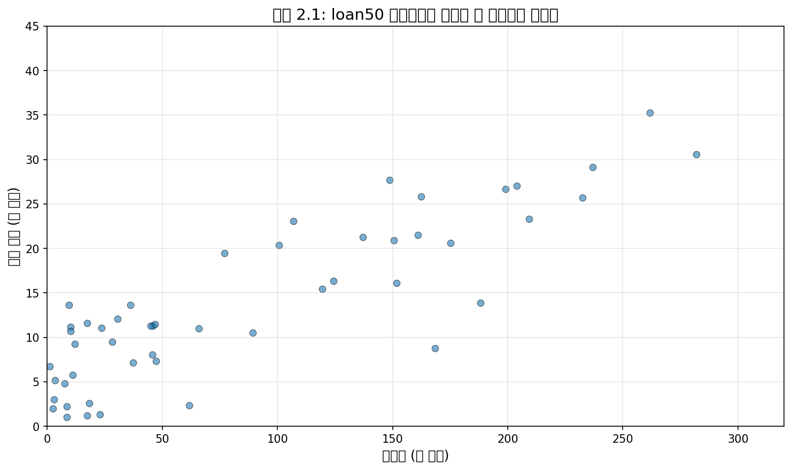

그림 2.1을 보면, 그래프 왼쪽에는 소득이 $100,000 미만인 차용인이 많고, 소득이 $250,000 이상인 차용인은 소수임을 알 수 있다.

---

#### 예제 2.1

**문제:** 그림 2.2는 3,142개 카운티에 대한 가구 중위소득과 빈곤율의 산점도를 보여준다. 이 변수들 간의 관계에 대해 무엇을 말할 수 있는가?

**풀이:** 이 관계는 점선이 강조하듯이 명백히 비선형적이다. 이것은 우리가 이전에 본 산점도들과 다르며, 그것들은 추세에 곡률을 거의 또는 전혀 보이지 않는 관계를 보여주었다.

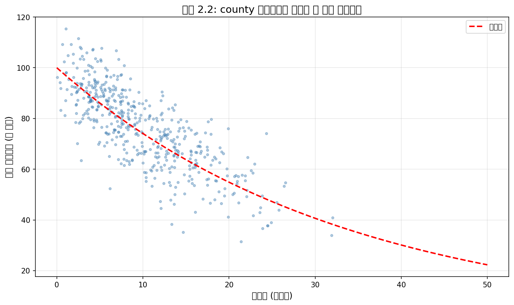

**Python 코드:**

```python
import numpy as np
import matplotlib.pyplot as plt
from scipy.optimize import curve_fit

# 데이터 시뮬레이션 (실제 county 데이터와 유사)
np.random.seed(123)
n_counties = 500
poverty_rate = np.random.beta(2, 8, n_counties) * 50
median_income = 100000 * np.exp(-0.03 * poverty_rate) + np.random.normal(0, 10000, n_counties)
median_income = np.clip(median_income, 10000, 130000)

# 산점도 그리기
plt.figure(figsize=(10, 6))
plt.scatter(poverty_rate, median_income/1000, alpha=0.4, s=10, c='steelblue')

# 추세선 추가
x_fit = np.linspace(0, 50, 100)
y_fit = 100 * np.exp(-0.03 * x_fit)
plt.plot(x_fit, y_fit, 'r--', linewidth=2, label='추세선 (비선형)')

plt.xlabel('빈곤율 (퍼센트)')
plt.ylabel('가구 중위소득 (천 달러)')
plt.title('그림 2.2: 빈곤율과 가구 중위소득의 관계')
plt.legend()
plt.grid(True, alpha=0.3)
plt.show()

# 상관계수 계산
correlation = np.corrcoef(poverty_rate, median_income)[0, 1]
print(f"피어슨 상관계수: {correlation:.4f}")
# 결과: 음의 상관관계가 나타남 (비선형적 관계)
```

---

#### Guided Practice 2.2

**문제:** 산점도는 데이터에 대해 무엇을 보여주며, 어떻게 유용한가?

**풀이:** 답은 다양할 수 있다. 산점도는 변수들 간의 연관성을 빠르게 파악하는 데 유용하다. 이러한 연관성이 단순한 추세의 형태로 나타나든, 더 복잡한 관계의 형태로 나타나든 마찬가지이다.

**Python 코드로 확인:**

```python
import numpy as np
import matplotlib.pyplot as plt

# 다양한 관계 유형 시각화
fig, axes = plt.subplots(2, 2, figsize=(12, 10))

np.random.seed(42)
n = 100

# 1. 양의 선형 관계
x1 = np.random.uniform(0, 10, n)
y1 = 2 * x1 + np.random.normal(0, 2, n)
axes[0, 0].scatter(x1, y1, alpha=0.6)
axes[0, 0].set_title('양의 선형 관계')
axes[0, 0].set_xlabel('X'); axes[0, 0].set_ylabel('Y')

# 2. 음의 선형 관계
x2 = np.random.uniform(0, 10, n)
y2 = -1.5 * x2 + 20 + np.random.normal(0, 2, n)
axes[0, 1].scatter(x2, y2, alpha=0.6)
axes[0, 1].set_title('음의 선형 관계')
axes[0, 1].set_xlabel('X'); axes[0, 1].set_ylabel('Y')

# 3. 비선형 관계
x3 = np.random.uniform(0, 10, n)
y3 = x3**2 + np.random.normal(0, 5, n)
axes[1, 0].scatter(x3, y3, alpha=0.6)
axes[1, 0].set_title('비선형 관계 (이차)')
axes[1, 0].set_xlabel('X'); axes[1, 0].set_ylabel('Y')

# 4. 관계 없음
x4 = np.random.uniform(0, 10, n)
y4 = np.random.uniform(0, 10, n)
axes[1, 1].scatter(x4, y4, alpha=0.6)
axes[1, 1].set_title('관계 없음')
axes[1, 1].set_xlabel('X'); axes[1, 1].set_ylabel('Y')

plt.tight_layout()
plt.show()
```

---

#### Guided Practice 2.3

**문제:** 산점도에서 말굽 모양(∩ 또는 ∪) 연관성을 가지는 두 변수를 설명하라.

**풀이:** 수직축이 "좋은 것"을 나타내고 수평축이 적당한 양에서만 좋은 것을 나타내는 경우를 생각해 보라. 건강과 물 섭취량이 이 설명에 맞는다: 생존을 위해 어느 정도의 물이 필요하지만, 너무 많이 마시면 독성이 되어 사람을 죽일 수 있다.

**Python 코드:**

```python
import numpy as np
import matplotlib.pyplot as plt

# 말굽 모양 관계 시각화 (역U자형)
np.random.seed(42)
x = np.linspace(0, 10, 200)
y = -0.5 * (x - 5)**2 + 12.5 + np.random.normal(0, 1.5, 200)

plt.figure(figsize=(10, 6))
plt.scatter(x, y, alpha=0.6, c='steelblue')
plt.xlabel('물 섭취량 (리터/일)')
plt.ylabel('건강 지표')
plt.title('말굽 모양 관계: 적당한 양이 가장 좋음')
plt.axvline(x=5, color='red', linestyle='--', label='최적점')
plt.legend()
plt.grid(True, alpha=0.3)
plt.show()

print("물을 너무 적게 마시면 탈수, 너무 많이 마시면 물중독 위험")
```

---

### 🔍 새로운 시각: 산점도의 철학적 의미

산점도는 단순한 시각화 도구 이상의 의미를 가진다. 19세기 영국의 통계학자 프랜시스 골턴(Francis Galton)이 처음 체계적으로 사용한 이후, 산점도는 변수 간 관계를 탐색하는 가장 강력한 도구 중 하나로 자리잡았다.

**핵심 통찰:**
1. **상관관계 ≠ 인과관계**: 산점도에서 강한 패턴이 보인다고 해서 한 변수가 다른 변수를 "일으킨다"고 결론 내릴 수 없다.
2. **심슨의 역설 주의**: 전체 데이터에서 보이는 관계가 하위 그룹에서는 반대로 나타날 수 있다.
3. **이상치의 영향**: 극단적인 점 하나가 전체 관계의 인상을 바꿀 수 있으므로 항상 이상치를 확인해야 한다.

---

### 2.1.2 점도표와 평균

때로는 두 변수가 하나 너무 많을 수 있다: 오직 하나의 변수만 관심 대상일 수 있다. 이러한 경우, **점도표**(dot plot)가 가장 기본적인 표시를 제공한다. 점도표는 일변량 산점도이다. 50개 대출의 이자율을 사용한 예가 그림 2.3에 나와 있다. 이 점도표의 누적 버전이 그림 2.4에 나와 있다.

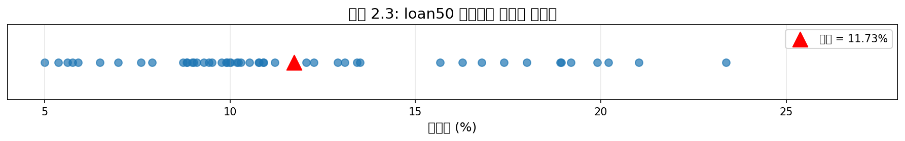

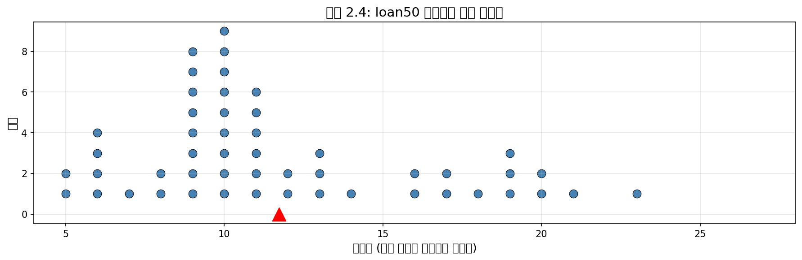

**평균**(mean)은 흔히 평균값(average)이라고 불리며, 데이터 분포의 중심을 측정하는 일반적인 방법이다. 평균 이자율을 계산하기 위해 모든 이자율을 더하고 관측치 수로 나눈다:

$$\bar{x} = \frac{10.90\% + 9.92\% + 26.30\% + \cdots + 6.08\%}{50} = 11.57\%$$

표본 평균은 흔히 $\bar{x}$로 표기한다. 문자 x는 관심 변수인 이자율의 일반적인 자리 표시자로 사용되고, x 위의 막대는 평균 이자율을 보고 있음을 나타내며, 이 50개 대출에서 11.57%였다. 평균을 분포의 균형점으로 생각하는 것이 유용하며, 그림 2.3과 2.4에서 삼각형으로 표시되어 있다.

> **평균**
> 
> 표본 평균은 관측값의 합을 관측치 수로 나누어 계산할 수 있다:
> 
> $$\bar{x} = \frac{x_1 + x_2 + \cdots + x_n}{n}$$
> 
> 여기서 $x_1, x_2, \ldots, x_n$은 n개의 관측값을 나타낸다.

---

#### Guided Practice 2.4

**문제:** 평균에 대한 공식을 살펴보라. $x_1$은 무엇에 해당하는가? $x_2$는? $x_i$가 무엇을 나타내는지 일반적인 의미를 추론할 수 있는가?

**풀이:** $x_1$은 표본의 첫 번째 대출에 대한 이자율(10.90%)에 해당하고, $x_2$는 두 번째 대출의 이자율(9.92%)에 해당하며, $x_i$는 데이터셋의 i번째 대출에 대한 이자율에 해당한다. 예를 들어, i = 4이면, $x_4$를 검토하고 있는 것이며, 이는 데이터셋의 네 번째 관측치를 나타낸다.

**Python 코드:**

```python
import numpy as np

# loan50 이자율 데이터 (예시)
interest_rates = np.array([
    10.90, 9.92, 26.30, 9.43, 9.92, 
    6.08, 17.09, 6.08, 13.59, 13.49,
    14.08, 13.32, 9.43, 9.44, 5.31,
    6.08, 19.42, 14.53, 11.99, 9.99,
    18.45, 7.34, 6.08, 5.32, 21.45,
    7.59, 13.75, 11.48, 7.09, 9.93,
    9.93, 9.93, 10.42, 10.90, 6.08,
    11.71, 6.08, 19.24, 9.43, 6.08,
    19.03, 12.61, 6.62, 6.08, 9.93,
    12.61, 6.08, 8.90, 6.08, 8.59
])

# 개별 원소 접근
print(f"x₁ = {interest_rates[0]}%")  # 첫 번째 관측치
print(f"x₂ = {interest_rates[1]}%")  # 두 번째 관측치
print(f"x₄ = {interest_rates[3]}%")  # 네 번째 관측치
print(f"x₅₀ = {interest_rates[49]}%")  # 50번째 관측치

# 표본 크기
n = len(interest_rates)
print(f"\n표본 크기 n = {n}")

# 평균 계산 (수동 방식)
manual_mean = sum(interest_rates) / n
print(f"\n수동 계산 평균: {manual_mean:.2f}%")

# NumPy 함수 사용
numpy_mean = np.mean(interest_rates)
print(f"NumPy 평균: {numpy_mean:.2f}%")
```

---

#### Guided Practice 2.5

**문제:** 이 대출 표본에서 n은 얼마였는가?

**풀이:** 표본 크기는 n = 50이었다.

---

#### 예제 2.6

**문제:** 모집단의 모든 대출에 대한 평균 이자율은 표본 데이터를 사용하여 추정할 수 있다. 50개 대출 표본을 기반으로, 전체 데이터셋의 모든 대출에 대한 평균 이자율 $\mu_x$의 합리적인 추정치는 무엇인가?

**풀이:** 표본 평균 11.57%는 $\mu_x$의 대략적인 추정치를 제공한다. 완벽하지는 않지만, 이것은 연구 중인 모집단의 모든 대출의 평균 이자율에 대한 우리의 최선의 단일 추측이다.

5장 이후에서는 표본 평균과 같은 점추정치의 정확성을 특성화하는 도구를 개발할 것이다. 짐작할 수 있듯이, 더 큰 표본에 기반한 점추정치가 더 작은 표본에 기반한 것보다 더 정확한 경향이 있다.

**Python 코드:**

```python
import numpy as np

# 표본 데이터
sample_interest_rates = np.array([
    10.90, 9.92, 26.30, 9.43, 9.92, 6.08, 17.09, 6.08, 13.59, 13.49,
    14.08, 13.32, 9.43, 9.44, 5.31, 6.08, 19.42, 14.53, 11.99, 9.99,
    18.45, 7.34, 6.08, 5.32, 21.45, 7.59, 13.75, 11.48, 7.09, 9.93,
    9.93, 9.93, 10.42, 10.90, 6.08, 11.71, 6.08, 19.24, 9.43, 6.08,
    19.03, 12.61, 6.62, 6.08, 9.93, 12.61, 6.08, 8.90, 6.08, 8.59
])

# 표본 평균 계산
sample_mean = np.mean(sample_interest_rates)
print(f"표본 평균 (x̄): {sample_mean:.2f}%")
print(f"이것은 모집단 평균 (μ)의 추정치이다.")

# 표준오차 계산 (추정치의 불확실성)
std_error = np.std(sample_interest_rates, ddof=1) / np.sqrt(len(sample_interest_rates))
print(f"\n표준오차: {std_error:.2f}%")
print(f"95% 신뢰구간 (근사): ({sample_mean - 1.96*std_error:.2f}%, {sample_mean + 1.96*std_error:.2f}%)")
```

---

#### 예제 2.7

**문제:** 평균은 측정치를 더 쉽게 해석하고 비교할 수 있는 것으로 재척도화하거나 표준화할 수 있게 해주기 때문에 유용하다. 평균이 비교를 위해 유용한 2가지 예를 제시하라.

**풀이:**

**1. 신약과 표준 약물 비교:**
천식 발작 치료에 새 약이 표준 약보다 더 효과적인지 알고 싶다. 1500명의 성인을 대상으로 임상시험을 설정하고, 500명은 새 약을, 1000명은 대조군에서 표준 약을 받는다:

| | 새 약 | 표준 약 |
|---|---|---|
| 환자 수 | 500 | 1000 |
| 총 천식 발작 수 | 200 | 300 |

200 대 300의 원시 카운트를 비교하면 새 약이 더 좋아 보이지만, 이것은 불균형한 그룹 크기의 산물이다. 대신, 각 그룹에서 환자당 평균 천식 발작 수를 보아야 한다:

- 새 약: 200/500 = 0.4
- 표준 약: 300/1000 = 0.3

표준 약이 처치군의 평균보다 환자당 평균 천식 발작 수가 더 낮다.

**2. 에밀리오의 푸드트럭 사업:**
에밀리오는 작년에 부리토를 파는 푸드트럭을 열었고, 지난 3개월 동안 사업이 안정되었다. 그 3개월 동안 625시간을 일하면서 $11,000를 벌었다. 에밀리오의 평균 시간당 수입은 그의 사업이 적어도 재정적 관점에서 가치가 있는지 평가하는 데 유용한 통계를 제공한다:

$$\frac{\$11,000}{625 \text{시간}} = \$17.60 \text{/시간}$$

**Python 코드:**

```python
import numpy as np

# 예제 1: 신약 비교
print("=== 예제 1: 신약 vs 표준 약 ===")
new_drug_patients = 500
new_drug_attacks = 200
standard_drug_patients = 1000
standard_drug_attacks = 300

new_drug_rate = new_drug_attacks / new_drug_patients
standard_drug_rate = standard_drug_attacks / standard_drug_patients

print(f"새 약 - 환자당 평균 발작 수: {new_drug_rate:.2f}")
print(f"표준 약 - 환자당 평균 발작 수: {standard_drug_rate:.2f}")
print(f"결론: 표준 약이 더 효과적 ({standard_drug_rate:.2f} < {new_drug_rate:.2f})")

# 예제 2: 에밀리오의 시간당 수입
print("\n=== 예제 2: 에밀리오의 푸드트럭 ===")
total_earnings = 11000
total_hours = 625

hourly_rate = total_earnings / total_hours
print(f"총 수입: ${total_earnings:,}")
print(f"총 근무 시간: {total_hours}시간")
print(f"평균 시간당 수입: ${hourly_rate:.2f}")

# 다른 직업과 비교
min_wage = 7.25
avg_wage = 25.00
print(f"\n비교:")
print(f"  최저임금: ${min_wage:.2f}/시간")
print(f"  에밀리오: ${hourly_rate:.2f}/시간")
print(f"  평균 임금: ${avg_wage:.2f}/시간")
```

---

#### 예제 2.8

**문제:** 미국에서 1인당 평균 소득을 계산하고 싶다고 가정하자. 그렇게 하기 위해, 먼저 county 데이터셋의 3,142개 카운티에 걸쳐 1인당 소득의 평균을 구하는 것을 생각할 수 있다. 더 나은 접근법은 무엇인가?

**풀이:** county 데이터셋은 각 카운티가 실제로 많은 개인을 대표한다는 점에서 특별하다. 단순히 소득 변수에 걸쳐 평균을 구하면, 5,000명의 거주민이 있는 카운티와 5,000,000명의 거주민이 있는 카운티를 계산에서 동등하게 취급하게 된다. 대신, 각 카운티의 총 소득을 계산하고, 모든 카운티의 합계를 더한 다음, 모든 카운티의 사람 수로 나누어야 한다.

county 데이터로 이러한 단계를 완료하면, 미국의 1인당 소득이 $30,861임을 알게 될 것이다. 카운티에 걸쳐 1인당 소득의 단순 평균을 계산했다면, 결과는 단지 $26,093이었을 것이다!

이 예제는 **가중 평균**(weighted mean)이라고 불리는 것을 사용했다.

**Python 코드:**

```python
import numpy as np

# 가상의 카운티 데이터
np.random.seed(42)
n_counties = 100

# 각 카운티의 인구와 1인당 소득
populations = np.random.exponential(100000, n_counties).astype(int)
per_capita_incomes = np.random.normal(28000, 8000, n_counties)
per_capita_incomes = np.clip(per_capita_incomes, 15000, 60000)

# 단순 평균 (잘못된 방법)
simple_mean = np.mean(per_capita_incomes)
print(f"단순 평균 (잘못된 방법): ${simple_mean:,.2f}")

# 가중 평균 (올바른 방법)
total_income = np.sum(populations * per_capita_incomes)
total_population = np.sum(populations)
weighted_mean = total_income / total_population
print(f"가중 평균 (올바른 방법): ${weighted_mean:,.2f}")

print(f"\n차이: ${weighted_mean - simple_mean:,.2f}")
print(f"차이 비율: {(weighted_mean - simple_mean) / simple_mean * 100:.2f}%")

# NumPy 가중 평균 함수 사용
np_weighted_mean = np.average(per_capita_incomes, weights=populations)
print(f"\nNumPy 가중 평균: ${np_weighted_mean:,.2f}")
```

---

### 🔍 새로운 시각: 평균의 기하학적 해석

평균을 "균형점"으로 이해하는 것은 매우 직관적이다. 물리학적으로, 데이터 점들을 막대 위의 무게라고 생각하면, 평균은 막대가 수평으로 균형을 이루는 지점이다.

**핵심 통찰:**
1. **지렛대 원리**: 평균에서 멀리 있는 값은 더 큰 "토크"를 행사하여 평균을 자신 쪽으로 끌어당긴다.
2. **이상치 민감성**: 이 때문에 평균은 극단값에 민감하다. 빌 게이츠가 방에 들어오면 방 안 사람들의 평균 자산은 급격히 증가한다.
3. **중위수와의 비교**: 중위수는 "위치적 중심"이고, 평균은 "질량적 중심"이다.

```python
import numpy as np
import matplotlib.pyplot as plt

# 평균의 균형점 시각화
data = np.array([2, 3, 4, 5, 6, 15])  # 이상치 15 포함
mean = np.mean(data)
median = np.median(data)

plt.figure(figsize=(12, 4))
plt.plot(data, [0]*len(data), 'bo', markersize=15)
plt.axvline(mean, color='red', linestyle='-', linewidth=3, label=f'평균 = {mean:.1f}')
plt.axvline(median, color='green', linestyle='--', linewidth=3, label=f'중위수 = {median:.1f}')
plt.xlabel('값')
plt.title('평균은 균형점: 이상치가 평균을 끌어당김')
plt.legend()
plt.xlim(0, 18)
plt.show()

print(f"이상치(15) 제거 시 평균: {np.mean(data[:-1]):.2f}")
```

---

### 2.1.3 히스토그램과 형태

점도표는 각 관측치의 정확한 값을 보여준다. 이것은 작은 데이터셋에 유용하지만, 더 큰 표본에서는 읽기 어려워질 수 있다. 각 관측치의 값을 보여주는 대신, 값이 구간(bin)에 속하는 것으로 생각하는 것을 선호한다.

예를 들어, loan50 데이터셋에서 이자율이 5.0%에서 7.5% 사이인 대출 수, 그 다음 7.5%에서 10.0% 사이인 대출 수 등에 대한 카운트 테이블을 만들었다. 구간의 경계에 있는 관측치(예: 10.00%)는 낮은 구간에 할당된다.

| 이자율 | 5.0% - 7.5% | 7.5% - 10.0% | 10.0% - 12.5% | 12.5% - 15.0% | ... | 25.0% - 27.5% |
|---|---|---|---|---|---|---|
| 카운트 | 11 | 15 | 8 | 4 | ... | 1 |

이렇게 구간화된 카운트는 **히스토그램**(histogram)이라고 불리는 것에서 막대로 그려진다.

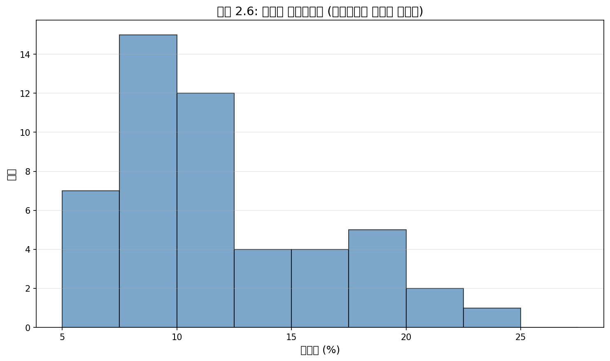

히스토그램은 데이터 밀도의 뷰를 제공한다. 더 높은 막대는 데이터가 상대적으로 더 흔한 곳을 나타낸다. 예를 들어, 데이터셋에서 5%와 10% 사이의 이자율을 가진 대출이 20%와 25% 사이의 이자율을 가진 대출보다 훨씬 많다.

히스토그램은 데이터 분포의 **형태**(shape)를 이해하는 데 특히 편리하다. 그림 2.6은 대부분의 대출이 15% 미만의 이자율을 가지고 있고, 20% 이상의 이자율을 가진 대출은 소수에 불과함을 시사한다. 데이터가 이런 식으로 오른쪽으로 늘어지고 더 긴 오른쪽 꼬리를 가질 때, 형태는 **오른쪽으로 치우침**(right skewed)이라고 한다.

반대 특성을 가진 데이터셋 – 왼쪽으로 길고 얇은 꼬리 – 는 **왼쪽으로 치우침**(left skewed)이라고 한다. 양쪽 방향으로 대략 동등하게 늘어지는 데이터셋은 **대칭적**(symmetric)이라고 한다.

> **긴 꼬리로 치우침 식별하기**
> 
> 데이터가 한 방향으로 늘어지면, 분포는 긴 꼬리를 가진다. 분포가 긴 왼쪽 꼬리를 가지면, 왼쪽으로 치우친 것이다. 분포가 긴 오른쪽 꼬리를 가지면, 오른쪽으로 치우친 것이다.

**Python 코드:**

```python
import numpy as np
import matplotlib.pyplot as plt

# loan50 이자율 데이터
interest_rates = np.array([
    10.90, 9.92, 26.30, 9.43, 9.92, 6.08, 17.09, 6.08, 13.59, 13.49,
    14.08, 13.32, 9.43, 9.44, 5.31, 6.08, 19.42, 14.53, 11.99, 9.99,
    18.45, 7.34, 6.08, 5.32, 21.45, 7.59, 13.75, 11.48, 7.09, 9.93,
    9.93, 9.93, 10.42, 10.90, 6.08, 11.71, 6.08, 19.24, 9.43, 6.08,
    19.03, 12.61, 6.62, 6.08, 9.93, 12.61, 6.08, 8.90, 6.08, 8.59
])

# 히스토그램 그리기
fig, axes = plt.subplots(1, 2, figsize=(14, 5))

# 구간화된 카운트
bins = np.arange(5, 28, 2.5)
counts, bin_edges = np.histogram(interest_rates, bins=bins)

# 테이블 출력
print("구간화된 이자율 데이터:")
for i in range(len(counts)):
    print(f"  {bin_edges[i]:.1f}% - {bin_edges[i+1]:.1f}%: {counts[i]}개")

# 히스토그램
axes[0].hist(interest_rates, bins=bins, edgecolor='black', alpha=0.7, color='steelblue')
axes[0].set_xlabel('이자율 (%)')
axes[0].set_ylabel('빈도')
axes[0].set_title('히스토그램: 오른쪽으로 치우친 분포')
axes[0].axvline(np.mean(interest_rates), color='red', linestyle='--', 
                label=f'평균 = {np.mean(interest_rates):.2f}%')
axes[0].axvline(np.median(interest_rates), color='green', linestyle='-', 
                label=f'중위수 = {np.median(interest_rates):.2f}%')
axes[0].legend()

# 밀도 히스토그램
axes[1].hist(interest_rates, bins=bins, edgecolor='black', alpha=0.7, 
             color='steelblue', density=True)
axes[1].set_xlabel('이자율 (%)')
axes[1].set_ylabel('밀도')
axes[1].set_title('밀도 히스토그램')

plt.tight_layout()
plt.show()

# 치우침 정도 계산
from scipy.stats import skew
skewness = skew(interest_rates)
print(f"\n치우침(skewness): {skewness:.2f}")
print("양수 = 오른쪽으로 치우침, 음수 = 왼쪽으로 치우침")
```

---

#### Guided Practice 2.9

**문제:** 그림 2.3과 2.4의 점도표를 살펴보라. 데이터의 치우침을 볼 수 있는가? 이 히스토그램에서 치우침을 보는 것이 더 쉬운가, 점도표에서 더 쉬운가?

**풀이:** 치우침은 세 플롯 모두에서 볼 수 있지만, 평평한 점도표가 가장 덜 유용하다. 누적 점도표와 히스토그램은 치우침을 식별하는 데 유용한 시각화이다.

---

#### Guided Practice 2.10

**문제:** 평균(레이블이 붙어 있으므로) 외에, 점도표에서 볼 수 있지만 히스토그램에서는 볼 수 없는 것은 무엇인가?

**풀이:** 개별 대출의 이자율을 볼 수 있다. 히스토그램은 데이터를 구간으로 집계하므로 개별 값의 정확한 위치를 잃게 된다.

---

분포가 치우쳤는지 대칭적인지 보는 것 외에도, 히스토그램은 **최빈값**(mode)을 식별하는 데 사용될 수 있다. 최빈값은 분포에서 뚜렷한 봉우리로 표현된다. 이자율의 히스토그램에는 오직 하나의 뚜렷한 봉우리가 있다.

수학 수업에서 때때로 가르치는 최빈값의 정의는 데이터셋에서 가장 많이 발생하는 값이다. 그러나 많은 실제 데이터셋에서는 데이터셋에 동일한 값을 가진 관측치가 없는 것이 흔하여, 이 정의는 데이터 분석에서 비실용적이다.

그림 2.7은 하나, 둘, 또는 세 개의 뚜렷한 봉우리를 가진 히스토그램을 보여준다. 이러한 분포는 각각 **단봉**(unimodal), **이봉**(bimodal), **다봉**(multimodal)이라고 불린다. 2개 이상의 뚜렷한 봉우리를 가진 모든 분포는 다봉이라고 불린다.

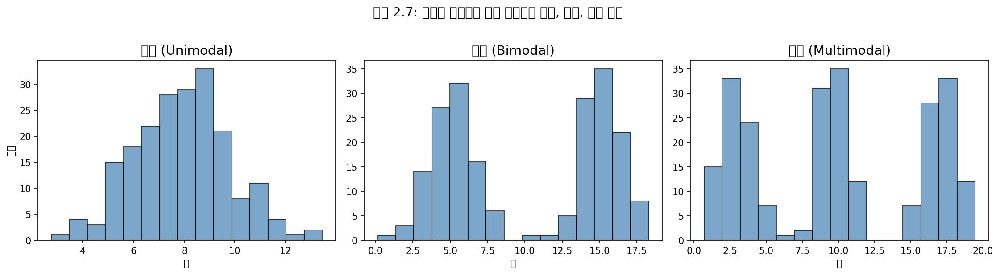

**Python 코드:**

```python
import numpy as np
import matplotlib.pyplot as plt

# 다양한 봉우리 수를 가진 분포 생성
np.random.seed(42)

fig, axes = plt.subplots(1, 3, figsize=(15, 4))

# 1. 단봉 (Unimodal)
unimodal = np.random.normal(10, 2, 500)
axes[0].hist(unimodal, bins=20, edgecolor='black', alpha=0.7, color='steelblue')
axes[0].set_title('단봉 (Unimodal)')
axes[0].set_xlabel('값')
axes[0].set_ylabel('빈도')

# 2. 이봉 (Bimodal)
bimodal = np.concatenate([
    np.random.normal(5, 1.5, 250),
    np.random.normal(15, 1.5, 250)
])
axes[1].hist(bimodal, bins=20, edgecolor='black', alpha=0.7, color='steelblue')
axes[1].set_title('이봉 (Bimodal)')
axes[1].set_xlabel('값')

# 3. 다봉 (Multimodal)
multimodal = np.concatenate([
    np.random.normal(3, 1, 167),
    np.random.normal(10, 1, 167),
    np.random.normal(17, 1, 166)
])
axes[2].hist(multimodal, bins=20, edgecolor='black', alpha=0.7, color='steelblue')
axes[2].set_title('다봉 (Multimodal)')
axes[2].set_xlabel('값')

plt.tight_layout()
plt.show()

print("uni = 1 (유니사이클 = 외바퀴 자전거)")
print("bi = 2 (바이사이클 = 두 바퀴 자전거)")
print("multi = 여러 개")
```

---

#### 예제 2.11

**문제:** 그림 2.6은 이자율에서 오직 하나의 뚜렷한 최빈값을 보여준다. 분포는 단봉인가, 이봉인가, 다봉인가?

**풀이:** 단봉이다. uni는 1을 의미한다(unicycle을 생각하라). 비슷하게, bi는 2를 의미한다(bicycle을 생각하라). 이 비유를 완성하기 위해 multicycle이 발명되기를 바란다.

---

#### Guided Practice 2.12

**문제:** K-3 초등학교에서 어린 학생들과 성인 교사들의 키 측정이 이루어졌다. 이 키 데이터셋에서 몇 개의 최빈값을 예상하는가?

**풀이:** 데이터셋에 두 개의 키 그룹이 보일 수 있다: 학생들의 것과 성인들의 것. 즉, 데이터는 아마도 이봉일 것이다.

**Python 코드:**

```python
import numpy as np
import matplotlib.pyplot as plt

# K-3 학생들과 교사들의 키 시뮬레이션
np.random.seed(42)

# 학생들 (6-9세): 평균 약 120cm
students = np.random.normal(120, 8, 100)

# 교사들 (성인): 평균 약 170cm
teachers = np.random.normal(170, 10, 20)

# 전체 데이터
heights = np.concatenate([students, teachers])

# 히스토그램
plt.figure(figsize=(10, 6))
plt.hist(heights, bins=25, edgecolor='black', alpha=0.7, color='steelblue')
plt.xlabel('키 (cm)')
plt.ylabel('빈도')
plt.title('K-3 학교의 키 분포: 이봉 분포')
plt.axvline(np.mean(students), color='red', linestyle='--', 
            label=f'학생 평균: {np.mean(students):.1f}cm')
plt.axvline(np.mean(teachers), color='green', linestyle='--', 
            label=f'교사 평균: {np.mean(teachers):.1f}cm')
plt.legend()
plt.show()

print(f"학생 수: {len(students)}")
print(f"교사 수: {len(teachers)}")
print(f"전체 평균: {np.mean(heights):.1f}cm")
print("→ 두 개의 뚜렷한 봉우리가 관찰됨 (이봉 분포)")
```

---

### 🔍 새로운 시각: 히스토그램의 구간 폭 선택

히스토그램을 만들 때 가장 중요한 결정 중 하나는 구간(bin)의 폭을 선택하는 것이다. 구간이 너무 좁으면 노이즈가 많아지고, 너무 넓으면 중요한 특징을 놓칠 수 있다.

**스터지스의 규칙(Sturges' Rule):**
$$k = 1 + 3.322 \log_{10}(n)$$

**프리드먼-디아코니스 규칙(Freedman-Diaconis Rule):**
$$\text{구간 폭} = 2 \times \frac{IQR}{n^{1/3}}$$

```python
import numpy as np
import matplotlib.pyplot as plt

data = np.random.exponential(10, 1000)
n = len(data)

# 다양한 구간 수
fig, axes = plt.subplots(2, 2, figsize=(12, 10))

# 1. 너무 적은 구간
axes[0, 0].hist(data, bins=5, edgecolor='black', alpha=0.7)
axes[0, 0].set_title('5개 구간: 너무 적음')

# 2. 스터지스의 규칙
sturges_bins = int(1 + 3.322 * np.log10(n))
axes[0, 1].hist(data, bins=sturges_bins, edgecolor='black', alpha=0.7)
axes[0, 1].set_title(f'스터지스 규칙: {sturges_bins}개 구간')

# 3. 적절한 구간 수
axes[1, 0].hist(data, bins=30, edgecolor='black', alpha=0.7)
axes[1, 0].set_title('30개 구간: 적절함')

# 4. 너무 많은 구간
axes[1, 1].hist(data, bins=100, edgecolor='black', alpha=0.7)
axes[1, 1].set_title('100개 구간: 너무 많음')

plt.tight_layout()
plt.show()
```

---

[다음 부분에서 2.1.4 분산과 표준편차, 2.1.5 상자그림 등을 계속합니다]
## 2.1.6 로버스트 통계량 (계속)

**중위수**와 **IQR**은 극단적인 관측치가 그 값에 거의 영향을 미치지 않기 때문에 **로버스트 통계량**(robust statistics)이라고 불린다: 가장 극단적인 값을 이동시켜도 일반적으로 이 통계량들에는 거의 영향을 미치지 않는다. 반면에, **평균**과 **표준편차**는 극단적인 관측치의 변화에 더 많이 영향을 받으며, 이것은 일부 상황에서 중요할 수 있다.

---

#### 예제 2.18

**문제:** 그림 2.12의 세 시나리오에서 중위수와 IQR이 변하지 않았다. 왜 그럴까?

**풀이:** 중위수와 IQR은 Q1, 중위수, Q3 근처의 숫자에만 민감하다. 이 영역의 값들이 세 데이터셋에서 안정적이므로, 중위수와 IQR 추정치도 안정적이다.

**Python 코드:**

```python
import numpy as np
import matplotlib.pyplot as plt

# 극단값 변화의 영향 시각화
np.random.seed(42)
base_data = np.random.normal(50, 10, 100)
base_data = np.sort(base_data)

# 세 가지 시나리오
scenarios = {
    '원본': base_data.copy(),
    '최댓값을 80으로': np.append(base_data[:-1], 80),
    '최댓값을 150으로': np.append(base_data[:-1], 150)
}

fig, axes = plt.subplots(1, 3, figsize=(15, 4))

for ax, (name, data) in zip(axes, scenarios.items()):
    bp = ax.boxplot(data, vert=True, patch_artist=True)
    bp['boxes'][0].set_facecolor('lightblue')
    
    median = np.median(data)
    q1 = np.percentile(data, 25)
    q3 = np.percentile(data, 75)
    iqr = q3 - q1
    mean = np.mean(data)
    std = np.std(data, ddof=1)
    
    ax.set_title(f'{name}\n중위수={median:.1f}, IQR={iqr:.1f}\n평균={mean:.1f}, SD={std:.1f}')
    ax.set_ylabel('값')

plt.tight_layout()
plt.show()

print("관찰: 중위수와 IQR은 극단값에 영향을 받지 않지만,")
print("      평균과 표준편차는 크게 변한다!")
```

---

#### Guided Practice 2.19

**문제:** loan50 데이터셋에서 대출 금액의 분포는 오른쪽으로 치우쳐 있으며, 몇몇 큰 대출이 오른쪽 꼬리에 남아 있다. 전형적인 대출 규모를 이해하려면 평균과 중위수 중 어느 것에 더 관심을 가져야 하는가?

**풀이:** 답은 다양할 수 있다! 단순히 전형적인 개별 대출이 어떻게 보이는지 이해하려면, 중위수가 아마도 더 유용할 것이다. 중위수는 극단적인 값에 영향을 받지 않으므로 "전형적인" 값을 더 잘 나타낸다.

**Python 코드:**

```python
import numpy as np
import matplotlib.pyplot as plt

# 오른쪽으로 치우친 대출 데이터 시뮬레이션
np.random.seed(42)
loan_amounts = np.random.exponential(10000, 1000)
loan_amounts = loan_amounts + 5000  # 최소 대출금 5000 가정

mean_loan = np.mean(loan_amounts)
median_loan = np.median(loan_amounts)

plt.figure(figsize=(10, 6))
plt.hist(loan_amounts, bins=30, edgecolor='black', alpha=0.7, color='steelblue')
plt.axvline(mean_loan, color='red', linewidth=2, linestyle='--', label=f'평균: ${mean_loan:,.0f}')
plt.axvline(median_loan, color='green', linewidth=2, label=f'중위수: ${median_loan:,.0f}')
plt.xlabel('대출 금액 ($)')
plt.ylabel('빈도')
plt.title('오른쪽으로 치우친 대출 금액 분포')
plt.legend()
plt.show()

print(f"평균 대출 금액: ${mean_loan:,.2f}")
print(f"중위수 대출 금액: ${median_loan:,.2f}")
print(f"\n차이: ${mean_loan - median_loan:,.2f}")
print("\n해석: 오른쪽으로 치우친 분포에서 평균은 중위수보다 크다.")
print("      '전형적인' 대출을 찾으려면 중위수가 더 적합하다.")
```

---

### 🔍 새로운 시각: 언제 평균을, 언제 중위수를 사용하는가?

이것은 통계학에서 가장 실용적인 질문 중 하나이다. 다음은 간단한 가이드라인이다:

| 상황 | 권장 통계량 | 이유 |
|---|---|---|
| 대칭 분포 | 평균 또는 중위수 | 두 값이 비슷함 |
| 치우친 분포 | 중위수 | 극단값에 영향 받지 않음 |
| 이상치 존재 | 중위수 | 이상치에 로버스트함 |
| 총합이 중요한 경우 | 평균 | 평균 × n = 총합 |
| 보고서/미디어 | 둘 다 보고 | 독자가 판단하게 함 |

**실제 예시:**
- **주택 가격**: 중위수 사용 (몇몇 초고가 주택이 평균을 왜곡)
- **학생 성적**: 상황에 따라 다름 (정규분포면 평균, 아니면 중위수)
- **소득 통계**: 중위수 사용 (상위 1%가 평균을 크게 높임)

```python
import numpy as np

# 소득 데이터 예시
np.random.seed(42)
incomes = np.concatenate([
    np.random.normal(50000, 15000, 990),  # 일반 소득
    np.random.normal(500000, 100000, 10)   # 상위 1%
])
incomes = np.clip(incomes, 20000, None)

print("=== 소득 데이터 분석 ===")
print(f"평균 소득: ${np.mean(incomes):,.0f}")
print(f"중위수 소득: ${np.median(incomes):,.0f}")
print(f"\n평균이 중위수보다 ${np.mean(incomes) - np.median(incomes):,.0f} 더 높다.")
print("→ 상위 1%의 고소득자가 평균을 끌어올림")
print("→ '전형적인' 소득을 나타내려면 중위수가 더 적합")
```

---

## 2.1.7 데이터 변환 (특별 주제)

카운티 데이터셋에서 인구 변화(population_change)와 인구(population) 변수를 고려해 보자. 그림 2.14(a)는 이 두 변수의 산점도를 보여준다. 이 첫 번째 산점도에서는 인구 변수가 매우 강하게 치우쳐 있기 때문에 흥미로운 패턴을 해독하기 어렵다.

그러나 인구 변수에 $\log_{10}$ 변환을 적용하면, 그림 2.14(b)에서 보듯이 변수들 간의 양의 연관성이 드러난다. 사실, 8장에서 회귀선을 맞추는 방법을 탐구할 때 데이터에 추세선을 맞추는 것에 관심이 있을 수 있다.

로그 변환 외에 다른 변환도 유용할 수 있다. 예를 들어, **제곱근**($\sqrt{\text{원래 관측치}}$)과 **역수**($\frac{1}{\text{원래 관측치}}$)는 데이터 과학자들이 흔히 사용한다.

**데이터 변환의 일반적인 목표:**
- 데이터 구조를 다르게 보기
- 치우침 줄이기
- 모델링 지원
- 산점도에서 비선형 관계 직선화

**Python 코드:**

```python
import numpy as np
import matplotlib.pyplot as plt

# 카운티 데이터 시뮬레이션
np.random.seed(42)
n = 500

# 인구 (매우 치우친 분포)
population = np.random.exponential(500000, n)
population = np.clip(population, 1000, 10000000)

# 인구 변화 (인구와 약한 관계 + 노이즈)
population_change = 0.02 * np.log10(population) - 0.08 + np.random.normal(0, 0.1, n)
population_change = np.clip(population_change, -0.2, 0.5)

fig, axes = plt.subplots(1, 2, figsize=(14, 5))

# (a) 원본 데이터
axes[0].scatter(population/1e6, population_change * 100, alpha=0.4, s=10, c='steelblue')
axes[0].set_xlabel('인구 변화 전 인구 (백만 명)')
axes[0].set_ylabel('인구 변화 (%)')
axes[0].set_title('(a) 원본 산점도')

# (b) 로그 변환된 데이터
log_population = np.log10(population)
axes[1].scatter(log_population, population_change * 100, alpha=0.4, s=10, c='steelblue')
axes[1].set_xlabel('log₁₀(인구)')
axes[1].set_ylabel('인구 변화 (%)')
axes[1].set_title('(b) 로그 변환된 산점도')

# 추세선 추가
z = np.polyfit(log_population, population_change * 100, 1)
p = np.poly1d(z)
x_line = np.linspace(log_population.min(), log_population.max(), 100)
axes[1].plot(x_line, p(x_line), 'r--', linewidth=2, label='추세선')
axes[1].legend()

plt.tight_layout()
plt.show()

# 상관계수 비교
corr_original = np.corrcoef(population, population_change)[0, 1]
corr_log = np.corrcoef(log_population, population_change)[0, 1]

print(f"원본 데이터 상관계수: {corr_original:.4f}")
print(f"로그 변환 후 상관계수: {corr_log:.4f}")
print("\n로그 변환이 선형 관계를 더 명확하게 드러낸다!")
```

---

#### 예제 2.20

**문제:** 로그 변환이 인구 데이터에 어떤 효과를 가져왔는가?

**풀이:** 로그 변환은 매우 치우친 인구 데이터를 더 대칭적인 분포로 변환했다. 이를 통해 인구와 인구 변화 사이의 관계가 더 명확하게 드러났다. 로그 변환은 특히 데이터가 여러 자릿수에 걸쳐 있을 때(예: 1,000명부터 10,000,000명까지) 유용하다.

**Python 코드:**

```python
import numpy as np
import matplotlib.pyplot as plt

# 변환 전후 히스토그램 비교
np.random.seed(42)
population = np.random.exponential(500000, 1000)

fig, axes = plt.subplots(1, 2, figsize=(12, 5))

# 원본 데이터
axes[0].hist(population/1e6, bins=30, edgecolor='black', alpha=0.7, color='steelblue')
axes[0].set_xlabel('인구 (백만 명)')
axes[0].set_ylabel('빈도')
axes[0].set_title('원본 인구 데이터\n(강하게 오른쪽으로 치우침)')

# 로그 변환된 데이터
axes[1].hist(np.log10(population), bins=30, edgecolor='black', alpha=0.7, color='steelblue')
axes[1].set_xlabel('log₁₀(인구)')
axes[1].set_ylabel('빈도')
axes[1].set_title('로그 변환된 인구 데이터\n(더 대칭적)')

plt.tight_layout()
plt.show()

print("로그 변환의 효과:")
print("1. 치우침 감소")
print("2. 큰 값과 작은 값의 차이 압축")
print("3. 선형 관계 드러남")
```

---

## 2.1.8 데이터 매핑 (특별 주제)

county 데이터셋은 점도표, 산점도, 또는 상자그림을 사용하여 플롯할 수 있는 많은 수치형 변수를 제공하지만, 이것들은 데이터의 진정한 특성을 놓친다. 오히려 지리적 데이터를 만날 때는 색상을 사용하여 변수의 높은 값과 낮은 값을 보여주는 **강도 지도**(intensity map)를 만들어야 한다.

그림 2.15와 2.16은 빈곤율(poverty), 실업률(unemployment_rate), 주택소유율(homeownership), 가구 중위소득(median_hh_income)에 대한 강도 지도를 보여준다. 색상 키는 어떤 색상이 어떤 값에 해당하는지 나타낸다.

강도 지도는 일반적으로 특정 카운티에서 정확한 값을 얻는 데는 그다지 유용하지 않지만, 지리적 추세를 보고 흥미로운 연구 질문이나 가설을 생성하는 데는 매우 유용하다.

---

#### 예제 2.21

**문제:** 빈곤율과 실업률 강도 지도에서 어떤 흥미로운 특징이 분명히 나타나는가?

**풀이:** 빈곤율은 몇몇 지역에서 명백히 더 높다. 특히 깊은 남부에서 더 높은 빈곤율이 보이며, 애리조나와 뉴멕시코의 많은 부분도 마찬가지이다. 높은 빈곤율은 뉴올리언스 북쪽의 미시시피 범람원과 켄터키의 큰 지역에서도 분명하다.

실업률은 비슷한 추세를 따르며, 두 변수 사이의 대응 관계를 볼 수 있다. 사실, 더 높은 실업률이 빈곤율과 밀접하게 관련되어 있다는 것은 합리적이다. 두 지도를 비교할 때 눈에 띄는 한 가지 관찰: 빈곤율이 실업률보다 훨씬 높다는 것은 많은 사람들이 일하고 있을 수 있지만 빈곤에서 벗어날 만큼 충분히 벌지 못하고 있음을 의미한다.

**Python 코드 (개념적 시연):**

```python
import numpy as np
import matplotlib.pyplot as plt

# 강도 지도 개념 시연 (실제로는 지리 데이터 필요)
# 여기서는 2D 배열로 간단히 시뮬레이션

np.random.seed(42)
rows, cols = 20, 30

# 빈곤율 시뮬레이션 (남쪽과 특정 지역이 높음)
poverty = np.random.uniform(5, 25, (rows, cols))
poverty[15:, :10] += 10  # 남서부
poverty[12:, 20:] += 8   # 남동부

# 실업률 시뮬레이션 (빈곤율과 상관)
unemployment = poverty * 0.4 + np.random.normal(0, 2, (rows, cols))
unemployment = np.clip(unemployment, 2, 20)

fig, axes = plt.subplots(1, 2, figsize=(14, 5))

# 빈곤율 지도
im1 = axes[0].imshow(poverty, cmap='YlOrRd', aspect='auto')
axes[0].set_title('빈곤율 (%)')
plt.colorbar(im1, ax=axes[0], label='빈곤율 (%)')

# 실업률 지도
im2 = axes[1].imshow(unemployment, cmap='YlOrRd', aspect='auto')
axes[1].set_title('실업률 (%)')
plt.colorbar(im2, ax=axes[1], label='실업률 (%)')

plt.suptitle('강도 지도 예시: 지리적 패턴 시각화')
plt.tight_layout()
plt.show()

# 상관관계 분석
correlation = np.corrcoef(poverty.flatten(), unemployment.flatten())[0, 1]
print(f"빈곤율과 실업률의 상관계수: {correlation:.4f}")
print("→ 강한 양의 상관관계: 빈곤율이 높은 지역은 실업률도 높은 경향")
```

---

### 🔍 새로운 시각: 지리적 데이터의 중요성

지리적 데이터 시각화(지도)는 단순한 통계 그래프로는 놓칠 수 있는 패턴을 드러낸다. 이것은 **공간적 자기상관**(spatial autocorrelation)이라는 현상 때문이다: 가까운 지역은 비슷한 특성을 가지는 경향이 있다.

**토블러의 지리학 제1법칙:**
> "모든 것은 다른 모든 것과 관련되어 있지만, 가까운 것들이 먼 것들보다 더 관련되어 있다."
> — 월도 토블러 (Waldo Tobler, 1970)

이 원리는 왜 강도 지도가 유용한지 설명한다:
1. 인접 지역들이 유사한 색상을 가지면 → 지역적 패턴 존재
2. 특정 지역이 뚜렷하게 다른 색상을 가지면 → 이상치 또는 특수 요인 존재
3. 점진적인 색상 변화 → 그라디언트 효과 (예: 해안에서 내륙으로)

---

## 2.1절 요약: 수치형 데이터 분석

| 개념 | 설명 | 로버스트 여부 |
|---|---|---|
| **산점도** | 두 수치형 변수의 관계 시각화 | - |
| **점도표** | 단일 변수의 분포 시각화 | - |
| **히스토그램** | 구간화된 빈도 분포 | - |
| **평균** ($\bar{x}$) | 관측치 합 / 관측치 수 | ❌ |
| **분산** ($s^2$) | 평균으로부터 편차의 제곱 평균 | ❌ |
| **표준편차** ($s$) | 분산의 제곱근 | ❌ |
| **중위수** | 정렬된 데이터의 중앙값 | ✅ |
| **사분위수** ($Q_1$, $Q_3$) | 25%, 75% 백분위수 | ✅ |
| **IQR** | $Q_3 - Q_1$ | ✅ |
| **상자그림** | 5수 요약 + 이상치 시각화 | - |

**핵심 포인트:**
1. 데이터 분포의 **형태**를 먼저 파악하라 (대칭/치우침, 봉우리 수)
2. 치우친 데이터에서는 **로버스트 통계량** (중위수, IQR)을 선호하라
3. **변환**은 치우침을 줄이고 관계를 드러내는 데 유용하다
4. **지리적 데이터**는 강도 지도로 시각화하라
## 2.2 범주형 데이터 다루기

이 절에서는 이 책 전체에서 사용되는 범주형 데이터를 위한 표와 기타 기본 도구를 소개한다. loan50 데이터셋은 loans라는 더 큰 대출 데이터셋의 표본을 나타낸다. 이 더 큰 데이터셋은 Lending Club을 통해 이루어진 10,000건의 대출에 대한 정보를 포함한다.

우리는 **주택소유 현황**(homeownership)과 **신청 유형**(app_type) 간의 관계를 살펴볼 것이다. loans 데이터에서 homeownership은 rent(임대), mortgage(주택담보대출), own(자가) 값을 가질 수 있고, app_type은 대출 신청이 파트너와 함께 이루어졌는지(joint) 또는 개인 신청(individual)인지를 나타낸다.

---

### 2.2.1 분할표와 막대그래프

그림 2.17은 두 변수를 요약한다: app_type과 homeownership. 두 범주형 변수에 대한 데이터를 이런 방식으로 요약하는 표를 **분할표**(contingency table)라고 한다. 표의 각 값은 변수 결과의 특정 조합이 발생한 횟수를 나타낸다.

| | 임대(rent) | 주택담보(mortgage) | 자가(own) | 합계 |
|---|---|---|---|---|
| **개인**(individual) | 3496 | 3839 | 1170 | 8505 |
| **공동**(joint) | 362 | 950 | 183 | 1495 |
| **합계** | 3858 | 4789 | 1353 | 10000 |

예를 들어, 값 3496은 차용인이 집을 임대하고 신청 유형이 개인인 데이터셋의 대출 수에 해당한다. 행 합계와 열 합계도 포함된다.

**Python 코드:**

```python
import numpy as np
import pandas as pd
import matplotlib.pyplot as plt

# 분할표 생성
data = {
    'rent': [3496, 362],
    'mortgage': [3839, 950],
    'own': [1170, 183]
}
contingency_table = pd.DataFrame(data, index=['individual', 'joint'])
contingency_table['Total'] = contingency_table.sum(axis=1)
contingency_table.loc['Total'] = contingency_table.sum()

print("=== 분할표: 신청 유형 vs 주택소유 현황 ===")
print(contingency_table)

# 막대그래프 그리기
fig, axes = plt.subplots(1, 2, figsize=(14, 5))

# 빈도 막대그래프
homeownership_counts = [3858, 4789, 1353]
categories = ['임대\n(rent)', '주택담보\n(mortgage)', '자가\n(own)']

axes[0].bar(categories, homeownership_counts, color='steelblue', edgecolor='black')
axes[0].set_ylabel('빈도')
axes[0].set_title('빈도 막대그래프')
for i, v in enumerate(homeownership_counts):
    axes[0].text(i, v + 100, str(v), ha='center')

# 비율 막대그래프
total = sum(homeownership_counts)
proportions = [c/total for c in homeownership_counts]

axes[1].bar(categories, proportions, color='steelblue', edgecolor='black')
axes[1].set_ylabel('비율')
axes[1].set_title('비율 막대그래프')
for i, v in enumerate(proportions):
    axes[1].text(i, v + 0.01, f'{v:.3f}', ha='center')

plt.tight_layout()
plt.show()
```

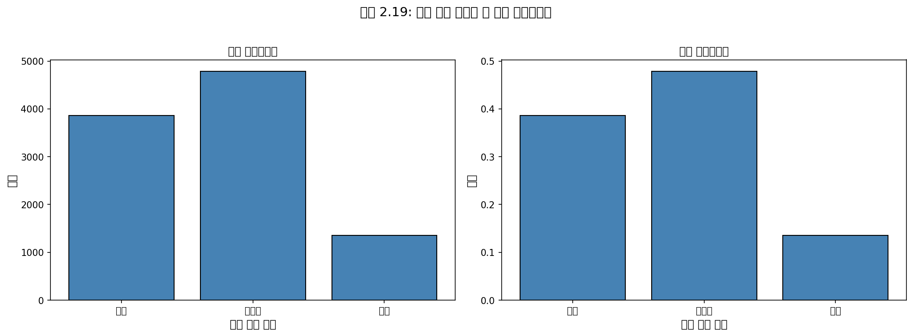

**막대그래프**(bar plot)는 단일 범주형 변수를 표시하는 일반적인 방법이다. 왼쪽 패널은 homeownership 변수에 대한 막대그래프를 보여준다. 오른쪽 패널에서는 카운트가 비율로 변환되어 각 수준의 관측치 비율을 보여준다 (예: 3858/10000 = 0.3858 for rent).

---

### 2.2.2 행 비율과 열 비율

때때로 한 변수의 분수 분해를 다른 변수에서 이해하는 것이 유용하며, 그러한 뷰를 제공하도록 분할표를 수정할 수 있다.

**행 비율 (Row Proportions):**

| | 임대 | 주택담보 | 자가 | 합계 |
|---|---|---|---|---|
| **개인** | 0.411 | 0.451 | 0.138 | 1.000 |
| **공동** | 0.242 | 0.635 | 0.122 | 1.000 |
| **합계** | 0.386 | 0.479 | 0.135 | 1.000 |

예를 들어, 0.411은 개인 신청자 중 임대 주택에 사는 비율을 나타낸다 (3496/8505 = 0.411).

**열 비율 (Column Proportions):**

| | 임대 | 주택담보 | 자가 | 합계 |
|---|---|---|---|---|
| **개인** | 0.906 | 0.802 | 0.865 | 0.851 |
| **공동** | 0.094 | 0.198 | 0.135 | 0.150 |
| **합계** | 1.000 | 1.000 | 1.000 | 1.000 |

여기서 0.906은 임대자의 90.6%가 개인으로 대출을 신청했음을 나타낸다. 이 비율은 주택담보(80.2%)나 자가(86.5%) 대출에 비해 높다. 이러한 비율이 homeownership의 세 수준 간에 다르기 때문에, app_type과 homeownership 변수가 **연관**(associated)되어 있다는 증거를 제공한다.

**Python 코드:**

```python
import numpy as np
import pandas as pd

# 원본 분할표
data = np.array([
    [3496, 3839, 1170],
    [362, 950, 183]
])
columns = ['rent', 'mortgage', 'own']
index = ['individual', 'joint']

df = pd.DataFrame(data, columns=columns, index=index)

print("=== 원본 분할표 ===")
print(df)

# 행 비율 계산
row_totals = df.sum(axis=1)
row_proportions = df.div(row_totals, axis=0)
print("\n=== 행 비율 ===")
print(row_proportions.round(3))

# 열 비율 계산
col_totals = df.sum(axis=0)
col_proportions = df.div(col_totals, axis=1)
print("\n=== 열 비율 ===")
print(col_proportions.round(3))

# 연관성 해석
print("\n=== 연관성 분석 ===")
print("임대자의 개인 신청 비율: {:.1%}".format(col_proportions.loc['individual', 'rent']))
print("주택담보의 개인 신청 비율: {:.1%}".format(col_proportions.loc['individual', 'mortgage']))
print("자가의 개인 신청 비율: {:.1%}".format(col_proportions.loc['individual', 'own']))
print("\n이 비율들이 다르므로 두 변수는 연관되어 있다!")
```

---

#### Guided Practice 2.23

**문제:** 
(a) 행 비율 표에서 0.451은 무엇을 나타내는가?
(b) 열 비율 표에서 0.802는 무엇을 나타내는가?

**풀이:**
(a) 0.451은 개인 신청자 중 주택담보대출이 있는 비율을 나타낸다.
(b) 0.802는 주택담보대출이 있는 차용인 중 개인으로 신청한 비율을 나타낸다.

---

#### Guided Practice 2.24

**문제:**
(a) 행 비율 표에서 joint와 own의 교차점에 있는 0.122는 무엇을 나타내는가?
(b) 열 비율 표에서 0.135는 무엇을 나타내는가?

**풀이:**
(a) 0.122는 공동 신청자 중 자기 집을 소유한 비율을 나타낸다.
(b) 0.135는 자기 집을 소유한 차용인 중 공동으로 대출을 신청한 비율을 나타낸다.

---

#### 예제 2.25

**문제:** 데이터 과학자들은 수신 이메일 메시지에서 스팸을 필터링하기 위해 통계를 사용한다. 이메일의 특정 특성을 기록함으로써, 데이터 과학자는 일부 이메일을 높은 정확도로 스팸 또는 비스팸으로 분류할 수 있다.

한 가지 특성은 이메일에 숫자가 없는지, 작은 숫자가 있는지, 큰 숫자가 있는지 여부이다. 또 다른 특성은 이메일 형식으로, 이메일에 굵은 텍스트와 같은 HTML 콘텐츠가 있는지 여부를 나타낸다.

email 데이터셋을 사용하여 이메일 형식과 스팸 상태에 초점을 맞추면:

| | 텍스트 | HTML | 합계 |
|---|---|---|---|
| **스팸** | 209 | 158 | 367 |
| **비스팸** | 986 | 2568 | 3554 |
| **합계** | 1195 | 2726 | 3921 |

이메일을 스팸 또는 일반 이메일로 분류하려는 사람에게 행 비율과 열 비율 중 어느 것이 더 유용한가?

**풀이:** 데이터 과학자는 각 이메일 형식 내에서 스팸의 비율이 어떻게 변하는지에 관심이 있을 것이다. 이것은 **열 비율**에 해당한다: 일반 텍스트 이메일의 스팸 비율과 HTML 이메일의 스팸 비율.

열 비율을 생성하면:
- 일반 텍스트 이메일의 스팸 비율: 209/1195 = **17.5%**
- HTML 이메일의 스팸 비율: 158/2726 = **5.8%**

일반 텍스트 이메일이 HTML 이메일보다 스팸일 가능성이 더 높다. 그러나 이 정보만으로는 이메일을 스팸으로 분류하기에 충분하지 않다. 일반 텍스트 이메일의 80% 이상이 스팸이 아니기 때문이다. 하지만 이 정보를 다른 많은 특성과 신중하게 결합하면, 일부 이메일을 신뢰도 있게 스팸 또는 비스팸으로 분류할 수 있다.

**Python 코드:**

```python
import numpy as np
import pandas as pd

# 이메일 스팸 분할표
email_data = np.array([
    [209, 158],
    [986, 2568]
])
email_df = pd.DataFrame(email_data, 
                         columns=['text', 'HTML'], 
                         index=['spam', 'not_spam'])

print("=== 이메일 스팸 분할표 ===")
print(email_df)

# 열 비율 계산
col_totals = email_df.sum(axis=0)
col_props = email_df.div(col_totals, axis=1)
print("\n=== 열 비율 ===")
print(col_props.round(3))

print("\n=== 해석 ===")
print(f"일반 텍스트 이메일의 스팸 비율: {col_props.loc['spam', 'text']:.1%}")
print(f"HTML 이메일의 스팸 비율: {col_props.loc['spam', 'HTML']:.1%}")
print("\n→ 일반 텍스트 이메일이 스팸일 가능성이 약 3배 높다!")
```

---

#### 예제 2.26

**문제:** 표 2.20과 2.21을 다시 살펴보라. 하나가 다른 것보다 더 유용할 수 있는 명백한 시나리오가 있는가?

**풀이:** 명백한 것은 없다! app_type과 homeownership이 email 예제와 다른 점은 이 두 변수가 가설을 세울 수 있는 명확한 설명변수-반응변수 관계를 가지지 않는다는 것이다. 보통 설명변수에 대해 "조건화"하는 것이 가장 유용하다.

예를 들어, email 예제에서 이메일 형식은 메시지가 스팸인지 여부의 가능한 설명변수로 보였으므로, 각 이메일 형식에 대한 상대 빈도(비율)를 계산하는 것이 더 흥미로울 것이다.

---

### 🔍 새로운 시각: 설명변수 vs 반응변수

통계 분석에서 두 변수의 관계를 탐구할 때, 어느 것이 "원인"이고 어느 것이 "결과"인지 생각하는 것이 유용하다:

- **설명변수**(Explanatory Variable): 결과에 영향을 미칠 것으로 생각되는 변수
- **반응변수**(Response Variable): 측정하거나 예측하려는 결과

| 예시 | 설명변수 | 반응변수 |
|---|---|---|
| 흡연과 폐암 | 흡연 여부 | 폐암 발생 |
| 교육과 소득 | 교육 수준 | 소득 |
| 이메일 형식과 스팸 | 이메일 형식 | 스팸 여부 |

**행 비율 vs 열 비율 선택 가이드:**
- **열 비율**: 설명변수가 열에 있을 때 사용 (각 설명변수 수준 내에서 반응변수 분포 확인)
- **행 비율**: 설명변수가 행에 있을 때 사용

---

### 2.2.3 두 변수로 막대그래프 사용하기

행 또는 열 비율을 사용하는 분할표는 두 범주형 변수가 어떻게 관련되어 있는지 조사하는 데 특히 유용하다. **누적 막대그래프**(stacked bar plot)는 이러한 표의 정보를 시각화하는 방법을 제공한다.

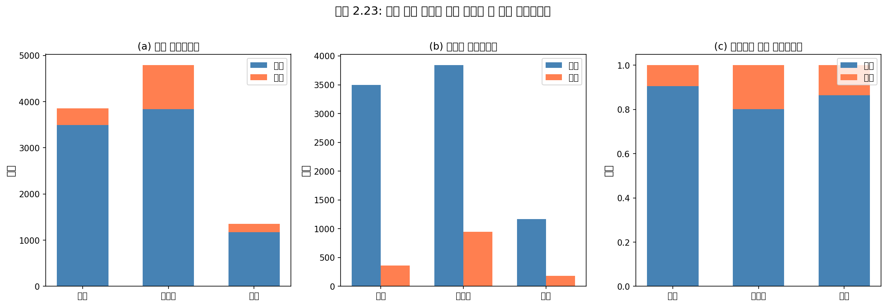

**세 가지 유형의 막대그래프:**

**(a) 누적 막대그래프 (Stacked Bar Plot):**
homeownership 변수를 사용하여 막대그래프를 먼저 만든 다음, 각 그룹을 app_type의 수준으로 나눈다.

**(b) 나란히 막대그래프 (Side-by-Side Bar Plot):**
각 조합에 대해 별도의 막대를 나란히 배치한다.

**(c) 표준화된 누적 막대그래프 (Standardized Stacked Bar Plot):**
각 homeownership 수준에서 개인 또는 공동 대출 신청의 비율을 이해하는 데 도움이 된다.

**Python 코드:**

```python
import numpy as np
import matplotlib.pyplot as plt

# 데이터
categories = ['임대\n(rent)', '주택담보\n(mortgage)', '자가\n(own)']
individual = [3496, 3839, 1170]
joint = [362, 950, 183]

fig, axes = plt.subplots(1, 3, figsize=(15, 5))

# (a) 누적 막대그래프
axes[0].bar(categories, individual, label='개인 (individual)', color='steelblue')
axes[0].bar(categories, joint, bottom=individual, label='공동 (joint)', color='orange')
axes[0].set_ylabel('빈도')
axes[0].set_title('(a) 누적 막대그래프')
axes[0].legend()

# (b) 나란히 막대그래프
x = np.arange(len(categories))
width = 0.35
axes[1].bar(x - width/2, individual, width, label='개인 (individual)', color='steelblue')
axes[1].bar(x + width/2, joint, width, label='공동 (joint)', color='orange')
axes[1].set_xticks(x)
axes[1].set_xticklabels(categories)
axes[1].set_ylabel('빈도')
axes[1].set_title('(b) 나란히 막대그래프')
axes[1].legend()

# (c) 표준화된 누적 막대그래프
totals = [i + j for i, j in zip(individual, joint)]
individual_prop = [i/t for i, t in zip(individual, totals)]
joint_prop = [j/t for j, t in zip(joint, totals)]

axes[2].bar(categories, individual_prop, label='개인 (individual)', color='steelblue')
axes[2].bar(categories, joint_prop, bottom=individual_prop, label='공동 (joint)', color='orange')
axes[2].set_ylabel('비율')
axes[2].set_title('(c) 표준화된 누적 막대그래프')
axes[2].legend()
axes[2].set_ylim(0, 1)

plt.tight_layout()
plt.show()

# 비율 출력
print("=== 각 주택소유 유형별 신청 유형 비율 ===")
for i, cat in enumerate(['rent', 'mortgage', 'own']):
    print(f"{cat}: 개인 {individual_prop[i]:.1%}, 공동 {joint_prop[i]:.1%}")
```

---

#### 예제 2.27

**문제:** 그림 2.23의 세 가지 막대그래프를 살펴보라. 누적, 나란히, 또는 표준화된 누적 막대그래프가 가장 유용한 것은 언제인가?

**풀이:**

**누적 막대그래프:**
한 변수를 설명변수로, 다른 변수를 반응변수로 지정하는 것이 합리적일 때 가장 유용하다. 효과적으로 한 변수로 먼저 그룹화한 다음 다른 변수로 분해하기 때문이다.

**나란히 막대그래프:**
어떤 변수가 설명변수이고 어떤 것이 반응변수인지에 대해 더 불가지론적이다. 여섯 가지 다른 그룹 조합의 케이스 수를 쉽게 분별할 수 있다. 그러나 단점은 더 많은 수평 공간이 필요하다는 것이다. 또한 두 그룹의 크기가 매우 다를 때, 변수 간 연관성이 있는지 분별하기 어렵다.

**표준화된 누적 막대그래프:**
누적 막대그래프의 주요 변수가 상대적으로 불균형할 때 유용하다. 예를 들어, own 범주는 mortgage 범주의 관측치의 1/3만 가지고 있어 단순 누적 막대그래프가 연관성을 확인하는 데 덜 유용하다. 표준화된 버전의 주요 단점은 각 막대가 얼마나 많은 케이스를 나타내는지에 대한 감각을 잃는다는 것이다.

---

### 2.2.4 모자이크 플롯

**모자이크 플롯**(mosaic plot)은 표준화된 누적 막대그래프와 유사하지만, 주요 변수의 상대적 그룹 크기도 볼 수 있다는 장점이 있는 분할표에 적합한 시각화 기법이다.

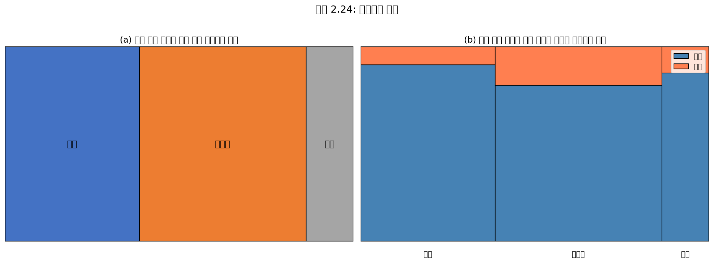

첫 번째 모자이크 플롯을 만들기 위해, homeownership 변수의 각 범주에 대해 정사각형을 열로 나눈다. 각 열은 homeownership의 한 수준을 나타내고, 열 너비는 각 범주의 대출 비율에 해당한다.

완성된 모자이크 플롯을 만들기 위해, 단일 변수 모자이크 플롯은 app_type 변수를 사용하여 더 나뉜다. 각 열은 개인 및 공동 차용인의 대출 수에 비례하여 분할된다.

이 플롯을 사용하여 homeownership과 app_type 변수가 연관되어 있음을 볼 수 있다. 일부 열이 다른 열과 다른 수직 위치에서 나뉘기 때문이다.

**Python 코드:**

```python
import numpy as np
import matplotlib.pyplot as plt
from matplotlib.patches import Rectangle

fig, axes = plt.subplots(1, 2, figsize=(14, 6))

# 데이터
categories = ['rent', 'mortgage', 'own']
individual = np.array([3496, 3839, 1170])
joint = np.array([362, 950, 183])
totals = individual + joint
col_totals = totals
grand_total = totals.sum()

# 열 너비 (각 범주의 비율)
widths = col_totals / grand_total

# (a) 단일 변수 모자이크 플롯
left = 0
for i, (cat, w) in enumerate(zip(categories, widths)):
    rect = Rectangle((left, 0), w, 1, fill=True, 
                      facecolor=plt.cm.Blues(0.3 + i*0.2), 
                      edgecolor='black', linewidth=2)
    axes[0].add_patch(rect)
    axes[0].text(left + w/2, 0.5, f'{cat}\n{w:.1%}', ha='center', va='center', fontsize=10)
    left += w

axes[0].set_xlim(0, 1)
axes[0].set_ylim(0, 1)
axes[0].set_title('(a) 단일 변수 모자이크 플롯')
axes[0].set_xlabel('주택소유 현황')
axes[0].axis('off')

# (b) 두 변수 모자이크 플롯
left = 0
colors = {'individual': 'steelblue', 'joint': 'orange'}
for i, (cat, w) in enumerate(zip(categories, widths)):
    ind_prop = individual[i] / totals[i]
    joint_prop = joint[i] / totals[i]
    
    # 개인 (위)
    rect1 = Rectangle((left, joint_prop), w, ind_prop, fill=True,
                       facecolor='steelblue', edgecolor='black', linewidth=1)
    axes[1].add_patch(rect1)
    
    # 공동 (아래)
    rect2 = Rectangle((left, 0), w, joint_prop, fill=True,
                       facecolor='orange', edgecolor='black', linewidth=1)
    axes[1].add_patch(rect2)
    
    # 레이블
    axes[1].text(left + w/2, 1.02, cat, ha='center', va='bottom', fontsize=9)
    left += w

axes[1].set_xlim(0, 1)
axes[1].set_ylim(0, 1.1)
axes[1].set_title('(b) 두 변수 모자이크 플롯')

# 범례
from matplotlib.patches import Patch
legend_elements = [Patch(facecolor='steelblue', label='개인 (individual)'),
                   Patch(facecolor='orange', label='공동 (joint)')]
axes[1].legend(handles=legend_elements, loc='upper right')
axes[1].axis('off')

plt.tight_layout()
plt.show()
```

---

### 2.2.5 이 책에서 보게 될 유일한 파이 차트

**파이 차트**(pie chart)는 그림 2.26에서 같은 정보를 나타내는 막대그래프와 함께 보여진다. 파이 차트는 케이스 집합이 어떻게 분해되는지 높은 수준의 개요를 제공하는 데 유용할 수 있다.

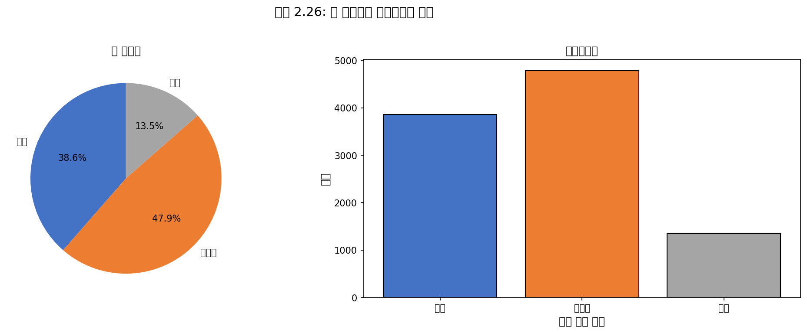

그러나 파이 차트에서 세부 사항을 해독하기도 어렵다. 예를 들어, 파이 차트를 볼 때 임대보다 주택담보대출이 더 많다는 것을 인식하는 데 몇 초 더 걸리지만, 막대그래프에서는 이 세부 사항이 매우 명백하다.

**파이 차트가 유용할 수 있지만, 그룹을 비교하는 용이성 때문에 막대그래프를 선호한다.**

**Python 코드:**

```python
import matplotlib.pyplot as plt

labels = ['임대\n(rent)', '주택담보\n(mortgage)', '자가\n(own)']
sizes = [3858, 4789, 1353]
colors = ['#ff9999', '#66b3ff', '#99ff99']

fig, axes = plt.subplots(1, 2, figsize=(12, 5))

# 파이 차트
axes[0].pie(sizes, labels=labels, colors=colors, autopct='%1.1f%%', startangle=90)
axes[0].set_title('파이 차트')
axes[0].axis('equal')

# 막대그래프
axes[1].bar(labels, sizes, color='steelblue', edgecolor='black')
axes[1].set_ylabel('빈도')
axes[1].set_title('막대그래프')

plt.tight_layout()
plt.show()

print("파이 차트의 문제점:")
print("1. 각도 비교는 길이 비교보다 어렵다")
print("2. 3D 파이 차트는 시각적 왜곡을 일으킨다")
print("3. 많은 범주가 있으면 읽기 어렵다")
```

---

### 🔍 새로운 시각: 파이 차트에 대한 논쟁

파이 차트는 통계 시각화에서 가장 논쟁적인 그래프 유형 중 하나이다. 에드워드 터프트(Edward Tufte)와 같은 유명한 정보 시각화 전문가들은 파이 차트를 강력히 비판한다.

**파이 차트의 문제점:**
1. 인간의 시각 시스템은 각도보다 길이를 더 정확하게 비교한다
2. 비슷한 크기의 조각들을 구별하기 어렵다
3. 3D 파이 차트는 원근법 왜곡을 일으킨다

**그럼에도 파이 차트가 유용한 경우:**
1. 전체에서 한 부분의 비율을 강조할 때 (예: "예산의 40%가 인건비")
2. 2-3개의 큰 범주만 있을 때
3. 청중이 숫자에 익숙하지 않을 때

**결론:** 대부분의 경우 막대그래프가 더 나은 선택이다!

---

### 2.2.6 그룹 간 수치형 데이터 비교

더 흥미로운 조사 중 일부는 그룹 간 수치형 데이터를 조사하여 고려할 수 있다. 여기서 필요한 방법은 실제로 새로운 것이 아니다: 같은 그래프에서 각 그룹에 대한 수치형 플롯을 만들기만 하면 된다.

여기서 두 가지 편리한 방법을 소개한다: **나란히 상자그림**(side-by-side box plots)과 **빈 히스토그램**(hollow histograms).

county 데이터셋을 다시 살펴보고 2010년부터 2017년까지 인구가 증가한 카운티와 증가하지 않은 카운티의 가구 중위소득을 비교할 것이다.

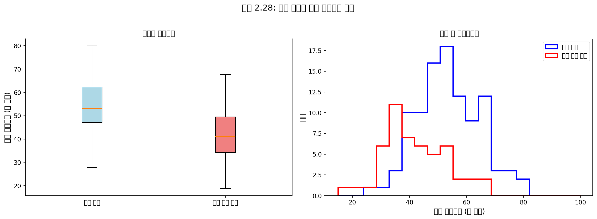

**나란히 상자그림**은 그룹 간 비교를 위한 전통적인 도구이다. 왼쪽 패널에는 두 개의 상자그림이 있으며, 각 그룹에 대해 하나씩 같은 플롯 창에 배치되고 같은 스케일로 그려진다.

**빈 히스토그램**은 그룹 간 수치형 데이터를 비교하기 위한 또 다른 유용한 플롯 방법이다. 이것들은 같은 플롯에 놓인 각 그룹의 히스토그램 윤곽선일 뿐이다.

**Python 코드:**

```python
import numpy as np
import matplotlib.pyplot as plt

# 데이터 시뮬레이션
np.random.seed(42)

# 인구 증가 카운티 (중위소득 약간 높음)
gain_income = np.random.normal(52000, 15000, 1454)
gain_income = np.clip(gain_income, 20000, 120000)

# 인구 감소 카운티 (중위소득 약간 낮음)
no_gain_income = np.random.normal(42000, 12000, 1672)
no_gain_income = np.clip(no_gain_income, 15000, 100000)

fig, axes = plt.subplots(1, 2, figsize=(14, 5))

# 나란히 상자그림
bp = axes[0].boxplot([gain_income/1000, no_gain_income/1000], 
                     labels=['인구 증가', '인구 감소'],
                     patch_artist=True)
bp['boxes'][0].set_facecolor('lightblue')
bp['boxes'][1].set_facecolor('lightsalmon')
axes[0].set_ylabel('가구 중위소득 (천 달러)')
axes[0].set_title('나란히 상자그림')

# 빈 히스토그램
bins = np.linspace(15, 120, 30)
axes[1].hist(gain_income/1000, bins=bins, histtype='step', 
             linewidth=2, label='인구 증가', color='blue')
axes[1].hist(no_gain_income/1000, bins=bins, histtype='step', 
             linewidth=2, label='인구 감소', color='red')
axes[1].set_xlabel('가구 중위소득 (천 달러)')
axes[1].set_ylabel('빈도')
axes[1].set_title('빈 히스토그램')
axes[1].legend()

plt.tight_layout()
plt.show()

# 요약 통계량
print("=== 요약 통계량 ===")
print(f"인구 증가 카운티 (n={len(gain_income)}):")
print(f"  중위수: ${np.median(gain_income):,.0f}")
print(f"  IQR: ${np.percentile(gain_income, 75) - np.percentile(gain_income, 25):,.0f}")

print(f"\n인구 감소 카운티 (n={len(no_gain_income)}):")
print(f"  중위수: ${np.median(no_gain_income):,.0f}")
print(f"  IQR: ${np.percentile(no_gain_income, 75) - np.percentile(no_gain_income, 25):,.0f}")
```

---

#### Guided Practice 2.28

**문제:** 그림 2.28의 플롯을 사용하여 두 그룹 간의 소득을 비교하라. 각 그룹의 대략적인 중심에 대해 무엇을 발견하는가? 그룹 간 변동성에 대해 무엇을 발견하는가? 그룹 간 형태가 상대적으로 일관적인가? 각 그룹에 대해 몇 개의 뚜렷한 최빈값이 있는가?

**풀이:** 
- **중심:** 인구가 증가한 카운티는 더 높은 소득을 가지는 경향이 있다 (중위수 약 $45,000 vs $40,000)
- **변동성:** 인구 증가 그룹의 변동성도 약간 더 크다. IQR이 증가 그룹에서 약 50% 더 크다
- **형태:** 두 분포 모두 약간에서 중간 정도의 오른쪽 치우침을 보이며 단봉이다
- **이상치:** 상자그림은 각 그룹에서 중위수보다 훨씬 높은 많은 관측치가 있음을 나타낸다

---

#### Guided Practice 2.29

**문제:** 그림 2.28의 각 플롯에서 어떤 구성 요소가 가장 유용한가?

**풀이:** 답은 다양할 수 있다. 나란히 상자그림은 중심과 산포도를 비교하는 데 특히 유용하고, 빈 히스토그램은 분포 형태, 치우침, 잠재적 이상치를 보는 데 더 유용하다.

---

### 🔍 새로운 시각: 그룹 비교를 위한 시각화 선택

| 상황 | 권장 시각화 | 이유 |
|---|---|---|
| 2-5개 그룹, 중심/산포 비교 | 나란히 상자그림 | 5수 요약을 한눈에 비교 |
| 2-3개 그룹, 분포 형태 비교 | 빈 히스토그램 | 겹치는 분포 형태 확인 |
| 2개 그룹, 상세 비교 | 바이올린 플롯 | 상자그림 + 밀도 결합 |
| 많은 그룹 | 줄기-잎 그림 또는 조건부 히스토그램 | 공간 효율적 |

```python
import numpy as np
import matplotlib.pyplot as plt

# 바이올린 플롯 예시
np.random.seed(42)
data1 = np.random.normal(50, 10, 200)
data2 = np.concatenate([np.random.normal(40, 8, 100), np.random.normal(60, 8, 100)])

fig, ax = plt.subplots(figsize=(8, 6))
vp = ax.violinplot([data1, data2], positions=[1, 2], showmeans=True, showmedians=True)
ax.set_xticks([1, 2])
ax.set_xticklabels(['단봉 분포', '이봉 분포'])
ax.set_ylabel('값')
ax.set_title('바이올린 플롯: 분포 형태와 요약 통계량을 동시에')
plt.show()

print("바이올린 플롯의 장점:")
print("1. 상자그림의 요약 정보 제공")
print("2. 커널 밀도 추정으로 분포 형태 표시")
print("3. 이봉 분포 등 복잡한 분포 패턴 감지 가능")
```

---

## 2.2절 요약: 범주형 데이터 다루기

| 도구 | 용도 | 장점 |
|---|---|---|
| **분할표** | 두 범주형 변수 요약 | 정확한 빈도/비율 제공 |
| **행/열 비율** | 조건부 비율 계산 | 연관성 탐지 |
| **막대그래프** | 단일 범주형 변수 시각화 | 빈도 비교 용이 |
| **누적 막대그래프** | 두 변수 관계 시각화 | 전체 구성 파악 |
| **표준화된 막대그래프** | 비율 비교 | 불균형 그룹 비교 |
| **모자이크 플롯** | 분할표 시각화 | 그룹 크기와 비율 동시 표시 |
| **나란히 상자그림** | 그룹 간 수치형 데이터 비교 | 중심과 산포 비교 |
| **빈 히스토그램** | 그룹 간 분포 비교 | 형태 비교 |

**핵심 포인트:**
1. **연관성 확인**: 열 비율이 행에 따라 다르면 (또는 그 반대) 두 변수는 연관됨
2. **설명변수에 조건화**: 설명변수 수준 내에서 반응변수 비율을 계산
3. **시각화 선택**: 목적에 맞는 적절한 그래프 유형 선택
4. **파이 차트 주의**: 대부분의 경우 막대그래프가 더 효과적
## 2.3 사례 연구: 말라리아 백신

#### 예제 2.30

**문제:** 교수가 학급의 학생들을 두 그룹으로 나눈다고 가정하자: 왼쪽의 학생들과 오른쪽의 학생들. $\hat{p}_L$과 $\hat{p}_R$이 각각 왼쪽과 오른쪽에서 Apple 제품을 소유한 학생의 비율을 나타낸다면, $\hat{p}_L$이 $\hat{p}_R$과 정확히 같지 않다면 놀라겠는가?

**풀이:** 비율은 아마도 서로 가까울 것이지만, 정확히 같은 것은 비정상적일 것이다. 우연으로 인해 작은 차이를 관찰할 것이다.

---

#### Guided Practice 2.31

**문제:** 학급에서 앉는 위치가 Apple 제품 소유 여부와 관련이 없다고 생각한다면, 이 두 변수 사이의 관계에 대해 어떤 가정을 하고 있는가?

**풀이:** 이 두 변수가 **독립적**(independent)이라고 가정하고 있다.

---

### 2.3.1 데이터 내 변동성

PfSPZ라는 새로운 말라리아 백신에 대한 연구를 고려해 보자. 이 연구에서 자원 환자들은 두 실험 그룹 중 하나에 무작위로 배정되었다: 14명의 환자는 실험용 백신을 받았고 6명의 환자는 위약을 받았다.

19주 후, 20명의 환자 모두 약물 민감성 말라리아 기생충 균주에 노출되었다. 여기서 약물 민감성 기생충 균주를 사용한 이유는 윤리적 고려 때문이며, 모든 감염을 효과적으로 치료할 수 있게 한다.

결과는 그림 2.29에 요약되어 있다. 14명의 처치 환자 중 9명은 감염 징후 없이 남아 있었고, 대조군 6명 모두는 감염의 기본 징후를 보였다.

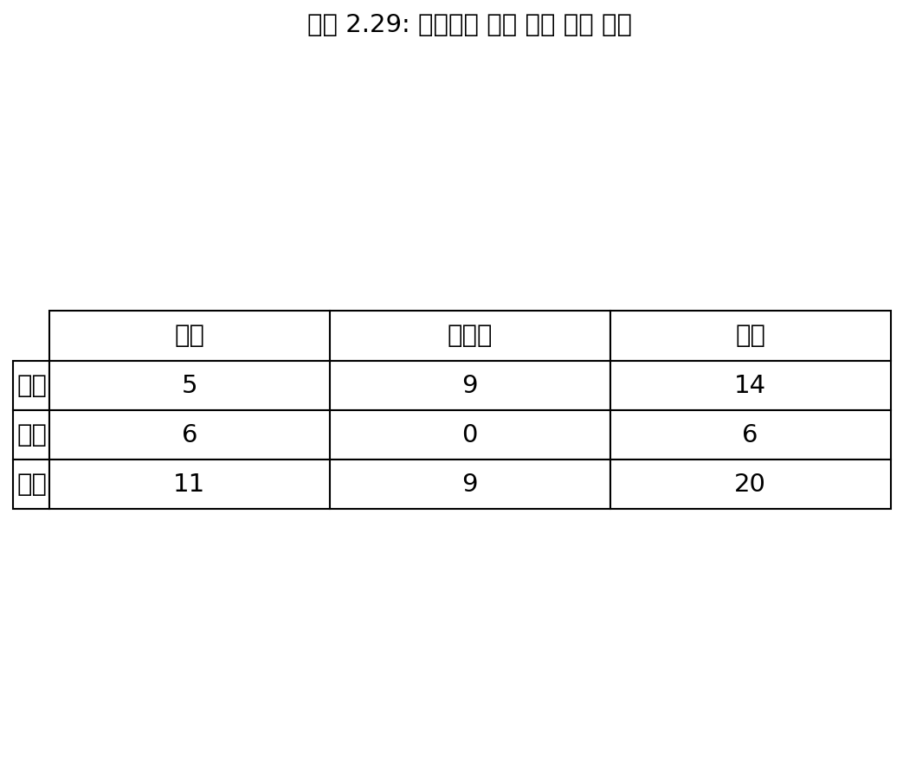

| | 감염(infection) | 무감염(no infection) | 합계 |
|---|---|---|---|
| **백신**(vaccine) | 5 | 9 | 14 |
| **위약**(placebo) | 6 | 0 | 6 |
| **합계** | 11 | 9 | 20 |

**Python 코드:**

```python
import numpy as np
import pandas as pd

# 말라리아 백신 실험 데이터
data = {
    'infection': [5, 6],
    'no_infection': [9, 0]
}
df = pd.DataFrame(data, index=['vaccine', 'placebo'])
df['Total'] = df.sum(axis=1)
df.loc['Total'] = df.sum()

print("=== 말라리아 백신 실험 결과 ===")
print(df)

# 감염률 계산
vaccine_infection_rate = 5 / 14
placebo_infection_rate = 6 / 6

print(f"\n백신 그룹 감염률: {vaccine_infection_rate:.1%} (5/14)")
print(f"위약 그룹 감염률: {placebo_infection_rate:.1%} (6/6)")
print(f"\n차이: {placebo_infection_rate - vaccine_infection_rate:.1%}")
```

---

#### Guided Practice 2.32

**문제:** 이것은 관찰 연구인가 실험인가? 연구 유형이 결과에서 추론할 수 있는 것에 대해 어떤 함의를 가지는가?

**풀이:** 이 연구는 **실험**이다. 환자들이 무작위로 실험 그룹에 배정되었기 때문이다. 이것이 실험이므로, 결과를 사용하여 말라리아 백신과 환자가 감염 징후를 보였는지 여부 사이의 **인과 관계**를 평가할 수 있다.

---

이 연구에서 백신을 받은 환자 중 더 작은 비율이 감염 징후를 보였다 (35.7% vs 100%). 그러나 표본이 매우 작고, 이 차이가 백신이 효과적이라는 설득력 있는 증거를 제공하는지 불분명하다.

---

#### 예제 2.33

**문제:** 데이터 과학자들은 때때로 증거의 강도를 평가하도록 요청받는다. 이 연구에서 두 그룹의 감염률을 볼 때, 데이터가 실제 차이의 설득력 있는 증거를 보여주는지 결정하려고 할 때 무엇이 떠오르는가?

**풀이:** 관찰된 감염률 (처치군 35.7% vs 대조군 100%)은 백신이 효과적일 수 있음을 시사한다. 그러나 관찰된 차이가 백신의 효능을 나타내는지 또는 단지 무작위 우연인지 확신할 수 없다.

일반적으로 표본 데이터에는 약간의 변동이 있으며, 진실이 감염률이 백신 접종과 독립적이라 하더라도 표본 비율이 정확히 같을 것이라고 기대하지 않는다. 또한 이렇게 작은 표본에서는 우연만으로 그룹을 무작위로 나눌 때 이러한 큰 차이를 관찰하는 것이 일반적일 수 있다!

---

예제 2.33은 데이터 표본의 관찰된 결과가 무작위 노이즈 때문에 변수 간의 진정한 관계를 완벽하게 반영하지 않을 수 있음을 상기시킨다. 관찰된 감염률 차이가 크지만, 연구의 표본 크기가 작아서 이 관찰된 차이가 백신의 효능을 나타내는지 또는 단순히 우연 때문인지 불분명하다.

우리는 이 두 가지 경쟁하는 주장에 레이블을 붙인다: **$H_0$**와 **$H_A$** ("H-nought"와 "H-A"로 발음):

> **$H_0$: 독립 모형**(Independence model)
> 
> 변수 처치(treatment)와 결과(outcome)는 독립적이다. 그들은 관계가 없으며, 두 그룹에서 감염이 발생한 환자 비율의 관찰된 차이 64.3%는 우연 때문이었다.

> **$H_A$: 대립 모형**(Alternative model)
> 
> 변수들은 독립적이지 않다. 감염률의 64.3% 차이는 우연 때문이 아니었고, 백신이 감염률에 영향을 미쳤다.

---

독립 모형이 참이라면 무엇을 의미하는가? 그것은 11명의 환자가 어느 그룹에 무작위로 배정되었든 상관없이 감염될 것이었고, 9명의 환자는 어느 그룹에 무작위로 배정되었든 상관없이 감염되지 않을 것이었음을 의미한다. 즉, 백신이 감염률에 영향을 미치지 않았다면, 감염률의 차이는 환자들이 무작위로 배정된 방식의 우연만에 의한 것이었다.

이제 대립 모형을 고려해 보자: 감염률은 환자가 백신을 받았는지 여부에 의해 영향을 받았다. 이것이 사실이라면, 특히 이 영향이 상당하다면, 그룹 내 환자들의 감염률에서 약간의 차이를 기대할 것이다.

---

### 2.3.2 연구 시뮬레이션

시뮬레이션을 구현할 것이며, 테스트 중인 말라리아 백신이 작동하지 않는다고 가정할 것이다. 궁극적으로 관찰된 큰 차이가 이러한 시뮬레이션에서 흔한지 이해하고 싶다.

- **만약 흔하다면:** 관찰된 차이는 순전히 우연 때문일 수 있다
- **만약 드물다면:** 백신이 도움이 되었을 가능성이 더 그럴듯해 보인다

그림 2.29는 11명의 환자가 감염이 발생했고 9명은 그렇지 않았음을 보여준다. 시뮬레이션을 위해, 감염이 백신과 독립적이었고 연구에서 연구자들이 환자를 무작위로 배정했던 시점으로 되돌아갈 수 있다고 가정할 것이다.

**시뮬레이션 방법 (카드 사용):**

1. 20장의 노트카드를 가져와 20명의 환자를 나타낸다
2. 11장의 카드에 "감염"을 쓰고 9장에 "무감염"을 쓴다
3. 카드를 철저히 섞는다
4. 14장을 백신 더미에, 6장을 위약 더미에 나눈다
5. 결과를 집계한다

| | 감염 | 무감염 | 합계 |
|---|---|---|---|
| **백신 (시뮬레이션)** | 7 | 7 | 14 |
| **위약 (시뮬레이션)** | 4 | 2 | 6 |
| **합계** | 11 | 9 | 20 |

**Python 코드:**

```python
import numpy as np

def simulate_malaria_study(n_simulations=1):
    """말라리아 백신 연구 시뮬레이션"""
    # 환자 결과: 11명 감염, 9명 무감염
    patients = ['infection'] * 11 + ['no_infection'] * 9
    
    results = []
    for _ in range(n_simulations):
        # 무작위로 섞기
        np.random.shuffle(patients)
        
        # 14명은 백신, 6명은 위약
        vaccine_group = patients[:14]
        placebo_group = patients[14:]
        
        # 각 그룹의 감염률 계산
        vaccine_infections = vaccine_group.count('infection')
        placebo_infections = placebo_group.count('infection')
        
        vaccine_rate = vaccine_infections / 14
        placebo_rate = placebo_infections / 6
        
        # 차이 계산 (위약 - 백신)
        diff = placebo_rate - vaccine_rate
        results.append(diff)
    
    return results

# 단일 시뮬레이션 예시
np.random.seed(42)
single_result = simulate_malaria_study(1)[0]
print(f"시뮬레이션 결과 (위약 감염률 - 백신 감염률): {single_result:.3f} 또는 {single_result*100:.1f}%")

# 실제 관찰된 차이
observed_diff = 6/6 - 5/14
print(f"실제 관찰된 차이: {observed_diff:.3f} 또는 {observed_diff*100:.1f}%")
```

---

#### Guided Practice 2.34

**문제:** 그림 2.30에서 두 시뮬레이션 그룹 간의 감염률 차이는 얼마인가? 이것은 실제 데이터에서 관찰된 64.3% 차이와 어떻게 비교되는가?

**풀이:** 시뮬레이션 결과: 4/6 - 7/14 = 0.167 또는 약 16.7% (백신에 유리). 이 우연으로 인한 차이는 실제 그룹에서 관찰된 차이보다 훨씬 작다.

---

### 2.3.3 독립성 검사

Guided Practice 2.34에서 독립 모형 하에서 하나의 가능한 차이를 계산했으며, 이것은 우연으로 인한 하나의 차이를 나타낸다. 첫 번째 시뮬레이션에서는 물리적으로 노트카드를 나누어 환자들을 나타냈지만, 컴퓨터를 사용하여 이 시뮬레이션을 수행하는 것이 더 효율적이다.

컴퓨터에서 시뮬레이션을 반복하면 우연으로 인한 또 다른 차이를 얻는다:

$$\frac{2}{6} - \frac{9}{14} = -0.310$$

그리고 또 다른:

$$\frac{3}{6} - \frac{8}{14} = -0.071$$

우연만으로 인한 차이의 분포가 무엇인지 잘 알 수 있을 때까지 시뮬레이션을 충분히 반복한다.

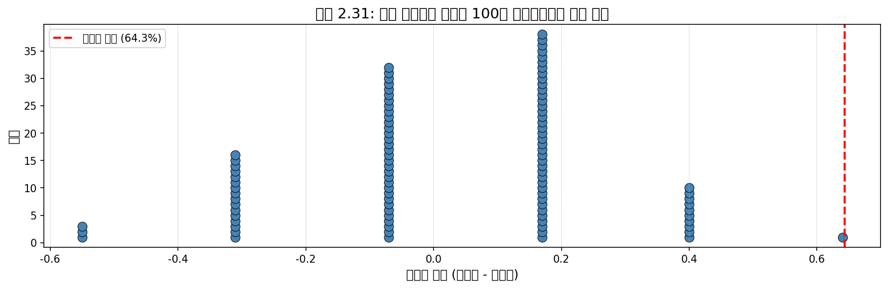

**Python 코드:**

```python
import numpy as np
import matplotlib.pyplot as plt

def simulate_malaria_differences(n_simulations=100):
    """말라리아 백신 연구의 차이 시뮬레이션"""
    patients = ['infection'] * 11 + ['no_infection'] * 9
    differences = []
    
    for _ in range(n_simulations):
        np.random.shuffle(patients)
        vaccine_group = patients[:14]
        placebo_group = patients[14:]
        
        vaccine_infections = vaccine_group.count('infection')
        placebo_infections = placebo_group.count('infection')
        
        vaccine_rate = vaccine_infections / 14
        placebo_rate = placebo_infections / 6
        
        diff = placebo_rate - vaccine_rate
        differences.append(diff)
    
    return np.array(differences)

# 100번 시뮬레이션
np.random.seed(123)
simulated_diffs = simulate_malaria_differences(100)

# 실제 관찰된 차이
observed_diff = 6/6 - 5/14  # ≈ 0.643

# 시각화
plt.figure(figsize=(10, 5))
plt.hist(simulated_diffs, bins=15, edgecolor='black', alpha=0.7, color='steelblue')
plt.axvline(observed_diff, color='red', linewidth=2, linestyle='--', 
            label=f'관찰된 차이 = {observed_diff:.3f}')
plt.axvline(0, color='green', linewidth=2, label='기대 차이 (독립 시) = 0')
plt.xlabel('감염률 차이 (위약 - 백신)')
plt.ylabel('빈도')
plt.title('100번 시뮬레이션의 차이 분포')
plt.legend()
plt.show()

# 분석
extreme_count = np.sum(simulated_diffs >= observed_diff)
print(f"=== 시뮬레이션 결과 분석 ===")
print(f"시뮬레이션 횟수: {len(simulated_diffs)}")
print(f"관찰된 차이: {observed_diff:.3f} ({observed_diff*100:.1f}%)")
print(f"시뮬레이션 차이 평균: {np.mean(simulated_diffs):.3f}")
print(f"관찰된 차이 이상인 시뮬레이션 수: {extreme_count}")
print(f"비율 (p-값 추정): {extreme_count/len(simulated_diffs):.1%}")
```

시뮬레이션된 차이의 분포가 **0 주위에 중심**을 두고 있음에 주목하라. 독립 모형이 참이라고 가정하고 이러한 차이를 시뮬레이션했으며, 이 조건 하에서 차이가 약간의 무작위 변동과 함께 0 근처에 있을 것으로 기대한다.

---

#### 예제 2.35

**문제:** 그림 2.31에 따르면 최소 64.3% (0.643)의 차이를 얼마나 자주 관찰하겠는가? 자주, 때때로, 드물게, 또는 절대 아닌가?

**풀이:** 그림 2.31에 따르면 우연만으로 최소 64.3%의 차이는 약 **2%의 시간**에만 발생하는 것으로 보인다. 이러한 낮은 확률은 **드문 사건**을 나타낸다.

---

64.3%의 차이가 드문 사건이라는 것은 연구 결과에 대한 두 가지 가능한 해석을 시사한다:

> **$H_0$: 독립 모형**
> 
> 백신은 감염률에 영향을 미치지 않으며, 드문 경우에만 발생할 차이를 우연히 관찰했다.

> **$H_A$: 대립 모형**
> 
> 백신은 감염률에 영향을 미치며, 관찰된 차이는 실제로 백신이 말라리아 퇴치에 효과적이기 때문이었으며, 이것이 64.3%의 큰 차이를 설명한다.

시뮬레이션을 기반으로 두 가지 선택지가 있다:

1. 연구 결과가 독립 모형에 대한 강력한 증거를 제공하지 않는다고 결론 내린다.
2. 증거가 $H_0$를 기각하고 백신이 유용하다고 주장할 만큼 충분히 강력하다고 결론 내린다.

**공식적인 연구를 수행할 때, 보통 드문 사건을 우연히 관찰했다는 개념을 기각한다.** 따라서 이 경우, 대립 모형에 찬성하여 독립 모형을 기각한다. 즉, 데이터가 이 임상 환경에서 백신이 말라리아에 대해 어느 정도 보호를 제공한다는 강력한 증거를 제공한다고 결론 내린다.

---

### 🔍 새로운 시각: 귀무가설 기각의 논리

이 사례 연구는 **통계적 추론**(statistical inference)의 핵심 아이디어를 소개한다. 이 접근법을 **귀류법**(proof by contradiction)과 비교할 수 있다:

1. **가정**: $H_0$가 참이라고 가정한다 (백신이 효과 없음)
2. **시뮬레이션**: 이 가정 하에서 데이터가 어떻게 보일지 시뮬레이션
3. **비교**: 실제 관찰된 결과와 시뮬레이션 결과 비교
4. **결론**: 
   - 관찰된 결과가 시뮬레이션에서 흔하면 → $H_0$를 기각할 수 없음
   - 관찰된 결과가 시뮬레이션에서 드물면 → $H_0$를 기각

**p-값의 직관적 이해:**

p-값은 "$H_0$가 참일 때 관찰된 결과(또는 더 극단적인 결과)를 얻을 확률"이다.

- p-값 < 0.05: 일반적으로 "통계적으로 유의"하다고 간주
- p-값 < 0.01: "매우 유의"하다고 간주

**Python 코드:**

```python
import numpy as np

def compute_p_value(n_simulations=10000):
    """p-값 추정"""
    patients = ['infection'] * 11 + ['no_infection'] * 9
    observed_diff = 6/6 - 5/14  # 실제 관찰된 차이
    
    extreme_count = 0
    
    for _ in range(n_simulations):
        np.random.shuffle(patients)
        vaccine_group = patients[:14]
        placebo_group = patients[14:]
        
        vaccine_infections = vaccine_group.count('infection')
        placebo_infections = placebo_group.count('infection')
        
        vaccine_rate = vaccine_infections / 14
        placebo_rate = placebo_infections / 6
        
        diff = placebo_rate - vaccine_rate
        
        if diff >= observed_diff:
            extreme_count += 1
    
    p_value = extreme_count / n_simulations
    return p_value

# p-값 계산
np.random.seed(42)
p_value = compute_p_value(10000)
print(f"추정된 p-값: {p_value:.4f} ({p_value*100:.2f}%)")

if p_value < 0.05:
    print("\n결론: p-값 < 0.05이므로 귀무가설을 기각한다.")
    print("       백신이 말라리아 감염률을 줄이는 데 효과적이라는 증거가 있다.")
```

---

통계학의 한 분야인 **통계적 추론**(statistical inference)은 이러한 차이가 우연 때문인지 평가하는 것에 기반한다. 통계적 추론에서 데이터 과학자들은 데이터가 주어졌을 때 어떤 모형이 가장 합리적인지 평가한다.

5장에서 모형 선택 문제에 대한 공식적인 소개를 한다. 다음 두 장에서는 그 논의를 엄밀하게 하기 위해 필요한 확률과 이론의 기초를 구축한다.

---

## 2장 요약

### 수치형 데이터 요약

| 측정치 | 공식/정의 | 로버스트 |
|---|---|---|
| 평균 ($\bar{x}$) | $\frac{\sum x_i}{n}$ | ❌ |
| 분산 ($s^2$) | $\frac{\sum(x_i - \bar{x})^2}{n-1}$ | ❌ |
| 표준편차 ($s$) | $\sqrt{s^2}$ | ❌ |
| 중위수 | 정렬된 데이터의 중앙값 | ✅ |
| IQR | $Q_3 - Q_1$ | ✅ |

### 시각화 도구

| 그래프 유형 | 용도 |
|---|---|
| 산점도 | 두 수치형 변수 관계 |
| 점도표 | 단일 수치형 변수 분포 |
| 히스토그램 | 분포 형태와 밀도 |
| 상자그림 | 5수 요약과 이상치 |
| 막대그래프 | 범주형 변수 |
| 모자이크 플롯 | 두 범주형 변수 관계 |

### 핵심 개념

1. **분포 형태**: 대칭 vs 치우침, 단봉 vs 다봉
2. **로버스트 통계량**: 이상치에 영향 받지 않음 (중위수, IQR)
3. **연관성**: 한 변수의 값이 다른 변수의 값에 따라 다름
4. **독립성**: 한 변수가 다른 변수에 대한 정보를 제공하지 않음
5. **시뮬레이션**: 귀무가설 하에서 우연히 발생할 수 있는 결과 탐색

---

## 연습문제 풀이 (홀수 번호)

### 연습문제 2.27: 보충 시험

25명 학생 중 24명이 시험을 봤고 평균 74점, 표준편차 8.9점이었다. 다음 날 보충 시험을 본 학생은 64점을 받았다.

**(a) 새 학생의 점수가 평균을 올리는가 내리는가?**

**풀이:** 새 학생의 점수 64점은 기존 평균 74점보다 낮으므로, 평균을 **내린다**.

**(b) 새 평균은?**

```python
# 기존 데이터
n_original = 24
mean_original = 74
new_score = 64

# 새 평균 계산
total_original = n_original * mean_original
total_new = total_original + new_score
n_new = n_original + 1

mean_new = total_new / n_new
print(f"새 평균: {mean_new:.2f}점")
# 출력: 새 평균: 73.60점
```

**답:** 새 평균 = (24 × 74 + 64) / 25 = **73.6점**

**(c) 새 학생의 점수가 표준편차를 올리는가 내리는가?**

**풀이:** 새 학생의 점수 64점은 평균에서 멀리 떨어져 있으므로, 표준편차를 **올린다**.

---

### 연습문제 2.29: TV 시청

AP 통계 학급 학생들에게 주당 TV 시청 시간을 물었더니 평균 4.71시간, 표준편차 4.18시간이었다. 분포가 대칭인가?

**풀이:** 

```python
mean = 4.71
std = 4.18

# 대칭 분포 검토
print(f"평균 - 1×SD = {mean - std:.2f}")  # 0.53
print(f"평균 - 2×SD = {mean - 2*std:.2f}")  # -3.65 (불가능!)
print("\n결론: TV 시청 시간은 음수가 될 수 없으므로")
print("분포는 오른쪽으로 치우친 형태일 것이다.")
```

**답:** 분포는 **오른쪽으로 치우침**(right-skewed). 표준편차가 평균과 거의 같고, TV 시청 시간은 음수가 될 수 없으므로 대칭 분포가 아니다.

---

### 연습문제 2.31: 오스카 수상자

| | 여우주연상 | 남우주연상 |
|---|---|---|
| 평균 | 36.2세 | 43.8세 |
| 표준편차 | 11.9세 | 8.83세 |
| n | 92 | 92 |

**풀이:**

```python
print("=== 오스카 수상자 나이 분포 비교 ===")
print("\n중심: 남성 수상자가 평균 7.6세 더 많음")
print("변동성: 여성 수상자의 나이가 더 다양함 (SD 11.9 vs 8.83)")
print("\n해석:")
print("- 여성 수상자는 젊은 나이에 수상하는 경향")
print("- 남성 수상자는 더 높은 나이에 수상하는 경향")
print("- 할리우드의 성별 연령 편향을 반영할 수 있음")
```

---

### 연습문제 2.33: 키와 신발 크기

**답:** 예, **양의 연관성**이 있다. 키가 클수록 신발 크기도 큰 경향이 있다. 산점도는 양의 기울기를 가진 패턴을 보일 것이다.

---

### 연습문제 2.35: 평균 소득

도시의 평균 가구 소득이 $55,000라면, 대부분의 가구가 이보다 더 벌거나 덜 버는가?

**풀이:** 소득 분포는 일반적으로 오른쪽으로 치우쳐 있다. 소수의 고소득 가구가 평균을 끌어올리므로, 대부분의 가구는 평균보다 **적게** 번다.

```python
print("소득 분포 특성:")
print("- 오른쪽으로 치우침 (right-skewed)")
print("- 평균 > 중위수")
print("- 50% 이상의 가구가 평균($55,000) 미만")
```
