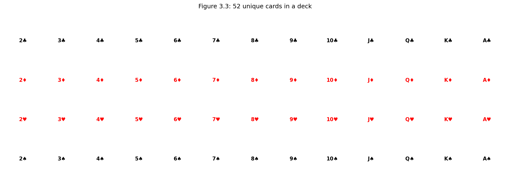
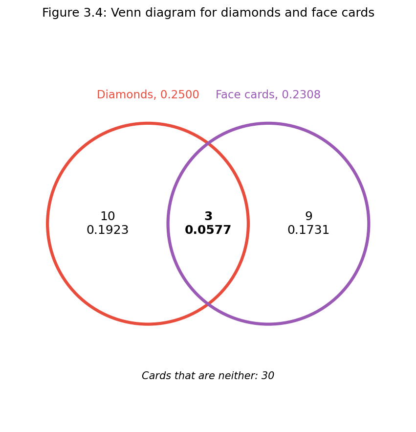
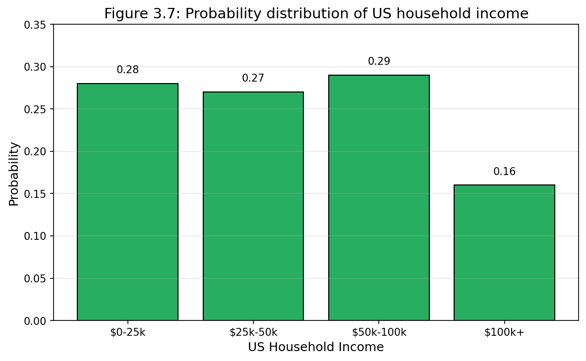
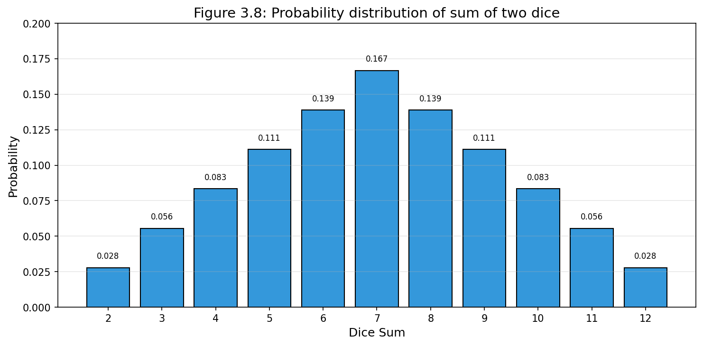
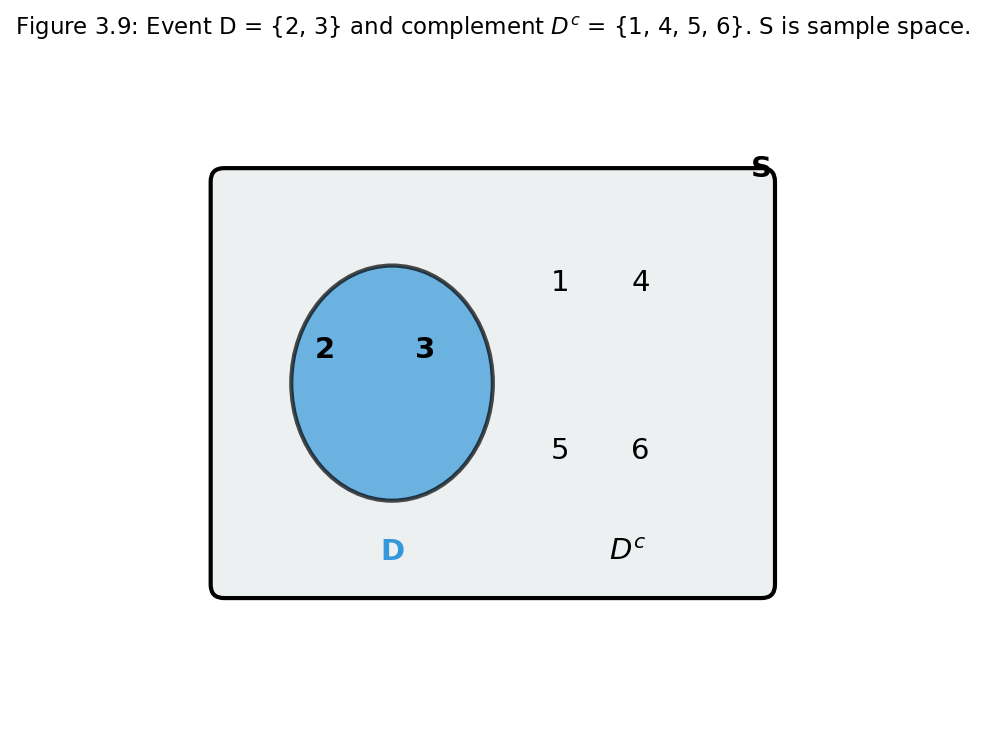
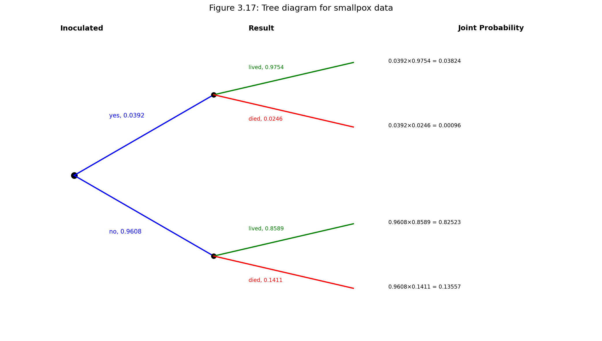
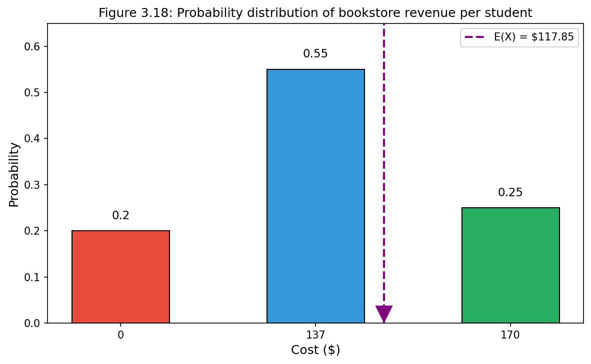
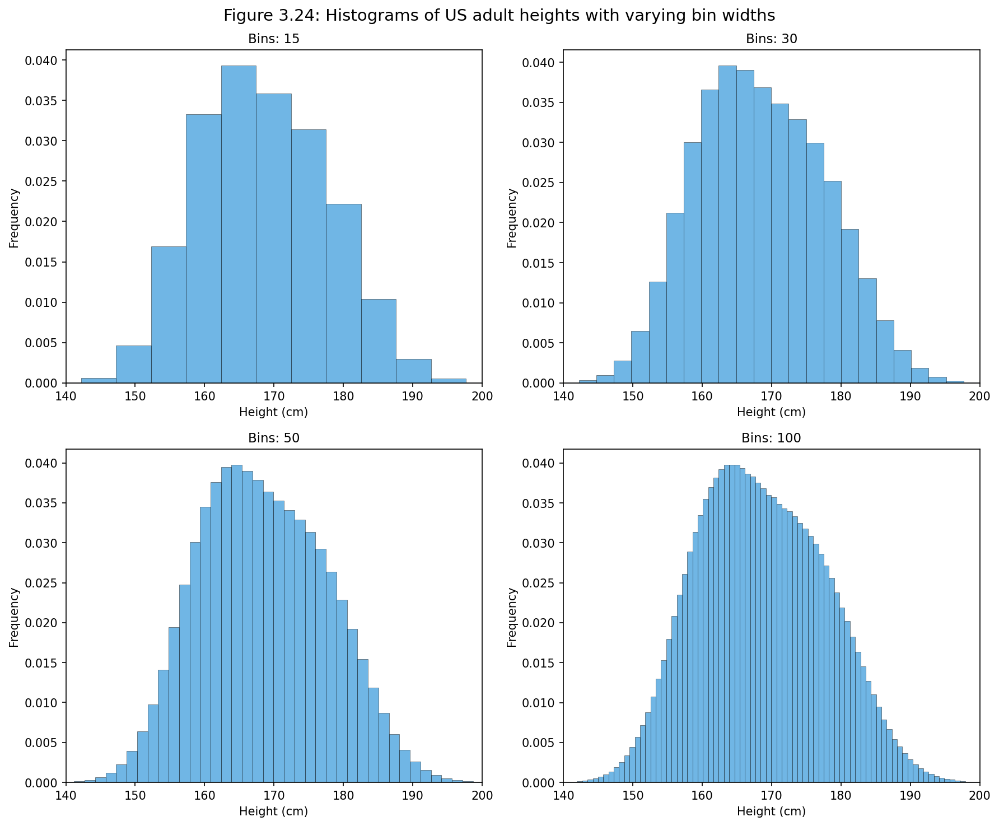
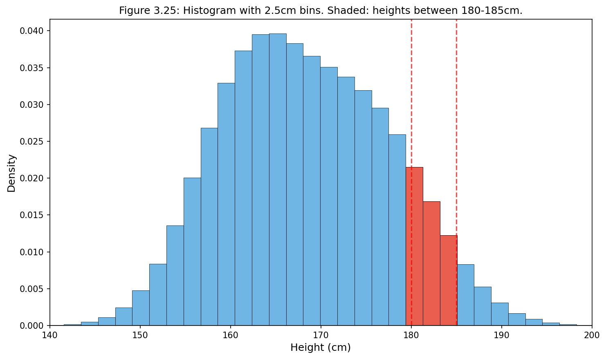

# 제3장: 확률 (Probability)

## 개요

확률은 통계학의 기초를 형성하며, 독자는 이 장에서 제시되는 많은 개념에 이미 어느 정도 익숙할 것이다. 그러나 확률 개념의 공식적 정의는 대부분의 독자에게 새로운 내용이다.

이 장은 이후 장들에서 다루는 개념의 이론적 토대를 제공하며, 더 깊은 이해로 나아가는 길을 열어준다. 다만 이 장에서 소개하는 개념의 완벽한 숙달이 이 책의 나머지 부분에서 소개하는 방법을 적용하는 데 반드시 필요한 것은 아니다.

***

## 3.1 확률의 정의 (Defining Probability)

통계학은 확률에 기반한다. 확률이 이 책에서 다루는 응용 기법에 필수적이지는 않지만, 방법론에 대한 깊은 이해와 향후 학습을 위한 더 나은 토대를 마련하는 데 도움이 된다.

### 3.1.1 도입 예제 (Introductory Examples)

기술적인 개념에 들어가기 전에, 좀 더 친숙하게 느껴질 수 있는 기본 예제들을 살펴보자.

***

**예제 3.1: 주사위 던지기의 기본 확률**

**문제:** "die"(주사위의 단수형, dice의 단수)는 1, 2, 3, 4, 5, 6으로 번호가 매겨진 6개의 면을 가진 정육면체이다. 주사위를 던질 때 1이 나올 확률은 얼마인가?

**풀이:** 
주사위가 공정하다면(fair), 1이 나올 가능성은 다른 어떤 숫자가 나올 가능성과 동일하다. 6개의 결과가 있으므로, 확률은 6분의 1, 즉 1/6이다.

```python
# 예제 3.1: 주사위 던지기 기본 확률
import numpy as np

# 공정한 주사위의 각 면이 나올 확률
total_outcomes = 6
prob_one = 1 / total_outcomes
print(f"1이 나올 확률: {prob_one:.4f} = 1/{total_outcomes}")

# 시뮬레이션으로 확인
np.random.seed(42)
n_rolls = 100000
rolls = np.random.randint(1, 7, n_rolls)
simulated_prob = np.mean(rolls == 1)
print(f"시뮬레이션 결과 (n={n_rolls}): {simulated_prob:.4f}")
```

***

**예제 3.2: 1 또는 2가 나올 확률**

**문제:** 다음 주사위 던지기에서 1 또는 2가 나올 확률은 얼마인가?

**풀이:**
1과 2는 동일하게 가능한 6개의 결과 중 2개를 구성하므로, 이 두 결과 중 하나가 나올 확률은 2/6 = 1/3이다.

```python
# 예제 3.2: 1 또는 2가 나올 확률
favorable_outcomes = 2  # 1 또는 2
total_outcomes = 6
prob_one_or_two = favorable_outcomes / total_outcomes
print(f"1 또는 2가 나올 확률: {prob_one_or_two:.4f} = {favorable_outcomes}/{total_outcomes} = 1/3")
```

***

**예제 3.3: 모든 결과의 확률**

**문제:** 다음 주사위 던지기에서 1, 2, 3, 4, 5, 또는 6이 나올 확률은 얼마인가?

**풀이:**
100%이다. 결과는 반드시 이 숫자들 중 하나여야 한다.

***

**예제 3.4: 여집합의 확률**

**문제:** 2가 나오지 않을 확률은 얼마인가?

**풀이:**
2가 나올 확률이 1/6 또는 16.67%이므로, 2가 나오지 않을 확률은 100% - 16.67% = 83.33% 또는 5/6이다.

다른 방법으로, 2가 나오지 않는 것은 1, 3, 4, 5, 또는 6이 나오는 것과 같고, 이는 동일하게 가능한 6개의 결과 중 5개를 차지하며 확률은 5/6이다.

```python
# 예제 3.4: 2가 나오지 않을 확률 (여집합)
prob_two = 1/6
prob_not_two = 1 - prob_two
print(f"2가 나올 확률: {prob_two:.4f}")
print(f"2가 나오지 않을 확률: {prob_not_two:.4f} = 5/6")

# 직접 계산
favorable = 5  # 1, 3, 4, 5, 6
prob_not_two_direct = favorable / 6
print(f"직접 계산: {prob_not_two_direct:.4f}")
```

***

**예제 3.5: 두 주사위의 곱사건**

**문제:** 두 개의 주사위를 던진다고 하자. 첫 번째 주사위가 1/6의 확률로 1이 나오고, 그 중 1/6의 확률로 두 번째 주사위도 1이 나온다면, 두 개 모두 1이 나올 확률은 얼마인가?

**풀이:**
첫 번째 주사위가 1이 나오는 경우의 16.67% 중에서 두 번째 주사위도 1이 나오는 경우의 1/6이므로, 두 주사위 모두 1이 나올 확률은 (1/6) × (1/6) = 1/36이다.

```python
# 예제 3.5: 두 주사위가 모두 1이 나올 확률
prob_first_one = 1/6
prob_second_one = 1/6
prob_both_ones = prob_first_one * prob_second_one
print(f"두 주사위 모두 1이 나올 확률: {prob_both_ones:.4f} = 1/36")

# 시뮬레이션 확인
np.random.seed(42)
n_trials = 100000
die1 = np.random.randint(1, 7, n_trials)
die2 = np.random.randint(1, 7, n_trials)
simulated = np.mean((die1 == 1) & (die2 == 1))
print(f"시뮬레이션 결과: {simulated:.4f}")
```

***

### 3.1.2 확률 (Probability)


확률은 겉보기에 무작위적인 현상을 설명하고 이해하기 위한 도구를 구축하는 데 사용된다. 확률은 종종 무작위 과정이 결과를 발생시키는 관점에서 정의된다.

주사위 던지기 → 1, 2, 3, 4, 5, 또는 6
동전 던지기 → 앞면(H) 또는 뒷면(T)

주사위를 던지거나 동전을 던지는 것은 겉보기에 무작위적인 과정이며, 각각은 하나의 결과를 발생시킨다.

**확률 **(Probability)
> 결과의 확률은 무작위 과정을 무한히 많이 관찰했을 때 해당 결과가 발생하는 비율이다.

확률은 비율로 정의되므로, 항상 0과 1 사이의 값을 가진다(양 끝값 포함). 0%에서 100% 사이의 백분율로도 표시할 수 있다.

확률은 주사위를 여러 번 던져서 설명할 수 있다. p̂n을 처음 n번의 던지기 후 결과가 1인 비율이라고 하자. 던지는 횟수가 증가함에 따라, p̂n은 1이 나올 확률 p = 1/6에 수렴한다. 이처럼 p̂n이 p 주위로 안정되는 경향을 **큰 수의 법칙**(Law of Large Numbers)이라 한다.

**큰 수의 법칙 **(Law of Large Numbers)
> 더 많은 관측값이 수집될수록, 특정 결과가 발생하는 비율 p̂n은 그 결과의 확률 p에 수렴한다.

```python
# 큰 수의 법칙 시뮬레이션
import matplotlib.pyplot as plt

np.random.seed(42)
n_max = 10000
rolls = np.random.randint(1, 7, n_max)

# 누적 비율 계산
cumulative_ones = np.cumsum(rolls == 1)
n_values = np.arange(1, n_max + 1)
proportions = cumulative_ones / n_values

# 시각화
plt.figure(figsize=(10, 6))
plt.semilogx(n_values, proportions, 'b-', alpha=0.7, linewidth=0.5)
plt.axhline(y=1/6, color='r', linestyle='--', label=f'이론적 확률 p = 1/6 ≈ {1/6:.4f}')
plt.xlabel('던진 횟수 (n)', fontsize=12)
plt.ylabel('1이 나온 비율 (p̂n)', fontsize=12)
plt.title('큰 수의 법칙: 주사위에서 1이 나오는 비율의 수렴', fontsize=14)
plt.legend()
plt.grid(True, alpha=0.3)
plt.ylim(0, 0.35)
plt.savefig('law_of_large_numbers.png', dpi=150, bbox_inches='tight')
plt.show()
```

***

#### 새로운 시각: 확률의 해석 관점

확률에 대한 해석은 크게 두 가지 철학적 관점이 존재한다.

1. **빈도주의적 해석 (Frequentist Interpretation):** 동일한 실험을 무한히 반복했을 때 특정 사건이 발생하는 상대적 빈도로 확률을 정의한다. 예를 들어, "이 동전의 앞면이 나올 확률은 0.5"라는 문장은 "이 동전을 무한히 던지면 앞면이 나오는 비율이 0.5에 수렴한다"는 의미이다.

2. **베이지안 해석 (Bayesian Interpretation):** 확률을 불확실성의 정도 또는 믿음의 강도로 해석한다. 이 관점에서 "내일 비가 올 확률이 30%"라는 문장은 비가 올 것이라는 믿음의 정도를 나타낸다. 베이지안 관점은 새로운 정보가 주어질 때 이 믿음을 갱신하는 체계적인 방법(베이즈 정리)을 제공한다.

두 관점 모두 수학적으로 동일한 확률 공리를 따르지만, 확률의 의미와 적용에 대한 철학적 해석이 다르다. 현대 통계학에서는 두 접근법이 각각의 장점을 가지며 상황에 따라 적절히 활용된다.

***

### 3.1.3 상호배타적 결과


 (Disjoint or Mutually Exclusive Outcomes)

두 결과가 **상호배타적**(disjoint) 또는 **배반**(mutually exclusive)이라 함은 두 결과가 동시에 발생할 수 없음을 의미한다. 예를 들어, 주사위를 던질 때 결과 1과 2는 상호배타적인데, 둘 다 동시에 발생할 수 없기 때문이다. 반면, 결과 1과 "홀수가 나옴"은 상호배타적이지 않다. 주사위 결과가 1이면 두 사건 모두 발생하기 때문이다. 상호배타적과 배반이라는 용어는 동등하며 서로 바꿔 사용할 수 있다.

상호배타적 결과의 확률 계산은 간단하다. 주사위를 던질 때, 결과 1과 2는 상호배타적이며, 이 결과들 중 하나가 발생할 확률은 각각의 확률을 더하여 계산한다:

P(1 또는 2) = P(1) + P(2) = 1/6 + 1/6 = 1/3

1, 2, 3, 4, 5, 또는 6이 나올 확률은? 여기서도 모든 결과가 상호배타적이므로 확률을 더한다:

P(1 또는 2 또는 3 또는 4 또는 5 또는 6) = P(1) + P(2) + P(3) + P(4) + P(5) + P(6)
= 1/6 + 1/6 + 1/6 + 1/6 + 1/6 + 1/6 = 1

**상호배타적 결과의 덧셈 법칙 **(Addition Rule of Disjoint Outcomes)

> A$_1$과 A$_2$가 두 개의 상호배타적 결과를 나타낸다면, 둘 중 하나가 발생할 확률은 다음과 같다:
> 
> P(A$_1$ 또는 A$_2$) = P(A$_1$) + P(A$_2$)
> 
> 여러 개의 상호배타적 결과 A$_1$, ..., A$_k$가 있다면, 이 결과들 중 하나가 발생할 확률은:
> 
> P(A$_1$) + P(A$_2$) + ⋯ + P(A$_k$)

***

**연습 문제 3.7 (Guided Practice):** 

1, 4, 또는 5가 나올 확률에 관심이 있다. 

(a) 결과 1, 4, 5가 상호배타적인 이유를 설명하라.

(b) 상호배타적 결과의 덧셈 법칙을 적용하여 P(1 또는 4 또는 5)를 구하라.

**풀이:**

(a) 무작위 과정이 주사위 던지기이고, 이 결과들 중 최대 하나만 나올 수 있다. 이는 상호배타적 결과임을 의미한다.

(b) P(1 또는 4 또는 5) = P(1) + P(4) + P(5) = 1/6 + 1/6 + 1/6 = 3/6 = 1/2

```python
# 연습 문제 3.7: 상호배타적 결과의 확률
prob_1 = 1/6
prob_4 = 1/6
prob_5 = 1/6

# 덧셈 법칙 적용
prob_1_or_4_or_5 = prob_1 + prob_4 + prob_5
print(f"P(1 또는 4 또는 5) = {prob_1:.4f} + {prob_4:.4f} + {prob_5:.4f} = {prob_1_or_4_or_5:.4f}")
print(f"= 3/6 = 1/2 = {1/2}")
```

***

**연습 문제 3.8 (Guided Practice):**

2장의 loans 데이터셋에서, homeownership 변수는 차입자가 임대(rent), 모기지(mortgage), 또는 자가(own) 소유 중 어디에 해당하는지를 설명한다. 10,000명의 차입자 중 3858명은 임대, 4789명은 모기지, 1353명은 자가 소유였다.

(a) 결과 rent, mortgage, own은 상호배타적인가?

(b) mortgage와 own의 비율을 각각 구하라.

(c) 상호배타적 결과의 덧셈 법칙을 사용하여 데이터셋에서 무작위로 선택한 대출이 모기지를 가지고 있거나 자가 소유인 확률을 계산하라.

**풀이:**

(a) 예. 각 대출은 homeownership의 한 수준에만 분류된다.

(b) Mortgage: 4789/10000 = 0.479, Own: 1353/10000 = 0.135

(c) P(mortgage 또는 own) = P(mortgage) + P(own) = 0.479 + 0.135 = 0.614

```python
# 연습 문제 3.8: loans 데이터셋
total_loans = 10000
rent = 3858
mortgage = 4789
own = 1353

prob_mortgage = mortgage / total_loans
prob_own = own / total_loans
prob_mortgage_or_own = prob_mortgage + prob_own

print(f"P(mortgage) = {mortgage}/{total_loans} = {prob_mortgage:.4f}")
print(f"P(own) = {own}/{total_loans} = {prob_own:.4f}")
print(f"P(mortgage 또는 own) = {prob_mortgage_or_own:.4f}")
```

***

### 3.1.4 사건이 상호배타적이지 않을 때의 확률




 (Probabilities When Events Are Not Disjoint)

일반적인 52장의 카드 덱을 사용하여 상호배타적이지 않은 두 사건에 대한 계산을 고려하자.

52장의 카드는 4개의 무늬(클럽♣, 다이아몬드♦, 하트♥, 스페이드♠)로 나뉜다. 각 무늬에는 13장의 카드가 있다: 2, 3, ..., 10, J(잭), Q(퀸), K(킹), A(에이스). 잭, 퀸, 킹으로 대표되는 12장의 카드를 페이스 카드(face cards)라고 한다.

**연습 문제 3.12 (Guided Practice):**

(a) 무작위로 선택한 카드가 다이아몬드일 확률은?

(b) 무작위로 선택한 카드가 페이스 카드일 확률은?

**풀이:**

(a) 52장의 카드와 13장의 다이아몬드가 있다. 카드가 충분히 섞이면 각 카드가 뽑힐 확률이 동일하므로, 무작위로 선택한 카드가 다이아몬드일 확률은 P(♦) = 13/52 = 0.250이다.

(b) 마찬가지로, 12장의 페이스 카드가 있으므로, P(페이스 카드) = 12/52 = 3/13 = 0.231이다.

```python
# 연습 문제 3.12: 카드 확률
total_cards = 52
diamonds = 13
face_cards = 12  # J, Q, K × 4 무늬

prob_diamond = diamonds / total_cards
prob_face = face_cards / total_cards

print(f"P(다이아몬드) = {diamonds}/{total_cards} = {prob_diamond:.4f}")
print(f"P(페이스 카드) = {face_cards}/{total_cards} = {prob_face:.4f}")
```

***

**벤 다이어그램**(Venn Diagram)은 결과가 두 개 또는 세 개의 변수, 속성, 또는 무작위 과정에 대해 "포함" 또는 "미포함"으로 분류될 수 있을 때 유용하다.

A가 무작위로 선택한 카드가 다이아몬드인 사건을, B가 페이스 카드인 사건을 나타낸다고 하자. P(A 또는 B)를 어떻게 계산할까? 사건 A와 B는 상호배타적이지 않다. J♦, Q♦, K♦ 카드는 두 범주에 모두 해당하므로 상호배타적 사건의 덧셈 법칙을 사용할 수 없다. 대신 벤 다이어그램을 사용한다.

두 사건의 확률을 더하는 것으로 시작한다:
P(A) + P(B) = P(♦) + P(페이스 카드) = 13/52 + 12/52

그러나 두 사건에 모두 속하는 3장의 카드가 각 확률에서 한 번씩, 두 번 계산되었다. 이 중복 계산을 수정해야 한다:

P(A 또는 B) = P(♦ 또는 페이스 카드)
           = P(♦) + P(페이스 카드) - P(♦ 그리고 페이스 카드)
           = 13/52 + 12/52 - 3/52
           = 22/52 = 11/26

이 방정식은 **일반 덧셈 법칙**(General Addition Rule)의 예이다.

**일반 덧셈 법칙 **(General Addition Rule)

> A와 B가 상호배타적이든 아니든 임의의 두 사건이라면, 둘 중 적어도 하나가 발생할 확률은:
> 
> P(A 또는 B) = P(A) + P(B) - P(A 그리고 B)
> 
> 여기서 P(A 그리고 B)는 두 사건이 모두 발생할 확률이다.

**팁: "또는"은 포괄적이다**
> 통계학에서 "또는"을 쓸 때, 명시적으로 달리 언급하지 않는 한 "그리고/또는"을 의미한다. 따라서 A 또는 B가 발생한다는 것은 A, B, 또는 A와 B 둘 다 발생함을 의미한다.

```python
# 일반 덧셈 법칙 예제
total_cards = 52
diamonds = 13
face_cards = 12
diamond_face = 3  # J♦, Q♦, K♦

prob_diamond = diamonds / total_cards
prob_face = face_cards / total_cards
prob_both = diamond_face / total_cards

# 일반 덧셈 법칙
prob_diamond_or_face = prob_diamond + prob_face - prob_both
print(f"P(다이아몬드) = {prob_diamond:.4f}")
print(f"P(페이스 카드) = {prob_face:.4f}")
print(f"P(다이아몬드 그리고 페이스 카드) = {prob_both:.4f}")
print(f"P(다이아몬드 또는 페이스 카드) = {prob_diamond_or_face:.4f}")
print(f"= {diamonds + face_cards - diamond_face}/{total_cards} = 22/52 = 11/26")
```

***

**연습 문제 3.13 (Guided Practice):**

(a) A와 B가 상호배타적이면, 왜 P(A 그리고 B) = 0인지 설명하라.

(b) (a)를 사용하여, A와 B가 상호배타적이면 일반 덧셈 법칙이 상호배타적 사건의 단순한 덧셈 법칙으로 단순화됨을 확인하라.

**풀이:**

(a) A와 B가 상호배타적이면, A와 B가 동시에 발생할 수 없다.

(b) A와 B가 상호배타적이면, 일반 덧셈 법칙 공식의 마지막 P(A 그리고 B) 항이 0이 되고((a) 참조), 상호배타적 사건의 덧셈 법칙이 남는다.

***

**연습 문제 3.14 (Guided Practice):**

10,000개의 대출을 설명하는 loans 데이터셋에서, 1495개의 대출은 공동 신청(예: 부부가 함께 신청), 4789명의 신청자는 모기지를 가지고 있었고, 950명은 두 특성을 모두 가지고 있었다. 이 설정에 대한 벤 다이어그램을 그리라.

**풀이:**

벤 다이어그램에서 왼쪽 원(모기지만)에 3839명, 교집합에 950명, 오른쪽 원(공동 신청만)에 545명이 들어간다.

- 모기지 원의 총합: 3839 + 950 = 4789
- 공동 신청 원의 총합: 950 + 545 = 1495
- 둘 다 아닌 대출: 10000 - 3839 - 950 - 545 = 4666

```python
# 연습 문제 3.14: 벤 다이어그램 계산
total = 10000
joint = 1495
mortgage = 4789
both = 950

mortgage_only = mortgage - both
joint_only = joint - both
neither = total - mortgage_only - both - joint_only

print(f"모기지만: {mortgage_only}")
print(f"공동 신청만: {joint_only}")
print(f"둘 다: {both}")
print(f"둘 다 아님: {neither}")

# 확률
print(f"\nP(모기지만) = {mortgage_only/total:.4f}")
print(f"P(공동 신청만) = {joint_only/total:.4f}")
print(f"P(둘 다) = {both/total:.4f}")
print(f"P(둘 다 아님) = {neither/total:.4f}")
```

***

**연습 문제 3.15 (Guided Practice):**

(a) 연습 문제 3.14의 벤 다이어그램을 사용하여 loans 데이터셋에서 무작위로 뽑은 대출이 부부가 모기지를 가진 공동 신청일 확률을 구하라.

(b) 대출이 이 속성 중 하나를 가질 확률은?

**풀이:**

(a) 풀이는 두 원의 교집합으로 표현된다: 0.095

(b) 원 안에 표시된 세 개의 상호배타적 확률의 합이다: 0.384 + 0.095 + 0.055 = 0.534

```python
# 연습 문제 3.15
total = 10000
prob_both = 950/total
prob_mortgage_only = 3839/total
prob_joint_only = 545/total

print(f"(a) P(모기지 그리고 공동 신청) = {prob_both:.4f}")
print(f"(b) P(모기지 또는 공동 신청) = {prob_mortgage_only + prob_both + prob_joint_only:.4f}")
```

***

### 3.1.5 확률분포


 (Probability Distributions)

**확률분포**(probability distribution)는 모든 상호배타적 결과와 그에 관련된 확률을 나타내는 표이다.

**두 주사위 합의 확률분포


:**

| 주사위 합 | 2 | 3 | 4 | 5 | 6 | 7 | 8 | 9 | 10 | 11 | 12 |
|---------|---|---|---|---|---|---|---|---|----|----|-----|
| 확률 | 1/36 | 2/36 | 3/36 | 4/36 | 5/36 | 6/36 | 5/36 | 4/36 | 3/36 | 2/36 | 1/36 |

**확률분포의 규칙 **(Rules for Probability Distributions)

> 확률분포는 가능한 결과들과 해당 확률의 목록으로, 세 가지 규칙을 만족한다:
> 
> 1. 나열된 결과는 상호배타적이어야 한다.
> 2. 각 확률은 0과 1 사이여야 한다.
> 3. 확률의 총합은 1이어야 한다.

```python
# 두 주사위 합의 확률분포


import matplotlib.pyplot as plt

dice_sums = list(range(2, 13))
# 각 합이 나오는 경우의 수
ways = [1, 2, 3, 4, 5, 6, 5, 4, 3, 2, 1]
probabilities = [w/36 for w in ways]

# 분포 확인
print("주사위 합의 확률분포:")
print("합\t경우의 수\t확률")
for s, w, p in zip(dice_sums, ways, probabilities):
    print(f"{s}\t{w}\t\t{p:.4f} = {w}/36")

print(f"\n확률 총합: {sum(probabilities):.4f}")

# 시각화
plt.figure(figsize=(10, 6))
plt.bar(dice_sums, probabilities, color='steelblue', edgecolor='black')
plt.xlabel('두 주사위의 합', fontsize=12)
plt.ylabel('확률', fontsize=12)
plt.title('두 주사위 합의 확률분포


', fontsize=14)
plt.xticks(dice_sums)
plt.grid(axis='y', alpha=0.3)
plt.savefig('dice_sum_distribution.png', dpi=150, bbox_inches='tight')
plt.show()
```

***

**연습 문제 3.16 (Guided Practice):**

아래 표는 미국 가구 소득에 대한 세 가지 분포를 제안한다. 올바른 것은 하나뿐이다. 어느 것인가? 나머지 둘은 무엇이 잘못되었는가?

| 소득 범위 | $0-25k | $25k-50k | $50k-100k | $100k+ |
|----------|--------|----------|-----------|--------|
| (a) | 0.18 | 0.39 | 0.33 | 0.16 |
| (b) | 0.38 | -0.27 | 0.52 | 0.37 |
| (c) | 0.28 | 0.27 | 0.29 | 0.16 |

**풀이:**

- (a)의 확률은 합이 1이 아니다 (0.18 + 0.39 + 0.33 + 0.16 = 1.06)
- (b)의 두 번째 확률이 음수이다
- (c)는 확률분포의 요건을 충족한다 (0.28 + 0.27 + 0.29 + 0.16 = 1.00)

세 개 중 하나가 미국 가구 소득의 실제 분포라고 했으므로, 정답은 (c)이다.

```python
# 연습 문제 3.16: 확률분포 검증
distributions = {
    'a': [0.18, 0.39, 0.33, 0.16],
    'b': [0.38, -0.27, 0.52, 0.37],
    'c': [0.28, 0.27, 0.29, 0.16]
}

for name, probs in distributions.items():
    total = sum(probs)
    has_negative = any(p < 0 for p in probs)
    has_over_one = any(p > 1 for p in probs)
    is_valid = (abs(total - 1) < 0.001) and not has_negative and not has_over_one
    
    print(f"분포 ({name}):")
    print(f"  확률: {probs}")
    print(f"  합: {total:.2f}")
    print(f"  음수 확률: {has_negative}")
    print(f"  유효한 분포: {is_valid}")
    print()
```

***

### 3.1.6 사건의 여집합


 (Complement of an Event)

주사위를 던지면 집합 {1, 2, 3, 4, 5, 6}에서 값이 나온다. 이 모든 가능한 결과의 집합을 주사위 던지기의 **표본공간**(sample space) (S)이라고 한다. 표본공간은 사건이 발생하지 않는 시나리오를 검토하는 데 자주 사용된다.

D = {2, 3}이 주사위 결과가 2 또는 3인 사건을 나타낸다고 하자. 그러면 D의 **여집합**(complement)은 표본공간에서 D에 없는 모든 결과를 나타내며, D$^c$ = {1, 4, 5, 6}으로 표기한다. 즉, D$^c$는 D에 이미 포함되지 않은 모든 가능한 결과의 집합이다.

사건 A의 여집합은 두 가지 중요한 속성을 가지도록 구성된다:
1. A에 없는 모든 가능한 결과는 A$^c$에 있다
2. A와 A$^c$는 상호배타적이다

속성 (1)은 다음을 의미한다:
P(A 또는 A$^c$) = 1

즉, 결과가 A에 없으면 반드시 A$^c$에 표현되어야 한다. 속성 (2)를 적용하기 위해 상호배타적 사건의 덧셈 법칙을 사용한다:
P(A 또는 A$^c$) = P(A) + P(A$^c$)

마지막 두 방정식을 결합하면 사건과 그 여집합의 확률 사이의 매우 유용한 관계가 도출된다.

**여집합 **(Complement)
> 사건 A의 여집합은 A$^c$로 표기하며, A$^c$는 A에 없는 모든 결과를 나타낸다. A와 A$^c$는 수학적으로 연관된다:
> 
> P(A) + P(A$^c$) = 1, 즉 P(A) = 1 - P(A$^c$)

단순한 예제에서는 A나 A$^c$를 계산하는 것이 몇 단계 안에 가능하다. 그러나 문제가 복잡해질수록 여집합을 사용하면 많은 시간을 절약할 수 있다.

```python
# 여집합 예제
# D = {2, 3}의 여집합 D^c = {1, 4, 5, 6}
D = {2, 3}
S = {1, 2, 3, 4, 5, 6}  # 표본공간
D_complement = S - D

prob_D = len(D) / 6
prob_D_complement = len(D_complement) / 6

print(f"D = {D}")
print(f"D^c = {D_complement}")
print(f"P(D) = {prob_D:.4f}")
print(f"P(D^c) = {prob_D_complement:.4f}")
print(f"P(D) + P(D^c) = {prob_D + prob_D_complement:.4f}")
```

***

**연습 문제 3.17 (Guided Practice):**

(a) P(D$^c$) = P(1, 4, 5, 또는 6이 나옴)을 계산하라.

(b) P(D) + P(D$^c$)는 얼마인가?

**풀이:**

(a) 결과들이 상호배타적이고 각각 확률이 1/6이므로, 총 확률은 4/6 = 2/3이다.

(b) P(D) = 1/6 + 1/6 = 1/3임도 알 수 있다. D와 D$^c$가 상호배타적이므로, P(D) + P(D$^c$) = 1이다.

***

**연습 문제 3.19 (Guided Practice):**

A가 두 주사위를 던져 합이 12 미만인 사건을 나타낸다고 하자.

(a) 사건 A$^c$는 무엇을 나타내는가?

(b) 확률분포 표에서 P(A$^c$)를 구하라.

(c) P(A)를 구하라.

**풀이:**

(a) A$^c$는 두 주사위의 합이 12인 사건을 나타낸다 (합이 12 미만이 아닌 것).

(b) P(A$^c$) = P(합이 12) = 1/36

(c) P(A) = 1 - P(A$^c$) = 1 - 1/36 = 35/36

```python
# 연습 문제 3.19
# A: 두 주사위 합이 12 미만
# A^c: 두 주사위 합이 12

prob_A_complement = 1/36  # 6+6이 나오는 경우만
prob_A = 1 - prob_A_complement

print(f"P(A^c) = P(합 = 12) = 1/36 = {prob_A_complement:.4f}")
print(f"P(A) = 1 - P(A^c) = 1 - 1/36 = 35/36 = {prob_A:.4f}")
```

***

**연습 문제 3.20 (Guided Practice):**

두 주사위를 던질 때 다음 확률을 구하라:

(a) 주사위 합이 6이 아닌 경우

(b) 합이 최소 4인 경우, 즉 사건 B = {4, 5, ..., 12}의 확률

(c) 합이 10 이하인 경우

**풀이:**

(a) P(합 = 6) = 5/36, 따라서 P(합 ≠ 6) = 1 - 5/36 = 31/36

(b) P(합 < 4) = P(합 = 2) + P(합 = 3) = 1/36 + 2/36 = 3/36
    P(합 ≥ 4) = 1 - 3/36 = 33/36 = 11/12

(c) P(합 > 10) = P(합 = 11) + P(합 = 12) = 2/36 + 1/36 = 3/36
    P(합 ≤ 10) = 1 - 3/36 = 33/36 = 11/12

```python
# 연습 문제 3.20
# 두 주사위 합의 확률 딕셔너리
prob_sum = {s: w/36 for s, w in zip(range(2, 13), [1,2,3,4,5,6,5,4,3,2,1])}

# (a) 합이 6이 아님
prob_not_6 = 1 - prob_sum[6]
print(f"(a) P(합 ≠ 6) = 1 - 5/36 = {prob_not_6:.4f}")

# (b) 합이 최소 4
prob_less_than_4 = prob_sum[2] + prob_sum[3]
prob_at_least_4 = 1 - prob_less_than_4
print(f"(b) P(합 ≥ 4) = 1 - 3/36 = {prob_at_least_4:.4f}")

# (c) 합이 10 이하
prob_greater_than_10 = prob_sum[11] + prob_sum[12]
prob_at_most_10 = 1 - prob_greater_than_10
print(f"(c) P(합 ≤ 10) = 1 - 3/36 = {prob_at_most_10:.4f}")
```

***

### 3.1.7 독립


 (Independence)

두 과정이 **독립**(independent)이라 함은 한 과정의 결과를 아는 것이 다른 과정에 대한 유용한 정보를 제공하지 않음을 의미한다. 예를 들어, 공정한 동전을 두 번 던지면 첫 번째 던지기는 두 번째 던지기에 대한 유용한 정보를 제공하지 않는다.

결과가 독립 과정에서 나온다면, 각 결과의 확률은 다른 과정에서 무슨 일이 일어나는지에 영향을 받지 않으며, 결과의 확률을 곱하여 두 결과의 결합 확률을 계산할 수 있다.

**독립 과정의 곱셈 법칙 **(Multiplication Rule for Independent Processes)

> 두 과정이 독립이면, 각 과정에서 결과가 발생할 확률은 두 확률의 곱이다.

예를 들어, 공정한 동전의 두 번 던지기에서 각 던지기가 앞면(H)이 나올 확률은 1/2이고, 두 번 모두 앞면이 나올 확률은 1/2 × 1/2 = 1/4이다.

***

**예제 3.21: 카드 뽑기의 독립성**

**문제:** 카드 덱을 섞고 한 장을 뽑을 때, 카드가 하트인 사건과 에이스인 사건은 독립인가?

**풀이:**
카드가 하트일 확률은 1/4이고, 에이스일 확률은 1/13이다. 카드가 하트 에이스일 확률은 1/52이다. 
P(A 그리고 B) = P(A) × P(B)가 성립하는지 확인한다:

P(♥) × P(에이스) = 1/4 × 1/13 = 1/52 = P(♥ 그리고 에이스)

방정식이 성립하므로, 카드가 하트인 사건과 에이스인 사건은 독립 사건이다.

```python
# 예제 3.21: 독립성 검증
prob_heart = 1/4
prob_ace = 1/13
prob_ace_of_hearts = 1/52

# 독립성 검증: P(A and B) = P(A) × P(B)?
product = prob_heart * prob_ace
print(f"P(♥) × P(에이스) = {prob_heart:.4f} × {prob_ace:.4f} = {product:.4f}")
print(f"P(♥ 에이스) = {prob_ace_of_hearts:.4f}")
print(f"독립인가? {abs(product - prob_ace_of_hearts) < 0.0001}")
```

***

**연습 문제 3.23 (Guided Practice):**

약 9%의 사람이 왼손잡이이다.

(a) 두 명이 무작위로 선택되었다고 가정하자. 두 사람 모두 왼손잡이일 확률은?

(b) 두 사람 모두 오른손잡이일 확률은? 양손잡이의 비율이 거의 0이라고 가정하라.

**풀이:**

(a) 첫 번째 사람이 왼손잡이일 확률은 0.09이고, 두 번째 사람도 마찬가지이다. 독립 과정의 곱셈 법칙을 적용하여 둘 다 왼손잡이일 확률을 구한다: 0.09 × 0.09 = 0.0081

(b) 양손잡이의 비율이 거의 0이라고 가정하면 P(오른손잡이) = 1 - 0.09 = 0.91이다. (a)와 같은 논리로, 둘 다 오른손잡이일 확률은 0.91 × 0.91 = 0.8281이다.

```python
# 연습 문제 3.23
prob_left = 0.09
prob_right = 1 - prob_left

# (a) 둘 다 왼손잡이
prob_both_left = prob_left * prob_left
print(f"(a) P(둘 다 왼손잡이) = 0.09 × 0.09 = {prob_both_left:.4f}")

# (b) 둘 다 오른손잡이
prob_both_right = prob_right * prob_right
print(f"(b) P(둘 다 오른손잡이) = 0.91 × 0.91 = {prob_both_right:.4f}")
```

***

**연습 문제 3.24 (Guided Practice):**

세 명이 무작위로 선택되었다.

(a) 첫 번째 사람이 남성이고 오른손잡이일 확률은?

(b) 처음 두 사람이 남성이고 오른손잡이일 확률은?

(c) 세 번째 사람이 여성이고 왼손잡이일 확률은?

(d) 처음 두 사람은 남성이고 오른손잡이이며, 세 번째 사람은 여성이고 왼손잡이일 확률은?

**풀이:**

손잡이와 성별 변수가 독립이라고 가정하자. 즉, 성별을 아는 것이 손잡이에 대한 유용한 정보를 제공하지 않으며 그 반대도 마찬가지이다.

(a) P(남성 그리고 오른손잡이) = P(오른손잡이) × P(남성) = 0.91 × 0.50 = 0.455

(b) P = 0.455 × 0.455 = 0.207

(c) P(여성 그리고 왼손잡이) = 0.50 × 0.09 = 0.045

(d) P = 0.207 × 0.045 = 0.0093

```python
# 연습 문제 3.24
prob_right = 0.91
prob_left = 0.09
prob_male = 0.50
prob_female = 0.50

# (a)
prob_male_right = prob_right * prob_male
print(f"(a) P(남성, 오른손잡이) = {prob_male_right:.4f}")

# (b)
prob_first_two = prob_male_right ** 2
print(f"(b) P(첫 두 명 남성, 오른손잡이) = {prob_first_two:.4f}")

# (c)
prob_female_left = prob_female * prob_left
print(f"(c) P(여성, 왼손잡이) = {prob_female_left:.4f}")

# (d)
prob_all = prob_first_two * prob_female_left
print(f"(d) P(모든 조건) = {prob_all:.4f}")
```

***

#### 새로운 시각: 독립의 심층적 의미

독립은 단순히 "관련이 없다"는 것 이상의 정확한 수학적 의미를 가진다. 두 사건 A와 B가 독립이라는 것은 P(A ∩ B) = P(A) × P(B)가 성립함을 의미한다.

**독립과 상호배타의 차이를 이해하는 것이 중요하다:**

1. **상호배타적 사건:** A와 B가 동시에 일어날 수 없음 → P(A ∩ B) = 0
2. **독립 사건:** A의 발생이 B의 발생 확률에 영향을 미치지 않음 → P(A|B) = P(A)

두 사건이 양의 확률을 가지면서 동시에 상호배타적이고 독립일 수는 없다. 상호배타적이면 P(A ∩ B) = 0이지만, 독립이면서 양의 확률을 가지면 P(A ∩ B) = P(A) × P(B) > 0이어야 하기 때문이다.

**실생활 예:** 
- 한 장의 카드를 뽑을 때 "하트"와 "에이스"는 독립이다 (서로의 확률에 영향을 미치지 않음)
- "하트"와 "스페이드"는 상호배타적이다 (동시에 발생할 수 없음)
- "하트"와 "빨간색"은 독립도 상호배타적도 아니다 (하트면 반드시 빨간색이므로 관련됨)

***
-e 


## 3.2 조건부 확률 (Conditional Probability)

두 개 이상의 변수 사이에는 이해하기 유용한 풍부한 관계가 있을 수 있다. 예를 들어 자동차 보험 회사는 사고 책임 위험을 평가하기 위해 개인의 운전 이력에 관한 정보를 고려한다.

### 3.2.1 분할표를 이용한 확률 탐색

photo_classify 데이터셋은 사진 공유 웹사이트에서 1822개의 사진 샘플에 대한 분류기를 나타낸다.

**표 3.11: photo_classify 데이터셋의 분할표**

|           | truth = fashion | truth = not | 합계 |
|-----------|-----------------|-------------|------|
| pred_fashion | 197 | 22 | 219 |
| pred_not | 112 | 1491 | 1603 |
| 합계 | 309 | 1513 | 1822 |

### 3.2.2 주변 확률과 결합 확률

**주변 확률**(Marginal Probability)은 분할표의 마진에서 찾을 수 있는 확률로, 단일 변수의 분포를 나타낸다.

**결합 확률**(Joint Probability)은 두 변수의 결과가 모두 만족될 때만 적용되는 확률이다.

### 3.2.3 조건부 확률의 정의

**조건부 확률 **(Conditional Probability)
> P(A|B) = P(A 그리고 B) / P(B)

```python
# 조건부 확률 계산 예제
total = 1822
fashion_and_pred_fashion = 197
pred_fashion_total = 219

joint_prob = fashion_and_pred_fashion / total
marginal_prob = pred_fashion_total / total
conditional_prob = joint_prob / marginal_prob

print(f"P(패션 | 예측_패션) = {conditional_prob:.4f}")
```

### 3.2.4 1721년 보스턴의 천연두

smallpox 데이터셋은 1721년 보스턴에서 천연두에 노출된 6,224명의 샘플을 제공한다.

**표 3.15: smallpox 데이터셋**

|        | yes | no | 합계 |
|--------|-----|-----|------|
| lived  | 238 | 5136 | 5374 |
| died   | 6 | 844 | 850 |
| 합계   | 244 | 5980 | 6224 |

**연습 문제 3.31:** P(died | not inoculated) = 0.1356 / 0.9608 = 0.1411

**연습 문제 3.32:** P(died | inoculated) = 6/244 = 0.0246

접종군의 사망률(약 1/40)이 비접종군(약 1/7)보다 훨씬 낮다.

### 3.2.5 일반 곱셈 법칙

**일반 곱셈 법칙:** P(A 그리고 B) = P(A|B) × P(B)

### 3.2.7 수형도




수형도는 데이터 구조 주위로 결과와 확률을 조직하는 도구이다.

**예제 3.40:** 중간고사에서 A를 받은 학생이 13%, 그 중 47%가 기말 A, 나머지 중 11%가 기말 A일 때:
- P(중간 A | 기말 A) = 0.0611 / 0.1568 = 0.3897

```python
# 수형도 계산
p_mid_A_and_final_A = 0.13 * 0.47  # = 0.0611
p_mid_not_A_and_final_A = 0.87 * 0.11  # = 0.0957
p_final_A = 0.0611 + 0.0957  # = 0.1568
p_mid_A_given_final_A = 0.0611 / 0.1568
print(f"P(중간 A | 기말 A) = {p_mid_A_given_final_A:.4f}")
```
-e 


### 3.2.8 베이즈 정리 (Bayes' Theorem)

많은 경우에 다음과 같은 형태의 조건부 확률이 주어진다:
P(변수 1에 대한 진술 | 변수 2에 대한 진술)

그러나 실제로 알고 싶은 것은 역전된 조건부 확률이다:
P(변수 2에 대한 진술 | 변수 1에 대한 진술)

수형도를 사용하여 첫 번째 조건부 확률이 주어졌을 때 두 번째 조건부 확률을 찾을 수 있다. 그러나 때로는 시나리오를 수형도로 그릴 수 없다. 이러한 경우, 매우 유용하고 일반적인 공식인 베이즈 정리를 적용할 수 있다.

**베이즈 정리: 확률 역전 **(Bayes' Theorem: Inverting Probabilities)

> 변수 1과 변수 2에 대한 다음 조건부 확률을 고려하자:
> P(변수 1의 결과 A$_1$ | 변수 2의 결과 B)
>
> 베이즈 정리는 이 조건부 확률을 다음 분수로 식별할 수 있다고 말한다:
>
> P(A$_1$|B) = P(B|A$_1$)P(A$_1$) / [P(B|A$_1$)P(A$_1$) + P(B|A$_2$)P(A$_2$) + ⋯ + P(B|A$_k$)P(A$_k$)]
>
> 여기서 A$_2$, A$_3$, ..., A$_k$는 첫 번째 변수의 다른 모든 가능한 결과를 나타낸다.

베이즈 정리는 우리가 수형도를 사용하여 수행한 것의 일반화이다. 분자는 A$_1$과 B 모두 얻을 확률을 식별한다. 분모는 B를 얻을 주변 확률이다.

***

**예제 3.42: 유방암 검진**

**문제:** 캐나다에서 40세 이상 여성의 약 0.35%가 특정 연도에 유방암에 걸린다. 암에 대한 일반적인 검진 검사는 유방촬영술이지만, 이 검사는 완벽하지 않다. 실제로 유방암이 있는 환자의 약 11%에서 검사가 위음성(유방암이 있을 때 없다고 표시)을 제공한다. 마찬가지로, 유방암이 없는 환자의 7%에서 위양성(유방암이 없을 때 있다고 표시)을 제공한다. 40세 이상의 무작위 여성을 유방촬영술로 검사했고 검사가 양성(암이 있을 수 있음을 제안)으로 나왔다면, 환자가 실제로 유방암에 걸렸을 확률은?

**풀이:**

유방암이 있을 때 양성 검사 확률은 빠르게 계산할 수 있다 (1.00 - 0.11 = 0.89). 그러나 우리는 양성 검사 결과가 주어졌을 때 암의 역전된 확률을 구한다.

수형도 구성:
- 암 있음 (0.0035):
  - 양성 (0.89): 0.0035 × 0.89 = 0.00312
  - 음성 (0.11): 0.0035 × 0.11 = 0.00038
- 암 없음 (0.9965):
  - 양성 (0.07): 0.9965 × 0.07 = 0.06976
  - 음성 (0.93): 0.9965 × 0.93 = 0.92675

P(유방암 그리고 양성) = 0.00312
P(양성) = 0.00312 + 0.06976 = 0.07288

P(유방암 | 양성) = 0.00312 / 0.07288 ≈ 0.0428

즉, 환자가 양성 유방촬영 검사를 받더라도, 실제로 유방암에 걸렸을 확률은 여전히 4%에 불과하다.

```python
# 예제 3.42: 유방암 검진의 베이즈 정리
import numpy as np

# 주어진 확률
p_cancer = 0.0035  # 유방암 유병률
p_no_cancer = 1 - p_cancer
p_positive_given_cancer = 0.89  # 민감도
p_positive_given_no_cancer = 0.07  # 위양성률

# 결합 확률
p_cancer_and_positive = p_cancer * p_positive_given_cancer
p_no_cancer_and_positive = p_no_cancer * p_positive_given_no_cancer

# 주변 확률 (양성 검사)
p_positive = p_cancer_and_positive + p_no_cancer_and_positive

# 베이즈 정리 적용
p_cancer_given_positive = p_cancer_and_positive / p_positive

print("유방암 검진 베이즈 정리 분석")
print("=" * 50)
print(f"유방암 유병률: {p_cancer:.4f} (0.35%)")
print(f"검사 민감도 (암 → 양성): {p_positive_given_cancer:.2f}")
print(f"위양성률 (건강 → 양성): {p_positive_given_no_cancer:.2f}")
print()
print(f"P(암 그리고 양성) = {p_cancer_and_positive:.5f}")
print(f"P(건강 그리고 양성) = {p_no_cancer_and_positive:.5f}")
print(f"P(양성) = {p_positive:.5f}")
print()
print(f"P(유방암 | 양성) = {p_cancer_given_positive:.4f} ({p_cancer_given_positive*100:.1f}%)")
```

***

**예제 3.42가 강조하는 이유:** 의사들이 첫 번째 양성 검사 결과에도 불구하고 종종 추가 검사를 실시하는 이유이다. 의학적 조건이 드물 때, 단일 양성 검사는 일반적으로 결정적이지 않다.

***

#### 새로운 시각: 베이즈 정리의 직관적 이해

베이즈 정리가 직관에 반하는 결과를 주는 이유를 이해하는 것이 중요하다.

**기저율 무시(Base Rate Neglect)의 문제:**

유방암 예제에서, 우리의 직관은 "검사가 89% 정확하므로, 양성이면 암일 가능성이 높다"고 말한다. 그러나 이는 **기저율**(base rate), 즉 암의 유병률 0.35%를 무시한 것이다.

1000명의 여성을 검사한다고 상상해보자:
- 약 3.5명이 실제로 암이 있고, 그 중 약 3명이 양성 (진양성)
- 약 996.5명이 건강하고, 그 중 약 70명이 양성 (위양성)
- 총 양성: 약 73명
- 양성 중 실제 암: 3/73 ≈ 4%

```python
# 기저율의 중요성 시각화
import matplotlib.pyplot as plt

# 1000명 여성 시뮬레이션
n = 1000
cancer = int(n * 0.0035)  # ~3-4명
healthy = n - cancer

true_positive = int(cancer * 0.89)
false_negative = cancer - true_positive
false_positive = int(healthy * 0.07)
true_negative = healthy - false_positive

print(f"1000명 여성 검사 시뮬레이션:")
print(f"  실제 암 환자: {cancer}명")
print(f"    - 양성 (진양성): {true_positive}명")
print(f"    - 음성 (위음성): {false_negative}명")
print(f"  건강한 여성: {healthy}명")
print(f"    - 양성 (위양성): {false_positive}명")
print(f"    - 음성 (진음성): {true_negative}명")
print()
total_positive = true_positive + false_positive
print(f"총 양성 판정: {total_positive}명")
print(f"양성 중 실제 암: {true_positive}/{total_positive} = {true_positive/total_positive:.1%}")
```

***

**연습 문제 3.43 (Guided Practice):**

Jose는 매주 목요일 저녁 캠퍼스를 방문한다. 그러나 어떤 날에는 대학 행사로 인해 주차장이 만차이다. 저녁의 35%에 학술 행사가, 20%에 스포츠 행사가, 45%에 행사가 없다. 학술 행사가 있을 때 주차장은 약 25%의 확률로 만차가 되고, 스포츠 행사 저녁에는 70%의 확률로 만차가 된다. 행사가 없는 저녁에는 약 5%의 확률로만 만차가 된다. Jose가 캠퍼스에 와서 주차장이 만차인 것을 발견했다면, 스포츠 행사가 있을 확률은?

**풀이:**

수형도를 사용하여 문제를 풀어보자.

행사 유형 → 주차장 상태 → 결합 확률
- 학술 (0.35) → 만차 (0.25): 0.35 × 0.25 = 0.0875
- 학술 (0.35) → 여유 (0.75): 0.35 × 0.75 = 0.2625
- 스포츠 (0.20) → 만차 (0.70): 0.20 × 0.70 = 0.14
- 스포츠 (0.20) → 여유 (0.30): 0.20 × 0.30 = 0.06
- 없음 (0.45) → 만차 (0.05): 0.45 × 0.05 = 0.0225
- 없음 (0.45) → 여유 (0.95): 0.45 × 0.95 = 0.4275

P(스포츠 그리고 만차) = 0.14
P(만차) = 0.0875 + 0.14 + 0.0225 = 0.25

P(스포츠 | 만차) = 0.14 / 0.25 = 0.56

```python
# 연습 문제 3.43
# 베이즈 정리를 이용한 주차장 문제

p_academic = 0.35
p_sports = 0.20
p_none = 0.45

p_full_given_academic = 0.25
p_full_given_sports = 0.70
p_full_given_none = 0.05

# 결합 확률
p_academic_and_full = p_academic * p_full_given_academic
p_sports_and_full = p_sports * p_full_given_sports
p_none_and_full = p_none * p_full_given_none

# 만차 확률
p_full = p_academic_and_full + p_sports_and_full + p_none_and_full

# 조건부 확률
p_sports_given_full = p_sports_and_full / p_full
p_academic_given_full = p_academic_and_full / p_full
p_none_given_full = p_none_and_full / p_full

print("주차장이 만차일 때 행사 유형 확률:")
print(f"P(만차) = {p_full:.4f}")
print(f"P(스포츠 | 만차) = {p_sports_given_full:.4f} ({p_sports_given_full*100:.0f}%)")
print(f"P(학술 | 만차) = {p_academic_given_full:.4f} ({p_academic_given_full*100:.0f}%)")
print(f"P(행사 없음 | 만차) = {p_none_given_full:.4f} ({p_none_given_full*100:.0f}%)")
print(f"합계: {p_sports_given_full + p_academic_given_full + p_none_given_full:.2f}")
```

***

#### 새로운 시각: 베이지안 통계학의 기초

마지막 몇 개의 연습 문제는 주차장이 만차라는 정보를 기반으로 스포츠 행사, 학술 행사, 또는 행사가 없는지에 대한 우리의 믿음을 갱신하는 방법을 제공했다. 베이즈 정리를 사용하여 믿음을 갱신하는 이 전략은 실제로 **베이지안 통계학**(Bayesian statistics)이라 불리는 통계학의 전체 분야의 기초이다.

베이지안 통계학에서:
- **사전 확률(Prior):** 새로운 증거를 보기 전의 초기 믿음 (예: P(스포츠) = 0.20)
- **가능도(Likelihood):** 가설이 참일 때 증거를 관찰할 확률 (예: P(만차|스포츠) = 0.70)
- **사후 확률(Posterior):** 증거를 본 후 갱신된 믿음 (예: P(스포츠|만차) = 0.56)

베이즈 정리는 사전 확률과 가능도를 결합하여 사후 확률을 계산하는 체계적인 방법을 제공한다.
-e 


## 3.3 작은 모집단에서의 표본추출 (Sampling from a Small Population)

우리가 모집단에서 표본을 추출할 때, 각 관측치는 앞선 관측치와 독립적인 것으로 가정할 수 있다. 그러나 표본이 모집단에 비해 상당히 클 때는 이 가정이 성립하지 않는다.

**예제 3.47: 수업에서 학생 선택**

**문제:** 교수가 때때로 무작위로 학생을 선택하여 질문에 답하게 한다. 각 학생이 선택될 확률이 동일하고 수업에 15명이 있다면, 다음 질문에 당신이 선택될 확률은?

**풀이:** 질문할 수 있는 15명이 있고 아무도 수업에 빠지지 않았다면, 확률은 1/15, 또는 약 0.067이다.

```python
# 예제 3.47
n_students = 15
prob_selected = 1 / n_students
print(f"선택될 확률: {prob_selected:.4f} = 1/{n_students}")
```

***

**예제 3.48: 복원 없는 표본추출**

**문제:** 교수가 3개의 질문을 한다면, 당신이 선택되지 않을 확률은? 같은 사람을 두 번 선택하지 않는다고 가정하라.

**풀이:**
첫 번째 질문에서 다른 사람이 선택될 확률은 14/15이다. 두 번째 질문에서는 아직 선택되지 않은 14명만 있다. 따라서 첫 번째 질문에서 선택되지 않았다면, 두 번째 질문에서도 선택되지 않을 확률은 13/14이다. 마찬가지로, 세 번째 질문에서 선택되지 않을 확률은 12/13이다.

P(3개 질문에서 선택되지 않음) = 14/15 × 13/14 × 12/13 = 12/15 = 0.80

```python
# 예제 3.48: 복원 없는 표본추출
# 일반 곱셈 법칙 사용
prob_not_first = 14/15
prob_not_second_given_not_first = 13/14
prob_not_third_given_not_first_two = 12/13

prob_not_picked_3 = prob_not_first * prob_not_second_given_not_first * prob_not_third_given_not_first_two
print(f"3개 질문에서 선택되지 않을 확률:")
print(f"= (14/15) × (13/14) × (12/13)")
print(f"= 12/15 = {prob_not_picked_3:.4f}")
```

***

**예제 3.50: 복원 표본추출**

**문제:** 교수가 이미 선택한 사람과 관계없이 무작위로 선택한다고 가정하자. 즉, 학생이 두 번 이상 선택될 수 있다. 3개의 질문 중 어느 것에도 선택되지 않을 확률은?

**풀이:**
각 선택이 독립적이고, 개별 질문에서 선택되지 않을 확률은 14/15이다. 따라서 독립 과정의 곱셈 법칙을 사용할 수 있다.

P(3개 질문에서 선택되지 않음) = 14/15 × 14/15 × 14/15 = 0.813

새 사람을 각 질문에 선택했을 때보다 선택되지 않을 확률이 약간 더 높다. 그러나 이제 두 번 이상 선택될 수 있다.

```python
# 예제 3.50: 복원 표본추출 (독립)
prob_not_picked_each = 14/15
prob_not_picked_3_replacement = prob_not_picked_each ** 3
print(f"복원 표본추출로 3개 질문에서 선택되지 않을 확률:")
print(f"= (14/15)^3 = {prob_not_picked_3_replacement:.4f}")

# 비교
print(f"\n비복원: {prob_not_picked_3:.4f}")
print(f"복원: {prob_not_picked_3_replacement:.4f}")
```

***

**10% 지침 **(10% Guideline)

모집단에서 무작위로 10% 미만의 표본을 추출할 때, 관측치는 대략 독립으로 취급할 수 있다. 이 근사는 표본이 모집단의 약 10% 이상일 때 분해되기 시작한다.

***

## 3.4 확률변수 (Random Variables)

**확률변수**(random variable)라는 것을 사용하여 과정을 모델링하는 것이 종종 유용하다. 이러한 모델은 실제 세계의 결과를 더 잘 이해하고 예측하기 위한 수학적 프레임워크와 통계적 원리를 적용할 수 있게 한다.

**확률변수 **(Random Variable)
> 수치적 결과를 가진 무작위 과정 또는 변수

***

**예제 3.54: 서점 교재 판매**

**문제:** 통계학 수업에 두 권의 책이 배정되어 있다: 교재와 해당 학습 가이드. 대학 서점은 등록 학생의 20%가 두 책 모두 구매하지 않고, 55%는 교재만 구매하고, 25%는 두 책 모두 구매한다고 결정했으며, 이 비율은 학기마다 비교적 일정하다. 100명의 학생이 등록되어 있다면, 서점은 이 수업에 몇 권의 책을 팔 것으로 예상해야 하는가?

**풀이:**
약 20명의 학생이 두 책 모두 구매하지 않고 (총 0권), 약 55명이 한 권을 구매하고 (총 55권), 약 25명이 두 권을 구매한다 (이 25명의 학생에게 총 50권). 서점은 이 수업에 약 105권의 책을 팔 것으로 예상해야 한다.

```python
# 예제 3.54
n_students = 100
p_none = 0.20
p_one = 0.55
p_both = 0.25

expected_books = (n_students * p_none * 0) + (n_students * p_one * 1) + (n_students * p_both * 2)
print(f"예상 판매 권수: {expected_books:.0f}권")
```

***

### 3.4.1 기댓값


 (Expectation)

수치적 결과를 가진 변수나 과정을 **확률변수**라고 하며, 보통 X, Y, Z와 같은 대문자로 나타낸다. 한 학생이 통계학 책에 지출할 금액은 확률변수이며, X로 나타낸다.

X의 가능한 결과는 해당 소문자와 아래 첨자로 표시한다. 예를 들어, x$_1$ = $0, x$_2$ = $137, x$_3$ = $170이며, 각각 0.20, 0.55, 0.25의 확률로 발생한다.

**확률변수 X의 분포:**

| i | 1 | 2 | 3 | 합계 |
|---|---|---|---|------|
| x$_i$ | $0 | $137 | $170 | - |
| P(X = x$_i$) | 0.20 | 0.55 | 0.25 | 1.00 |

X의 평균 결과를 X의 **기댓값**(expected value)이라 하며, E(X)로 표기한다. 확률변수의 기댓값은 각 결과에 그 확률을 가중치로 곱하여 더함으로써 계산한다:

E(X) = 0 × P(X = 0) + 137 × P(X = 137) + 170 × P(X = 170)
     = 0 × 0.20 + 137 × 0.55 + 170 × 0.25 = 117.85

**이산 확률변수의 기댓값 **(Expected Value of a Discrete Random Variable)

> X가 확률 P(X = x$_1$), ..., P(X = x$_k$)로 결과 x$_1$, ..., x$_k$를 취한다면, X의 기댓값은:
>
> E(X) = x$_1$ × P(X = x$_1$) + ⋯ + x$_k$ × P(X = x$_k$) = Σx$_i$ P(X = x$_i$)
>
> 그리스 문자 μ를 E(X) 표기법 대신 사용할 수 있다.

```python
# 기댓값 계산
import numpy as np

outcomes = np.array([0, 137, 170])
probabilities = np.array([0.20, 0.55, 0.25])

expected_value = np.sum(outcomes * probabilities)
print(f"E(X) = Σ x$_i$ × P(X = x$_i$)")
print(f"     = 0×0.20 + 137×0.55 + 170×0.25")
print(f"     = {expected_value:.2f}")
```

***

### 3.4.2 확률변수의 변동성 (Variability in Random Variables)

대학 서점을 운영한다고 가정하자. 예상 수익 외에도 수익의 변동성(variability)도 알고 싶을 것이다.

분산과 표준편차는 확률변수의 변동성을 설명하는 데 사용될 수 있다. 2.1.4절에서 데이터셋의 분산과 표준편차를 찾는 방법을 소개했다. 먼저 평균으로부터의 편차(x$_i$ - μ)를 계산하고, 그 편차를 제곱한 다음, 평균을 취하여 분산을 얻었다. 확률변수의 경우에도 제곱 편차를 계산한다. 그러나 기댓값처럼 해당 확률로 가중치를 부여한 합을 취한다.

**일반 분산 공식 **(General Variance Formula)

> X가 확률 P(X = x$_1$), ..., P(X = x$_k$)로 결과 x$_1$, ..., x$_k$를 취하고 기댓값 μ = E(X)를 가진다면, X의 분산 Var(X) 또는 σ²는:
>
> σ² = (x$_1$ - μ)² × P(X = x$_1$) + ⋯ + (x$_k$ - μ)² × P(X = x$_k$)
>    = Σ(x$_j$ - μ)² P(X = x$_j$)
>
> X의 표준편차 σ는 분산의 제곱근이다.

***

**예제 3.58: 서점 수익의 기댓값, 분산, 표준편차**

**문제:** 서점의 한 학생으로부터의 수익 X의 기댓값, 분산, 표준편차를 계산하라.

**풀이:**

| i | 1 | 2 | 3 | 합계 |
|---|---|---|---|------|
| x$_i$ | $0 | $137 | $170 | |
| P(X = x$_i$) | 0.20 | 0.55 | 0.25 | |
| x$_i$ × P(X = x$_i$) | 0 | 75.35 | 42.50 | 117.85 |
| x$_i$ - μ | -117.85 | 19.15 | 52.15 | |
| (x$_i$ - μ)² | 13888.62 | 366.72 | 2719.62 | |
| (x$_i$ - μ)² × P(X = x$_i$) | 2777.7 | 201.7 | 679.9 | 3659.3 |

기댓값: μ = 117.85
분산: σ² = 3659.3
표준편차: σ = √3659.3 = $60.49

```python
# 예제 3.58: 분산과 표준편차
outcomes = np.array([0, 137, 170])
probabilities = np.array([0.20, 0.55, 0.25])

# 기댓값
mu = np.sum(outcomes * probabilities)

# 분산
deviations = outcomes - mu
squared_deviations = deviations ** 2
variance = np.sum(squared_deviations * probabilities)

# 표준편차
std_dev = np.sqrt(variance)

print("확률변수 X (학생당 서점 수익):")
print(f"기댓값 E(X) = μ = ${mu:.2f}")
print(f"분산 Var(X) = σ² = {variance:.2f}")
print(f"표준편차 σ = ${std_dev:.2f}")

# 상세 계산 테이블
print("\n상세 계산:")
print(f"{'결과':>10} {'확률':>10} {'x×P':>10} {'x-μ':>10} {'(x-μ)²':>12} {'(x-μ)²×P':>12}")
print("-" * 70)
for x, p in zip(outcomes, probabilities):
    xp = x * p
    dev = x - mu
    dev_sq = dev ** 2
    dev_sq_p = dev_sq * p
    print(f"${x:>9.0f} {p:>10.2f} {xp:>10.2f} {dev:>10.2f} {dev_sq:>12.2f} {dev_sq_p:>12.2f}")
print("-" * 70)
print(f"{'합계':>10} {1.00:>10.2f} {mu:>10.2f} {'':>10} {'':>12} {variance:>12.2f}")
```

***

**연습 문제 3.59 (Guided Practice):**

서점은 또한 $159의 화학 교재와 $41의 보충 교재를 제공한다. 과거 경험에서, 화학 학생의 약 25%가 교재만 구매하고 60%가 교재와 보충 교재를 모두 구매한다는 것을 알고 있다.

(a) 두 책 모두 구매하지 않는 학생의 비율은? 보충 교재 없이 교재를 구매하는 학생은 없다고 가정하라.

(b) Y를 한 학생으로부터의 수익이라 하자. Y의 확률분포를 작성하라.

(c) 한 화학 학생으로부터의 예상 수익을 계산하라.

(d) 한 학생으로부터의 수익과 관련된 변동성을 설명하는 표준편차를 구하라.

**풀이:**

(a) 100% - 25% - 60% = 15%의 학생이 수업을 위해 책을 구매하지 않는다.

(b), (c), (d):

| i | 1 (없음) | 2 (교재) | 3 (둘 다) | 합계 |
|---|----------|----------|-----------|------|
| y$_i$ | 0 | 159 | 200 | |
| P(Y = y$_i$) | 0.15 | 0.25 | 0.60 | |
| y$_i$ × P(Y = y$_i$) | 0 | 39.75 | 120.00 | E(Y) = 159.75 |

E(Y) = $159.75
Var(Y) ≈ 4800
σ = √4800 ≈ $69.28

```python
# 연습 문제 3.59
y_outcomes = np.array([0, 159, 200])  # 159 + 41 = 200
y_probs = np.array([0.15, 0.25, 0.60])

# 기댓값
E_Y = np.sum(y_outcomes * y_probs)

# 분산
var_Y = np.sum((y_outcomes - E_Y)**2 * y_probs)
std_Y = np.sqrt(var_Y)

print("화학 교재 수익 Y:")
print(f"E(Y) = ${E_Y:.2f}")
print(f"Var(Y) = {var_Y:.2f}")
print(f"σ = ${std_Y:.2f}")
```
-e 


### 3.4.3 확률변수의 선형결합 (Linear Combinations of Random Variables)

지금까지 각 변수를 그 자체로 완전한 이야기로 생각했다. 때로는 변수들의 결합을 사용하는 것이 더 적절하다. 예를 들어, 한 사람이 일주일 동안 통근하는 데 걸리는 총 시간은 여러 일별 통근으로 나눌 수 있다. 마찬가지로, 주식 포트폴리오의 총 이익이나 손실은 그 구성 요소들의 이익과 손실의 합이다.

***

**예제 3.60: 주간 통근 시간**

**문제:** John은 일주일에 5일 출근한다. X$_1$을 월요일의 통근 시간, X$_2$를 화요일의 통근 시간 등으로 나타내자. X$_1$, ..., X$_5$를 사용하여 주간 통근 시간 W에 대한 방정식을 작성하라.

**풀이:**
그의 주간 총 통근 시간은 5일 값의 합이다:
W = X$_1$ + X$_2$ + X$_3$ + X$_4$ + X$_5$

주간 통근 시간 W를 조각으로 나누면 각 무작위성의 원천을 이해하고 W를 모델링하는 데 유용한 프레임워크를 제공한다.

***

**예제 3.61: 기대 주간 통근 시간**

**문제:** John의 매일 통근 시간 평균이 18분이라고 한다. 주간 예상 통근 시간은?

**풀이:**
통근 시간의 평균(즉, 기댓값)이 하루 18분이라고 했다: E(X$_i$) = 18. 5일의 합에 대한 기대 시간을 얻으려면 각 개별 요일의 기대 시간을 더할 수 있다:

E(W) = E(X$_1$ + X$_2$ + X$_3$ + X$_4$ + X$_5$)
     = E(X$_1$) + E(X$_2$) + E(X$_3$) + E(X$_4$) + E(X$_5$)
     = 18 + 18 + 18 + 18 + 18 = 90분

총 시간의 기댓값은 기대 개별 시간의 합과 같다. 더 일반적으로, **확률변수 합의 기댓값은 항상 각 확률변수의 기댓값의 합이다.**

```python
# 예제 3.61
daily_expected = 18  # 분
n_days = 5
weekly_expected = daily_expected * n_days
print(f"E(W) = E(X$_1$) + E(X$_2$) + E(X$_3$) + E(X$_4$) + E(X$_5$)")
print(f"     = {daily_expected} × {n_days} = {weekly_expected}분")
```

***

**확률변수의 선형결합과 평균 결과 **(Linear Combinations and Average Result)

> X와 Y가 확률변수라면, 확률변수의 선형결합은 다음과 같이 주어진다:
> aX + bY
> 여기서 a와 b는 고정된 상수이다.
>
> 선형결합의 평균값을 계산하려면, 각 개별 확률변수의 평균을 대입하고 결과를 계산한다:
> a × E(X) + b × E(Y)
>
> 기댓값은 평균과 같다. 즉, E(X) = μ$_x$

***

**예제 3.65: 주식 포트폴리오**

**문제:** Leonard는 Caterpillar Inc(주식 기호: CAT)에 $6000를, Exxon Mobil Corp(XOM)에 $2000를 투자했다. X가 다음 달 Caterpillar 주식의 변화를, Y가 다음 달 Exxon Mobil 주식의 변화를 나타낸다면, Leonard의 주식에서 한 달 동안 얼마를 벌거나 잃을지에 대한 방정식을 작성하라.

**풀이:**
간단히 하기 위해, X와 Y가 백분율이 아닌 소수 형태라고 가정하자(예: Caterpillar 주식이 1% 오르면 X = 0.01; 1% 내리면 X = -0.01). 그러면 Leonard의 이익에 대한 방정식을 다음과 같이 쓸 수 있다:

$6000 × X + $2000 × Y

양수 값은 이익을, 음수 값은 손실을 나타낸다.

***

**연습 문제 3.66 (Guided Practice):**

Caterpillar 주식은 최근 월 2.0%, Exxon Mobil은 월 0.2%씩 상승하고 있다. Leonard의 주식 포트폴리오의 다음 달 예상 변화를 계산하라.

**풀이:**
E($6000 × X + $2000 × Y) = $6000 × 0.020 + $2000 × 0.002 = $124

```python
# 연습 문제 3.66
cat_investment = 6000
xom_investment = 2000
cat_return = 0.020  # 2.0%
xom_return = 0.002  # 0.2%

expected_gain = cat_investment * cat_return + xom_investment * xom_return
print(f"예상 월간 수익:")
print(f"E($6000×X + $2000×Y) = $6000×{cat_return} + $2000×{xom_return}")
print(f"                    = ${expected_gain:.2f}")
```

***

### 3.4.4 확률변수의 선형결합에서의 변동성 (Variability in Linear Combinations)

확률변수의 선형결합에서 평균 결과를 정량화하는 것은 도움이 되지만, 해당 결합의 총 결과와 관련된 불확실성에 대한 감각도 중요하다.

확률변수가 독립이면, 선형결합의 분산은 계수를 제곱하고 개별 확률변수의 분산을 대입하여 계산할 수 있다:

**확률변수의 선형결합의 변동성 **(Variability of Linear Combinations)

> 선형결합의 분산은 상수를 제곱하고 확률변수의 분산을 대입하여 계산할 수 있다:
>
> Var(aX + bY) = a² × Var(X) + b² × Var(Y)
>
> 이 방정식은 확률변수가 서로 독립일 때만 유효하다. 선형결합의 표준편차는 분산의 제곱근을 취하여 찾을 수 있다.

***

**예제 3.68: John의 주간 통근 시간 변동성**

**문제:** John의 일일 통근 시간의 표준편차가 4분이라고 가정하자. 주간 총 통근 시간의 불확실성은?

**풀이:**
John의 통근 시간에 대한 표현식은:
X$_1$ + X$_2$ + X$_3$ + X$_4$ + X$_5$

각 계수는 1이고, 각 요일 시간의 분산은 4² = 16이다. 따라서 주간 총 통근 시간의 분산은:

분산 = 1² × 16 + 1² × 16 + 1² × 16 + 1² × 16 + 1² × 16 = 5 × 16 = 80
표준편차 = √80 = 8.94분

```python
# 예제 3.68
daily_std = 4  # 분
daily_var = daily_std ** 2
n_days = 5

# 각 계수가 1인 선형결합
weekly_var = n_days * (1**2) * daily_var
weekly_std = np.sqrt(weekly_var)

print(f"일일 분산: {daily_var}")
print(f"주간 분산: {weekly_var}")
print(f"주간 표준편차: {weekly_std:.2f}분")
```

***

**연습 문제 3.70 (Guided Practice):**

연습 문제 3.62의 Elena의 두 경매를 고려하자. 이 경매들이 대략 독립이고 TV와 토스터 오븐과 관련된 경매 가격의 변동성이 각각 $25와 $8의 표준편차로 설명될 수 있다고 가정하자. Elena의 순이익의 표준편차를 계산하라.

**풀이:**
Elena에 대한 방정식은 (1) × X + (-1) × Y로 쓸 수 있다.
X와 Y의 분산은 625와 64이다. 계수를 제곱하고 분산을 대입한다:

(1)² × Var(X) + (-1)² × Var(Y) = 1 × 625 + 1 × 64 = 689

선형결합의 분산은 689이고, 표준편차는 √689 ≈ $26.25이다.

```python
# 연습 문제 3.70
std_X = 25  # TV
std_Y = 8   # 토스터 오븐
var_X = std_X ** 2
var_Y = std_Y ** 2

# X - Y의 분산 (계수 1과 -1)
var_net = (1)**2 * var_X + (-1)**2 * var_Y
std_net = np.sqrt(var_net)

print(f"Var(X) = {var_X}")
print(f"Var(Y) = {var_Y}")
print(f"Var(X - Y) = 1²×{var_X} + (-1)²×{var_Y} = {var_net}")
print(f"σ(X - Y) = ${std_net:.2f}")
```

**참고:** 선형결합의 음수 계수는 제곱할 때 제거된다. 이는 일반적으로 성립한다: 선형결합의 음수는 계산된 변동성에 영향을 미치지 않지만, 기댓값 계산에는 영향을 미친다.

***

## 3.5 연속분포 (Continuous Distributions)

이 장에서 지금까지 변수의 결과가 이산적인 경우를 다루었다. 이 절에서는 결과가 연속 수치 변수인 맥락을 고려한다.

### 3.5.1 히스토그램에서 연속분포로


 (From Histograms to Continuous Distributions)

히스토그램의 구간을 점점 더 좁게 만들면, 막대형 히스토그램에서 훨씬 더 매끄러운 플롯으로 전환을 관찰할 수 있다. 구간이 매우 좁아지면, 히스토그램은 매끄러운 곡선을 닮기 시작한다. 이는 연속 수치 변수로서의 모집단 키가 매우 좁은 구간의 윤곽을 나타내는 곡선으로 가장 잘 설명될 수 있음을 시사한다.

이 매끄러운 곡선은 **확률밀도함수**(probability density function) (또는 밀도 또는 분포라고도 함)를 나타내며, 밀도는 특별한 속성을 가진다: **밀도 곡선 아래의 총 면적은 1이다.**

```python
import matplotlib.pyplot as plt
import numpy as np
from scipy import stats

# 미국 성인 키 분포 시뮬레이션
np.random.seed(42)
# 남녀 혼합 분포 (단순화)
heights = np.concatenate([
    np.random.normal(175, 7, 1500000),  # 남성
    np.random.normal(162, 6, 1500000)   # 여성
])

fig, axes = plt.subplots(2, 2, figsize=(12, 10))

# 다양한 빈 크기의 히스토그램
bin_counts = [20, 50, 100, 200]
for ax, bins in zip(axes.flatten(), bin_counts):
    ax.hist(heights, bins=bins, density=True, alpha=0.7, edgecolor='black', linewidth=0.5)
    ax.set_xlabel('키 (cm)')
    ax.set_ylabel('밀도')
    ax.set_title(f'빈 개수: {bins}')
    ax.set_xlim(140, 200)

plt.tight_layout()
plt.savefig('histogram_to_continuous.png', dpi=150, bbox_inches='tight')
plt.show()
```

***

### 3.5.2 연속분포에서의 확률


 (Probabilities from Continuous Distributions)

180cm와 185cm 사이의 개인 비율을 히스토그램의 해당 영역의 면적 비율로 계산했다. 마찬가지로, 컴퓨터의 도움으로 곡선 아래 음영 영역의 면적을 사용하여 확률을 찾을 수 있다:

P(키가 180과 185 사이) = 180과 185 사이의 면적 = 0.1157

무작위로 선택된 사람이 180cm와 185cm 사이일 확률은 0.1157이다.

***

**연습 문제 3.73 (Guided Practice):**

세 명의 미국 성인이 무작위로 선택되었다. 한 성인이 180cm와 185cm 사이일 확률은 0.1157이다.

(a) 세 명 모두 180cm와 185cm 사이일 확률은?

(b) 아무도 180cm와 185cm 사이가 아닐 확률은?

**풀이:**

(a) 세 사람의 키는 독립이므로:
P(세 명 모두 180-185cm) = 0.1157 × 0.1157 × 0.1157 = 0.0015

(b) P(한 사람이 180-185cm 아님) = 1 - 0.1157 = 0.8843
P(세 명 모두 180-185cm 아님) = 0.8843³ = 0.692

```python
# 연습 문제 3.73
p_between = 0.1157
p_not_between = 1 - p_between

# (a) 세 명 모두
prob_all_three = p_between ** 3
print(f"(a) P(세 명 모두 180-185cm) = 0.1157³ = {prob_all_three:.4f}")

# (b) 아무도 아님
prob_none = p_not_between ** 3
print(f"(b) P(아무도 180-185cm 아님) = 0.8843³ = {prob_none:.4f}")
```

***

**예제 3.74: 정확한 값의 확률**

**문제:** 무작위로 선택된 사람이 정확히 180cm일 확률은? 완벽하게 측정할 수 있다고 가정하라.

**풀이:**
이 확률은 0이다. 사람이 180cm에 가까울 수는 있지만, 정확히 180cm일 수는 없다. 이는 면적으로서의 확률 정의와도 맞는다; 180cm와 180cm 사이에는 포착되는 면적이 없다.

***

**연습 문제 3.75 (Guided Practice):**

사람의 키가 가장 가까운 센티미터로 반올림된다고 가정하자. 무작위 사람의 측정된 키가 180cm일 가능성이 있는가?

**풀이:**
이것은 양의 확률을 가진다. 179.5cm와 180.5cm 사이의 사람은 측정된 키가 180cm가 될 것이다. 이것이 예제 3.74보다 실제로 마주칠 가능성이 더 높은 시나리오이다.

***

#### 새로운 시각: 연속확률변수의 역설

연속분포에서 특정 값의 확률이 0이라는 것은 직관에 반하는 것처럼 보일 수 있다. 이를 이해하기 위한 몇 가지 관점:

1. **측정 정밀도:** 실제로 우리는 무한한 정밀도로 측정하지 않는다. "정확히 180cm"라고 말할 때, 실제로는 "179.5cm에서 180.5cm 사이"와 같은 구간을 의미한다.

2. **확률 vs 가능성:** 확률이 0이라고 해서 불가능하다는 것은 아니다. 수학적으로 연속분포에서 모든 개별 점의 확률은 0이지만, 어떤 결과는 반드시 발생한다. 이것이 "거의 확실하게(almost surely)"라는 확률론의 개념이다.

3. **면적 해석:** 확률을 곡선 아래 면적으로 해석하면, 선(너비가 0인 점)은 면적을 가지지 않는다. 확률을 가지려면 양의 너비를 가진 구간이 필요하다.

```python
# 연속분포에서 구간 확률 시각화
from scipy import stats

x = np.linspace(150, 200, 1000)
# 키 분포 (혼합 정규분포 근사)
y = 0.5 * stats.norm.pdf(x, 175, 7) + 0.5 * stats.norm.pdf(x, 162, 6)

plt.figure(figsize=(10, 6))
plt.plot(x, y, 'b-', linewidth=2)
plt.fill_between(x, y, where=(x >= 180) & (x <= 185), alpha=0.3, color='blue')
plt.xlabel('키 (cm)', fontsize=12)
plt.ylabel('확률밀도', fontsize=12)
plt.title('연속분포에서 180-185cm 사이의 확률', fontsize=14)
plt.axhline(y=0, color='k', linewidth=0.5)
plt.annotate('P(180 ≤ X ≤ 185)\n= 음영 면적', 
             xy=(182.5, 0.01), fontsize=11, ha='center')
plt.savefig('continuous_probability.png', dpi=150, bbox_inches='tight')
plt.show()
```
-e 


## 연습문제 풀이 (홀수번 문제)

### 연습문제 3.1: 참 또는 거짓

(a) 공정한 동전을 여러 번 던지고 마지막 8번이 모두 앞면이면, 다음 던지기가 앞면일 확률은 50%보다 약간 낮다.

**거짓.** 각 동전 던지기는 독립이므로, 이전 결과가 다음 결과에 영향을 미치지 않는다. 확률은 여전히 정확히 50%이다.

(b) 전체 카드 덱에서 페이스 카드를 뽑는 것과 빨간 카드를 뽑는 것은 상호배타적 사건이다.

**거짓.** 빨간 페이스 카드(하트와 다이아몬드의 J, Q, K)가 있으므로 상호배타적이 아니다.

(c) 전체 카드 덱에서 페이스 카드를 뽑는 것과 에이스를 뽑는 것은 상호배타적 사건이다.

**참.** 페이스 카드는 J, Q, K이고, 에이스는 A이다. 동시에 만족 불가능하므로 상호배타적이다.

***

### 연습문제 3.5: 동전 던지기

공정한 동전을 10번 던진다면:

(a) P(모두 뒷면) = (0.5)^10 = 0.000977

(b) P(모두 앞면) = (0.5)^10 = 0.000977

(c) P(적어도 하나의 뒷면) = 1 - P(모두 앞면) = 1 - (0.5)^10 ≈ 0.999

***

### 연습문제 3.7: 부동층 유권자

무소속 35%, 부동층 23%, 둘 다 11%

(c) 무소속이지만 부동층 아님 = 35% - 11% = 24%

(d) P(무소속 또는 부동층) = 35% + 23% - 11% = 47%

(e) 둘 다 아님 = 100% - 47% = 53%

(f) 독립 검정: 0.11 ≠ 0.35 × 0.23 = 0.0805, **독립 아님**

***

### 연습문제 3.13: 결합 및 조건부 확률

P(A) = 0.3, P(B) = 0.7

(b) 독립 가정:
- P(A ∩ B) = 0.3 × 0.7 = 0.21
- P(A ∪ B) = 0.3 + 0.7 - 0.21 = 0.79
- P(A|B) = 0.21/0.7 = 0.3

(c) P(A ∩ B) = 0.1이면, 0.1 ≠ 0.21이므로 **독립 아님**

(d) P(A|B) = 0.1/0.7 = 0.143

***

### 연습문제 3.29: 대학 흡연자

(a) E(흡연자) = 100 × 0.13 = 13명

(b) 체육관 대기 학생은 무작위 표본이 아니므로 같은 방법 부적절

***

### 연습문제 3.31: 하트가 이긴다

P(하트 3장) = (13/52)(12/51)(11/50) = 0.0129
P(검은 3장) = (26/52)(25/51)(24/50) = 0.1176

(a) E(X) = 50(0.0129) + 25(0.1176) + 0(0.8695) = $3.59
    σ = $9.60

(b) 순이익: E(Y) = 3.59 - 2 = $1.59, σ = $9.60

***

### 연습문제 3.39: 성적 분포

(a) 합=1.2, **무효**
(b) 합=1, 0≤p≤1, **유효**
(c) 합=0.9, **무효**
(d) -0.1 음수, **무효**
(e) 합=1, 0≤p≤1, **유효**
(f) -0.1과 1.1, **무효**

***

### 연습문제 3.43: 대출 채무불이행

(a) P(채무불이행) = 770/10,000 = 0.077
(b) P($0-30k) = 2,330/10,000 = 0.233
(c) P($0-30k ∩ 채무불이행) = 320/10,000 = 0.032

***

### 연습문제 3.45: 건강 보험

(a) P(5명 모두 미가입) = (0.16)^5 = 0.000105
(b) P(모두 가입) = (0.84)^5 = 0.418
-e 


### 연습문제 3.41: 복권

미국의 가장 큰 복권 중 하나인 Powerball에서, 티켓 가격은 $2이다. 당첨 번호를 추측하기 위해 1-69에서 5개의 숫자와 1-26에서 "파워볼"을 선택한다. Powerball 복권의 당첨금은 아래에 정리되어 있다.

| 5/5 + PB | 5/5 | 4/5 + PB | 4/5 | 3/5 + PB | 3/5 | 2/5 + PB | 1/5 + PB | 0/5 + PB |
|----------|-----|----------|-----|----------|-----|----------|----------|----------|
| 잭팟 | $1M | $50K | $100 | $100 | $7 | $7 | $4 | $4 |

**풀이:**

확률 계산:
- 5/5 + PB: C(5,5)/C(69,5) × 1/26 = 1/292,201,338
- 5/5 (PB 없음): C(5,5)/C(69,5) × 25/26 = 25/292,201,338
- 4/5 + PB: C(5,4)×C(64,1)/C(69,5) × 1/26
- ... (다른 조합들)

잭팟이 $4천만이라고 가정하면:

```python
# 연습문제 3.41: Powerball 확률 계산
from scipy.special import comb
import numpy as np

# 총 조합 수
total_white = comb(69, 5, exact=True)
total_powerball = 26
total_combinations = total_white * total_powerball

print(f"총 조합 수: {total_combinations:,}")

# 각 당첨 조합의 확률
def calc_prob(white_match, pb_match):
    # white_match: 맞춘 흰 공 수
    # pb_match: 파워볼 맞춤 여부 (1 또는 0)
    white_ways = comb(5, white_match, exact=True) * comb(64, 5 - white_match, exact=True)
    pb_ways = 1 if pb_match else 25
    return (white_ways * pb_ways) / total_combinations

# 당첨금과 확률
prizes = {
    '5/5+PB': (40_000_000, calc_prob(5, 1)),  # 잭팟 가정
    '5/5': (1_000_000, calc_prob(5, 0)),
    '4/5+PB': (50_000, calc_prob(4, 1)),
    '4/5': (100, calc_prob(4, 0)),
    '3/5+PB': (100, calc_prob(3, 1)),
    '3/5': (7, calc_prob(3, 0)),
    '2/5+PB': (7, calc_prob(2, 1)),
    '1/5+PB': (4, calc_prob(1, 1)),
    '0/5+PB': (4, calc_prob(0, 1)),
}

print("\n당첨 조합별 확률과 당첨금:")
total_prob_win = 0
expected_value = 0

for name, (prize, prob) in prizes.items():
    total_prob_win += prob
    expected_value += prize * prob
    print(f"{name}: 당첨금 ${prize:,}, 확률 {prob:.10f} (1/{int(1/prob):,})")

print(f"\n어떤 것이든 당첨될 확률: {total_prob_win:.6f} (1/{int(1/total_prob_win):,})")
print(f"기댓값: ${expected_value:.4f}")
print(f"티켓 비용: $2.00")
print(f"순 기댓값: ${expected_value - 2:.4f}")
```

***

### 연습문제 3.43: 대출 채무불이행

연간 수입 범주에 대한 대출의 분할표가 있다. 10,000개의 대출 샘플이 수집되었고, 각 대출은 채무불이행 또는 상환으로 분류되었다.

|          | $0-30k | $30-70k | $70k+ | 합계 |
|----------|--------|---------|-------|------|
| 채무불이행 | 320 | 250 | 200 | 770 |
| 상환 | 2,010 | 3,170 | 4,050 | 9,230 |
| 합계 | 2,330 | 3,420 | 4,250 | 10,000 |

(a) 무작위로 선택된 대출이 채무불이행되었을 확률은?
(b) 무작위로 선택된 대출이 연간 수입 $0-30k 범위의 차용인에게 발생했을 확률은?
(c) 무작위로 선택된 대출이 연간 수입 $0-30k인 차용인에게 발생하고 채무불이행되었을 확률은?

**풀이:**

(a) P(채무불이행) = 770/10,000 = 0.077

(b) P($0-30k) = 2,330/10,000 = 0.233

(c) P($0-30k 그리고 채무불이행) = 320/10,000 = 0.032

```python
# 연습문제 3.43
total = 10000
default_total = 770
income_0_30k = 2330
default_and_0_30k = 320

# (a)
p_default = default_total / total
print(f"(a) P(채무불이행) = {default_total}/{total} = {p_default:.4f}")

# (b)
p_0_30k = income_0_30k / total
print(f"(b) P($0-30k) = {income_0_30k}/{total} = {p_0_30k:.4f}")

# (c)
p_default_and_0_30k = default_and_0_30k / total
print(f"(c) P($0-30k ∩ 채무불이행) = {default_and_0_30k}/{total} = {p_default_and_0_30k:.4f}")

# 조건부 확률 추가
p_default_given_0_30k = default_and_0_30k / income_0_30k
print(f"\n추가: P(채무불이행|$0-30k) = {default_and_0_30k}/{income_0_30k} = {p_default_given_0_30k:.4f}")
```

***

### 연습문제 3.45: 2010 건강 계획

2010년에 미국 인구의 약 16%가 건강 보험에 가입하지 않았다. 이 연도에 5명의 무작위 미국인을 표본 추출한다면:

(a) 5명 모두 건강 보험에 가입하지 않았을 확률은?
(b) 아무도 건강 보험에 가입하지 않은 사람이 없을 확률은?

**풀이:**

P(보험 미가입) = 0.16
P(보험 가입) = 0.84

(a) P(5명 모두 미가입) = (0.16)^5 = 0.000105

(b) P(아무도 미가입 아님) = P(모두 가입) = (0.84)^5 = 0.418

```python
# 연습문제 3.45
p_uninsured = 0.16
p_insured = 1 - p_uninsured
n = 5

# (a) 모두 미가입
p_all_uninsured = p_uninsured ** n
print(f"(a) P(5명 모두 미가입) = 0.16^5 = {p_all_uninsured:.6f}")

# (b) 아무도 미가입 아님 (모두 가입)
p_none_uninsured = p_insured ** n
print(f"(b) P(모두 가입) = 0.84^5 = {p_none_uninsured:.4f}")
```

***

### 연습문제 3.47: 비료

다양한 비료 양이 밀 수확량에 미치는 영향을 측정하는 실험 연구의 데이터이다. 데이터는 각 비료 조건에서 10개 주획량의 분포를 제공한다.

**풀이:**

```python
# 연습문제 3.47 - 기댓값과 분산 예시
import numpy as np

# 가상의 수확량 데이터 (비료 양에 따른)
np.random.seed(42)

# 비료 없음
no_fertilizer = np.random.normal(10, 2, 10)
# 중간 비료
medium_fertilizer = np.random.normal(15, 2.5, 10)
# 많은 비료
high_fertilizer = np.random.normal(18, 3, 10)

print("비료 양에 따른 밀 수확량 (단위: 부셸/에이커)")
print("=" * 50)

for name, data in [("비료 없음", no_fertilizer), 
                   ("중간 비료", medium_fertilizer), 
                   ("많은 비료", high_fertilizer)]:
    print(f"\n{name}:")
    print(f"  평균 수확량: {np.mean(data):.2f}")
    print(f"  표준편차: {np.std(data, ddof=1):.2f}")
    print(f"  최소: {np.min(data):.2f}, 최대: {np.max(data):.2f}")
```

***

## 부록: 확률 정리 요약

### 기본 확률 공리
1. 0 ≤ P(A) ≤ 1
2. P(S) = 1 (표본 공간의 확률)
3. 상호배타적 사건 A, B에 대해: P(A ∪ B) = P(A) + P(B)

### 주요 법칙

**덧셈 법칙 (일반):**
P(A ∪ B) = P(A) + P(B) - P(A ∩ B)

**곱셈 법칙 (일반):**
P(A ∩ B) = P(A|B) × P(B) = P(B|A) × P(A)

**독립 사건의 곱셈 법칙:**
P(A ∩ B) = P(A) × P(B)

**여집합:**
P(A') = 1 - P(A)

**조건부 확률:**
P(A|B) = P(A ∩ B) / P(B)

**베이즈 정리:**
P(A|B) = [P(B|A) × P(A)] / P(B)

### 확률변수

**기댓값:**
E(X) = Σ x$_i$ P(X = x$_i$)

**분산:**
Var(X) = E[(X - μ)²] = Σ (x$_i$ - μ)² P(X = x$_i$)

**표준편차:**
σ = √Var(X)

**선형결합:**
E(aX + bY) = aE(X) + bE(Y)
Var(aX + bY) = a²Var(X) + b²Var(Y) (독립인 경우)

```python
# 확률 정리 요약 - Python 함수
import numpy as np

def expected_value(outcomes, probabilities):
    """이산 확률변수의 기댓값 계산"""
    return np.sum(outcomes * probabilities)

def variance(outcomes, probabilities):
    """이산 확률변수의 분산 계산"""
    mu = expected_value(outcomes, probabilities)
    return np.sum((outcomes - mu)**2 * probabilities)

def standard_deviation(outcomes, probabilities):
    """이산 확률변수의 표준편차 계산"""
    return np.sqrt(variance(outcomes, probabilities))

def bayes_theorem(p_A, p_B_given_A, p_B_given_not_A):
    """베이즈 정리를 사용하여 P(A|B) 계산"""
    p_not_A = 1 - p_A
    p_B = p_B_given_A * p_A + p_B_given_not_A * p_not_A
    return (p_B_given_A * p_A) / p_B

# 사용 예시
print("확률 계산 도구")
print("=" * 40)

# 베이즈 정리 예시 (유방암 검진)
p_cancer = 0.0035
p_positive_given_cancer = 0.89
p_positive_given_no_cancer = 0.07

p_cancer_given_positive = bayes_theorem(p_cancer, 
                                         p_positive_given_cancer,
                                         p_positive_given_no_cancer)
print(f"\n유방암 검진 베이즈 정리:")
print(f"P(암|양성) = {p_cancer_given_positive:.4f}")
```
