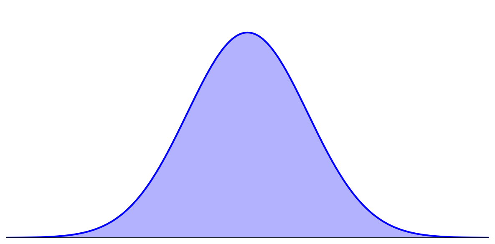
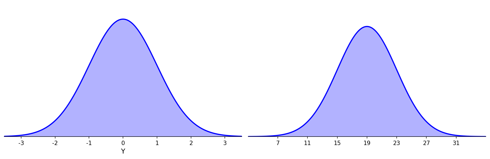
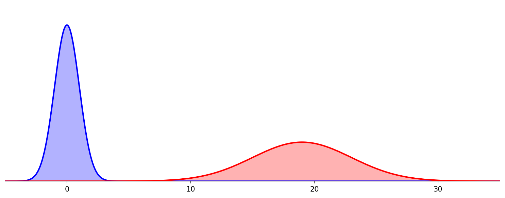
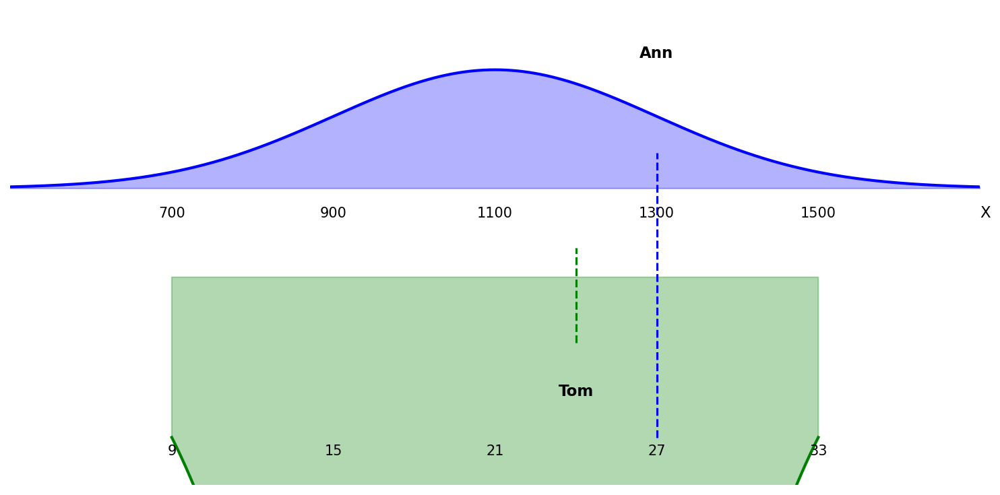
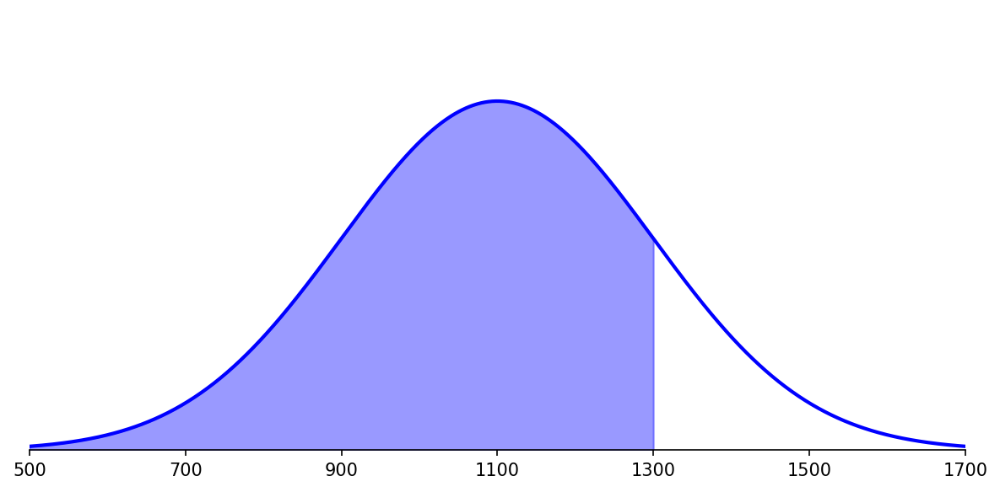
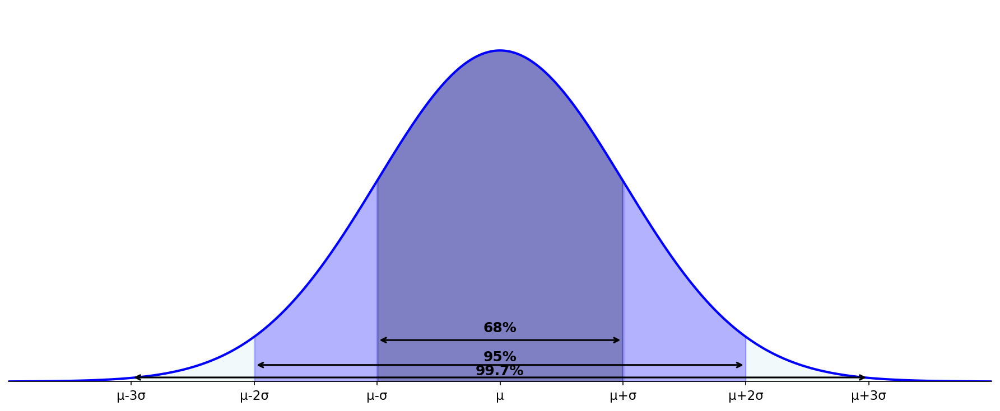
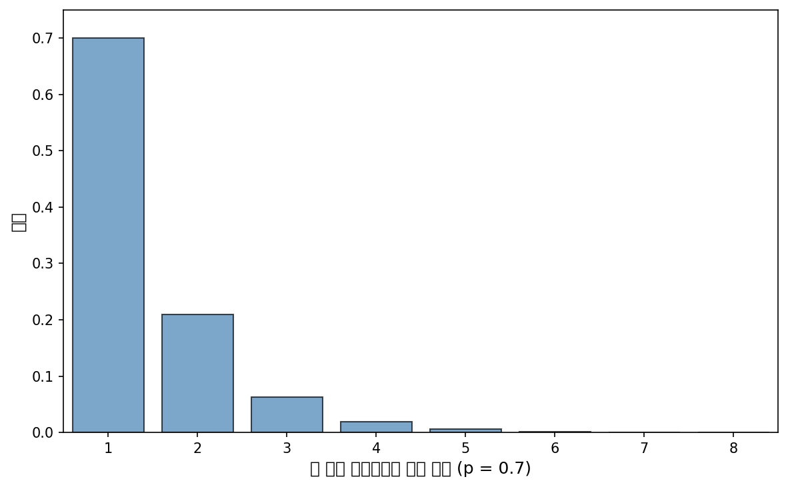
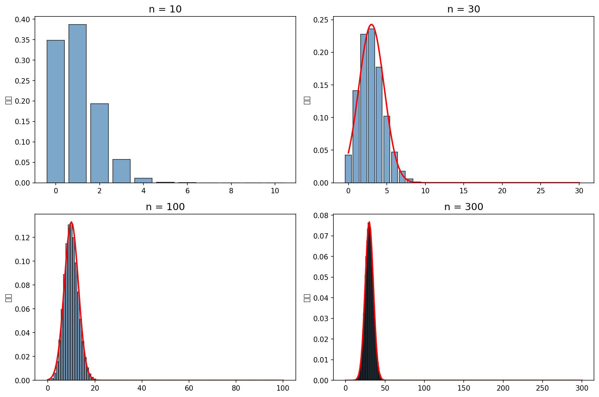
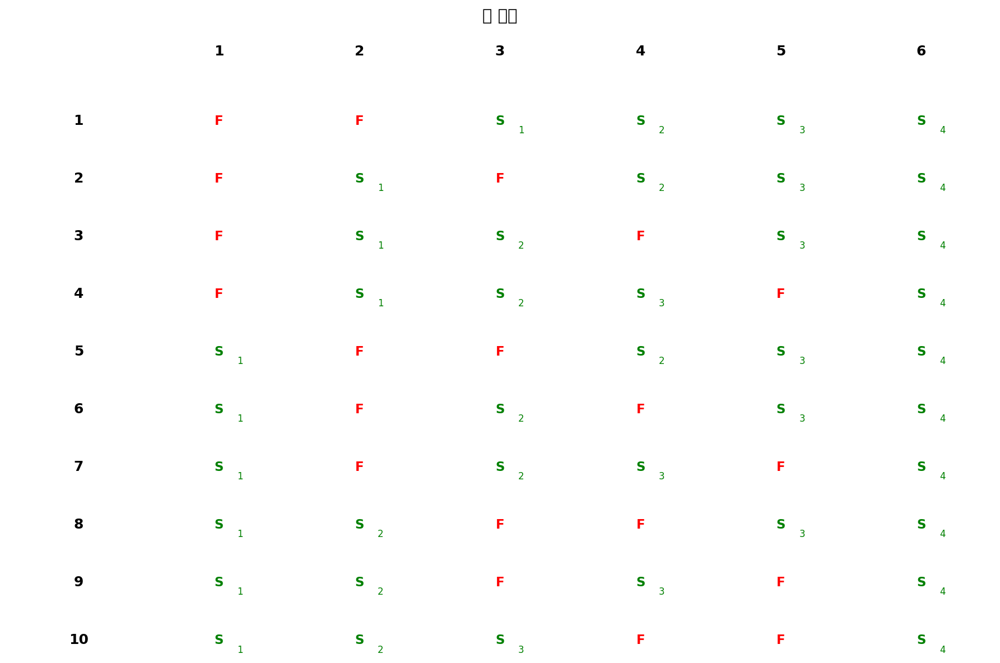
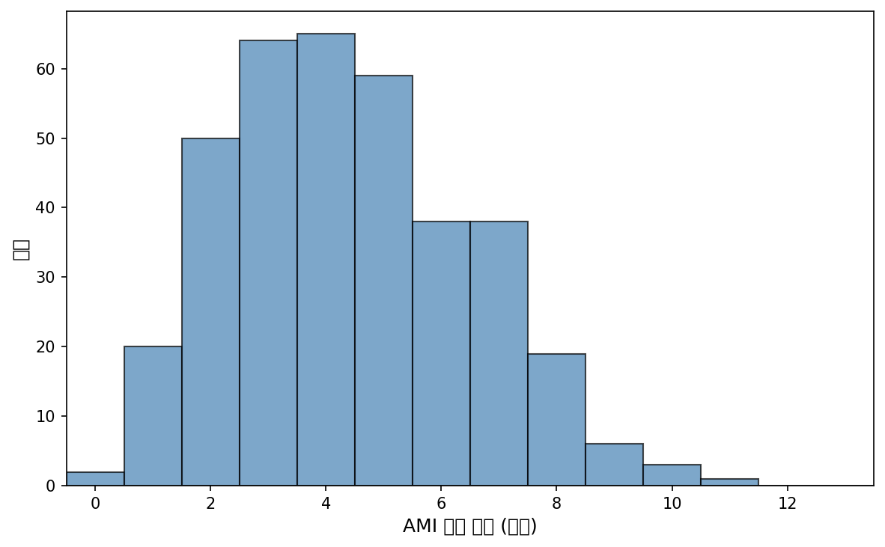

# 제4장 확률변수의 분포 (Distributions of Random Variables)

**OpenIntro Statistics 4판 한국어 완역**

---

## 목차

- 4.1 정규분포 (Normal Distribution)
- 4.2 기하분포 (Geometric Distribution)
- 4.3 이항분포 (Binomial Distribution)
- 4.4 음이항분포 (Negative Binomial Distribution)
- 4.5 포아송분포 (Poisson Distribution)

---

이 장에서는 데이터 분석 및 통계적 추론의 맥락에서 자주 등장하는 통계적 분포를 논의한다. 첫 번째 절에서 다루는 정규분포는 이 책의 후반부 장들에서 빈번하게 사용된다. 나머지 절들은 때때로 참조되지만 이 책의 내용을 위해서는 선택적으로 고려될 수 있다.

비디오, 슬라이드 및 기타 자료는 www.openintro.org/os 에서 확인할 수 있다.

---

## 4.1 정규분포 (Normal Distribution)

실제로 관찰되는 모든 분포 중에서 압도적으로 가장 흔한 분포가 있다. 대칭적이고, 단봉형인 종 모양 곡선은 통계학 전반에서 편재한다. 사실 이것은 너무나 흔해서 사람들은 종종 이를 **정규 곡선**(normal curve) 또는 **정규분포**(normal distribution)라고 부른다. 이는 그림 4.1에 나타나 있다. SAT 점수나 미국 성인 남성의 키 같은 변수들은 정규분포를 밀접하게 따른다.



**그림 4.1**: 정규 곡선

> **정규분포에 대한 사실**
>
> 많은 변수가 거의 정규분포를 따르지만, 정확하게 정규분포인 변수는 없다. 따라서 정규분포는 어떤 단일 문제에도 완벽하지 않지만, 다양한 문제에 매우 유용하다. 우리는 데이터 탐색과 통계학의 중요한 문제를 해결하는 데 이를 사용할 것이다.

---

### 【새로운 시각】 정규분포의 본질적 의미

정규분포가 왜 이토록 자연계와 사회현상에서 널리 나타나는가? 이 질문에 대한 답은 **중심극한정리**(Central Limit Theorem)에 있다.

많은 자연현상과 사회현상은 수많은 작고 독립적인 요인들의 합으로 결정된다:
- **사람의 키** → 수백 개의 유전자, 영양 상태, 환경 요인의 복합적 영향
- **주식 시장의 일일 변동** → 수천 명의 투자자들의 개별 결정의 총합
- **측정 오차** → 여러 작은 오차원의 누적

중심극한정리에 따르면, 독립적인 확률변수들의 합은 그 개별 분포가 무엇이든 간에 정규분포에 수렴한다. 이것이 바로 정규분포가 "정상(normal)"이라고 불리는 이유이다.

역사적으로 이 분포는 **가우스 분포**(Gaussian distribution)라고도 불리는데, 독일 수학자 칼 프리드리히 가우스(1777-1855)가 천문학적 측정 오차를 분석하면서 이 분포의 수학적 표현을 처음으로 공식화했기 때문이다.

---

### 4.1.1 정규분포 모형 (Normal Distribution Model)

정규분포는 항상 대칭적이고, 단봉형인 종 모양 곡선을 나타낸다. 그러나 이러한 곡선들은 모형의 세부 사항에 따라 다르게 보일 수 있다. 구체적으로, 정규분포 모형은 두 개의 **모수**(parameter)를 사용하여 조정할 수 있다: **평균**(mean)과 **표준편차**(standard deviation)이다. 아마도 추측할 수 있듯이, 평균을 변경하면 종 모양 곡선이 왼쪽이나 오른쪽으로 이동하고, 표준편차를 변경하면 곡선이 늘어나거나 좁아진다. 그림 4.2는 왼쪽 패널에서 평균 0과 표준편차 1인 정규분포를, 오른쪽 패널에서 평균 19와 표준편차 4인 정규분포를 보여준다. 그림 4.3은 이 분포들을 같은 축에 나타낸 것이다.



**그림 4.2**: 두 곡선 모두 정규분포를 나타낸다. 그러나 중심과 산포에서 차이가 있다.



**그림 4.3**: 그림 4.2에 나타난 정규분포들을 같은 축에 함께 그린 것이다.

정규분포가 평균 μ와 표준편차 σ를 가질 때, 이 분포를 **N**(μ, σ)로 표기할 수 있다. 그림 4.3의 두 분포는 다음과 같이 쓸 수 있다:

$$N(\mu = 0, \sigma = 1) \quad \text{및} \quad N(\mu = 19, \sigma = 4)$$

평균과 표준편차가 정규분포를 정확하게 설명하므로, 이들을 분포의 **모수**(parameters)라고 부른다. 평균 μ = 0이고 표준편차 σ = 1인 정규분포를 **표준정규분포**(standard normal distribution)라고 부른다.

---

#### Guided Practice 4.1

**문제:** 다음의 정규분포에 대한 약칭을 써라.

(a) 평균 5, 표준편차 3
(b) 평균 -100, 표준편차 10
(c) 평균 2, 표준편차 9

**상세 풀이:**

정규분포의 약칭 표기법은 N(μ, σ) 형태를 사용한다. 여기서 μ는 평균, σ는 표준편차이다.

**(a)** 평균 5, 표준편차 3인 정규분포의 약칭은:
$$N(\mu = 5, \sigma = 3) \quad \text{또는 간단히} \quad N(5, 3)$$

**(b)** 평균 -100, 표준편차 10인 정규분포의 약칭은:
$$N(\mu = -100, \sigma = 10) \quad \text{또는 간단히} \quad N(-100, 10)$$

**(c)** 평균 2, 표준편차 9인 정규분포의 약칭은:
$$N(\mu = 2, \sigma = 9) \quad \text{또는 간단히} \quad N(2, 9)$$

```python
import scipy.stats as stats
import numpy as np

# 각 정규분포 정의
distributions = [
    ("(a)", 5, 3),
    ("(b)", -100, 10),
    ("(c)", 2, 9)
]

print("정규분포 약칭:")
for label, mu, sigma in distributions:
    dist = stats.norm(loc=mu, scale=sigma)
    print(f"{label} N(μ = {mu}, σ = {sigma})")
    print(f"    평균: {dist.mean()}, 표준편차: {dist.std()}")
```

**출력:**
```
정규분포 약칭:
(a) N(μ = 5, σ = 3)
    평균: 5.0, 표준편차: 3.0
(b) N(μ = -100, σ = 10)
    평균: -100.0, 표준편차: 10.0
(c) N(μ = 2, σ = 9)
    평균: 2.0, 표준편차: 9.0
```

---

### 4.1.2 Z-점수를 이용한 표준화 (Standardizing with Z-scores)

우리는 종종 데이터를 표준화된 척도에 놓고 싶어 하는데, 이는 비교를 더 합리적으로 만들 수 있다.

#### 예제 4.2

**문제:** 표 4.4는 SAT와 ACT의 총점에 대한 평균과 표준편차를 보여준다. SAT와 ACT 점수의 분포는 둘 다 거의 정규분포이다. Ann이 SAT에서 1300점을 받았고 Tom이 ACT에서 24점을 받았다고 가정하자. 누가 더 잘했는가?

| | SAT | ACT |
|---|---|---|
| 평균 | 1100 | 21 |
| 표준편차 | 200 | 6 |

**표 4.4**: SAT와 ACT의 평균과 표준편차

**상세 풀이:**

우리는 표준편차를 기준으로 사용한다. Ann은 SAT에서 평균보다 1 표준편차 위에 있다: 1100 + 200 = 1300. Tom은 ACT에서 평균보다 0.5 표준편차 위에 있다: 21 + 0.5 × 6 = 24. 그림 4.5에서 Ann이 다른 모든 사람들에 비해 Tom보다 더 잘했음을 볼 수 있으므로, 그녀의 점수가 더 좋다.



**그림 4.5**: SAT와 ACT 분포에 대해 Ann과 Tom의 점수를 나타낸 것이다.

예제 4.2는 **Z-점수**(Z-score)라고 불리는 표준화 기법을 사용했다. 이 방법은 거의 정규인 관측값에 가장 흔히 사용되지만 어떤 분포에서도 사용될 수 있다. 관측값의 Z-점수는 그것이 평균보다 얼마나 많은 표준편차 위 또는 아래에 있는지로 정의된다. 관측값이 평균보다 1 표준편차 위에 있으면, Z-점수는 1이다. 평균보다 1.5 표준편차 아래에 있으면, Z-점수는 -1.5이다. x가 분포 N(μ, σ)에서의 관측값이면, Z-점수를 수학적으로 다음과 같이 정의한다:

$$Z = \frac{x - \mu}{\sigma}$$

μ_SAT = 1100, σ_SAT = 200, 그리고 x_Ann = 1300을 사용하여, Ann의 Z-점수를 구한다:

$$Z_{Ann} = \frac{x_{Ann} - \mu_{SAT}}{\sigma_{SAT}} = \frac{1300 - 1100}{200} = 1$$

> **Z-점수**
>
> 관측값의 Z-점수는 그것이 평균보다 얼마나 많은 표준편차 위 또는 아래에 있는지를 나타낸다. 평균 μ와 표준편차 σ를 가진 분포를 따르는 관측값 x에 대해 Z-점수를 다음과 같이 계산한다:
>
> $$Z = \frac{x - \mu}{\sigma}$$

```python
import scipy.stats as stats

# SAT와 ACT 분포 모수
mu_sat, sigma_sat = 1100, 200
mu_act, sigma_act = 21, 6

# Ann과 Tom의 점수
x_ann = 1300
x_tom = 24

# Z-점수 계산
z_ann = (x_ann - mu_sat) / sigma_sat
z_tom = (x_tom - mu_act) / sigma_act

print("예제 4.2 풀이:")
print(f"Ann의 SAT 점수: {x_ann}")
print(f"Ann의 Z-점수: Z = ({x_ann} - {mu_sat}) / {sigma_sat} = {z_ann}")
print()
print(f"Tom의 ACT 점수: {x_tom}")
print(f"Tom의 Z-점수: Z = ({x_tom} - {mu_act}) / {sigma_act} = {z_tom:.2f}")
print()
print(f"결론: Ann의 Z-점수({z_ann})가 Tom의 Z-점수({z_tom:.2f})보다 크므로,")
print(f"      Ann이 상대적으로 더 잘했다.")
```

**출력:**
```
예제 4.2 풀이:
Ann의 SAT 점수: 1300
Ann의 Z-점수: Z = (1300 - 1100) / 200 = 1.0

Tom의 ACT 점수: 24
Tom의 Z-점수: Z = (24 - 21) / 6 = 0.50

결론: Ann의 Z-점수(1.0)가 Tom의 Z-점수(0.50)보다 크므로,
      Ann이 상대적으로 더 잘했다.
```

---

#### Guided Practice 4.3

**문제:** Tom의 ACT 점수 24와 ACT 평균 및 표준편차를 사용하여 그의 Z-점수를 구하라.

**상세 풀이:**

ACT의 평균 μ_ACT = 21, 표준편차 σ_ACT = 6, Tom의 점수 x_Tom = 24를 사용한다.

$$Z_{Tom} = \frac{x_{Tom} - \mu_{ACT}}{\sigma_{ACT}} = \frac{24 - 21}{6} = \frac{3}{6} = 0.5$$

Tom의 Z-점수는 **0.5**이다. 이는 Tom의 점수가 평균보다 0.5 표준편차 위에 있음을 의미한다.

```python
# Tom의 Z-점수 계산
mu_act, sigma_act = 21, 6
x_tom = 24

z_tom = (x_tom - mu_act) / sigma_act
print(f"Tom의 Z-점수: Z = ({x_tom} - {mu_act}) / {sigma_act} = {z_tom}")
print(f"해석: Tom의 점수는 평균보다 {z_tom} 표준편차 위에 있다.")
```

**출력:**
```
Tom의 Z-점수: Z = (24 - 21) / 6 = 0.5
해석: Tom의 점수는 평균보다 0.5 표준편차 위에 있다.
```

평균보다 위에 있는 관측값은 항상 양의 Z-점수를 가지고, 평균보다 아래에 있는 관측값은 항상 음의 Z-점수를 가진다. 관측값이 평균과 같으면, 예를 들어 SAT 점수 1100이면, Z-점수는 0이다.

---

#### Guided Practice 4.4

**문제:** X가 N(μ = 3, σ = 2)에서의 확률변수라 하고, x = 5.19를 관측했다고 가정하자.

(a) x의 Z-점수를 구하라.
(b) Z-점수를 사용하여 x가 평균보다 몇 표준편차 위 또는 아래에 있는지 결정하라.

**상세 풀이:**

**(a)** Z-점수 계산:

$$Z = \frac{x - \mu}{\sigma} = \frac{5.19 - 3}{2} = \frac{2.19}{2} = 1.095$$

**(b)** Z-점수의 해석:

관측값 x는 평균보다 **1.095 표준편차 위**에 있다. Z가 양수이므로 평균 위에 있음을 알 수 있다.

```python
# Guided Practice 4.4 풀이
mu, sigma = 3, 2
x = 5.19

# (a) Z-점수 계산
z = (x - mu) / sigma
print(f"(a) Z-점수: Z = ({x} - {mu}) / {sigma} = {z}")

# (b) 해석
print(f"(b) 관측값 x = {x}는 평균보다 {z:.3f} 표준편차 위에 있다.")
print(f"    Z가 양수이므로 평균 위에 있음을 알 수 있다.")
```

**출력:**
```
(a) Z-점수: Z = (5.19 - 3) / 2 = 1.095
(b) 관측값 x = 5.19는 평균보다 1.095 표준편차 위에 있다.
    Z가 양수이므로 평균 위에 있음을 알 수 있다.
```

---

#### Guided Practice 4.5

**문제:** 붓꼬리주머니쥐(brushtail possums)의 머리 길이는 평균 92.6mm와 표준편차 3.6mm인 정규분포를 따른다. 머리 길이가 95.4mm와 85.8mm인 주머니쥐들의 Z-점수를 계산하라.

**상세 풀이:**

붓꼬리주머니쥐 머리 길이: N(μ = 92.6, σ = 3.6)

**첫 번째 주머니쥐 (x₁ = 95.4mm):**

$$Z_1 = \frac{x_1 - \mu}{\sigma} = \frac{95.4 - 92.6}{3.6} = \frac{2.8}{3.6} = 0.78$$

**두 번째 주머니쥐 (x₂ = 85.8mm):**

$$Z_2 = \frac{x_2 - \mu}{\sigma} = \frac{85.8 - 92.6}{3.6} = \frac{-6.8}{3.6} = -1.89$$

```python
# Guided Practice 4.5 풀이
mu, sigma = 92.6, 3.6
x1, x2 = 95.4, 85.8

z1 = (x1 - mu) / sigma
z2 = (x2 - mu) / sigma

print(f"붓꼬리주머니쥐 머리 길이 분포: N({mu}, {sigma})")
print()
print(f"x₁ = {x1}mm의 Z-점수:")
print(f"  Z₁ = ({x1} - {mu}) / {sigma} = {z1:.2f}")
print(f"  해석: 평균보다 {z1:.2f} 표준편차 위")
print()
print(f"x₂ = {x2}mm의 Z-점수:")
print(f"  Z₂ = ({x2} - {mu}) / {sigma} = {z2:.2f}")
print(f"  해석: 평균보다 {abs(z2):.2f} 표준편차 아래")
```

**출력:**
```
붓꼬리주머니쥐 머리 길이 분포: N(92.6, 3.6)

x₁ = 95.4mm의 Z-점수:
  Z₁ = (95.4 - 92.6) / 3.6 = 0.78
  해석: 평균보다 0.78 표준편차 위

x₂ = 85.8mm의 Z-점수:
  Z₂ = (85.8 - 92.6) / 3.6 = -1.89
  해석: 평균보다 1.89 표준편차 아래
```

우리는 Z-점수를 사용하여 어떤 관측값이 다른 관측값보다 더 특이한지를 대략적으로 식별할 수 있다. 관측값 x₁이 다른 관측값 x₂보다 더 특이하다고 말할 수 있는 것은 x₁의 Z-점수의 절댓값이 x₂의 Z-점수의 절댓값보다 클 때이다: |Z₁| > |Z₂|. 이 기법은 분포가 대칭일 때 특히 유용하다.

---

#### Guided Practice 4.6

**문제:** Guided Practice 4.5의 두 관측값 중 어느 것이 더 특이한가?

**상세 풀이:**

두 Z-점수의 절댓값을 비교한다:
- |Z₁| = |0.78| = 0.78
- |Z₂| = |-1.89| = 1.89

두 번째 관측값(85.8mm)의 Z-점수 절댓값(1.89)이 첫 번째 관측값(95.4mm)의 Z-점수 절댓값(0.78)보다 크므로, **두 번째 관측값이 더 특이한 머리 길이를 가진다**.

```python
# Guided Practice 4.6 풀이
z1, z2 = 0.78, -1.89

abs_z1 = abs(z1)
abs_z2 = abs(z2)

print(f"|Z₁| = |{z1}| = {abs_z1}")
print(f"|Z₂| = |{z2}| = {abs_z2}")
print()
if abs_z2 > abs_z1:
    print(f"|Z₂| > |Z₁| 이므로, 두 번째 관측값(85.8mm)이 더 특이하다.")
else:
    print(f"|Z₁| > |Z₂| 이므로, 첫 번째 관측값(95.4mm)이 더 특이하다.")
```

**출력:**
```
|Z₁| = |0.78| = 0.78
|Z₂| = |-1.89| = 1.89

|Z₂| > |Z₁| 이므로, 두 번째 관측값(85.8mm)이 더 특이하다.
```

---

### 【새로운 시각】 Z-점수의 직관적 이해

Z-점수는 단순히 "평균에서 얼마나 떨어져 있는가"를 표준편차 단위로 측정한 것이다. 이를 일상적인 예로 이해해보자.

**비유: 시험 점수**

반 평균이 70점이고 표준편차가 10점인 시험을 생각해보자.
- 80점을 받으면 Z = 1.0 (평균보다 1 표준편차 위, "꽤 잘함")
- 90점을 받으면 Z = 2.0 (평균보다 2 표준편차 위, "매우 잘함")
- 60점을 받으면 Z = -1.0 (평균보다 1 표준편차 아래, "약간 못함")

**Z-점수의 경험적 해석:**
- |Z| < 1: 대부분의 데이터가 여기에 있음 (약 68%)
- |Z| < 2: 거의 모든 데이터가 여기에 있음 (약 95%)
- |Z| > 2: 상당히 특이한 값
- |Z| > 3: 매우 드문 값 (1000개 중 약 3개)

이러한 직관은 데이터 분석에서 이상치(outlier)를 탐지하거나, 결과의 통계적 유의성을 빠르게 판단하는 데 유용하다.

---

### 4.1.3 꼬리 면적 구하기 (Finding Tail Areas)

통계학에서 분포의 꼬리 면적을 식별할 수 있는 것은 매우 유용하다. 예를 들어, Ann의 점수 1300점보다 낮은 SAT 점수를 가진 사람들의 비율은 얼마인가? 이것은 Ann이 속한 백분위수, 즉 Ann보다 낮은 점수를 받은 사례의 비율과 같다. 이러한 꼬리 면적은 그림 4.6에 나타난 곡선과 음영처럼 시각화할 수 있다.



**그림 4.6**: Z의 왼쪽 면적은 Ann보다 낮은 점수를 받은 사람들의 비율을 나타낸다.

이를 수행하는 여러 가지 기법이 있으며, 세 가지 옵션을 논의하겠다.

1. **실제로 가장 흔한 접근 방식은 통계 소프트웨어를 사용하는 것이다.** 예를 들어, R 프로그램에서 Z-점수를 입력하면 하위 꼬리 면적을 반환하는 다음 명령을 사용하여 그림 4.6에 표시된 면적을 찾을 수 있다:
   ```
   > pnorm(1)
   [1] 0.8413447
   ```
   이 계산에 따르면, 1300 아래에 음영 처리된 영역은 Z = 1 아래의 Z-점수를 가진 SAT 응시자의 비율 0.841(84.1%)을 나타낸다. 더 일반적으로, 평균과 표준편차를 명시하면 절단값을 명시적으로 지정할 수도 있다:
   ```
   > pnorm(1300, mean = 1100, sd = 200)
   [1] 0.8413447
   ```
   Python이나 SAS 같은 다른 소프트웨어 옵션도 많이 있다. Excel이나 Google Sheets 같은 스프레드시트 프로그램도 이러한 계산을 지원한다.

2. **교실에서 흔한 전략은 TI나 Casio 계산기 같은 그래핑 계산기를 사용하는 것이다.** 이러한 계산기는 덜 간결하게 설명되는 일련의 버튼 조작이 필요하다. 정규분포의 꼬리 면적을 찾기 위해 이러한 계산기를 사용하는 방법에 대한 지침은 OpenIntro 비디오 라이브러리에서 찾을 수 있다: www.openintro.org/videos

3. **꼬리 면적을 찾는 마지막 옵션은 확률표를 사용하는 것이다.** 이것은 교실에서 가끔 사용되지만 실제로는 거의 사용되지 않는다. 부록 C.1에 이러한 표와 사용 방법에 대한 안내가 포함되어 있다.

우리는 이 절에서 항상 먼저 Z-점수를 찾아서 정규분포 문제를 풀 것이다. 그 이유는 제5장부터 검정통계량(test statistics)이라는 밀접한 유사 개념을 접하게 될 것인데, 이것은 많은 경우에 Z-점수와 동등하기 때문이다.

```python
import scipy.stats as stats

# 방법 1: Z-점수를 사용한 꼬리 면적 계산
z = 1
tail_area = stats.norm.cdf(z)
print(f"Z = {z}의 하위 꼬리 면적: {tail_area:.4f} ({tail_area*100:.2f}%)")

# 방법 2: 직접 값과 분포 모수를 사용
x = 1300
mu, sigma = 1100, 200
tail_area_direct = stats.norm.cdf(x, loc=mu, scale=sigma)
print(f"X = {x}의 하위 꼬리 면적 (N({mu}, {sigma})): {tail_area_direct:.4f}")

# 두 방법이 같은 결과를 주는지 확인
print(f"\n두 방법의 결과가 같음: {abs(tail_area - tail_area_direct) < 0.0001}")
```

**출력:**
```
Z = 1의 하위 꼬리 면적: 0.8413 (84.13%)
X = 1300의 하위 꼬리 면적 (N(1100, 200)): 0.8413

두 방법의 결과가 같음: True
```

---

### 4.1.4 정규 확률 예제 (Normal Probability Examples)

누적 SAT 점수는 정규 모형 N(μ = 1100, σ = 200)으로 잘 근사된다.

#### 예제 4.7

**문제:** Shannon은 무작위로 선택된 SAT 응시자이고, Shannon의 SAT 적성에 대해 알려진 것이 없다. Shannon이 SAT에서 최소 1190점을 받을 확률은 얼마인가?

**상세 풀이:**

먼저, 항상 정규분포의 그림을 그리고 레이블을 붙인다. (그림이 정확할 필요는 없지만 유용하다.) 우리는 그녀가 1190점 이상을 받을 확률에 관심이 있으므로, 이 상위 꼬리를 음영 처리한다:

그림은 평균과 평균 위아래로 2 표준편차에 해당하는 값들(700, 1100, 1500)을 보여준다.

곡선 아래의 음영 면적을 찾는 가장 간단한 방법은 절단값의 Z-점수를 이용하는 것이다. μ = 1100, σ = 200, 그리고 절단값 x = 1190을 사용하여 Z-점수를 다음과 같이 계산한다:

$$Z = \frac{x - \mu}{\sigma} = \frac{1190 - 1100}{200} = \frac{90}{200} = 0.45$$

통계 소프트웨어(또는 다른 선호하는 방법)를 사용하면, Z = 0.45의 왼쪽 면적이 0.6736임을 알 수 있다. Z = 0.45 위의 면적을 찾으려면, 하위 꼬리 면적을 1에서 빼면 된다:

$$1.0000 - 0.6736 = 0.3264$$

Shannon이 SAT에서 최소 1190점을 받을 확률은 **0.3264**이다.

> **항상 먼저 그림을 그리고, 두 번째로 Z-점수를 구하라**
>
> 어떤 정규 확률 상황에서든, 항상 항상 항상 정규 곡선을 그리고 레이블을 붙이고 관심 영역을 음영 처리하라. 그림이 확률의 추정치를 제공할 것이다.
>
> 상황을 나타내는 그림을 그린 후, 관심 값에 대한 Z-점수를 식별하라.

```python
import scipy.stats as stats

# 예제 4.7: Shannon의 SAT 점수
mu, sigma = 1100, 200
x = 1190

# 단계 1: Z-점수 계산
z = (x - mu) / sigma
print(f"예제 4.7: Shannon이 최소 1190점을 받을 확률")
print(f"=" * 50)
print(f"주어진 정보:")
print(f"  SAT 분포: N(μ = {mu}, σ = {sigma})")
print(f"  관심 점수: x = {x}")
print()

print(f"단계 1: Z-점수 계산")
print(f"  Z = (x - μ) / σ = ({x} - {mu}) / {sigma} = {z}")
print()

# 단계 2: 꼬리 면적 계산
lower_tail = stats.norm.cdf(z)
upper_tail = 1 - lower_tail

print(f"단계 2: 꼬리 면적 계산")
print(f"  P(Z < {z}) = {lower_tail:.4f}")
print(f"  P(Z ≥ {z}) = 1 - {lower_tail:.4f} = {upper_tail:.4f}")
print()
print(f"답: Shannon이 최소 1190점을 받을 확률은 {upper_tail:.4f} ({upper_tail*100:.2f}%)이다.")
```

**출력:**
```
예제 4.7: Shannon이 최소 1190점을 받을 확률
==================================================
주어진 정보:
  SAT 분포: N(μ = 1100, σ = 200)
  관심 점수: x = 1190

단계 1: Z-점수 계산
  Z = (x - μ) / σ = (1190 - 1100) / 200 = 0.45

단계 2: 꼬리 면적 계산
  P(Z < 0.45) = 0.6736
  P(Z ≥ 0.45) = 1 - 0.6736 = 0.3264

답: Shannon이 최소 1190점을 받을 확률은 0.3264 (32.64%)이다.
```

---

#### Guided Practice 4.8

**문제:** Shannon이 최소 1190점을 받을 확률이 0.3264라면, 그녀가 1190점 미만을 받을 확률은 얼마인가? 상위 영역 대신 하위 영역을 음영 처리하여 이 연습을 나타내는 정규 곡선을 그려라.

**상세 풀이:**

예제 4.7에서 P(X ≥ 1190) = 0.3264임을 찾았다. 여사건의 확률을 사용하면:

$$P(X < 1190) = 1 - P(X \geq 1190) = 1 - 0.3264 = 0.6736$$

또는 직접 하위 꼬리 면적을 계산해도 같은 결과를 얻는다.

```python
# Guided Practice 4.8: Shannon이 1190점 미만을 받을 확률
mu, sigma = 1100, 200
x = 1190

z = (x - mu) / sigma
prob_less_than = stats.norm.cdf(z)

print(f"Shannon이 1190점 미만을 받을 확률:")
print(f"  Z = {z}")
print(f"  P(X < 1190) = P(Z < {z}) = {prob_less_than:.4f}")
print()
print(f"검증: P(X < 1190) + P(X ≥ 1190) = {prob_less_than:.4f} + 0.3264 = {prob_less_than + 0.3264:.4f}")
```

**출력:**
```
Shannon이 1190점 미만을 받을 확률:
  Z = 0.45
  P(X < 1190) = P(Z < 0.45) = 0.6736

검증: P(X < 1190) + P(X ≥ 1190) = 0.6736 + 0.3264 = 1.0000
```

---

#### 예제 4.9

**문제:** Edward가 SAT에서 1030점을 받았다. 그의 백분위수는 얼마인가?

**상세 풀이:**

먼저 그림이 필요하다. Edward의 백분위수는 1030점만큼 높은 점수를 받지 못한 사람들의 비율이다. 이것은 1030의 왼쪽에 있는 점수들이다.

평균 μ = 1100, 표준편차 σ = 200, 그리고 꼬리 면적의 절단값 x = 1030을 확인하면 Z-점수를 쉽게 계산할 수 있다:

$$Z = \frac{x - \mu}{\sigma} = \frac{1030 - 1100}{200} = -0.35$$

통계 소프트웨어를 사용하면, 꼬리 면적이 0.3632임을 알 수 있다. Edward는 **36번째 백분위수**에 있다.

```python
# 예제 4.9: Edward의 백분위수
mu, sigma = 1100, 200
x = 1030

z = (x - mu) / sigma
percentile = stats.norm.cdf(z)

print(f"예제 4.9: Edward의 SAT 백분위수")
print(f"=" * 50)
print(f"주어진 정보:")
print(f"  SAT 분포: N(μ = {mu}, σ = {sigma})")
print(f"  Edward의 점수: x = {x}")
print()
print(f"Z-점수 계산:")
print(f"  Z = ({x} - {mu}) / {sigma} = {z}")
print()
print(f"백분위수 계산:")
print(f"  P(X < {x}) = P(Z < {z}) = {percentile:.4f}")
print()
print(f"답: Edward는 {percentile*100:.0f}번째 백분위수에 있다.")
print(f"    즉, SAT 응시자의 약 {percentile*100:.0f}%가 Edward보다 낮은 점수를 받았다.")
```

**출력:**
```
예제 4.9: Edward의 SAT 백분위수
==================================================
주어진 정보:
  SAT 분포: N(μ = 1100, σ = 200)
  Edward의 점수: x = 1030

Z-점수 계산:
  Z = (1030 - 1100) / 200 = -0.35

백분위수 계산:
  P(X < 1030) = P(Z < -0.35) = 0.3632

답: Edward는 36번째 백분위수에 있다.
    즉, SAT 응시자의 약 36%가 Edward보다 낮은 점수를 받았다.
```

---

#### Guided Practice 4.10

**문제:** 예제 4.9의 결과를 사용하여 Edward보다 더 잘한 SAT 응시자의 비율을 계산하라. 또한 새 그림을 그려라.

**상세 풀이:**

Edward가 응시자의 36%보다 더 잘했다면, 약 64%가 그보다 더 잘했을 것이다.

$$P(X > 1030) = 1 - P(X < 1030) = 1 - 0.3632 = 0.6368$$

```python
# Guided Practice 4.10
percentile_edward = 0.3632
better_than_edward = 1 - percentile_edward

print(f"Edward보다 더 잘한 SAT 응시자의 비율:")
print(f"  P(X > 1030) = 1 - P(X < 1030) = 1 - {percentile_edward:.4f} = {better_than_edward:.4f}")
print(f"  약 {better_than_edward*100:.0f}%의 응시자가 Edward보다 더 잘했다.")
```

**출력:**
```
Edward보다 더 잘한 SAT 응시자의 비율:
  P(X > 1030) = 1 - P(X < 1030) = 1 - 0.3632 = 0.6368
  약 64%의 응시자가 Edward보다 더 잘했다.
```

> **오른쪽 면적 찾기**
>
> 많은 소프트웨어 프로그램은 Z-점수가 주어지면 왼쪽 면적을 반환한다. 오른쪽 면적을 원한다면, 먼저 왼쪽 면적을 찾고 이 값을 1에서 빼면 된다.

---

#### Guided Practice 4.11

**문제:** Stuart가 SAT에서 1500점을 받았다. 각 부분에 대해 그림을 그려라.

(a) 그의 백분위수는 얼마인가?
(b) Stuart보다 더 잘한 SAT 응시자는 몇 퍼센트인가?

**상세 풀이:**

**(a)** Stuart의 백분위수:

$$Z = \frac{1500 - 1100}{200} = 2$$

Z = 2의 왼쪽 면적 = 0.9772

Stuart는 **약 98번째 백분위수**에 있다.

**(b)** Stuart보다 더 잘한 비율:

$$1 - 0.9772 = 0.0228$$

약 **2.28%**의 응시자가 Stuart보다 더 잘했다.

```python
# Guided Practice 4.11
mu, sigma = 1100, 200
x_stuart = 1500

z_stuart = (x_stuart - mu) / sigma
percentile_stuart = stats.norm.cdf(z_stuart)
better_than_stuart = 1 - percentile_stuart

print(f"Stuart의 SAT 점수: {x_stuart}")
print(f"Z-점수: Z = ({x_stuart} - {mu}) / {sigma} = {z_stuart}")
print()
print(f"(a) Stuart의 백분위수:")
print(f"    P(X < {x_stuart}) = {percentile_stuart:.4f}")
print(f"    Stuart는 약 {percentile_stuart*100:.0f}번째 백분위수에 있다.")
print()
print(f"(b) Stuart보다 더 잘한 비율:")
print(f"    P(X > {x_stuart}) = 1 - {percentile_stuart:.4f} = {better_than_stuart:.4f}")
print(f"    약 {better_than_stuart*100:.2f}%의 응시자가 Stuart보다 더 잘했다.")
```

**출력:**
```
Stuart의 SAT 점수: 1500
Z-점수: Z = (1500 - 1100) / 200 = 2.0

(a) Stuart의 백분위수:
    P(X < 1500) = 0.9772
    Stuart는 약 98번째 백분위수에 있다.

(b) Stuart보다 더 잘한 비율:
    P(X > 1500) = 1 - 0.9772 = 0.0228
    약 2.28%의 응시자가 Stuart보다 더 잘했다.
```

---

100명의 남성 표본을 기반으로, 미국 성인 남성의 키는 평균 70.0인치와 표준편차 3.3인치인 거의 정규분포이다.

#### Guided Practice 4.12

**문제:** Mike는 5피트 7인치이고 Jose는 6피트 4인치이며, 둘 다 미국에 산다.

(a) Mike의 키 백분위수는 얼마인가?
(b) Jose의 키 백분위수는 얼마인가?

각 부분에 대해 그림도 그려라.

**상세 풀이:**

먼저 키를 인치로 변환한다: Mike = 67인치, Jose = 76인치

미국 남성 키: N(μ = 70, σ = 3.3)

**(a)** Mike의 백분위수:

$$Z_{Mike} = \frac{67 - 70}{3.3} = -0.91$$

P(Z < -0.91) = 0.1814

Mike는 **약 18번째 백분위수**에 있다.

**(b)** Jose의 백분위수:

$$Z_{Jose} = \frac{76 - 70}{3.3} = 1.82$$

P(Z < 1.82) = 0.9656

Jose는 **약 97번째 백분위수**에 있다.

```python
# Guided Practice 4.12
mu, sigma = 70, 3.3
mike_height = 67  # 5'7" = 67 inches
jose_height = 76  # 6'4" = 76 inches

# Mike
z_mike = (mike_height - mu) / sigma
percentile_mike = stats.norm.cdf(z_mike)

# Jose
z_jose = (jose_height - mu) / sigma
percentile_jose = stats.norm.cdf(z_jose)

print(f"미국 남성 키 분포: N(μ = {mu}\", σ = {sigma}\")")
print()
print(f"(a) Mike (5'7\" = {mike_height}\"):")
print(f"    Z = ({mike_height} - {mu}) / {sigma} = {z_mike:.2f}")
print(f"    백분위수: {percentile_mike:.4f} ({percentile_mike*100:.1f}번째)")
print()
print(f"(b) Jose (6'4\" = {jose_height}\"):")
print(f"    Z = ({jose_height} - {mu}) / {sigma} = {z_jose:.2f}")
print(f"    백분위수: {percentile_jose:.4f} ({percentile_jose*100:.1f}번째)")
```

**출력:**
```
미국 남성 키 분포: N(μ = 70", σ = 3.3")

(a) Mike (5'7" = 67"):
    Z = (67 - 70) / 3.3 = -0.91
    백분위수: 0.1814 (18.1번째)

(b) Jose (6'4" = 76"):
    Z = (76 - 70) / 3.3 = 1.82
    백분위수: 0.9656 (96.6번째)
```

---

마지막 몇 문제는 특정 관측값에 대한 백분위수(하위 꼬리)나 상위 꼬리를 찾는 데 초점을 맞췄다. 특정 백분위수에 해당하는 관측값을 알고 싶다면 어떻게 해야 할까?

#### 예제 4.13

**문제:** Erik의 키는 40번째 백분위수에 있다. 그는 얼마나 키가 큰가?

**상세 풀이:**

항상 그렇듯이, 먼저 그림을 그린다.

이 경우, 하위 꼬리 확률(0.40)이 알려져 있으며, 이를 다이어그램에 음영 처리할 수 있다. 우리는 이 값에 해당하는 관측값을 찾고 싶다. 이 방향의 첫 번째 단계로, 40번째 백분위수와 연관된 Z-점수를 결정한다. 소프트웨어를 사용하면, 해당하는 Z-점수가 약 -0.25임을 얻을 수 있다.

Z_Erik = -0.25와 모집단 모수 μ = 70, σ = 3.3인치를 알고 있으므로, Z-점수 공식을 설정하여 Erik의 알려지지 않은 키 x_Erik을 결정할 수 있다:

$$-0.25 = Z_{Erik} = \frac{x_{Erik} - \mu}{\sigma} = \frac{x_{Erik} - 70}{3.3}$$

x_Erik에 대해 풀면 키가 69.18인치임을 얻는다. 즉, Erik은 약 **5피트 9인치**이다.

```python
# 예제 4.13: Erik의 키 (40번째 백분위수)
mu, sigma = 70, 3.3
percentile = 0.40

# 40번째 백분위수에 해당하는 Z-점수 찾기
z = stats.norm.ppf(percentile)

# 키 계산: Z = (x - μ) / σ → x = μ + Z × σ
x_erik = mu + z * sigma

print(f"예제 4.13: Erik의 키 (40번째 백분위수)")
print(f"=" * 50)
print(f"주어진 정보:")
print(f"  미국 남성 키 분포: N(μ = {mu}\", σ = {sigma}\")")
print(f"  Erik의 백분위수: {percentile*100:.0f}번째")
print()
print(f"단계 1: {percentile*100:.0f}번째 백분위수의 Z-점수 찾기")
print(f"  Z = {z:.4f} (약 {z:.2f})")
print()
print(f"단계 2: Z-점수 공식을 사용하여 키 계산")
print(f"  Z = (x - μ) / σ")
print(f"  {z:.2f} = (x - {mu}) / {sigma}")
print(f"  x = {mu} + ({z:.2f}) × {sigma}")
print(f"  x = {x_erik:.2f} 인치")
print()
print(f"답: Erik의 키는 약 {x_erik:.2f}인치 (약 5피트 9인치)이다.")
```

**출력:**
```
예제 4.13: Erik의 키 (40번째 백분위수)
==================================================
주어진 정보:
  미국 남성 키 분포: N(μ = 70", σ = 3.3")
  Erik의 백분위수: 40번째

단계 1: 40번째 백분위수의 Z-점수 찾기
  Z = -0.2533 (약 -0.25)

단계 2: Z-점수 공식을 사용하여 키 계산
  Z = (x - μ) / σ
  -0.25 = (x - 70) / 3.3
  x = 70 + (-0.25) × 3.3
  x = 69.16 인치

답: Erik의 키는 약 69.16인치 (약 5피트 9인치)이다.
```

---

#### 예제 4.14

**문제:** 82번째 백분위수의 성인 남성 키는 얼마인가?

**상세 풀이:**

다시, 먼저 그림을 그린다.

다음으로, 82번째 백분위수의 Z-점수를 찾고 싶다. 이것은 양수 값이 될 것이며, 소프트웨어를 사용하면 Z = 0.92로 찾을 수 있다. 마지막으로, 알려진 평균 μ, 표준편차 σ, 그리고 Z-점수 Z = 0.92를 사용하여 Z-점수 공식으로 키 x를 찾는다:

$$0.92 = Z = \frac{x - \mu}{\sigma} = \frac{x - 70}{3.3}$$

이것은 82번째 백분위수의 키가 73.04인치 또는 약 **6피트 1인치**임을 나타낸다.

```python
# 예제 4.14: 82번째 백분위수의 키
mu, sigma = 70, 3.3
percentile = 0.82

z = stats.norm.ppf(percentile)
x = mu + z * sigma

print(f"예제 4.14: 82번째 백분위수의 키")
print(f"=" * 50)
print(f"단계 1: 82번째 백분위수의 Z-점수")
print(f"  Z = {z:.2f}")
print()
print(f"단계 2: 키 계산")
print(f"  x = μ + Z × σ = {mu} + {z:.2f} × {sigma} = {x:.2f}인치")
print()
print(f"답: 82번째 백분위수의 키는 약 {x:.2f}인치 (약 6피트 1인치)이다.")
```

**출력:**
```
예제 4.14: 82번째 백분위수의 키
==================================================
단계 1: 82번째 백분위수의 Z-점수
  Z = 0.92

단계 2: 키 계산
  x = μ + Z × σ = 70 + 0.92 × 3.3 = 73.03인치

답: 82번째 백분위수의 키는 약 73.03인치 (약 6피트 1인치)이다.
```

---

#### Guided Practice 4.15

**문제:** SAT 점수는 N(1100, 200)을 따른다.

(a) SAT 점수의 95번째 백분위수는 얼마인가?
(b) SAT 점수의 97.5번째 백분위수는 얼마인가?

**상세 풀이:**

**(a)** 95번째 백분위수:

Z₉₅ = 1.6449

x = 1100 + 1.6449 × 200 = **1429점**

**(b)** 97.5번째 백분위수:

Z₉₇.₅ = 1.96

x = 1100 + 1.96 × 200 = **1492점**

```python
# Guided Practice 4.15
mu, sigma = 1100, 200

# (a) 95번째 백분위수
z_95 = stats.norm.ppf(0.95)
x_95 = mu + z_95 * sigma

# (b) 97.5번째 백분위수
z_975 = stats.norm.ppf(0.975)
x_975 = mu + z_975 * sigma

print(f"SAT 점수 분포: N({mu}, {sigma})")
print()
print(f"(a) 95번째 백분위수:")
print(f"    Z = {z_95:.4f}")
print(f"    x = {mu} + {z_95:.4f} × {sigma} = {x_95:.0f}점")
print()
print(f"(b) 97.5번째 백분위수:")
print(f"    Z = {z_975:.4f}")
print(f"    x = {mu} + {z_975:.4f} × {sigma} = {x_975:.0f}점")
```

**출력:**
```
SAT 점수 분포: N(1100, 200)

(a) 95번째 백분위수:
    Z = 1.6449
    x = 1100 + 1.6449 × 200 = 1429점

(b) 97.5번째 백분위수:
    Z = 1.9600
    x = 1100 + 1.9600 × 200 = 1492점
```

---

#### Guided Practice 4.16

**문제:** 성인 남성 키는 N(70.0", 3.3")을 따른다.

(a) 무작위로 선택된 성인 남성이 최소 6피트 2인치(74인치)일 확률은 얼마인가?
(b) 성인 남성이 5피트 9인치(69인치)보다 작을 확률은 얼마인가?

**상세 풀이:**

**(a)** P(X ≥ 74):

Z = (74 - 70) / 3.3 = 1.21

P(Z ≥ 1.21) = 1 - 0.8869 = **0.1131** (약 11.3%)

**(b)** P(X < 69):

Z = (69 - 70) / 3.3 = -0.30

P(Z < -0.30) = **0.3821** (약 38.2%)

```python
# Guided Practice 4.16
mu, sigma = 70, 3.3

# (a) P(X ≥ 74)
x_a = 74
z_a = (x_a - mu) / sigma
prob_a = 1 - stats.norm.cdf(z_a)

# (b) P(X < 69)
x_b = 69
z_b = (x_b - mu) / sigma
prob_b = stats.norm.cdf(z_b)

print(f"성인 남성 키 분포: N({mu}\", {sigma}\")")
print()
print(f"(a) 최소 74인치(6'2\")일 확률:")
print(f"    Z = ({x_a} - {mu}) / {sigma} = {z_a:.2f}")
print(f"    P(X ≥ {x_a}) = 1 - P(Z < {z_a:.2f}) = 1 - {stats.norm.cdf(z_a):.4f} = {prob_a:.4f}")
print()
print(f"(b) 69인치(5'9\")보다 작을 확률:")
print(f"    Z = ({x_b} - {mu}) / {sigma} = {z_b:.2f}")
print(f"    P(X < {x_b}) = P(Z < {z_b:.2f}) = {prob_b:.4f}")
```

**출력:**
```
성인 남성 키 분포: N(70", 3.3")

(a) 최소 74인치(6'2")일 확률:
    Z = (74 - 70) / 3.3 = 1.21
    P(X ≥ 74) = 1 - P(Z < 1.21) = 1 - 0.8869 = 0.1131

(b) 69인치(5'9")보다 작을 확률:
    Z = (69 - 70) / 3.3 = -0.30
    P(X < 69) = P(Z < -0.30) = 0.3821
```

---

#### 예제 4.17

**문제:** 무작위 성인 남성이 5피트 9인치와 6피트 2인치 사이일 확률은 얼마인가?

**상세 풀이:**

이 키들은 69인치와 74인치에 해당한다. 먼저 그림을 그린다. 관심 영역은 더 이상 상위 또는 하위 꼬리가 아니다.

곡선 아래의 전체 면적은 1이다. 음영 처리되지 않은 두 꼬리의 면적을 찾으면(Guided Practice 4.16에서 이 면적들은 0.3821과 0.1131이다), 중간 영역을 찾을 수 있다:

$$1.0000 - 0.3821 - 0.1131 = 0.5048$$

즉, 5피트 9인치와 6피트 2인치 사이일 확률은 **0.5048**이다.

```python
# 예제 4.17: 5'9"와 6'2" 사이의 확률
mu, sigma = 70, 3.3
x_low, x_high = 69, 74

# 각 꼬리 면적 계산
z_low = (x_low - mu) / sigma
z_high = (x_high - mu) / sigma

lower_tail = stats.norm.cdf(z_low)  # P(X < 69)
upper_tail = 1 - stats.norm.cdf(z_high)  # P(X > 74)

# 중간 영역
middle_area = 1 - lower_tail - upper_tail

print(f"예제 4.17: 69\"와 74\" 사이의 확률")
print(f"=" * 50)
print(f"Z_low = ({x_low} - {mu}) / {sigma} = {z_low:.2f}")
print(f"Z_high = ({x_high} - {mu}) / {sigma} = {z_high:.2f}")
print()
print(f"하위 꼬리: P(X < {x_low}) = {lower_tail:.4f}")
print(f"상위 꼬리: P(X > {x_high}) = {upper_tail:.4f}")
print()
print(f"중간 영역: 1 - {lower_tail:.4f} - {upper_tail:.4f} = {middle_area:.4f}")
print()
print(f"답: 5'9\"와 6'2\" 사이일 확률은 {middle_area:.4f} (약 {middle_area*100:.1f}%)이다.")

# 직접 계산으로 검증
direct_calc = stats.norm.cdf(z_high) - stats.norm.cdf(z_low)
print(f"\n검증 (직접 계산): P({z_low:.2f} < Z < {z_high:.2f}) = {direct_calc:.4f}")
```

**출력:**
```
예제 4.17: 69"와 74" 사이의 확률
==================================================
Z_low = (69 - 70) / 3.3 = -0.30
Z_high = (74 - 70) / 3.3 = 1.21

하위 꼬리: P(X < 69) = 0.3821
상위 꼬리: P(X > 74) = 0.1131

중간 영역: 1 - 0.3821 - 0.1131 = 0.5048

답: 5'9"와 6'2" 사이일 확률은 0.5048 (약 50.5%)이다.

검증 (직접 계산): P(-0.30 < Z < 1.21) = 0.5048
```

---

#### Guided Practice 4.18

**문제:** SAT 점수는 N(1100, 200)을 따른다. SAT 응시자의 몇 퍼센트가 1100점과 1400점 사이를 받는가?

**상세 풀이:**

먼저 1100 이하의 비율과 1400 이상의 비율을 찾는다:

Z₁₁₀₀ = 0.00 → 0.5000 (아래 면적)
Z₁₄₀₀ = 1.5 → 0.0668 (위 면적)

중간 면적: 1.0000 - 0.5000 - 0.0668 = **0.4332** (약 43.3%)

```python
# Guided Practice 4.18
mu, sigma = 1100, 200
x_low, x_high = 1100, 1400

z_low = (x_low - mu) / sigma
z_high = (x_high - mu) / sigma

prob_between = stats.norm.cdf(z_high) - stats.norm.cdf(z_low)

print(f"1100점과 1400점 사이의 비율:")
print(f"  Z_low = {z_low:.2f}, Z_high = {z_high:.2f}")
print(f"  P(1100 < X < 1400) = {prob_between:.4f} ({prob_between*100:.1f}%)")
```

**출력:**
```
1100점과 1400점 사이의 비율:
  Z_low = 0.00, Z_high = 1.50
  P(1100 < X < 1400) = 0.4332 (43.3%)
```

---

#### Guided Practice 4.19

**문제:** 성인 남성 키는 N(70.0", 3.3")을 따른다. 성인 남성의 몇 퍼센트가 5피트 5인치와 5피트 7인치 사이인가?

**상세 풀이:**

5'5" = 65인치 (Z = -1.52)
5'7" = 67인치 (Z = -0.91)

P(65 < X < 67) = P(-1.52 < Z < -0.91) = 0.8186 - 0.0643 = **0.1171** (약 11.7%)

```python
# Guided Practice 4.19
mu, sigma = 70, 3.3
x_low, x_high = 65, 67  # 5'5" and 5'7"

z_low = (x_low - mu) / sigma
z_high = (x_high - mu) / sigma

prob_between = stats.norm.cdf(z_high) - stats.norm.cdf(z_low)

print(f"5'5\"(65\")와 5'7\"(67\") 사이의 비율:")
print(f"  Z_low = {z_low:.2f}, Z_high = {z_high:.2f}")
print(f"  P(65 < X < 67) = {prob_between:.4f} ({prob_between*100:.2f}%)")
```

**출력:**
```
5'5"(65")와 5'7"(67") 사이의 비율:
  Z_low = -1.52, Z_high = -0.91
  P(65 < X < 67) = 0.1171 (11.71%)
```

---

### 4.1.5 68-95-99.7 규칙 (68-95-99.7 Rule)

여기서 정규분포에서 평균의 1, 2, 3 표준편차 이내에 떨어질 확률에 대한 유용한 경험 법칙을 제시한다. 이것은 계산기나 Z-표 없이 빠른 추정을 할 때 다양한 실용적 상황에서 유용할 것이다.



**그림 4.7**: 정규분포에서 평균의 1, 2, 3 표준편차 이내에 떨어질 확률

---

#### Guided Practice 4.20

**문제:** 소프트웨어, 계산기, 또는 확률표를 사용하여 정규분포에서 관측값의 약 68%, 95%, 99.7%가 각각 평균의 1, 2, 3 표준편차 이내에 떨어짐을 확인하라. 예를 들어, 먼저 Z = -1과 Z = 1 사이의 면적을 찾아라. 이 면적은 약 0.68이어야 한다. 마찬가지로 Z = -2와 Z = 2 사이의 면적은 약 0.95이어야 한다.

**상세 풀이:**

```python
# Guided Practice 4.20: 68-95-99.7 규칙 검증
import scipy.stats as stats

print("68-95-99.7 규칙 검증:")
print("=" * 50)

for k in [1, 2, 3]:
    prob = stats.norm.cdf(k) - stats.norm.cdf(-k)
    print(f"평균 ± {k}σ 이내: {prob:.4f} ({prob*100:.2f}%)")

# 경험적 규칙과 비교
print()
print("경험적 규칙과의 비교:")
print(f"  ±1σ: 68% (실제: 68.27%)")
print(f"  ±2σ: 95% (실제: 95.45%)")
print(f"  ±3σ: 99.7% (실제: 99.73%)")
```

**출력:**
```
68-95-99.7 규칙 검증:
==================================================
평균 ± 1σ 이내: 0.6827 (68.27%)
평균 ± 2σ 이내: 0.9545 (95.45%)
평균 ± 3σ 이내: 0.9973 (99.73%)

경험적 규칙과의 비교:
  ±1σ: 68% (실제: 68.27%)
  ±2σ: 95% (실제: 95.45%)
  ±3σ: 99.7% (실제: 99.73%)
```

정규 확률변수가 평균으로부터 4, 5, 심지어 더 많은 표준편차 떨어지는 것이 가능하다. 그러나 데이터가 거의 정규분포라면 이러한 발생은 매우 드물다. 평균으로부터 4 표준편차 이상 떨어질 확률은 약 **15,000분의 1**이다. 5와 6 표준편차의 경우, 각각 약 **200만 분의 1**과 **5억 분의 1**이다.

```python
# 극단적인 Z-점수의 확률
print("극단적인 Z-점수의 확률:")
for k in [4, 5, 6]:
    prob_extreme = 2 * (1 - stats.norm.cdf(k))  # 양쪽 꼬리
    prob_one_in = 1 / prob_extreme
    print(f"  |Z| > {k}: {prob_extreme:.2e} (약 {prob_one_in:,.0f}분의 1)")
```

**출력:**
```
극단적인 Z-점수의 확률:
  |Z| > 4: 6.33e-05 (약 15,787분의 1)
  |Z| > 5: 5.73e-07 (약 1,744,278분의 1)
  |Z| > 6: 1.97e-09 (약 506,797,346분의 1)
```

---

#### Guided Practice 4.21

**문제:** SAT 점수는 평균 μ = 1100과 표준편차 σ = 200인 정규 모형을 밀접하게 따른다.

(a) 응시자의 약 몇 퍼센트가 700점에서 1500점 사이를 받는가?
(b) 1100점과 1500점 사이를 받는 퍼센트는?

**상세 풀이:**

**(a)** 700과 1500은 평균 아래와 위로 각각 2 표준편차를 나타낸다:
- 700 = 1100 - 2(200)
- 1500 = 1100 + 2(200)

68-95-99.7 규칙에 따르면, 응시자의 약 **95%**가 700점과 1500점 사이를 받는다.

**(b)** 700에서 1500이 응시자의 약 95%를 나타낸다는 것을 찾았다. 이 응시자들은 분포의 중심인 1100에 의해 균등하게 나뉠 것이므로, 모든 응시자의 95%/2 = **47.5%**가 1100점과 1500점 사이를 받는다.

```python
# Guided Practice 4.21
mu, sigma = 1100, 200

# (a) 700과 1500 사이 (±2 표준편차)
x_low, x_high = 700, 1500
z_low = (x_low - mu) / sigma
z_high = (x_high - mu) / sigma

prob_a = stats.norm.cdf(z_high) - stats.norm.cdf(z_low)
print(f"(a) {x_low}점과 {x_high}점 사이 (평균 ± 2σ):")
print(f"    Z_low = {z_low}, Z_high = {z_high}")
print(f"    확률: {prob_a:.4f} (약 {prob_a*100:.0f}%)")

# (b) 1100과 1500 사이
x_low_b, x_high_b = 1100, 1500
prob_b = stats.norm.cdf((x_high_b - mu)/sigma) - stats.norm.cdf((x_low_b - mu)/sigma)
print()
print(f"(b) {x_low_b}점과 {x_high_b}점 사이 (평균에서 +2σ까지):")
print(f"    확률: {prob_b:.4f} (약 {prob_b*100:.1f}%)")
print(f"    이는 (a)의 절반: {prob_a/2:.4f}")
```

**출력:**
```
(a) 700점과 1500점 사이 (평균 ± 2σ):
    Z_low = -2.0, Z_high = 2.0
    확률: 0.9545 (약 95%)

(b) 1100점과 1500점 사이 (평균에서 +2σ까지):
    확률: 0.4772 (약 47.7%)
    이는 (a)의 절반: 0.4773
```

---

### 【새로운 시각】 68-95-99.7 규칙의 실생활 응용

68-95-99.7 규칙은 단순한 암기 대상이 아니라 실생활에서 강력한 의사결정 도구이다.

**품질 관리에서의 응용 - 6시그마(Six Sigma):**

제조업에서 "6시그마" 방법론은 이 규칙에서 파생되었다. 제품 불량률을 평균으로부터 6 표준편차 이내로 유지하면, 100만 개당 약 3.4개의 불량품만 발생한다. 이는 99.99966%의 품질을 의미한다.

**의학적 진단에서:**

"정상 범위"는 대개 평균 ± 2 표준편차로 정의된다. 혈압, 콜레스테롤, 혈당 수치 등의 검사 결과가 이 범위를 벗어나면 추가 검사가 필요하다고 판단한다.

**투자에서의 위험 평가:**

주식 수익률이 정규분포를 따른다고 가정하면:
- 68% 확률로 수익률이 평균 ± 1σ 이내
- 95% 확률로 수익률이 평균 ± 2σ 이내
- 2.5% 확률로 평균보다 2σ 이상 손실 발생

이러한 이해는 포트폴리오 구성과 위험 관리에 핵심적이다.

**주의:** 실제 금융 데이터는 "두꺼운 꼬리(fat tails)"를 가져서 정규분포보다 극단적 사건이 더 자주 발생한다. 2008년 금융위기는 정규분포 가정 하에서는 거의 불가능한 사건이었지만 실제로 일어났다. 이는 정규분포의 한계를 보여주는 중요한 예시이다.

---

*[4.1절 끝 - 4.2절 기하분포로 계속]*

## 4.2 기하분포 (Geometric Distribution)

동전을 앞면이 나올 때까지 얼마나 오래 던져야 할까? 또는 1이 나올 때까지 주사위를 몇 번 굴려야 할까? 이러한 질문은 **기하분포**를 사용하여 답할 수 있다. 먼저 각 시행 - 예를 들어 단일 동전 던지기나 주사위 굴리기 - 을 **베르누이 분포**를 사용하여 형식화한 다음, 확률(제3장)에서의 도구들과 결합하여 기하분포를 구성한다.

---

### 4.2.1 베르누이 분포 (Bernoulli Distribution)

미국의 많은 건강보험 플랜에는 **자기부담금**(deductible)이 있는데, 피보험자가 자기부담금까지의 비용을 부담하고, 그 이상의 비용은 연도의 나머지 기간 동안 개인과 보험회사가 분담한다.

건강보험회사가 그들이 보험에 가입시킨 사람들의 70%가 어떤 해에든 자기부담금 이하로 유지된다는 것을 발견했다고 가정하자. 이 사람들 각각은 하나의 시행으로 생각할 수 있다. 그녀(또는 그)의 의료 비용이 자기부담금을 초과하지 않으면 그 사람을 **성공**(success)으로 표시한다. 그녀가 해당 연도에 자기부담금을 초과하면 **실패**(failure)로 표시한다. 개인의 70%가 자기부담금에 도달하지 않으므로, 성공 확률을 p = 0.7로 표기한다. 실패 확률은 때때로 q = 1 - p로 표기되며, 보험 예제에서는 0.3이 된다.

개별 시행이 종종 성공 또는 실패로 표시되는 두 가지 가능한 결과만 가질 때, 이를 **베르누이 확률변수**(Bernoulli random variable)라고 한다.

베르누이 확률변수는 종종 성공에 대해 1로, 실패에 대해 0으로 표기된다. 열 번의 시행을 관측했다고 가정하자:

$$1 \quad 1 \quad 1 \quad 0 \quad 1 \quad 0 \quad 0 \quad 1 \quad 1 \quad 0$$

그러면 표본비율 p̂은 이러한 관측값들의 표본평균이다:

$$\hat{p} = \frac{\text{성공 횟수}}{\text{시행 횟수}} = \frac{1 + 1 + 1 + 0 + 1 + 0 + 0 + 1 + 1 + 0}{10} = 0.6$$

> **베르누이 확률변수**
>
> X가 확률 p로 값 1을 취하고 확률 1 - p로 값 0을 취하는 확률변수라면, X는 평균과 표준편차가 다음과 같은 베르누이 확률변수이다:
>
> $$\mu = p \qquad \sigma = \sqrt{p(1-p)}$$

```python
import numpy as np
from scipy import stats

# 베르누이 분포 예제
p = 0.7  # 성공 확률

# 베르누이 분포의 평균과 표준편차
mu_bernoulli = p
sigma_bernoulli = np.sqrt(p * (1 - p))

print(f"베르누이 분포 (p = {p}):")
print(f"  평균 μ = p = {mu_bernoulli}")
print(f"  표준편차 σ = √(p(1-p)) = √({p}×{1-p}) = {sigma_bernoulli:.4f}")

# 시뮬레이션으로 확인
np.random.seed(42)
n_trials = 10000
bernoulli_samples = np.random.choice([0, 1], size=n_trials, p=[1-p, p])
print(f"\n{n_trials}번 시뮬레이션 결과:")
print(f"  표본평균: {np.mean(bernoulli_samples):.4f} (이론값: {mu_bernoulli})")
print(f"  표본표준편차: {np.std(bernoulli_samples):.4f} (이론값: {sigma_bernoulli:.4f})")
```

---

### 4.2.2 기하분포 (Geometric Distribution)

**기하분포**는 성공을 관측할 때까지 몇 번의 시행이 필요한지를 설명하는 데 사용된다.

#### 예제 4.22

**문제:** 보험회사에서 일하고 있고 사례 연구로 자기부담금을 초과하지 않은 사람의 케이스를 찾아야 한다고 가정하자. 사람이 자기부담금을 초과하지 않을 확률이 0.7이고 무작위로 사람들을 추출한다면, 첫 번째 사람이 자기부담금을 초과하지 않을 확률은 얼마인가? 두 번째 사람은? 세 번째는?

**상세 풀이:**

첫 번째 사람 후에 멈출 확률은 단순히 첫 번째 사람이 자기부담금에 도달하지 않을 확률이다: **0.7**

두 번째 사람이 자기부담금에 도달하지 않는 첫 번째 사람일 확률은:

$$P(\text{두 번째 사람이 첫 번째 성공}) = P(\text{첫 번째는 실패, 두 번째는 성공}) = (0.3)(0.7) = 0.21$$

마찬가지로, 세 번째 케이스일 확률은 $(0.3)(0.3)(0.7) = 0.063$이다.

첫 번째 성공이 n번째 사람이라면, n - 1번의 실패 후 마지막으로 1번의 성공이 있으며, 이는 확률 $(0.3)^{n-1}(0.7)$에 해당한다.

```python
from scipy import stats

p = 0.7

print("예제 4.22: n번째 시행에서 첫 번째 성공의 확률")
print("=" * 50)
for n in range(1, 8):
    prob_n = ((1-p)**(n-1)) * p
    print(f"  P(n = {n}) = {(1-p):.1f}^{n-1} × {p} = {prob_n:.4f}")
```



**그림 4.8**: 성공 확률이 p = 0.7일 때의 기하분포

> **기하분포**
>
> 한 시행에서 성공 확률이 p이고 실패 확률이 1 - p라면, n번째 시행에서 첫 번째 성공을 찾을 확률은 다음과 같이 주어진다:
>
> $$(1-p)^{n-1} p$$
>
> 이 대기 시간의 평균(즉, 기댓값), 분산, 표준편차는 다음과 같이 주어진다:
>
> $$\mu = \frac{1}{p} \qquad \sigma^2 = \frac{1-p}{p^2} \qquad \sigma = \sqrt{\frac{1-p}{p^2}}$$

평균적으로 1/p번의 시행이 필요하다. 성공 확률이 높으면(예: 0.8), 평균 1/0.8 = 1.25번의 시행이 필요하다. 성공 확률이 낮으면(예: 0.1), 평균 1/0.1 = 10번의 시행이 필요하다.

---

#### Guided Practice 4.23

**문제:** 특정 케이스가 자기부담금을 초과하지 않을 확률이 0.7이라고 한다. 자기부담금에 도달하지 않은 사람의 케이스를 찾을 때까지 케이스를 조사한다면, 몇 개의 케이스를 조사할 것으로 예상하는가?

**상세 풀이:**

$$\mu = \frac{1}{p} = \frac{1}{0.7} \approx 1.43$$

첫 번째 성공을 찾기 위해 약 **1.43개의 케이스**를 조사할 것으로 예상한다.

```python
p = 0.7
expected_trials = 1 / p
sigma = np.sqrt((1-p) / p**2)
print(f"기하분포 (p = {p}):")
print(f"  기대 시행 횟수 μ = 1/{p} = {expected_trials:.4f}")
print(f"  표준편차 σ = √((1-p)/p²) = {sigma:.4f}")
```

---

#### 예제 4.24

**문제:** 첫 3개의 케이스 내에서 첫 번째 성공을 찾을 확률은 얼마인가?

**상세 풀이:**

이것은 첫 번째(n = 1), 두 번째(n = 2), 또는 세 번째(n = 3) 케이스가 첫 번째 성공인 경우의 확률이며, 이 세 가지는 서로 배타적인 결과이다.

$$P(n = 1, 2, \text{또는 } 3) = P(n = 1) + P(n = 2) + P(n = 3)$$
$$= (0.3)^{0}(0.7) + (0.3)^{1}(0.7) + (0.3)^{2}(0.7)$$
$$= 0.7 + 0.21 + 0.063 = 0.973$$

3개의 케이스 내에서 성공적인 케이스를 찾을 확률은 **0.973**이다.

```python
p = 0.7
prob_within_3 = sum**([(1-p)(n-1) * p for n in range(1, 4)])
print(f"첫 3개 케이스 내에서 성공할 확률: {prob_within_3:.4f}")

# CDF를 사용한 검증
prob_cdf = stats.geom.cdf(3, p)
print(f"scipy CDF 검증: {prob_cdf:.4f}")
```

---

#### Guided Practice 4.25

**문제:** 예제 4.24를 풀기 위한 더 영리한 방법을 결정하라.

**상세 풀이:**

여사건(complement)을 이용한다:

$$P(\text{첫 3번의 시행에서 성공 없음}) = (0.3)^3 = 0.027$$

$$P(\text{첫 3번 내에 성공}) = 1 - 0.027 = 0.973$$

```python
prob_no_success_in_3 = (1-p)**3
prob_success_within_3 = 1 - prob_no_success_in_3
print(f"여사건 방법: 1 - {prob_no_success_in_3:.4f} = {prob_success_within_3:.4f}")
```

---

### 【새로운 시각】 기하분포의 "무기억성"

기하분포의 놀라운 특성 중 하나는 **무기억성**(memorylessness)이다. 이것은 이미 실패한 시행들이 미래의 성공 확률에 영향을 미치지 않는다는 것을 의미한다.

수학적으로 표현하면:
$$P(X > n + k | X > n) = P(X > k)$$

예를 들어, 동전을 던져서 앞면이 나오기를 기다린다고 하자. 이미 10번 연속으로 뒷면이 나왔다면, "이제 앞면이 나올 확률이 더 높아졌다"고 생각할 수 있다. 그러나 이것은 **도박꾼의 오류**(Gambler's Fallacy)이다!

각 동전 던지기는 독립적이므로, 앞으로의 결과는 과거와 무관하다. 11번째 던지기에서 앞면이 나올 확률은 여전히 0.5이다.

---

#### 예제 4.26

**문제:** 자동차 보험사가 운전자의 88%가 주어진 해에 자기부담금을 초과하지 않는다고 결정했다고 가정하자. 회사의 누군가가 자기부담금을 초과하지 않은 운전자를 찾을 때까지 무작위로 운전자 파일을 추출한다면, 보험 직원이 확인해야 할 예상 운전자 수는 얼마인가? 표준편차는?

**상세 풀이:**

성공 확률 p = 0.88

$$\mu = \frac{1}{p} = \frac{1}{0.88} = 1.14$$

$$\sigma = \sqrt{\frac{1-p}{p^2}} = \sqrt{\frac{0.12}{0.88^2}} = 0.39$$

```python
p_car = 0.88
mu_car = 1 / p_car
sigma_car = np.sqrt((1 - p_car) / (p_car ** 2))
print(f"자동차 보험 예제 (p = {p_car}):")
print(f"  예상 확인 인원 수 = {mu_car:.2f}")
print(f"  표준편차 = {sigma_car:.2f}")
```

---

#### Guided Practice 4.27

**문제:** 예제 4.26의 결과를 사용하여, 3번 이하의 시행에서 끝나는 실험의 비율을 찾기 위해 정규 모형을 사용하는 것이 적절한가?

**상세 풀이:**

**아니오.** 기하분포는 항상 오른쪽으로 치우쳐 있으며 정규 모형으로 잘 근사될 수 없다. 기하분포의 비대칭적 특성 때문에 정규근사는 적절하지 않다.

---

## 4.3 이항분포 (Binomial Distribution)

**이항분포**는 고정된 횟수의 시행에서 성공의 수를 설명하는 데 사용된다. 이것은 첫 번째 성공을 관측하기 전에 기다려야 하는 시행 횟수를 설명하는 기하분포와 다르다.

---

### 4.3.1 이항분포

다시 70%의 개인이 자기부담금을 초과하지 않는 보험 대리점으로 돌아가 보자.

#### 예제 4.28

**문제:** 보험 대리점이 그들이 보험에 가입시킨 4명의 개인의 무작위 표본을 고려한다고 가정하자. 그들 중 정확히 한 명이 자기부담금을 초과하고 나머지 셋은 초과하지 않을 확률은 얼마인가? 편의를 위해 네 명을 Ariana(A), Brittany(B), Carlton(C), Damian(D)라고 부르자.

**상세 풀이:**

한 명이 자기부담금을 초과하는 시나리오를 고려하자:

$$P(A = \text{초과}, B = \text{미초과}, C = \text{미초과}, D = \text{미초과})$$
$$= P(A = \text{초과}) \times P(B = \text{미초과}) \times P(C = \text{미초과}) \times P(D = \text{미초과})$$
$$= (0.3)(0.7)(0.7)(0.7) = (0.7)^3(0.3)^1 = 0.103$$

그러나 세 가지 다른 시나리오가 있다: Brittany, Carlton, 또는 Damian이 자기부담금을 초과한 사람일 수 있다. 이 각각의 경우에도 확률은 $(0.7)^3(0.3)^1$이다.

이 네 가지 시나리오가 정확히 이 네 사람 중 한 명이 자기부담금을 초과할 수 있는 모든 가능한 방법을 다 포함하므로, 전체 확률은:

$$4 \times (0.7)^3(0.3)^1 = 0.412$$

```python
from scipy import stats
from math import comb

# 예제 4.28
n, k, p = 4, 3, 0.7  # 4명 중 3명이 미초과(성공)

# 방법 1: 직접 계산
num_scenarios = comb(n, k)
single_prob = (p**k) * ((1-p)**(n-k))
total_prob = num_scenarios * single_prob

print(f"예제 4.28: 4명 중 정확히 1명이 자기부담금 초과")
print(f"  = 4명 중 정확히 3명이 미초과(성공)")
print(f"  시나리오 수: C({n},{k}) = {num_scenarios}")
print(f"  단일 시나리오 확률: {p}^{k} × {1-p}^{n-k} = {single_prob:.4f}")
print(f"  전체 확률: {num_scenarios} × {single_prob:.4f} = {total_prob:.4f}")

# 방법 2: scipy 사용
prob_scipy = stats.binom.pmf(k, n, p)
print(f"  scipy 검증: {prob_scipy:.4f}")
```

> **이항분포**
>
> 단일 시행에서 성공 확률이 p라면, n번의 독립적인 시행에서 정확히 k번의 성공을 관측할 확률은 다음과 같이 주어진다:
>
> $$\binom{n}{k} p^k (1-p)^{n-k} = \frac{n!}{k!(n-k)!} p^k (1-p)^{n-k}$$
>
> 관측된 성공 횟수의 평균, 분산, 표준편차는 다음과 같다:
>
> $$\mu = np \qquad \sigma^2 = np(1-p) \qquad \sigma = \sqrt{np(1-p)}$$

> **이항분포인가? 확인해야 할 네 가지 조건**
>
> 1. 시행들이 독립적이다.
> 2. 시행 횟수 n이 고정되어 있다.
> 3. 각 시행 결과는 성공 또는 실패로 분류될 수 있다.
> 4. 성공 확률 p가 각 시행에서 동일하다.

---

#### 예제 4.30

**문제:** 무작위로 선택된 8명의 개인 중 3명이 보험 자기부담금을 초과할 확률, 즉 8명 중 5명이 자기부담금을 초과하지 않을 확률은 얼마인가? 개인의 70%가 자기부담금을 초과하지 않는다는 것을 상기하라.

**상세 풀이:**

이항 모형을 적용하기 위해 조건을 확인한다:
- 시행 횟수가 고정됨 (n = 8) ✓
- 각 시행 결과가 성공 또는 실패로 분류됨 ✓
- 표본이 무작위이므로 시행들이 독립적 ✓
- 성공 확률이 각 시행에서 동일 ✓

관심 결과에서, n = 8번의 시행 중 k = 5번의 성공(자기부담금 미초과)이 있고, 성공 확률은 p = 0.7이다:

$$\binom{8}{5}(0.7)^5(0.3)^3 = \frac{8!}{5!3!}(0.7)^5(0.3)^3$$

계승 부분 계산:
$$\frac{8!}{5!3!} = \frac{8 \times 7 \times 6}{3 \times 2 \times 1} = 56$$

$(0.7)^5(0.3)^3 \approx 0.00454$를 사용하면:

최종 확률: $56 \times 0.00454 \approx 0.254$

```python
# 예제 4.30
n, k, p = 8, 5, 0.7

# 이항계수 계산
binom_coef = comb(n, k)
print(f"예제 4.30: 8명 중 5명이 자기부담금 미초과")
print(f"  이항계수: C({n},{k}) = {binom_coef}")

# 확률 계산
prob = binom_coef * (p**k) * ((1-p)**(n-k))
print(f"  확률: {binom_coef} × {p}^{k} × {1-p}^{n-k}")
print(f"       = {binom_coef} × {p**k:.6f} × {**(1-p)(n-k):.6f}")
print(f"       = {prob:.4f}")

# scipy 검증
print(f"  scipy 검증: {stats.binom.pmf(k, n, p):.4f}")
```

---

#### Guided Practice 4.31

**문제:** 앞서 논의한 보험 대리점에서 40개의 케이스 파일을 무작위로 표본 추출한다면, 주어진 연도에 자기부담금을 초과하지 않을 것으로 예상되는 케이스 수는 몇 개인가?

**상세 풀이:**

이항분포의 기댓값 공식을 사용한다:

$$\mu = np = 40 \times 0.7 = 28$$

약 **28개의 케이스**가 자기부담금을 초과하지 않을 것으로 예상된다.

```python
n, p = 40, 0.7
mu = n * p
sigma = np.sqrt(n * p * (1-p))
print(f"40개 케이스 중 자기부담금 미초과 예상:")
print(f"  기댓값 μ = np = {n} × {p} = {mu}")
print(f"  표준편차 σ = √(np(1-p)) = {sigma:.2f}")
```

---

### 4.3.2 이항분포의 정규 근사 (Normal Approximation to the Binomial)

표본 크기 n이 충분히 크면 이항분포는 정규분포에 가까워진다.



**그림 4.9**: p = 0.10일 때 이항분포의 히스토그램. n이 증가함에 따라 정규분포에 가까워진다.

> **이항분포의 정규 근사**
>
> 성공 확률 p인 이항분포는 표본 크기 n이 충분히 커서 np와 n(1-p)가 모두 최소 10일 때 거의 정규분포이다. 근사 정규분포의 모수는 이항분포의 평균과 표준편차에 해당한다:
>
> $$\mu = np \qquad \sigma = \sqrt{np(1-p)}$$

```python
# 정규 근사 조건 확인 예제
n, p = 400, 0.15

np_check = n * p
nq_check = n * (1 - p)

print(f"정규 근사 조건 확인 (n={n}, p={p}):")
print(f"  np = {np_check} {'≥ 10 ✓' if np_check >= 10 else '< 10 ✗'}")
print(f"  n(1-p) = {nq_check} {'≥ 10 ✓' if nq_check >= 10 else '< 10 ✗'}")

if np_check >= 10 and nq_check >= 10:
    mu = n * p
    sigma = np.sqrt(n * p * (1-p))
    print(f"\n정규 근사 사용 가능:")
    print(f"  N(μ = {mu}, σ = {sigma:.2f})")
```

---

### 【새로운 시각】 이항분포와 베이지안 관점

이항분포에서 성공 확률 p를 어떻게 해석하는가?

**빈도주의적 관점:** p는 고정된 미지의 상수이다. 데이터를 통해 점추정값 $\hat{p} = k/n$을 계산한다.

**베이지안 관점:** p 자체가 확률변수이다. 데이터를 관측한 후 p에 대한 믿음(사후분포)을 업데이트한다.

n번의 시행에서 k번 성공을 관측했을 때:
- 빈도주의: $\hat{p} = k/n$ (점추정)
- 베이지안: p의 사후분포는 Beta(k+1, n-k+1)

베이지안 접근의 장점:
- 작은 표본에서도 더 안정적인 추정
- 사전 지식을 반영 가능
- 불확실성을 확률적으로 표현

```python
# 베이지안 vs 빈도주의 비교 예제
n, k = 10, 7

# 빈도주의 점추정
p_hat = k / n

# 베이지안 사후분포 (균등 사전분포 가정)
alpha_post = k + 1
beta_post = n - k + 1
p_bayes_mean = alpha_post / (alpha_post + beta_post)

print(f"n={n}번 시행 중 k={k}번 성공:")
print(f"  빈도주의 점추정: p̂ = {p_hat:.2f}")
print(f"  베이지안 사후평균: {p_bayes_mean:.2f}")
print(f"  베이지안 95% 신용구간: {stats.beta.ppf([0.025, 0.975], alpha_post, beta_post)}")
```

---

## 4.4 음이항분포 (Negative Binomial Distribution)

**음이항분포**는 k번째 성공이 n번째 시행에서 나타날 확률을 설명한다. 이것은 기하분포의 일반화로, 기하분포는 k = 1인 특수한 경우이다.

> **음이항분포**
>
> k번째 성공이 n번째 시행에서 나타날 확률:
>
> $$P(\text{n번째 시행에서 k번째 성공}) = \binom{n-1}{k-1} p^k (1-p)^{n-k}$$

**이항분포 vs 음이항분포:**
- **이항분포:** 고정된 n번의 시행에서 성공 횟수 k가 변수
- **음이항분포:** 고정된 k번의 성공을 위해 필요한 시행 횟수 n이 변수 (마지막 시행은 반드시 성공)



**그림 4.11**: 6번째 시행에서 4번째 성공을 얻는 10가지 가능한 시퀀스

```python
from math import comb

# 음이항분포 예제: 6번째 시행에서 4번째 성공
n, k, p = 6, 4, 0.5

# 처음 n-1 시행에서 k-1 성공을 배열하는 방법의 수
num_arrangements = comb(n-1, k-1)

# 확률 계산
prob = num_arrangements * (p**k) * ((1-p)**(n-k))

print(f"음이항분포: {n}번째 시행에서 {k}번째 성공 (p={p})")
print(f"  배열 방법 수: C({n-1},{k-1}) = {num_arrangements}")
print(f"  확률: {num_arrangements} × {p}^{k} × {1-p}^{n-k} = {prob:.4f}")
```

---

## 4.5 포아송분포 (Poisson Distribution)

**포아송분포**는 일정한 시간 또는 공간 단위에서 발생하는 희귀 사건의 수를 모델링하는 데 사용된다.

> **포아송분포**
>
> $$P(X = k) = \frac{\lambda^k e^{-\lambda}}{k!}$$
>
> 평균과 분산:
> $$\mu = \lambda \qquad \sigma^2 = \lambda$$

**포아송분포의 특징:**
- λ는 단위 시간(또는 공간)당 평균 발생 횟수
- 평균과 분산이 같다 (λ)
- 사건들이 독립적으로 발생한다고 가정



**그림 4.12**: 뉴욕시 하루 심장마비 발생 건수의 포아송분포 (λ ≈ 4.4)

```python
# 포아송분포 예제
lam = 4.4  # 하루 평균 심장마비 건수

print(f"포아송분포 (λ = {lam}):")
print(f"  평균 μ = λ = {lam}")
print(f"  표준편차 σ = √λ = {np.sqrt(lam):.2f}")
print()

# 특정 값의 확률
for k in range(10):
    prob = stats.poisson.pmf(k, lam)
    print(f"  P(X = {k}) = {prob:.4f}")
```

---

### 【새로운 시각】 포아송 과정의 직관적 이해

포아송분포가 적합한 상황:
- **콜센터:** 시간당 전화 수
- **웹사이트:** 분당 방문자 수
- **의료:** 하루 응급실 환자 수
- **자연현상:** 단위 면적당 우주 먼지 입자 수

**핵심 가정:**
1. 사건은 독립적으로 발생
2. 두 사건이 정확히 동시에 발생할 확률은 0
3. 평균 발생률 λ가 시간/공간에 걸쳐 일정

**포아송-이항 관계:** n이 크고 p가 작을 때, Binomial(n, p) ≈ Poisson(np)

이 근사는 "희귀 사건의 법칙"이라고도 불리며, 많은 시행에서 각각의 성공 확률이 작은 경우에 유용하다.

```python
# 포아송-이항 관계 예제
n, p = 1000, 0.003
lam = n * p  # = 3

print(f"Binomial({n}, {p}) vs Poisson({lam}) 비교:")
print(f"{'k':>3} {'Binomial':>12} {'Poisson':>12} {'차이':>12}")
print("-" * 45)
for k in range(8):
    binom_prob = stats.binom.pmf(k, n, p)
    poisson_prob = stats.poisson.pmf(k, lam)
    diff = abs(binom_prob - poisson_prob)
    print(f"{k:>3} {binom_prob:>12.6f} {poisson_prob:>12.6f} {diff:>12.6f}")
```

---

## 연습문제 상세 풀이 (홀수번)

### 문제 4.1 곡선 아래 면적, Part I

**문제:** 표준정규분포 N(μ = 0, σ = 1)에서 각 영역의 퍼센트를 구하라.

**(a) Z < -1.35**

```python
from scipy import stats

prob_a = stats.norm.cdf(-1.35)
print(f"(a) P(Z < -1.35) = {prob_a:.4f} ({prob_a*100:.2f}%)")
```
**답:** 0.0885 (8.85%)

**(b) Z > 1.48**

```python
prob_b = 1 - stats.norm.cdf(1.48)
print(f"(b) P(Z > 1.48) = {prob_b:.4f} ({prob_b*100:.2f}%)")
```
**답:** 0.0694 (6.94%)

**(c) -0.4 < Z < 1.5**

```python
prob_c = stats.norm.cdf(1.5) - stats.norm.cdf(-0.4)
print(f"(c) P(-0.4 < Z < 1.5) = {prob_c:.4f} ({prob_c*100:.2f}%)")
```
**답:** 0.5886 (58.86%)

**(d) |Z| > 2**

```python
prob_d = 2 * (1 - stats.norm.cdf(2))
print(f"(d) P(|Z| > 2) = {prob_d:.4f} ({prob_d*100:.2f}%)")
```
**답:** 0.0455 (4.55%)

---

### 문제 4.3 GRE 점수, Part I

**문제:** Sophia가 GRE 언어추론 160점, 양적추론 157점을 받았다.
- 언어추론: N(151, 7)
- 양적추론: N(153, 7.67)

```python
# (a) 정규분포 약칭
print("(a) 언어추론: N(151, 7), 양적추론: N(153, 7.67)")

# (b) Z-점수
z_verbal = (160 - 151) / 7
z_quant = (157 - 153) / 7.67
print(f"(b) 언어추론 Z = {z_verbal:.2f}, 양적추론 Z = {z_quant:.2f}")

# (c) Z-점수 의미
print(f"(c) 언어: 평균보다 {z_verbal:.2f}σ 위, 양적: 평균보다 {z_quant:.2f}σ 위")

# (d) 상대적 성과
print(f"(d) 언어추론이 상대적으로 더 우수 (Z가 더 높음)")

# (e) 백분위수
perc_v = stats.norm.cdf(z_verbal) * 100
perc_q = stats.norm.cdf(z_quant) * 100
print(f"(e) 언어: {perc_v:.1f}번째, 양적: {perc_q:.1f}번째 백분위수")

# (f) 더 잘한 비율
print(f"(f) 언어에서 더 잘한 비율: {100-perc_v:.1f}%, 양적: {100-perc_q:.1f}%")

# (g) 원점수 비교 문제점
print("(g) 두 시험의 평균과 표준편차가 다르므로 원점수 직접 비교는 의미 없음")
```

---

### 문제 4.7 LA 날씨, Part I

**문제:** LA 6월 고온: N(77, 5) (°F)

```python
mu, sigma = 77, 5

# (a) 83°F 이상 확률
z_a = (83 - mu) / sigma
prob_a = 1 - stats.norm.cdf(z_a)
print(f"(a) P(X > 83) = {prob_a:.4f} ({prob_a*100:.2f}%)")

# (b) 가장 추운 10%의 온도
z_b = stats.norm.ppf(0.10)
temp_b = mu + z_b * sigma
print(f"(b) 가장 추운 10%: {temp_b:.1f}°F 이하")
```

**답:** (a) 0.1151 (11.51%), (b) 70.6°F 이하

---

### 문제 4.11 베르누이인가?

**(a) 포커 카드:** **아니오.** 카드들이 독립적이지 않다(비복원 추출). 첫 카드가 에이스면 두 번째 에이스 확률이 감소한다.

**(b) 주사위:** **기본적으로 아니오.** 6가지 결과가 있다. 단, "6이 나옴" vs "6이 안 나옴"으로 단순화하면 베르누이가 될 수 있다.

---

### 문제 4.13 눈 색깔, Part I

**문제:** 파란 눈 확률 p = 0.125

```python
p = 0.125

# (a) 첫 파란 눈 아이가 세 번째
prob_a = (1-p)**2 * p
print(f"(a) P(3번째가 첫 파란 눈) = {prob_a:.4f}")

# (b) 기대값과 표준편차
mu = 1 / p
sigma = np.sqrt((1-p) / p**2)
print(f"(b) μ = {mu:.0f}, σ = {sigma:.2f}")
```

**답:** (a) 0.0957, (b) μ = 8, σ = 7.48

---

### 문제 4.17 미성년 음주, Part I

**문제:** 18-20세 중 70% (p = 0.697)가 음주

```python
p = 0.697

# (a) 이항분포 조건
print("(a) 이항분포 조건 충족:")
print("    1. 독립: 무작위 표본 ✓")
print("    2. 고정된 n = 10 ✓")
print("    3. 두 결과: 음주/비음주 ✓")
print("    4. 일정한 p = 0.697 ✓")

# (b) 10명 중 정확히 6명 음주
prob_b = stats.binom.pmf(6, 10, p)
print(f"(b) P(X = 6) = {prob_b:.4f}")

# (c) 정확히 4명이 음주 안 함 = 정확히 6명 음주
print(f"(c) P(X = 6) = {prob_b:.4f} (같은 문제)")

# (d) 5명 중 최대 2명 음주
prob_d = stats.binom.cdf(2, 5, p)
print(f"(d) P(X ≤ 2 in 5) = {prob_d:.4f}")

# (e) 5명 중 최소 1명 음주
prob_e = 1 - stats.binom.pmf(0, 5, p)
print(f"(e) P(X ≥ 1 in 5) = {prob_e:.4f}")
```

**답:** (b) 0.203, (d) 0.167, (e) 0.997

---

### 문제 4.27 주사위 굴리기

**문제:** 6이 나올 확률 p = 1/6

```python
p = 1/6

# (a) 5번째에서 첫 번째 6 (기하분포)
prob_a = stats.geom.pmf(5, p)
print(f"(a) 5번째에서 첫 6 (기하): {prob_a:.4f}")

# (b) 5번 중 정확히 3번 6 (이항분포)
prob_b = stats.binom.pmf(3, 5, p)
print(f"(b) 5번 중 3번 6 (이항): {prob_b:.4f}")

# (c) 5번째에서 세 번째 6 (음이항분포)
n, k = 5, 3
prob_c = comb(n-1, k-1) * (p**k) * ((1-p)**(n-k))
print(f"(c) 5번째에서 3번째 6 (음이항): {prob_c:.4f}")
```

**답:** (a) 0.0804, (b) 0.0322, (c) 0.0193

---

### 문제 4.31 커피숍 고객

**문제:** λ = 75 고객/시간

```python
lam = 75

# (a) 포아송 적합 조건
print("(a) 포아송 적합: 독립적 도착, 일정한 비율 가정")

# (b) 평균과 표준편차
print(f"(b) μ = λ = {lam}, σ = √λ = {np.sqrt(lam):.2f}")

# (c) 정확히 80명
prob_c = stats.poisson.pmf(80, lam)
print(f"(c) P(X = 80) = {prob_c:.4f}")

# (d) 70명에서 80명 사이
prob_d = stats.poisson.cdf(80, lam) - stats.poisson.cdf(69, lam)
print(f"(d) P(70 ≤ X ≤ 80) = {prob_d:.4f}")
```

---

## 참고문헌

OpenIntro Statistics, 4th Edition
David Diez, Mine Çetinkaya-Rundel, Christopher Barr

---

*번역 및 Python 코드: OpenIntro Statistics 한국어 번역 프로젝트*
