# 제5장: 통계적 추론의 기초

> **개정판 안내**
>
> 본 개정판은 가설검정의 핵심 개념인 **p-값, 유의수준, 신뢰수준, 단측·양측검정, 제1종·제2종 오류, 검정력** 등의 기초 개념을 처음부터 차근차근 다루기 위해 새 절 **§5.0 통계적 추론의 핵심 개념**을 추가하였다. 이 절을 충분히 이해한 뒤에 §5.1∼§5.3의 비율 추론으로 들어가면 개념의 흐름이 자연스럽다.

**통계적 추론**(statistical inference)은 표본으로부터 모집단의 특성을 추론하면서 그 불확실성을 정량화하는 작업이다. 설정에 따라 공식과 세부 사항은 달라지지만, 추론의 큰 뼈대는 통계학 전반에서 동일하다.

본 장은 친숙한 주제로 시작한다. 먼저 표본비율을 사용하여 모집단비율을 추정하는 점추정의 개념을 다룬다. 이어서 모수의 그럴듯한 값들의 범위를 제시하는 **신뢰구간**(confidence interval)을 다루고, 마지막으로 모집단에 대한 주장을 자료를 바탕으로 평가하는 **가설검정**(hypothesis testing)의 틀을 도입한다.

---

## 5.0 통계적 추론의 핵심 개념

본 절은 5장 전체와 6∼7장에 이르기까지 모든 통계적 추론의 토대가 되는 개념을 정리한다. 처음 통계를 배우는 독자라면 이 절을 최소 두 번 읽고 다음 절로 넘어가는 것이 바람직하다.

### 5.0.1 통계적 추론이란 무엇인가

통계학의 본질은 다음 두 세계의 다리를 놓는 일이다.

- **모집단**(population): 알고 싶지만 전부 관찰할 수 없는 대상 전체. 그 특성을 **모수**(parameter)라 하고 비율은 $p$, 평균은 $\mu$로 표기한다.
- **표본**(sample): 실제로 수집한 자료. 그 요약은 **통계량**(statistic)이라 하며 비율은 $\hat{p}$, 평균은 $\bar{x}$로 표기한다.

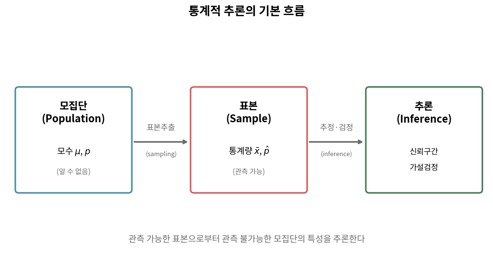

핵심은 다음 사실에 있다.

1. 모수($p$, $\mu$)는 고정된 값이지만 알 수 없다.
2. 통계량($\hat{p}$, $\bar{x}$)은 우리가 계산할 수 있지만 **표본마다 달라진다**.
3. 통계적 추론은 변동하는 통계량을 이용하여 고정된 모수를 추론하는 작업이다.

이 일이 가능한 이유는 표본 통계량의 **표본추출 분포**(sampling distribution)가 알려진 수학적 형태(정규분포, $t$-분포 등)를 따르기 때문이다.

#### [새로운 시각] 추론의 비대칭성

학생들이 자주 혼동하는 부분은 **모수와 통계량의 비대칭성**이다.

- 모수는 알 수 없지만 **고정**되어 있다. 우주의 진실이다.
- 통계량은 알 수 있지만 **변동**한다. 표본을 새로 뽑으면 값이 바뀐다.

이 비대칭성 때문에 "참 비율 $p$가 0.5일 확률은 얼마인가?"라는 질문은 빈도주의 통계에서 의미가 없다. $p$는 확률이 아니라 정해진 값이기 때문이다. 반면 "$\hat{p}$이 어떤 값일 확률은 얼마인가?"라는 질문은 의미가 있다. $\hat{p}$은 무작위 표본에서 계산된 변동량이기 때문이다.

> 참고로 베이지안 통계학에서는 모수에 사전분포를 부여하여 "$p$에 관한 확률"을 논할 수 있다. 본 교재는 빈도주의 관점을 따른다.

---

### 5.0.2 가설검정의 논리: 통계적 귀류법

가설검정은 본질적으로 **귀류법**(proof by contradiction)이다. 어떤 주장(귀무가설)을 잠정적으로 참이라고 가정한 뒤, 그 가정 하에서 관측 자료가 얼마나 "이상한지"를 평가한다. 자료가 충분히 이상하면 처음의 가정을 기각한다.

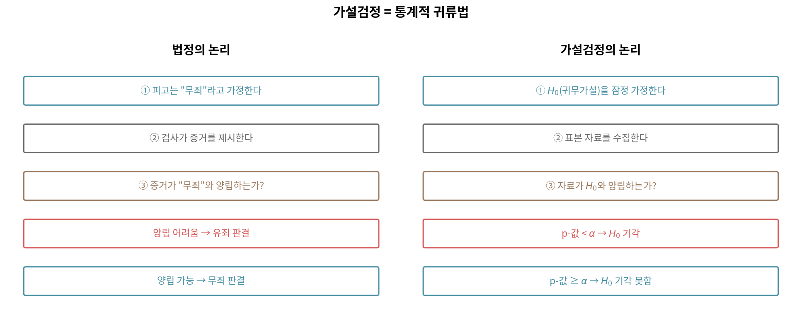

법정의 판결 절차와 비교하면 이해가 쉽다.

| 단계 | 법정 | 가설검정 |
|------|------|----------|
| 1 | 피고는 무죄로 가정한다 | $H_0$을 잠정적으로 참으로 가정한다 |
| 2 | 검사가 증거를 제출한다 | 표본 자료를 수집한다 |
| 3 | "무죄" 하에서 증거가 그럴듯한가? | "$H_0$ 참" 하에서 자료가 그럴듯한가? |
| 4 | 그럴듯하지 않다면 유죄 판결 | p-값이 작으면 $H_0$ 기각 |
| 5 | 합리적 의심이 남으면 무죄 | p-값이 충분히 작지 않으면 $H_0$ 기각 못함 |

#### [새로운 시각] 왜 "$H_0$을 채택"이라 하지 않는가

법정 판결에 "유죄"와 "**무죄**"가 있는 것처럼 보이지만, 사실 영미법에서는 "guilty"와 "not guilty"가 있을 뿐 "innocent"는 없다. **"유죄임이 입증되지 않았다"가 곧 "결백하다"를 의미하지 않는다.**

같은 이치로 가설검정에서도 다음 두 표현은 다르다.

- $H_0$ **기각**(reject): $H_0$이 거짓이라는 강한 증거가 있다 ✓
- $H_0$ **기각하지 못함**(fail to reject): $H_0$이 거짓이라는 충분한 증거가 없다 ✓
- $H_0$ **채택**(accept): 통계학에서는 이 표현을 쓰지 않는다 ✗

$H_0$을 기각하지 못하는 이유는 (a) $H_0$이 진짜로 참이거나, (b) 표본 크기가 부족해서 차이를 감지하지 못했기 때문일 수도 있다. 두 경우를 구분할 수 없으므로 "참이라고 확정"하지 않는다.

---

### 5.0.3 귀무가설과 대립가설

**귀무가설**(null hypothesis) $H_0$과 **대립가설**(alternative hypothesis) $H_A$은 모집단에 대한 두 경쟁 주장이다.

- **$H_0$**: "아무 일도 일어나지 않았다", "효과가 없다", "차이가 없다" 등의 **회의적**·**보수적** 주장. 등호($=$)를 포함한다.
- **$H_A$**: "무언가 일어나고 있다", "효과가 있다", "차이가 있다"는 **새로운** 주장. 부등호($\neq$, $<$, $>$)를 사용한다.

> **가설 작성의 원칙**
>
> 1. $H_0$과 $H_A$는 모두 **모수**에 대한 주장이지 표본 통계량에 대한 주장이 아니다.
> 2. $H_0$과 $H_A$는 **상호 배타적**이며 **포괄적**이어야 한다.
> 3. 가설은 **자료를 보기 전에** 설정한다.

**예시**

| 연구 질문 | $H_0$ | $H_A$ |
|----------|-------|-------|
| 동전이 공정한가? | $p = 0.5$ | $p \neq 0.5$ |
| 신약이 위약보다 효과 있는가? | $\mu_\text{신약} = \mu_\text{위약}$ | $\mu_\text{신약} > \mu_\text{위약}$ |
| 다수가 정책을 지지하는가? | $p = 0.5$ | $p > 0.5$ |

#### [새로운 시각] 가설을 자료 본 후 정하는 것은 부정행위다

가설은 자료 수집 전에 결정해야 한다. 자료를 본 뒤 가설 방향을 정하면 **편향**이 발생한다. 이를 통계학에서는 **HARKing**(Hypothesizing After Results are Known)이라 부르며, 재현 위기(replication crisis)의 주요 원인 중 하나이다. 동전 5번 던져서 5번 앞면이 나온 뒤 "동전이 앞면으로 편향되었다는 가설을 검정하자"고 하면 결과는 당연히 유의해지지만 이는 통계적 사기에 가깝다.

---

### 5.0.4 단측검정과 양측검정

대립가설의 **부등호 방향**에 따라 검정의 종류가 결정된다.

- **양측검정**(two-sided test): $H_A: p \neq p_0$. "어느 쪽으로든 다르다"
- **좌측 단측검정**(left-tailed): $H_A: p < p_0$. "더 작다"
- **우측 단측검정**(right-tailed): $H_A: p > p_0$. "더 크다"

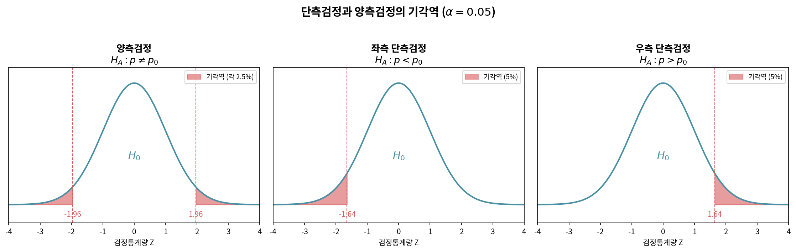

#### 어떤 경우에 어떤 검정을 사용하는가

**양측검정을 사용하는 경우** (대부분의 상황)

- 두 그룹 간 차이의 **방향을 모르거나** 양쪽 모두 흥미로운 경우
- 동전이 공정한지 검정 (앞면이 많아도 적어도 모두 흥미로움)
- 신약이 위약과 **다른지** 검정 (좋아도 나빠도 알아야 함)
- "다른가?", "차이가 있는가?" 라는 질문

**단측검정을 사용하는 경우** (드뭄)

- 자료를 보기 **전부터** 한 방향만 의미가 있을 때
- 새 약이 **더 나쁠** 가능성은 고려할 필요 없고, 더 좋은지만 확인
- "더 큰가?", "초과하는가?", "미달하는가?" 라는 질문

#### [새로운 시각] 단측검정은 의심하라

연구자들이 p-값을 0.05 미만으로 만들기 위해 사후적으로 단측검정으로 바꾸는 일이 종종 일어난다. 이는 통계적 부정행위에 해당한다. 단측검정의 p-값은 양측검정의 정확히 절반이므로, 양측 p-값이 0.08(유의하지 않음)이면 단측 p-값은 0.04(유의함)가 되어버린다.

> **단측검정 사용을 위한 두 조건**
>
> 1. **자료 수집 전**에 단측 사용을 결정했어야 한다.
> 2. 반대 방향의 결과는 **실용적으로 의미가 없거나** $H_0$ 기각과 동등하게 취급된다는 강력한 사전 근거가 있어야 한다.
>
> 의심스러우면 **양측검정**을 쓰라.

---

### 5.0.5 p-값: 가설검정의 심장

**p-값**(p-value)은 가설검정의 가장 중요하면서도 가장 오해받는 개념이다.

> **p-값의 정확한 정의**
>
> **p-값**은 *귀무가설 $H_0$이 참이라는 가정 하에서*, 관측된 검정통계량보다 *더 극단적인* 결과가 나올 확률이다.
>
> $$\text{p-값} = P(\text{관측된 것 이상으로 극단적인 자료} \mid H_0 \text{ 참})$$

수학적으로 분해하면

- **조건부 확률**이다 ("$H_0$이 참이라면" 이라는 조건 아래)
- **자료의 확률**이지 가설의 확률이 아니다
- "더 극단적인" 방향은 $H_A$가 정한다 (단측·양측)

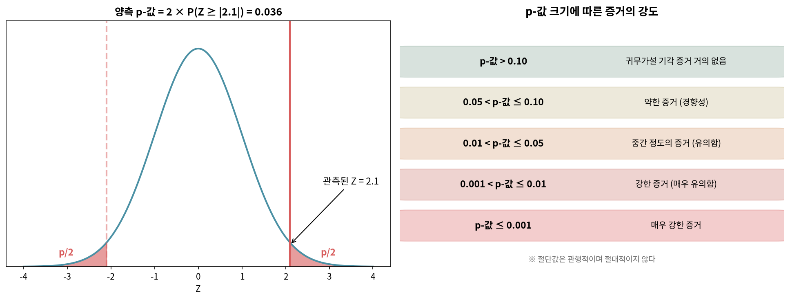

#### p-값이 의미하는 것 vs 의미하지 않는 것

p-값에 관해 학생들이 가장 자주 저지르는 오해를 표로 정리한다.

| 오해 | 진실 |
|------|------|
| "p-값은 $H_0$이 참일 확률이다" | $H_0$은 참 아니면 거짓이다. p-값은 "자료의 확률"이지 "$H_0$의 확률"이 아니다 |
| "p-값이 작으면 효과가 크다" | p-값은 효과 크기와 표본 크기 모두에 영향을 받는다 |
| "p-값이 0.05보다 크면 효과가 없다" | "효과가 없다는 것이 증명되었다"가 아니라 "증명할 만한 증거가 없다"이다 |
| "p-값 = 0.04는 0.06보다 질적으로 다르다" | 0.05라는 절단값은 관행일 뿐 자연 법칙이 아니다 |

#### p-값을 계산하는 방법 (일반 절차)

1. 표본에서 검정통계량 $Z$(또는 $T$)를 계산한다: $Z = \dfrac{\text{점추정} - \text{귀무값}}{SE}$
2. $H_A$의 방향에 따라 분포에서 꼬리 면적을 계산한다.

| 대립가설 | p-값 |
|----------|------|
| $H_A: p > p_0$ (우측) | $P(Z > z_\text{관측})$ |
| $H_A: p < p_0$ (좌측) | $P(Z < z_\text{관측})$ |
| $H_A: p \neq p_0$ (양측) | $2 \times P(Z > \lvert z_\text{관측} \rvert)$ |

```python
from scipy import stats

# 예: 관측된 Z = 2.1, 양측검정
z_obs = 2.1
p_value_two_sided = 2 * (1 - stats.norm.cdf(abs(z_obs)))
p_value_right = 1 - stats.norm.cdf(z_obs)        # 우측 단측
p_value_left = stats.norm.cdf(z_obs)             # 좌측 단측

print(f"양측 p-값:    {p_value_two_sided:.4f}")  # 0.0357
print(f"우측 p-값:    {p_value_right:.4f}")      # 0.0179
print(f"좌측 p-값:    {p_value_left:.4f}")       # 0.9821
```

#### [새로운 시각] p-값의 올바른 해석

다음은 American Statistical Association(미국통계학회)가 2016년 공식 성명에서 권고한 해석이다.

> p-값이 작다는 것은 **자료가 귀무가설과 양립하기 어렵다**는 의미이지, 귀무가설이 거짓일 확률이나 효과가 크다는 의미가 아니다.

p-값을 보고할 때는 반드시 함께 보고해야 할 것이 있다.

1. **효과 크기**(effect size): 단순히 "유의함"이 아니라 "얼마나 큰 차이인가"
2. **신뢰구간**: 그럴듯한 값들의 범위
3. **표본 크기**: 큰 표본에서는 작은 효과도 유의해질 수 있음

---

### 5.0.6 유의수준 α: 우리가 감수하는 위험

**유의수준**(significance level) $\alpha$는 $H_0$을 기각할지 말지를 결정하는 **절단값**(threshold)이다.

> **결정 규칙**
>
> - p-값 $< \alpha$ $\implies$ $H_0$ 기각
> - p-값 $\geq \alpha$ $\implies$ $H_0$ 기각 못함

$\alpha$는 보통 0.05로 정하지만 상황에 따라 0.01이나 0.10을 쓰기도 한다.

#### α의 진정한 의미

$\alpha$는 단순히 절단값에 그치지 않는다. $\alpha$는 **"우리가 실수로 $H_0$을 기각할 확률"**, 즉 다음 항에서 설명할 **제1종 오류율**과 같다.

$$\alpha = P(H_0 \text{ 기각} \mid H_0 \text{ 참}) = P(\text{제1종 오류})$$

즉 유의수준을 0.05로 설정한다는 것은 "참인 귀무가설을 100번 중 5번 정도는 잘못 기각해도 받아들이겠다"는 선언이다.

#### α를 어떻게 정하는가

상황에 따라 적절한 $\alpha$를 선택한다.

| 상황 | 권장 $\alpha$ | 이유 |
|------|--------------|------|
| 신약 승인 (실수로 위험한 약 허가) | 0.01 또는 그 이하 | 제1종 오류가 치명적 |
| 일반 과학 연구 | 0.05 | 관행적 기준 |
| 예비 연구·탐색적 분석 | 0.10 | 단서 발견이 목적 |
| 입자물리학(힉스 보존자 발견) | $\alpha = 2.87 \times 10^{-7}$ (5시그마) | 발견의 영구성 |

#### [새로운 시각] α는 자연 상수가 아니다

"0.05"라는 숫자에는 신성한 의미가 없다. 이 값은 영국 통계학자 R. A. Fisher가 1925년 *Statistical Methods for Research Workers*에서 편의상 제안한 값이 100년 동안 관행으로 굳어진 것이다. Fisher 본인도 "맥락에 따라 다른 값을 써야 한다"고 명시했다.

학계는 2010년대 후반부터 "p < 0.05" 기준의 남용을 비판하고 있다. 일부 학자들은 발견의 기준을 0.005로 낮추자고 제안하고, 다른 학자들은 p-값 절단값 자체를 폐기하고 효과 크기와 신뢰구간 중심으로 보고하자고 주장한다.

---

### 5.0.7 신뢰수준과 신뢰구간

**신뢰구간**(confidence interval, CI)은 가설검정의 동전의 뒷면이다. 가설검정이 "이 값이 그럴듯한가?"라고 묻는다면, 신뢰구간은 "어떤 값들이 그럴듯한가?"라고 묻는다.

> **신뢰구간의 공식**
>
> $$\text{점추정} \pm z^\ast \times SE$$
>
> 여기서 $z^\ast$는 선택한 **신뢰수준**(confidence level)에 해당하는 임계값이다.

**자주 쓰는 신뢰수준과 임계값**

| 신뢰수준 | $z^\ast$ | 각 꼬리 면적 |
|---------|---------|-------------|
| 80% | 1.282 | 10% |
| 90% | 1.645 | 5% |
| 95% | 1.960 | 2.5% |
| 99% | 2.576 | 0.5% |

#### 신뢰수준의 *진정한* 의미

학생들이 95% 신뢰구간을 "참값이 이 구간 안에 있을 확률이 95%이다"라고 해석하는 경우가 많다. 이것은 **틀린** 해석이다.

> **올바른 해석**: 같은 방식으로 신뢰구간을 100번 계산하면, 그 중 약 95개의 구간이 참값을 포함한다.

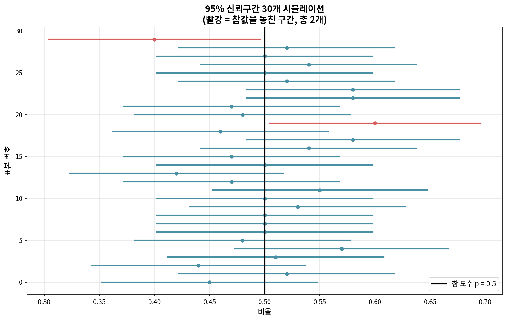

핵심 차이는 다음과 같다.

- 잘못된 해석: 구간은 고정이고 참값이 확률적으로 움직인다 ✗
- 올바른 해석: **참값은 고정이고 구간이 확률적으로 움직인다** ✓

이 그림에서 참 모수 $p = 0.5$는 검은 수직선으로 고정되어 있고, 30개의 구간은 표본마다 위치와 폭이 다르다. 약 95%의 구간(파랑)이 참값을 가로지른다.

#### 신뢰수준과 구간 너비의 거래

신뢰수준을 높이면 구간이 넓어진다. 이는 어부 비유로 쉽게 이해된다.

- 좁은 그물(낮은 신뢰수준): 가벼움, 빠름, 하지만 물고기를 놓치기 쉬움
- 넓은 그물(높은 신뢰수준): 무거움, 느림, 하지만 물고기를 잡을 확률 높음

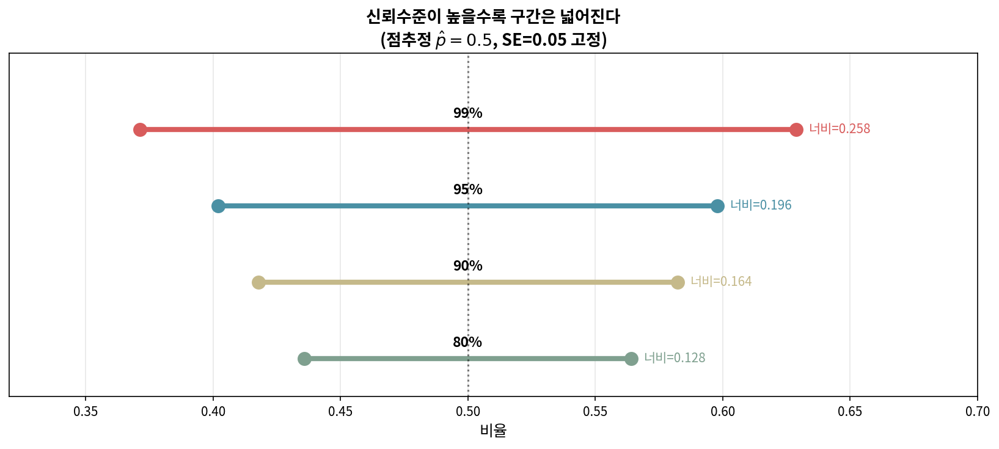

이 그림에서 점추정 $\hat{p} = 0.5$, 표준오차 $SE = 0.05$를 고정했을 때 신뢰수준만 바꾸면 너비가 0.128(80%)에서 0.258(99%)까지 두 배 이상 늘어난다.

#### 신뢰구간 vs 가설검정: 같은 동전의 양면

신뢰구간과 가설검정은 사실 같은 결정을 다른 방식으로 표현한 것이다.

> **신뢰구간과 양측검정의 동치성**
>
> 신뢰수준 $1-\alpha$ 신뢰구간이 귀무값 $p_0$을 **포함하지 않으면**, 양측 가설검정에서 유의수준 $\alpha$로 $H_0$을 **기각**한다. 역도 성립한다.

따라서 95% 신뢰구간을 보면 $\alpha = 0.05$ 양측검정을 별도로 할 필요가 없다. 구간에 귀무값이 들어 있으면 기각 못함, 들어 있지 않으면 기각이다.

```python
import numpy as np
from scipy import stats

# 예: 표본 비율 0.55, n=400, H_0: p=0.5
p_hat, n, p0 = 0.55, 400, 0.5

# 가설검정 (양측)
SE_test = np.sqrt(p0*(1-p0)/n)
z = (p_hat - p0)/SE_test
p_value = 2*(1 - stats.norm.cdf(abs(z)))
print(f"가설검정: Z = {z:.2f}, p-값 = {p_value:.4f}")

# 95% 신뢰구간
SE_ci = np.sqrt(p_hat*(1-p_hat)/n)
lo = p_hat - 1.96*SE_ci
hi = p_hat + 1.96*SE_ci
print(f"95% CI: ({lo:.4f}, {hi:.4f})")
print(f"p_0 = {p0}이 CI에 포함? {lo <= p0 <= hi}")
print(f"두 결과 일치? {(p_value < 0.05) == (not (lo <= p0 <= hi))}")
```

---

### 5.0.8 제1종 오류와 제2종 오류

가설검정은 본질적으로 두 종류의 오류를 범할 수 있다.

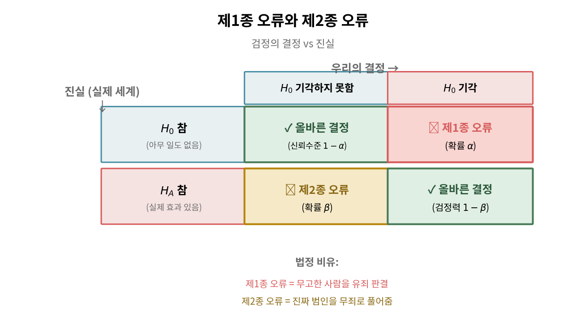

> **두 가지 오류의 정의**
>
> - **제1종 오류**(Type I error): $H_0$이 **참인데도** 기각하는 오류. 확률은 $\alpha$.
> - **제2종 오류**(Type II error): $H_A$가 **참인데도** $H_0$을 기각하지 못하는 오류. 확률은 $\beta$.

법정 비유로 이해하면 다음과 같다.

- 제1종 오류 = **무고한 사람을 유죄로 판결** (실제로 무죄($H_0$)인데 유죄($H_0$ 기각))
- 제2종 오류 = **진짜 범인을 무죄로 풀어줌** (실제로 유죄($H_A$)인데 무죄($H_0$ 기각 못함))

#### α와 β의 상충 관계

직관적으로 두 오류를 모두 0에 가깝게 만들고 싶지만, **표본 크기가 고정된 상태**에서는 한 오류를 줄이면 다른 오류가 늘어나는 상충 관계가 있다.

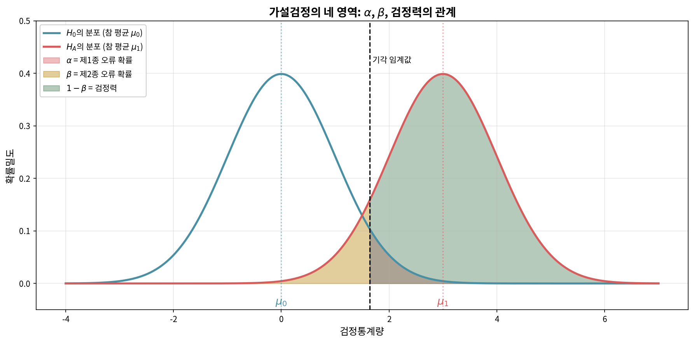

- $\alpha$를 작게 하려면 기각 임계값을 오른쪽으로 옮긴다 → $\beta$가 커진다
- $\alpha$를 크게 하려면 기각 임계값을 왼쪽으로 옮긴다 → $\beta$가 작아진다

이 상충 관계를 깰 유일한 방법은 **표본 크기를 늘리는 것**이다. 표본이 커지면 두 분포가 모두 좁아져서 $\alpha$와 $\beta$ 모두 줄어든다.

#### 어떤 오류가 더 나쁜가는 맥락에 달려 있다

| 맥락 | 제1종 오류 | 제2종 오류 | 더 심각한 쪽 |
|------|-----------|-----------|------------|
| 신약 승인 | 효과 없는 약을 승인 | 좋은 약을 거부 | 1종 (환자에 위험) |
| 암 진단 | 건강한 사람에 암 진단 | 암 환자 놓침 | 2종 (생명 위협) |
| 법정 판결 | 무고한 사람 유죄 | 범인 풀어줌 | (사회 가치관) |
| 공장 품질관리 | 정상 제품 폐기 | 불량품 통과 | 맥락에 따라 다름 |

---

### 5.0.9 검정력: $H_0$이 거짓일 때 그것을 발견할 확률

**검정력**(power)은 $H_A$가 참일 때 $H_0$을 올바르게 기각할 확률이다.

> **검정력의 정의**
>
> $$\text{검정력} = 1 - \beta = P(H_0 \text{ 기각} \mid H_A \text{ 참})$$

검정력이 0.80이면 "실제 효과가 있을 때 그것을 발견할 확률이 80%"라는 뜻이다. 0.80은 일반적인 최소 권장 기준이다.

#### 검정력에 영향을 주는 네 가지 요인

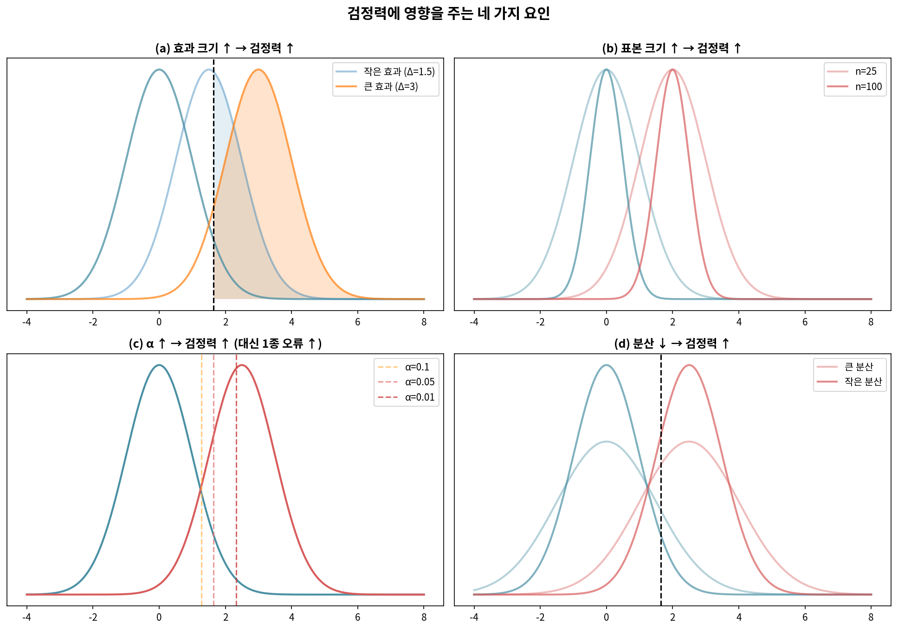

1. **효과 크기**($\Delta$) 증가 → 검정력 증가
2. **표본 크기**($n$) 증가 → 검정력 증가
3. **유의수준**($\alpha$) 증가 → 검정력 증가 (대신 제1종 오류 증가)
4. **모집단 표준편차**($\sigma$) 감소 → 검정력 증가

연구자가 통제할 수 있는 가장 직접적인 요인은 **표본 크기**다. 따라서 연구 설계 단계에서 **검정력 분석**(power analysis)을 통해 "원하는 검정력을 얻기 위해 표본을 얼마나 모아야 하는가"를 계산한다.

#### [새로운 시각] 검정력이 낮은 연구는 위험하다

검정력이 낮은 연구(예: 30%)는 다음 두 문제를 동시에 안고 있다.

1. **참 효과를 자주 놓친다** (제2종 오류 70%)
2. **유의한 결과가 나와도 신뢰성이 낮다** (false discovery rate 증가)

특히 (2)는 직관에 반한다. 검정력이 낮은 연구에서 유의한 결과가 나오면 보통 효과 크기가 과대추정되기 마련이다. 이를 **승자의 저주**(winner's curse)라 한다. 작은 표본에서 우연히 큰 차이가 나타나야만 유의 절단값을 통과하므로, 살아남은 결과들은 평균적으로 과장되어 있다.

```python
import numpy as np
from scipy import stats

# 예: 효과 크기 d=0.3, alpha=0.05일 때 표본 크기별 검정력
from scipy.stats import norm

def power_two_sample(d, n, alpha=0.05):
    """효과 크기 d, 그룹당 표본 크기 n에서의 검정력"""
    z_alpha = norm.ppf(1 - alpha/2)
    z_beta = d * np.sqrt(n/2) - z_alpha
    return norm.cdf(z_beta)

for n in [20, 50, 100, 200, 500]:
    print(f"n = {n:>3}: 검정력 = {power_two_sample(0.3, n):.3f}")
```

---

### 5.0.10 통계적 유의성과 실질적 유의성의 차이

**통계적 유의성**(statistical significance)과 **실질적 유의성**(practical significance)은 다르다.

- **통계적 유의성**: p-값 $< \alpha$인가? (우연으로 설명될 수 있는가?)
- **실질적 유의성**: 효과 크기가 실생활에서 의미 있는 수준인가?

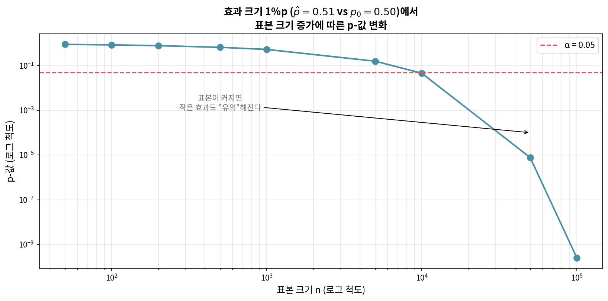

이 그림에서 효과 크기를 작은 1%p로 고정하고 표본 크기만 늘리면, p-값이 결국 0에 수렴함을 볼 수 있다. 표본이 충분히 크면 **사소한 차이도 통계적으로 유의**해진다.

#### [새로운 시각] 빅데이터 시대의 함정

데이터 과학에서 수백만 건의 자료가 흔해진 오늘날 이 함정은 더 위험하다. 다음 예를 보자.

> 한 전자상거래 회사가 1억 명의 사용자에게 A/B 테스트를 했다. 페이지 디자인 A의 클릭률은 5.000%, 디자인 B는 5.001%였다. p-값은 0.0001로 매우 유의했다. 이 결과로 디자인을 바꿔야 하는가?

답은 "아니다"에 가깝다. 0.001%p의 차이는 통계적으로는 유의하지만 사업적으로는 무의미하다. 디자인 변경 비용이 잠재 이익보다 크다.

좋은 분석은 항상 다음 세 가지를 함께 보고한다.

1. **p-값** (우연 가능성)
2. **효과 크기와 신뢰구간** (실제 차이의 규모)
3. **맥락적 해석** (그 차이가 실생활에서 의미 있는가)

---

### 5.0 절 요약

| 개념 | 정의 | 기호 |
|------|------|------|
| 모수 | 모집단의 알 수 없는 특성 | $p$, $\mu$ |
| 통계량 | 표본에서 계산한 값 | $\hat{p}$, $\bar{x}$ |
| 귀무가설 | 회의적 주장 | $H_0$ |
| 대립가설 | 새로운 주장 | $H_A$ |
| p-값 | $H_0$ 하에서 자료의 극단성 확률 | $p$ |
| 유의수준 | $H_0$ 기각 절단값 = 1종 오류 확률 | $\alpha$ |
| 신뢰수준 | 구간이 참값을 포함할 장기 비율 | $1-\alpha$ |
| 제1종 오류 | $H_0$ 참인데 기각 | 확률 $\alpha$ |
| 제2종 오류 | $H_A$ 참인데 기각 못함 | 확률 $\beta$ |
| 검정력 | $H_A$ 참일 때 기각 | $1-\beta$ |

이제 이 도구들을 비율 추론에 적용할 준비가 되었다.

---
## 5.1 점추정과 표본 변동성

이제 §5.0에서 다진 추론의 토대 위에서 **단일 비율**의 추론을 본격적으로 다룬다. 본 절은 점추정과 그 변동성의 이해를 목표로 한다.

Pew Research와 같은 기관은 정치, 과학적 지식, 브랜드 인지도 등 다양한 주제에 대한 의견을 조사한다. 여론조사의 궁극적 목적은 표본 응답으로부터 더 넓은 모집단의 의견이나 지식을 추정하는 것이다.

### 5.1.1 점추정과 두 가지 오차

어느 여론조사에서 미국 대통령의 지지율이 45%였다고 하자. 이 45%는 전체 모집단에서 동일한 조사를 한다면 얻었을 비율의 **점추정값**(point estimate)이다. 모집단의 응답 비율은 관심 **모수**(parameter)이며 비율인 경우 $p$로, 표본비율은 $\hat{p}$("p-hat")으로 표기한다.

같은 여론조사를 다시 한다면 정확히 45%가 나올까? 그럴 가능성은 낮다. 두 번째 조사에서는 약간 다른 사람들이 무작위로 뽑히고 점추정값도 약간 달라진다. 이러한 표본 간 변동을 **표본오차**(sampling error)라 한다.

또 다른 종류의 오차는 **편향**(bias)이다. 편향이란 추정값이 모수를 체계적으로 과대 또는 과소 추정하는 현상이다. 표본이 모집단을 대표하지 못할 때 발생하는 편향을 **표본추출 편향**(sampling bias)이라 한다.

#### [새로운 시각] 표본오차와 편향의 결정적 차이

이 둘은 본질이 다르다.

- **표본오차**는 무작위에 의한 자연스러운 변동이다. **표본 크기를 늘리면 줄어든다**.
- **편향**은 체계적 오차이다. **표본 크기를 늘려도 해결되지 않는다**. 자료 수집 방법 자체를 개선해야 한다.

예를 들어 유선전화로만 여론조사를 하면 젊은 세대가 과소 대표되는 편향이 생긴다. 응답자 수를 10배로 늘려도 이 편향은 그대로다.

총오차 = 표본오차 + 편향. 무작위 표본 추출은 편향을 줄이고, 표본 크기 확대는 표본오차를 줄인다.

---

### 5.1.2 점추정의 변동성: 표본추출 분포

Pew Research는 태양 에너지 역할 확대를 지지하는 미국 성인의 비율을 약 $p = 0.88$로 추정한다. 만일 1000명의 무작위 표본을 추출하여 같은 질문을 한다면 표본비율 $\hat{p}$이 얼마나 달라질지 알아보자.

다음과 같은 시뮬레이션을 상상한다.

1. 2018년 미국 성인 2억 5천만 명을 종이 한 장씩으로 표현하고, 88%에 "지지", 12%에 "반대"를 쓴다.
2. 종이를 잘 섞은 뒤 1000장을 뽑는다.
3. "지지" 비율을 계산한다.

이 과정을 10,000번 반복하여 얻은 표본비율들의 히스토그램이 다음 그림이다.

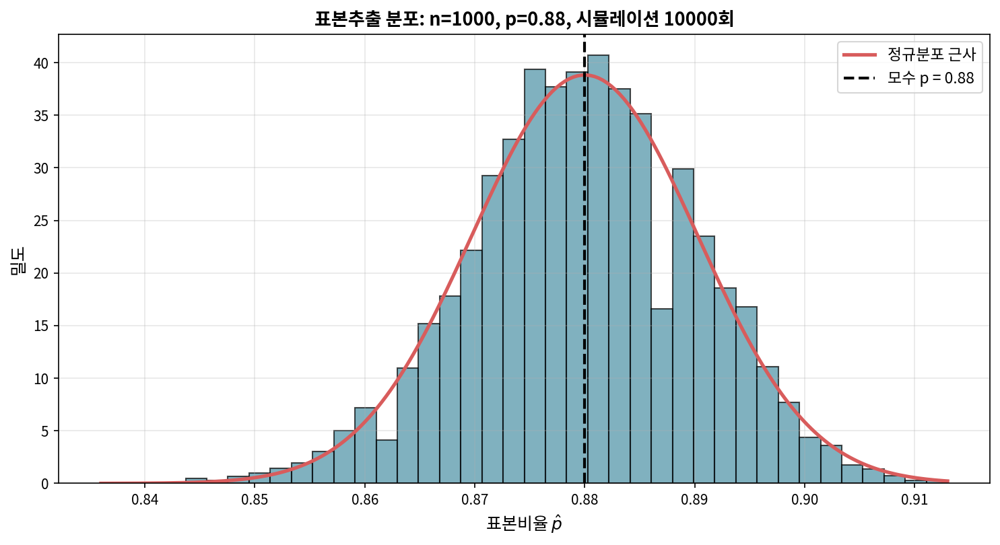

이 분포가 **표본추출 분포**(sampling distribution)이다. 특성은 다음과 같다.

- **중심**: 분포의 평균 $\bar{x}_{\hat{p}} = 0.880$이며 이는 모수 $p$와 같다.
- **퍼짐**: 표준편차 $s_{\hat{p}} = 0.010$. 표본추출 분포나 점추정의 표준편차를 **표준오차**(standard error)라 부르고 $SE_{\hat{p}}$로 표기한다.
- **모양**: 대칭이고 종형이며 정규분포와 닮았다.

> **표본추출 분포는 보이지 않지만 생각한다**
>
> 실제 분석에서는 표본추출 분포를 직접 관찰하지 않는다. 그러나 우리의 점추정이 그러한 가상의 분포에서 추출된 한 값이라고 생각하면 추론의 논리가 명확해진다.

---

#### 예제 5.1: 표본 크기와 표준오차

**문제** $n = 50$의 더 작은 표본을 사용하면 $\hat{p}$의 표준오차가 $n = 1000$일 때보다 클까 작을까?

**풀이**

더 많은 자료는 더 정확한 추정을 준다. $p = 0.88$, $n = 50$의 표준오차는 $n = 1000$일 때보다 **크다**.

이는 표본추출 분포의 핵심 원리를 보여준다. *더 큰 표본은 더 정확한 점추정을 준다.*

```python
import numpy as np

p = 0.88
SE_1000 = np.sqrt(p*(1-p)/1000)
SE_50   = np.sqrt(p*(1-p)/50)
print(f"SE(n=1000) = {SE_1000:.4f}")
print(f"SE(n=50)   = {SE_50:.4f}")
print(f"비율: {SE_50/SE_1000:.2f}배")
# SE(n=1000) = 0.0103
# SE(n=50)   = 0.0460
# 비율: 4.47배
```

---

### 5.1.3 중심극한정리

위 그림 5.2의 분포가 정규분포처럼 보이는 것은 우연이 아니라 **중심극한정리**(Central Limit Theorem, CLT)의 결과이다.

> **중심극한정리와 성공-실패 조건**
>
> 표본 관측값들이 독립이고 표본 크기가 충분히 크면, 표본비율 $\hat{p}$은 근사적으로 다음을 따르는 정규분포에 가까워진다.
>
> $$\mu_{\hat{p}} = p, \qquad SE_{\hat{p}} = \sqrt{\frac{p(1-p)}{n}}$$
>
> 표본 크기가 "충분히 크다"의 기준은 **성공-실패 조건**(success-failure condition)으로
> $$np \geq 10, \qquad n(1-p) \geq 10$$
> 이 모두 만족되어야 한다.

성공-실패 조건이 위반되면 표본추출 분포는 정규분포에서 멀어진다.

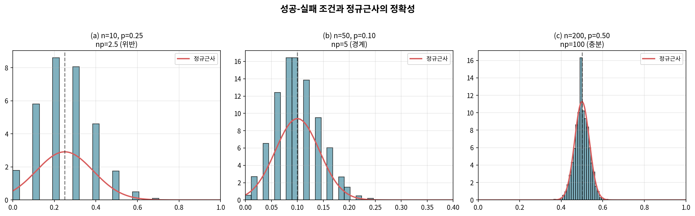

이 그림에서 $n=10, p=0.25$일 때(왼쪽) 분포는 이산적이고 비대칭적이지만, $n=200, p=0.5$일 때(오른쪽)는 정규근사가 잘 맞는다.

#### [새로운 시각] 왜 10이라는 숫자인가

성공-실패 조건의 "10"은 자연 상수가 아니라 경험 법칙이다. 일부 교재는 5, 일부는 15를 쓴다. 본질은 "**이항분포가 정규분포로 근사되려면 기대 성공 수와 기대 실패 수가 둘 다 충분히 커야 한다**"이다. 너무 작으면 분포가 한쪽으로 치우치거나 이산성이 두드러져 정규근사가 깨진다.

10이라는 기준은 대부분의 응용에서 안전한 선택으로 통용된다.

---

#### 예제 5.2: 중심극한정리 조건 확인

**문제** $p = 0.88$, $n = 1000$의 표본추출 분포가 근사적으로 정규분포임을 확인하라.

**풀이**

**독립성**: 단순무작위표본이므로 충족된다.

**성공-실패**: $np = 880 \geq 10$, $n(1-p) = 120 \geq 10$. 모두 만족.

두 조건이 충족되므로 중심극한정리에 의해 $\hat{p}$을 정규분포로 모형화할 수 있다.

---

#### 예제 5.3: 이론적 평균과 표준오차

**문제** $p = 0.88$, $n = 1000$에서 $\hat{p}$의 이론적 평균과 표준오차를 구하라.

**풀이**

$$\mu_{\hat{p}} = p = 0.88$$

$$SE_{\hat{p}} = \sqrt{\frac{0.88 \times 0.12}{1000}} = \sqrt{0.0001056} = 0.0103$$

```python
import numpy as np
p, n = 0.88, 1000
print(f"μ = {p}, SE = {np.sqrt(p*(1-p)/n):.4f}")
# μ = 0.88, SE = 0.0103
```

---

#### 예제 5.4: 정규분포로 확률 계산

**문제** $\hat{p}$이 모수 $p = 0.88$의 $\pm 0.02$ 이내에 있을 확률을 구하라. 분포는 $N(0.88, 0.010)$으로 가정한다.

**풀이**

$0.86 \leq \hat{p} \leq 0.90$인 확률을 구한다. Z-점수로 변환하면

$$Z_{0.86} = \frac{0.86 - 0.88}{0.010} = -2, \qquad Z_{0.90} = \frac{0.90 - 0.88}{0.010} = 2$$

표준정규분포에서 $P(-2 \leq Z \leq 2) = 0.9544$.

```python
from scipy import stats
prob = stats.norm.cdf(2) - stats.norm.cdf(-2)
print(f"P(|Z| ≤ 2) = {prob:.4f}")
# 0.9545
```

따라서 표본비율의 약 **95.45%**가 모수의 $\pm 0.02$ 이내에 들어온다.

---

#### Guided Practice 5.5: 표준오차 공식의 직관

**문제** 더 작은 표본이 덜 신뢰할 만한 추정값을 주는 직관이 $SE = \sqrt{p(1-p)/n}$에 어떻게 반영되는가?

**풀이**

$n$이 분모에 있으므로 $n$이 커지면 $SE$는 작아진다. 더 정확히는

$$SE \propto \frac{1}{\sqrt{n}}$$

표본 크기를 4배로 늘리면 표준오차는 절반으로 줄어든다. 표본 크기를 9배로 늘리면 표준오차는 1/3로 줄어든다.

```python
import numpy as np
p = 0.88
for n in [50, 100, 500, 1000, 5000]:
    print(f"n = {n:>4}: SE = {np.sqrt(p*(1-p)/n):.4f}")
```

---

### 5.1.4 실세계에서 중심극한정리 사용하기

실제 분석에서는 모수 $p$를 모른다. 그러면 성공-실패 조건과 표준오차를 어떻게 계산하는가?

**플러그인 원리**(plug-in principle): $p$ 대신 표본비율 $\hat{p}$을 대입한다.

$$SE_{\hat{p}} \approx \sqrt{\frac{\hat{p}(1-\hat{p})}{n}}$$

성공-실패 조건도 마찬가지로 $\hat{p}$로 확인한다: $n\hat{p} \geq 10$, $n(1-\hat{p}) \geq 10$.

#### [새로운 시각] 신뢰구간과 가설검정에서의 차이

이 절은 **신뢰구간**의 경우다. **가설검정**에서는 $p$ 대신 **귀무값 $p_0$**을 사용한다(§5.3에서 자세히). 이유는 명확하다.

- 신뢰구간: $p$에 대한 가장 좋은 추정인 $\hat{p}$을 쓴다
- 가설검정: "$H_0$이 참이라면"이라는 조건부 세계에서 분석하므로 $H_0$에서 주장하는 $p_0$을 쓴다

학생들이 자주 혼동하는 이 차이는 **각 절차의 논리적 출발점**의 차이에서 비롯된다.

---

### 5.1.5 성공-실패 조건 위반과 분포의 형태

성공-실패 조건이 위반되면 어떻게 되는지 정리한다. 다음 추세가 관찰된다.

1. $np$ 또는 $n(1-p)$가 작으면 분포가 이산적이다(연속적이지 않다).
2. 이 값이 10 미만이면 비대칭이 두드러진다.
3. $np$와 $n(1-p)$가 모두 커지면 분포가 정규분포에 가까워진다.

분포의 일반적 특성

- **불편성**: 분포 중심은 항상 $p$이다. $\hat{p}$은 $p$의 **불편추정량**(unbiased estimator)이다.
- **정밀도**: 변동성은 $n$이 커질수록 감소한다.
- **최대 변동성**: 변동성은 $p = 0.5$에서 최대가 된다. 이는 $p(1-p)$의 최댓값이 $p=0.5$이기 때문이다.

```python
p_values = [0.1, 0.3, 0.5, 0.7, 0.9]
n = 100
for p in p_values:
    print(f"p = {p}: SE = {(p*(1-p)/n)**0.5:.4f}")
# p = 0.5에서 SE가 최대
```

---

### 5.1.6 다른 통계량으로 확장

표본 통계량으로 모수를 추정하는 전략은 비율에 국한되지 않는다.

- 표본 평균 $\bar{x}$로 모집단 평균 $\mu$ 추정 (7장에서 자세히)
- 두 비율 차이 $\hat{p}_1 - \hat{p}_2$로 두 모비율 차이 $p_1 - p_2$ 추정 (6장)
- 회귀 계수의 추정 (8장)

본 장에서는 단일 비율 맥락을 강조하지만, 같은 추론 논리가 책 전체에서 반복된다.

---

### 5.1절 연습문제 (홀수번)

#### 연습문제 5.1: 모수의 종류 식별

다음 각 상황에서 관심 모수가 **평균**인지 **비율**인지 식별하라.

**(a)** 100명의 대학생에게 일주일에 인터넷에서 보내는 시간을 묻는다.

**풀이** **평균**. 응답이 수치형(시간)이므로 평균이 관심 모수다.

**(b)** "인터넷 시간 중 몇 %가 과제 작업인가?"를 묻는다.

**풀이** **평균**. 백분율은 수치형 응답이므로 평균이다. 비율이 아님에 주의.

**(c)** "논문에서 위키피디아를 인용한 적이 있는가?"를 묻는다.

**풀이** **비율**. 예/아니오 범주형 응답이다.

**(d)** "주간 지출의 몇 %를 알코올에 쓰는가?"를 묻는다.

**풀이** **평균**. 수치형 응답이다.

**(e)** 100명 졸업자 중 85%가 1년 내 취업을 기대한다.

**풀이** **비율**. 기대함/기대 안 함의 범주형 응답 비율이다.

---

#### 연습문제 5.3: 시리얼 품질 관리

시리얼 상자 무게는 $N(20, 2)$ 온스를 따른다고 가정한다.

**(a)** 한 상자가 21온스보다 무거울 확률은?

**풀이**

$$Z = \frac{21-20}{2} = 0.5$$

$$P(X > 21) = 1 - \Phi(0.5) = 1 - 0.6915 = 0.3085$$

약 **30.85%**.

**(b)** 25개 상자의 평균 무게가 21온스보다 무거울 확률은?

**풀이** 표본 평균의 표준오차는

$$SE_{\bar{X}} = \frac{\sigma}{\sqrt{n}} = \frac{2}{\sqrt{25}} = 0.4$$

$$Z = \frac{21-20}{0.4} = 2.5, \quad P(\bar{X} > 21) = 1 - \Phi(2.5) = 0.0062$$

약 **0.62%**. 표본 평균은 개별 관측보다 훨씬 변동이 작다.

```python
from scipy import stats
import numpy as np

# (a) 개별 상자
z1 = (21-20)/2
print(f"(a) P(X>21) = {1-stats.norm.cdf(z1):.4f}")

# (b) 25개 평균
SE = 2/np.sqrt(25)
z2 = (21-20)/SE
print(f"(b) P(X̄>21) = {1-stats.norm.cdf(z2):.4f}")
# (a) P(X>21) = 0.3085
# (b) P(X̄>21) = 0.0062
```

---

#### 연습문제 5.5: 식수 납 검출

비영리 단체가 800가구 무작위 표본의 납 검출 비율을 계산하고, 이를 1000번 반복하여 분포를 얻는다.

**(a)** 이 분포의 이름은?

**풀이** **표본추출 분포**.

**(b)** $p = 0.08$이라면 분포의 모양은?

**풀이** $np = 64 \geq 10$, $n(1-p) = 736 \geq 10$이므로 거의 **대칭**(약간 우측 비대칭일 수 있음).

**(c)** 변동성은?

**풀이**

$$SE = \sqrt{\frac{0.08 \times 0.92}{800}} = 0.0096$$

**(d)** 이 값의 공식 명칭은?

**풀이** **표준오차**.

**(e)** 표본을 250가구로 줄이면?

**풀이**

$$SE_{250} = \sqrt{\frac{0.08 \times 0.92}{250}} = 0.0172$$

변동성이 약 1.79배 **증가**한다.

```python
import numpy as np
p = 0.08
for n in [800, 250]:
    print(f"n={n}: SE={np.sqrt(p*(1-p)/n):.4f}")
```

---

## 5.2 비율에 대한 신뢰구간

§5.0.7에서 보았듯 점추정만으로는 부족하다. **신뢰구간**은 모수의 그럴듯한 값들의 범위를 제공한다.

### 5.2.1 어부 비유 다시 보기

점추정은 작살, 신뢰구간은 그물이다.

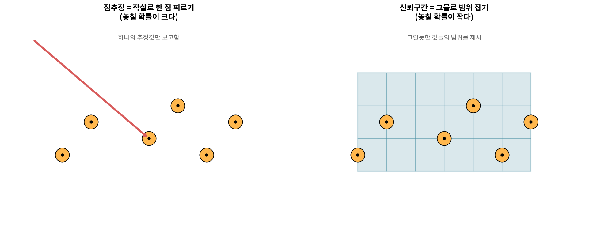

#### Guided Practice 5.6: 신뢰구간의 너비

**문제** 모수를 더 확실히 잡고 싶다면 신뢰구간을 더 넓게 해야 하는가 좁게 해야 하는가?

**풀이** **더 넓게**. 그물이 클수록 물고기를 잡을 확률이 높듯, 신뢰구간이 넓을수록 참 모수를 포함할 확률이 높다.

§5.0.7의 그림 5.0.8을 다시 보면 95%보다 99% 신뢰구간이 더 넓다는 것을 시각적으로 확인할 수 있다.

---

### 5.2.2 95% 신뢰구간

표본비율 $\hat{p}$이 모수의 가장 그럴듯한 값이므로 그 주위에 구간을 만든다. 너비는 표준오차가 알려준다. CLT 조건이 충족되면 $\hat{p}$은 거의 정규분포를 따르고, 정규분포에서 평균 $\pm 1.96\sigma$ 안에 자료의 95%가 있다.

> **단일 비율의 95% 신뢰구간**
>
> $$\hat{p} \pm 1.96 \times SE_{\hat{p}}, \qquad SE_{\hat{p}} = \sqrt{\frac{\hat{p}(1-\hat{p})}{n}}$$

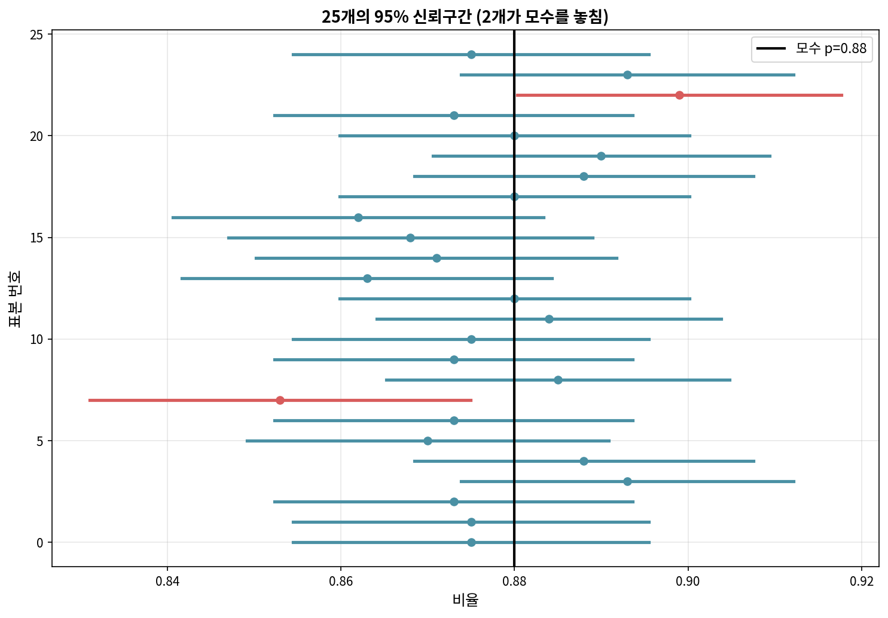

#### 예제 5.7: 구간이 모수를 놓치는 경우

**문제** 그림 5.6에서 한 구간이 $p = 0.88$을 포함하지 않는다. 모수가 $0.88$이 아니라는 뜻인가?

**풀이** 아니다. 95% 신뢰구간은 평균적으로 5%의 시간 동안 모수를 놓치도록 설계되었다. 25개 중 1개($= 4\%$)가 놓친 것은 정상적인 변동이다.

이는 **신뢰수준의 정확한 의미**(§5.0.7)를 재확인한다. "95% 확률로 이 구간 안에 참값이 있다"가 아니라 "방법을 무한히 반복하면 95%의 구간이 참값을 포함한다"는 뜻이다.

---

#### 예제 5.8: 태양 에너지 지지율 95% 신뢰구간

**문제** 1000명 무작위 표본 중 88.7%가 태양 에너지 확대를 지지한다. 모집단 비율의 95% 신뢰구간을 구하라.

**풀이**

**조건 확인**
- 독립성: 단순무작위표본 ✓
- 성공-실패: $n\hat{p} = 887, n(1-\hat{p}) = 113$, 모두 $\geq 10$ ✓

**표준오차**

$$SE_{\hat{p}} = \sqrt{\frac{0.887 \times 0.113}{1000}} = 0.010$$

**95% 신뢰구간**

$$0.887 \pm 1.96 \times 0.010 = 0.887 \pm 0.0196 = (0.867, 0.907)$$

**해석** 태양 에너지 확대를 지지하는 미국 성인의 비율이 **86.7%에서 90.7% 사이**라고 95% 신뢰한다.

```python
import numpy as np
p_hat, n = 0.887, 1000
SE = np.sqrt(p_hat*(1-p_hat)/n)
lo, hi = p_hat - 1.96*SE, p_hat + 1.96*SE
print(f"95% CI: ({lo:.3f}, {hi:.3f})")
# 95% CI: (0.867, 0.907)
```

---

### 5.2.3 다른 신뢰수준

신뢰수준을 90%나 99%로 바꾸려면 $z^\ast$만 바꾸면 된다.

| 신뢰수준 | $z^\ast$ | 꼬리 면적 |
|---------|---------|----------|
| 90% | 1.645 | 5% |
| 95% | 1.960 | 2.5% |
| 99% | 2.576 | 0.5% |

일반 공식

$$\text{점추정} \pm z^\ast \times SE$$

여기서 $z^\ast \times SE$를 **오차한계**(margin of error, ME)라 한다.

#### Guided Practice 5.9: $z^\ast$ 찾기

**문제** 정규변수가 평균의 $\pm 2.58$ 표준편차 안에 있을 확률은?

**풀이**

```python
from scipy import stats
p = stats.norm.cdf(2.58) - stats.norm.cdf(-2.58)
print(f"P(|Z|<2.58) = {p:.4f}")
# 0.9901
```

약 **99%**. 따라서 99% 신뢰구간의 $z^\ast = 2.576 \approx 2.58$이다.

---

#### 예제 5.10: 90% 신뢰구간

**문제** 예제 5.8 자료로 태양 에너지 지지율의 90% 신뢰구간을 구하라.

**풀이**

$$0.887 \pm 1.645 \times 0.010 = (0.871, 0.903)$$

90% 신뢰수준에서 **87.1%에서 90.3%**라 결론짓는다. 95% 구간(86.7%, 90.7%)보다 좁다(§5.0.7).

> **단일 비율 신뢰구간 4단계**
>
> 1. **준비**: $\hat{p}$과 $n$ 식별, 신뢰수준 결정
> 2. **확인**: 독립성과 성공-실패 조건(이때 $\hat{p}$ 사용)
> 3. **계산**: $SE = \sqrt{\hat{p}(1-\hat{p})/n}$ → $z^\ast$ → 구간
> 4. **결론**: 맥락에 맞게 해석

---

#### 예제 5.11∼5.13: 에볼라 격리 지지율

**문제** 2014년 10월 1042명 뉴욕 성인 중 82%가 에볼라 환자 접촉자의 21일 격리를 지지했다. 95% 신뢰구간은?

**풀이**

조건: 독립성 ✓, $n\hat{p} = 854 \geq 10$, $n(1-\hat{p}) = 188 \geq 10$ ✓

$$SE = \sqrt{\frac{0.82 \times 0.18}{1042}} = 0.012$$

$$0.82 \pm 1.96 \times 0.012 = (0.796, 0.844)$$

격리 지지 비율이 **79.6%에서 84.4%**라고 95% 신뢰한다.

```python
import numpy as np
p_hat, n = 0.82, 1042
SE = np.sqrt(p_hat*(1-p_hat)/n)
print(f"CI: ({p_hat-1.96*SE:.3f}, {p_hat+1.96*SE:.3f})")
```

---

#### Guided Practice 5.14: 신뢰구간 해석

**문제** (a) "95% 확신"의 의미는? (b) 이 신뢰구간이 오늘날 의견에도 유효한가?

**풀이**

**(a)** 같은 방법으로 표본을 많이 뽑아 구간을 만들면 약 95%가 참 비율을 포함한다.

**(b)** 그렇지 않다. 2014년 10월 공중보건 위기 시점의 의견이다. 현재 의견을 알려면 **새 조사**가 필요하다. 신뢰구간은 자료 수집 당시의 모집단에만 유효하다.

---

#### Guided Practice 5.15: 풍력 터빈 지지율

**문제** 1000명 중 84.8%가 풍력 터빈 확대를 지지. 99% 신뢰구간은?

**풀이**

$$SE = \sqrt{\frac{0.848 \times 0.152}{1000}} = 0.0114$$

$$0.848 \pm 2.576 \times 0.0114 = (0.819, 0.877)$$

**81.9%에서 87.7%** 사이라고 99% 신뢰한다.

---

### 5.2.4 신뢰구간 해석의 흔한 오류

§5.0.7에서 강조한 내용을 다시 정리한다.

**옳은 표현**

- "구간 (0.86, 0.91)이 참 비율을 포함한다고 95% 신뢰한다"
- "100번 같은 방법을 쓰면 약 95개의 구간이 참값을 포함한다"

**틀린 표현**

- "참 비율이 (0.86, 0.91)에 있을 확률이 95%이다" ✗
- "표본 비율이 (0.86, 0.91)에 있을 확률이 95%이다" ✗
- "전체의 95%가 (0.86, 0.91) 사이의 의견을 갖는다" ✗

#### Guided Practice 5.16: 신뢰구간의 한계

**문제** 태양 에너지의 90% 신뢰구간 (87.1%, 90.4%)에 대해, 새 조사를 하면 새 비율이 (87.1%, 90.4%) 안에 있을 확률이 90%라고 할 수 있는가?

**풀이** **아니다**. 신뢰구간은 미래 점추정의 범위가 아니라 **모수**에 대한 그럴듯한 범위다. 새 표본의 $\hat{p}$은 표본추출 분포에 따라 새로 변동하므로 별개의 문제이다.

---

### 5.2절 연습문제 (홀수번)

#### 연습문제 5.7: 만성 질환 (Part I)

미국 성인의 45%가 만성 질환을 가졌다는 보고. $SE = 0.012$. 95% 신뢰구간을 구하라.

**풀이**

$$0.45 \pm 1.96 \times 0.012 = (0.4265, 0.4735)$$

**42.6%에서 47.4%** 사이라고 95% 신뢰한다.

---

#### 연습문제 5.9: 만성 질환 (Part II)

다음 각 진술의 참/거짓을 판별하라.

**(a)** "95% 신뢰구간이 만성 질환자의 실제 비율을 포함한다고 확신할 수 있다."

**풀이** **거짓**. 100% 확신이 아니다. 95% 신뢰구간은 평균 5% 시간 동안 모수를 놓친다(§5.0.7).

**(b)** "1000번 반복하면 약 950개 구간이 참값을 포함한다."

**풀이** **참**. 신뢰수준의 정의 그대로이다.

**(c)** "$\alpha = 0.05$에서 비율 $< 50\%$라는 유의한 증거가 있다."

**풀이** **참**. 95% 신뢰구간 (0.426, 0.474)이 50%를 포함하지 않으므로 §5.0.7의 동치성에 의해 $H_0: p = 0.5$를 양측검정에서 기각한다.

**(d)** "$SE = 1.2\%$이므로 응답자의 1.2%만 불확실성을 표현했다."

**풀이** **거짓**. 표준오차는 **추정값**의 불확실성이지 개인 응답의 불확실성이 아니다.

---

#### 연습문제 5.11: 응급실 대기

64명 표본에서 평균 대기 137.5분, 95% CI는 (128, 147)분.

**(a)** "표본 평균이 128과 147 사이"

**풀이** **거짓**. 점추정 137.5는 항상 구간 안에 있다. 구간은 **모집단 평균**에 대한 것이다.

**(b)** "오차한계 약 9.5분"

**풀이** **참**. $ME = (147 - 128)/2 = 9.5$.

**(c)** "표본의 95%가 128∼147 사이"

**풀이** **거짓**. 신뢰구간은 자료 분포가 아니라 모수에 대한 것이다.

**(d)** "99% 구간은 더 좁다"

**풀이** **거짓**. 신뢰수준이 높을수록 구간은 **넓어진다**(§5.0.7).

**(e)** "ME = 9.5, 표본 평균 = 137.5"

**풀이** **참**. 구간 양 끝의 중점과 반너비이다.

**(f)** "ME를 절반으로 줄이려면 $n$을 2배로 한다"

**풀이** **거짓**. $SE \propto 1/\sqrt{n}$이므로 ME를 절반으로 줄이려면 $n$을 **4배**로 늘려야 한다.

---

## 5.3 비율에 대한 가설검정

이제 §5.0에서 도입한 가설검정 틀을 단일 비율에 적용한다.

Hans Rosling의 *Factfulness*에 다음 질문이 나온다.

> 오늘날 세계의 1세 아이들 중 어떤 질병에 대해 예방접종을 받은 비율은?
> (a) 20% (b) 50% (c) 80%

정답은 (c) 80%이다. 그러나 대학 교육을 받은 미국인 중에서도 정답률이 24%였다(2014년 Pew 조사, n=50). 무작위로 찍어도 33.3% 정답이 기대된다. **이는 대학 교육 성인의 정답률이 무작위 추측과 다르다는 증거인가?**

### 5.3.1 가설 설정과 검정의 논리

§5.0.2에서 본 귀류법 논리를 그대로 적용한다.

> **가설** ($H_A$ 양측인 이유는 두 방향 모두 흥미롭기 때문, §5.0.4)
>
> - $H_0: p = 0.333$ (정답률이 무작위 추측과 같다)
> - $H_A: p \neq 0.333$ (정답률이 무작위 추측과 다르다)
>
> 유의수준 $\alpha = 0.05$로 정한다.

#### 예제 5.18 & 5.19: 왜 양측검정인가

대학 교육 성인의 정답률이 더 낮을 것이라 짐작하더라도 **자료를 보기 전부터** 단측을 정하면 안 된다(§5.0.4의 "단측검정을 의심하라"). 결과가 무작위 추측과 **다르다**는 것만 확인해도 충분히 흥미롭다.

---

### 5.3.2 신뢰구간을 통한 가설검정

표본: 12/50 = 24% 정답. $\hat{p} = 0.24$, $p_0 = 0.333$.

#### 예제 5.20: 신뢰구간으로 검정

**조건** 독립성 ✓, $n\hat{p} = 12 \geq 10$, $n(1-\hat{p}) = 38 \geq 10$ ✓

**95% 신뢰구간** (신뢰구간이므로 $\hat{p}$ 사용)

$$SE = \sqrt{\frac{0.24 \times 0.76}{50}} = 0.060$$

$$0.24 \pm 1.96 \times 0.060 = (0.122, 0.358)$$

**결론** 귀무값 $p_0 = 0.333$이 구간 (0.122, 0.358) **안에** 있으므로 $H_0$을 기각하지 못한다. §5.0.7의 동치성에 의해 양측 가설검정에서도 $H_0$을 기각하지 못한다.

#### 예제 5.21: "기각하지 못함" ≠ "참"

대학 교육 성인이 무작위로 찍었다고 단정할 수 없다. $n=50$은 작은 표본이고 실제 차이가 있어도 감지하지 못했을 수 있다(§5.0.8의 제2종 오류, §5.0.9의 검정력 부족).

이 사례는 §5.0.2에서 설명한 "**기각하지 못함과 채택은 다르다**"를 보여준다.

---

### 5.3.3 의사결정 오류

§5.0.8에서 자세히 다룬 제1종/제2종 오류를 다시 환기한다.

|  | $H_0$ 기각 못함 | $H_0$ 기각 |
|---|---|---|
| $H_0$ 참 | 올바른 결정 | **제1종 오류** ($\alpha$) |
| $H_A$ 참 | **제2종 오류** ($\beta$) | 올바른 결정 (검정력 $1-\beta$) |

#### Guided Practice 5.25: 법정 비유

피고는 무죄($H_0$) 또는 유죄($H_A$).

- **제1종 오류**: 무고한 사람을 유죄 판결
- **제2종 오류**: 진짜 범인을 무죄로 풀어줌

#### 예제 5.26, Guided Practice 5.27: 오류율 상충

§5.0.8에서 본 상충 관계 그대로다.

- 1종 오류율을 낮추려면 유죄 판결 기준을 엄격히 → 2종 오류율 증가
- 2종 오류율을 낮추려면 기준을 완화 → 1종 오류율 증가

표본 크기를 늘리지 않는 한 두 오류를 동시에 줄일 수 없다.

#### 유의수준 선택

§5.0.6의 원칙을 따른다.

- 1종 오류가 위험 → 작은 $\alpha$ (0.01)
- 2종 오류가 위험 → 큰 $\alpha$ (0.10)
- 균형 필요 → 표준 $\alpha = 0.05$

---

### 5.3.4 p-값으로 공식 검정

§5.0.5의 p-값 정의를 다시 본다.

> **p-값**은 $H_0$이 참이라면 관측 자료보다 더 극단적인 자료를 볼 확률이다.

#### 예제 5.28: 석탄 에너지 지지율 검정

**문제** 1000명 중 37%만 석탄 에너지 확대 지지. 미국 성인 다수가 지지하지 **않는다**는 증거인가?

**풀이**

**1단계 (준비)**

- $H_0: p = 0.5$, $H_A: p \neq 0.5$ ($\neq$ 인 이유: 양측, §5.0.4)
- $\alpha = 0.05$

**2단계 (확인)**

가설검정이므로 **귀무값 $p_0 = 0.5$로** 성공-실패 확인: $np_0 = 500 \geq 10$, $n(1-p_0) = 500 \geq 10$ ✓

**3단계 (계산)**

가설검정이므로 표준오차도 **귀무값**으로 계산 (§5.0.5, §5.1.4의 [새로운 시각])

$$SE = \sqrt{\frac{0.5 \times 0.5}{1000}} = 0.0158$$

검정통계량

$$Z = \frac{\hat{p} - p_0}{SE} = \frac{0.37 - 0.50}{0.0158} = -8.23$$

양측 p-값

$$\text{p-값} = 2 \times P(Z < -8.23) \approx 0$$

**4단계 (결론)**

p-값 $\approx 0 < 0.05 = \alpha$이므로 $H_0$을 기각한다. **미국 성인의 다수가 석탄 에너지 확대를 지지하지 않는다**는 매우 강한 증거가 있다.

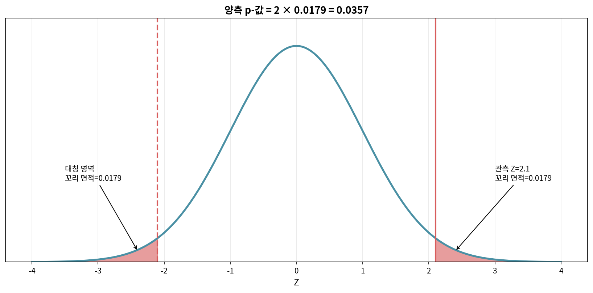

```python
import numpy as np
from scipy import stats

p_hat, p0, n = 0.37, 0.5, 1000
SE = np.sqrt(p0*(1-p0)/n)
z = (p_hat - p0)/SE
p_value = 2 * stats.norm.cdf(z)   # z가 음수이므로 cdf
print(f"Z = {z:.2f}, p-값 = {p_value:.2e}")
```

> **단일 비율 가설검정 4단계**
>
> 1. **준비**: 모수 식별, 가설 작성, $\alpha$ 결정, $\hat{p}$, $n$ 확인
> 2. **확인**: $H_0$ 하에서 정규성 — **귀무값으로** 성공-실패 확인
> 3. **계산**: **귀무값으로** $SE$ 계산 → $Z$ 계산 → p-값
> 4. **결론**: p-값과 $\alpha$ 비교 후 맥락 해석

---

#### Guided Practice 5.32 & 예제 5.33: 핵무기 감축

2013년 1028명 중 56%가 핵무기 감축 지지. 다수 지지의 증거인가?

**가설**: $H_0: p = 0.5$, $H_A: p \neq 0.5$ (양측)

**계산**

$$SE = \sqrt{\frac{0.5^2}{1028}} = 0.0156$$

$$Z = \frac{0.56 - 0.50}{0.0156} = 3.85, \quad \text{p-값} = 2(1 - \Phi(3.85)) \approx 0.0002$$

**결론** p-값 $< \alpha$이므로 $H_0$ 기각. 다수가 핵무기 감축을 지지한다는 매우 강한 증거가 있다.

```python
import numpy as np
from scipy import stats
p_hat, p0, n = 0.56, 0.5, 1028
SE = np.sqrt(p0*(1-p0)/n)
z = (p_hat - p0)/SE
print(f"Z = {z:.2f}, p-값 = {2*(1-stats.norm.cdf(abs(z))):.4f}")
```

---

### 5.3.5 통계적 유의성 vs 실질적 유의성

§5.0.10의 핵심 메시지를 다시 강조한다.

> 표본이 크면 사소한 차이도 통계적으로 유의해진다. 따라서 p-값과 함께 **효과 크기**와 **신뢰구간**을 보고해야 한다.


#### [새로운 시각] 좋은 통계 분석의 보고 양식

p-값만 보고하는 것은 더 이상 권장되지 않는다. American Statistical Association은 다음 양식을 권한다.

1. **효과 크기**와 **방향**: "지지율이 비교 대상보다 6%p 높다"
2. **신뢰구간**: "95% 신뢰구간 (3%p, 9%p)"
3. **p-값**: "p = 0.0002"
4. **표본 크기와 검정력**: "n = 1028, 검정력 0.92"
5. **실용적 해석**: "이 차이는 정책 결정에 의미가 있다"

---

### 5.3.6 단측 가설검정 (특별 주제)

§5.0.4에서 단측검정에 대한 주의사항을 다루었다. 단측의 p-값은 양측의 절반이다.

**우측 단측** ($H_A: p > p_0$): p-값 $= P(Z > z_\text{관측})$

**좌측 단측** ($H_A: p < p_0$): p-값 $= P(Z < z_\text{관측})$

#### 예제 5.38: 단측의 함정

자료를 보고 단측 방향을 정하면 실제 1종 오류율이 두 배가 된다. $\hat{p} > p_0$일 때 우측, $\hat{p} < p_0$일 때 좌측을 자동으로 고르면 5% + 5% = 10%가 되어 명목 $\alpha = 0.05$를 위반한다. 이것이 §5.0.4에서 "단측검정은 의심하라"고 한 이유이다.

---

### 5.3절 연습문제 (홀수번)

#### 연습문제 5.21: 최저임금

1000명 중 42%가 최저임금 인상이 경제에 도움이 된다고 믿는다. 다수가 그렇게 믿는가?

**가설**: $H_0: p = 0.5$, $H_A: p \neq 0.5$, $\alpha = 0.05$

**조건**: 독립성 ✓, $np_0 = n(1-p_0) = 500 \geq 10$ ✓

**계산**

$$SE = \sqrt{0.5^2/1000} = 0.0158$$

$$Z = \frac{0.42 - 0.5}{0.0158} = -5.06, \quad \text{p-값} = 2 \Phi(-5.06) \approx 4 \times 10^{-7}$$

**결론** $H_0$ 기각. 미국 성인의 다수가 최저임금 인상이 경제에 도움이 된다고 **믿지 않는다**(관측값 < 0.5이므로).

```python
import numpy as np
from scipy import stats
p_hat, p0, n = 0.42, 0.5, 1000
SE = np.sqrt(p0*(1-p0)/n)
z = (p_hat-p0)/SE
print(f"Z={z:.2f}, p-값={2*stats.norm.cdf(z):.2e}")
```

---

#### 연습문제 5.23: 역으로 계산

$H_0: p = 0.3$, $H_A: p \neq 0.3$, $n = 90$에서 양측 p-값이 0.05가 되는 $\hat{p}$은?

**풀이**

p-값 0.05 → $|Z| = 1.96$.

$$SE = \sqrt{0.3 \times 0.7/90} = 0.048$$

$$\hat{p} = 0.3 \pm 1.96 \times 0.048$$

$$\hat{p} = 0.394 \text{ 또는 } \hat{p} = 0.206$$

---

#### 연습문제 5.25: 항우울제

Diana가 항우울제 복용 후 증상 호전. 효과가 있다고 결정.

**(a) 가설**

- $H_0$: 항우울제는 효과 없음
- $H_A$: 항우울제는 효과 있음

**(b) 1종 오류**: 실제로 효과가 **없는데** 있다고 결론 → Diana가 잘못 약을 계속 복용한다.

**(c) 2종 오류**: 실제로 효과가 **있는데** 없다고 결론 → 좋은 약을 끊는다.

---

#### 연습문제 5.32: 근시

194명 어린이 중 21명 근시. 알려진 비율 8%가 정확하지 않은가?

**가설**: $H_0: p = 0.08$, $H_A: p \neq 0.08$

**계산**

$$\hat{p} = 21/194 = 0.108$$

$$SE = \sqrt{0.08 \times 0.92/194} = 0.0195$$

$$Z = (0.108 - 0.08)/0.0195 = 1.44, \quad \text{p-값} = 2(1-\Phi(1.44)) = 0.150$$

**결론** p-값 0.150 > 0.05. $H_0$ 기각하지 못함. 8%가 부정확하다는 충분한 증거가 없다.

여기서 §5.0.2의 교훈을 기억하자: **"기각하지 못함"은 "참이라고 증명됨"이 아니다**. 자료가 8%와 양립할 수 있다는 의미일 뿐이다.

---

#### 연습문제 5.35: 통계적 vs 실질적 유의성

"큰 표본에서는 작은 차이도 통계적 유의가 가능하다." 참/거짓?

**참**. §5.0.10에서 본 정확히 그 현상이다. $SE \propto 1/\sqrt{n}$이므로 $n$이 커지면 같은 효과 크기에도 $|Z|$가 커지고 p-값이 작아진다.

```python
import numpy as np
from scipy import stats

p_hat, p0 = 0.51, 0.50  # 효과 크기 1%p 고정
for n in [100, 1000, 10000, 100000]:
    SE = np.sqrt(p0*(1-p0)/n)
    z = (p_hat-p0)/SE
    p_val = 2*(1-stats.norm.cdf(abs(z)))
    print(f"n={n:>6}: p-값={p_val:.4f} ({'유의' if p_val < 0.05 else '비유의'})")
```

---

## 5장 요약

| 절 | 핵심 개념 | 핵심 공식 |
|---|---|---|
| 5.0 | 추론의 토대: p-값, $\alpha$, $\beta$, 검정력, 신뢰수준, 1종·2종 오류 | — |
| 5.1 | 표본추출 분포의 중심극한정리 | $\hat{p} \sim N(p, \sqrt{p(1-p)/n})$ |
| 5.2 | 신뢰구간 (신뢰구간엔 $\hat{p}$ 사용) | $\hat{p} \pm z^\ast \sqrt{\hat{p}(1-\hat{p})/n}$ |
| 5.3 | 가설검정 (검정엔 $p_0$ 사용) | $Z = \dfrac{\hat{p} - p_0}{\sqrt{p_0(1-p_0)/n}}$ |

### 의사결정 흐름도

```
연구 질문
   │
   ├─ "어떤 값이 그럴듯한가?" → 신뢰구간 (§5.2)
   │     │
   │     └─ SE에 p̂ 사용
   │
   └─ "이 값이 그럴듯한가?" → 가설검정 (§5.3)
         │
         └─ SE에 p₀ 사용
         │
         ├─ p-값 < α : H₀ 기각
         └─ p-값 ≥ α : H₀ 기각 못함 (단, "채택"이 아님)
```

다음 6장에서는 이 모든 개념이 두 비율, 카이제곱 검정으로 확장된다.
