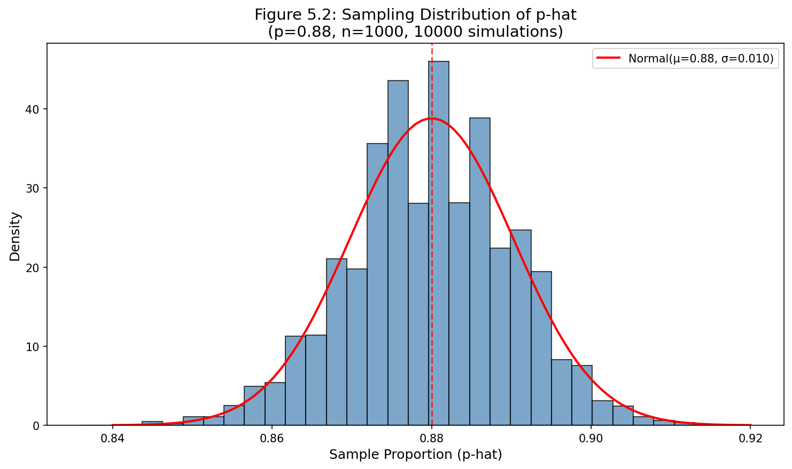
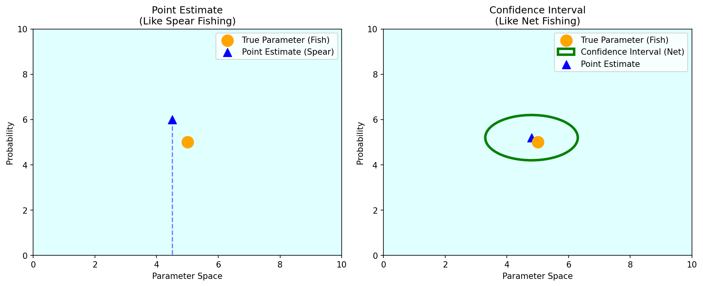
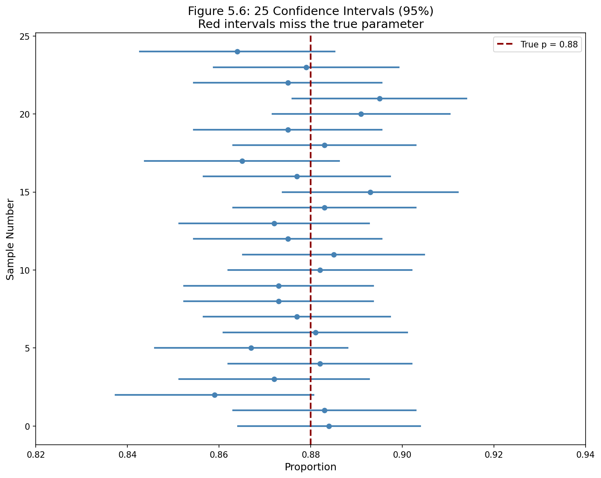

# 제5장: 통계적 추론의 기초

**통계적 추론**(statistical inference)은 주로 모수 추정의 불확실성을 이해하고 정량화하는 것에 관심을 둔다. 설정에 따라 공식과 세부 사항은 달라지지만, 추론의 기초는 통계학 전반에서 동일하다.

우리는 친숙한 주제로 시작한다: 표본비율을 사용하여 모집단비율을 추정하는 아이디어. 다음으로, **신뢰구간**(confidence interval)이라 불리는 것을 만드는데, 이는 실제 모집단 값을 찾을 수 있는 그럴듯한 값들의 범위다. 마지막으로, **가설검정**(hypothesis testing) 프레임워크를 소개하는데, 이는 후보가 투표 인구의 과반수 지지를 받는지와 같은 모집단에 대한 주장을 공식적으로 평가할 수 있게 해준다.

---

## 5.1 점추정과 표본 변동성

Pew Research와 같은 회사들은 정치, 과학적 이해, 브랜드 인지도 등 많은 주제에 대한 여론이나 지식의 상태를 이해하기 위해 자주 여론조사를 실시한다. 여론조사를 하는 궁극적인 목표는 일반적으로 응답을 사용하여 더 넓은 모집단의 의견이나 지식을 추정하는 것이다.

### 5.1.1 점추정과 오차

어떤 여론조사에서 미국 대통령의 지지율이 45%라고 했다고 가정하자. 우리는 45%를 전체 모집단에서 응답을 수집했을 때 볼 수 있는 지지율의 **점추정값**(point estimate)으로 간주한다. 이 전체 모집단 응답 비율을 일반적으로 관심 **모수**(parameter)라고 한다. 모수가 비율일 때, 종종 $p$로 표기하고, 표본비율을 $\hat{p}$("p-hat"으로 발음)로 표기한다.

우리가 두 번째 여론조사를 실시했다면 같은 결과를 얻었을까? 아마 아닐 것이다. 두 번째 여론조사에서 약간 다른 사람들이 무작위로 선택되었을 것이고, 그러면 그 여론조사도 약간 다른 점추정값을 가졌을 것이다. 이러한 표본마다의 차이를 **표본오차**(sampling error)라 한다.

표본오차와 함께, 우리가 주의해야 할 또 다른 유형의 오차가 있다: **편향**(bias). **편향**은 추정값이 모수를 체계적으로 과대추정하거나 과소추정하도록 만들 때 발생한다. 편향이 발생하는 한 가지 이유는 표본이 전체 모집단을 대표하지 않을 때다 - 이것을 **표본추출 편향**(sampling bias)이라 한다.

#### 새로운 시각: 표본오차와 편향의 차이

표본오차와 편향은 서로 다른 개념이다:

- **표본오차**: 무작위성으로 인한 자연스러운 변동. 표본 크기를 늘리면 줄일 수 있다.
- **편향**: 체계적인 오차. 표본 크기를 늘려도 해결되지 않으며, 데이터 수집 방법을 개선해야 한다.

예를 들어, 전화 여론조사에서 젊은 세대가 응답하지 않는 경향이 있다면, 이는 편향을 만들어낸다. 더 많은 전화를 걸어도 이 문제는 해결되지 않는다.

---

### 5.1.2 점추정의 변동성 이해

Pew Research는 태양 에너지 역할 확대를 지지하는 미국 성인의 비율이 약 $p = 0.88$, 즉 88%라고 추정한다. 만약 1000명의 미국 성인을 다시 표본 추출하고 그들에게도 같은 질문을 한다면, 표본 비율이 얼마나 달라질 것으로 예상할까?

이 맥락에서 표본비율 $\hat{p}$의 변동성을 이해하기 위한 시뮬레이션을 실행할 수 있다:

1. 2018년에 약 2억 5천만 명의 미국 성인이 있었다. 2억 5천만 장의 종이에 88%는 "지지"라고 쓰고 나머지 12%는 "반대"라고 쓴다.
2. 종이 조각들을 섞고 1000명의 미국 성인 표본을 나타내기 위해 1000장을 꺼낸다.
3. "지지"라고 말하는 표본의 비율을 계산한다.



컴퓨터의 도움으로 시뮬레이션을 10,000번 실행하고 10,000번의 모든 시뮬레이션 결과의 히스토그램을 그림 5.2에 만들었다. 이 표본비율들의 분포를 **표본추출 분포**(sampling distribution)라 한다.

이 표본추출 분포를 다음과 같이 특성화할 수 있다:

**중심**(Center): 분포의 중심은 $\bar{x}_{\hat{p}} = 0.880$으로, 모수와 같다.

**퍼짐**(Spread): 분포의 표준편차는 $s_{\hat{p}} = 0.010$이다. 표본추출 분포나 점추정값의 변동성에 대해 이야기할 때, 우리는 일반적으로 표준편차보다 **표준오차**(standard error)라는 용어를 사용하고, 표본비율과 관련된 표준오차에 대해 $SE_{\hat{p}}$라는 표기법을 사용한다.

**모양**(Shape): 분포는 대칭이고 종 모양이며, 정규분포와 닮았다.

> **표본추출 분포는 관찰되지 않지만 염두에 둔다**
>
> 실제 세계 응용에서, 우리는 실제로 표본추출 분포를 관찰하지 않지만, 점추정값이 그러한 가상의 분포에서 온다고 항상 생각하는 것이 유용하다.

---

### 예제 5.1: 표본 크기와 표준오차

**문제**: 만약 훨씬 작은 표본 크기 $n = 50$을 사용했다면, $\hat{p}$의 표준오차가 $n = 1000$을 사용했을 때보다 클까 작을까?

**상세 풀이**:

직관적으로, 더 많은 데이터가 더 적은 데이터보다 나은 것 같고, 일반적으로 그것이 맞다!

$p = 0.88$이고 $n = 50$일 때의 전형적인 오차는 $n = 1000$일 때 예상하는 오차보다 **클 것이다**.

이것은 중요한 원리를 강조한다: **더 큰 표본은 더 작은 표본보다 더 정확한 점추정값을 제공하는 경향이 있다**.

```python
import numpy as np

p = 0.88

# n = 1000일 때 표준오차
n1 = 1000
se1 = np.sqrt(p * (1 - p) / n1)

# n = 50일 때 표준오차
n2 = 50
se2 = np.sqrt(p * (1 - p) / n2)

print("=== 표본 크기와 표준오차 ===")
print(f"n = {n1}일 때 SE = {se1:.4f}")
print(f"n = {n2}일 때 SE = {se2:.4f}")
print(f"비율: SE(n=50) / SE(n=1000) = {se2/se1:.2f}배")
```

**출력**:
```
=== 표본 크기와 표준오차 ===
n = 1000일 때 SE = 0.0103
n = 50일 때 SE = 0.0460
비율: SE(n=50) / SE(n=1000) = 4.47배
```

---

### 5.1.3 중심극한정리

그림 5.2의 분포는 정규분포처럼 보인다. 이것은 이상 현상이 아니다; 이것은 **중심극한정리**(Central Limit Theorem)라 불리는 일반적인 원리의 결과다.

> **중심극한정리와 성공-실패 조건**
>
> 관측값들이 독립이고 표본 크기가 충분히 크면, 표본비율 $\hat{p}$은 다음의 평균과 표준오차를 가진 정규분포를 따르는 경향이 있다:
>
> $$\mu_{\hat{p}} = p \qquad SE_{\hat{p}} = \sqrt{\frac{p(1-p)}{n}}$$
>
> 중심극한정리가 성립하려면, 표본 크기는 $np \geq 10$이고 $n(1-p) \geq 10$일 때 충분히 크다고 여겨지며, 이를 **성공-실패 조건**(success-failure condition)이라 한다.

---

### 예제 5.2: 중심극한정리 조건 확인

**문제**: 앞서 $p = 0.88$이고 $n = 1000$일 때 시뮬레이션된 데이터를 사용하여 $\hat{p}$의 평균과 표준오차를 추정했다. 중심극한정리가 적용되고 표본추출 분포가 근사적으로 정규분포임을 확인하라.

**상세 풀이**:

**독립성**: 각 표본비율 $\hat{p}$에 대해 $n = 1000$개의 관측값이 있고, 그 관측값들 각각은 독립적인 추출이다. 관측값들이 독립으로 간주되는 가장 일반적인 방법은 그들이 단순무작위표본에서 왔을 때다.

**성공-실패 조건**: 계산된 두 값이 10보다 큰지 확인하여 표본 크기가 충분히 큰지 확인할 수 있다:

$$np = 1000 \times 0.88 = 880 \geq 10$$
$$n(1-p) = 1000 \times (1-0.88) = 120 \geq 10$$

독립성과 성공-실패 조건이 모두 만족되므로, 중심극한정리가 적용되고, $\hat{p}$을 정규분포를 사용하여 모델링하는 것이 합리적이다.

```python
p = 0.88
n = 1000

# 성공-실패 조건 확인
successes = n * p
failures = n * (1 - p)

print("=== 중심극한정리 조건 확인 ===")
print(f"기대 성공 수: np = {n} × {p} = {successes}")
print(f"기대 실패 수: n(1-p) = {n} × {1-p} = {failures}")
print(f"성공-실패 조건 만족: {successes >= 10 and failures >= 10}")
```

---

### 예제 5.3: 이론적 평균과 표준오차

**문제**: 중심극한정리에 따라 $p = 0.88$이고 $n = 1000$일 때 $\hat{p}$의 이론적 평균과 표준오차를 계산하라.

**상세 풀이**:

$\hat{p}$들의 평균은 단순히 모집단비율이다:

$$\mu_{\hat{p}} = p = 0.88$$

$\hat{p}$의 표준오차 계산은 다음 공식을 사용한다:

$$SE_{\hat{p}} = \sqrt{\frac{p(1-p)}{n}} = \sqrt{\frac{0.88(1-0.88)}{1000}} = \sqrt{\frac{0.88 \times 0.12}{1000}} = \sqrt{0.0001056} = 0.0103$$

```python
import numpy as np

p = 0.88
n = 1000

mu_p_hat = p
se_p_hat = np.sqrt(p * (1 - p) / n)

print("=== 이론적 평균과 표준오차 ===")
print(f"이론적 평균: μ_p̂ = {mu_p_hat}")
print(f"표준오차: SE_p̂ = {se_p_hat:.4f}")
```

**출력**:
```
=== 이론적 평균과 표준오차 ===
이론적 평균: μ_p̂ = 0.88
표준오차: SE_p̂ = 0.0103
```

---

### 예제 5.4: 정규분포를 이용한 확률 계산

**문제**: 표본비율 $\hat{p}$이 모집단 값 $p = 0.88$의 $\pm 0.02$ (2%) 이내에 있을 빈도를 추정하라. 예제 5.2와 5.3에 기초하여, 분포가 근사적으로 $N(\mu_{\hat{p}} = 0.88, SE_{\hat{p}} = 0.010)$임을 안다.

**상세 풀이**:

우리는 0.86과 0.90 사이의 $\hat{p}$들의 비율을 이해하고 싶다.

$\mu_{\hat{p}} = 0.88$이고 $SE_{\hat{p}} = 0.010$으로, 왼쪽과 오른쪽 절단점 모두에 대해 Z-점수를 계산할 수 있다:

$$Z_{0.86} = \frac{0.86 - 0.88}{0.010} = -2$$

$$Z_{0.90} = \frac{0.90 - 0.88}{0.010} = 2$$

통계 소프트웨어를 사용하여 꼬리 면적을 찾을 수 있고, 각각 0.0228임을 발견할 것이다. 총 꼬리 면적은 $2 \times 0.0228 = 0.0456$이고, 이는 음영 면적 **0.9544**를 남긴다.

즉, 그림 5.2의 표본추출 분포의 약 **95.44%**가 모집단비율 $p = 0.88$의 $\pm 0.02$ 이내에 있다.

```python
from scipy import stats
import numpy as np

mu = 0.88
se = 0.010

# Z-점수 계산
z_lower = (0.86 - mu) / se
z_upper = (0.90 - mu) / se

# 꼬리 면적
tail_lower = stats.norm.cdf(z_lower)
tail_upper = 1 - stats.norm.cdf(z_upper)

# 중앙 면적
central_area = 1 - (tail_lower + tail_upper)

print("=== 정규분포를 이용한 확률 계산 ===")
print(f"Z_0.86 = {z_lower}, Z_0.90 = {z_upper}")
print(f"하위 꼬리 면적: {tail_lower:.4f}")
print(f"상위 꼬리 면적: {tail_upper:.4f}")
print(f"총 꼬리 면적: {tail_lower + tail_upper:.4f}")
print(f"p̂이 ±0.02 이내에 있을 확률: {central_area:.4f}")
```

**출력**:
```
=== 정규분포를 이용한 확률 계산 ===
Z_0.86 = -2.0, Z_0.90 = 2.0
하위 꼬리 면적: 0.0228
상위 꼬리 면적: 0.0228
총 꼬리 면적: 0.0456
p̂이 ±0.02 이내에 있을 확률: 0.9544
```

---

### Guided Practice 5.5: 표준오차 공식의 해석

**문제**: 예제 5.1에서 더 작은 표본이 덜 신뢰할 수 있는 추정값을 생성하는 경향이 있음을 논의했다. 이 직관이 $SE_{\hat{p}} = \sqrt{\frac{p(1-p)}{n}}$ 공식에 어떻게 반영되는지 설명하라.

**상세 풀이**:

표본 크기 $n$이 분수의 분모(아래쪽)에 있으므로, 더 큰 표본 크기는 계산될 때 전체 표현식이 더 작아지는 경향이 있다는 것을 의미한다.

즉, **더 큰 표본 크기는 더 작은 표준오차에 해당한다**.

수학적으로:

$$SE_{\hat{p}} = \sqrt{\frac{p(1-p)}{n}} \propto \frac{1}{\sqrt{n}}$$

표본 크기를 4배로 늘리면 표준오차는 절반으로 줄어든다.

```python
import numpy as np

p = 0.88

# 다양한 표본 크기에서 표준오차
sample_sizes = [50, 100, 500, 1000, 5000]

print("=== 표본 크기와 표준오차의 관계 ===")
print("n\t\tSE")
print("-" * 30)
for n in sample_sizes:
    se = np.sqrt(p * (1 - p) / n)
    print(f"{n}\t\t{se:.4f}")
```

**출력**:
```
=== 표본 크기와 표준오차의 관계 ===
n		SE
------------------------------
50		0.0460
100		0.0325
500		0.0145
1000		0.0103
5000		0.0046
```

---

### 5.1.4 중심극한정리를 실세계 설정에 적용하기

우리는 모집단의 모든 개인에 대한 비싼 여론조사를 실시하지 않는 한 실제로 모집단비율을 알지 못한다. 앞서 $p = 0.88$의 값은 Pew Research가 1000명의 미국 성인에 대해 실시한 여론조사에 기반했고, $\hat{p} = 0.887$이 태양 에너지 확대를 지지하는 것으로 발견되었다.

연구자들은 궁금해했을 것이다: 여론조사의 표본비율이 근사적으로 정규분포를 따르는가?

**독립성**: 여론조사는 미국 성인의 단순무작위표본이며, 이는 관측값들이 독립임을 의미한다.

**성공-실패 조건**: 이 조건을 확인하려면 $np$와 $n(1-p)$가 모두 10보다 큰지 확인하기 위해 모집단비율 $p$가 필요하다. 그러나 우리는 실제로 $p$를 알지 못한다 - 이것이 정확히 여론조사원들이 표본을 추출하는 이유다!

이런 경우, 우리는 종종 성공-실패 조건을 확인하는 차선책으로 $\hat{p}$을 사용한다:

$$n\hat{p} = 1000 \times 0.887 = 887 \geq 10$$
$$n(1-\hat{p}) = 1000 \times (1-0.887) = 113 \geq 10$$

$p$ 대신 $\hat{p}$을 사용하는 이 대체 근사는 표본비율의 표준오차를 계산할 때도 유용하다:

$$SE_{\hat{p}} = \sqrt{\frac{p(1-p)}{n}} \approx \sqrt{\frac{\hat{p}(1-\hat{p})}{n}} = \sqrt{\frac{0.887(1-0.887)}{1000}} = 0.010$$

이 대체 기법은 때때로 **"플러그인 원리"**(plug-in principle)라 불린다.

#### 새로운 시각: 플러그인 원리의 실용성

실제 연구에서 우리는 거의 항상 $p$를 모른다. 그래서 $\hat{p}$을 대신 사용하는 플러그인 원리가 매우 중요하다:

1. **신뢰구간 계산**: $SE = \sqrt{\frac{\hat{p}(1-\hat{p})}{n}}$ 사용
2. **조건 확인**: $n\hat{p} \geq 10$, $n(1-\hat{p}) \geq 10$ 확인

이 방법이 작동하는 이유는 표본 크기가 충분히 크면 $\hat{p}$이 $p$에 가까워지기 때문이다.

---

### 5.1.5 중심극한정리에 대한 추가 세부사항

성공-실패 조건을 탐구하고 중심극한정리를 더 잘 이해해보자.

$np < 10$이거나 $n(1-p) < 10$이면 어떻게 되는가?

예를 들어 $n = 10$이고 $p = 0.25$일 때의 표본추출 분포를 시뮬레이션하면:

$$np = 10 \times 0.25 = 2.5 < 10$$
$$n(1-p) = 10 \times 0.75 = 7.5 < 10$$

이 경우 분포는:
- 정규분포와 달리 **이산적**이다 (연속적이지 않음)
- **비대칭**적이다
- 부드럽지 않다

시뮬레이션에서 발견한 추세:

1. $np$ 또는 $n(1-p)$가 작으면, 분포는 더 이산적이다
2. $np$ 또는 $n(1-p)$가 10보다 작으면, 분포의 비대칭이 더 주목할 만하다
3. $np$와 $n(1-p)$가 둘 다 클수록, 분포는 더 정규분포에 가깝다

분포의 특성:

1. **불편성**: 분포의 중심은 항상 모집단비율 $p$에 있다. $\hat{p}$은 **불편추정량**(unbiased estimator)이다.
2. **정밀도**: 특정 모집단비율 $p$에 대해, 표본추출 분포의 변동성은 표본 크기 $n$이 커질수록 감소한다.
3. **최대 변동성**: 특정 표본 크기에 대해, 변동성은 $p = 0.5$일 때 가장 크다.

```python
import numpy as np
import matplotlib.pyplot as plt

p_values = [0.1, 0.3, 0.5, 0.7, 0.9]
n = 100

print("=== p에 따른 표준오차 ===")
for p in p_values:
    se = np.sqrt(p * (1 - p) / n)
    print(f"p = {p}: SE = {se:.4f}")
```

**출력**:
```
=== p에 따른 표준오차 ===
p = 0.1: SE = 0.0300
p = 0.3: SE = 0.0458
p = 0.5: SE = 0.0500
p = 0.7: SE = 0.0458
p = 0.9: SE = 0.0300
```

---

### 5.1.6 다른 통계량으로 프레임워크 확장하기

표본 통계량을 사용하여 모수를 추정하는 전략은 매우 일반적이며, 비율 외의 다른 통계량에도 적용할 수 있는 전략이다.

예를 들어:
- **평균 급여 추정**: 최근 졸업생의 무작위 표본을 조사하여 표본 평균 $\bar{x}$를 사용하여 모집단 평균 $\mu$를 추정
- **가격 차이 추정**: 두 웹사이트의 제품 가격 차이를 추정하기 위해 제품의 무작위 표본을 추출

이 장은 단일 비율 맥락을 강조하지만, 이 책 전체에서 이러한 방법이 적용될 많은 다른 맥락을 만나게 될 것이다.

#### 새로운 시각: 표본추출 분포의 힘

통계학의 가장 아름다운 점 중 하나는 **표본추출 분포**라는 개념이다. 우리는 실제로 표본추출 분포를 관찰하지 않지만, 그것이 어떤 모양인지 이론적으로 알고 있다.

이 지식 덕분에:
- 단 한 번의 표본에서 모집단에 대한 추론을 할 수 있다
- 추정값의 불확실성을 정량화할 수 있다
- 다른 통계학자들이 같은 방법을 사용하면 장기적으로 얼마나 자주 맞을지 알 수 있다

이것은 마치 주사위를 한 번만 던지면서도 주사위가 공정한지 판단할 수 있는 것과 같다 - 우리는 공정한 주사위의 이론적 분포를 알고 있기 때문이다.

---

## 5.1절 연습문제

### 연습문제 5.1: 모수 식별하기

**문제**: 다음 각 상황에서 관심 모수가 평균인지 비율인지 말하라.

**(a)** 조사에서 100명의 대학생에게 일주일에 인터넷에서 몇 시간을 보내는지 질문한다.

**풀이**: **평균** - 응답이 수치형 (시간 수)이므로 평균이 관심 모수이다.

**(b)** 조사에서 100명의 대학생에게 "인터넷에서 보내는 시간의 몇 퍼센트가 과제 작업의 일부인가?"라고 질문한다.

**풀이**: **평균** - 백분율은 수치형 응답이므로 평균이 관심 모수이다.

**(c)** 조사에서 100명의 대학생에게 논문에서 위키피디아의 정보를 인용했는지 여부를 질문한다.

**풀이**: **비율** - 예/아니오의 범주형 응답이므로 비율이 관심 모수이다.

**(d)** 조사에서 100명의 대학생에게 총 주간 지출의 몇 퍼센트가 알코올 음료에 쓰이는지 질문한다.

**풀이**: **평균** - 백분율은 수치형 응답이므로 평균이 관심 모수이다.

**(e)** 100명의 최근 대학 졸업생 표본에서 85%가 졸업일로부터 1년 이내에 직장을 구할 것으로 기대한다고 발견된다.

**풀이**: **비율** - 기대함/기대하지 않음의 범주형 응답의 비율이다.

```python
print("=== 연습문제 5.1: 모수 식별하기 ===")
answers = {
    "(a) 인터넷 사용 시간": "평균 (수치형 응답)",
    "(b) 과제 작업 비율": "평균 (수치형 응답 - 백분율)",
    "(c) 위키피디아 인용 여부": "비율 (범주형 응답 - 예/아니오)",
    "(d) 알코올 지출 비율": "평균 (수치형 응답 - 백분율)",
    "(e) 취업 기대 여부": "비율 (범주형 응답의 비율)"
}

for question, answer in answers.items():
    print(f"{question}: {answer}")
```

---

### 연습문제 5.3: 품질 관리

**문제**: 한 공장에서 매일 아침 시리얼 상자를 채운다. 상자는 평균 20온스, 표준편차 2온스의 정규분포를 따르는 것으로 추정된다.

**(a)** 한 상자가 21온스보다 무거울 확률은?

**상세 풀이**:

개별 상자의 무게 $X \sim N(20, 2)$

$$Z = \frac{21 - 20}{2} = 0.5$$

$$P(X > 21) = P(Z > 0.5) = 1 - \Phi(0.5) = 1 - 0.6915 = 0.3085$$

약 **30.85%**

**(b)** 25개 상자의 무작위 표본 평균이 21온스보다 무거울 확률은?

**상세 풀이**:

표본 평균 $\bar{X}$의 분포:
- 평균: $\mu_{\bar{X}} = 20$
- 표준오차: $SE_{\bar{X}} = \frac{\sigma}{\sqrt{n}} = \frac{2}{\sqrt{25}} = 0.4$

$$Z = \frac{21 - 20}{0.4} = 2.5$$

$$P(\bar{X} > 21) = P(Z > 2.5) = 1 - \Phi(2.5) = 1 - 0.9938 = 0.0062$$

약 **0.62%**

```python
from scipy import stats
import numpy as np

mu = 20
sigma = 2

print("=== 연습문제 5.3: 품질 관리 ===\n")

# (a) 한 상자가 21온스보다 무거울 확률
z_single = (21 - mu) / sigma
prob_single = 1 - stats.norm.cdf(z_single)
print(f"(a) 단일 상자:")
print(f"    Z = (21 - {mu}) / {sigma} = {z_single}")
print(f"    P(X > 21) = {prob_single:.4f} ({prob_single*100:.2f}%)")

# (b) 25개 상자 평균이 21온스보다 무거울 확률
n = 25
se = sigma / np.sqrt(n)
z_sample = (21 - mu) / se
prob_sample = 1 - stats.norm.cdf(z_sample)
print(f"\n(b) 25개 상자의 평균:")
print(f"    SE = {sigma} / √{n} = {se}")
print(f"    Z = (21 - {mu}) / {se} = {z_sample}")
print(f"    P(X̄ > 21) = {prob_sample:.4f} ({prob_sample*100:.2f}%)")
```

**출력**:
```
=== 연습문제 5.3: 품질 관리 ===

(a) 단일 상자:
    Z = (21 - 20) / 2 = 0.5
    P(X > 21) = 0.3085 (30.85%)

(b) 25개 상자의 평균:
    SE = 2 / √25 = 0.4
    Z = (21 - 20) / 0.4 = 2.5
    P(X̄ > 21) = 0.0062 (0.62%)
```

---

### 연습문제 5.5: 물 표본

**문제**: 한 비영리 단체가 식수에서 납 수치가 높은 가구의 비율을 이해하고 싶어한다. 그들은 가구의 최소 5%는 납 수치가 높을 것으로 예상하지만 약 30% 이상은 아닐 것이다. 그들은 800가구를 무작위로 표본 추출하고 납 수치가 높은 가구의 비율을 계산한다. 그들은 이것을 1000번 반복하고 표본비율의 분포를 만든다.

**(a)** 이 분포를 무엇이라 부르는가?

**풀이**: **표본추출 분포**(sampling distribution)

**(b)** 이 분포의 모양이 대칭, 오른쪽 비대칭, 왼쪽 비대칭 중 어떤 것일 것으로 예상하는가?

**풀이**: 비율이 약 8%라면 0.5에서 멀리 떨어져 있으므로 약간 **오른쪽으로 비대칭**일 수 있다. 그러나 $np = 800 \times 0.08 = 64 \geq 10$이고 $n(1-p) = 736 \geq 10$이므로 꽤 **대칭에 가까울** 것이다.

**(c)** 비율이 약 8%에 분포되어 있다면, 분포의 변동성은 얼마인가?

**풀이**:
$$SE = \sqrt{\frac{0.08 \times 0.92}{800}} = \sqrt{\frac{0.0736}{800}} = \sqrt{0.000092} = 0.0096$$

**(d)** (c)에서 계산한 값의 공식적인 이름은?

**풀이**: **표준오차**(standard error)

**(e)** 연구자들의 예산이 감소하여 표본당 250개의 관측값만 수집할 수 있게 되었다. 새 분포의 변동성은 어떻게 비교될까?

**풀이**:
$$SE_{250} = \sqrt{\frac{0.08 \times 0.92}{250}} = \sqrt{0.000294} = 0.0172$$

표본 크기가 감소하면 변동성이 **증가한다**.

```python
import numpy as np

p = 0.08

print("=== 연습문제 5.5: 물 표본 ===\n")

# (a) 분포 이름
print("(a) 분포 이름: 표본추출 분포 (sampling distribution)")

# (b) 분포 모양
n1 = 800
successes = n1 * p
failures = n1 * (1 - p)
print(f"\n(b) 분포 모양:")
print(f"    np = {successes} ≥ 10, n(1-p) = {failures} ≥ 10")
print(f"    → 대칭에 가까움 (약간 오른쪽 비대칭 가능)")

# (c) 표준오차 (n = 800)
se1 = np.sqrt(p * (1 - p) / n1)
print(f"\n(c) SE (n={n1}) = √({p}×{1-p}/{n1}) = {se1:.4f}")

# (d) 이름
print(f"\n(d) 이 값의 이름: 표준오차 (standard error)")

# (e) 표준오차 비교 (n = 250)
n2 = 250
se2 = np.sqrt(p * (1 - p) / n2)
print(f"\n(e) SE (n={n2}) = {se2:.4f}")
print(f"    변동성 비율: {se2/se1:.2f}배 증가")
```

---

## 5.2 비율에 대한 신뢰구간

표본비율 $\hat{p}$은 모집단비율 $p$에 대한 단일의 그럴듯한 값을 제공한다. 그러나 표본비율은 완벽하지 않으며 그와 관련된 표준오차가 있을 것이다. 모집단비율에 대한 추정값을 말할 때, 단지 점추정값만 제공하는 것보다 그럴듯한 값들의 범위를 제공하는 것이 더 좋은 관행이다.

### 5.2.1 모집단 모수 포착하기

점추정값만 사용하는 것은 흐린 호수에서 작살로 물고기를 잡으려는 것과 같다. 물고기를 본 곳에 작살을 던질 수 있지만, 아마도 빗나갈 것이다. 반면에, 그 지역에 그물을 던지면 물고기를 잡을 좋은 기회가 있다.

**신뢰구간**(confidence interval)은 그물로 낚시하는 것과 같으며, 모집단 모수를 찾을 가능성이 있는 그럴듯한 값들의 범위를 나타낸다.



### Guided Practice 5.6: 신뢰구간의 너비

**문제**: 신뢰구간에서 모집단비율을 포착하는 것을 매우 확실히 하고 싶다면, 더 넓은 구간을 사용해야 할까 더 좁은 구간을 사용해야 할까?

**상세 풀이**:

물고기를 더 확실히 잡고 싶다면, **더 넓은 그물**을 사용해야 한다. 마찬가지로, 모수를 포착하는 것을 더 확실히 하고 싶다면 **더 넓은 신뢰구간**을 사용한다.

이것은 신뢰수준과 구간 너비 사이의 트레이드오프를 보여준다:
- 95% 신뢰구간보다 99% 신뢰구간이 더 넓다
- 더 높은 신뢰 = 더 넓은 구간

```python
print("=== 신뢰수준과 구간 너비 ===")
print("신뢰수준 ↑ → 구간 너비 ↑")
print("신뢰수준 ↓ → 구간 너비 ↓")
print("\n예: p̂ = 0.5, SE = 0.05일 때")

import numpy as np
from scipy import stats

p_hat = 0.5
se = 0.05

for conf_level in [0.90, 0.95, 0.99]:
    z_star = stats.norm.ppf((1 + conf_level) / 2)
    margin = z_star * se
    lower = p_hat - margin
    upper = p_hat + margin
    width = upper - lower
    print(f"{conf_level*100:.0f}% CI: ({lower:.3f}, {upper:.3f}), 너비 = {width:.3f}")
```

---

### 5.2.2 95% 신뢰구간 구성하기

우리의 표본비율 $\hat{p}$은 모집단비율의 가장 그럴듯한 값이므로, 이 점추정값 주변에 신뢰구간을 구축하는 것이 합리적이다. 표준오차는 신뢰구간을 얼마나 크게 만들어야 하는지에 대한 지침을 제공한다.

표준오차는 점추정값의 표준편차를 나타내고, 중심극한정리 조건이 만족될 때, 점추정값은 정규분포를 밀접하게 따른다. 정규분포에서 데이터의 95%는 평균의 1.96 표준편차 이내에 있다.

이 원리를 사용하여, 구간이 모집단비율을 포착한다고 95% 확신하기 위해 표본비율에서 1.96 표준오차까지 확장되는 신뢰구간을 구성할 수 있다:

$$\text{점추정값} \pm 1.96 \times SE$$

$$\hat{p} \pm 1.96 \times \sqrt{\frac{p(1-p)}{n}}$$



그림 5.6은 25개의 표본으로부터 25개의 구간을 만드는 과정을 보여주는데, 결과로 나온 신뢰구간 중 24개는 모집단비율 $p = 0.88$을 포함하고, 1개의 구간은 포함하지 않는다.

---

### 예제 5.7: 신뢰구간이 모수를 놓치는 경우

**문제**: 그림 5.6에서 하나의 구간이 $p = 0.88$을 포함하지 않는다. 이것은 시뮬레이션에 사용된 모집단비율이 $p = 0.88$이 아닐 수 있음을 의미하는가?

**상세 풀이**:

아니다. 일부 관측값들이 자연스럽게 평균에서 1.96 표준편차 이상 떨어져 발생하는 것처럼, 일부 점추정값들은 관심 모수에서 1.96 표준오차 이상 떨어져 있을 것이다.

신뢰구간은 그럴듯한 값들의 범위만을 제공한다. 데이터에 기반하여 다른 값들이 그럴듯하지 않다고 말할 수 있지만, 이것이 그들이 **불가능하다**는 것을 의미하지는 않는다.

95% 신뢰구간은 약 5%의 시간 동안 참값을 "놓친다" - 이것은 방법의 본질적인 특성이다.

```python
import numpy as np

np.random.seed(42)
p = 0.88
n = 1000
n_samples = 100

captured = 0
for _ in range(n_samples):
    sample_p = np.random.binomial(n, p) / n
    se = np.sqrt(sample_p * (1 - sample_p) / n)
    lower = sample_p - 1.96 * se
    upper = sample_p + 1.96 * se
    if lower <= p <= upper:
        captured += 1

print(f"=== 신뢰구간 시뮬레이션 ===")
print(f"100개의 95% CI 중 참값 포착: {captured}개 ({captured}%)")
print(f"기대값: 약 95개 (95%)")
```

---

> **모수에 대한 95% 신뢰구간**
>
> 점추정값의 분포가 중심극한정리의 조건을 충족하여 정규분포를 밀접하게 따를 때, 95% 신뢰구간을 다음과 같이 구성할 수 있다:
>
> $$\text{점추정값} \pm 1.96 \times SE$$

---

### 예제 5.8: 태양 에너지 지지율 신뢰구간

**문제**: 5.1절에서 우리는 1000명의 미국 성인 무작위 표본 중 88.7%가 태양열 발전의 역할 확대를 지지한다는 Pew Research 여론조사에 대해 배웠다. 모집단비율에 대한 95% 신뢰구간을 계산하고 해석하라.

**상세 풀이**:

**1단계: 조건 확인**
- 독립성: 단순무작위표본 ✓
- 성공-실패: $n\hat{p} = 887 \geq 10$, $n(1-\hat{p}) = 113 \geq 10$ ✓

**2단계: 표준오차 계산**
$$SE_{\hat{p}} = \sqrt{\frac{\hat{p}(1-\hat{p})}{n}} = \sqrt{\frac{0.887 \times 0.113}{1000}} = 0.010$$

**3단계: 95% 신뢰구간 계산**
$$\hat{p} \pm 1.96 \times SE_{\hat{p}}$$
$$0.887 \pm 1.96 \times 0.010$$
$$0.887 \pm 0.0196$$
$$(0.8674, 0.9066)$$

**4단계: 해석**

태양열 발전 확대를 지지하는 미국 성인의 실제 비율이 **86.7%에서 90.7% 사이**에 있다고 95% 확신한다.

```python
import numpy as np

p_hat = 0.887
n = 1000
z_star = 1.96

# 표준오차
se = np.sqrt(p_hat * (1 - p_hat) / n)

# 오차한계
margin_of_error = z_star * se

# 신뢰구간
lower = p_hat - margin_of_error
upper = p_hat + margin_of_error

print("=== 예제 5.8: 태양 에너지 지지율 신뢰구간 ===")
print(f"점추정값: p̂ = {p_hat}")
print(f"표본 크기: n = {n}")
print(f"표준오차: SE = {se:.4f}")
print(f"오차한계: {z_star} × {se:.4f} = {margin_of_error:.4f}")
print(f"\n95% 신뢰구간: ({lower:.4f}, {upper:.4f})")
print(f"95% 신뢰구간: ({lower*100:.1f}%, {upper*100:.1f}%)")
```

**출력**:
```
=== 예제 5.8: 태양 에너지 지지율 신뢰구간 ===
점추정값: p̂ = 0.887
표본 크기: n = 1000
표준오차: SE = 0.0100
오차한계: 1.96 × 0.0100 = 0.0196

95% 신뢰구간: (0.8674, 0.9066)
95% 신뢰구간: (86.7%, 90.7%)
```

---

### 5.2.3 신뢰수준 변경하기

신뢰수준이 95%보다 높은 신뢰구간, 예를 들어 99%의 신뢰수준을 고려하고 싶다고 가정하자.

물고기를 잡으려는 비유를 다시 생각해보자: 물고기를 잡을 것을 더 확신하고 싶다면, 더 넓은 그물을 사용해야 한다. 99% 신뢰수준을 만들려면 95% 구간도 넓혀야 한다.

일반적인 신뢰구간 공식:

$$\text{점추정값} \pm z^* \times SE$$

여기서 $z^*$는 선택된 신뢰수준에 해당한다.

| 신뢰수준 | $z^*$ | 각 꼬리 면적 |
|:--------:|:-----:|:------------:|
| 90% | 1.645 | 5% |
| 95% | 1.960 | 2.5% |
| 99% | 2.576 | 0.5% |

> **오차한계**
>
> 신뢰구간에서 $z^* \times SE$를 **오차한계**(margin of error)라 한다.

---

### Guided Practice 5.9: Z* 값 찾기

**문제**: $X$가 정규분포를 따르는 확률변수라면, $X$의 값이 평균의 2.58 표준편차 이내에 있을 확률은 얼마인가?

**상세 풀이**:

이것은 Z-점수가 -2.58보다 크지만 2.58보다 작을 빈도를 묻는 것과 동등하다.

$$P(-2.58 < Z < 2.58) = \Phi(2.58) - \Phi(-2.58) = 0.9951 - 0.0049 = 0.99$$

따라서, 관측되지 않은 정규 확률변수 $X$가 $\mu$의 2.58 표준편차 이내에 있을 확률은 **99%**다.

```python
from scipy import stats

z_star = 2.58

# P(-2.58 < Z < 2.58)
prob_lower = stats.norm.cdf(-z_star)
prob_upper = stats.norm.cdf(z_star)
prob_between = prob_upper - prob_lower

print("=== Guided Practice 5.9 ===")
print(f"P(Z < -{z_star}) = {prob_lower:.4f}")
print(f"P(Z < {z_star}) = {prob_upper:.4f}")
print(f"P(-{z_star} < Z < {z_star}) = {prob_between:.4f}")
print(f"약 {prob_between*100:.0f}%")
```

---

### 예제 5.10: 90% 신뢰구간

**문제**: 예제 5.8의 데이터를 사용하여 태양열 발전 사용 확대를 지지하는 미국 성인 비율에 대한 90% 신뢰구간을 만들어라.

**상세 풀이**:

**1단계: $z^*$ 찾기**

90% 신뢰수준에서 각 꼬리에 5%가 있으므로, $z^* = 1.645$

**2단계: 90% 신뢰구간 계산**
$$\hat{p} \pm 1.645 \times SE_{\hat{p}}$$
$$0.887 \pm 1.645 \times 0.010$$
$$0.887 \pm 0.0165$$
$$(0.8705, 0.9035)$$

2018년에 미국 성인의 **87.1%에서 90.4%**가 태양열 발전 확대를 지지한다고 90% 확신한다.

```python
from scipy import stats
import numpy as np

p_hat = 0.887
se = 0.010

print("=== 예제 5.10: 다양한 신뢰수준의 신뢰구간 ===\n")

for conf_level in [0.90, 0.95, 0.99]:
    z_star = stats.norm.ppf((1 + conf_level) / 2)
    margin = z_star * se
    lower = p_hat - margin
    upper = p_hat + margin
    print(f"{conf_level*100:.0f}% CI: z* = {z_star:.3f}")
    print(f"         ({lower:.4f}, {upper:.4f})")
    print(f"         ({lower*100:.1f}%, {upper*100:.1f}%)\n")
```

**출력**:
```
=== 예제 5.10: 다양한 신뢰수준의 신뢰구간 ===

90% CI: z* = 1.645
         (0.8706, 0.9034)
         (87.1%, 90.3%)

95% CI: z* = 1.960
         (0.8674, 0.9066)
         (86.7%, 90.7%)

99% CI: z* = 2.576
         (0.8612, 0.9128)
         (86.1%, 91.3%)
```

---

> **단일 비율에 대한 신뢰구간 구성 단계**
>
> **준비**(Prepare): $\hat{p}$와 $n$을 식별하고, 어떤 신뢰수준을 사용할지 결정한다.
>
> **확인**(Check): $\hat{p}$이 거의 정규분포임을 보장하는 조건을 확인한다.
>
> **계산**(Calculate): 조건이 충족되면, $\hat{p}$을 사용하여 SE를 계산하고, $z^*$를 찾고, 구간을 구성한다.
>
> **결론**(Conclude): 문제의 맥락에서 신뢰구간을 해석한다.

---

### 5.2.4 추가 사례 연구: 에볼라 격리

2014년 10월, 뉴욕시에서 에볼라 환자를 치료하던 의사가 에볼라 진단을 받았다. 얼마 지나지 않아, 여론조사에서 뉴욕 주민의 82%가 "에볼라 환자와 접촉한 사람에 대한 의무적인 21일 격리"를 지지하는 것으로 나타났다. 이 여론조사는 1,042명의 뉴욕 성인의 응답을 포함했다.

### 예제 5.11: 점추정값과 정규성 확인

**문제**: 이 경우 점추정값은 무엇이고, 그 점추정값을 정규분포를 사용하여 모델링하는 것이 합리적인가?

**상세 풀이**:

크기 $n = 1042$의 표본에 기반한 점추정값은 $\hat{p} = 0.82$다.

**독립성**: 여론조사는 단순무작위표본에 기반함 ✓

**성공-실패 조건**:
- $1042 \times 0.82 = 854 \geq 10$ ✓
- $1042 \times 0.18 = 188 \geq 10$ ✓

조건이 충족되므로, $\hat{p}$의 표본추출 분포가 정규분포를 사용하여 합리적으로 모델링될 수 있다.

---

### 예제 5.12: 표준오차 계산

**문제**: 에볼라 조사에서 $\hat{p} = 0.82$의 표준오차를 추정하라.

**상세 풀이**:

$$SE_{\hat{p}} = \sqrt{\frac{p(1-p)}{n}} \approx \sqrt{\frac{0.82(1-0.82)}{1042}} = \sqrt{\frac{0.82 \times 0.18}{1042}} = \sqrt{0.0001417} = 0.012$$

---

### 예제 5.13: 에볼라 격리 지지율 신뢰구간

**문제**: 에볼라 환자와 접촉한 사람에 대한 격리를 지지하는 뉴욕 성인의 비율 $p$에 대한 95% 신뢰구간을 구성하라.

**상세 풀이**:

$$\text{점추정값} \pm z^* \times SE$$
$$0.82 \pm 1.96 \times 0.012$$
$$0.82 \pm 0.0235$$
$$(0.796, 0.844)$$

에볼라 환자와 접촉한 사람에 대한 격리를 지지하는 2014년 10월 뉴욕 성인의 비율이 **79.6%와 84.4% 사이**에 있다고 95% 확신한다.

```python
import numpy as np

p_hat = 0.82
n = 1042
z_star = 1.96

se = np.sqrt(p_hat * (1 - p_hat) / n)
margin = z_star * se
lower = p_hat - margin
upper = p_hat + margin

print("=== 예제 5.13: 에볼라 격리 지지율 ===")
print(f"점추정값: p̂ = {p_hat}")
print(f"표본 크기: n = {n}")
print(f"표준오차: SE = {se:.4f}")
print(f"95% CI: ({lower:.3f}, {upper:.3f})")
```

---

### Guided Practice 5.14: 신뢰구간 해석

**문제**: 예제 5.13의 신뢰구간에 대해 다음 두 질문에 답하라:
(a) 이 맥락에서 95% 확신은 무엇을 의미하는가?
(b) 오늘날 뉴욕 주민들의 의견에 대해 이 신뢰구간이 여전히 유효하다고 생각하는가?

**상세 풀이**:

**(a)** 많은 그러한 표본을 추출하고 각각에 대해 95% 신뢰구간을 계산했다면, 그 구간의 약 95%가 에볼라 환자와 접촉한 사람에 대한 격리를 지지하는 뉴욕 성인의 **실제 비율**을 포함할 것이다.

**(b)** 반드시 그렇지는 않다. 여론조사는 거대한 공중 보건 우려가 있던 시기에 실시되었다. 이제 사람들이 한 발 물러설 시간이 있었으므로, 그들은 의견을 바꿨을 수 있다. 현재 비율에 대한 추정값을 얻으려면 **새로운 여론조사**를 실시해야 할 것이다.

---

### Guided Practice 5.15: 풍력 터빈 지지율

**문제**: Pew Research의 태양 에너지 여론조사에서 다른 형태의 에너지에 대해서도 질문했고, 1000명의 응답자 중 84.8%가 풍력 터빈 사용 확대를 지지했다.
(a) 풍력 터빈 확대를 지지하는 미국 성인의 비율을 정규분포를 사용하여 모델링하는 것이 합리적인가?
(b) 전력 생산을 위한 풍력 터빈 사용 확대에 대한 미국인 지지 수준에 대한 99% 신뢰구간을 만들어라.

**상세 풀이**:

**(a)** 조건 확인:
- 독립성: 무작위 표본 ✓
- 성공-실패: $1000 \times 0.848 = 848 \geq 10$ ✓, $1000 \times 0.152 = 152 \geq 10$ ✓

$\hat{p} = 0.848$은 정규분포를 사용하여 모델링될 수 있다.

**(b)** 99% 신뢰구간:

$$SE_{\hat{p}} = \sqrt{\frac{0.848(1-0.848)}{1000}} = 0.0114$$

$$0.848 \pm 2.576 \times 0.0114 = 0.848 \pm 0.0294 = (0.8186, 0.8774)$$

2018년에 풍력 터빈 사용 확대를 지지하는 미국 성인의 비율이 **81.9%와 87.7% 사이**라고 99% 확신한다.

```python
import numpy as np
from scipy import stats

p_hat = 0.848
n = 1000

# (a) 조건 확인
print("=== Guided Practice 5.15 ===\n")
print("(a) 조건 확인:")
print(f"    np̂ = {n * p_hat} ≥ 10 ✓")
print(f"    n(1-p̂) = {n * (1 - p_hat)} ≥ 10 ✓")

# (b) 99% 신뢰구간
se = np.sqrt(p_hat * (1 - p_hat) / n)
z_star = stats.norm.ppf(0.995)  # 99% CI
margin = z_star * se
lower = p_hat - margin
upper = p_hat + margin

print(f"\n(b) 99% 신뢰구간:")
print(f"    SE = {se:.4f}")
print(f"    z* = {z_star:.3f}")
print(f"    99% CI: ({lower:.4f}, {upper:.4f})")
print(f"    99% CI: ({lower*100:.1f}%, {upper*100:.1f}%)")
```

---

### 5.2.5 신뢰구간 해석하기

신뢰구간 해석의 핵심 원칙:

1. **진술은 항상 모집단 모수에 대한 것**이다 - 표본 통계량이 아니다.

2. **잘못된 언어 피하기**: "모집단비율이 이 구간 안에 있을 확률이 95%다"라고 말하지 않는다. 모수는 고정된 값이고, 구간이 그 값을 포착하거나 포착하지 못한다.

3. **신뢰구간은 모집단 모수에 대해서만**: 개별 관측값이나 미래의 점추정값에 대해서는 아무것도 말하지 않는다.

4. **표본오차에만 적용**: 편향은 해결하지 않는다.

#### 새로운 시각: 신뢰구간의 참된 의미

신뢰구간을 이해하는 가장 좋은 방법:

- 신뢰수준(95%)은 **방법**에 대한 것이지, 특정 구간에 대한 것이 아니다
- "이 방법으로 100번 구간을 만들면, 약 95번은 참값을 포함할 것이다"
- 특정 구간에 대해 "참값이 이 구간 안에 있을 확률이 95%다"라고 말하는 것은 **잘못된** 해석이다
- 모수는 구간 안에 있거나 없다 - 확률의 문제가 아니다!

---

### Guided Practice 5.16: 신뢰구간의 한계

**문제**: 태양 에너지 조사에 대한 90% 신뢰구간: 87.1%에서 90.4%를 고려하라. 조사를 다시 실시한다면, 새 조사의 비율이 87.1%에서 90.4% 사이에 있을 것이라고 90% 확신한다고 말할 수 있는가?

**상세 풀이**:

**아니오**, 신뢰구간은 미래의 점추정값이 아니라 **모수**에 대한 그럴듯한 값의 범위만을 제공한다.

새로운 표본을 추출하면, 그 표본의 $\hat{p}$은 우리가 계산한 신뢰구간과 무관하게 변동할 것이다.

```python
import numpy as np

np.random.seed(123)
p_true = 0.88
n = 1000

# 첫 번째 조사
sample1 = np.random.binomial(n, p_true) / n
se1 = np.sqrt(sample1 * (1 - sample1) / n)
ci1 = (sample1 - 1.645 * se1, sample1 + 1.645 * se1)

print("=== 신뢰구간의 한계 ===")
print(f"첫 번째 조사: p̂ = {sample1:.3f}")
print(f"90% CI: ({ci1[0]:.3f}, {ci1[1]:.3f})")

# 두 번째 조사 (새로운 표본)
sample2 = np.random.binomial(n, p_true) / n
print(f"\n두 번째 조사: p̂ = {sample2:.3f}")
print(f"첫 번째 CI에 포함? {ci1[0] <= sample2 <= ci1[1]}")
```

---

## 5.2절 연습문제

### 연습문제 5.7: 만성 질환, Part I

**문제**: 2013년에 Pew Research Foundation은 "미국 성인의 45%가 하나 이상의 만성 질환과 함께 살고 있다고 보고한다"고 보고했다. 연구는 약 1.2%의 표준오차를 보고했고, 이 설정에서 정규 모델이 합리적으로 사용될 수 있다. 하나 이상의 만성 질환과 함께 사는 미국 성인 비율에 대한 95% 신뢰구간을 만들어라.

**상세 풀이**:

$$\text{점추정값} \pm z^* \times SE = 0.45 \pm 1.96 \times 0.012$$
$$= 0.45 \pm 0.0235 = (0.4265, 0.4735)$$

하나 이상의 만성 질환과 함께 사는 미국 성인의 비율이 **42.6%에서 47.4% 사이**라고 95% 확신한다.

```python
import numpy as np

p_hat = 0.45
se = 0.012
z_star = 1.96

margin = z_star * se
lower = p_hat - margin
upper = p_hat + margin

print("=== 연습문제 5.7: 만성 질환 ===")
print(f"점추정값: {p_hat}")
print(f"표준오차: {se}")
print(f"95% CI: ({lower:.4f}, {upper:.4f})")
print(f"95% CI: ({lower*100:.1f}%, {upper*100:.1f}%)")
```

---

### 연습문제 5.9: 만성 질환, Part II

**문제**: 연습문제 5.7의 정보를 사용하여, 다음 각 진술이 참인지 거짓인지 식별하라.

**(a)** 연습문제 5.7의 신뢰구간이 만성 질환을 앓고 있는 미국 성인의 실제 비율을 포함한다고 확실히 말할 수 있다.

**풀이**: **거짓**. 신뢰구간은 그럴듯한 값들의 범위를 제공하며, 때때로 참값을 놓친다. 95% 신뢰구간은 약 5%의 시간 동안 "놓친다".

**(b)** 이 연구를 1,000번 반복하고 각 연구에 대해 95% 신뢰구간을 구성한다면, 그 구간의 약 950개가 만성 질환을 앓고 있는 미국 성인의 실제 비율을 포함할 것이다.

**풀이**: **참**. 이것이 95% 신뢰구간의 정의다.

**(c)** 여론조사는 만성 질환을 앓고 있는 미국 성인의 비율이 50% 미만이라는 통계적으로 유의한 증거를 ($\alpha = 0.05$ 수준에서) 제공한다.

**풀이**: **참**. 95% 신뢰구간 (42.6%, 47.4%)이 50%를 포함하지 않으므로, 가설검정에서 비율이 0.5라는 귀무가설을 기각할 것이다.

**(d)** 표준오차가 1.2%이므로, 연구의 사람들 중 1.2%만이 답변에 대한 불확실성을 전달했다.

**풀이**: **거짓**. 표준오차는 무작위성으로 인한 전체 추정값의 불확실성을 설명하며, 개인의 응답에 해당하는 불확실성이 아니다.

```python
print("=== 연습문제 5.9: 진술 판별 ===")
statements = [
    ("(a) CI가 참값을 포함한다고 확실히 말할 수 있다", "거짓", 
     "95% CI는 약 5%의 시간 동안 참값을 놓친다"),
    ("(b) 1000번 반복하면 약 950개가 참값 포함", "참", 
     "95% CI의 정의"),
    ("(c) 비율이 50% 미만이라는 유의한 증거", "참", 
     "CI (42.6%, 47.4%)가 50%를 포함하지 않음"),
    ("(d) 1.2%의 사람들이 불확실성 전달", "거짓", 
     "SE는 추정값의 불확실성, 개인 응답의 불확실성 아님")
]

for statement, answer, reason in statements:
    print(f"{statement}")
    print(f"  답: {answer} - {reason}\n")
```

---

### 연습문제 5.11: ER에서 대기

**문제**: 응급실에서의 평균 대기 시간을 추정하기 위해 연구가 설계되었다. 64명 환자의 무작위 표본에서 평균 대기 시간은 137.5분이며, 그 추정값의 95% 신뢰구간은 (128, 147)분이었다.

다음 진술이 참인지 거짓인지 결정하라:

**(a)** 이 신뢰구간은 표본 평균이 128분과 147분 사이에 있음을 의미한다.

**풀이**: **거짓**. 점추정값(137.5분)은 항상 신뢰구간 안에 있다. 신뢰구간은 모집단 평균에 대한 것이지 표본 평균에 대한 것이 아니다.

**(b)** 이 데이터의 95% 신뢰구간의 오차한계는 약 9.5분이다.

**풀이**: **참**. 오차한계 = $(147 - 128) / 2 = 9.5$분

**(c)** 무작위 표본의 95%는 표본 평균이 128분과 147분 사이에 있다.

**풀이**: **거짓**. 신뢰구간은 표본 평균의 분포가 아니라 모집단 모수에 대한 것이다.

**(d)** 99% 신뢰구간은 추정에 더 확실해야 하므로 95% 신뢰구간보다 좁을 것이다.

**풀이**: **거짓**. 더 높은 신뢰수준은 더 넓은 구간을 필요로 한다.

**(e)** 오차한계는 9.5이고 표본 평균은 137.5이다.

**풀이**: **참**. 오차한계 = $(147-128)/2 = 9.5$, 표본 평균 = $(147+128)/2 = 137.5$

**(f)** 95% 신뢰수준에서 오차한계를 지금의 절반으로 줄이려면 표본 크기를 두 배로 해야 할 것이다.

**풀이**: **거짓**. SE가 $1/\sqrt{n}$에 비례하므로, 오차한계를 절반으로 줄이려면 표본 크기를 $2^2 = 4$배로 해야 한다.

```python
print("=== 연습문제 5.11: ER 대기 시간 ===")

ci_lower, ci_upper = 128, 147
sample_mean = (ci_lower + ci_upper) / 2
margin_of_error = (ci_upper - ci_lower) / 2

print(f"표본 평균: {sample_mean}분")
print(f"오차한계: {margin_of_error}분")
print(f"95% CI: ({ci_lower}, {ci_upper})분")

# 오차한계 절반으로 줄이기
print(f"\n오차한계를 절반으로 줄이려면:")
print(f"SE ∝ 1/√n 이므로")
print(f"SE를 1/2로 → n을 4배로 (64 × 4 = 256명)")
```

## 5.3 비율에 대한 가설검정

다음 질문은 Hans Rosling의 책 Factfulness에서 나온 것이다:

> 오늘날 세계의 1세 아이들 중 몇 퍼센트가 어떤 질병에 대해 예방접종을 받았는가?
> a. 20%, b. 50%, c. 80%

정답: **c. 80%**

이 절에서 우리는 경쟁하는 아이디어와 주장을 엄격하게 평가하는 데 사용되는 프레임워크인 **가설검정**(hypothesis tests)에 대해 배울 것이다.

---

### 5.3.1 가설검정 프레임워크

2014년 Pew Research 조사에서 50명의 대학 교육을 받은 미국 성인에게 신생아 백신 접종 일정에 대해 질문했다:

- 부모 선택에 따라 시간에 걸쳐 펼쳐야 한다 (12%)
- 의사가 권장하는 대로 빨리 맞아야 한다 (24%) ← **정답**
- 건강한 아기에게는 필요하지 않다 (64%)

응답자의 24%만이 정답을 맞혔다. 세 가지 선택지 중 하나를 무작위로 고르면 33.3%의 정답률이 예상된다.

두 가지 경쟁하는 가설:

- **$H_0$ (귀무가설)**: $p = 0.333$ (무작위 추측과 같음)
- **$H_A$ (대립가설)**: $p \neq 0.333$ (무작위 추측과 다름)

> **귀무가설과 대립가설**
>
> **귀무가설**($H_0$): 회의적인 시각 또는 아무 일도 일어나지 않았다는 주장
>
> **대립가설**($H_A$): 무언가 새로운 것이 일어나고 있다는 대안적 주장

---

### 예제 5.18: 가설 작성

**문제**: 대학 교육을 받은 성인과 백신 접종에 대한 맥락에서 귀무가설과 대립가설을 말로 작성하라.

**상세 풀이**:

**$H_0$**: 대학 교육을 받은 성인들이 올바른 백신 접종 일정을 식별할 확률은 무작위 추측(1/3)과 같다.

**$H_A$**: 대학 교육을 받은 성인들이 올바른 백신 접종 일정을 식별할 확률은 무작위 추측과 다르다.

```python
print("=== 예제 5.18: 가설 작성 ===")
print("H₀: p = 1/3 = 0.333")
print("    (대학 교육 성인의 정답률 = 무작위 추측)")
print("\nHₐ: p ≠ 0.333")
print("    (대학 교육 성인의 정답률 ≠ 무작위 추측)")
```

---

### 예제 5.19: 양측 검정 선택 이유

**문제**: 대학 교육을 받은 성인들이 무작위 추측보다 못한다고 생각되면, 왜 $H_A: p < 0.333$으로 대립가설을 설정하지 않았는가?

**상세 풀이**:

대학 교육을 받은 성인들이 무작위 추측보다 못할 것이라는 주장은 검정을 시작하기 전에 만들어진 **편향된 주장**이다.

이 맥락에서 귀무가설을 기각하고 비율이 무작위 추측과 **다르다**는 결론에 도달하면 그것만으로도 충분히 흥미롭다.

---

### 5.3.2 신뢰구간을 사용한 가설검정

표본에서 정답을 맞힌 비율: $\hat{p} = 12/50 = 0.24$

귀무가설 값: $p_0 = 1/3 \approx 0.333$

질문: 24%와 33.3%의 차이는 우연인가, 아니면 강력한 증거인가?

---

### 예제 5.20: 신뢰구간을 통한 가설검정

**문제**: 표본 데이터를 사용하여 $p$에 대한 95% 신뢰구간을 구성하라.

**상세 풀이**:

**1단계: 조건 확인**

- 독립성: 단순무작위표본 ✓
- 성공-실패: $n\hat{p} = 50 \times 0.24 = 12 \geq 10$ ✓
- $n(1-\hat{p}) = 50 \times 0.76 = 38 \geq 10$ ✓

**2단계: 표준오차 계산**

$$SE_{\hat{p}} = \sqrt{\frac{\hat{p}(1-\hat{p})}{n}} = \sqrt{\frac{0.24 \times 0.76}{50}} = 0.060$$

**3단계: 95% 신뢰구간**

$$\hat{p} \pm z^* \times SE_{\hat{p}} = 0.24 \pm 1.96 \times 0.060 = (0.122, 0.358)$$

**4단계: 결론**

귀무값 $p_0 = 0.333$이 신뢰구간 (0.122, 0.358) **내에 있으므로**, 귀무값이 그럴듯하지 않다고 말할 수 없다.

**귀무가설 $H_0$를 기각하지 않는다**.

```python
import numpy as np

p_hat = 12 / 50
n = 50
p0 = 1/3
z_star = 1.96

se = np.sqrt(p_hat * (1 - p_hat) / n)
lower = p_hat - z_star * se
upper = p_hat + z_star * se

print("=== 예제 5.20: 신뢰구간을 통한 가설검정 ===")
print(f"표본비율: p̂ = {p_hat:.3f}")
print(f"표준오차: SE = {se:.4f}")
print(f"95% CI: ({lower:.3f}, {upper:.3f})")
print(f"\n귀무값 p₀ = {p0:.3f}")
print(f"귀무값이 CI 내에 있는가? {lower <= p0 <= upper}")
print(f"결론: H₀를 기각하지 않는다")
```

---

### 예제 5.21: 귀무가설 기각 실패의 의미

**문제**: 대학 교육을 받은 성인들이 영아 백신 접종 질문에서 단순히 추측했다고 결론지을 수 없는 이유를 설명하라.

**상세 풀이**:

$H_0$를 기각하지 못했지만, 이것이 귀무가설이 **반드시 참**이라는 것을 의미하지는 않는다.

아마도 실제 차이가 있었지만, 비교적 작은 50명의 표본으로는 이를 **감지할 수 없었을** 수 있다.

> **통계학에서 이중 부정**
>
> "귀무가설이 그럴듯하지 않다고 말할 수 없다" 또는 "귀무가설을 기각하지 못했다"
>
> 이중 부정은 우리가 어떤 입장을 기각하지 않지만, 그것이 맞다고도 말하지 않는다는 것을 전달한다.

---

### 5.3.3 의사결정 오류

가설검정에서 잘못된 결정을 내릴 수 있다.

| | $H_0$ 참 | $H_A$ 참 |
|:--|:--:|:--:|
| **$H_0$ 기각하지 않음** | 올바른 결정 | 제2종 오류 |
| **$H_0$ 기각** | 제1종 오류 | 올바른 결정 |

**제1종 오류**(Type 1 Error): $H_0$가 실제로 참일 때 귀무가설을 기각

**제2종 오류**(Type 2 Error): $H_A$가 실제로 참일 때 귀무가설을 기각하지 못함

---

### Guided Practice 5.25: 법정에서의 오류

**문제**: 미국 법원에서 피고는 무죄($H_0$)이거나 유죄($H_A$)다. 이 맥락에서 제1종 오류와 제2종 오류는 무엇을 나타내는가?

**상세 풀이**:

**제1종 오류**: 피고가 **무죄**($H_0$ 참)이지만 **부당하게 유죄 판결**을 받음

**제2종 오류**: 피고가 **유죄**($H_A$ 참)이지만 **무죄로 풀려남**

```python
print("=== Guided Practice 5.25: 법정 오류 ===")
print("제1종 오류 (무고한 사람 유죄 판결):")
print("  - H₀(무죄)가 참인데 H₀를 기각")
print("  - 결과: 억울한 투옥")
print("\n제2종 오류 (유죄인 사람 무죄 방면):")
print("  - Hₐ(유죄)가 참인데 H₀를 기각하지 못함")
print("  - 결과: 범죄자 석방")
```

---

### 예제 5.26: 오류율 트레이드오프

**문제**: 미국 법원에서 제1종 오류율을 어떻게 줄일 수 있는가? 이것이 제2종 오류율에 어떤 영향을 미치겠는가?

**상세 풀이**:

제1종 오류율을 낮추려면, 유죄 판결 기준을 **"합리적 의심을 넘어서"에서 "생각할 수 있는 의심을 넘어서"**로 높여 더 적은 사람이 부당하게 유죄 판결을 받도록 할 수 있다.

그러나 이것은 실제로 유죄인 사람들을 유죄 판결하는 것을 더 어렵게 만들어, **더 많은 제2종 오류**를 범하게 될 것이다.

**핵심 교훈**: 한 유형의 오류를 줄이면, 일반적으로 다른 유형의 오류가 증가한다.

---

### Guided Practice 5.27: 제2종 오류율 줄이기

**문제**: 미국 법원에서 제2종 오류율을 어떻게 줄일 수 있는가?

**상세 풀이**:

제2종 오류율을 낮추려면, 유죄 판결 기준을 **"합리적 의심을 넘어서"에서 "약간의 의심을 넘어서"**로 낮출 수 있다.

그러나 이것은 더 많은 **부당한 유죄 판결**(제1종 오류)도 발생시킨다.

```python
print("=== 오류율 트레이드오프 ===")
print("제1종 오류 ↓ → 제2종 오류 ↑")
print("제2종 오류 ↓ → 제1종 오류 ↑")
print("\n적절한 균형점 찾기가 중요!")
```

---

**유의수준**(significance level) $\alpha$: 귀무가설이 참일 때, 데이터가 $H_0$를 잘못 기각하도록 이끄는 빈도

일반적인 유의수준: $\alpha = 0.05$ (5%)

95% 신뢰구간 사용 시:
- 귀무가설이 참이면, 약 5%의 시간 동안 잘못 기각
- 이것은 유의수준 $\alpha = 0.05$에 해당

---

### 5.3.4 p-값을 사용한 공식적인 검정

**p-값**(p-value)은 귀무가설에 대한 증거와 대립가설에 유리한 증거의 강도를 정량화하는 방법이다.

> **p-값 정의**
>
> **p-값**은 귀무가설이 참이라면, 현재 데이터 세트만큼 대립가설에 유리하거나 더 유리한 데이터를 관찰할 확률이다.

---

### 예제 5.28: 석탄 에너지 지지율 검정

**문제**: Pew Research는 1000명의 미국 성인 중 37%만이 석탄 에너지 역할 확대를 지지했다. 이것이 미국 성인의 과반수가 석탄 에너지 확대에 찬성하지 않는다는 강력한 증거를 제공하는가?

**상세 풀이**:

**1단계: 가설 설정**

- $H_0: p = 0.5$ (지지와 반대가 동등)
- $H_A: p \neq 0.5$ (지지가 50%와 다름)

유의수준: $\alpha = 0.05$

**2단계: 조건 확인**

- 독립성: 무작위 표본 ✓
- 성공-실패: $np_0 = 1000 \times 0.5 = 500 \geq 10$ ✓

**3단계: 표준오차 계산** (귀무값 사용)

$$SE = \sqrt{\frac{p_0(1-p_0)}{n}} = \sqrt{\frac{0.5 \times 0.5}{1000}} = 0.0158$$

**4단계: 검정통계량(Z-점수) 계산**

$$Z = \frac{\hat{p} - p_0}{SE} = \frac{0.37 - 0.50}{0.0158} = -8.23$$

**5단계: p-값 계산**

양측 검정이므로 양쪽 꼬리 면적을 더한다:

$$\text{p-값} = 2 \times P(Z < -8.23) \approx 0$$

**6단계: 결론**

p-값 $\approx 0 < 0.05 = \alpha$ 이므로, **귀무가설을 기각한다**.

여론조사는 미국 성인의 과반수가 석탄 에너지 확대를 지지하지 않는다는 **설득력 있는 증거**를 제공한다.

```python
import numpy as np
from scipy import stats

p_hat = 0.37
p0 = 0.5
n = 1000
alpha = 0.05

# 표준오차 (귀무가설 하에서)
se = np.sqrt(p0 * (1 - p0) / n)

# Z-점수
z = (p_hat - p0) / se

# p-값 (양측)
p_value = 2 * stats.norm.cdf(z)

print("=== 예제 5.28: 석탄 에너지 지지율 검정 ===")
print(f"H₀: p = {p0}, Hₐ: p ≠ {p0}")
print(f"\n표본비율: p̂ = {p_hat}")
print(f"표준오차: SE = {se:.4f}")
print(f"Z-점수: Z = {z:.2f}")
print(f"p-값: {p_value:.2e}")
print(f"\n결론: p-값 ({p_value:.2e}) < α ({alpha})")
print("       → H₀를 기각한다")
print("       → 과반수가 석탄 에너지 확대를 지지하지 않는다")
```

---

> **p-값을 사용한 결론 도출**
>
> **p-값 < α**: $H_0$를 기각하고, 데이터가 대립가설을 지지하는 강력한 증거를 제공한다고 보고
>
> **p-값 ≥ α**: $H_0$를 기각하지 않고, 귀무가설을 기각할 충분한 증거가 없다고 보고

---

### Guided Practice 5.32: 핵무기 감축 가설

**문제**: 미국인의 다수가 핵무기 감축을 지지하는가 반대하는가? 이 질문을 평가하기 위한 가설을 세워라.

**상세 풀이**:

$p$를 핵무기 감축을 지지하는 미국인의 비율이라 하면:

- $H_0: p = 0.50$ (지지와 반대가 동등)
- $H_A: p \neq 0.50$ (지지 비율이 50%와 다름)

```python
print("=== Guided Practice 5.32 ===")
print("H₀: p = 0.50 (다수도 소수도 아님)")
print("Hₐ: p ≠ 0.50 (다수 또는 소수가 지지)")
```

---

### 예제 5.33: 핵무기 감축 검정

**문제**: 2013년 3월 1028명의 미국 성인 중 56%가 핵무기 감축을 지지했다. 5% 유의수준에서 미국인의 다수가 핵무기 감축을 지지한다는 설득력 있는 증거를 제공하는가?

**상세 풀이**:

**조건 확인**:
- 독립성: 단순무작위표본 ✓
- 성공-실패: $np_0 = n(1-p_0) = 1028 \times 0.5 = 514 \geq 10$ ✓

**표준오차**:
$$SE_{\hat{p}} = \sqrt{\frac{0.5(1-0.5)}{1028}} = 0.0156$$

**검정통계량**:
$$Z = \frac{0.56 - 0.50}{0.0156} = 3.85$$

**p-값**:
상위 꼬리 면적 ≈ 0.0001, 양측 p-값 = 0.0002

**결론**:
p-값 (0.0002) < α (0.05) 이므로 $H_0$를 기각.

**2013년 3월에 미국인의 다수가 핵무기 감축 노력을 지지했다는 설득력 있는 증거가 있다.**

```python
import numpy as np
from scipy import stats

p_hat = 0.56
p0 = 0.5
n = 1028

se = np.sqrt(p0 * (1 - p0) / n)
z = (p_hat - p0) / se
p_value = 2 * (1 - stats.norm.cdf(abs(z)))

print("=== 예제 5.33: 핵무기 감축 검정 ===")
print(f"SE = {se:.4f}")
print(f"Z = {z:.2f}")
print(f"p-값 = {p_value:.5f}")
print(f"결론: {'H₀ 기각 - 다수가 지지' if p_value < 0.05 else 'H₀ 기각 실패'}")
```

---

> **단일 비율에 대한 가설검정 단계**
>
> **준비**(Prepare): 모수 식별, 가설 설정, 유의수준 결정, $\hat{p}$와 $n$ 식별
>
> **확인**(Check): $H_0$ 하에서 정규성 조건 확인 (귀무값으로 성공-실패 조건 확인)
>
> **계산**(Calculate): $p_0$으로 SE 계산, Z-점수 계산, p-값 결정
>
> **결론**(Conclude): p-값과 α 비교, 맥락에서 결론 제공

---

### 5.3.5 유의수준 선택하기

전통적인 유의수준: $\alpha = 0.05$

하지만 상황에 따라 조정할 수 있다:

**더 작은 α (예: 0.01)**: 제1종 오류가 위험하거나 비용이 많이 드는 경우

**더 큰 α (예: 0.10)**: 제2종 오류가 더 위험한 경우

---

### 예제 5.34: 도어 힌지

**문제**: 자동차 제조업체가 새로운 힌지 기계로 전환을 고려한다. 결함률이 0.2% 미만이면 비용 절약, 그 이상이면 손실. 유의수준을 수정할 이유가 있는가?

**상세 풀이**:

이 결정은 자동차와 회사에 **한계적인 영향**을 미치는 많은 결정 중 하나일 뿐이다.

제1종 오류나 제2종 오류 모두 특별히 위험하거나 비용이 많이 들지 않으므로 **유의수준 0.05가 합리적**이다.

---

### 예제 5.35: 안전 부품

**문제**: 같은 제조업체가 **안전과 관련된 부품**에 대해 공급업체 전환을 고려한다. 유의수준을 수정할 이유가 있는가?

**상세 풀이**:

안전이 관련되어 있기 때문에, 자동차 회사는 증거가 적당히 강하더라도 더 안전한 공급업체로 전환하기를 열망해야 한다.

**더 큰 유의수준** (예: $\alpha = 0.10$)이 적절할 수 있다.

---

### Guided Practice 5.36: 비싼 부품 교체

**문제**: 기계 내부의 부품은 교체하는 데 매우 비싸다. 그러나 기계는 이 부품이 고장 나더라도 보통 제대로 작동한다. 적절한 가설과 유의수준을 제안하라.

**상세 풀이**:

**가설**:
- $H_0$: 부품이 고장 나지 않았다
- $H_A$: 부품이 고장났다

부품을 교체하기 전에 $H_0$에 대한 **매우 강력한 증거**를 요구해야 한다.

**작은 유의수준** (예: $\alpha = 0.01$)을 선택한다.

```python
print("=== 유의수준 선택 요약 ===")
scenarios = [
    ("제1종 오류가 위험", "작은 α (0.01)", "무고한 사람 유죄 판결 방지"),
    ("제2종 오류가 위험", "큰 α (0.10)", "안전 문제 놓치지 않기"),
    ("균형 필요", "표준 α (0.05)", "대부분의 연구 상황")
]

for scenario, alpha, example in scenarios:
    print(f"{scenario}: {alpha}")
    print(f"  예: {example}\n")
```

---

### 5.3.6 통계적 유의성 대 실질적 유의성

표본 크기가 매우 크면, 실질적 가치가 없는 작은 차이도 **통계적으로 유의**하게 감지될 수 있다.

예: 온라인 실험에서 광고 배치가 시청률을 **0.001% 증가**시킨다고 통계적으로 유의하게 식별 → 하지만 실질적 가치는 없음

#### 새로운 시각: 빅 데이터 시대의 주의점

데이터 과학에서 "빅 데이터"가 보편화됨에 따라, 이 구분은 매우 중요해졌다:

- 수백만 명의 데이터가 있으면 거의 모든 작은 차이도 통계적으로 유의해질 수 있다
- **"통계적으로 유의미하다"와 "실제로 중요하다"는 매우 다른 질문**이다
- 항상 **효과 크기**(effect size)를 검토하고 실제 응용에서 의미가 있는지 질문해야 한다
- p-값만 보고하지 말고, 신뢰구간이나 효과 크기도 함께 보고하는 것이 좋은 관행이다

---

### 5.3.7 단측 가설검정 (특별 주제)

**단측 가설검정**: 대립가설이 한 방향만 지정

- $H_A: p < p_0$ (모수가 귀무값보다 작음)
- $H_A: p > p_0$ (모수가 귀무값보다 큼)

**양측 검정과의 차이**: p-값 계산 시 한쪽 꼬리만 사용

**주의**: 단측 검정은 매우 드물게 사용해야 한다.

---

### 예제 5.38: 단측 검정의 위험

**문제**: 왜 데이터 방향으로 가는 단측 검정을 단순히 실행할 수 없는가?

**상세 풀이**:

데이터를 본 후에 단측 검정을 선택하면:

- $\hat{p} < p_0$이면 $H_A: p < p_0$ 선택 → 하위 5% 꼬리
- $\hat{p} > p_0$이면 $H_A: p > p_0$ 선택 → 상위 5% 꼬리

**결과**: 실제 오류율이 $\alpha = 0.10$이 되어 우리가 설정한 0.05보다 높아진다!

이것은 가설검정 프레임워크를 **훼손**한다.

```python
print("=== 단측 검정의 위험 ===")
print("데이터를 보고 방향 선택 시:")
print("  - 상위 꼬리 5% + 하위 꼬리 5% = 10%")
print("  - 실제 α = 0.10 (의도한 0.05가 아님)")
print("\n결론: 단측 검정은 데이터 수집 전에 결정해야 함")
```

---

## 5.3절 연습문제

### 연습문제 5.21: 최저임금

**문제**: 미국 성인의 다수가 최저임금 인상이 경제에 도움이 될 것이라고 믿는가? Rasmussen Reports의 1,000명 조사에서 42%가 경제에 도움이 될 것이라고 믿는 것으로 나타났다.

**상세 풀이**:

**(i) 가설 설정**:
- $H_0: p = 0.5$
- $H_A: p \neq 0.5$
- 유의수준 $\alpha = 0.05$

**(ii) 조건 확인**:
- 독립성: 단순무작위표본 ✓
- 성공-실패: $0.5 \times 1000 = 500 \geq 10$ ✓

**(iii) 계산**:
$$SE = \sqrt{\frac{0.5 \times 0.5}{1000}} = 0.0158$$
$$Z = \frac{0.42 - 0.5}{0.0158} = -5.06$$
$$\text{p-값} = 2 \times P(Z < -5.06) \approx 0.0000004$$

**(iv) 결론**:

p-값 < α 이므로 $H_0$를 기각.

최저임금 인상이 경제에 도움이 될 것이라고 믿는 미국 성인의 비율이 50%가 아니라고 결론짓는다. 관찰값이 50%보다 낮으므로, 이 믿음은 **미국 성인의 50% 미만**이 가지고 있다.

```python
import numpy as np
from scipy import stats

p_hat = 0.42
p0 = 0.5
n = 1000

se = np.sqrt(p0 * (1 - p0) / n)
z = (p_hat - p0) / se
p_value = 2 * stats.norm.cdf(z)

print("=== 연습문제 5.21: 최저임금 ===")
print(f"SE = {se:.4f}")
print(f"Z = {z:.2f}")
print(f"p-값 = {p_value:.2e}")
print(f"결론: {'H₀ 기각' if p_value < 0.05 else 'H₀ 기각 실패'}")
```

---

### 연습문제 5.23: 역으로 계산하기

**문제**: $H_0: p = 0.3$, $H_A: p \neq 0.3$, $n = 90$일 때, p-값이 0.05가 되는 표본비율은?

**상세 풀이**:

p-값이 0.05이면, 검정통계량은 $Z = \pm 1.96$

표준오차:
$$SE = \sqrt{\frac{0.3 \times 0.7}{90}} = 0.048$$

$Z = 1.96$인 경우:
$$\hat{p} = 0.3 + 1.96 \times 0.048 = 0.394$$

$Z = -1.96$인 경우:
$$\hat{p} = 0.3 - 1.96 \times 0.048 = 0.206$$

**답**: $\hat{p} = 0.394$ 또는 $\hat{p} = 0.206$

```python
import numpy as np

p0 = 0.3
n = 90
z_crit = 1.96

se = np.sqrt(p0 * (1 - p0) / n)
p_hat_upper = p0 + z_crit * se
p_hat_lower = p0 - z_crit * se

print("=== 연습문제 5.23 ===")
print(f"SE = {se:.4f}")
print(f"p̂ (상한) = {p_hat_upper:.3f}")
print(f"p̂ (하한) = {p_hat_lower:.3f}")
```

---

### 연습문제 5.25: 섬유근육통 검정

**문제**: Diana라는 환자가 섬유근육통 진단을 받고 항우울제를 처방받았다. 회의적이었던 그녀는 처음에 항우울제가 증상에 도움이 될 것이라고 믿지 않았다. 몇 달 후 증상이 나아져 항우울제가 효과가 있다고 결정한다.

**(a)** 가설을 작성하라.

**풀이**:
- $H_0$: 항우울제는 섬유근육통 증상에 영향을 미치지 않는다
- $H_A$: 항우울제는 섬유근육통 증상에 영향을 미친다

**(b)** 제1종 오류는?

**풀이**: 항우울제가 실제로 효과가 **없는데**, Diana가 효과가 **있다**고 결론짓는 것

**(c)** 제2종 오류는?

**풀이**: 항우울제가 실제로 효과가 **있는데**, Diana가 효과가 **없다**고 결론짓는 것

---

### 연습문제 5.32: 근시

**문제**: 근시는 모든 어린이의 약 8%에게 영향을 미친다고 알려져 있다. 194명의 어린이 표본에서 21명이 근시였다. 8%가 정확하지 않다는 증거가 있는가?

**상세 풀이**:

**가설**:
- $H_0: p = 0.08$
- $H_A: p \neq 0.08$

**조건 확인**:
- 독립성: 무작위 표본 ✓
- 성공-실패: $194 \times 0.08 = 15.5 \geq 10$ ✓

**계산**:
$$\hat{p} = \frac{21}{194} = 0.108$$
$$SE = \sqrt{\frac{0.08 \times 0.92}{194}} = 0.0195$$
$$Z = \frac{0.108 - 0.08}{0.0195} = 1.44$$
$$\text{p-값} = 2 \times P(Z > 1.44) = 0.150$$

**결론**:

p-값 (0.150) > α (0.05) 이므로 $H_0$를 기각하지 않는다.

8%가 정확하지 않다는 **충분한 증거가 없다**.

```python
import numpy as np
from scipy import stats

p_hat = 21 / 194
p0 = 0.08
n = 194

se = np.sqrt(p0 * (1 - p0) / n)
z = (p_hat - p0) / se
p_value = 2 * (1 - stats.norm.cdf(abs(z)))

print("=== 연습문제 5.32: 근시 ===")
print(f"표본비율: p̂ = {p_hat:.3f}")
print(f"SE = {se:.4f}")
print(f"Z = {z:.2f}")
print(f"p-값 = {p_value:.3f}")
print(f"결론: {'H₀ 기각' if p_value < 0.05 else 'H₀ 기각 실패'}")
```

---

### 연습문제 5.35: 통계적 vs 실질적 유의성

**문제**: "표본 크기가 크면, 귀무값과 관찰된 점추정 사이의 작은 차이도 통계적으로 유의미할 수 있다." 참인가 거짓인가?

**상세 풀이**:

**참**이다.

표본 크기 $n$이 증가하면 표준오차 $SE = \sqrt{p(1-p)/n}$이 **감소**한다.

표준오차가 작아지면 같은 크기의 차이에 대해 Z-점수가 **더 커지고**, 따라서 p-값이 **작아진다**.

결과적으로 실질적으로 의미 없는 작은 차이도 통계적으로 유의미해질 수 있다.

이것이 **통계적 유의성과 실질적 유의성을 구분**해야 하는 이유다.

```python
import numpy as np
from scipy import stats

# 같은 효과 크기, 다른 표본 크기
p_hat = 0.51  # 관찰값
p0 = 0.50     # 귀무값
effect = p_hat - p0  # 효과 크기 = 0.01 (1%)

print("=== 표본 크기와 통계적 유의성 ===")
print(f"효과 크기: {effect*100}% (매우 작음)\n")

for n in [100, 1000, 10000, 100000]:
    se = np.sqrt(p0 * (1 - p0) / n)
    z = (p_hat - p0) / se
    p_value = 2 * (1 - stats.norm.cdf(abs(z)))
    significant = "유의함" if p_value < 0.05 else "유의하지 않음"
    print(f"n = {n:>6}: SE = {se:.4f}, Z = {z:.2f}, p-값 = {p_value:.4f} → {significant}")
```

---

#### 새로운 시각: 가설검정의 한계와 대안

가설검정은 강력한 도구지만 한계가 있다:

1. **이분법적 결론**: "기각" 또는 "기각하지 않음"만 있음
2. **p-값 오용**: p-값 = 0.049와 p-값 = 0.051이 질적으로 다른가?
3. **효과 크기 무시**: 통계적으로 유의해도 실질적으로 의미 없을 수 있음

**대안과 보완**:
- 신뢰구간 함께 보고
- 효과 크기(Cohen's d 등) 계산
- 베이지안 접근법 고려
- 재현성 연구 수행

좋은 연구는 p-값뿐 아니라 **효과의 크기와 실질적 의미**를 함께 고려한다.
