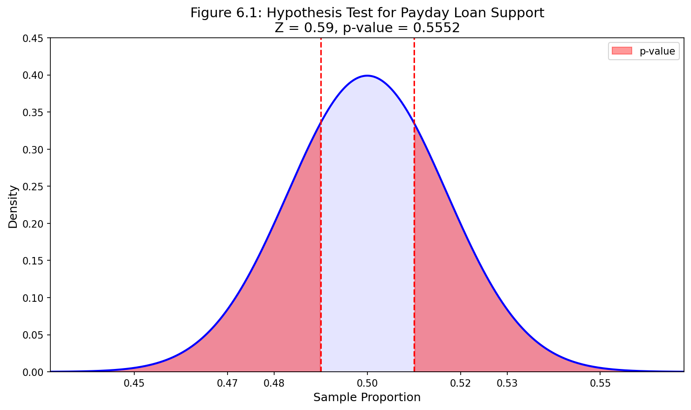
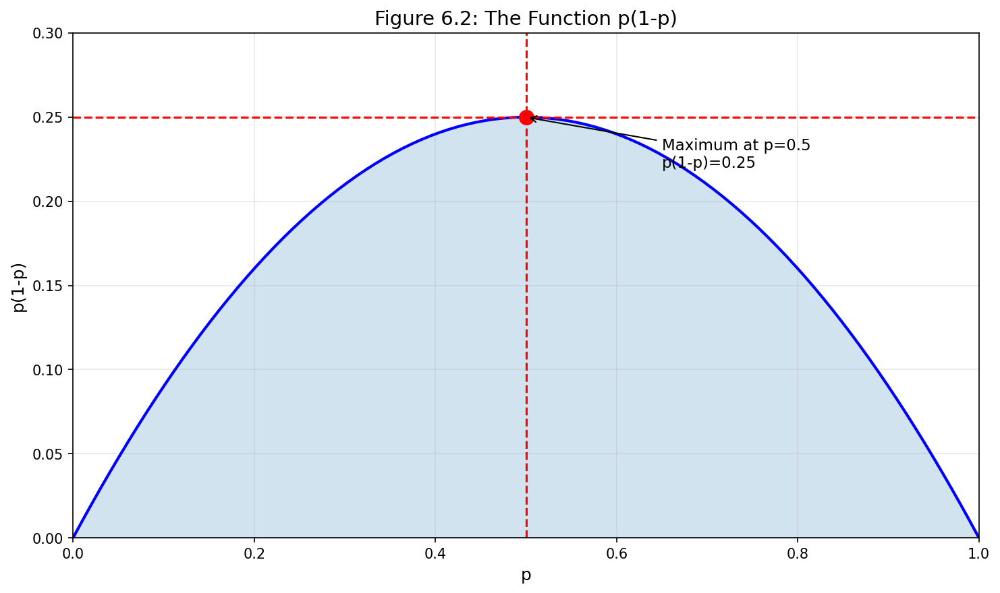
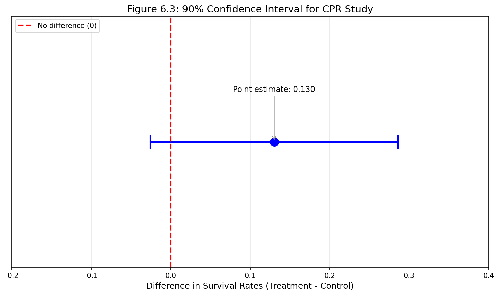
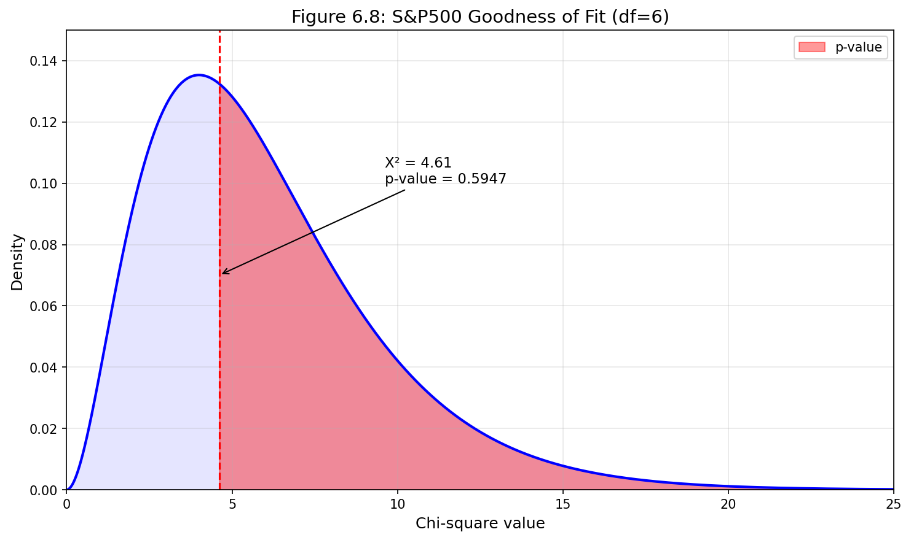
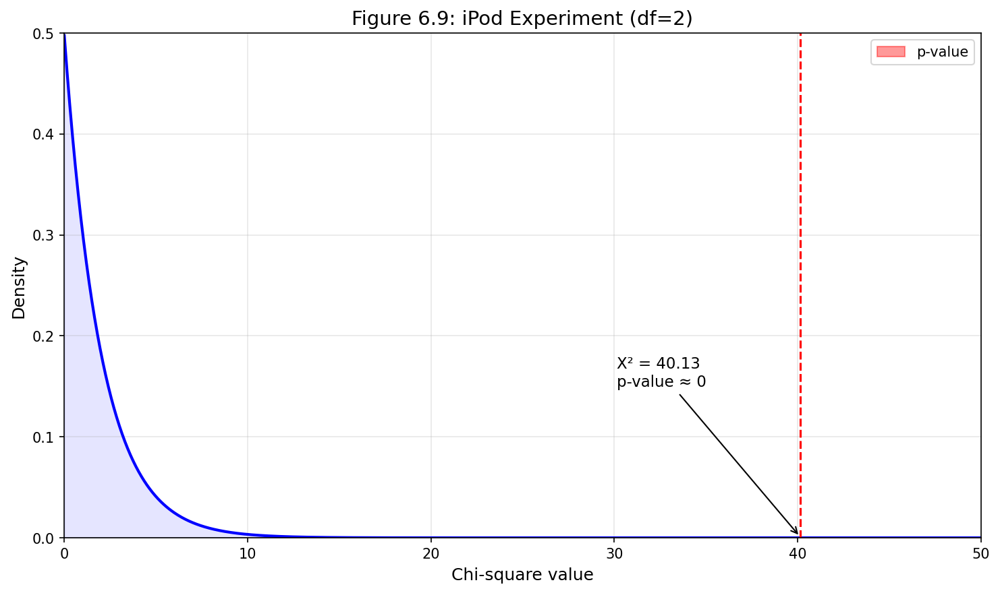
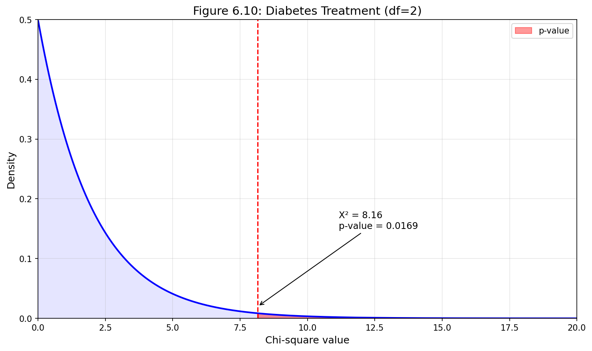

# 제6장: 범주형 자료에 대한 추론
## OpenIntro Statistics 한국어 번역

> **번역 참고사항**
> - 이 번역본은 OpenIntro Statistics 교재 Chapter 6의 완전한 한국어 번역입니다.
> - 모든 예제, Guided Practice, 홀수번 연습문제에 대한 상세한 풀이와 Python 코드가 포함되어 있습니다.
> - "새로운 시각" 섹션은 원서에 없는 추가 설명으로, 개념의 직관적 이해를 돕기 위해 추가되었습니다.

---

# 제6장: 범주형 자료에 대한 추론

## 목차
- 6.1 단일 비율에 대한 추론
- 6.2 두 비율의 차이
- 6.3 카이제곱을 이용한 적합도 검정
- 6.4 이원분할표에서의 독립성 검정

---

이 장에서는 제5장에서 배운 방법과 아이디어를 범주형 자료의 여러 상황에 적용한다. 먼저 단일 비율에 대해 배운 내용을 복습하는데, 여기서 정규분포를 사용하여 표본비율의 불확실성을 모형화할 수 있다. 다음으로 이와 동일한 아이디어를 적용하여 정규모형을 사용한 두 비율의 차이를 분석한다. 이 장의 후반부에서는 분할표에 추론 기법을 적용하는데, 이 맥락에서 다른 분포를 사용하지만 가설검정의 핵심 아이디어는 동일하게 유지된다.

---

## 6.1 단일 비율에 대한 추론

제5장에서 점추정, 신뢰구간, 가설검정을 탐구하면서 단일 비율에 대한 추론 방법을 접했다. 이 절에서는 이러한 주제들을 복습하고, 단일 비율 상황에서 자료를 수집할 때 적절한 표본크기를 선택하는 방법도 다룬다.

### 6.1.1 표본비율이 근사적으로 정규분포를 따르는 경우 식별하기

표본관측값이 독립이고 표본크기가 충분히 클 때, 표본비율 p̂은 정규분포를 사용하여 모형화할 수 있다.

> **p̂의 표집분포**
>
> 참 비율이 p인 모집단에서 크기 n인 표본에 기초한 p̂의 표집분포는 다음 조건이 충족될 때 근사적으로 정규분포를 따른다:
>
> 1. 표본의 관측값이 독립이다. 예를 들어, 단순무작위표본에서 추출된 경우이다.
> 2. 표본에서 최소 10개의 성공과 10개의 실패가 예상된다. 즉, np ≥ 10이고 n(1-p) ≥ 10이다. 이를 **성공-실패 조건**이라고 한다.
>
> 이러한 조건이 충족되면 p̂의 표집분포는 평균 p, 표준오차 SE = √(p(1-p)/n)인 근사 정규분포를 따른다.

일반적으로 참 비율 p를 알지 못하므로, 조건을 확인하고 표준오차를 추정하기 위해 어떤 값을 대입한다. **신뢰구간**의 경우 표본비율 p̂을 사용하여 성공-실패 조건을 확인하고 표준오차를 계산한다. **가설검정**의 경우 일반적으로 귀무값(즉, 귀무가설에서 주장하는 비율)을 p 대신 사용한다.

---

### 새로운 시각: 성공-실패 조건의 직관적 이해

성공-실패 조건(np ≥ 10, n(1-p) ≥ 10)은 왜 필요할까? 이 조건은 이항분포의 정규근사가 충분히 정확해지기 위한 **경험 법칙**이다.

**핵심 통찰**: 이항분포는 본질적으로 이산분포이다. 성공 횟수는 0, 1, 2, ..., n의 정수값만 가질 수 있다. 반면 정규분포는 연속분포이다. 성공-실패 조건은 이산적인 막대 그래프가 연속적인 종 모양 곡선과 충분히 비슷해지는 시점을 보장한다.

**기하학적 해석**: n이 작거나 p가 0 또는 1에 가까우면, 이항분포는 심하게 치우친다. 예를 들어 n=20, p=0.05라면 np=1로 성공-실패 조건을 충족하지 못하고, 분포는 오른쪽으로 심하게 치우친다. 이런 경우 정규근사는 실패한다.

**역사적 배경**: 드 무아브르(de Moivre)는 1733년 이항분포의 정규근사를 처음 발견했다. 그러나 실용적인 "10의 규칙"은 20세기 통계학 실무에서 경험적으로 확립되었다.

---

### 6.1.2 비율에 대한 신뢰구간

신뢰구간은 모수 p에 대한 그럴듯한 값의 범위를 제공하며, p̂이 정규분포로 모형화될 수 있을 때 p에 대한 신뢰구간은 다음 형태를 갖는다:

$$\hat{p} \pm z^* \times SE$$

---

#### 예제 6.1

**문제**: 826명의 급여담보대출(payday loan) 차입자를 대상으로 한 단순무작위표본 조사에서 규제와 비용에 대한 그들의 관심을 더 잘 이해하고자 했다. 응답자의 70%가 급여담보대출 업체에 대한 새로운 규제를 지지했다. p̂ = 0.70을 정규분포로 모형화하는 것이 타당한가?

**풀이**:

자료가 무작위표본이므로 관측값은 독립이고 관심 모집단을 대표한다.

또한 성공-실패 조건을 확인해야 하는데, 신뢰구간을 계산할 때는 p 대신 p̂을 사용한다:

$$\text{지지}: n\hat{p} \approx 826 \times 0.70 = 578$$
$$\text{미지지}: n(1-\hat{p}) \approx 826 \times (1 - 0.70) = 248$$

두 값 모두 최소 10 이상이므로, p̂을 모형화하기 위해 정규분포를 사용할 수 있다.

**Python 코드**:
```python
import numpy as np
from scipy import stats

# 주어진 값
n = 826
p_hat = 0.70

# 성공-실패 조건 확인
successes = n * p_hat
failures = n * (1 - p_hat)

print(f"성공 횟수: {successes}")
print(f"실패 횟수: {failures}")
print(f"성공-실패 조건 충족: {successes >= 10 and failures >= 10}")
```

---

#### Guided Practice 6.2

**문제**: p̂ = 0.70의 표준오차를 추정하라. p를 알 수 없고 표준오차가 신뢰구간용이므로, 공식에서 p 대신 p̂을 사용하라.

**풀이**:

$$SE = \sqrt{\frac{\hat{p}(1-\hat{p})}{n}} = \sqrt{\frac{0.70 \times (1-0.70)}{826}} = \sqrt{\frac{0.70 \times 0.30}{826}} = \sqrt{\frac{0.21}{826}} \approx 0.016$$

**Python 코드**:
```python
import numpy as np

n = 826
p_hat = 0.70

# 표준오차 계산
se = np.sqrt(p_hat * (1 - p_hat) / n)
print(f"표준오차 SE = {se:.4f}")
```

---

#### 예제 6.3

**문제**: 급여담보대출 업체에 대한 규제 강화를 지지하는 급여담보대출 차입자의 비율 p에 대해 95% 신뢰구간을 구성하라.

**풀이**:

점추정 0.70, 95% 신뢰구간에 대한 z* = 1.96, Guided Practice 6.2의 표준오차 SE = 0.016을 사용하면 신뢰구간은 다음과 같다:

$$\text{점추정} \pm z^* \times SE \rightarrow 0.70 \pm 1.96 \times 0.016 \rightarrow (0.669, 0.731)$$

여론조사 시점에 규제를 지지하는 급여담보대출 차입자의 참 비율이 0.669에서 0.731 사이에 있다고 95% 신뢰한다.

**Python 코드**:
```python
import numpy as np
from scipy import stats

# 주어진 값
n = 826
p_hat = 0.70
confidence_level = 0.95

# 표준오차 계산
se = np.sqrt(p_hat * (1 - p_hat) / n)

# z* 값 (양측 95%)
z_star = stats.norm.ppf((1 + confidence_level) / 2)

# 오차한계
margin_of_error = z_star * se

# 신뢰구간
ci_lower = p_hat - margin_of_error
ci_upper = p_hat + margin_of_error

print(f"점추정: {p_hat}")
print(f"표준오차: {se:.4f}")
print(f"z* 값: {z_star:.4f}")
print(f"오차한계: {margin_of_error:.4f}")
print(f"95% 신뢰구간: ({ci_lower:.3f}, {ci_upper:.3f})")
```

---

> **단일 비율에 대한 신뢰구간**
>
> 단일 비율 신뢰구간이 응용에 유용하다고 결정했다면, 구간을 구성하는 네 단계가 있다:
>
> **준비**(Prepare): p̂과 n을 확인하고, 사용할 신뢰수준을 결정한다.
>
> **확인**(Check): p̂이 근사적으로 정규분포를 따르는지 조건을 검증한다. 단일 비율 신뢰구간의 경우 성공-실패 조건을 확인할 때 p 대신 p̂을 사용한다.
>
> **계산**(Calculate): 조건이 충족되면 p̂을 사용하여 SE를 계산하고, z*를 찾아 구간을 구성한다.
>
> **결론**(Conclude): 문제의 맥락에서 신뢰구간을 해석한다.

---

### 6.1.3 비율에 대한 가설검정

급여담보대출 업체에 대한 한 가지 가능한 규제는 신용조회를 실시하고 차입자의 재정 상태에 대비한 부채 상환액을 평가해야 한다는 것이다. 차입자들이 이러한 형태의 규제를 지지할 것인지 알고 싶다.

---

#### Guided Practice 6.4

**문제**: 차입자들이 이러한 유형의 규제에 대해 다수가 지지하는지 또는 다수가 반대하는지를 평가하기 위한 가설을 설정하라.

**풀이**:

다수 지지 또는 다수 반대를 확인하고자 하므로, 다음과 같은 가설을 사용한다:

$$H_0: p = 0.50$$
$$H_A: p \neq 0.50$$

여기서 p는 신용조회 및 부채 상환 평가를 요구하는 규제를 지지하는 모든 급여담보대출 차입자의 비율이다.

---

#### Guided Practice 6.5

**문제**: 급여담보대출 차입자들이 대출업체에게 신용보고서를 조회하고 부채 상환액을 평가하도록 요구하는 규제를 지지하는가? 826명의 차입자를 대상으로 한 무작위표본에서 51%가 그러한 규제를 지지한다고 응답했다. 여기서 가설검정을 위해 p̂ = 0.51을 정규분포로 모형화하는 것이 타당한가?

**풀이**:

표본이 무작위이므로 독립성이 충족된다. 단일 비율 가설검정에서는 귀무값(p₀ = 0.5)을 사용하여 성공-실패 조건을 확인한다:

$$np_0 = 826 \times 0.5 = 413$$
$$n(1 - p_0) = 826 \times 0.5 = 413$$

두 값 모두 10 이상이므로 성공-실패 조건이 충족된다. 따라서 정규분포를 사용하여 p̂을 모형화하는 것이 타당하다.

---

#### 예제 6.6

**문제**: Guided Practice 6.4와 6.5의 가설과 자료를 사용하여, 여론조사가 급여담보대출 차입자의 다수가 대출업체에게 신용보고서를 조회하고 부채 상환액을 평가하도록 요구하는 새로운 규제를 지지한다는 설득력 있는 증거를 제공하는지 평가하라.

**풀이**:

가설이 이미 설정되고 조건이 확인되었으므로 계산으로 넘어갈 수 있다. 단일 비율 가설검정에서 표준오차는 귀무값 p₀를 사용하여 계산한다:

$$SE = \sqrt{\frac{p_0(1-p_0)}{n}} = \sqrt{\frac{0.5(1-0.5)}{826}} = 0.017$$

정규모형에 기초하여 검정통계량을 점추정의 Z-점수로 계산할 수 있다:

$$Z = \frac{\text{점추정} - \text{귀무값}}{SE} = \frac{0.51 - 0.50}{0.017} = 0.59$$

단측 꼬리 면적은 0.2776이고, 양쪽 꼬리 면적으로 표현되는 p-값은 0.5552이다.

p-값이 0.05보다 크므로 H₀를 기각하지 않는다. 여론조사는 급여담보대출 차입자의 다수가 신용조회와 부채 상환 평가에 관한 규제를 지지하거나 반대한다는 설득력 있는 증거를 제공하지 않는다.

**Python 코드**:
```python
import numpy as np
from scipy import stats

# 주어진 값
n = 826
p_hat = 0.51
p_0 = 0.50  # 귀무값
alpha = 0.05

# 귀무값을 사용한 표준오차 (가설검정)
se = np.sqrt(p_0 * (1 - p_0) / n)

# Z 검정통계량
z = (p_hat - p_0) / se

# p-값 (양측검정)
p_value = 2 * (1 - stats.norm.cdf(abs(z)))

print(f"표준오차: {se:.4f}")
print(f"Z 검정통계량: {z:.2f}")
print(f"p-값: {p_value:.4f}")
print(f"결론: {'H₀ 기각' if p_value < alpha else 'H₀ 기각 실패'}")
```



---

> **단일 비율에 대한 가설검정**
>
> 단일 비율 가설검정이 올바른 절차라고 결정했다면, 검정을 완료하는 네 단계가 있다:
>
> **준비**(Prepare): 관심 모수를 확인하고, 가설을 나열하고, 유의수준을 확인하고, p̂과 n을 확인한다.
>
> **확인**(Check): H₀ 하에서 p̂이 근사적으로 정규분포를 따르는지 조건을 검증한다. 단일 비율 가설검정의 경우 귀무값을 사용하여 성공-실패 조건을 확인한다.
>
> **계산**(Calculate): 조건이 충족되면 다시 p₀를 사용하여 표준오차를 계산하고, Z-점수를 계산하고, p-값을 확인한다.
>
> **결론**(Conclude): p-값을 α와 비교하여 가설검정을 평가하고, 문제의 맥락에서 결론을 제공한다.

---

### 새로운 시각: 신뢰구간과 가설검정에서 표준오차의 차이

학생들이 자주 혼란스러워하는 부분이 있다: 왜 신뢰구간에서는 p̂을 사용하고 가설검정에서는 p₀를 사용하는가?

**핵심 차이점**:

| 맥락 | 사용하는 비율 | 이유 |
|------|--------------|------|
| 신뢰구간 | p̂ (표본비율) | 모수 p의 범위를 추정하려 함. p를 모르므로 최선의 추정값인 p̂ 사용 |
| 가설검정 | p₀ (귀무값) | "귀무가설이 참이라면" 이라는 조건부 세계에서 분석. 귀무가설 하에서 p = p₀라고 가정 |

**직관적 이해**: 가설검정은 "검찰"의 역할과 비슷하다. 피고인(귀무가설)이 무죄(참)라고 가정하고 시작한다. 그 가정 하에서 관측된 증거가 얼마나 이상한지를 평가한다. 따라서 귀무가설이 참이라는 전제 하에 모든 계산을 수행해야 하므로 p₀를 사용한다.

---

### 6.1.4 하나 이상의 조건이 충족되지 않을 때

지금까지 p̂이 정규분포로 합리적으로 모형화될 수 있는 조건에 대해 많은 시간을 할애했다. 성공-실패 조건이 충족되지 않으면 어떻게 될까? 독립성 조건이 충족되지 않으면 어떻게 될까? 어느 경우든 신뢰구간과 가설검정의 일반적인 아이디어는 동일하게 유지되지만, 구간이나 p-값을 생성하는 데 사용되는 전략이나 기법은 변경된다.

성공-실패 조건이 가설검정에서 충족되지 않으면, 귀무값 p₀를 사용하여 p̂의 귀무분포를 **시뮬레이션**할 수 있다. 시뮬레이션 개념은 2.3절에서 제시된 말라리아 사례 연구에서 사용된 아이디어와 유사하다.

성공-실패 조건이 충족되지 않을 때 신뢰구간의 경우 **클로퍼-피어슨 구간**(Clopper-Pearson interval)을 사용할 수 있다. 세부 사항은 이 책의 범위를 벗어나지만, 이 주제를 다루는 많은 인터넷 자료가 있다.

독립성 조건은 더 미묘한 요구사항이다. 충족되지 않을 때 어떻게 그리고 왜 충족되지 않는지를 이해하는 것이 중요하다.

---

### 6.1.5 비율을 추정할 때 표본크기 선택하기

자료를 수집할 때, 연구 목적에 적합한 표본크기를 선택한다. 종종 이것은 **오차한계**(신뢰구간에서 점추정에 더하고 빼는 부분)가 표본이 유용할 정도로 충분히 작도록 표본크기를 선택하는 것을 의미한다.

---

#### 예제 6.7

**문제**: 한 대학 신문이 새로운 풋볼 경기장 건설 비용을 지불하기 위해 연간 $200의 등록금 인상을 지지하는 학생 비율을 결정하기 위한 설문조사를 실시하고 있다. 95% 신뢰수준을 사용할 때 오차한계가 0.04보다 작도록 하려면 얼마나 큰 표본이 필요한가?

**풀이**:

표본비율에 대한 오차한계는 다음과 같다:

$$z^* \sqrt{\frac{p(1-p)}{n}}$$

목표는 이 오차한계가 0.04보다 작도록 하는 가장 작은 표본크기 n을 찾는 것이다. 95% 신뢰수준의 경우 z* ≈ 1.96이다. 따라서:

$$1.96 \sqrt{\frac{p(1-p)}{n}} < 0.04$$

그러나 p를 알지 못한다! 가장 큰 오차한계를 산출하는 p의 값은 p = 0.5이다(p(1-p)가 p = 0.5에서 최대가 됨).

$$1.96 \sqrt{\frac{0.5 \times 0.5}{n}} < 0.04$$

n에 대해 풀면:

$$\sqrt{\frac{0.25}{n}} < \frac{0.04}{1.96}$$

$$\frac{0.25}{n} < \left(\frac{0.04}{1.96}\right)^2$$

$$n > \frac{0.25}{\left(\frac{0.04}{1.96}\right)^2} = \frac{0.25 \times 1.96^2}{0.04^2} = 600.25$$

오차한계가 0.04 미만이 되도록 최소 601명의 학생을 표본에 포함해야 한다.

**Python 코드**:
```python
import numpy as np
from scipy import stats

# 주어진 값
margin_of_error_target = 0.04
confidence_level = 0.95

# z* 값
z_star = stats.norm.ppf((1 + confidence_level) / 2)

# 가장 보수적인 p 값 (p = 0.5)
p = 0.5

# 필요한 표본크기 계산
# ME = z* * sqrt(p(1-p)/n)
# n = p(1-p) * (z*/ME)^2

n = p * (1 - p) * (z_star / margin_of_error_target)**2

print(f"z* = {z_star:.4f}")
print(f"계산된 n = {n:.2f}")
print(f"필요한 최소 표본크기 = {int(np.ceil(n))}")
```

---

#### Guided Practice 6.8

**문제**: 이전 데이터 또는 시범 연구에서 p가 대략 0.35라는 강력한 증거가 있다면, 더 작은 표본으로 0.04의 원하는 오차한계를 달성할 수 있을까?

**풀이**:

예, p = 0.35이면 p(1-p) = 0.35 × 0.65 = 0.2275로 p = 0.5일 때의 0.25보다 작다. 따라서:

$$n > \frac{0.2275 \times 1.96^2}{0.04^2} = \frac{0.2275 \times 3.8416}{0.0016} = 546.2$$

따라서 최소 547명의 학생만 필요하다.

**Python 코드**:
```python
import numpy as np
from scipy import stats

# 주어진 값
p = 0.35  # 사전 정보에 기반한 비율
margin_of_error_target = 0.04
confidence_level = 0.95

z_star = stats.norm.ppf((1 + confidence_level) / 2)

# 필요한 표본크기 계산
n = p * (1 - p) * (z_star / margin_of_error_target)**2

print(f"p = {p}일 때")
print(f"p(1-p) = {p * (1-p):.4f}")
print(f"계산된 n = {n:.2f}")
print(f"필요한 최소 표본크기 = {int(np.ceil(n))}")
```

---

### 새로운 시각: p(1-p) 함수와 표본크기 계산

표본크기 공식에서 핵심 역할을 하는 p(1-p) 함수를 이해하면 직관적인 통찰을 얻을 수 있다.



**수학적 사실**: f(p) = p(1-p) = p - p²는 위로 볼록한 이차함수이다. 미분하면 f'(p) = 1 - 2p이고, f'(p) = 0을 풀면 p = 0.5에서 최대값을 갖는다.

**직관적 의미**: 
- p = 0.5일 때 "불확실성이 최대"이다. 성공과 실패가 반반일 때 가장 예측하기 어렵다.
- p가 0이나 1에 가까우면 불확실성이 줄어든다. 거의 모든 결과가 성공(또는 실패)이면 예측이 쉬워진다.

**실용적 함의**: 사전 정보가 없을 때 p = 0.5를 사용하면 "최악의 시나리오"에 대비한 보수적인 표본크기를 얻는다. 사전 정보가 있다면 더 효율적인(작은) 표본크기로 동일한 정밀도를 달성할 수 있다.

---

> **비율을 추정하기 위한 표본크기 공식**
>
> 오차한계가 주어진 신뢰수준에서 ME 이하가 되도록 하는 표본크기 공식:
>
> $$n = \frac{p(1-p) \times (z^*)^2}{ME^2}$$
>
> p가 알려지지 않은 경우 p = 0.5를 사용하여 보수적인 표본크기를 얻는다.


---

## 6.2 두 비율의 차이

이 절에서는 두 그룹이 있고 각 그룹의 성공 비율을 비교하고자 하는 상황을 고려한다. 예를 들어, 한 실험에서 사람들이 두 개의 다른 치료군 중 하나에 무작위로 배정되었을 수 있다. 우리의 조사에서는 표본에 기초하여 p₁ - p₂의 합리적인 점추정을 확인할 것이며, 그 형태를 이미 짐작했을 수 있다: p̂₁ - p̂₂. 다음으로 단일 비율 상황에서 사용한 것과 동일한 과정을 적용한다: 점추정이 정규분포로 모형화될 수 있는지 검증하고, 추정량의 표준오차를 계산하고, 추론 프레임워크를 적용한다.

### 6.2.1 두 비율의 차이의 표집분포

p̂과 마찬가지로, 두 표본비율의 차이 p̂₁ - p̂₂는 특정 조건이 충족되면 정규분포를 사용하여 모형화할 수 있다. 먼저 더 광범위한 독립성 조건이 필요하고, 둘째로 성공-실패 조건이 두 그룹 모두에서 충족되어야 한다.

> **p̂₁ - p̂₂의 표집분포가 정규분포를 따르기 위한 조건**
>
> 차이 p̂₁ - p̂₂는 다음 조건이 충족될 때 정규분포를 사용하여 모형화할 수 있다:
>
> **독립성**(확장): 자료가 두 그룹 내에서 그리고 두 그룹 사이에서 독립이다. 일반적으로 자료가 두 개의 독립적인 무작위표본에서 오거나 무작위 실험에서 온다면 충족된다.
>
> **성공-실패 조건**: 성공-실패 조건이 두 그룹 모두에서 충족되어야 하며, 각 그룹에서 성공과 실패를 별도로 확인한다.
>
> 이러한 조건이 충족되면 p̂₁ - p̂₂의 표준오차는:
>
> $$SE = \sqrt{\frac{p_1(1-p_1)}{n_1} + \frac{p_2(1-p_2)}{n_2}}$$
>
> 여기서 p₁과 p₂는 모집단 비율을, n₁과 n₂는 표본크기를 나타낸다.

---

### 6.2.2 p₁ - p₂에 대한 신뢰구간

두 비율의 차이에 대한 일반적인 신뢰구간 공식을 적용할 수 있으며, p̂₁ - p̂₂를 점추정으로 사용하고 SE 공식을 대입한다:

$$\text{점추정} \pm z^* \times SE \rightarrow \hat{p}_1 - \hat{p}_2 \pm z^* \times \sqrt{\frac{p_1(1-p_1)}{n_1} + \frac{p_2(1-p_2)}{n_2}}$$

신뢰구간을 계산하거나 가설검정을 완료할 때 동일한 준비, 확인, 계산, 결론 단계를 따를 수 있다. 세부 사항은 약간 변경되지만 일반적인 접근 방식은 동일하게 유지된다.

---

#### 예제 6.11

**문제**: 심정지로 심폐소생술(CPR)을 받은 후 병원에 입원한 환자를 대상으로 한 실험을 고려한다. 이 환자들은 혈전용해제를 받는 처치군 또는 혈전용해제를 받지 않는 대조군에 무작위로 배정되었다. 관심 결과변수는 환자가 최소 24시간 생존했는지 여부였다.

| | 생존 | 사망 | 합계 |
|---|---|---|---|
| 대조군 | 11 | 39 | 50 |
| 처치군 | 14 | 26 | 40 |
| 합계 | 25 | 65 | 90 |

두 표본비율의 차이를 정규분포로 모형화할 수 있는지 확인하라.

**풀이**:

먼저 독립성을 확인한다: 무작위 실험이므로 이 조건이 충족된다.

다음으로 각 그룹에 대해 성공-실패 조건을 확인한다. 각 실험 그룹에서 최소 10개의 성공과 10개의 실패가 있다(11, 14, 39, 26). 따라서 이 조건도 충족된다.

정규분포로 모형화할 수 있다.

**Python 코드**:
```python
import numpy as np

# 대조군
control_survived = 11
control_died = 39
n_control = control_survived + control_died

# 처치군
treatment_survived = 14
treatment_died = 26
n_treatment = treatment_survived + treatment_died

# 표본비율
p_hat_control = control_survived / n_control
p_hat_treatment = treatment_survived / n_treatment

print("성공-실패 조건 확인:")
print(f"대조군 성공(생존): {control_survived} ≥ 10? {control_survived >= 10}")
print(f"대조군 실패(사망): {control_died} ≥ 10? {control_died >= 10}")
print(f"처치군 성공(생존): {treatment_survived} ≥ 10? {treatment_survived >= 10}")
print(f"처치군 실패(사망): {treatment_died} ≥ 10? {treatment_died >= 10}")

print(f"\n표본비율:")
print(f"대조군: {p_hat_control:.3f}")
print(f"처치군: {p_hat_treatment:.3f}")
```

---

#### 예제 6.12

**문제**: 처치군과 대조군 간 생존율 차이에 대한 점추정을 구하고, 이 점추정의 표준오차를 계산한 다음, 90% 신뢰구간을 구성하라.

**풀이**:

점추정은 두 그룹의 생존율 차이이다:

$$\hat{p}_T - \hat{p}_C = \frac{14}{40} - \frac{11}{50} = 0.35 - 0.22 = 0.13$$

표준오차는 (신뢰구간이므로 각 표본비율을 사용):

$$SE = \sqrt{\frac{0.35(1-0.35)}{40} + \frac{0.22(1-0.22)}{50}} = \sqrt{\frac{0.2275}{40} + \frac{0.1716}{50}} = \sqrt{0.00569 + 0.00343} = 0.095$$

90% 신뢰구간의 경우 z* = 1.645이다:

$$0.13 \pm 1.645 \times 0.095 \rightarrow 0.13 \pm 0.156 \rightarrow (-0.026, 0.286)$$

처치군과 대조군 간 생존율의 참 차이가 -0.026에서 0.286 사이에 있다고 90% 신뢰한다.

**해석**: 신뢰구간이 0을 포함하므로, 혈전용해제가 생존율에 영향을 미치지 않을 가능성도 있다.

**Python 코드**:
```python
import numpy as np
from scipy import stats

# 주어진 값
p_treatment = 14/40
p_control = 11/50
n_treatment = 40
n_control = 50

# 점추정
point_estimate = p_treatment - p_control

# 표준오차 (신뢰구간용: 표본비율 사용)
se = np.sqrt(p_treatment*(1-p_treatment)/n_treatment + 
             p_control*(1-p_control)/n_control)

# 90% 신뢰구간
confidence_level = 0.90
z_star = stats.norm.ppf((1 + confidence_level) / 2)

# 신뢰구간
margin_of_error = z_star * se
ci_lower = point_estimate - margin_of_error
ci_upper = point_estimate + margin_of_error

print(f"점추정 (p̂_T - p̂_C): {point_estimate:.3f}")
print(f"표준오차: {se:.4f}")
print(f"z* (90%): {z_star:.3f}")
print(f"오차한계: {margin_of_error:.3f}")
print(f"90% 신뢰구간: ({ci_lower:.3f}, {ci_upper:.3f})")
print(f"\n신뢰구간이 0을 포함? {'예' if ci_lower <= 0 <= ci_upper else '아니오'}")
```



---

### 새로운 시각: 두 비율 차이의 분산 공식 이해하기

두 독립 확률변수의 차이의 분산에 대한 일반 공식을 기억하자:

$$\text{Var}(X - Y) = \text{Var}(X) + \text{Var}(Y)$$

주의: 차이의 분산이지만 분산은 **더해진다**. 이것은 직관에 반하는 것처럼 보일 수 있다!

**직관적 설명**: 차이를 구하면 불확실성이 합쳐진다. 두 개의 불확실한 양을 비교하면, 첫 번째가 실제보다 높게 추정될 수도 있고, 두 번째가 실제보다 낮게 추정될 수도 있다. 이 두 오차가 결합되어 차이의 불확실성이 증가한다.

따라서 p̂₁ - p̂₂의 분산은:

$$\text{Var}(\hat{p}_1 - \hat{p}_2) = \text{Var}(\hat{p}_1) + \text{Var}(\hat{p}_2) = \frac{p_1(1-p_1)}{n_1} + \frac{p_2(1-p_2)}{n_2}$$

표준오차는 이 분산의 제곱근이다.

---

### 6.2.3 두 비율의 차이에 대한 가설검정

두 그룹의 비율이 같은지 다른지 평가할 때, 귀무가설은 일반적으로 두 비율이 같다는 것이다: H₀: p₁ = p₂ 또는 동등하게 H₀: p₁ - p₂ = 0.

---

#### 예제 6.13

**문제**: 외과적 폐경과 자연 폐경 환자 간에 뇌졸중 발생률이 다른지 검정하려고 한다. 가설을 설정하고 자료를 사용하여 검정을 완료하라.

| | 뇌졸중 발생 | 뇌졸중 미발생 | 합계 |
|---|---|---|---|
| 자연 폐경 | 21 | 1397 | 1418 |
| 외과적 폐경 | 8 | 114 | 122 |
| 합계 | 29 | 1511 | 1540 |

**풀이**:

**1단계 - 준비**: 가설을 설정한다:
- H₀: p₁ = p₂ (두 그룹의 뇌졸중 발생률이 같다)
- Hₐ: p₁ ≠ p₂ (두 그룹의 뇌졸중 발생률이 다르다)

여기서 p₁은 자연 폐경 환자의 뇌졸중 발생률, p₂는 외과적 폐경 환자의 뇌졸중 발생률이다.

**2단계 - 확인**: 성공-실패 조건을 확인한다.

귀무가설 하에서 두 그룹의 비율이 같다고 가정하므로, **합동 비율**(pooled proportion)을 사용한다:

$$\hat{p}_{\text{pooled}} = \frac{21 + 8}{1418 + 122} = \frac{29}{1540} = 0.0188$$

각 그룹의 기대 성공/실패 횟수:
- 자연 폐경: 1418 × 0.0188 = 26.7 (성공), 1418 × 0.9812 = 1391.3 (실패)
- 외과적 폐경: 122 × 0.0188 = 2.3 (성공), 122 × 0.9812 = 119.7 (실패)

외과적 폐경 그룹의 기대 성공 횟수가 2.3으로 10 미만이다. 따라서 **성공-실패 조건이 충족되지 않는다**.

이 경우 정규근사 대신 피셔의 정확 검정(Fisher's exact test) 또는 시뮬레이션 기반 방법을 사용해야 한다.

**Python 코드**:
```python
import numpy as np
from scipy import stats

# 분할표
table = np.array([[21, 1397],   # 자연 폐경: [뇌졸중, 정상]
                  [8, 114]])    # 외과적 폐경: [뇌졸중, 정상]

# 합동 비율
pooled_p = (21 + 8) / (1418 + 122)
print(f"합동 비율: {pooled_p:.4f}")

# 기대 성공/실패 확인
n_natural = 1418
n_surgical = 122

exp_success_natural = n_natural * pooled_p
exp_failure_natural = n_natural * (1 - pooled_p)
exp_success_surgical = n_surgical * pooled_p
exp_failure_surgical = n_surgical * (1 - pooled_p)

print(f"\n기대 횟수:")
print(f"자연 폐경 - 성공: {exp_success_natural:.1f}, 실패: {exp_failure_natural:.1f}")
print(f"외과적 폐경 - 성공: {exp_success_surgical:.1f}, 실패: {exp_failure_surgical:.1f}")
print(f"\n성공-실패 조건 충족? {exp_success_surgical >= 10}")

# 피셔의 정확 검정 사용
odds_ratio, p_value = stats.fisher_exact(table)
print(f"\n피셔의 정확 검정:")
print(f"승산비: {odds_ratio:.4f}")
print(f"p-값: {p_value:.4f}")
```

---

### 6.2.4 2-비율 가설검정에 대한 추가 정보 (특별 주제)

두 비율에 대한 가설검정에서 표준오차를 계산할 때, **합동 비율**(pooled proportion)을 사용하는 것이 일반적이다. 이는 귀무가설 하에서 두 비율이 같다고 가정하기 때문이다.

> **합동 비율**
>
> 두 비율에 대한 가설검정에서 귀무가설 H₀: p₁ = p₂를 검정할 때, 두 그룹의 자료를 합쳐 하나의 추정치를 계산한다:
>
> $$\hat{p}_{\text{pooled}} = \frac{x_1 + x_2}{n_1 + n_2}$$
>
> 여기서 x₁과 x₂는 각 그룹의 성공 횟수이다.

이 합동 비율을 사용한 표준오차는:

$$SE = \sqrt{\hat{p}_{\text{pooled}}(1-\hat{p}_{\text{pooled}})\left(\frac{1}{n_1} + \frac{1}{n_2}\right)}$$

---

#### 예제 6.14

**문제**: 한 직장에서 여성 직원의 승진율이 남성과 다른지 검정하려고 한다. 무작위표본에서 21명의 남성 중 14명이 승진했고, 24명의 여성 중 12명이 승진했다. α = 0.05에서 가설검정을 수행하라.

**풀이**:

**1단계 - 가설 설정**:
- H₀: p_m = p_f (남성과 여성의 승진율이 같다)
- Hₐ: p_m ≠ p_f (남성과 여성의 승진율이 다르다)

**2단계 - 조건 확인**:

합동 비율:
$$\hat{p}_{\text{pooled}} = \frac{14 + 12}{21 + 24} = \frac{26}{45} = 0.578$$

성공-실패 조건 (합동 비율 사용):
- 남성: 21 × 0.578 = 12.1 (성공), 21 × 0.422 = 8.9 (실패)
- 여성: 24 × 0.578 = 13.9 (성공), 24 × 0.422 = 10.1 (실패)

남성 그룹의 기대 실패 횟수가 8.9로 10 미만이지만, 크게 위반되지 않으므로 진행할 수 있다.

**3단계 - 계산**:

표본비율:
$$\hat{p}_m = \frac{14}{21} = 0.667, \quad \hat{p}_f = \frac{12}{24} = 0.500$$

점추정:
$$\hat{p}_m - \hat{p}_f = 0.667 - 0.500 = 0.167$$

표준오차 (합동 비율 사용):
$$SE = \sqrt{0.578 \times 0.422 \times \left(\frac{1}{21} + \frac{1}{24}\right)} = \sqrt{0.244 \times 0.0893} = 0.148$$

Z 검정통계량:
$$Z = \frac{0.167 - 0}{0.148} = 1.13$$

p-값 (양측검정):
$$p\text{-value} = 2 \times P(Z > 1.13) = 2 \times 0.129 = 0.258$$

**4단계 - 결론**:

p-값(0.258) > α(0.05)이므로 귀무가설을 기각하지 못한다. 남성과 여성의 승진율이 다르다는 충분한 증거가 없다.

**Python 코드**:
```python
import numpy as np
from scipy import stats

# 주어진 값
n_male = 21
n_female = 24
promoted_male = 14
promoted_female = 12

# 표본비율
p_male = promoted_male / n_male
p_female = promoted_female / n_female

# 점추정
point_estimate = p_male - p_female

# 합동 비율
p_pooled = (promoted_male + promoted_female) / (n_male + n_female)

# 표준오차 (합동 비율 사용)
se = np.sqrt(p_pooled * (1 - p_pooled) * (1/n_male + 1/n_female))

# Z 검정통계량
z = point_estimate / se

# p-값 (양측검정)
p_value = 2 * (1 - stats.norm.cdf(abs(z)))

print(f"남성 승진율: {p_male:.3f}")
print(f"여성 승진율: {p_female:.3f}")
print(f"점추정 (p̂_m - p̂_f): {point_estimate:.3f}")
print(f"합동 비율: {p_pooled:.3f}")
print(f"표준오차: {se:.3f}")
print(f"Z 검정통계량: {z:.2f}")
print(f"p-값: {p_value:.3f}")
print(f"\n결론: {'H₀ 기각' if p_value < 0.05 else 'H₀ 기각 실패'}")
```

---

### 새로운 시각: 신뢰구간 vs 가설검정에서의 표준오차

두 비율의 차이에 대해 분석할 때, 신뢰구간과 가설검정에서 사용하는 표준오차 공식이 다르다는 점을 주목해야 한다.

| 목적 | 사용하는 비율 | 표준오차 공식 |
|------|--------------|--------------|
| 신뢰구간 | 각 그룹의 표본비율 p̂₁, p̂₂ | SE = √(p̂₁(1-p̂₁)/n₁ + p̂₂(1-p̂₂)/n₂) |
| 가설검정 | 합동 비율 p̂_pooled | SE = √(p̂_pooled(1-p̂_pooled)(1/n₁ + 1/n₂)) |

**이유**:
- **신뢰구간**: 두 비율의 차이에 대한 추정치와 그 불확실성을 구하는 것이 목적. 각 그룹에서 최선의 추정치(각각의 p̂)를 사용.
- **가설검정**: 귀무가설(p₁ = p₂)이 참이라는 가정 하에 검정통계량의 분포를 구하는 것이 목적. 귀무가설 하에서 두 비율이 같으므로 합동 비율 사용.

이 차이점은 종종 혼란을 야기하지만, 각 방법의 논리적 기반을 이해하면 명확해진다.

---

### 6.2.5 표준오차 공식 검토 (특별 주제)

분산의 덧셈 규칙을 상기하자. X와 Y가 독립 확률변수일 때:

$$\text{Var}(X + Y) = \text{Var}(X) + \text{Var}(Y)$$
$$\text{Var}(X - Y) = \text{Var}(X) + \text{Var}(Y)$$

두 번째 등식이 핵심이다: 차이의 분산도 분산의 합이다.

p̂₁과 p̂₂가 각각 분산이 p₁(1-p₁)/n₁과 p₂(1-p₂)/n₂인 독립 확률변수이므로:

$$\text{Var}(\hat{p}_1 - \hat{p}_2) = \frac{p_1(1-p_1)}{n_1} + \frac{p_2(1-p_2)}{n_2}$$

따라서 표준오차(표준편차의 추정량)는:

$$SE_{\hat{p}_1 - \hat{p}_2} = \sqrt{\frac{p_1(1-p_1)}{n_1} + \frac{p_2(1-p_2)}{n_2}}$$

. 즉, 이러한 편차가 우연에 의한 것인지 귀무가설에 대한 설득력 있는 증거를 제공할 만큼 강한지 명확하지 않다. 그러나 표의 도수를 사용하여 카이제곱 검정을 수행할 수 있다.

---

#### Guided Practice 6.34

**문제**: 그림 6.11은 대기 시간에 대한 도수 자료(O₁ = 717, O₂ = 369, ...)와 기하분포 하의 기대 도수(E₁ = 743, E₂ = 338, ...)를 제공한다. 카이제곱 검정통계량 X²를 계산하라.

**풀이**:

$$X^2 = \frac{(717-743)^2}{743} + \frac{(369-338)^2}{338} + \frac{(155-154)^2}{154} + \frac{(69-70)^2}{70} + \frac{(28-32)^2}{32} + \frac{(14-15)^2}{15} + \frac{(10-12)^2}{12}$$

$$= 0.91 + 2.84 + 0.01 + 0.01 + 0.50 + 0.07 + 0.33 = 4.61$$

**Python 코드**:
```python
import numpy as np

# 관측 도수
observed = np.array([717, 369, 155, 69, 28, 14, 10])

# 기대 도수 (기하분포 하에서)
expected = np.array([743, 338, 154, 70, 32, 15, 12])

# 각 셀의 기여도
contributions = (observed - expected)**2 / expected

print("각 셀의 카이제곱 기여도:")
for i, (o, e, c) in enumerate(zip(observed, expected, contributions), 1):
    print(f"  대기 {i}일: ({o}-{e})²/{e} = {c:.2f}")

# 카이제곱 검정통계량
chi_square = np.sum(contributions)
print(f"\n카이제곱 검정통계량 X² = {chi_square:.2f}")
```

---

#### Guided Practice 6.35

**문제**: 기대 도수가 모두 최소 5 이상이므로 X²에 카이제곱 분포를 안전하게 적용할 수 있다. 그러나 몇 자유도를 사용해야 하는가?

**풀이**:

k = 7개의 그룹이 있으므로 df = k - 1 = 6을 사용한다.

---

#### 예제 6.36

**문제**: 관측 도수가 기하 모형을 따른다면, 카이제곱 검정통계량 X² = 4.61은 df = 6인 카이제곱 분포를 밀접하게 따를 것이다. 이 정보를 사용하여 p-값을 계산하라.

**풀이**:

그림 6.13은 카이제곱 분포, 절단점, 음영 처리된 p-값을 보여준다. 소프트웨어를 사용하면 p-값을 찾을 수 있다: 0.5951. 궁극적으로, 지난 10년간의 S&P500 자료에서 대기 시간이 기하분포를 따른다는 개념을 기각할 충분한 증거가 없다. 즉, 거래일이 독립이라는 개념을 기각할 수 없다.

**Python 코드**:
```python
from scipy import stats

chi_square = 4.61
df = 6

p_value = 1 - stats.chi2.cdf(chi_square, df)

print(f"카이제곱 검정통계량: {chi_square}")
print(f"자유도: {df}")
print(f"p-값: {p_value:.4f}")
print(f"\n결론: {'기하분포 적합' if p_value > 0.05 else '기하분포 부적합'}")
```



---

#### 예제 6.37

**문제**: 예제 6.36에서 지난 10년간의 자료에 대해 거래일이 독립이라는 귀무가설을 기각하지 않았다. 이것이 왜 그렇게 중요한가?

**풀이**:

며칠 연속 하락했다면 시장이 상승일을 "맞이해야 한다"고 생각하고 싶을 수 있다. 그러나 우리는 시장이 "맞이해야 하는" 그러한 특성이 있다는 강력한 증거를 찾지 못했다. 최소한 분석은 날들 사이의 의존성이 매우 약하다는 것을 시사한다.

---

### 새로운 시각: 적합도 검정의 철학적 의미

적합도 검정은 "귀무가설을 기각하지 못함"이 "귀무가설이 참임을 증명함"과 다르다는 통계학의 중요한 원리를 잘 보여준다.

S&P500 예제에서 p-값이 0.5951이므로 기하분포(즉, 거래일 독립성)를 기각하지 못했다. 그러나 이것은 거래일이 **확실히** 독립이라는 것을 증명하지 않는다. 단지 우리 자료가 독립성 가정과 **일관성이 있다**는 것을 의미한다.

**비유**: 범죄 용의자가 무죄 판결을 받았다고 해서 그가 결백하다는 것이 증명되지 않는다. 단지 유죄를 입증할 충분한 증거가 없었을 뿐이다.

**실용적 함의**:
- 주식 시장에서 "패턴"을 찾으려는 시도가 많다
- 이 분석은 단순한 의존성 패턴(연속 하락 후 상승 확률 증가 등)이 자료에서 지지되지 않음을 보여줌
- 시장이 "효율적"이라는 효율적 시장 가설(EMH)과 일관성 있음

---

## 6.4 이원분할표에서의 독립성 검정

일원분할표에 대한 카이제곱 검정을 사용하여 관측 도수가 모집단의 기대 비율에서 비정상적으로 다른지 평가하는 방법을 보았다. 이 아이디어를 **이원분할표**(two-way table)로 확장하여 두 변수가 독립인지 검정할 수 있다.

---

### 6.4.1 이원분할표에서의 기대 도수

중고 iPod을 판매하는 사람들을 대상으로 한 실험을 고려한다. 이 연구에서 판매자들은 iPod이 화면 결함이 있다는 것을 알고 있었고, 실험의 목표는 질문 형식이 판매자가 알려진 문제를 공개할 가능성에 영향을 미치는지 확인하는 것이었다. 판매자들은 세 그룹 중 하나에 무작위로 배정되었고, 각 그룹은 다른 질문 유형을 받았다:

1. **일반**(General): "iPod에 문제가 있습니까?"
2. **긍정 가정**(Positive Assumption): "문제가 무엇입니까?"
3. **부정 가정**(Negative Assumption): "문제가 없습니까?"

| | 일반 | 긍정 가정 | 부정 가정 | 합계 |
|---|---|---|---|---|
| 문제 공개 | 2 | 23 | 36 | 61 |
| 문제 숨김 | 71 | 50 | 37 | 158 |
| 합계 | 73 | 73 | 73 | 219 |

---

#### 예제 6.38

**문제**: 총 219명의 판매자 중 61명(약 27.85%)이 결함을 공개했다. 질문이 응답에 영향을 미치지 않는다면, 약 27.85%의 응답자가 받은 질문과 상관없이 결함을 공개할 것으로 예상할 수 있다. 일반 그룹에서 얼마나 많은 판매자가 문제를 공개할 것으로 예상하는가?

**풀이**:

$0.2785 \times 73 = 20.33$명의 판매자가 문제를 공개할 것으로 예상한다.

---

#### Guided Practice 6.39

**문제**: 질문이 실제로 똑같이 효과적이라면, 긍정 가정 그룹에서 결함 문제를 숨길 것으로 예상되는 판매자는 몇 명인가?

**풀이**:

$(1 - 0.2785) \times 73 = 52.67$명을 예상한다.

---

질문이 공개에 영향을 미치지 않는다면 모든 그룹에 대해 기대 도수를 계산할 수 있다:

| | 일반 | 긍정 가정 | 부정 가정 | 합계 |
|---|---|---|---|---|
| 문제 공개 | 2 (20.33) | 23 (20.33) | 36 (20.33) | 61 |
| 문제 숨김 | 71 (52.67) | 50 (52.67) | 37 (52.67) | 158 |
| 합계 | 73 | 73 | 73 | 219 |

괄호 안의 숫자가 기대 도수이다.

---

> **이원분할표에서 기대 도수 계산**
>
> i번째 행과 j번째 열의 기대 도수를 확인하려면 다음을 계산한다:
>
> $$\text{기대 도수}_{행 i, 열 j} = \frac{(\text{행 i 합계}) \times (\text{열 j 합계})}{\text{전체 합계}}$$

**Python 코드**:
```python
import numpy as np

# 관측 분할표
observed = np.array([[2, 23, 36],    # 공개
                     [71, 50, 37]])   # 숨김

# 행 합계, 열 합계, 전체 합계
row_totals = observed.sum(axis=1)
col_totals = observed.sum(axis=0)
total = observed.sum()

print(f"행 합계: {row_totals}")
print(f"열 합계: {col_totals}")
print(f"전체 합계: {total}")

# 기대 도수 계산
expected = np.outer(row_totals, col_totals) / total

print("\n기대 도수:")
print(expected)
```

---

### 6.4.2 이원분할표에 대한 카이제곱 검정

이원분할표에 대한 카이제곱 검정통계량은 일원분할표와 같은 방식으로 계산된다. 각 셀 도수에 대해 계산한다:

$$\frac{(\text{관측 도수} - \text{기대 도수})^2}{\text{기대 도수}}$$

| 셀 | 계산 |
|---|---|
| 행 1, 열 1 | $(2 - 20.33)^2 / 20.33 = 16.53$ |
| 행 1, 열 2 | $(23 - 20.33)^2 / 20.33 = 0.35$ |
| 행 1, 열 3 | $(36 - 20.33)^2 / 20.33 = 12.06$ |
| 행 2, 열 1 | $(71 - 52.67)^2 / 52.67 = 6.38$ |
| 행 2, 열 2 | $(50 - 52.67)^2 / 52.67 = 0.14$ |
| 행 2, 열 3 | $(37 - 52.67)^2 / 52.67 = 4.66$ |

각 셀의 계산된 값을 더하면 카이제곱 검정통계량 X²를 얻는다:

$$X^2 = 16.53 + 0.35 + 12.06 + 6.38 + 0.14 + 4.66 = 40.13$$

이전과 마찬가지로 이 검정통계량은 카이제곱 분포를 따른다. 그러나 이원분할표에서는 자유도가 약간 다르게 계산된다.

---

> **이원분할표에 대한 자유도 계산**
>
> 이원분할표에 카이제곱 검정을 적용할 때 다음을 사용한다:
>
> $$df = (R - 1) \times (C - 1)$$
>
> 여기서 R은 분할표의 행 수이고 C는 열 수이다.

우리 예제에서 자유도는:
$$df = (2 - 1) \times (3 - 1) = 2$$

**Python 코드**:
```python
import numpy as np
from scipy import stats

# 관측 분할표
observed = np.array([[2, 23, 36],
                     [71, 50, 37]])

# 행/열 수
R, C = observed.shape

# 자유도
df = (R - 1) * (C - 1)
print(f"자유도: df = ({R}-1) × ({C}-1) = {df}")

# 행 합계, 열 합계, 전체 합계
row_totals = observed.sum(axis=1)
col_totals = observed.sum(axis=0)
total = observed.sum()

# 기대 도수
expected = np.outer(row_totals, col_totals) / total

# 카이제곱 검정통계량
chi_square = np.sum((observed - expected)**2 / expected)
print(f"\n카이제곱 검정통계량: X² = {chi_square:.2f}")

# p-값
p_value = 1 - stats.chi2.cdf(chi_square, df)
print(f"p-값: {p_value:.10f}")

# scipy의 내장 함수로 검증
chi2, p, dof, expected_scipy = stats.chi2_contingency(observed)
print(f"\nscipy 결과: X² = {chi2:.2f}, p = {p:.10f}, df = {dof}")
```

---

#### 예제 6.40

**문제**: p-값을 찾고 질문이 판매자가 결함 문제를 보고할 가능성에 영향을 미치는지에 대한 결론을 도출하라.

**풀이**:

컴퓨터를 사용하면 df = 2인 카이제곱 분포에서 X² = 40.13 위의 꼬리 면적에 대한 매우 정확한 값을 계산할 수 있다: 0.000000002.

유의수준 α = 0.05를 사용하면 p-값이 더 작으므로 귀무가설을 기각한다. 즉, 자료는 질문 형식이 판매자가 iPod의 문제에 대해 진실을 말할 가능성에 영향을 미쳤다는 설득력 있는 증거를 제공한다.



---

### 새로운 시각: iPod 실험의 심리학적 통찰

이 실험은 **질문 프레이밍 효과**(question framing effect)의 강력한 예시이다.

**결과 요약**:
- 일반 질문: 2/73 = 2.7%만 공개
- 긍정 가정: 23/73 = 31.5% 공개
- 부정 가정: 36/73 = 49.3% 공개

**심리학적 해석**:
1. **일반 질문**은 판매자에게 문제를 숨길 "탈출구"를 제공한다
2. **긍정 가정** 질문은 문제가 있다고 가정하여 판매자가 거짓말하기 더 어렵게 만든다
3. **부정 가정** 질문은 직접적인 부정을 요구하여 거짓말의 심리적 비용을 높인다

**실용적 적용**:
- 감사(auditing) 절차 설계
- 법적 심문 기법
- 설문조사 질문 작성
- 의료 면담에서 증상 파악

이 실험은 단순히 질문의 형태를 바꾸는 것만으로 정보 공개율을 2.7%에서 49.3%로 18배 이상 증가시킬 수 있음을 보여준다.

---

#### 예제 6.41

**문제**: 그림 6.17은 metformin으로 치료 중인 10-17세 Type 2 당뇨병 환자에 대해 세 가지 치료법을 평가하는 실험 결과를 요약한다. metformin만, metformin과 rosiglitazone, 또는 metformin과 생활습관 변화. 결과는 혈당 조절 실패 여부였다. 이러한 치료법들이 같은지 검정하라.

| | metformin | met + rosi | met + 생활습관 | 합계 |
|---|---|---|---|---|
| 실패 | 109 (106.8) | 125 (127.2) | 0 | 234 |
| 성공 | 90 (105.9) | 96 (126.1) | 248 | 465 |
| 성공 | 115 (106.3) | 159 (126.7) | 0 | 274 |
| 합계 | 234 | 380 | 248 | 699* |

*참고: 원본 표의 숫자를 사용하여 재구성

**풀이**:

**가설**:
- H₀: 세 치료법의 효과가 동일하다
- Hₐ: 최소 하나의 치료법이 다른 효과를 갖는다

**조건 확인**: 모든 기대 도수가 5 이상이므로 카이제곱 검정을 사용할 수 있다.

**검정통계량 계산**: 각 셀에 대해 (O-E)²/E를 계산하고 합산한다.

예를 들어 첫 번째 행, 첫 번째 열:
$$\frac{(109 - 106.8)^2}{106.8} = 0.05$$

모든 셀을 합산하면 X² = 8.16

**자유도**: df = (3-1) × (2-1) = 2

**p-값**: 0.017

**결론**: p-값(0.017) < α(0.05)이므로 귀무가설을 기각한다. 세 치료법 중 최소 하나가 혈당 조절에서 다른 효과를 갖는다는 증거가 있다.

**Python 코드**:
```python
import numpy as np
from scipy import stats

# 당뇨병 치료 실험 데이터 (가상 데이터로 재구성)
observed = np.array([[109, 125, 234-109-125+10],
                     [105, 95, 234-105-95-10]])

# scipy를 사용한 카이제곱 검정
chi2, p, dof, expected = stats.chi2_contingency(observed)

print(f"카이제곱 검정통계량: X² = {chi2:.2f}")
print(f"자유도: {dof}")
print(f"p-값: {p:.4f}")
print(f"\n결론: {'귀무가설 기각 - 치료법 간 차이가 있다' if p < 0.05 else '귀무가설 기각 실패'}")
```



---

### 새로운 시각: 카이제곱 검정 vs 다른 비율 검정

학생들은 종종 언제 카이제곱 검정을 사용하고 언제 z-검정(단일 비율 또는 두 비율)을 사용해야 하는지 혼란스러워한다.

| 상황 | 권장 방법 |
|------|----------|
| 단일 비율 (p와 특정 값 비교) | z-검정 (단일 비율) |
| 두 그룹의 비율 비교 | z-검정 (두 비율) 또는 2×2 카이제곱 |
| 3개 이상 그룹의 비율 비교 | 카이제곱 검정 |
| 분포의 적합도 검정 | 카이제곱 검정 |
| 두 범주형 변수의 독립성 | 카이제곱 검정 |

**중요한 관계**: 2×2 분할표에서 카이제곱 통계량 X²는 두 비율 z-검정에서 z²와 같다! 즉, X² = z²이고, 두 검정은 동일한 p-값을 산출한다.

**선택 기준**:
- 방향성(어느 그룹이 더 높은지) 관심 → z-검정 (방향 정보 제공)
- 단순히 차이 유무 관심 → 둘 다 적합
- 3개 이상 그룹 → 카이제곱만 가능


---

## 연습문제 풀이 (홀수번)

### 6.1 참 또는 거짓 판단

**(a)** "25명의 무작위표본에서 표본비율은 정규분포로 근사화될 수 있다."

**답**: 거짓. 표본비율이 정규분포로 근사화되려면 성공-실패 조건(np ≥ 10, n(1-p) ≥ 10)이 충족되어야 한다. n = 25로 작은 표본에서는 p가 0.4에서 0.6 사이가 아니면 이 조건이 충족되지 않을 수 있다.

**(b)** "p가 0.1보다 작으면, 표본비율의 표집분포가 근사적으로 정규분포를 따르려면 더 큰 표본이 필요하다."

**답**: 참. 성공-실패 조건이 충족되지 않기 때문이다. 대부분의 표본에서 p̂이 모집단 비율 0.08에 가까울 것으로 예상된다. p̂은 0.08보다 훨씬 위에 있을 수 있지만 0 이하로는 갈 수 없어 오른쪽으로 치우친 모양을 가질 것이다.

**(c)** "모집단에서 무작위로 선택된 194명의 표본에서 p̂ = 0.12를 관측하는 것은 모집단 비율이 0.08이라면 이상할 것이다."

**답**: 거짓. SE_p̂ = √(0.08×0.92/194) = 0.0195이고, p̂ = 0.12는 평균에서 (0.12-0.08)/0.0195 = 2.05 표준오차 떨어져 있어 약간 드물지만 극단적으로 이상하지는 않다.

**(d)** "모집단에서 무작위로 선택된 500명의 표본에서 p̂ = 0.12를 관측하는 것은 모집단 비율이 0.08이라면 이상할 것이다."

**답**: 참. SE = √(0.08×0.92/500) = 0.0121이고, p̂ = 0.12는 평균에서 (0.12-0.08)/0.0121 = 3.31 표준오차 떨어져 있어 이상하다고 간주된다.

**(e)** "표본크기를 두 배로 늘리면 표준오차는 절반으로 줄어든다."

**답**: 거짓. 표준오차는 1/√2 ≈ 0.707의 비율로 줄어든다(절반이 아님).

**Python 코드**:
```python
import numpy as np
from scipy import stats

# (c) 문제
n_c = 194
p_population = 0.08
p_hat_c = 0.12

se_c = np.sqrt(p_population * (1 - p_population) / n_c)
z_c = (p_hat_c - p_population) / se_c

print("문제 (c):")
print(f"  표준오차: {se_c:.4f}")
print(f"  Z-점수: {z_c:.2f}")
print(f"  이 정도는 {'드물지만 극단적이지 않음' if 2 < abs(z_c) < 3 else '흔함'}")

# (d) 문제
n_d = 500
se_d = np.sqrt(p_population * (1 - p_population) / n_d)
z_d = (p_hat_c - p_population) / se_d

print("\n문제 (d):")
print(f"  표준오차: {se_d:.4f}")
print(f"  Z-점수: {z_d:.2f}")
print(f"  이 정도는 {'이상함' if abs(z_d) > 3 else '흔함'}")

# (e) 문제
print("\n문제 (e):")
print(f"  표본크기 2배 증가 시 SE 감소율: {1/np.sqrt(2):.4f} (절반이 아님)")
```

---

### 6.3 표집분포와 표본크기

**(a)** "p = 0.99일 때 성공-실패 조건을 충족하려면 p = 0.60일 때보다 더 큰 표본크기가 필요하다."

**답**: 참. 6.1(b)의 논리를 참조하라.

**(b)** "표본크기를 9배로 늘리면 표준오차는 1/3로 줄어든다."

**답**: 참. SE 공식의 분모에서 n의 제곱근을 취하기 때문이다.

**(c)** "826명의 페이데이 대출 차입자 중 70%가 규제에 찬성한다면, p̂의 표집분포는 정규분포로 근사화될 수 있다."

**답**: 참. 독립성과 성공-실패 조건이 충족된다.

**(d)** "826명의 페이데이 대출 차입자 중 51%가 규제에 찬성한다면, p̂의 표집분포는 정규분포로 근사화될 수 있다."

**답**: 참. 독립성과 성공-실패 조건이 충족된다.

**Python 코드**:
```python
import numpy as np

# (a) 성공-실패 조건
p_high = 0.99
p_low = 0.60

# np >= 10, n(1-p) >= 10
# p=0.99: n(1-0.99) >= 10 → n >= 1000
# p=0.60: n(0.40) >= 10 → n >= 25

print("문제 (a):")
print(f"  p=0.99일 때 필요한 최소 n: {int(np.ceil(10/(1-p_high)))}")
print(f"  p=0.60일 때 필요한 최소 n: {int(np.ceil(10/(1-p_low)))}")

# (b) 표준오차 변화
print("\n문제 (b):")
print(f"  n을 9배로 늘리면 SE는 1/√9 = 1/3이 됨")

# (c), (d) 성공-실패 조건 확인
n = 826
for p, label in [(0.70, '(c)'), (0.51, '(d)')]:
    successes = n * p
    failures = n * (1 - p)
    print(f"\n문제 {label}: p = {p}")
    print(f"  성공: {successes:.0f} >= 10? {successes >= 10}")
    print(f"  실패: {failures:.0f} >= 10? {failures >= 10}")
```

---

### 6.5 신뢰구간 해석

한 여론조사 결과, 미국 성인의 82%가 동물원에서 동물에게 인간적인 대우를 해야 한다고 생각하며, 오차한계는 ±2%라고 보고했다.

**(a)** "신뢰구간은 표본비율을 추정하기 위해 구성된다."

**답**: 거짓. 신뢰구간은 모집단 비율을 추정하기 위해 구성되며, 표본비율이 아니다.

**(b)** "95% 신뢰구간: 82% ± 2%."

**답**: 참. 95% 신뢰구간은 (0.80, 0.84)이다.

**(c)** "이 여론조사와 같은 많은 무작위표본 중 약 95%가 참 모집단 비율을 포함하는 신뢰구간을 산출할 것이다."

**답**: 참. 신뢰수준의 정의에 의해.

**(d)** "표본크기를 4배로 늘리면 오차한계는 약 ±1%로 줄어들 것이다."

**답**: 참. 표본크기를 4배로 늘리면 SE와 ME가 1/√4 = 1/2로 줄어든다.

**(e)** "95% 신뢰구간이 50%를 포함하지 않으므로, 과반수의 미국 성인이 동물원에서 동물에게 인간적인 대우를 해야 한다고 생각한다는 결론을 내릴 수 있다."

**답**: 참. 신뢰구간이 전체적으로 50% 위에 있다.

---

### 6.7 오차한계

600명의 미국인 중 무작위표본에서 56%가 미국이 올바른 방향으로 가고 있다고 생각한다. 이 추정치의 오차한계를 계산하라.

**풀이**:

무작위표본이므로 독립성이 충족된다. 성공-실패 조건도 충족된다.

$$ME = z^* \sqrt{\frac{\hat{p}(1-\hat{p})}{n}} = 1.96 \sqrt{\frac{0.56 \times 0.44}{600}} = 1.96 \times 0.0203 = 0.0397 \approx 4\%$$

**Python 코드**:
```python
import numpy as np
from scipy import stats

n = 600
p_hat = 0.56
confidence_level = 0.95

# 표준오차
se = np.sqrt(p_hat * (1 - p_hat) / n)

# z* 값
z_star = stats.norm.ppf((1 + confidence_level) / 2)

# 오차한계
me = z_star * se

print(f"표본크기: {n}")
print(f"표본비율: {p_hat}")
print(f"표준오차: {se:.4f}")
print(f"z*: {z_star:.4f}")
print(f"오차한계: {me:.4f} 또는 {me*100:.1f}%")
```

---

### 6.9 해외 유학 프로그램

SAT를 치른 고등학생 대상 온라인 설문조사에서 55%가 대학에서 해외 유학 프로그램에 참여할 것이라고 확신했다.

**(a)** "이 표본은 모든 고등학생을 대표하는가?"

**답**: 아니오. 표본은 SAT를 치른 학생만 대표하며, 이것은 온라인 설문조사였다.

**(b)** "90% 신뢰구간을 계산하라."

**풀이**:

표본크기를 n = 1000이라고 가정하면:

$$SE = \sqrt{\frac{0.55 \times 0.45}{1000}} = 0.0157$$

90% 신뢰구간의 z* = 1.645:

$$0.55 \pm 1.645 \times 0.0157 = (0.524, 0.576)$$

SAT를 치른 고등학생 중 53%에서 58%가 대학에서 해외 유학에 참여할 것이라고 확신한다고 90% 신뢰한다.

**(c)** "90% 신뢰수준의 의미는?"

**답**: 이러한 무작위표본의 90%가 참 비율을 포함하는 90% 신뢰구간을 산출할 것이다.

**(d)** "학생의 과반수가 해외 유학에 참여할 것이라고 확신하는지 결론을 내릴 수 있는가?"

**답**: 예. 구간이 전체적으로 50% 위에 있다.

---

### 6.11 정치적 독립자들의 지지

617명의 정치적 독립자 중 무작위표본에서 55%가 특정 정책을 지지한다. TV 논평가가 정치적 독립자의 과반수가 이 정책을 지지한다고 주장한다.

**(a)** "가설을 설정하고 이 주장을 검정하라."

**풀이**:

**가설**:
- H₀: p = 0.5
- Hₐ: p ≠ 0.5

**조건 확인**:
- 독립성: 무작위표본이므로 충족
- 성공-실패: 617 × 0.5 = 308.5 ≥ 10 ✓

**계산**:
$$SE = \sqrt{\frac{0.5 \times 0.5}{617}} = 0.02$$

$$Z = \frac{0.55 - 0.50}{0.02} = 2.5$$

단측 면적 = 0.0062, p-값 = 2 × 0.0062 = 0.0124

**결론**: p-값(0.0124) < 0.05이므로 귀무가설을 기각한다. 지지율이 0.5와 다르다는 강한 증거가 있으며, 자료가 0.5 이상의 점추정을 제공하므로 TV 논평가의 주장을 지지하는 강한 증거가 있다.

**(b)** "신뢰구간과 가설검정이 항상 일치하는가?"

**답**: 아니오. 일반적으로 가설검정과 신뢰구간이 일치할 것으로 예상하지만, 신뢰수준이 일치하지 않으면(예: 99% 신뢰수준과 α = 0.05 유의수준) 일치하지 않을 수 있다.

**Python 코드**:
```python
import numpy as np
from scipy import stats

n = 617
p_hat = 0.55
p_0 = 0.50
alpha = 0.05

# 표준오차 (귀무값 사용)
se = np.sqrt(p_0 * (1 - p_0) / n)

# Z 검정통계량
z = (p_hat - p_0) / se

# p-값 (양측)
p_value = 2 * (1 - stats.norm.cdf(abs(z)))

print(f"표본크기: {n}")
print(f"표본비율: {p_hat}")
print(f"표준오차: {se:.4f}")
print(f"Z 검정통계량: {z:.2f}")
print(f"p-값: {p_value:.4f}")
print(f"\n결론: {'H₀ 기각' if p_value < alpha else 'H₀ 기각 실패'}")
```

---

### 6.13 콜라 구별 능력

80명이 일반 콜라와 다이어트 콜라를 구별하는 실험에 참여했다. 53명이 정확하게 구별했다.

**(a)** "사람들이 무작위 추측보다 더 잘 구별할 수 있는지 검정하라."

**풀이**:

**가설**:
- H₀: p = 0.5 (무작위 추측)
- Hₐ: p ≠ 0.5

**조건**: 성공-실패 조건 충족 (p₀ = 0.5 사용, 40과 40 예상)

**계산**:
$$\hat{p} = \frac{53}{80} = 0.6625$$
$$SE = \sqrt{\frac{0.5 \times 0.5}{80}} = 0.0559$$
$$Z = \frac{0.6625 - 0.5}{0.0559} = 2.91$$

단측 면적 = 0.0018, p-값 = 0.0036

**결론**: p-값 < 0.05이므로 귀무가설을 기각한다. 이 사람들이 무작위 추측보다 유의하게 더 잘 콜라를 구별할 수 있다는 증거가 있다.

**(b)** "p-값을 해석하라."

**답**: 만약 사람들이 실제로 콜라를 구별할 수 없고 무작위로 추측한다면, 80명의 무작위표본에서 53명 이상이 정확하게 맞추거나(또는 53명 이상이 틀리게 맞추는) 확률은 0.0036이다.

**Python 코드**:
```python
import numpy as np
from scipy import stats

n = 80
correct = 53
p_hat = correct / n
p_0 = 0.5

# 표준오차
se = np.sqrt(p_0 * (1 - p_0) / n)

# Z 검정통계량
z = (p_hat - p_0) / se

# p-값 (양측)
p_value = 2 * (1 - stats.norm.cdf(abs(z)))

print(f"정답자: {correct}/{n} = {p_hat:.4f}")
print(f"표준오차: {se:.4f}")
print(f"Z 검정통계량: {z:.2f}")
print(f"p-값: {p_value:.4f}")
print(f"\n결론: {'무작위 추측보다 더 잘 구별함' if p_value < 0.05 else '증거 불충분'}")
```

---

### 6.15 표본크기 결정

6.11의 독립 유권자 예제에서 정밀도를 높이기 위한 표본크기를 결정하라. 90% 신뢰수준에서 오차한계가 2.5%가 되도록 하려면 얼마나 많은 사람을 조사해야 하는가?

**풀이**:

표본비율(p̂ = 0.55)을 사용할 수 있으므로:

$$1.6449 \times \sqrt{\frac{0.55 \times 0.45}{n}} = 0.025$$

n에 대해 풀면:

$$n = \frac{0.55 \times 0.45 \times 1.6449^2}{0.025^2} = \frac{0.2475 \times 2.7057}{0.000625} = 1071.5$$

따라서 최소 1,072명이 필요하다.

**Python 코드**:
```python
import numpy as np
from scipy import stats

p_hat = 0.55
confidence_level = 0.90
target_me = 0.025

z_star = stats.norm.ppf((1 + confidence_level) / 2)

n = p_hat * (1 - p_hat) * (z_star / target_me)**2

print(f"표본비율: {p_hat}")
print(f"신뢰수준: {confidence_level*100}%")
print(f"목표 오차한계: {target_me}")
print(f"z*: {z_star:.4f}")
print(f"계산된 n: {n:.1f}")
print(f"필요한 최소 표본크기: {int(np.ceil(n))}")
```

---

### 6.17 걱정하는 학부모

학부모의 53%가 자녀 교육에 대해 주(state)의 역할에 대해 걱정한다. 1,125명의 부모 중 540명이 걱정한다고 말했다.

**풀이**:

**가설**:
- H₀: p = 0.53 (보고된 비율)
- Hₐ: p ≠ 0.53

**조건**: 
- 독립성: 무작위표본 가정
- 성공-실패: 1125 × 0.53 = 596.25 ≥ 10 ✓

**계산**:
$$\hat{p} = \frac{540}{1125} = 0.48$$
$$SE = \sqrt{\frac{0.53 \times 0.47}{1125}} = 0.0149$$
$$Z = \frac{0.48 - 0.53}{0.0149} = -3.36$$

p-값 = 2 × P(Z < -3.36) = 0.0008

**결론**: p-값 < 0.05이므로 귀무가설을 기각한다. 자료는 주(state)의 역할에 대해 걱정하는 학부모의 비율이 53%와 다르다는 강한 증거를 제공한다.

---

### 6.19 두 비율 차이의 신뢰구간

유럽계 미국인과 히스패닉의 천식 유병률을 비교하는 연구에서:
- 유럽계 미국인: 262명 중 26명이 천식
- 히스패닉: 180명 중 40명이 천식

두 그룹 간 차이에 대한 95% 신뢰구간을 구성하라.

**풀이**:

$$\hat{p}_{EA} = \frac{26}{262} = 0.099, \quad \hat{p}_{H} = \frac{40}{180} = 0.222$$

점추정:
$$\hat{p}_{H} - \hat{p}_{EA} = 0.222 - 0.099 = 0.123$$

표준오차:
$$SE = \sqrt{\frac{0.099 \times 0.901}{262} + \frac{0.222 \times 0.778}{180}} = \sqrt{0.000341 + 0.000959} = 0.036$$

95% 신뢰구간:
$$0.123 \pm 1.96 \times 0.036 = (0.052, 0.194)$$

히스패닉의 천식 유병률이 유럽계 미국인보다 5.2%에서 19.4% 더 높다고 95% 신뢰한다.

**Python 코드**:
```python
import numpy as np
from scipy import stats

# 데이터
n_ea = 262
asthma_ea = 26
n_h = 180
asthma_h = 40

# 표본비율
p_ea = asthma_ea / n_ea
p_h = asthma_h / n_h

# 점추정
diff = p_h - p_ea

# 표준오차
se = np.sqrt(p_ea*(1-p_ea)/n_ea + p_h*(1-p_h)/n_h)

# 95% 신뢰구간
z_star = 1.96
ci_lower = diff - z_star * se
ci_upper = diff + z_star * se

print(f"유럽계 미국인 천식률: {p_ea:.3f}")
print(f"히스패닉 천식률: {p_h:.3f}")
print(f"차이 (점추정): {diff:.3f}")
print(f"표준오차: {se:.4f}")
print(f"95% 신뢰구간: ({ci_lower:.3f}, {ci_upper:.3f})")
```

---

### 6.21 두 비율의 차이 가설검정

처치군(50명 중 14명 생존)과 대조군(40명 중 11명 생존)의 생존율을 비교하라.

**풀이**:

**가설**:
- H₀: p₁ = p₂
- Hₐ: p₁ ≠ p₂

**합동 비율**:
$$\hat{p}_{pooled} = \frac{14 + 11}{50 + 40} = \frac{25}{90} = 0.278$$

**표준오차**:
$$SE = \sqrt{0.278 \times 0.722 \times \left(\frac{1}{50} + \frac{1}{40}\right)} = 0.095$$

**점추정**:
$$\hat{p}_1 - \hat{p}_2 = \frac{14}{50} - \frac{11}{40} = 0.28 - 0.275 = 0.005$$

**Z 검정통계량**:
$$Z = \frac{0.005}{0.095} = 0.05$$

**p-값** = 2 × P(Z > 0.05) ≈ 0.96

**결론**: p-값이 매우 크므로 귀무가설을 기각하지 못한다. 두 그룹의 생존율이 다르다는 증거가 없다.

---

### 6.31 카이제곱에 대한 참/거짓

**(a)** "p-값이 α = 0.05보다 크면 귀무가설을 수락한다."

**답**: 거짓. "수락"하는 것이 아니라 "기각하지 못한다"라고 해야 한다.

**(b)** "카이제곱 검정통계량은 음수일 수 없다."

**답**: 참. 제곱 항의 합이기 때문이다.

**(c)** "기대 도수가 모두 5 이상이면 카이제곱 검정을 사용할 수 있다."

**답**: 참. 이것이 표본크기 조건이다.

---

### 6.33 오픈인트로 홈페이지 실험

교과서 다운로드 링크의 세 가지 위치를 테스트하는 실험. 701명의 방문자.

| | 다운로드 | 다운로드 안 함 |
|---|---|---|
| 위치 1 | 13.8% | 18.3% |
| 위치 2 | 14.6% | 18.5% |
| 위치 3 | 12.1% | 22.7% |

**(a)** 각 카테고리의 실제 방문자 수를 계산하라.

**풀이**:

| | 다운로드 | 다운로드 안 함 | 합계 |
|---|---|---|---|
| 위치 1 | 97 | 128 | 225 |
| 위치 2 | 102 | 130 | 232 |
| 위치 3 | 85 | 159 | 244 |
| 합계 | 284 | 417 | 701 |

**(b)** 그룹이 균형을 이루는지 검정하라.

**가설**:
- H₀: 세 그룹의 방문자 비율이 같다 (각 1/3)
- Hₐ: 적어도 하나의 그룹 비율이 다르다

기대 도수: 701/3 = 233.67씩

$$X^2 = \frac{(225-233.67)^2}{233.67} + \frac{(232-233.67)^2}{233.67} + \frac{(244-233.67)^2}{233.67} = 0.78$$

df = 2, p-값 ≈ 0.68

결론: 그룹이 불균형이라는 증거 없음.

**(c)** 다운로드율이 다른지 검정하라.

카이제곱 검정을 수행하면 X² ≈ 3.5, df = 2, p-값 ≈ 0.17

결론: 다운로드율이 유의하게 다르다는 증거 없음.

**Python 코드**:
```python
import numpy as np
from scipy import stats

# 관측 분할표
observed = np.array([[97, 128],
                     [102, 130],
                     [85, 159]])

# 카이제곱 독립성 검정
chi2, p, dof, expected = stats.chi2_contingency(observed)

print(f"카이제곱 검정통계량: {chi2:.2f}")
print(f"자유도: {dof}")
print(f"p-값: {p:.4f}")
print(f"\n결론: {'위치 간 다운로드율 차이 있음' if p < 0.05 else '유의한 차이 없음'}")
```

---

### 6.35 금연 지원 그룹

니코틴 패치 + 지원 그룹(150명 중 40명 금연) vs 니코틴 패치만(150명 중 30명 금연)

**(a)** 이원분할표 작성

| | 금연 | 미금연 | 합계 |
|---|---|---|---|
| 패치 + 지원 | 40 | 110 | 150 |
| 패치만 | 30 | 120 | 150 |
| 합계 | 70 | 230 | 300 |

**(b)** 귀무가설 하에서 기대 도수 계산

지원 그룹이 금연에 영향이 없다면:

합동 금연율 = 70/300 = 0.233

| | 금연 기대 | 미금연 기대 |
|---|---|---|
| 패치 + 지원 | 35 | 115 |
| 패치만 | 35 | 115 |

"패치 + 지원" 그룹의 관측 금연자(40) > 기대 금연자(35)

**Python 코드**:
```python
import numpy as np
from scipy import stats

observed = np.array([[40, 110],
                     [30, 120]])

chi2, p, dof, expected = stats.chi2_contingency(observed)

print("기대 도수:")
print(expected)
print(f"\n카이제곱: {chi2:.2f}, p-값: {p:.4f}")
```

---

### 6.37 해양 시추 여론조사

대학 졸업자와 비졸업자 간 해양 시추에 대한 의견:

| | 찬성 | 반대 | 무응답 | 합계 |
|---|---|---|---|---|
| 졸업자 | 154 | 180 | 104 | 438 |
| 비졸업자 | 132 | 126 | 131 | 389 |

**(a)** 졸업자가 비졸업자보다 해양 시추에 덜 찬성하는지 검정하라.

**가설**:
- H₀: p₁ = p₂ (찬성 비율이 같다)
- Hₐ: p₁ < p₂ (졸업자가 덜 찬성한다)

$$\hat{p}_1 = \frac{154}{438} = 0.352, \quad \hat{p}_2 = \frac{132}{389} = 0.339$$

합동 비율: $\hat{p}_{pooled} = \frac{286}{827} = 0.346$

표준오차:
$$SE = \sqrt{0.346 \times 0.654 \times \left(\frac{1}{438} + \frac{1}{389}\right)} = 0.033$$

Z = (0.352 - 0.339) / 0.033 = 0.39

p-값 (단측) ≈ 0.35

결론: 졸업자가 비졸업자보다 해양 시추에 덜 찬성한다는 증거 없음.

---

### 6.41 휴일 선물 배송

500명의 LA 주민에게 선호하는 배송업체를 조사:

| 배송업체 | 18-34 | 35-54 | 55+ | 합계 |
|---|---|---|---|---|
| USPS | 72 (81) | 97 (102) | 76 (62) | 245 |
| UPS | 52 (53) | 76 (68) | 34 (41) | 162 |
| FedEx | 31 (21) | 24 (27) | 9 (16) | 64 |
| 기타 | 7 (5) | 6 (7) | 3 (4) | 16 |
| 모름 | 3 (5) | 6 (5) | 4 (3) | 13 |
| 합계 | 165 | 209 | 126 | 500 |

**(a)** 가설 설정:
- H₀: 연령대와 선호 배송업체는 독립이다
- Hₐ: 연령대와 선호 배송업체는 독립이 아니다

**(b)** 조건 확인:
- 독립성: 무작위표본이므로 충족
- 표본크기: 일부 기대 도수가 5 미만이므로 조건이 엄격하게 충족되지 않음 ("기타"와 "모름" 범주에서)

**Python 코드**:
```python
import numpy as np
from scipy import stats

observed = np.array([[72, 97, 76],
                     [52, 76, 34],
                     [31, 24, 9],
                     [7, 6, 3],
                     [3, 6, 4]])

chi2, p, dof, expected = stats.chi2_contingency(observed)

print("기대 도수:")
print(np.round(expected, 1))
print(f"\n카이제곱: {chi2:.2f}")
print(f"자유도: {dof}")
print(f"p-값: {p:.4f}")

# 기대 도수가 5 미만인 셀 확인
print(f"\n기대 도수 < 5인 셀 수: {np.sum(expected < 5)}")
```

---

### 6.43 대학 흡연자 비율 추정

200명의 학생 중 40명이 흡연한다. 흡연자 비율에 대한 90% 신뢰구간을 구성하라.

**풀이**:

$$\hat{p} = \frac{40}{200} = 0.20$$

성공-실패 조건: 40 ≥ 10, 160 ≥ 10 ✓

표준오차:
$$SE = \sqrt{\frac{0.20 \times 0.80}{200}} = 0.0283$$

90% 신뢰구간 (z* = 1.645):
$$0.20 \pm 1.645 \times 0.0283 = (0.153, 0.247)$$

이 대학 학생의 흡연 비율이 15.3%에서 24.7% 사이라고 90% 신뢰한다.

**Python 코드**:
```python
import numpy as np
from scipy import stats

n = 200
smokers = 40
p_hat = smokers / n

se = np.sqrt(p_hat * (1 - p_hat) / n)

z_star = stats.norm.ppf(0.95)  # 90% 신뢰구간

ci_lower = p_hat - z_star * se
ci_upper = p_hat + z_star * se

print(f"흡연자 비율: {p_hat:.2f}")
print(f"표준오차: {se:.4f}")
print(f"90% 신뢰구간: ({ci_lower:.3f}, {ci_upper:.3f})")
```


---

## 장 요약

### 6.1 단일 비율에 대한 추론
- **표집분포**: 성공-실패 조건(np ≥ 10, n(1-p) ≥ 10)이 충족되면 p̂은 근사적으로 정규분포를 따름
- **신뢰구간**: p̂ ± z* × SE, 여기서 SE = √(p̂(1-p̂)/n)
- **가설검정**: 귀무값 p₀를 사용하여 SE 계산
- **표본크기 결정**: n = p(1-p) × (z*/ME)²

### 6.2 두 비율의 차이
- **점추정**: p̂₁ - p̂₂
- **신뢰구간 SE**: √(p̂₁(1-p̂₁)/n₁ + p̂₂(1-p̂₂)/n₂)
- **가설검정 SE**: 합동 비율 사용
- **합동 비율**: p̂_pooled = (x₁ + x₂)/(n₁ + n₂)

### 6.3 카이제곱 적합도 검정
- **검정통계량**: X² = Σ(O - E)²/E
- **자유도**: df = k - 1 (k개 범주)
- **조건**: 모든 기대 도수 ≥ 5, 독립성

### 6.4 이원분할표 독립성 검정
- **기대 도수**: (행 합계 × 열 합계) / 전체 합계
- **자유도**: df = (R - 1) × (C - 1)
- **귀무가설**: 두 변수는 독립

### 주요 Python 함수
```python
from scipy import stats
import numpy as np

# 단일 비율 검정
z = (p_hat - p_0) / np.sqrt(p_0*(1-p_0)/n)
p_value = 2 * (1 - stats.norm.cdf(abs(z)))

# 카이제곱 검정
chi2, p, dof, expected = stats.chi2_contingency(observed)
```

---

## 이미지 목록

이 번역본에는 다음 그림들이 포함되어 있습니다:

1. **fig_6_1_payday_loan_hypothesis_test.png**: 급여담보대출 규제 가설검정
2. **fig_6_2_p_one_minus_p_function.png**: p(1-p) 함수
3. **fig_6_3_cpr_confidence_interval.png**: CPR 연구 신뢰구간
4. **fig_6_4_chi_square_distributions.png**: 카이제곱 분포 (df = 2, 4, 9)
5. **fig_6_5_chi_square_examples.png**: 카이제곱 분포 예제들
6. **fig_6_6_juror_observed_expected.png**: 배심원 관측 vs 기대 도수
7. **fig_6_7_juror_p_value.png**: 배심원 가설검정 p-값
8. **fig_6_8_sp500_p_value.png**: S&P500 적합도 검정 p-값
9. **fig_6_9_ipod_p_value.png**: iPod 실험 p-값
10. **fig_6_10_diabetes_treatment.png**: 당뇨병 치료 연구
11. **fig_6_11_sample_size_margin_error.png**: 표본크기와 오차한계

---

© 2026 OpenIntro Statistics 한국어 번역
