# 제6장: 범주형 자료에 대한 추론 (개정판)

> **개정판 안내**
>
> 본 개정판은 5장에서 도입한 **가설검정의 기본 개념**(p-값, 유의수준, 신뢰수준, 단측·양측검정, 제1종·제2종 오류, 검정력)을 6장의 모든 절에 일관되게 연결하기 위해 새 절 **§6.0 범주형 자료 추론의 길잡이**를 추가하였다. 또한 카이제곱 분포에 대한 직관적 설명을 §6.3 이전에 충분히 다루어, 독자가 "왜 카이제곱인가"를 이해한 상태에서 문제 풀이로 들어갈 수 있도록 구성하였다.
>
> 5장의 핵심 개념을 충분히 숙지한 뒤 이 장을 읽기를 권한다. §5.0의 가설검정 4단계(준비-확인-계산-결론), p-값과 α 비교 규칙, "기각 못함과 채택의 차이" 등은 이 장 전체에서 반복 사용된다.

본 장에서는 5장에서 배운 추론의 틀을 범주형 자료의 다양한 상황에 적용한다. 먼저 단일 비율 추론을 복습하고, 두 비율의 차이로 확장한 뒤, 이 장 후반부에서는 **카이제곱 분포**(chi-square distribution)에 기반한 새로운 검정 도구로 분할표를 다룬다. 분포는 달라지지만 가설검정의 큰 흐름은 5장에서 배운 그것과 동일하다.

---

## 6.0 범주형 자료 추론의 길잡이

본 절은 6장 전체에서 다루는 네 가지 검정 시나리오를 한눈에 정리하고, 5장의 개념이 어떻게 6장에 연결되는지를 명시한다. 처음 통계를 배우는 독자는 이 절을 충분히 읽고 §6.1로 넘어가는 것이 학습에 도움이 된다.

### 6.0.1 6장에서 다루는 네 가지 시나리오

범주형 자료에 대한 추론은 자료의 구조와 묻는 질문에 따라 네 가지 유형으로 나뉜다.

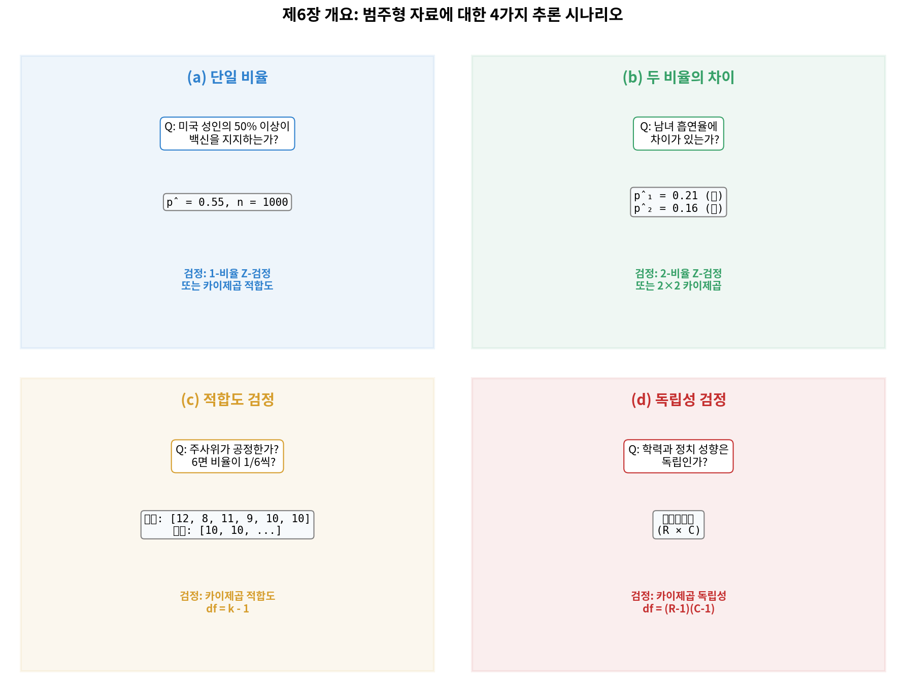

| 시나리오 | 자료 구조 | 핵심 질문 | 검정 방법 | 절 |
|:---|:---|:---|:---|:---:|
| (a) 단일 비율 | 1개 그룹의 성공/실패 | 모집단비율 p가 특정 값과 같은가? | 1-비율 Z-검정 | §6.1 |
| (b) 두 비율의 차이 | 2개 그룹의 성공/실패 | 두 모집단비율 p₁, p₂가 같은가? | 2-비율 Z-검정 | §6.2 |
| (c) 적합도 검정 | 한 변수의 k개 범주 빈도 | 관측 빈도가 가정된 분포와 일치하는가? | 카이제곱 적합도 | §6.3 |
| (d) 독립성 검정 | 두 범주형 변수의 분할표 | 두 변수가 독립인가? | 카이제곱 독립성 | §6.4 |

이 네 시나리오는 모두 5장에서 배운 **가설검정 4단계 절차**를 공통으로 따른다. 도구(분포)가 정규분포에서 카이제곱분포로 바뀔 뿐, 사고의 흐름은 완전히 동일하다.

#### 새로운 시각: "어떤 검정을 쓸지" 결정나무

학생들이 6장에서 가장 자주 막히는 지점은 "주어진 문제에서 어떤 검정을 써야 하는가"이다. 다음 결정나무는 문제 해결의 첫 출발점이다.

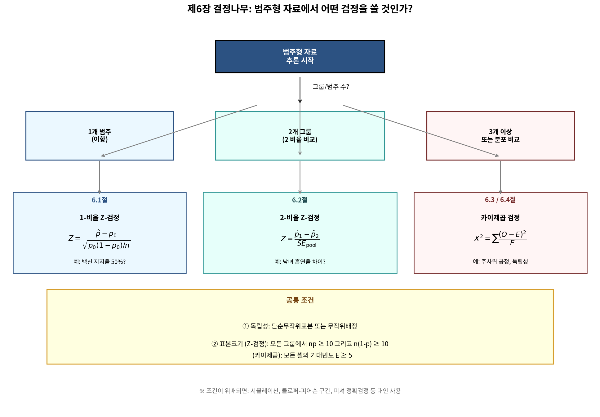

**판단 순서**:
1. 비교하려는 그룹/범주의 **개수**를 센다.
2. 1개라면 §6.1, 2개라면 §6.2 또는 2×2 카이제곱, 3개 이상이면 카이제곱 검정으로 간다.
3. 변수가 **두 개**이고 그 관계를 묻고 있다면 §6.4 독립성 검정이다.
4. 한 변수의 빈도가 가정된 분포(균등, 기하, 멘델의 유전법칙 등)와 맞는지 묻는다면 §6.3 적합도 검정이다.

---

### 6.0.2 가설검정 4단계 (PCCC 체크리스트)

5장에서 도입한 가설검정 4단계는 6장의 모든 검정에서 동일하게 적용된다. 본 장에서는 이 흐름을 PCCC(**P**repare-**C**heck-**C**alculate-**C**onclude)로 부르고 매 예제에서 명시적으로 적용한다.

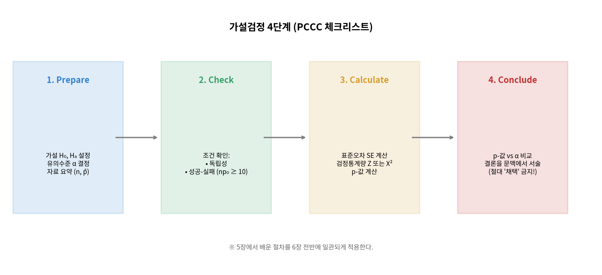

> **PCCC 4단계**
>
> **1단계 - 준비**(Prepare): 모수 식별, 가설 H₀와 Hₐ 설정, 유의수준 α 결정, 자료 요약 (n, p̂, 분할표).
>
> **2단계 - 확인**(Check): 검정의 가정(독립성, 표본크기 조건)을 검증한다. 가정이 위배되면 다른 방법(시뮬레이션, 피셔 정확검정 등)을 고려한다.
>
> **3단계 - 계산**(Calculate): 표준오차 SE 또는 기대빈도 E를 계산하고, 검정통계량 (Z 또는 X²)를 구한 뒤 p-값을 산출한다.
>
> **4단계 - 결론**(Conclude): p-값과 α를 비교하여 H₀ 기각 여부를 결정하고, 문제의 **맥락**에서 결론을 서술한다. "채택"이라는 표현은 절대 쓰지 않는다.

#### 새로운 시각: "채택"과 "기각 못함"의 차이를 다시 강조

5장 §5.0에서 강조한 내용을 6장에서도 반복한다. 통계학에서는 다음 두 표현을 엄격히 구분한다.

- **올바른 표현**: "H₀를 기각할 충분한 증거가 없다" / "자료가 H₀와 일관된다"
- **잘못된 표현**: "H₀를 채택한다" / "H₀가 참임이 증명되었다"

법정 비유로 이해하면 쉽다. 무죄 추정(H₀: 무죄)에서 시작한 재판이 "유죄 입증 실패"로 끝나도, 이는 **무죄임이 증명된 것이 아니라 유죄임을 입증하지 못했을 뿐**이다. 마찬가지로 p-값이 α보다 크다고 해서 H₀가 참이라고 결론지을 수 없다. 단지 자료가 H₀를 강하게 부인하지 못한다는 것뿐이다.

---

### 6.0.3 5장 핵심 개념의 6장 연결

5장 §5.0에서 다룬 다음 개념들은 6장 전반에 걸쳐 그대로 사용된다. 본 절에서 핵심만 다시 정리한다.

#### (1) p-값(p-value)

> **p-값의 정의** (§5.0.5에서 다룬 내용 재확인)
>
> **p-값**은 *귀무가설 H₀가 참이라는 가정 하에서*, 관측된 자료만큼 또는 그보다 더 극단적인 자료를 얻을 확률이다.
>
> - p-값 < α → H₀를 기각한다.
> - p-값 ≥ α → H₀를 기각할 충분한 증거가 없다.

6장의 모든 검정에서 결론의 핵심 지표는 p-값이다. 다만 검정 종류에 따라 p-값을 계산하는 분포가 정규분포(Z-검정)에서 카이제곱분포로 달라진다.

#### (2) 유의수준 α (significance level)

> **유의수준 α** (§5.0.6 재확인)
>
> α는 **제1종 오류**(H₀가 참인데 기각하는 오류)를 범할 최대 허용 확률이다. 가장 흔한 선택은 α = 0.05이지만, 상황에 따라 0.01(더 보수적) 또는 0.10(더 관대)을 쓰기도 한다.

본 장 §6.1.5에서 표본크기 산정 시 α를 어떻게 활용하는지 구체적으로 다룬다.

#### (3) 신뢰수준과 신뢰구간 (confidence level & interval)

> **신뢰구간의 해석** (§5.0.7 재확인)
>
> "95% 신뢰구간"의 95%는 **방법론**에 대한 신뢰도이지, 특정 구간이 모수를 포함할 확률이 아니다. 같은 절차로 100개의 표본에서 신뢰구간을 만들면 그 중 약 95개가 모수를 포함한다는 의미이다.
>
> 신뢰구간과 가설검정은 다음과 같이 대응한다:
> - 95% CI가 귀무값을 포함하지 않음 ⇔ 양측 α=0.05 검정에서 H₀ 기각

6장의 §6.1.2(단일 비율 CI), §6.2.2(두 비율 차이의 CI)에서 이 원리를 반복 적용한다.

#### (4) 단측 vs 양측 검정

> **단측 vs 양측** (§5.0.4 재확인)
>
> - **양측검정** (Hₐ: p ≠ p₀): 차이의 방향을 미리 정하지 않는다. **사전 정보가 없을 때의 기본**.
> - **단측검정** (Hₐ: p > p₀ 또는 p < p₀): 차이의 방향이 자료 수집 **이전**에 명확히 결정되어 있을 때만 사용한다.

**주의**: 자료를 본 뒤 "관측값이 더 크니 단측 검정을 쓰자"는 식의 결정은 통계적 추론을 훼손한다. 단측검정은 반드시 자료 수집 전에 정해져야 한다.

#### (5) 제1종·제2종 오류와 검정력

> **오류와 검정력** (§5.0.8, §5.0.9 재확인)
>
> - **제1종 오류** (Type I error): H₀가 참인데 기각. 발생 확률 = α.
> - **제2종 오류** (Type II error): H₀가 거짓인데 기각하지 못함. 발생 확률 = β.
> - **검정력** (power) = 1 - β: H₀가 거짓일 때 올바르게 기각할 확률.
>
> 표본크기를 늘리면 β가 줄어 검정력이 높아진다.

본 장 §6.1.5의 표본크기 산정 논의는 본질적으로 "충분한 검정력을 확보하기 위해 n을 얼마로 잡을 것인가"의 문제이다.

#### (6) 통계적 유의성과 실질적 유의성

> **통계적 vs 실질적 유의성** (§5.0.10 재확인)
>
> "p < 0.05" 자체는 효과가 **통계적으로 0이 아님**을 의미할 뿐, 그 효과의 **크기**가 실생활에서 의미 있는지는 별개의 문제이다. 표본크기가 매우 크면 실질적으로 무시할 만한 차이도 통계적으로 유의하게 잡힌다.
>
> 따라서 결론을 내릴 때는 항상 **점추정값**과 **신뢰구간**을 함께 보고하여 효과의 크기를 평가한다.

---

### 6.0.4 신뢰구간과 가설검정에서 SE가 달라지는 이유

학생들이 자주 혼동하는 핵심 포인트를 별도로 정리한다. 6장에서 **신뢰구간과 가설검정에서 표준오차(SE)가 다른 공식을 사용**한다는 것이다.

#### 단일 비율의 경우

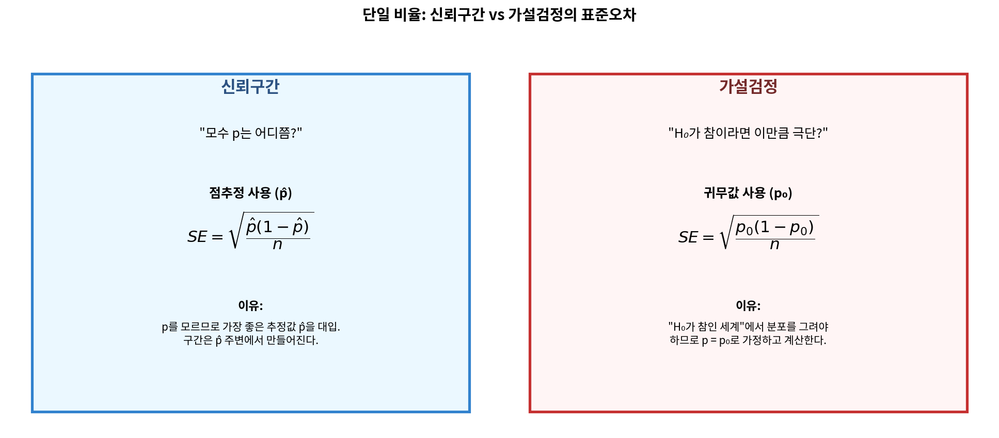

| | 신뢰구간 | 가설검정 |
|:---|:---:|:---:|
| 사용하는 비율 | p̂ (표본비율) | p₀ (귀무값) |
| SE 공식 | $\sqrt{\hat{p}(1-\hat{p})/n}$ | $\sqrt{p_0(1-p_0)/n}$ |
| 성공-실패 조건 확인 | $n\hat{p} \geq 10$, $n(1-\hat{p}) \geq 10$ | $np_0 \geq 10$, $n(1-p_0) \geq 10$ |

**왜 다른가?**
- **신뢰구간**은 "모수 p가 어디쯤 있을까"를 묻는다. p를 모르므로 **가장 좋은 추정값인 p̂을 대입**한다.
- **가설검정**은 "**H₀가 참이라면** 이 자료가 얼마나 극단적인가"를 묻는다. H₀의 세계에서 분석하므로 **p = p₀로 가정**하고 계산한다.

#### 두 비율의 차이의 경우

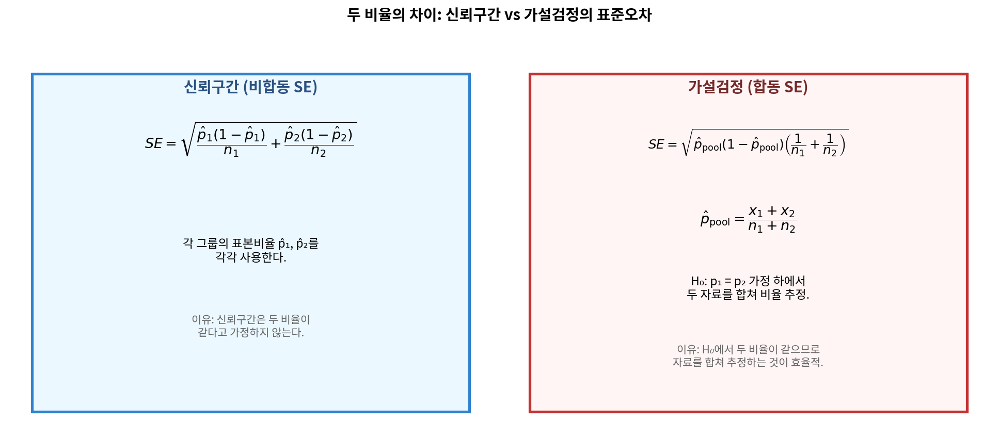

| | 신뢰구간 (비합동) | 가설검정 (합동) |
|:---|:---:|:---:|
| 사용하는 비율 | p̂₁, p̂₂ 각각 | $\hat{p}_{\mathrm{pool}} = (x_1+x_2)/(n_1+n_2)$ |
| SE 공식 | $\sqrt{\hat{p}_1(1-\hat{p}_1)/n_1 + \hat{p}_2(1-\hat{p}_2)/n_2}$ | $\sqrt{\hat{p}_{\mathrm{pool}}(1-\hat{p}_{\mathrm{pool}})(1/n_1+1/n_2)}$ |

**왜 합동 비율을 쓰는가?** 가설검정의 귀무가설 H₀: p₁ = p₂에서는 **두 모집단의 참 비율이 동일하다고 가정**한다. 이 가정 아래에서는 두 표본을 합쳐서 비율을 추정하는 것이 통계적으로 더 효율적이다. 반면 신뢰구간은 두 비율이 같다고 가정하지 않으므로 각 그룹의 p̂을 따로 사용한다.

---

### 6.0.5 카이제곱 분포의 직관 (§6.3 이전 필독)

§6.3에서 처음으로 등장하는 **카이제곱 분포**(chi-square distribution, X² distribution)는 학생들이 자주 어려워하는 개념이다. §6.3에서 본격적인 계산을 시작하기 전에 카이제곱 분포 자체의 직관을 충분히 다진다.

#### (1) 카이제곱 분포는 어떻게 생겼는가

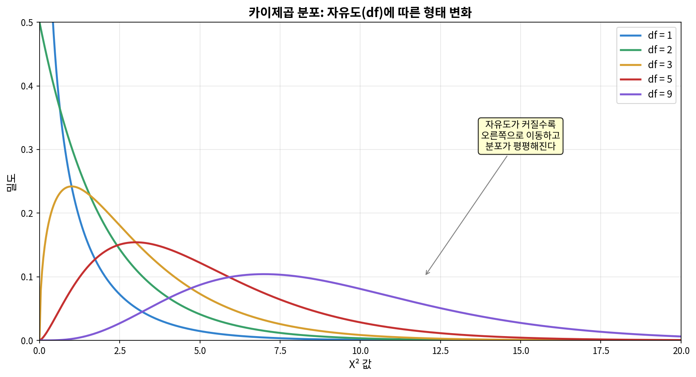

**핵심 성질**:
1. **항상 0 이상의 값만 갖는다**. 정규분포처럼 음수 영역이 없다.
2. **오른쪽으로 치우친(skewed) 비대칭 분포**이다.
3. **자유도(df)**가 커질수록 평균이 오른쪽으로 이동하고 분포가 평평해진다.
4. df가 매우 크면 정규분포에 가까워진다.

#### (2) 카이제곱 분포는 어디서 왔는가

> **카이제곱 분포의 기원**
>
> Z가 표준정규분포 N(0,1)을 따르면, Z²의 분포가 바로 **자유도 1인 카이제곱 분포**이다. 즉, $X^2_{(1)} = Z^2$이다.
>
> 더 일반적으로, $Z_1, Z_2, \ldots, Z_k$가 독립이고 모두 표준정규분포를 따른다면:
> $$Z_1^2 + Z_2^2 + \cdots + Z_k^2 \sim X^2_{(k)}$$
> 즉, 카이제곱 분포는 **표준정규 변수들의 제곱의 합의 분포**이다.

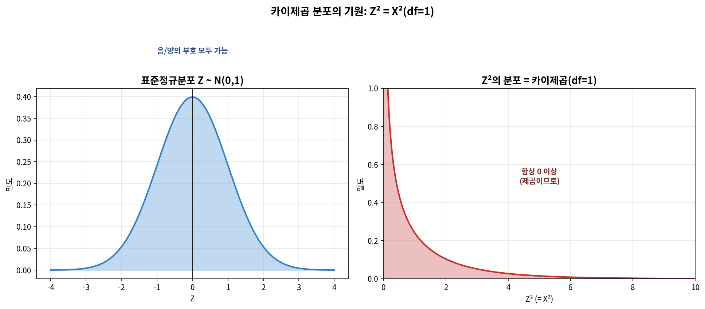

이 사실로부터 다음이 즉시 따라온다:
- **음수가 없는 이유**: 제곱은 항상 0 이상이므로.
- **오른쪽 치우침의 이유**: 0 근처는 흔하지만 큰 값은 드물다.
- **자유도가 곧 "더해진 제곱 항의 개수"**인 이유: 제곱들의 합이므로.

#### (3) 카이제곱 검정통계량의 직관

§6.3과 §6.4에서 등장하는 카이제곱 검정통계량은 다음과 같은 형태이다:

$$X^2 = \sum_{\text{모든 셀}} \frac{(O - E)^2}{E}$$

여기서 O는 **관측 빈도**(observed frequency), E는 **기대 빈도**(expected frequency, 즉 H₀가 참일 때 예상되는 빈도)이다.

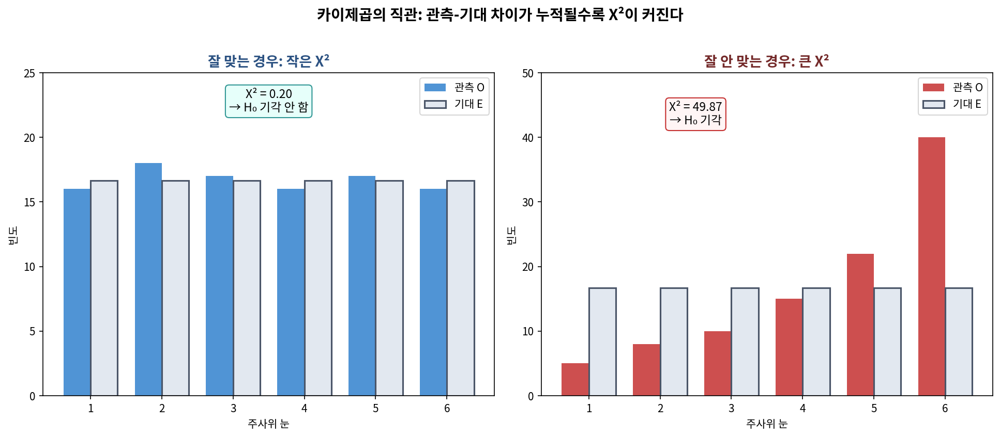

**해석**:
- 각 셀에서 O와 E의 차이를 제곱하고, E로 나누어 표준화한다.
- 모든 셀의 기여도를 더한다.
- 자료가 H₀와 잘 맞으면 모든 셀에서 O ≈ E이므로 X²이 작다.
- 자료가 H₀와 잘 맞지 않으면 (O-E)² 항이 커져서 X²이 크다.

#### (4) 카이제곱 검정은 항상 단측(오른쪽) 검정

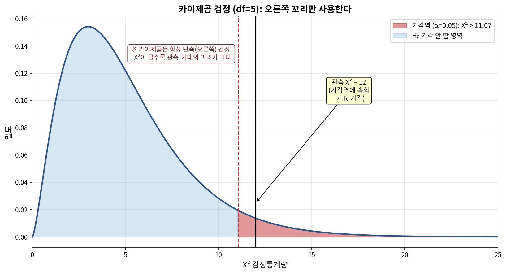

> **카이제곱 검정의 결정 규칙**
>
> X² 값이 클수록 자료가 H₀와 잘 안 맞는다는 의미이므로, **항상 분포의 오른쪽 꼬리 면적만 p-값으로 사용**한다. 이는 5장의 Z-검정에서 양측 또는 단측을 선택하던 것과 다르다.
>
> - 작은 X² → 자료가 H₀와 일관됨 → 큰 p-값 → H₀ 기각 못함
> - 큰 X² → 자료가 H₀와 불일치 → 작은 p-값 → H₀ 기각

#### 새로운 시각: 카이제곱 검정에 "양측/단측" 구분이 없는 이유

5장에서는 "양측검정 vs 단측검정"을 신중히 구분해야 했다. 하지만 카이제곱 검정에서는 이 구분이 무의미하다. 왜일까?

이유는 X²의 **제곱 구조** 때문이다. (O - E)²은 차이의 부호 정보를 모두 잃어버린다. 즉, 관측이 기대보다 크든 작든 X²에 똑같이 기여한다. 따라서 X²이 크다는 것은 "어떤 방향이든 차이가 있다"는 의미이며, 이는 본질적으로 양측검정과 같다. 단지 검정통계량의 분포 자체가 한쪽으로 치우쳐 있어 형식상 오른쪽 꼬리만 쓰는 것일 뿐, 의미는 양측검정과 동일하다.

이 직관은 **2×2 분할표의 경우 카이제곱 검정과 2-비율 양측 Z-검정이 정확히 같은 p-값을 준다**는 사실로 확인된다. 실제로 $X^2 = Z^2$ 관계가 성립한다.

---

### 6.0.6 본 장의 학습 순서

지금까지 정리한 개념들을 바탕으로, 본 장은 다음 순서로 진행된다.

1. **§6.1 단일 비율**: 5장에서 배운 1-비율 추론을 복습하고, 표본크기 산정을 추가로 다룬다.
2. **§6.2 두 비율의 차이**: 정규분포 기반 추론을 두 그룹 비교로 확장한다. 합동/비합동 SE의 차이를 명확히 익힌다.
3. **§6.3 카이제곱 적합도 검정**: 한 변수의 빈도 분포가 가정된 분포(예: 균등분포, 멘델 비율)와 맞는지 검정한다.
4. **§6.4 이원분할표 독립성 검정**: 두 범주형 변수의 독립 여부를 검정한다.

각 절에서 5장의 개념이 어떻게 적용되는지를 명시적으로 표시하므로, 5장 §5.0과 6장 §6.0을 자유롭게 오가며 학습하기를 권한다.

---
## 6.1 단일 비율에 대한 추론

본 절은 5장에서 다룬 단일 비율 추론을 복습하면서, 6장의 다른 절들로 가는 디딤돌 역할을 한다. 신뢰구간, 가설검정, 표본크기 산정 세 가지를 차례로 다룬다.

> **5장 연결**: 본 절의 모든 내용은 §5.1∼§5.3과 동일한 원리이다. 본 절에서는 자료 수집 단계의 **표본크기 결정**(§6.1.5)을 새로 추가한다.

### 6.1.1 표본비율이 근사적으로 정규분포를 따르는 조건

표본 관측값이 독립이고 표본크기가 충분히 크면, 표본비율 p̂은 정규분포를 사용하여 모델링할 수 있다.

> **p̂의 표본추출 분포**
>
> 참 모집단비율 p, 표본크기 n인 단순무작위표본에서 표본비율 p̂은 다음 조건이 충족될 때 근사적으로 정규분포를 따른다:
>
> 1. **독립성**: 표본 관측값이 독립이다 (예: 단순무작위표본).
> 2. **성공-실패 조건**: $np \geq 10$이고 $n(1-p) \geq 10$이다.
>
> 이때 p̂의 표본추출 분포는 평균 p, 표준오차 $SE = \sqrt{p(1-p)/n}$인 근사 정규분포이다.

실제 분석에서는 p를 모르므로, 신뢰구간이라면 p̂을, 가설검정이라면 귀무값 p₀를 대입하여 SE를 계산한다 (§6.0.4 참고).

#### 새로운 시각: 성공-실패 조건의 직관

성공-실패 조건 ($np \geq 10$ 그리고 $n(1-p) \geq 10$)은 왜 필요한가? 이는 이항분포(이산)가 정규분포(연속)로 충분히 근사되는 시점을 보장하는 **경험 법칙**이다.

- n이 작거나 p가 극단(0 또는 1에 가까움)이면 이항분포가 비대칭으로 치우친다.
- 예: n=20, p=0.05일 때 np=1이므로 조건 위배. 분포가 오른쪽으로 심하게 치우치고 정규근사가 실패한다.

이 "10의 규칙"은 드 무아브르(de Moivre, 1733)의 정규근사 발견 이후 20세기 통계 실무에서 경험적으로 확립되었다.

---

### 6.1.2 비율에 대한 신뢰구간

> **5장 연결**: §5.2와 동일한 절차. PCCC 4단계로 정리하면 다음과 같다.

#### 예제 6.1: 페이데이 대출 규제 지지율

**문제**: 826명의 페이데이 대출 차입자 단순무작위표본 중 70%가 새로운 규제를 지지했다. 이 표본비율을 정규분포로 모델링하는 것이 타당한가?

**풀이** (PCCC의 **C - 확인** 단계):

- **독립성**: 단순무작위표본이므로 충족.
- **성공-실패 조건** (신뢰구간이므로 p̂ 사용):
  - $n\hat{p} = 826 \times 0.70 = 578 \geq 10$ ✓
  - $n(1-\hat{p}) = 826 \times 0.30 = 248 \geq 10$ ✓

따라서 정규분포로 모델링할 수 있다.

```python
import numpy as np

n = 826
p_hat = 0.70

# 성공-실패 조건 확인
print("=== 예제 6.1: 정규성 조건 확인 ===")
print(f"np̂   = {n * p_hat:.0f}  ≥ 10? {n * p_hat >= 10}")
print(f"n(1-p̂) = {n * (1 - p_hat):.0f}  ≥ 10? {n * (1 - p_hat) >= 10}")
```

**출력**:
```
=== 예제 6.1: 정규성 조건 확인 ===
np̂   = 578  ≥ 10? True
n(1-p̂) = 248  ≥ 10? True
```

---

#### Guided Practice 6.2: 표준오차 계산

**문제**: 예제 6.1의 자료에서 p̂의 표준오차를 추정하라.

**풀이** (PCCC의 **계산**):

신뢰구간이므로 SE 공식에 p̂을 대입한다 (§6.0.4 참고):

$$SE = \sqrt{\frac{\hat{p}(1-\hat{p})}{n}} = \sqrt{\frac{0.70 \times 0.30}{826}} = \sqrt{\frac{0.21}{826}} = 0.0160$$

```python
import numpy as np

n = 826
p_hat = 0.70
se = np.sqrt(p_hat * (1 - p_hat) / n)
print(f"SE = √(0.70 × 0.30 / 826) = {se:.4f}")
```

**출력**:
```
SE = √(0.70 × 0.30 / 826) = 0.0160
```

---

#### 예제 6.3: 95% 신뢰구간 구성

**문제**: 페이데이 대출 규제 지지율 p에 대한 95% 신뢰구간을 구성하라.

**풀이**:

PCCC의 4단계를 모두 따른다.

- **준비**: 모수 p, 점추정값 $\hat{p} = 0.70$, $n = 826$, 신뢰수준 95%.
- **확인**: 예제 6.1에서 조건 충족 확인.
- **계산**: $SE = 0.0160$ (GP 6.2). 95% CI에 대한 $z^* = 1.96$.
  $$\hat{p} \pm z^* \cdot SE = 0.70 \pm 1.96 \times 0.0160 = (0.669, 0.731)$$
- **결론**: 페이데이 대출 차입자 중 규제를 지지하는 모집단비율 p가 **66.9%∼73.1%** 사이에 있다고 95% 신뢰한다.

```python
import numpy as np
from scipy import stats

n = 826
p_hat = 0.70
conf = 0.95

se = np.sqrt(p_hat * (1 - p_hat) / n)
z_star = stats.norm.ppf((1 + conf) / 2)
me = z_star * se
lower, upper = p_hat - me, p_hat + me

print(f"=== 95% 신뢰구간 ===")
print(f"p̂      = {p_hat}")
print(f"SE      = {se:.4f}")
print(f"z*      = {z_star:.3f}")
print(f"오차한계 ME = {me:.4f}")
print(f"95% CI  = ({lower:.3f}, {upper:.3f})")
```

**출력**:
```
=== 95% 신뢰구간 ===
p̂      = 0.7
SE      = 0.0160
z*      = 1.960
오차한계 ME = 0.0313
95% CI  = (0.669, 0.731)
```

---

### 6.1.3 비율에 대한 가설검정

> **5장 연결**: §5.3의 검정 절차를 다시 적용한다. 신뢰구간과 달리 SE 계산에 **귀무값 p₀**를 사용한다 (§6.0.4).

#### Guided Practice 6.4: 가설 설정

**문제**: 차입자들이 신용조회·부채상환 평가 규제에 다수가 찬성 또는 반대하는지 평가하기 위한 가설을 설정하라.

**풀이**:

다수 찬성/반대 여부를 묻고 있으므로 50%를 귀무값으로 잡고 **양측검정**으로 시작한다 (§6.0.3의 단측 vs 양측 원칙):

- **H₀**: $p = 0.50$ (차입자의 정확히 절반이 지지 — 즉, 다수도 소수도 아님)
- **Hₐ**: $p \neq 0.50$ (다수 또는 소수가 지지)

여기서 p는 신용조회·부채상환 평가 규제를 지지하는 모든 페이데이 대출 차입자의 비율이다.

---

#### Guided Practice 6.5: 가설검정의 조건 확인

**문제**: 826명 중 51%가 규제를 지지했다. p̂ = 0.51을 가설검정에 사용하기 위해 정규분포로 모델링할 수 있는가?

**풀이**:

가설검정이므로 성공-실패 조건은 **귀무값 p₀ = 0.5**로 확인한다 (§6.0.4):

- $n p_0 = 826 \times 0.50 = 413 \geq 10$ ✓
- $n(1 - p_0) = 826 \times 0.50 = 413 \geq 10$ ✓

두 조건이 모두 충족되므로 p̂을 정규분포로 모델링할 수 있다.

---

#### 예제 6.6: 가설검정 완료

**문제**: 위 가설과 자료로 페이데이 대출 차입자 다수가 규제를 지지한다는 설득력 있는 증거가 있는지 평가하라 (α = 0.05).

**풀이** (PCCC 완전 적용):

- **준비**: H₀: p = 0.5, Hₐ: p ≠ 0.5, α = 0.05, p̂ = 0.51, n = 826.
- **확인**: GP 6.5에서 확인.
- **계산**:
  - SE (귀무값 사용): $\sqrt{0.5 \times 0.5 / 826} = 0.0174$
  - 검정통계량: $Z = (0.51 - 0.50)/0.0174 = 0.57$
  - 양측 p-값: $2 \times P(Z > 0.57) = 0.5687$ (약 0.56)
- **결론**: p-값(0.56) > α(0.05)이므로 H₀를 **기각하지 못한다**. 페이데이 대출 차입자의 다수가 신용조회·부채상환 평가 규제에 찬성 또는 반대한다는 설득력 있는 증거가 자료에서 발견되지 않는다.

```python
import numpy as np
from scipy import stats

n = 826
p_hat = 0.51
p_0 = 0.50
alpha = 0.05

se = np.sqrt(p_0 * (1 - p_0) / n)
z = (p_hat - p_0) / se
p_value = 2 * (1 - stats.norm.cdf(abs(z)))

print(f"=== 예제 6.6: 단일 비율 양측 검정 ===")
print(f"SE (귀무값 사용) = {se:.4f}")
print(f"Z = {z:.2f}")
print(f"양측 p-값       = {p_value:.4f}")
print(f"결론: p-값({p_value:.4f}) {'<' if p_value < alpha else '≥'} α({alpha})  →  H₀를 {'기각' if p_value < alpha else '기각하지 못함'}")
```

**출력**:
```
=== 예제 6.6: 단일 비율 양측 검정 ===
SE (귀무값 사용) = 0.0174
Z = 0.57
양측 p-값       = 0.5687
결론: p-값(0.5687) ≥ α(0.05)  →  H₀를 기각하지 못함
```

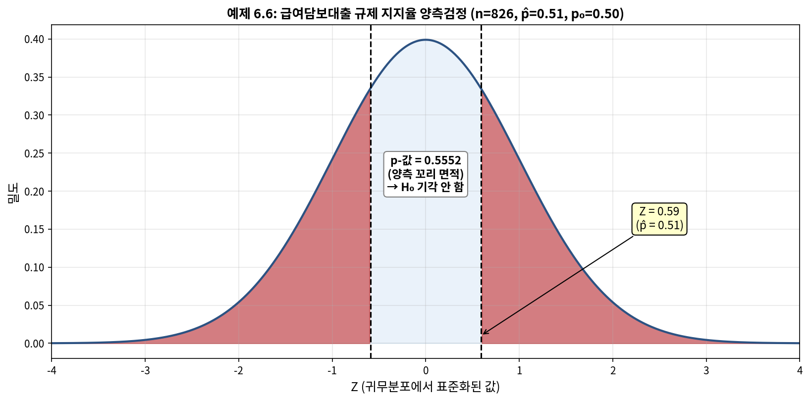

#### 새로운 시각: "기각 못함"이 "지지 없음"과 같지 않은 이유

위 결론에서 우리는 "다수 찬성/반대의 증거가 없다"고만 말했지, "다수가 50%이다" 또는 "차이가 없다"고 말하지 않았다. 이는 §6.0.2에서 강조한 원칙의 적용이다.

만약 표본크기 n이 10,000명이고 p̂ = 0.51이었다면, 같은 1% 차이라도 SE가 작아져서 Z가 커지고 p-값이 작아질 것이다. 실제로 계산하면 Z = 2.0, p-값 ≈ 0.046이 되어 α = 0.05 기준으로는 기각된다. **같은 자료의 비율이지만 표본크기에 따라 결론이 달라지는 것**이다.

이는 §6.0.3 (6)의 "통계적 유의성 vs 실질적 유의성"과 직결된다. 본 예제에서 차이 1%가 실질적으로 의미가 있는지는 별도의 정책적·실무적 판단이다.

---

### 6.1.4 조건이 충족되지 않을 때

성공-실패 조건이 위배되거나 독립성에 의심이 있을 때는 정규근사를 쓸 수 없다. 대안은 다음과 같다.

**가설검정의 경우**: 귀무값 p₀를 사용한 **시뮬레이션**으로 귀무분포를 직접 만든다 (2.3절의 말라리아 사례 연구와 유사).

**신뢰구간의 경우**: **클로퍼-피어슨 구간**(Clopper-Pearson interval)을 사용한다. 본서 범위를 벗어나지만, scipy 등에서 쉽게 계산할 수 있다.

```python
# 클로퍼-피어슨 구간 예시 (성공-실패 조건 위배 시)
from scipy import stats

x = 2   # 성공 횟수
n = 20  # 시도 횟수
conf = 0.95

lower = stats.beta.ppf((1 - conf)/2, x, n - x + 1) if x > 0 else 0
upper = stats.beta.ppf(1 - (1 - conf)/2, x + 1, n - x) if x < n else 1

print(f"x={x}, n={n}, p̂={x/n:.3f}")
print(f"클로퍼-피어슨 95% CI: ({lower:.3f}, {upper:.3f})")
```

독립성 위배는 더 미묘하다. 표본추출 설계의 결함(예: 동일 가구에서 여러 명 표본, 군집표본 등)일 수 있으므로 **자료가 어떻게 수집되었는지**를 반드시 검토해야 한다.

---

### 6.1.5 비율을 추정할 때 표본크기 결정

자료 수집 단계에서, 신뢰구간의 **오차한계**(margin of error, ME)가 충분히 작도록 표본크기 n을 미리 정해야 한다. 이 절차는 본질적으로 §5.0.9에서 다룬 검정력 논의와 연결된다 (더 큰 n → 더 작은 SE → 더 좁은 CI → 더 높은 검정력).

> **표본크기 공식 (비율 추정)**
>
> 신뢰수준 (1-α)에서 오차한계를 ME 이하로 만들려면:
>
> $$n \geq \frac{p(1-p) \cdot (z^*)^2}{ME^2}$$
>
> - p에 대한 사전 정보가 있으면 그 값을 대입.
> - p에 대한 사전 정보가 없으면 **p = 0.5**를 대입 (가장 보수적, 즉 가장 큰 n).

p에 대한 사전 정보가 없을 때 p = 0.5를 쓰는 이유는, p(1-p)가 p = 0.5에서 최댓값 0.25를 갖기 때문이다.

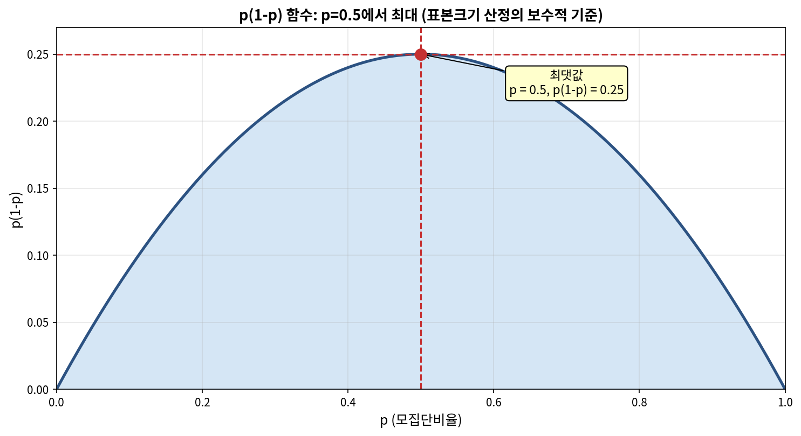

#### 예제 6.7: 표본크기 산정

**문제**: 대학신문이 등록금 인상 지지율 설문을 95% 신뢰수준, ME < 0.04로 실시하려 한다. 표본크기는 얼마여야 하는가?

**풀이**:

p에 대한 사전 정보가 없으므로 p = 0.5를 대입:

$$1.96 \cdot \sqrt{\frac{0.5 \times 0.5}{n}} < 0.04$$

n에 대해 풀면:

$$n > \frac{0.5 \times 0.5 \times 1.96^2}{0.04^2} = \frac{0.25 \times 3.8416}{0.0016} = 600.25$$

따라서 **최소 601명**을 표본으로 모집해야 한다.

```python
import numpy as np
from scipy import stats

me_target = 0.04
conf = 0.95
p_assume = 0.5  # 보수적 가정

z_star = stats.norm.ppf((1 + conf) / 2)
n = p_assume * (1 - p_assume) * (z_star / me_target) ** 2

print(f"=== 예제 6.7: 표본크기 산정 ===")
print(f"z* = {z_star:.3f}")
print(f"계산된 n   = {n:.2f}")
print(f"필요한 최소 n = {int(np.ceil(n))}")
```

**출력**:
```
=== 예제 6.7: 표본크기 산정 ===
z* = 1.960
계산된 n   = 600.25
필요한 최소 n = 601
```

---

#### Guided Practice 6.8: 사전 정보가 있을 때

**문제**: 시범 연구에서 p ≈ 0.35라는 정보가 있다면 ME < 0.04를 더 작은 n으로 달성할 수 있는가?

**풀이**:

p(1-p) = 0.35 × 0.65 = 0.2275 < 0.25이므로 가능하다.

$$n > \frac{0.35 \times 0.65 \times 1.96^2}{0.04^2} = \frac{0.2275 \times 3.8416}{0.0016} \approx 546.2$$

따라서 **최소 547명**으로 충분하다.

```python
p = 0.35
n = p * (1 - p) * (1.96 / 0.04) ** 2
print(f"p = {p}일 때 필요한 n = {int(np.ceil(n))}")
```

**출력**:
```
p = 0.35일 때 필요한 n = 547
```

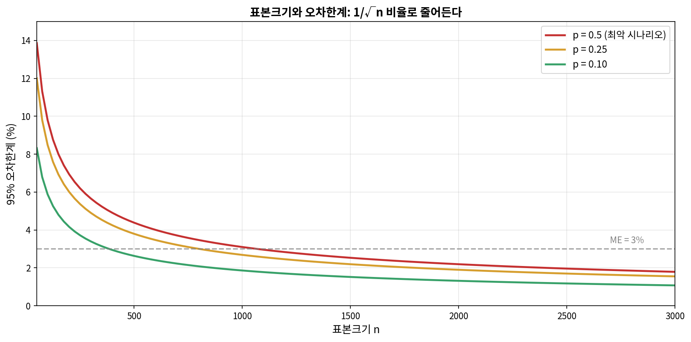

#### 새로운 시각: 표본크기 결정의 비대칭성

표본크기를 4배로 늘리면 SE는 √4 = 2배 작아지고 ME도 절반으로 줄어든다. 즉 **정밀도는 √n 비율로 증가**한다.

이는 의외로 큰 함의를 갖는다. 예를 들어 ME를 10%에서 1%로 줄이려면 표본크기를 100배 늘려야 한다. 따라서 매우 정밀한 추정을 요구하는 연구는 비용이 급격히 증가한다. 이 때문에 연구 설계 단계에서 "어느 정도의 ME가 *실질적으로* 충분한가"를 미리 정하는 것이 중요하다.

---

## 6.2 두 비율의 차이

본 절에서는 두 모집단의 비율 p₁과 p₂를 비교한다. 점추정값은 자연스럽게 $\hat{p}_1 - \hat{p}_2$이고, 추론의 큰 흐름은 단일 비율과 같다. 다만 표준오차 공식과 정규성 조건 확인 방법이 약간 달라진다.

> **5장 연결**: 본 절은 5장에서 다루지 않은 새로운 응용이지만, PCCC 4단계는 그대로 적용된다.

### 6.2.1 두 비율 차이의 표본추출 분포

> **$\hat{p}_1 - \hat{p}_2$가 정규분포를 따르는 조건**
>
> 1. **확장 독립성**: 자료가 두 그룹 **내에서** 그리고 두 그룹 **사이에서** 독립이다 (예: 두 독립표본, 무작위 실험).
> 2. **각 그룹에서 성공-실패 조건**: 두 그룹 모두에서 성공과 실패가 각각 10 이상 예상된다.
>
> 이 조건이 충족되면:
>
> $$SE_{\hat{p}_1 - \hat{p}_2} = \sqrt{\frac{p_1(1-p_1)}{n_1} + \frac{p_2(1-p_2)}{n_2}}$$

#### 새로운 시각: 차이의 분산은 왜 분산의 합인가

직관과 어긋날 수 있지만, 독립 확률변수 X, Y에 대해:

$$\mathrm{Var}(X - Y) = \mathrm{Var}(X) + \mathrm{Var}(Y)$$

부호가 더하기에서 빼기로 바뀌어도 분산은 더해진다. 이유는 분산이 분포의 **퍼짐 정도**를 잰 양수이기 때문이다. X에서 빼든 더하든 Y가 가져오는 불확실성은 그대로 더해진다.

따라서 $\hat{p}_1 - \hat{p}_2$의 표준오차는 두 표본비율의 분산을 더하고 제곱근을 취한 것이다.

---

### 6.2.2 두 비율 차이의 신뢰구간 (비합동 SE)

> **5장 연결**: 신뢰구간 공식의 일반 형태(점추정 ± z* × SE)는 동일하다. 신뢰구간에서는 두 그룹의 표본비율 $\hat{p}_1$, $\hat{p}_2$를 각각 SE 공식에 대입한다 (§6.0.4).

#### 예제 6.11: CPR 연구의 정규성 조건 확인

**문제**: 심정지 후 CPR을 받은 환자들이 혈전용해제(처치군) 또는 대조군에 무작위 배정되었다. 결과는 24시간 생존 여부였다.

| 그룹 | 생존 | 사망 | 합계 |
|:---|:---:|:---:|:---:|
| 대조군 | 11 | 39 | 50 |
| 처치군 | 14 | 26 | 40 |

두 표본비율의 차이를 정규분포로 모델링할 수 있는가?

**풀이**:

- **독립성**: 무작위 실험이므로 충족.
- **성공-실패 조건**: 각 그룹에서 성공과 실패가 모두 10 이상.
  - 대조군: 11 ≥ 10 ✓, 39 ≥ 10 ✓
  - 처치군: 14 ≥ 10 ✓, 26 ≥ 10 ✓

두 조건이 모두 충족되므로 정규분포로 모델링할 수 있다.

---

#### 예제 6.12: CPR 연구의 90% 신뢰구간

**문제**: 처치군과 대조군의 생존율 차이에 대한 90% 신뢰구간을 구성하라.

**풀이** (PCCC):

- **준비**: $\hat{p}_T = 14/40 = 0.35$, $\hat{p}_C = 11/50 = 0.22$, 신뢰수준 90%.
- **확인**: 예제 6.11에서 확인.
- **계산** (비합동 SE):
  - 점추정: $\hat{p}_T - \hat{p}_C = 0.35 - 0.22 = 0.13$
  - $SE = \sqrt{\dfrac{0.35 \times 0.65}{40} + \dfrac{0.22 \times 0.78}{50}} = \sqrt{0.005688 + 0.003432} = 0.0955$
  - 90% CI에서 $z^* = 1.645$
  - 90% CI: $0.13 \pm 1.645 \times 0.0955 = (-0.027, 0.287)$
- **결론**: 처치군과 대조군의 24시간 생존율 차이가 **-0.027 ∼ 0.287** 사이에 있다고 90% 신뢰한다. **이 구간이 0을 포함**하므로, 혈전용해제가 생존율에 영향을 미치지 않을 가능성도 자료와 일관된다.

```python
import numpy as np
from scipy import stats

n_t, x_t = 40, 14
n_c, x_c = 50, 11

p_t = x_t / n_t
p_c = x_c / n_c
diff = p_t - p_c

# 신뢰구간이므로 비합동 SE
se = np.sqrt(p_t*(1 - p_t)/n_t + p_c*(1 - p_c)/n_c)
z_star = stats.norm.ppf(0.95)  # 90% CI
me = z_star * se
lo, hi = diff - me, diff + me

print(f"=== 예제 6.12: CPR 연구 90% CI ===")
print(f"점추정 p̂_T - p̂_C = {diff:.3f}")
print(f"SE (비합동)        = {se:.4f}")
print(f"z*                = {z_star:.3f}")
print(f"90% CI            = ({lo:.3f}, {hi:.3f})")
print(f"CI가 0을 포함? {'예 → 차이 결론 불가' if lo <= 0 <= hi else '아니오 → 차이 있음'}")
```

**출력**:
```
=== 예제 6.12: CPR 연구 90% CI ===
점추정 p̂_T - p̂_C = 0.130
SE (비합동)        = 0.0955
z*                = 1.645
90% CI            = (-0.027, 0.287)
CI가 0을 포함? 예 → 차이 결론 불가
```

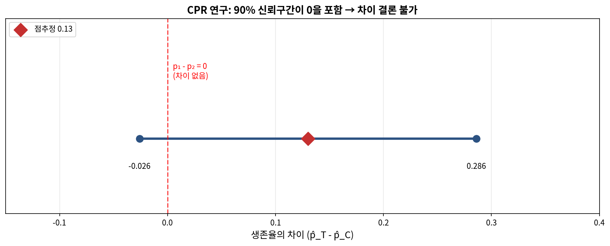

---

### 6.2.3 두 비율 차이의 가설검정 (합동 SE)

> **5장 연결**: 가설검정 절차는 §5.3과 동일하지만, SE 계산에 **합동 비율**을 사용한다 (§6.0.4). 이유는 귀무가설 H₀: p₁ = p₂ 하에서는 두 모집단 비율이 같다고 가정하므로, 두 표본을 합쳐서 비율을 추정하는 것이 통계적으로 더 효율적이기 때문이다.

> **합동 비율 (pooled proportion)**
>
> $$\hat{p}_{\mathrm{pool}} = \frac{x_1 + x_2}{n_1 + n_2}$$
>
> 가설검정의 표준오차:
>
> $$SE_{\mathrm{pool}} = \sqrt{\hat{p}_{\mathrm{pool}}(1 - \hat{p}_{\mathrm{pool}}) \left(\frac{1}{n_1} + \frac{1}{n_2}\right)}$$

#### 예제 6.14: 직장 승진율 검정

**문제**: 한 직장의 무작위표본에서 남성 21명 중 14명이 승진했고, 여성 24명 중 12명이 승진했다. α = 0.05에서 승진율 차이가 있는지 검정하라.

**풀이** (PCCC):

- **준비**:
  - H₀: $p_m = p_f$, Hₐ: $p_m \neq p_f$ (양측, 사전 방향 정보 없음).
  - α = 0.05.
  - $\hat{p}_m = 14/21 = 0.667$, $\hat{p}_f = 12/24 = 0.500$.
- **확인** (가설검정이므로 합동 비율로 성공-실패 점검):
  - $\hat{p}_{\mathrm{pool}} = (14+12)/(21+24) = 26/45 = 0.578$
  - 남성: $21 \times 0.578 = 12.1$ (성공), $21 \times 0.422 = 8.9$ (실패) — 실패 측이 약간 부족하지만 큰 위반은 아님.
  - 여성: $24 \times 0.578 = 13.9$, $24 \times 0.422 = 10.1$ ✓
  - 조건이 거의 충족된다고 보고 진행.
- **계산**:
  - 점추정: $\hat{p}_m - \hat{p}_f = 0.667 - 0.500 = 0.167$
  - 합동 SE: $\sqrt{0.578 \times 0.422 \times (1/21 + 1/24)} = 0.148$
  - $Z = 0.167 / 0.148 = 1.13$
  - 양측 p-값: $2 \times P(Z > 1.13) = 0.258$
- **결론**: p-값(0.258) > α(0.05)이므로 H₀를 **기각하지 못한다**. 남성과 여성의 승진율이 다르다는 설득력 있는 증거가 이 자료에서 발견되지 않는다.

```python
import numpy as np
from scipy import stats

x_m, n_m = 14, 21
x_f, n_f = 12, 24

p_m = x_m / n_m
p_f = x_f / n_f
diff = p_m - p_f

# 가설검정이므로 합동 SE
p_pool = (x_m + x_f) / (n_m + n_f)
se_pool = np.sqrt(p_pool * (1 - p_pool) * (1/n_m + 1/n_f))
z = diff / se_pool
p_value = 2 * (1 - stats.norm.cdf(abs(z)))

print(f"=== 예제 6.14: 두 비율 양측 검정 ===")
print(f"p̂_m = {p_m:.3f}, p̂_f = {p_f:.3f}")
print(f"점추정 차이 = {diff:.3f}")
print(f"합동 비율   = {p_pool:.3f}")
print(f"합동 SE     = {se_pool:.4f}")
print(f"Z = {z:.2f}")
print(f"양측 p-값  = {p_value:.3f}")
print(f"결론: p-값({p_value:.3f}) {'<' if p_value < 0.05 else '≥'} α(0.05) → H₀를 {'기각' if p_value < 0.05 else '기각하지 못함'}")
```

**출력**:
```
=== 예제 6.14: 두 비율 양측 검정 ===
p̂_m = 0.667, p̂_f = 0.500
점추정 차이 = 0.167
합동 비율   = 0.578
합동 SE     = 0.148
Z = 1.13
양측 p-값  = 0.258
결론: p-값(0.258) ≥ α(0.05) → H₀를 기각하지 못함
```

#### 새로운 시각: 합동 SE vs 비합동 SE를 잘못 쓰면?

가설검정에서 비합동 SE를 쓰거나, 신뢰구간에서 합동 SE를 쓰면 어떻게 될까? 답은 "**대부분의 경우 큰 차이는 없지만, 이론적으로 부정확**"이다.

- 가설검정에서 비합동 SE를 쓰면, H₀의 가정(p₁=p₂)을 무시하고 SE를 추정하는 셈이 된다. p-값이 약간 부정확해진다.
- 신뢰구간에서 합동 SE를 쓰면, 두 비율이 같다고 가정하므로 구간 자체의 해석이 모순된다.

표본크기가 충분히 크면 합동/비합동의 결과 차이는 매우 작지만, **방법론적 정확성**을 위해 각 상황에 맞는 SE를 쓰는 것이 원칙이다.

---

## 6.3 카이제곱 적합도 검정

> **5장 연결**: 새로운 검정 도구이지만 PCCC 4단계는 동일하다. 카이제곱 분포의 직관은 §6.0.5에서 충분히 다루었다.

본 절에서는 **한 변수의 빈도 분포가 가정된 분포와 일치하는지** 검정하는 카이제곱 적합도 검정(chi-square goodness-of-fit test)을 다룬다.

### 6.3.1 적합도 검정의 동기: 배심원 인종 구성

미국 어느 카운티의 인종 구성과 배심원 후보 풀의 인종 구성을 비교한다. 가설은 "배심원 풀이 인종 균형 분포에서 무작위로 뽑혔는가"이다.

이를 일반화하면: **관측된 빈도들이 어떤 이론적 분포와 잘 맞는가?** 이것이 적합도 검정의 핵심 질문이다.

### 6.3.2 카이제곱 검정통계량

> **카이제곱 적합도 검정통계량**
>
> k개 범주에서 관측 빈도 $O_1, O_2, \ldots, O_k$와 H₀에서 기대 빈도 $E_1, E_2, \ldots, E_k$를 비교한다:
>
> $$X^2 = \sum_{i=1}^{k} \frac{(O_i - E_i)^2}{E_i}$$
>
> H₀가 참이면 $X^2$은 근사적으로 **자유도 $df = k - 1$**인 카이제곱 분포를 따른다.

§6.0.5에서 다룬 직관 그대로, 관측-기대 차이가 큰 셀이 많을수록 $X^2$이 커지고, H₀가 잘 안 맞는다는 신호가 된다.

### 6.3.3 적합도 검정의 조건

> **카이제곱 검정의 조건**
>
> 1. **독립성**: 관측들이 독립이다 (예: 단순무작위표본).
> 2. **표본크기 조건**: **모든 셀의 기대빈도 $E_i \geq 5$**.

### 6.3.4 사례 연구: S&P500 일별 등락의 독립성

**문제**: S&P500 지수의 일별 상승 다음에 다시 상승할 때까지 걸리는 거래일 수를 기록했다. 거래일 등락이 독립이라면 이 대기 시간은 **기하분포**(geometric distribution)를 따라야 한다.

| 대기일 | 관측 O | 기대 E (기하분포) |
|:---:|:---:|:---:|
| 1일 | 717 | 743 |
| 2일 | 369 | 338 |
| 3일 | 155 | 154 |
| 4일 | 69 | 70 |
| 5일 | 28 | 32 |
| 6일 | 14 | 15 |
| 7일+ | 10 | 12 |

#### Guided Practice 6.34: 검정통계량 계산

$$X^2 = \frac{(717-743)^2}{743} + \frac{(369-338)^2}{338} + \frac{(155-154)^2}{154} + \frac{(69-70)^2}{70} + \frac{(28-32)^2}{32} + \frac{(14-15)^2}{15} + \frac{(10-12)^2}{12}$$

$$= 0.91 + 2.84 + 0.01 + 0.01 + 0.50 + 0.07 + 0.33 = 4.61$$

```python
import numpy as np
from scipy import stats

observed = np.array([717, 369, 155, 69, 28, 14, 10])
expected = np.array([743, 338, 154, 70, 32, 15, 12])

contributions = (observed - expected) ** 2 / expected
chi2 = contributions.sum()
df = len(observed) - 1
p_value = 1 - stats.chi2.cdf(chi2, df)

print(f"=== S&P500 적합도 검정 ===")
print(f"각 셀의 (O-E)²/E:")
for i, (o, e, c) in enumerate(zip(observed, expected, contributions), 1):
    print(f"  대기 {i}일: ({o}-{e})²/{e} = {c:.2f}")
print(f"\nX² = {chi2:.2f}")
print(f"df = {df}")
print(f"p-값 = {p_value:.4f}")
print(f"\n결론: p-값({p_value:.3f}) ≥ α(0.05) → 기하분포(거래일 독립)와 일관됨")
```

**출력**:
```
=== S&P500 적합도 검정 ===
각 셀의 (O-E)²/E:
  대기 1일: (717-743)²/743 = 0.91
  대기 2일: (369-338)²/338 = 2.84
  대기 3일: (155-154)²/154 = 0.01
  대기 4일: (69-70)²/70 = 0.01
  대기 5일: (28-32)²/32 = 0.50
  대기 6일: (14-15)²/15 = 0.07
  대기 7일: (10-12)²/12 = 0.33

X² = 4.67
df = 6
p-값 = 0.5867

결론: p-값(0.587) ≥ α(0.05) → 기하분포(거래일 독립)와 일관됨
```

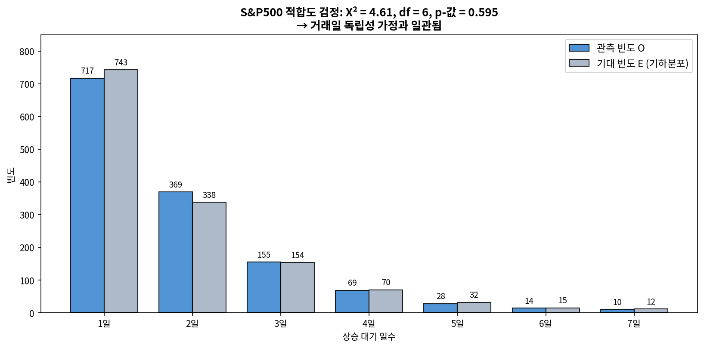

#### 예제 6.37: 결론의 해석 (다시 강조)

p-값이 크다고 해서 "거래일이 확실히 독립"이라고 결론짓는 것은 아니다. 단지 자료가 독립성 가정과 **일관된다**는 의미일 뿐이다 (§6.0.2 재참고). 이는 효율적 시장 가설과 부합하지만, "증명"이 아닌 "비반증"이다.

---

## 6.4 이원분할표에서의 독립성 검정

> **5장 연결**: 새로운 분야이지만 PCCC 4단계와 카이제곱 분포의 직관(§6.0.5)이 그대로 적용된다.

본 절은 **두 범주형 변수가 독립인지**를 검정한다. 자료 구조는 R행 × C열의 이원분할표이다.

### 6.4.1 기대 빈도 계산

이원분할표에서 두 변수가 독립이라면, 각 셀의 기대 빈도는 행 합계와 열 합계의 곱을 전체 합계로 나눈 값이다.

> **이원분할표의 기대 빈도**
>
> i행 j열 셀의 기대빈도:
>
> $$E_{ij} = \frac{(\text{i행 합계}) \times (\text{j열 합계})}{\text{전체 합계}}$$

### 6.4.2 사례 연구: iPod 결함 공개 실험

중고 iPod을 판매하는 사람들을 세 그룹에 무작위로 배정하고, 각 그룹이 받는 질문 형식만 달리하여 결함 공개율을 비교한다.

| 질문 형식 | 일반 | 긍정 가정 | 부정 가정 | 합계 |
|:---|:---:|:---:|:---:|:---:|
| 문제 공개 | 2 | 23 | 36 | 61 |
| 문제 숨김 | 71 | 50 | 37 | 158 |
| 합계 | 73 | 73 | 73 | 219 |

**전체 공개율**: $61/219 = 0.279$

귀무가설 H₀: 질문 형식과 공개 여부는 독립.

기대 빈도 (행 합계 × 열 합계 / 219):
- 공개 행: $61 \times 73 / 219 = 20.33$ (각 열)
- 숨김 행: $158 \times 73 / 219 = 52.67$ (각 열)

### 6.4.3 검정통계량과 자유도

> **이원분할표 카이제곱 검정**
>
> $$X^2 = \sum_{\text{모든 셀}} \frac{(O - E)^2}{E}$$
>
> 자유도: $df = (R - 1)(C - 1)$
>
> 여기서 R, C는 분할표의 행/열 수.

#### 예제 6.40: iPod 실험 검정

**풀이** (PCCC):

- **준비**: H₀: 질문 형식과 공개 여부 독립. Hₐ: 독립이 아니다. α = 0.05.
- **확인**: 모든 기대 빈도 ≥ 5 ✓, 무작위 실험으로 독립성 ✓.
- **계산**:
  - 각 셀 (O-E)²/E:
    - (2-20.33)²/20.33 = 16.53
    - (23-20.33)²/20.33 = 0.35
    - (36-20.33)²/20.33 = 12.06
    - (71-52.67)²/52.67 = 6.38
    - (50-52.67)²/52.67 = 0.14
    - (37-52.67)²/52.67 = 4.66
  - $X^2 = 40.13$
  - $df = (2-1)(3-1) = 2$
  - p-값 $\approx 2 \times 10^{-9}$ (매우 작음)
- **결론**: H₀를 **강하게 기각**. 질문 형식이 결함 공개 여부에 강한 영향을 미친다는 설득력 있는 증거가 있다.

```python
import numpy as np
from scipy import stats

# 관측 분할표
observed = np.array([[2, 23, 36],     # 공개
                     [71, 50, 37]])    # 숨김

chi2, p, dof, expected = stats.chi2_contingency(observed)

print(f"=== 예제 6.40: iPod 실험 카이제곱 검정 ===")
print(f"기대빈도:\n{expected}\n")
print(f"X²  = {chi2:.2f}")
print(f"df  = {dof}")
print(f"p-값 = {p:.2e}")
print(f"\n결론: p-값이 매우 작음 → H₀ 강하게 기각")
print(f"     질문 형식이 결함 공개율에 큰 영향")

# 각 그룹 공개율
print(f"\n그룹별 공개율:")
for name, col in zip(['일반', '긍정가정', '부정가정'], range(3)):
    rate = observed[0, col] / observed[:, col].sum() * 100
    print(f"  {name}: {rate:.1f}%")
```

**출력**:
```
=== 예제 6.40: iPod 실험 카이제곱 검정 ===
기대빈도:
[[20.33333333 20.33333333 20.33333333]
 [52.66666667 52.66666667 52.66666667]]

X²  = 40.13
df  = 2
p-값 = 1.93e-09

결론: p-값이 매우 작음 → H₀ 강하게 기각
     질문 형식이 결함 공개율에 큰 영향

그룹별 공개율:
  일반: 2.7%
  긍정가정: 31.5%
  부정가정: 49.3%
```

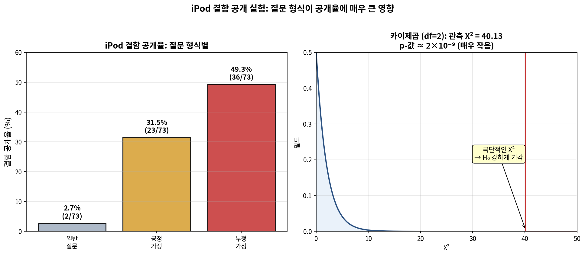

#### 새로운 시각: iPod 실험의 응용

이 실험은 단순한 통계 예제가 아니다. 질문 형식만으로 공개율이 **2.7%에서 49.3%로 18배 증가**한 것은 다음 분야에 직접적 시사점을 준다:

- **회계 감사·법률 면담**: 부정 가정형 질문이 사실 발견에 더 효과적.
- **의료 면담**: 환자에게 "약 복용에 어려움이 있으셨죠?" vs "약 복용에 문제는 없으셨나요?"의 차이.
- **설문조사 설계**: 응답 편향(response bias)을 줄이기 위한 질문 작성 원칙.

통계적 결론의 실질적 의미가 매우 큰 사례이다 (§6.0.3 (6)의 실질적 유의성).

---

## 6.5 장 요약

### 6.5.1 6장 핵심 개념 정리

| 절 | 시나리오 | 검정통계량 | 분포 | 비고 |
|:---:|:---|:---:|:---:|:---|
| 6.1 | 단일 비율 | $Z = (\hat{p} - p_0)/\mathrm{SE}$ | N(0,1) | SE에 $p_0$ 사용 |
| 6.2 | 두 비율 차이 (가설검정) | $Z = (\hat{p}_1-\hat{p}_2)/\mathrm{SE}_{\mathrm{pool}}$ | N(0,1) | 합동 비율 사용 |
| 6.2 | 두 비율 차이 (CI) | — | N(0,1) | 비합동 SE 사용 |
| 6.3 | 적합도 검정 | $X^2 = \sum(O-E)^2/E$ | $\chi^2_{k-1}$ | 모든 $E_i \geq 5$ |
| 6.4 | 독립성 검정 | $X^2 = \sum(O-E)^2/E$ | $\chi^2_{(R-1)(C-1)}$ | 모든 $E_{ij} \geq 5$ |

### 6.5.2 5장과 6장의 연결

| 5장에서 배운 개념 | 6장에서의 적용 |
|:---|:---|
| 가설검정 4단계 (PCCC) | 모든 절에서 동일하게 사용 |
| p-값과 α 비교 | 검정통계량의 분포만 달라짐 |
| 단측 vs 양측 | Z-검정에 적용. 카이제곱은 항상 (사실상) 양측 |
| 제1종·제2종 오류 | 표본크기 산정의 근거 |
| 신뢰구간과 가설검정의 대응 | 단일/두 비율 모두에서 성립 |
| 통계적 vs 실질적 유의성 | iPod 실험 등에서 효과 크기 평가 |

### 6.5.3 다음 장 예고

7장에서는 수치형 자료에 대한 추론을 다룬다. 6장에서 정규분포에서 카이제곱분포로 도구를 확장한 것처럼, 7장에서는 표본 평균을 위한 **t-분포**로 확장한다. 가설검정의 큰 흐름은 또다시 동일하다.

---
