# 제7장 수치형 자료에 대한 추론
## Inference for Numerical Data

---

제5장에서는 표본 비율에 대해 정규분포를 사용하여 신뢰구간과 가설검정에 기반한 통계적 추론의 기본 틀을 소개했다. 이 장에서는 여러 가지 새로운 점추정량과 몇 가지 새로운 분포를 다룬다. 각 경우에서 추론의 핵심 개념은 동일하게 유지된다: 어떤 점추정량 또는 검정통계량이 유용한지 결정하고, 점추정량 또는 검정통계량에 대해 적절한 분포를 식별하며, 추론의 개념을 적용한다.

**목차:**
- 7.1 t-분포를 이용한 단일 표본 평균
- 7.2 대응 자료
- 7.3 두 평균의 차이
- 7.4 평균 차이에 대한 검정력 계산
- 7.5 ANOVA를 이용한 다중 평균 비교

---

## 7.1 t-분포를 이용한 단일 표본 평균

표본 비율 p̂의 행동을 정규분포로 모형화할 수 있는 것처럼, 표본 평균 x̄도 특정 조건이 충족될 때 정규분포로 모형화할 수 있다. 그러나 곧 배우게 되겠지만, **t-분포**라고 불리는 새로운 분포가 표본 평균을 다룰 때 더 유용하다.

### 7.1.1 x̄의 표집분포

표본 평균은 특정 조건이 충족될 때 모평균 μ를 중심으로 하는 정규분포를 따르는 경향이 있다.

> **표본 평균에 대한 중심극한정리**
>
> 평균이 μ이고 표준편차가 σ인 모집단에서 n개의 독립적인 관측값으로 충분히 큰 표본을 수집할 때, x̄의 표집분포는 다음과 같이 거의 정규분포를 따른다:
>
> $$\text{평균} = \mu, \quad \text{표준오차(SE)} = \frac{\sigma}{\sqrt{n}}$$

### 7.1.2 x̄를 모형화하기 위해 필요한 두 가지 조건 평가

**독립성.** 표본 관측값들은 독립적이어야 한다. 이 조건을 충족시키는 가장 일반적인 방법은 표본이 모집단으로부터의 단순무작위표본일 때이다.

**정규성.** 표본이 작을 때는 표본 관측값들이 정규분포를 따르는 모집단에서 나왔다는 것도 요구된다.

> **경험법칙: 정규성 점검 방법**
>
> **n < 30:** 표본 크기 n이 30 미만이고 자료에 명확한 이상치가 없다면, 자료가 거의 정규분포를 따르는 모집단에서 나왔다고 가정한다.
>
> **n ≥ 30:** 표본 크기 n이 최소 30이고 특별히 극단적인 이상치가 없다면, 개별 관측값의 기저 분포가 정규분포가 아니더라도 x̄의 표집분포가 거의 정규분포를 따른다고 가정한다.

---

### 예제 7.1: 정규성 조건 점검

**문제:** 다른 모집단에서 단순무작위표본으로 얻은 두 플롯을 고려하라. 표본 크기는 n₁ = 15와 n₂ = 50이다. 독립성과 정규성 조건이 각 경우에 충족되는가?

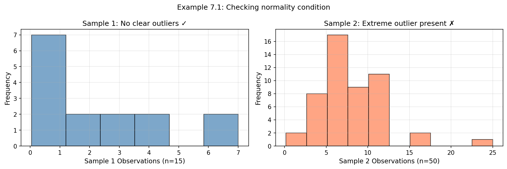

**그림:** 예제 7.1의 두 표본 히스토그램. 왼쪽은 n=15로 명확한 이상치가 없고, 오른쪽은 n=50이지만 극단적 이상치가 있다.

**풀이:**
- **표본 1 (n=15):** 단순무작위표본이므로 독립성 충족. n < 30이므로 명확한 이상치를 점검한다. 히스토그램에서 명확한 이상치가 보이지 않으므로 정규성 조건이 합리적으로 충족된다.
- **표본 2 (n=50):** 독립성 충족. n ≥ 30이므로 특별히 극단적인 이상치만 점검한다. 분포 중심에서 약 5배 이상 떨어진 이상치가 있으므로 정규성 조건이 **충족되지 않는다**.

---

### 7.1.3 t-분포 소개

실제로 모집단 표준편차 σ를 모르기 때문에 표본 표준편차 s를 대신 사용한다:

$$SE = \frac{\sigma}{\sqrt{n}} \approx \frac{s}{\sqrt{n}}$$

이 전략은 자료가 많을 때 잘 작동한다. 그러나 표본이 작으면 추정이 덜 정확해지며, 이를 해결하기 위해 **t-분포**를 사용한다.

t-분포는 종형이고 0을 중심으로 대칭이다. 그러나 t-분포는 정규분포보다 **꼬리가 더 두껍다** - 이는 추정된 표준오차를 사용할 때의 추가적인 불확실성을 반영한다.

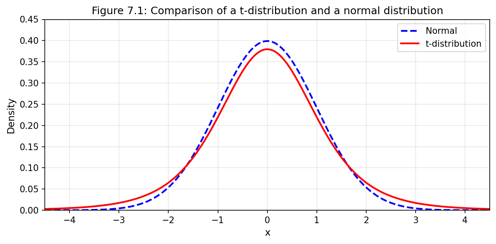

**그림 7.1:** t-분포와 정규분포의 비교. t-분포가 더 두꺼운 꼬리를 가진다.

**자유도**(df)는 t-분포의 정확한 형태를 설명한다. 일반적으로 표본 크기가 n일 때 **df = n - 1**인 t-분포를 사용한다.

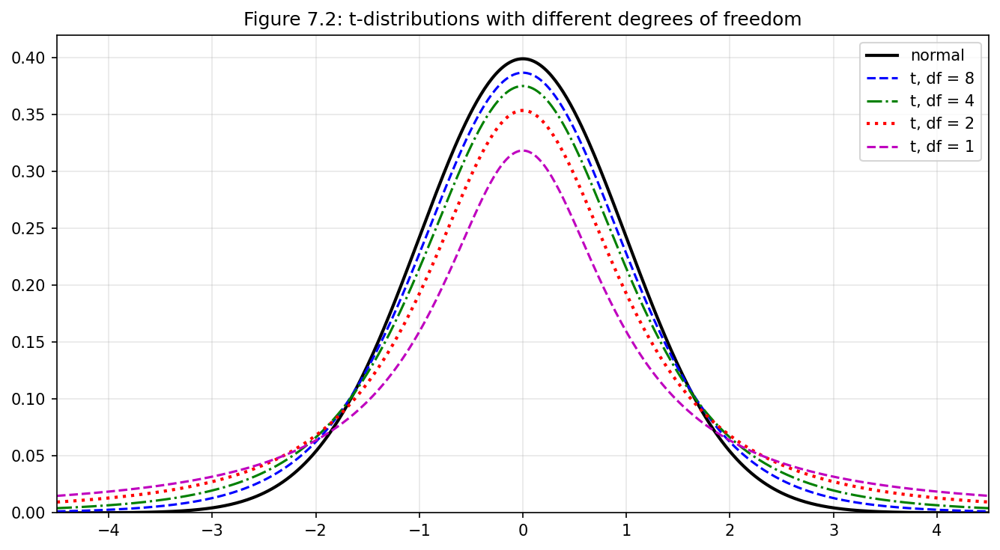

**그림 7.2:** 자유도가 클수록 t-분포는 표준정규분포에 더 가까워진다.

> **자유도 **(df)
>
> 자유도는 t-분포의 형태를 설명한다. 자유도가 클수록 분포는 정규 모형에 더 가까워진다.
> t-분포를 사용하여 x̄를 모형화할 때, **df = n - 1**을 사용한다.

---

### 예제 7.2

**문제:** t-분포에서 자유도가 18일 때, -2.10 아래에 해당하는 분포의 비율은 얼마인가?

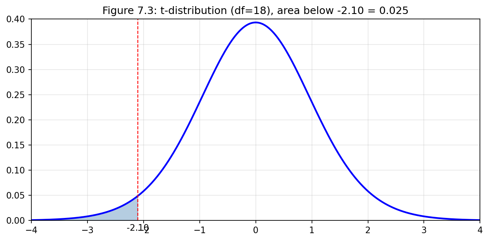

**그림 7.3:** 자유도 18인 t-분포. -2.10 아래 영역이 음영 처리되어 있다.

**풀이:** 통계 소프트웨어를 사용하면 정확한 값 **0.0250**을 얻을 수 있다.

```python
from scipy import stats
df = 18
t_value = -2.10
lower_tail = stats.t.cdf(t_value, df)
print(f"P(T < {t_value}) = {lower_tail:.4f}")
# 출력: P(T < -2.1) = 0.0250
```

---

### 예제 7.3 & 7.4

**문제 7.3:** 자유도가 20인 t-분포에서 1.65 위에 해당하는 분포의 비율을 추정하라.

**문제 7.4:** 자유도가 2인 t-분포에서 평균에서 3 단위 이상 떨어진 분포의 비율을 추정하라.

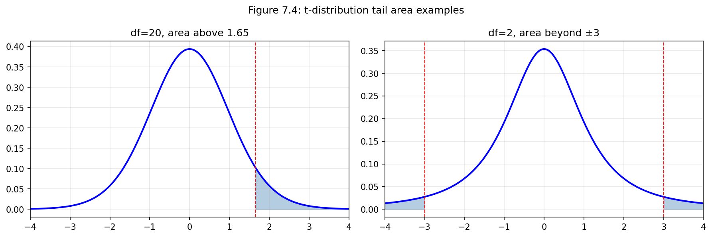

**그림 7.4:** 왼쪽: df=20에서 1.65 위 면적. 오른쪽: df=2에서 ±3 바깥 면적.

**풀이 7.3:** 통계 소프트웨어 사용: **0.0573**

**풀이 7.4:** df = 2인 t-분포에서 3 단위 바깥의 양쪽 꼬리 면적은 총 **0.0955**. 정규분포(약 0.003)와 극적으로 다르다.

```python
from scipy import stats

# 예제 7.3
print(f"df=20, P(T > 1.65) = {1 - stats.t.cdf(1.65, 20):.4f}")
# 출력: 0.0573

# 예제 7.4
print(f"df=2, P(|T| > 3) = {2 * (1 - stats.t.cdf(3, 2)):.4f}")
# 출력: 0.0955
```

---

### 연습문제 7.5 (Guided Practice)

**문제:** 자유도가 19인 t-분포에서 -1.79 위에 해당하는 비율은 얼마인가?

**풀이:** 하위 꼬리 면적은 0.0447이므로, 상위 면적은 **1 - 0.0447 = 0.9553**이다.

```python
from scipy import stats
df = 19
upper_area = 1 - stats.t.cdf(-1.79, df)
print(f"P(T > -1.79) = {upper_area:.4f}")
# 출력: P(T > -1.79) = 0.9553
```

### 7.1.4 단일 표본 t-신뢰구간

일본 Taiji 지역의 Risso 돌고래 19마리 표본을 사용하여 돌고래 근육의 평균 수은 함량에 대한 신뢰구간을 구한다.

| n | x̄ | s | 최솟값 | 최댓값 |
|---|-----|------|-------|-------|
| 19 | 4.4 | 2.3 | 1.7 | 9.2 |

**그림 7.6:** Taiji 지역 Risso 돌고래 19마리 근육의 수은 함량 요약 (μg/wet g).

---

### 예제 7.6

**문제:** 이 자료 세트에 대해 독립성과 정규성 조건이 충족되는가?

**풀이:** 관측값들이 단순무작위표본이므로 **독립성은 합리적**이다. 요약 통계량은 명확한 이상치가 없음을 시사하는데, 모든 관측값이 평균에서 2.5 표준편차 이내에 있기 때문이다. **정규성 조건도 합리적**으로 보인다.

---

### 예제 7.7

**문제:** n = 19 돌고래의 평균 수은 함량에 대한 표준오차를 계산하라.

**풀이:** $$SE = \frac{s}{\sqrt{n}} = \frac{2.3}{\sqrt{19}} = 0.528$$

---

### 예제 7.8

**문제:** n = 19일 때 적절한 자유도와 95% 신뢰수준에 대해 t*를 찾아라.

**풀이:**
- 자유도: **df = n - 1 = 18**
- 95% 신뢰구간에 대해: **t*₁₈ = 2.10**

```python
from scipy import stats
df = 18
t_star = stats.t.ppf(0.975, df)
print(f"t*_{df} = {t_star:.2f}")
# 출력: t*_18 = 2.10
```

---

### 예제 7.9: 돌고래 수은 함량 95% 신뢰구간

**문제:** Risso 돌고래의 평균 수은 함량에 대한 95% 신뢰구간을 계산하고 해석하라.

**풀이:**

$$\bar{x} \pm t^*_{18} \times SE \rightarrow 4.4 \pm 2.10 \times 0.528 \rightarrow (3.29, 5.51)$$

Risso 돌고래 근육의 평균 수은 함량이 **3.29에서 5.51 μg/wet gram 사이**라고 95% 확신하며, 이는 매우 높은 수준으로 간주된다.

```python
from scipy import stats
import numpy as np

x_bar, s, n = 4.4, 2.3, 19
df = n - 1
SE = s / np.sqrt(n)
t_star = stats.t.ppf(0.975, df)

lower = x_bar - t_star * SE
upper = x_bar + t_star * SE
print(f"95% CI: ({lower:.2f}, {upper:.2f})")
# 출력: 95% CI: (3.29, 5.51)
```

> **평균에 대한 t-신뢰구간 찾기**
>
> $$\text{점추정량} \pm t^*_{df} \times SE \rightarrow \bar{x} \pm t^*_{df} \times \frac{s}{\sqrt{n}}$$

---

### 7.1.5 단일 표본 t-검정

미국의 일반적인 달리기 선수는 시간이 지남에 따라 더 빨라지고 있는가 아니면 느려지고 있는가? Cherry Blossom Race(워싱턴 DC의 10마일 경주)의 맥락에서 이 질문을 고려한다.

2006년 경주에서 모든 참가자의 평균 완주 시간은 **93.29분**이었다. 2017년 경주 참가자 100명의 무작위 표본을 수집했고, 2017년 평균이 2006년과 달라졌는지 검정하고자 한다.

---

### 연습문제 7.14 (Guided Practice)

**문제:** 평균 완주 시간이 2006년에서 2017년으로 변했는지 평가하기 위해 적절한 가설을 작성하라.

**풀이:**
- **H₀:** μ = 93.29분 (평균 10마일 완주 시간이 2006년과 2017년에 같다)
- **Hₐ:** μ ≠ 93.29분 (2017년의 평균 10마일 완주 시간이 2006년과 다르다)

---

### 연습문제 7.15 (Guided Practice)

**문제:** 2017년 Cherry Blossom Race 100명 표본의 자료가 아래 히스토그램에 표시되어 있다. 자료가 t-분포를 사용하기에 충분한 조건을 충족하는가?

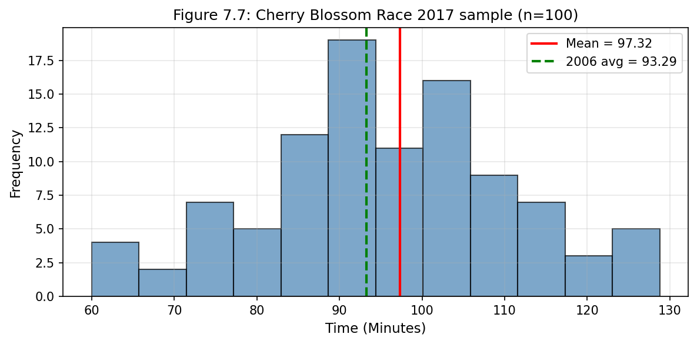

**그림 7.7:** Cherry Blossom Race 2017 표본 완주 시간 히스토그램.

**풀이:**
- **독립성:** 무작위 표본이므로 충족
- **정규성:** 표본 크기가 100(≥ 30)이므로, 극단적 이상치만 점검. 히스토그램에서 극단적 이상치가 보이지 않음. **두 조건 모두 충족.**

---

### 예제 7.16: Cherry Blossom 가설검정 완료

**문제:** 2017년 표본의 표본 평균과 표본 표준편차는 각각 97.32분과 16.98분이다. 표본 크기는 100이고 2006년 평균 완주 시간은 93.29분이었다. 검정통계량과 p-값을 구하고 결론을 내려라.

**풀이:**

**1단계: 표준오차 계산**
$$SE = \frac{16.98}{\sqrt{100}} = 1.70$$

**2단계: T-점수 계산**
$$T = \frac{97.32 - 93.29}{1.70} = 2.37$$

**3단계: p-값 계산**
df = 100 - 1 = 99에 대해, 단측 꼬리 면적은 0.01, 양측 p-값 = **0.02**

**4단계: 결론**
p-값(0.02) < α(0.05)이므로 **귀무가설을 기각**한다. 2017년 Cherry Blossom Run의 평균 완주 시간이 2006년 평균과 다르다는 강력한 증거가 있다. 관측값이 귀무값보다 위에 있으므로, **2017년 참가자들이 평균적으로 더 느렸다**고 결론 내린다.

```python
from scipy import stats
import numpy as np

x_bar, s, n = 97.32, 16.98, 100
mu_0 = 93.29

SE = s / np.sqrt(n)
T = (x_bar - mu_0) / SE
df = n - 1
p_value = 2 * (1 - stats.t.cdf(abs(T), df))

print(f"SE = {SE:.2f}")
print(f"T = {T:.2f}")
print(f"df = {df}")
print(f"p-value = {p_value:.4f}")
# 출력:
# SE = 1.70
# T = 2.37
# df = 99
# p-value = 0.0196
```

> **단일 평균에 대한 가설검정**
>
> **준비:** 관심 모수를 식별하고, 가설을 나열하고, 유의수준을 식별하고, x̄, s, n을 식별한다.
>
> **점검:** x̄가 거의 정규분포를 따르는지 확인하기 위해 조건을 검증한다.
>
> **계산:** 조건이 충족되면 SE를 계산하고, T-점수를 계산하고, p-값을 식별한다.
>
> **결론:** p-값을 α와 비교하여 가설검정을 평가하고, 문제의 맥락에서 결론을 제공한다.

---

## 새로운 시각 7.1: t-분포의 역사적 배경

t-분포는 1908년 **William Sealy Gosset**(1876-1937)에 의해 개발되었다. 그는 아일랜드 더블린의 Guinness 양조장에서 통계학자로 일했다. 회사 정책상 직원들이 과학 논문을 출판하는 것이 금지되어 있었기 때문에, 그는 **"Student"**라는 필명으로 논문을 발표했다. 이것이 바로 t-분포가 종종 **"Student의 t-분포"**라고 불리는 이유이다.

Gosset의 혁신은 **작은 표본에서도 신뢰할 수 있는 추론**을 가능하게 했다는 점에서 통계학의 중요한 이정표였다.

---

## 7.2 대응 자료

두 관측값 세트가 특별한 대응 관계를 가질 때, 예를 들어 동일한 개인에 대한 두 측정값, 이를 **대응**(paired)이라고 한다.

### 7.2.1 대응 관측값

> **대응 자료**
>
> 두 관측값 세트가 **대응**이라 함은 한 세트의 각 관측값이 다른 자료 세트의 정확히 하나의 관측값과 특별한 대응 관계 또는 연결을 가질 때를 말한다.

대응의 일반적인 예:
- 동일한 피험자의 처리 전후 측정
- 쌍둥이 연구
- 동일한 제품에 대한 두 가지 측정 방법 비교

UCLA 교과서 가격을 UCLA 서점과 Amazon에서 비교하는 연구에서, 차이는 다음과 같이 계산된다:

**차이 = UCLA 서점 가격 − Amazon 가격**

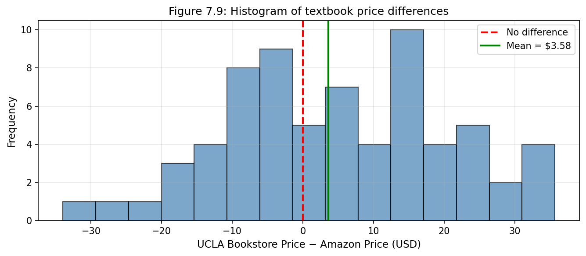

**그림 7.9:** 표본에서 각 책의 가격 차이 히스토그램.

### 7.2.2 대응 자료에 대한 추론

대응 자료 세트를 분석하려면 단순히 **차이**를 분석한다. 7.1절에서 적용한 것과 동일한 t-분포 기법을 사용할 수 있다.

| n_diff | x̄_diff | s_diff |
|--------|--------|--------|
| 68 | 3.58 | 13.42 |

**그림 7.10:** 68개 가격 차이에 대한 요약 통계량.

---

### 예제 7.17

**문제:** Amazon의 책 가격과 UCLA 서점의 가격 사이에 평균적으로 차이가 있는지 결정하기 위한 가설검정을 설정하고, t-분포를 사용하여 검정을 진행할 수 있는지 조건을 점검하라.

**풀이:**

**가설:**
- **H₀:** μ_diff = 0 (평균 교과서 가격에 차이가 없다)
- **Hₐ:** μ_diff ≠ 0 (평균 가격에 차이가 있다)

**조건 점검:**
- **독립성:** 단순무작위표본에 기반하므로 합리적
- **정규성:** n = 68이고 특별히 극단적인 이상치가 없으므로 충족

---

### 예제 7.18: 교과서 가격 가설검정 완료

**문제:** 예제 7.17에서 시작한 가설검정을 완료하라.

**풀이:**

**1단계: 표준오차**
$$SE_{\bar{x}_{diff}} = \frac{s_{diff}}{\sqrt{n_{diff}}} = \frac{13.42}{\sqrt{68}} = 1.63$$

**2단계: T-점수**
$$T = \frac{\bar{x}_{diff} - 0}{SE_{\bar{x}_{diff}}} = \frac{3.58 - 0}{1.63} = 2.20$$

**3단계: p-값**
df = 68 - 1 = 67, 단측 꼬리 면적 = 0.0156, 양측 **p-값 = 0.0312**

**4단계: 결론**
p-값(0.0312) < 0.05이므로 **귀무가설을 기각**한다. Amazon 가격은 평균적으로 UCLA 서점 가격보다 낮다.

```python
from scipy import stats
import numpy as np

n_diff = 68
x_bar_diff = 3.58
s_diff = 13.42

SE = s_diff / np.sqrt(n_diff)
T = x_bar_diff / SE
df = n_diff - 1
p_value = 2 * (1 - stats.t.cdf(abs(T), df))

print(f"SE = {SE:.2f}")
print(f"T = {T:.2f}")
print(f"df = {df}")
print(f"p-value = {p_value:.4f}")
# 출력: SE = 1.63, T = 2.20, df = 67, p-value = 0.0312
```

---

### 연습문제 7.19 (Guided Practice)

**문제:** UCLA 서점과 Amazon 사이의 평균 가격 차이에 대한 95% 신뢰구간을 구성하라.

**풀이:**

```python
t_star = stats.t.ppf(0.975, 67)
lower = 3.58 - t_star * 1.63
upper = 3.58 + t_star * 1.63
print(f"95% CI: (${lower:.2f}, ${upper:.2f})")
# 출력: 95% CI: ($0.33, $6.83)
```

UCLA 서점이 Amazon보다 평균 **$0.33에서 $6.83 더 비싸다**고 95% 확신한다.

---

## 7.3 두 평균의 차이

이 절에서는 자료가 대응이 아닌 조건 하에서 두 모평균의 차이 μ₁ - μ₂를 고려한다.

> **평균 차이에 대해 t-분포 사용하기**
>
> 두 평균의 표준화된 차이를 다룰 때 다음 조건이 충족되면 t-분포를 사용할 수 있다:
>
> - **확장된 독립성:** 자료가 두 그룹 내에서 그리고 두 그룹 사이에서 독립적이다.
> - **정규성:** 각 그룹에 대해 개별적으로 이상치 경험법칙을 점검한다.
>
> **표준오차:** $$SE = \sqrt{\frac{s_1^2}{n_1} + \frac{s_2^2}{n_2}}$$

### 7.3.1 평균 차이에 대한 신뢰구간

배아줄기세포(ESC)가 심장마비 후 심장 기능을 개선하는 데 도움이 되는지 검정하는 연구를 살펴보자.

| 그룹 | n | x̄ | s |
|------|---|-----|-----|
| ESC | 9 | 3.50% | 5.17% |
| 대조군 | 9 | -4.33% | 2.76% |

**그림 7.11:** 배아줄기세포 연구 요약 통계량.


**그림 7.12:** ESC 연구 - 심장 펌프 기능 변화 히스토그램.

---

### 예제 7.21

**문제:** 점추정량 x̄_esc − x̄_control = 7.83을 사용하여 추론을 하기 위해 t-분포를 사용할 수 있는가?

**풀이:**
- **독립성:** 양은 실험에서 무작위로 배정되었으므로 충족
- **정규성:** 각 그룹에서 n = 9 < 30이지만 명확한 이상치가 없음

두 조건이 충족되었으므로 t-분포를 사용할 수 있다.

---

### 예제 7.22: ESC 연구 95% 신뢰구간

**문제:** ESC 치료가 심장 펌프 기능에 미치는 효과에 대한 95% 신뢰구간을 계산하라.

**풀이:**

**점추정량:** x̄_esc − x̄_control = 3.50 - (-4.33) = 7.83%

**표준오차:**
$$SE = \sqrt{\frac{5.17^2}{9} + \frac{2.76^2}{9}} = \sqrt{2.97 + 0.85} = 1.95$$

**자유도:** df = min(9-1, 9-1) = 8, **t*₈ = 2.31** (95%)

**95% 신뢰구간:**
$$7.83 \pm 2.31 \times 1.95 \rightarrow (3.32, 12.34)$$

심장마비를 겪은 양에서 배아줄기세포가 심장 펌프 기능을 **3.32%에서 12.34% 향상**시킨다고 95% 확신한다.

```python
from scipy import stats
import numpy as np

n1, x1, s1 = 9, 3.50, 5.17  # ESC
n2, x2, s2 = 9, -4.33, 2.76  # Control

point_est = x1 - x2
SE = np.sqrt(s1**2/n1 + s2**2/n2)
df = min(n1-1, n2-1)
t_star = stats.t.ppf(0.975, df)

lower = point_est - t_star * SE
upper = point_est + t_star * SE

print(f"Point estimate: {point_est:.2f}%")
print(f"SE: {SE:.2f}")
print(f"95% CI: ({lower:.2f}%, {upper:.2f}%)")
# 출력: Point estimate: 7.83%, SE: 1.95, 95% CI: (3.32%, 12.34%)
```

---

### 7.3.2 두 평균 차이에 대한 가설검정

노스캐롤라이나 산모 150명 자료에서 흡연이 출생 체중에 영향을 미치는지 검정한다.

| 그룹 | n | x̄ | s |
|------|---|-----|-----|
| 비흡연자 | 100 | 7.18 lb | 1.60 lb |
| 흡연자 | 50 | 6.78 lb | 1.43 lb |

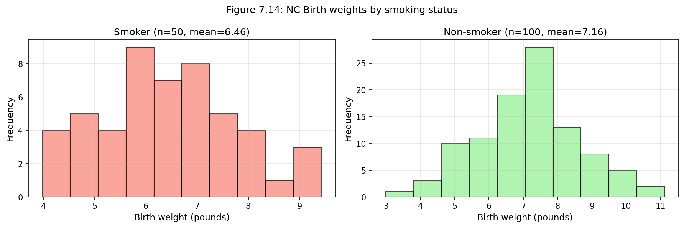

**그림 7.14:** 흡연 여부에 따른 출생 체중 히스토그램.

---

### 예제 7.23

**문제:** 산모의 흡연과 평균 출생 체중 사이에 관계가 있는지 평가하기 위해 적절한 가설을 설정하라.

**풀이:**
- **H₀:** μ_n - μ_s = 0 (비흡연자와 흡연자 산모의 신생아 평균 출생 체중에 차이가 없다)
- **Hₐ:** μ_n - μ_s ≠ 0 (차이가 있다)

---

### 예제 7.25: 출생 체중 가설검정

**문제:** 출생 체중 자료에 대한 가설검정을 완료하라.

**풀이:**

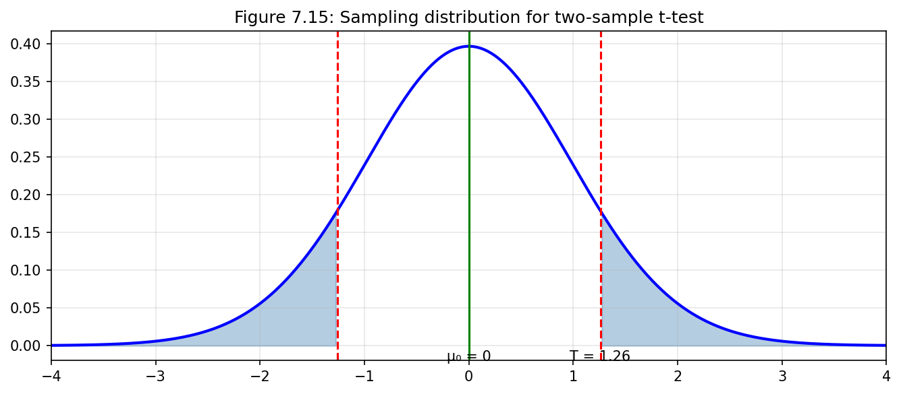

**그림 7.15:** 두 표본 t-검정의 표집분포.

```python
from scipy import stats
import numpy as np

n1, x1, s1 = 100, 7.18, 1.60  # 비흡연자
n2, x2, s2 = 50, 6.78, 1.43   # 흡연자

point_est = x1 - x2
SE = np.sqrt(s1**2/n1 + s2**2/n2)
df = min(n1-1, n2-1)
T = point_est / SE
p_value = 2 * (1 - stats.t.cdf(abs(T), df))

print(f"Point estimate: {point_est:.2f} lb")
print(f"SE: {SE:.2f}")
print(f"T: {T:.2f}")
print(f"df: {df}")
print(f"p-value: {p_value:.4f}")
# 출력: Point estimate: 0.40 lb, SE: 0.26, T: 1.55, df: 49, p-value: 0.1273
```

p-값(0.13) > 0.05이므로 귀무가설을 기각하지 못한다. 이 표본에서는 흡연과 출생 체중 사이의 관계에 대한 충분한 증거가 없다.

---

### 7.3.3 사례 연구: 두 버전의 시험

통계학 시험의 두 버전(A와 B) 중 하나가 다른 것보다 더 어려운지 평가한다.

| 버전 | n | x̄ | s |
|------|------|-------|------|
| A | 14 | 79.4 | 14.0 |
| B | 14 | 74.1 | 20.4 |

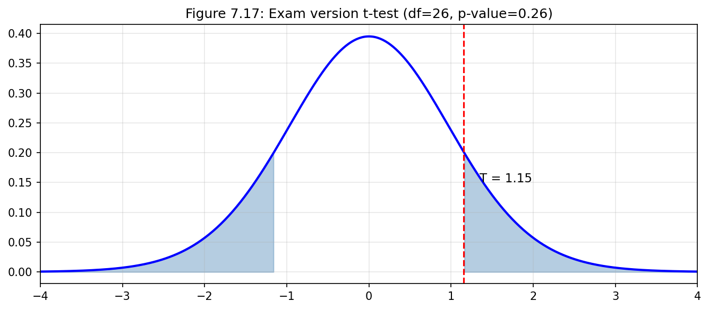

**그림 7.17:** 시험 버전 t-검정 (df=26, T=1.15, p-값=0.26).

p-값(0.26) > 0.01이므로 귀무가설을 기각하지 못한다. 한 시험 버전이 다른 버전보다 더 어렵다는 확신할 만한 증거가 없다.

---

## 7.4 평균 차이에 대한 검정력 계산

**검정력**(Power)은 대립가설이 참일 때 귀무가설을 올바르게 기각할 확률이다.

$$\text{검정력} = P(\text{H}_0 \text{ 기각} | \text{H}_0 \text{이 거짓})$$

### 7.4.1 검정의 절차 수행

검정력을 계산하기 위해, 먼저 대립가설이 참이라고 가정한 상태에서 가설검정을 수행해 본다.

### 7.4.2 2-표본 검정에 대한 검정력 계산

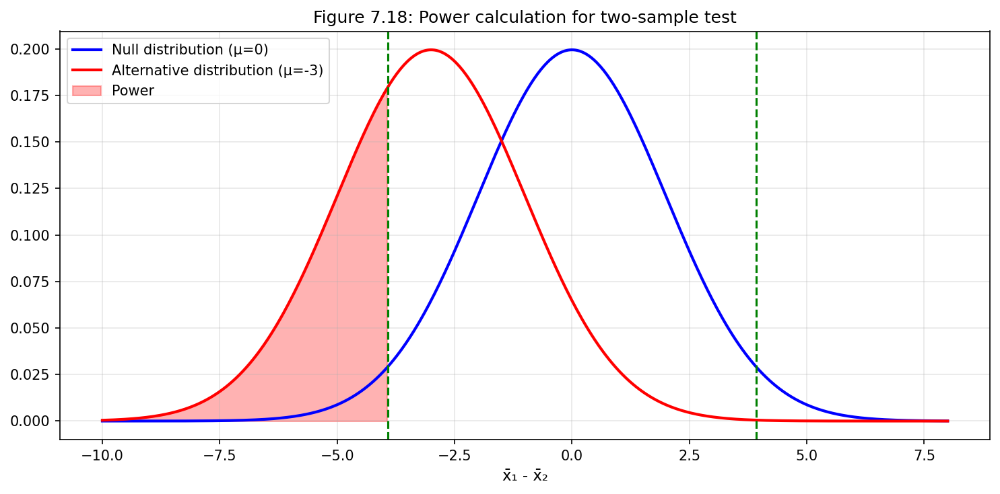

**그림 7.18:** 검정력 계산 시각화. 파란선은 귀무분포, 빨간선은 대립분포, 빨간 음영은 검정력을 나타낸다.

---

### 7.4.3 적절한 표본 크기 결정

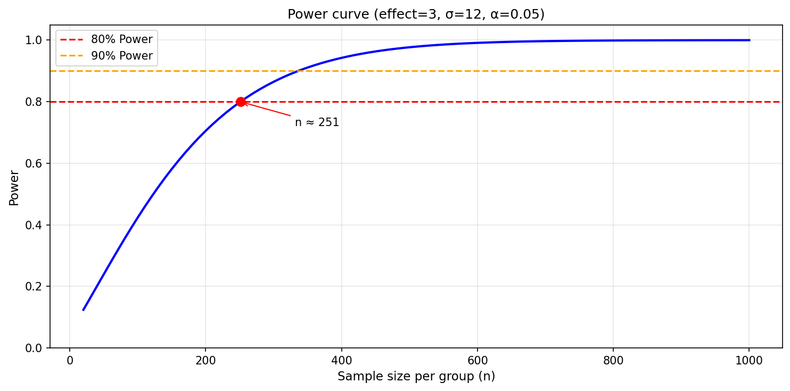

**검정력 곡선:** 표본 크기가 증가함에 따라 검정력이 증가한다.

### 예제 7.37: 표본 크기 계산

**문제:** 새로운 혈압 약의 효과를 검정하는 임상 시험을 설계한다. σ = 12 mmHg, 효과 크기 = 3 mmHg, 80% 검정력을 원하면 표본 크기는 얼마인가? (α = 0.05)

**풀이:**

표본 크기 공식:
$$n = \frac{(z_{\alpha/2} + z_{\text{power}})^2 \times 2\sigma^2}{\Delta^2}$$

```python
from scipy import stats
import numpy as np

sigma = 12
effect = 3
power = 0.80
alpha = 0.05

z_alpha = stats.norm.ppf(1 - alpha/2)  # 1.96
z_power = stats.norm.ppf(power)         # 0.84

n = (z_alpha + z_power)**2 * 2 * sigma**2 / effect**2
print(f"필요한 표본 크기 (각 그룹): {np.ceil(n):.0f}")
# 출력: 필요한 표본 크기 (각 그룹): 251
```

---

## 7.5 ANOVA를 이용한 다중 평균 비교

때때로 여러 그룹에 걸쳐 평균을 비교하고 싶다. 많은 그룹이 있고 많은 비교를 하면, 모집단에 차이가 없더라도 우연히 차이를 발견할 가능성이 높다. **분산분석**(ANOVA)은 적어도 한 쌍의 그룹이 실제로 다른지 증거가 있는지 확인하기 위해 전체론적 검정을 적용한다.

### 7.5.1 ANOVA의 핵심 개념

> **ANOVA 가설**
>
> **H₀:** 모든 그룹에서 평균 결과가 같다. μ₁ = μ₂ = ··· = μₖ
>
> **Hₐ:** 적어도 하나의 평균이 다르다.

ANOVA 수행을 위한 세 가지 조건:
1. 관측값들이 그룹 내에서 그리고 그룹 사이에서 독립적
2. 각 그룹 내 자료가 거의 정규분포
3. 그룹 간 변동성이 대략 동일

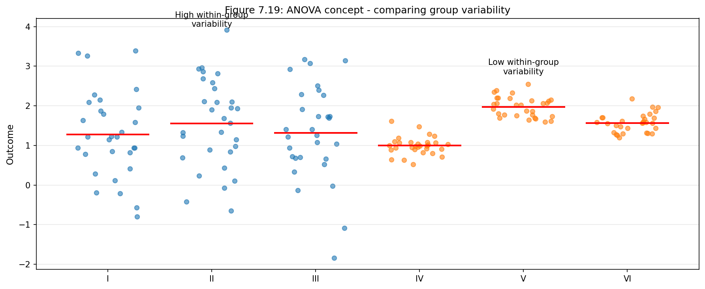

**그림 7.19:** ANOVA 개념 - 그룹 변동성 비교. 왼쪽(I, II, III)은 그룹 내 변동이 커서 차이 감지 어려움, 오른쪽(IV, V, VI)은 그룹 내 변동이 작아서 차이 감지 쉬움.

---

### 7.5.2 MLB에서 타격 성적이 선수 포지션과 관련 있는가?

야구 선수의 포지션(외야수 OF, 내야수 IF, 포수 C)에 따라 타격 성적에 실제 차이가 있는지 확인하고자 한다.

| 포지션 | n | x̄ | s |
|--------|---|-------|------|
| OF (외야수) | 160 | 0.319 | 0.038 |
| IF (내야수) | 226 | 0.320 | 0.039 |
| C (포수) | 43 | 0.302 | 0.038 |

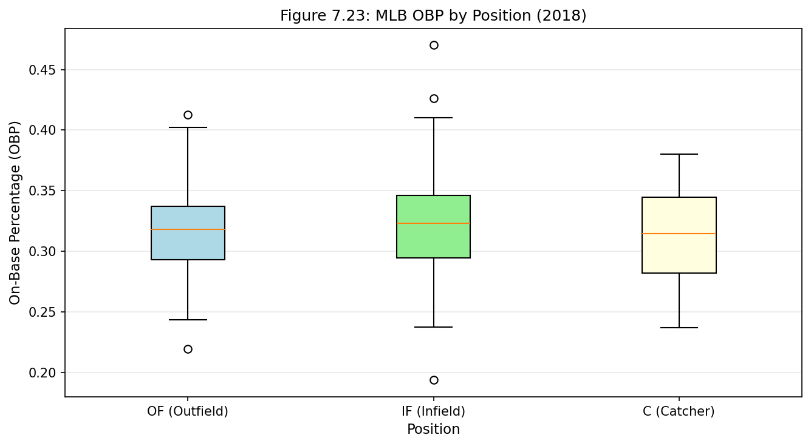

**그림 7.23:** MLB 포지션별 출루율(OBP) 상자그림 (2018년).

---

### 7.5.3 분산분석(ANOVA)과 F-검정

ANOVA의 핵심 질문: **표본 평균의 변동성이 우연만으로는 설명할 수 없을 정도로 큰가?**

> **F 통계량과 F-검정**
>
> $$F = \frac{MSG}{MSE}$$
>
> - **MSG (Mean Square Between Groups):** 그룹 간 변동성
> - **MSE (Mean Square Error):** 그룹 내 변동성
>
> H₀이 참이고 모형 조건이 충족되면, F는 **df₁ = k - 1**과 **df₂ = n - k**를 가진 F 분포를 따른다.

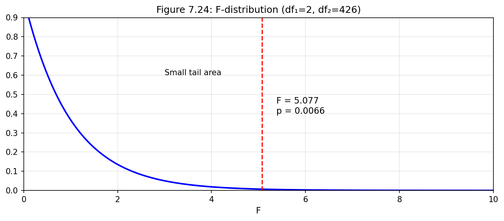

**그림 7.24:** F-분포 (df₁=2, df₂=426). F=5.077에서 p-값은 작은 꼬리 면적으로 표시된다.

---

### 연습문제 7.45 (Guided Practice)

**문제:** 야구 자료에 대해 MSG = 0.00803이고 MSE = 0.00158이다. MSG와 MSE와 관련된 자유도를 식별하고 F 통계량이 약 5.077인지 확인하라.

**풀이:**
- k = 3 그룹이므로 **df_G = k - 1 = 2**
- n = 160 + 226 + 43 = 429 관측값이므로 **df_E = n - k = 426**
- F = MSG/MSE = 0.00803/0.00158 = **5.08 ≈ 5.077**

```python
from scipy import stats

MSG = 0.00803
MSE = 0.00158
df1, df2 = 2, 426

F = MSG / MSE
p_value = 1 - stats.f.cdf(F, df1, df2)

print(f"F = {F:.3f}")
print(f"p-value = {p_value:.4f}")
# 출력: F = 5.082, p-value = 0.0066
```

p-값(0.0066) < 0.05이므로 귀무가설을 기각한다. 포지션에 따라 출루율에 유의한 차이가 있다는 증거가 있다.

---

### 7.5.5 ANOVA 분석을 위한 그래픽 진단

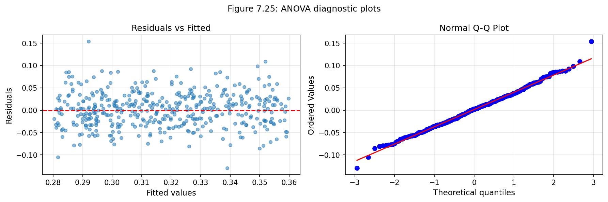

**그림 7.25:** ANOVA 진단 플롯. 왼쪽: 잔차 vs 적합값, 오른쪽: 정규 Q-Q 플롯.

---

### 7.5.6 다중 비교와 제1종 오류율 제어

ANOVA에서 귀무가설을 기각한 후, 어떤 그룹이 실제로 다른지 알고 싶다면 **쌍별 비교**를 수행한다. 그러나 많은 검정을 수행하면 제1종 오류율이 증가한다.

> **Bonferroni 보정**
>
> 다중 비교 시나리오에서 수정된 유의수준을 사용한다:
>
> $$\alpha^* = \frac{\alpha}{K}$$
>
> K는 비교 횟수이다. k개 그룹이 있으면 보통 K = k(k-1)/2.

**예:** k = 3 그룹이면 K = 3(3-1)/2 = 3 비교, α* = 0.05/3 = **0.0167**

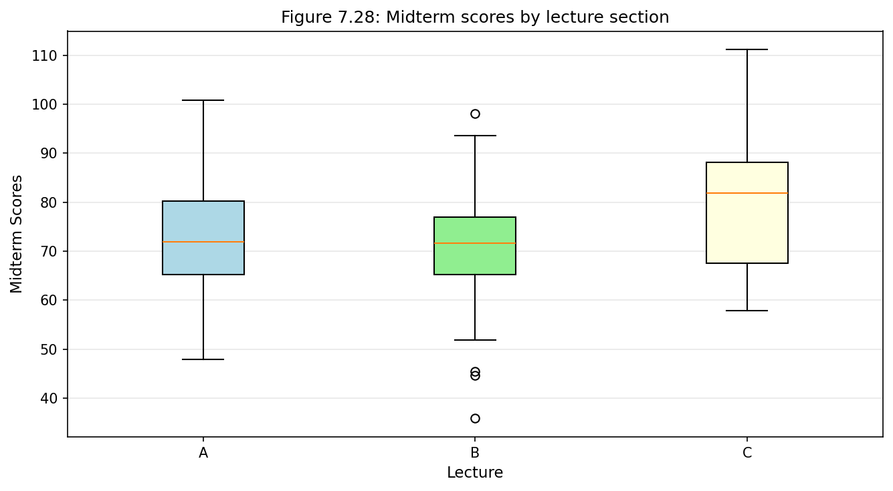

**그림 7.28:** 강의 섹션별 중간고사 점수 상자그림.

---

## 새로운 시각 7.2: ANOVA의 직관적 이해

ANOVA는 본질적으로 **신호 대 잡음 비율**을 측정한다:
- **신호 (MSG):** 그룹 평균 간의 변동
- **잡음 (MSE):** 그룹 내 변동

F = MSG/MSE는 "그룹 간 차이가 배경 잡음에 비해 얼마나 큰가?"를 묻는다.

비유: 시끄러운 파티에서 누군가의 말을 듣는 것과 유사하다. 목소리가 크고(큰 MSG) 배경 소음이 낮으면(낮은 MSE), 쉽게 들을 수 있다(큰 F → 작은 p-값).

---

## 가설검정 도식

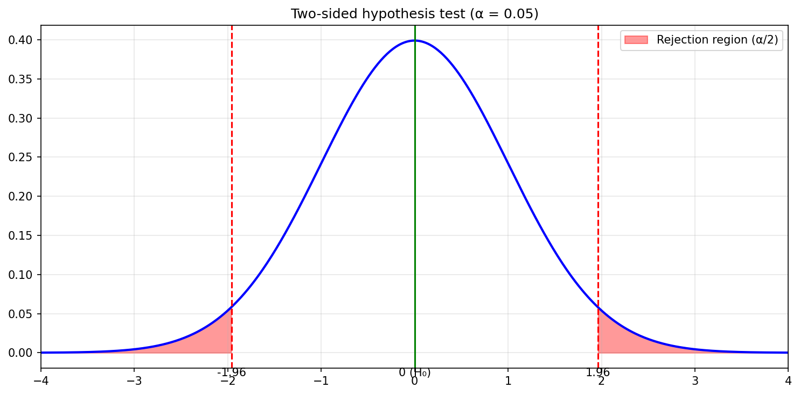

**그림:** 양측 가설검정 (α = 0.05). 기각역이 양쪽 꼬리에 음영 처리되어 있다.
