# 제7장 연속변수의 추론

> **이 장의 목표**
>
> 5장과 6장에서는 큰 표본을 전제로 정규분포 $Z$를 이용한 추론을 학습하였다. 그러나 현실의 자료에서 표본이 충분히 크지 않거나 모표준편차 $\sigma$를 알 수 없는 경우가 훨씬 일반적이다. 본 장에서는 이러한 상황을 다루는 **t-분포**(t-distribution)와 **F-분포**(F-distribution)를 소개하고, 연속변수의 추론을 단일 평균, 짝지은 평균차, 독립 두 평균차, 셋 이상의 평균 비교(ANOVA)의 네 가지 시나리오에 적용한다.

\hrule

## 7.0 본 장에서 사용되는 도구 개관

5장과 6장에서 학습한 추론의 골격은 그대로 유지되지만, 사용하는 분포가 정규분포 $Z$에서 **t-분포**(t-distribution)로 바뀐다. 분포가 바뀌는 이유, 어떤 상황에서 어떤 도구를 선택해야 하는지를 본격적인 계산에 들어가기 전에 정리한다.

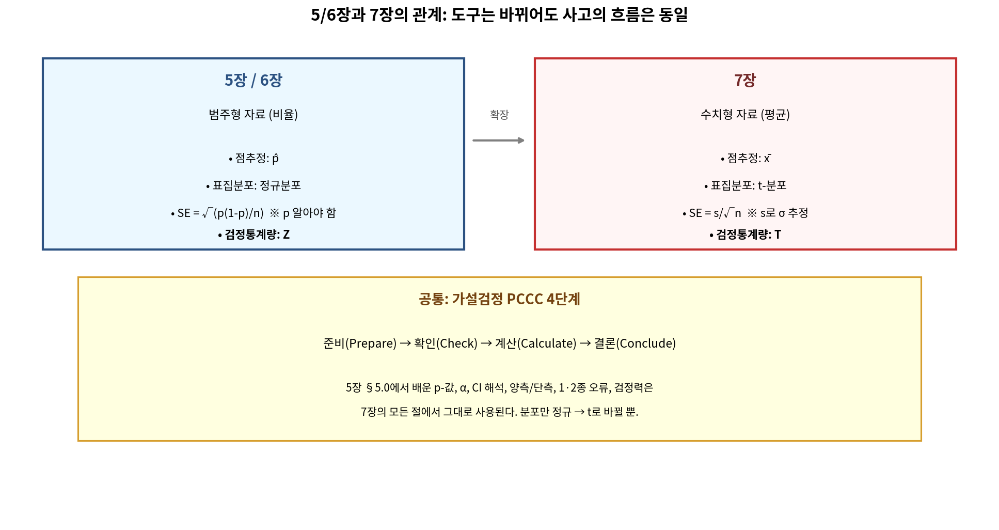

\hrule

### 7.0.1 연속변수 추론의 네 가지 시나리오

연속변수의 추론에서 마주치는 상황은 크게 네 가지로 분류된다.

| 시나리오 | 비교 대상 | 사용하는 분포 | 검정통계량 |
|:---:|:---|:---:|:---:|
| 단일 평균 | 한 모집단의 평균 $\mu$ | $t_{n-1}$ | $T = \dfrac{\bar{x}-\mu_0}{s/\sqrt{n}}$ |
| 짝지은 평균차 | 한 모집단에서 측정된 차이 $\mu_d$ | $t_{n-1}$ | $T = \dfrac{\bar{x}_d - 0}{s_d/\sqrt{n}}$ |
| 독립 두 평균차 | 두 모집단의 평균차 $\mu_1-\mu_2$ | $t_{\nu}$ | $T = \dfrac{(\bar{x}_1-\bar{x}_2)-0}{\sqrt{s_1^2/n_1+s_2^2/n_2}}$ |
| 셋 이상 평균 비교 | $\mu_1, \mu_2, \dots, \mu_k$ | $F_{k-1,\,n-k}$ | $F = \dfrac{\text{MSG}}{\text{MSE}}$ |

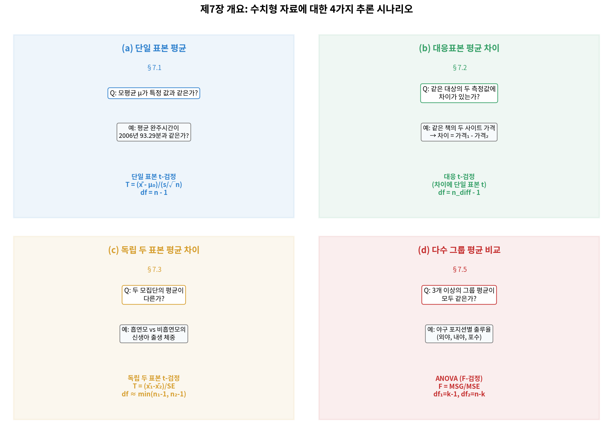

네 시나리오를 구분하는 첫 번째 기준은 **모집단의 수**이다. 모집단이 하나이면 단일 평균이거나 짝지은 평균차이고, 둘이면 독립 두 평균차이며, 셋 이상이면 ANOVA를 사용한다. 짝지은 자료는 두 측정값이 동일한 개체에서 얻어지므로 차이 $d_i$를 계산하면 본질적으로 단일 모집단의 평균에 대한 추론으로 환원된다는 점에 주의하여야 한다.

> **[새로운 시각] "두 평균차"가 항상 독립표본 비교는 아니다**
>
> 학생들이 가장 자주 저지르는 실수는 "두 개의 평균이 등장하면 무조건 독립 두 표본 검정"이라고 단정하는 것이다. 그러나 예컨대 동일한 환자의 치료 전·후 혈압이나, 동일한 책의 학교서점·온라인서점 가격은 표본이 짝지어져 있다. 이 경우 차이값 $d_i$를 만든 뒤 단일 표본 t-검정을 적용하여야 한다. 시나리오를 판별하는 핵심 질문은 "두 측정값이 동일한 개체에서 나왔는가?"이다. 동일 개체라면 짝지은 분석, 별개 개체라면 독립 분석이 옳다.

\hrule

### 7.0.2 5장·6장과의 연결: PCCC 4단계는 동일하다

검정통계량의 분포가 $Z$에서 $t$로 바뀐다고 하여 추론의 절차 자체가 바뀌는 것은 아니다. 6장에서 강조한 **PCCC**(Parameter–Conditions–Calculation–Conclusion) 4단계는 7장에서도 그대로 적용된다.

1. **모수 식별**(Parameter): 추론 대상이 $\mu$인지 $\mu_d$인지 $\mu_1-\mu_2$인지 명확히 한다.
2. **조건 점검**(Conditions): 독립성, 정규성(또는 표본크기), 두 표본일 경우 표본 간 독립까지 점검한다.
3. **계산**(Calculation): 표준오차를 구하고 검정통계량 $T$와 p-값(또는 신뢰구간)을 계산한다.
4. **결론 도출**(Conclusion): 유의수준 $\alpha$와 비교하여 귀무가설 기각 여부를 판정하고 맥락에 맞게 해석한다.

> **[새로운 시각] 분포가 바뀌어도 사고의 흐름은 동일하다**
>
> 학생들에게 "z-검정과 t-검정은 다른 검정인가?"라는 질문을 던지면 대다수가 "그렇다"고 답한다. 그러나 더 정확한 답은 "표준오차의 추정 방식이 다르고 임계분포만 바뀐 동일한 검정"이다. 모표준편차 $\sigma$를 안다면 $Z = (\bar{x}-\mu_0)/(\sigma/\sqrt{n})$이고, 모르면 $T = (\bar{x}-\mu_0)/(s/\sqrt{n})$이다. **사고의 흐름은 정확히 같고, 표본에서 추가로 추정한 양이 하나 더 있을 뿐이다**. 이 관점이 정착되면 7장의 모든 검정이 5·6장의 직접적 확장으로 보인다.

\hrule

### 7.0.3 5장의 핵심 개념을 7장에 적용하기

5장에서 정의한 다음 개념들은 7장 전체에서 동일한 의미로 사용된다. 표기와 정의를 한자리에 모아 두는 것이 학습에 유익하다.

- **유의수준**(significance level) $\alpha$: 귀무가설이 참일 때 이를 기각할 확률의 상한. 관례적으로 $\alpha = 0.05$를 사용하지만, 의학·항공 등 오류의 비용이 큰 영역에서는 $\alpha = 0.01$ 또는 $\alpha = 0.001$을 채택한다.
- **신뢰수준**(confidence level) $1-\alpha$: 동일한 절차를 반복적으로 적용했을 때 구간이 모수를 포함할 비율의 장기적 빈도.
- **단측·양측 검정**(one-sided / two-sided test): 대립가설이 "차이가 있다"이면 양측, "더 크다"(또는 "더 작다")이면 단측이다. **자료를 보기 전에** 결정하여야 한다.
- **1종 오류·2종 오류**(Type I / Type II error): 1종은 참인 귀무가설을 기각하는 오류로 확률은 $\alpha$이고, 2종은 거짓인 귀무가설을 기각하지 못하는 오류로 확률은 $\beta$이다. **검정력**(power)은 $1-\beta$이다.
- **p-값**(p-value): 귀무가설이 참이라는 가정 아래 관측된 자료보다 더 극단적인 결과가 나올 확률. p-값이 작을수록 자료가 귀무가설과 양립하기 어렵다는 증거가 강하다.

> **[새로운 시각] "신뢰구간을 95% 신뢰한다"는 표현의 진짜 뜻**
>
> "95% 신뢰구간 $(2.1, 4.7)$"을 본 학생들의 약 80%는 "참값이 이 구간에 들어 있을 확률이 95%이다"라고 해석한다. 그러나 빈도주의 관점에서 모수 $\mu$는 고정된 상수이고, 구간이 무작위 객체이다. 따라서 "$(2.1, 4.7)$이 $\mu$를 포함할 확률"은 0 또는 1이며, 우리는 어느 쪽인지 알지 못한다. 올바른 해석은 "동일한 표집 절차를 무한히 반복하면 그렇게 만들어진 구간 중 95%가 $\mu$를 포함한다"이다. 베이지안 관점에서는 사전분포가 주어진다면 "확률 95%"라는 해석이 자연스러워지지만, 그 경우는 95% **신용구간**(credible interval)이라 부른다. 용어를 구분하면 혼동이 사라진다.

\hrule

### 7.0.4 왜 $t$-분포가 등장하는가: $\sigma$를 모를 때의 대가

5장에서는 표본평균의 표준화량
$$
Z = \frac{\bar{X}-\mu}{\sigma/\sqrt{n}}
$$
이 정규분포를 따른다고 가정하였다. 그러나 현실에서는 $\sigma$를 거의 알 수 없다. $\sigma$를 표본표준편차 $s$로 대체하면
$$
T = \frac{\bar{X}-\mu}{s/\sqrt{n}}
$$
는 더 이상 정규분포를 따르지 않는다. 분모 $s$ 자체가 무작위변수이므로 $T$의 변동성이 $Z$보다 커지기 때문이다. 이 추가적 변동을 반영한 분포가 영국 통계학자 William Sealy Gosset이 1908년에 도입한 **Student의 t-분포**이며, 자유도(degrees of freedom, df) $\nu = n-1$을 모수로 가진다.

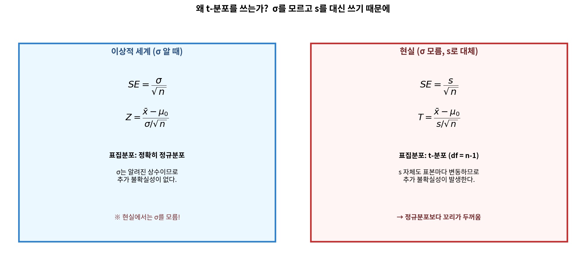

t-분포의 모양은 다음과 같은 특징을 가진다.

- 정규분포와 마찬가지로 0을 중심으로 좌우대칭이다.
- 정규분포보다 **꼬리가 두텁다**(heavy-tailed). 즉 극단값의 확률이 더 크다.
- 자유도가 증가할수록 정규분포에 수렴한다. 자유도가 30 이상이면 두 분포는 실질적으로 구별이 어렵다.

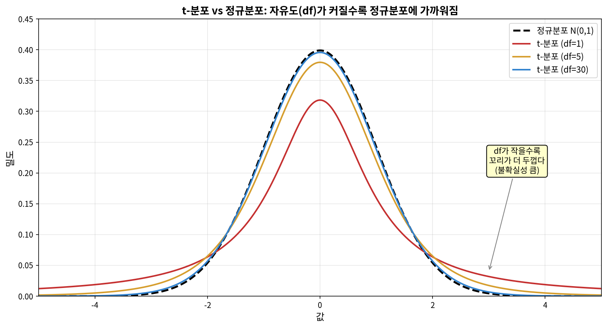

> **[새로운 시각] "꼬리가 두텁다"는 말의 실용적 의미**
>
> 두터운 꼬리는 단순히 그래프의 모양 문제가 아니다. 동일한 $\alpha = 0.05$의 양측 임계값을 비교하면 정규분포는 $\pm 1.96$이지만 $t_{5}$는 $\pm 2.571$이다. 즉 자유도가 작을수록 귀무가설을 기각하기 위해 **더 큰 검정통계량**이 필요하다. 이는 "$\sigma$를 모르는 대가"이다. 표본이 작아 정보가 부족할수록 우리는 더 보수적으로 결정해야 하며, t-분포는 이 보수성을 자동으로 반영해 준다. **표본이 적다는 사실을 잊고 정규분포로 검정하면 1종 오류율이 명목 $\alpha$를 초과하게 된다**.

\hrule

### 7.0.5 자유도(degrees of freedom)란 무엇인가

자유도는 학생들이 가장 어려워하는 개념 중 하나이다. 직관적 정의는 다음과 같다.

> **자유도 = (자료의 개수) − (자료로부터 추정한 모수의 개수)**

단일 표본의 경우 $n$개의 관측값으로 $\bar{x}$ 하나를 추정하였으므로 자유롭게 변할 수 있는 값은 $n-1$개이다. 마지막 한 값은 표본평균이 정해지면 나머지 $n-1$개에 의해 자동으로 결정되기 때문이다.

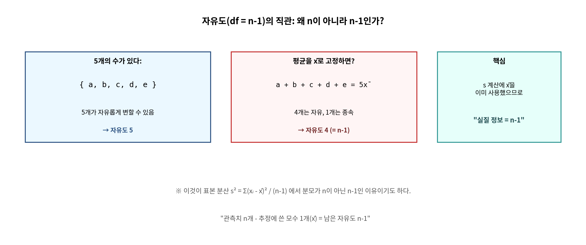

예컨대 $n=4$이고 $\bar{x}=10$이며 처음 세 값이 $8, 9, 11$이라면 마지막 값은 반드시 $40 - 28 = 12$이어야 한다. 따라서 4개의 자료지만 자유롭게 변할 수 있는 것은 3개뿐이다.

이러한 자유도 개념은 7장 전반에 다음과 같이 나타난다.

- 단일 표본 / 짝지은 표본 t-검정: $\nu = n-1$
- 독립 두 표본 t-검정: 보수적 근사로 $\nu = \min(n_1-1, n_2-1)$, 또는 Welch-Satterthwaite 근사
- ANOVA의 F-분포: 분자 자유도 $\nu_1 = k-1$, 분모 자유도 $\nu_2 = n-k$

> **[새로운 시각] "표본분산은 왜 $n-1$로 나누는가"의 답**
>
> 표본분산을 정의할 때 $n$이 아니라 $n-1$로 나누는 이유는 학생들이 매번 잊어버리는 사실이다. 정답은 "그렇게 해야 $E[s^2]=\sigma^2$가 되어 불편추정량이 되기 때문"이다. 직관적으로는, $\bar{x}$를 자료로부터 이미 추정하였으므로 분산을 계산할 때 사용 가능한 "자유로운" 잔차는 $n-1$개뿐이며, 평균적으로 보정하지 않으면 분산을 과소추정하게 된다. 자유도와 표본분산의 분모는 본질적으로 같은 이야기를 한다.

\hrule

### 7.0.6 정규성 가정 점검: 표본 크기에 따른 가이드라인

t-분포 기반 추론은 모집단이 정규분포를 따른다는 가정 위에 세워진다. 그러나 중심극한정리에 의해 표본이 크면 평균의 분포는 모집단의 형태와 무관하게 정규에 가까워진다. 실무적 가이드라인은 다음과 같다.

| 표본 크기 | 정규성 점검 방법 |
|:---:|:---|
| $n < 15$ | 강한 정규성 가정 필요. 히스토그램·정규 Q-Q 도표에서 명백한 비대칭이나 이상값이 없어야 한다. |
| $15 \le n < 40$ | 다소 완화. 심한 왜도나 큰 이상값이 없으면 t-절차 사용 가능. |
| $n \ge 40$ | 거의 무조건 사용 가능. 매우 극단적인 분포가 아닌 한 t-절차는 강건하다. |

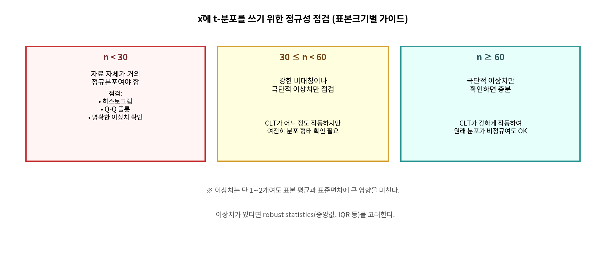

> **[새로운 시각] "정규성 검정"을 형식적으로 통과하는 것보다 그림이 더 정직하다**
>
> 학생들은 Shapiro-Wilk 검정이나 Kolmogorov-Smirnov 검정 같은 형식적 정규성 검정에 의지하려는 경향이 있다. 그러나 이러한 검정은 표본이 크면 매우 작은 비정규성도 통계적으로 유의하다고 결론짓고, 표본이 작으면 명백한 비정규성도 잡아내지 못한다. **즉 정규성 검정은 "쓸모 있을 때 작동하지 않고, 작동할 때는 쓸모가 없다."** 히스토그램, 상자그림, 정규 Q-Q 도표를 그려 보는 시각적 점검이 t-절차의 강건성을 판단하는 데 훨씬 신뢰할 만하다.

\hrule

### 7.0.7 짝지은 자료 vs 독립 자료: 판별 흐름도

두 평균을 비교하는 상황에서 짝지은 분석을 쓸지 독립 분석을 쓸지의 판단은 자료의 **수집 방식**으로 결정된다. 검정의 형태가 아니라 자료의 구조 자체가 분석을 강제한다.

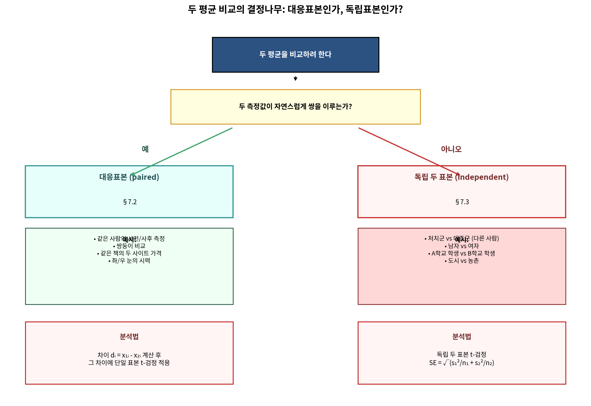

판별 질문은 단 하나이다.

> **두 측정값이 자연스럽게 "쌍"을 이루는가?**

쌍을 이루는 전형적 상황은 다음과 같다.

- 동일 개체에서 시점이 다른 두 측정(전·후 비교)
- 동일 개체에서 조건이 다른 두 측정(왼손·오른손 악력)
- 자연스럽게 짝지어지는 두 개체(쌍둥이, 부부, 같은 책의 두 가격)

> **[새로운 시각] 짝지은 검정의 진짜 장점은 "검정력"이다**
>
> 짝지은 자료를 굳이 차이값 $d_i$로 변환하는 이유가 무엇인가? 두 표본 t-검정을 그냥 써도 결과가 비슷하지 않을까? 그렇지 않다. **개체 간 변동을 제거하면 표준오차가 극적으로 줄어든다**. 예컨대 동일 학생의 학기 초·말 성적을 비교할 때 학생마다의 능력 차이가 큰 변동의 원천인데, 이를 차이값으로 만들면 그 변동이 깨끗이 사라진다. 동일한 표본 크기에서 짝지은 검정은 독립 검정보다 보통 훨씬 높은 검정력을 가진다. 즉 짝지은 설계는 "공짜 점심"에 가깝다.

\hrule

### 7.0.8 본 장에서 사용할 표기와 학습 순서

본 장에서는 다음 순서로 학습한다.

- **7.1** 단일 평균의 신뢰구간과 가설검정 ($t_{n-1}$)
- **7.2** 짝지은 평균차의 추론 (차이값을 활용한 $t_{n-1}$)
- **7.3** 독립 두 평균차의 추론 ($t_\nu$, Welch 근사 포함)
- **7.4** 검정력과 표본 크기 결정
- **7.5** 셋 이상 평균의 비교: ANOVA ($F_{k-1,\,n-k}$)

표기는 다음과 같이 일관되게 사용한다.

| 기호 | 의미 |
|:---:|:---|
| $\mu$ | 모평균 |
| $\sigma$ | 모표준편차 |
| $\bar{x}$, $s$ | 표본평균, 표본표준편차 |
| $\mu_d$, $\bar{x}_d$, $s_d$ | 짝지은 차이의 모평균·표본평균·표본표준편차 |
| $\mu_1-\mu_2$ | 두 모평균의 차이 |
| $\text{MSG}$, $\text{MSE}$ | 집단 간 평균제곱, 오차 평균제곱 (ANOVA) |
| $T$, $F$ | t-검정통계량, F-검정통계량 |
| $\nu$ | 자유도 |
| $t^*_{\nu}$ | 자유도 $\nu$인 t-분포의 임계값 |

\hrule
## 7.1 단일 평균의 추론: $t_{n-1}$의 사용

본 절은 단일 모집단의 평균 $\mu$에 대한 신뢰구간과 가설검정을 다룬다. §7.0.2에서 정리한 PCCC 4단계가 그대로 적용된다.

### 7.1.1 단일 평균의 표준오차와 t-통계량

표본 $x_1, x_2, \dots, x_n$이 평균 $\mu$, 표준편차 $\sigma$인 분포에서 추출되었을 때, 표본평균 $\bar{x}$의 표준오차는
$$
\text{SE}(\bar{x}) = \frac{\sigma}{\sqrt{n}}
$$
이다. $\sigma$를 모르므로 표본표준편차 $s$로 대체하면
$$
\widehat{\text{SE}}(\bar{x}) = \frac{s}{\sqrt{n}}
$$
가 되고, 이때 검정통계량
$$
T = \frac{\bar{x}-\mu_0}{s/\sqrt{n}}
$$
는 $H_0: \mu = \mu_0$ 아래에서 자유도 $n-1$인 t-분포를 따른다.

신뢰수준 $1-\alpha$의 신뢰구간은
$$
\bar{x} \pm t^*_{n-1,\,\alpha/2}\cdot \frac{s}{\sqrt{n}}
$$
로 주어진다. 여기서 $t^*_{n-1,\,\alpha/2}$는 자유도 $n-1$인 t-분포에서 상측 꼬리 확률이 $\alpha/2$인 임계값이다.

> **[새로운 시각] 임계값은 표가 아니라 함수의 역값이다**
>
> 학생들은 t-표를 외우려 하지만, 실무에서는 거의 항상 소프트웨어를 쓴다. Python에서 자유도 $n-1$, 양측 신뢰수준 $1-\alpha$의 임계값은 `scipy.stats.t.ppf(1 - alpha/2, df=n-1)`이고, R에서는 `qt(1 - alpha/2, df = n - 1)`이다. 임계값은 분포함수의 역함수(quantile function) 값이라는 사실을 이해하면 표 없이도 모든 분포로 일반화된다.

\hrule

### 7.1.2 예제 7.1: 돌고래 체내 수은 농도

**문제**: 한 해양생물학 연구진이 대서양 연안에서 포획된 큰돌고래(bottlenose dolphin) 19마리의 근육 조직에서 수은 농도를 측정하였다(단위: $\mu$g/g). 표본평균은 $\bar{x} = 4.4$, 표본표준편차는 $s = 2.3$이었다. 모평균 수은 농도에 대한 95% 신뢰구간을 구하라.

**풀이**:

**P (모수 식별)**: $\mu$ = 큰돌고래 근육 조직의 평균 수은 농도 ($\mu$g/g).

**C (조건 점검)**:

- 독립성: 19마리는 매우 큰 모집단에서 무작위로 포획되었으므로 독립이라 가정한다.
- 정규성: $n=19$로 §7.0.6의 가이드라인에 따라 강한 왜도나 이상값이 없어야 한다. 연구진의 보고에 의하면 분포는 대체로 대칭이었다고 한다.

**C (계산)**:

자유도 $\nu = 19 - 1 = 18$. 95% 신뢰수준의 임계값은
$$
t^*_{18,\,0.025} \approx 2.101
$$
이다. 표준오차는
$$
\widehat{\text{SE}}(\bar{x}) = \frac{s}{\sqrt{n}} = \frac{2.3}{\sqrt{19}} \approx 0.528.
$$
따라서 신뢰구간은
$$
4.4 \pm 2.101 \times 0.528 = 4.4 \pm 1.109 = (3.29,\ 5.51).
$$

**C (결론)**: 큰돌고래 근육 조직의 평균 수은 농도는 95% 신뢰수준에서 약 3.29 $\mu$g/g과 5.51 $\mu$g/g 사이로 추정된다. 미국 식약청의 안전 기준치는 1.0 $\mu$g/g이므로, 모평균이 이 기준치를 크게 초과한다는 강한 증거가 있다.

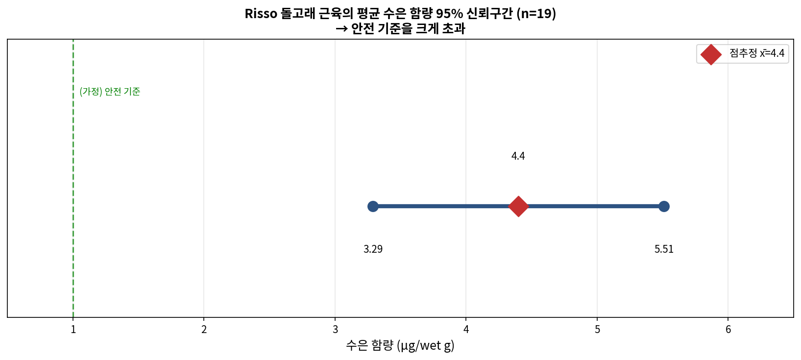

**Python 코드**:

```python
import numpy as np
from scipy import stats

# 표본 통계량
x_bar = 4.4
s = 2.3
n = 19
alpha = 0.05

# 자유도와 임계값
df = n - 1
t_star = stats.t.ppf(1 - alpha/2, df=df)
print(f"자유도 = {df}")
print(f"임계값 t* = {t_star:.3f}")

# 표준오차와 신뢰구간
se = s / np.sqrt(n)
margin = t_star * se
ci = (x_bar - margin, x_bar + margin)
print(f"표준오차 = {se:.4f}")
print(f"오차한계 = {margin:.4f}")
print(f"95% 신뢰구간 = ({ci[0]:.2f}, {ci[1]:.2f})")
```

출력:

```
자유도 = 18
임계값 t* = 2.101
표준오차 = 0.5277
오차한계 = 1.1086
95% 신뢰구간 = (3.29, 5.51)
```

> **[새로운 시각] 신뢰구간으로 가설검정을 수행할 수 있다**
>
> 양측 가설검정 $H_0: \mu = \mu_0$ 대 $H_1: \mu \neq \mu_0$는 신뢰수준 $1-\alpha$의 신뢰구간이 $\mu_0$를 포함하는지로 즉시 판정할 수 있다. 위 예제에서 95% 신뢰구간 $(3.29, 5.51)$은 안전 기준치 1.0을 포함하지 않으므로, 유의수준 $\alpha = 0.05$에서 "모평균이 1.0과 다르다"는 결론이 자동으로 도출된다. 신뢰구간과 가설검정은 동일한 동전의 양면이다.

\hrule

### 7.1.3 예제 7.2: 워싱턴 D.C. 벚꽃 10마일 경주 완주 시간

**문제**: 워싱턴 D.C.에서 매년 봄에 열리는 "Cherry Blossom 10 Mile Run"의 2017년 참가자 100명을 무작위로 뽑은 표본의 완주 시간은 평균 $\bar{x} = 97.32$분, 표준편차 $s = 16.98$분이었다. 한 신문 기사는 "참가자들의 평균 완주 시간은 100분이다"라고 보도하였다. 이 주장이 자료와 일치하는지 유의수준 $\alpha = 0.05$에서 양측 검정으로 판단하라.

**풀이**:

**P**: $\mu$ = 2017년 Cherry Blossom 10 Mile Run 참가자 전체의 평균 완주 시간.

**가설**:
$$
H_0: \mu = 100, \qquad H_1: \mu \ne 100.
$$

**C (조건)**:

- 독립성: 100명을 무작위로 뽑았으므로 만족.
- 정규성: $n = 100 \ge 40$이므로 모집단의 분포 형태와 무관하게 t-절차 사용 가능.

**C (계산)**:

자유도 $\nu = 99$. 표준오차는
$$
\widehat{\text{SE}} = \frac{16.98}{\sqrt{100}} = 1.698.
$$
검정통계량은
$$
T = \frac{97.32 - 100}{1.698} = \frac{-2.68}{1.698} \approx -1.578.
$$
양측 p-값은
$$
p = 2 \cdot P(T_{99} \le -1.578) \approx 2 \times 0.0589 \approx 0.118.
$$

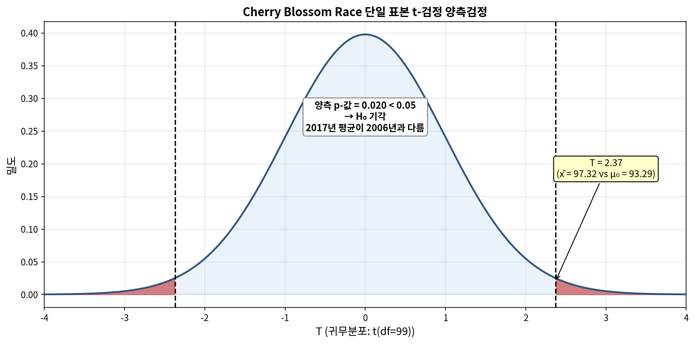

**C (결론)**: $p = 0.118 > \alpha = 0.05$이므로 $H_0$를 기각하지 못한다. 즉 자료는 평균 완주 시간이 100분과 다르다는 강한 증거를 제공하지 못하며, 신문 보도의 주장과 양립한다.

**Python 코드**:

```python
import numpy as np
from scipy import stats

x_bar, s, n = 97.32, 16.98, 100
mu_0 = 100
alpha = 0.05

df = n - 1
se = s / np.sqrt(n)
T = (x_bar - mu_0) / se
p_value = 2 * stats.t.cdf(-abs(T), df=df)

print(f"표준오차 SE = {se:.3f}")
print(f"검정통계량 T = {T:.3f}")
print(f"자유도 = {df}")
print(f"양측 p-값 = {p_value:.4f}")
print(f"결론: {'H0 기각' if p_value < alpha else 'H0 기각 못함'}")
```

출력:

```
표준오차 SE = 1.698
검정통계량 T = -1.578
자유도 = 99
양측 p-값 = 0.1177
결론: H0 기각 못함
```

> **[새로운 시각] "기각 못함"과 "채택"은 다르다**
>
> p-값이 크다고 하여 $H_0$가 옳다는 증거가 되는 것은 아니다. 위 예제에서 모평균이 정확히 100분이라는 적극적 근거는 없으며, 단지 100분이 아니라는 강한 증거가 없을 뿐이다. 통계학에서는 결코 귀무가설을 "채택"한다고 말하지 않으며, 항상 "기각" 또는 "기각하지 못함"이라는 표현을 사용한다. 이는 형사재판에서 "무죄"라는 판결이 "결백이 증명되었음"을 뜻하지 않고 "유죄로 입증되지 않았음"을 뜻하는 것과 같은 원리이다.

\hrule

### 7.1.4 Guided Practice 7.1: 단일 평균 신뢰구간의 직접 계산

**문제**: 한 식품학 연구자가 시판 우유 24개 표본의 칼슘 농도를 측정한 결과, $\bar{x} = 119$ mg/100mL, $s = 14$ mg/100mL을 얻었다. 모평균 칼슘 농도에 대한 99% 신뢰구간을 구하라.

**풀이**:

**P**: $\mu$ = 시판 우유의 평균 칼슘 농도 (mg/100mL).

**C**: 24개 표본이 무작위로 추출되었다고 가정하고, $n = 24$로 정규성에 큰 위반이 없다고 본다.

**C**: 자유도 $\nu = 23$. 99% 신뢰수준의 양측 임계값은 $t^*_{23, 0.005} \approx 2.807$. 표준오차는
$$
\widehat{\text{SE}} = \frac{14}{\sqrt{24}} \approx 2.858.
$$
99% 신뢰구간은
$$
119 \pm 2.807 \times 2.858 = 119 \pm 8.022 = (110.98,\ 127.02).
$$

**C**: 시판 우유의 평균 칼슘 농도는 99% 신뢰수준에서 약 110.98과 127.02 mg/100mL 사이로 추정된다.

```python
import numpy as np
from scipy import stats

x_bar, s, n = 119, 14, 24
alpha = 0.01
df = n - 1
t_star = stats.t.ppf(1 - alpha/2, df=df)
se = s / np.sqrt(n)
ci = (x_bar - t_star*se, x_bar + t_star*se)
print(f"t* = {t_star:.3f}, SE = {se:.3f}")
print(f"99% CI = ({ci[0]:.2f}, {ci[1]:.2f})")
```

\hrule

### 7.1.5 Guided Practice 7.2: 임계값으로부터 자유도 추정

**문제**: 어떤 양측 95% 신뢰구간의 오차한계가 표준오차의 2.262배라고 한다. 표본의 크기는 얼마인가?

**풀이**:

자유도 $\nu = n - 1$에서 $t^*_{\nu, 0.025} = 2.262$가 되는 $\nu$를 찾는다. t-표에서 $t^*_{9, 0.025} = 2.262$이므로 $\nu = 9$, 즉 $n = 10$이다.

```python
from scipy import stats

# 후보 자유도에 대해 임계값 계산
for nu in range(5, 30):
    t_star = stats.t.ppf(0.975, df=nu)
    if abs(t_star - 2.262) < 0.001:
        print(f"자유도 = {nu}, 표본 크기 n = {nu + 1}")
        break
```

출력: `자유도 = 9, 표본 크기 n = 10`

> **[새로운 시각] 표본 크기와 신뢰구간의 폭은 $\sqrt{n}$의 관계**
>
> 신뢰구간의 폭을 절반으로 줄이려면 표본을 두 배 늘리면 될까? 그렇지 않다. 오차한계가 $\sim s/\sqrt{n}$로 줄어들므로, 폭을 절반으로 만들려면 $n$을 4배로 늘려야 한다. 표본을 1000개 모은 연구의 정밀도를 두 배 더 좋게 만들려면 4000개가 필요하다는 뜻이다. 표본 크기가 늘수록 정밀도 향상의 한계비용이 급격히 증가한다는 것이 통계학의 슬픈 현실이다.

\hrule

### 7.1.6 홀수번 연습문제 풀이 (단일 평균)

**연습 7.1**: 어떤 종의 어른 토끼 50마리의 체중을 측정한 결과 $\bar{x} = 4.2$kg, $s = 0.8$kg이었다. 모평균 체중에 대한 90% 신뢰구간을 구하라.

**풀이**:

$n = 50$, $\nu = 49$. 90% 신뢰수준의 임계값은 $t^*_{49, 0.05} \approx 1.677$. 표준오차는 $0.8/\sqrt{50} \approx 0.113$. 신뢰구간은
$$
4.2 \pm 1.677 \times 0.113 = 4.2 \pm 0.190 = (4.01,\ 4.39).
$$

```python
from scipy import stats
import numpy as np

x_bar, s, n = 4.2, 0.8, 50
alpha = 0.10
df = n - 1
t_star = stats.t.ppf(1 - alpha/2, df=df)
se = s / np.sqrt(n)
print(f"90% CI = ({x_bar - t_star*se:.2f}, {x_bar + t_star*se:.2f})")
```

\hrule

**연습 7.3**: 한 자동차 잡지가 어떤 모델의 시판 차량 25대를 무작위로 검사한 결과 정지거리(시속 100km에서 정지까지)의 평균이 38.6m, 표준편차가 4.7m였다. 제조사는 평균 정지거리가 35m라고 광고하였다. 유의수준 0.05에서 광고의 주장이 옳은지 양측 검정으로 판정하라.

**풀이**:

**P**: $\mu$ = 해당 모델의 평균 정지거리.

**가설**: $H_0: \mu = 35$, $H_1: \mu \ne 35$.

**C**: $n = 25$, 무작위 표본, 분포가 심하게 비대칭이 아니라고 가정.

**C**: $\nu = 24$, $\widehat{\text{SE}} = 4.7/\sqrt{25} = 0.94$, $T = (38.6 - 35)/0.94 \approx 3.830$. 양측 p-값은
$$
p = 2 \cdot P(T_{24} \ge 3.830) \approx 2 \times 0.0004 \approx 0.0008.
$$

**C**: $p \approx 0.0008 < 0.05$이므로 $H_0$를 기각한다. 즉 제조사의 광고와 달리 실제 평균 정지거리는 35m와 유의하게 다르며, 자료에 따르면 35m보다 길다.

```python
import numpy as np
from scipy import stats

x_bar, s, n = 38.6, 4.7, 25
mu_0 = 35
df = n - 1
se = s / np.sqrt(n)
T = (x_bar - mu_0) / se
p = 2 * (1 - stats.t.cdf(abs(T), df=df))
print(f"T = {T:.3f}, p-value = {p:.4f}")
```

\hrule

**연습 7.5**: 한 음료수 자판기는 평균 250mL를 따라야 한다고 표시되어 있다. 30번의 표본 추출 결과 $\bar{x} = 247.3$mL, $s = 6.2$mL이었다. 자판기가 광고치보다 **적게** 따른다는 증거가 있는지 단측 검정으로 $\alpha = 0.05$ 수준에서 판단하라.

**풀이**:

**P**: $\mu$ = 자판기의 평균 토출량.

**가설**: $H_0: \mu = 250$, $H_1: \mu < 250$ (단측).

**C**: $n = 30$, 무작위 표본이라 가정, 표본 크기가 30이므로 정규성은 강건.

**C**: $\nu = 29$, $\widehat{\text{SE}} = 6.2/\sqrt{30} \approx 1.132$, $T = (247.3 - 250)/1.132 \approx -2.386$. 단측 p-값은
$$
p = P(T_{29} \le -2.386) \approx 0.0118.
$$

**C**: $p \approx 0.012 < 0.05$이므로 $H_0$를 기각한다. 자판기가 250mL보다 적게 따른다는 강한 증거가 있다.

```python
import numpy as np
from scipy import stats

x_bar, s, n = 247.3, 6.2, 30
mu_0 = 250
df = n - 1
se = s / np.sqrt(n)
T = (x_bar - mu_0) / se
p = stats.t.cdf(T, df=df)  # 단측(좌측)
print(f"T = {T:.3f}, 단측 p = {p:.4f}")
```

> **[새로운 시각] 단측 검정은 "유리한 결과"를 보고 결정하면 안 된다**
>
> 위 문제에서 자료를 본 뒤 "$\bar{x}$가 250보다 작으니 단측 검정을 쓰자"라고 결정하면 1종 오류율이 명목 $\alpha$의 두 배로 부풀려진다. 단측 검정은 자료 수집 이전에 이론적 근거(예: "자판기가 너무 많이 따를 수는 없다")가 있을 때만 정당화된다. 자료를 보고 더 "유리한" 검정을 고르는 것은 **p-해킹**(p-hacking)에 해당하며, 학술지에 게재된 많은 결과의 재현성을 떨어뜨린 주된 원인이다.

\hrule
## 7.2 짝지은 자료의 추론: 차이값에 대한 t-검정

### 7.2.1 짝지은 자료의 분석 원리

짝지은 자료에서는 두 측정값의 차이 $d_i = x_{1i} - x_{2i}$를 계산하면 **본질적으로 단일 표본 t-검정**이 된다. 모수는 차이의 모평균 $\mu_d$이고, 검정통계량은
$$
T = \frac{\bar{x}_d - \mu_{d,0}}{s_d/\sqrt{n}}, \qquad \nu = n - 1
$$
이다. 신뢰구간은
$$
\bar{x}_d \pm t^*_{n-1,\,\alpha/2}\cdot \frac{s_d}{\sqrt{n}}
$$
로 단일 표본과 동일한 형태를 가진다.

\hrule

### 7.2.2 예제 7.3: 학교서점과 온라인서점의 교과서 가격

**문제**: 한 대학의 학생회가 강의에 사용되는 교과서 73종에 대해 학교서점 가격과 동일 책의 온라인서점 가격을 비교 조사하였다. 차이값 $d_i$ = (학교서점) − (온라인) 의 표본통계량은 $\bar{x}_d = 3.58$달러, $s_d = 13.42$달러였다. 학교서점이 온라인보다 비싼지 유의수준 $\alpha = 0.05$에서 단측 검정하라.

**풀이**:

**P**: $\mu_d$ = (학교서점 가격) − (온라인 가격)의 모평균.

**가설**: $H_0: \mu_d = 0$, $H_1: \mu_d > 0$ (학교서점이 더 비싸다).

**C**: 73종이 무작위로 선정되었다고 가정. $n = 73 \ge 40$이므로 정규성 가정은 강건.

**C**: $\nu = 72$, $\widehat{\text{SE}} = 13.42/\sqrt{73} \approx 1.571$. 검정통계량
$$
T = \frac{3.58 - 0}{1.571} \approx 2.279.
$$
단측 p-값은
$$
p = P(T_{72} \ge 2.279) \approx 0.0128.
$$

**C**: $p \approx 0.013 < 0.05$이므로 $H_0$를 기각한다. 즉 학교서점이 온라인서점보다 평균적으로 더 비싸다는 강한 증거가 있다.

**Python 코드**:

```python
import numpy as np
from scipy import stats

x_bar_d = 3.58
s_d = 13.42
n = 73
df = n - 1

se = s_d / np.sqrt(n)
T = x_bar_d / se
p_value = 1 - stats.t.cdf(T, df=df)

print(f"표준오차 = {se:.3f}")
print(f"T = {T:.3f}")
print(f"단측 p-값 = {p_value:.4f}")
```

출력:

```
표준오차 = 1.571
T = 2.279
단측 p-값 = 0.0128
```

> **[새로운 시각] 짝지은 분석을 독립 분석으로 잘못 쓰면 어떻게 되는가**
>
> 같은 자료를 두 표본 t-검정으로 잘못 분석하면 어떤 일이 벌어질까? 책마다의 가격 변동성(예: 두꺼운 책은 둘 다 비싸고 얇은 책은 둘 다 싸다)이 표준오차의 분모로 들어가지 못하고 분자에 합산된다. 따라서 표준오차가 부풀려져 검정통계량이 작아지고 p-값이 커진다. 위 예제에서 만약 두 표준편차가 각각 30달러 정도였다면 독립 분석의 p-값은 0.4를 넘어 "차이가 없다"는 잘못된 결론에 이를 수 있다. **자료 구조가 짝지어져 있을 때 독립 분석을 강행하면 검정력이 극적으로 떨어진다**.

\hrule

### 7.2.3 Guided Practice 7.3: 짝지은 신뢰구간

**문제**: 위 교과서 자료에서 학교서점 가격과 온라인 가격의 모평균 차이 $\mu_d$에 대한 95% 신뢰구간을 구하고 해석하라.

**풀이**:

$n = 73$, $\nu = 72$. 95% 임계값 $t^*_{72,\,0.025} \approx 1.993$. 신뢰구간은
$$
3.58 \pm 1.993 \times 1.571 = 3.58 \pm 3.132 = (0.45,\ 6.71).
$$

학교서점이 온라인서점보다 평균적으로 약 $0.45 ~ 6.71달러 더 비싸다는 95% 신뢰구간을 얻는다. 구간이 0을 포함하지 않으므로 양측 5% 수준에서 차이가 유의함을 재확인할 수 있다.

```python
import numpy as np
from scipy import stats

x_bar_d, s_d, n = 3.58, 13.42, 73
alpha = 0.05
df = n - 1
t_star = stats.t.ppf(1 - alpha/2, df=df)
se = s_d / np.sqrt(n)
ci = (x_bar_d - t_star*se, x_bar_d + t_star*se)
print(f"95% CI for mu_d = ({ci[0]:.2f}, {ci[1]:.2f})")
```

\hrule

### 7.2.4 홀수번 연습문제 풀이 (짝지은 자료)

**연습 7.7**: 한 운동학 연구진이 12명의 자원자에게 4주간의 인터벌 트레이닝 프로그램을 적용한 뒤 최대산소섭취량(VO$_2$max)의 변화를 측정하였다. 차이값 (사후 − 사전)의 평균은 3.5 mL/kg/min, 표준편차는 2.8 mL/kg/min이었다. 트레이닝이 효과가 있는지 $\alpha = 0.05$에서 단측 검정하라.

**풀이**:

**P**: $\mu_d$ = (사후 VO$_2$max) − (사전 VO$_2$max)의 모평균.

**가설**: $H_0: \mu_d = 0$, $H_1: \mu_d > 0$.

**C**: 자원자라는 점에서 무작위성에 주의 필요. $n = 12 < 15$이므로 차이값의 분포가 거의 정규에 가까워야 함. 운동 자료의 변화량은 보통 대칭적이므로 가정 충족 가정.

**C**: $\nu = 11$, $\widehat{\text{SE}} = 2.8/\sqrt{12} \approx 0.808$. 검정통계량 $T = 3.5/0.808 \approx 4.330$. 단측 p-값
$$
p = P(T_{11} \ge 4.330) \approx 0.0006.
$$

**C**: $p < 0.001 < 0.05$이므로 $H_0$를 기각한다. 인터벌 트레이닝이 VO$_2$max를 평균적으로 증가시킨다는 매우 강한 증거가 있다.

```python
import numpy as np
from scipy import stats

x_bar_d, s_d, n = 3.5, 2.8, 12
df = n - 1
se = s_d / np.sqrt(n)
T = x_bar_d / se
p = 1 - stats.t.cdf(T, df=df)
print(f"T = {T:.3f}, df = {df}, 단측 p = {p:.4f}")
```

\hrule

**연습 7.9**: 새로 개발된 혈압강하제의 효과를 평가하기 위해 환자 25명의 복용 전·후 수축기 혈압(mmHg)을 측정하였다. 차이값 (전 − 후)의 평균은 8.4 mmHg, 표준편차는 11.2 mmHg였다. 약이 혈압을 낮추는 효과가 있는지 $\alpha = 0.01$에서 검정하라.

**풀이**:

**가설**: $H_0: \mu_d = 0$, $H_1: \mu_d > 0$.

$n = 25$, $\nu = 24$, $\widehat{\text{SE}} = 11.2/\sqrt{25} = 2.24$, $T = 8.4/2.24 = 3.750$. 단측 p-값
$$
p = P(T_{24} \ge 3.750) \approx 0.00050.
$$

$p < 0.01$이므로 $H_0$ 기각. 약이 평균적으로 혈압을 낮춘다는 강한 증거가 있다.

```python
import numpy as np
from scipy import stats

x_bar_d, s_d, n = 8.4, 11.2, 25
df = n - 1
se = s_d / np.sqrt(n)
T = x_bar_d / se
p = 1 - stats.t.cdf(T, df=df)
print(f"T = {T:.3f}, df = {df}, 단측 p = {p:.5f}")
```

> **[새로운 시각] "혈압이 낮아진 것이 약 덕분"이라는 인과 추론의 함정**
>
> 위 연습문제에서 통계적으로 유의한 결과를 얻었다 하더라도, "이 약이 혈압을 낮춘다"는 **인과적 결론**으로 직결되지는 않는다. 대조군이 없으면 다음과 같은 대안 설명이 가능하다.
>
> - **평균으로의 회귀**(regression to the mean): 처음 측정에서 우연히 혈압이 높았던 사람들이 두 번째에서 자연히 낮아짐
> - **위약 효과**(placebo effect): 약을 먹는다는 사실 자체의 영향
> - **호손 효과**(Hawthorne effect): 관찰당하고 있다는 인식의 영향
>
> 의약품의 인과적 효과를 검증하려면 무작위 배정 위약 대조 임상시험(RCT)이 필요하다. 짝지은 분석은 단일군 전·후 자료의 통계적 차이를 정확히 잡아내지만, 그 차이의 **원인**까지 판정해 주지는 않는다.

\hrule
## 7.3 독립 두 평균차의 추론

### 7.3.1 두 독립 표본의 표준오차와 자유도

두 독립 모집단에서 표본을 뽑아 표본평균과 표본표준편차 $(\bar{x}_1, s_1, n_1)$, $(\bar{x}_2, s_2, n_2)$를 얻은 경우, 두 모평균의 차이 $\mu_1 - \mu_2$에 대한 추론은 다음 표준오차를 사용한다.
$$
\widehat{\text{SE}}(\bar{x}_1 - \bar{x}_2) = \sqrt{\frac{s_1^2}{n_1} + \frac{s_2^2}{n_2}}.
$$
검정통계량은
$$
T = \frac{(\bar{x}_1 - \bar{x}_2) - (\mu_1 - \mu_2)_0}{\widehat{\text{SE}}}
$$
이다. 자유도는 두 가지 방법으로 구할 수 있다.

- **보수적 근사**(conservative): $\nu = \min(n_1 - 1,\ n_2 - 1)$. 손계산에 편리.
- **Welch-Satterthwaite 근사**: 
$$
\nu = \frac{\bigl(s_1^2/n_1 + s_2^2/n_2\bigr)^2}{\dfrac{(s_1^2/n_1)^2}{n_1-1} + \dfrac{(s_2^2/n_2)^2}{n_2-1}}.
$$
소프트웨어가 자동으로 사용. 일반적으로 더 큰 자유도를 주어 검정력이 좋다.

신뢰구간은
$$
(\bar{x}_1 - \bar{x}_2) \pm t^*_{\nu,\,\alpha/2}\cdot \widehat{\text{SE}}.
$$

> **[새로운 시각] "분산이 같다고 가정해도 되는가"의 함정**
>
> 전통적 두 표본 t-검정에는 두 모분산이 같다고 가정하는 **합동분산**(pooled-variance) 버전이 존재한다. 그러나 두 모분산이 정말로 같은 경우는 드물며, 같다고 잘못 가정하면 표본 크기가 불균등할 때 1종 오류율이 크게 부풀려진다. 현대의 실무 표준은 **Welch t-검정**(분산을 합동하지 않는 위 형태)이다. R의 `t.test()`도 기본값이 Welch이고, scipy의 `ttest_ind`도 `equal_var=False`를 권장한다. 의심스러우면 항상 Welch를 사용하라.

\hrule

### 7.3.2 예제 7.4: 흡연 산모와 비흡연 산모 신생아 체중

**문제**: 한 보건 연구에서 산모의 흡연 여부에 따른 신생아 체중을 비교하였다. 결과는 다음과 같다.

| 집단 | $n$ | $\bar{x}$ (kg) | $s$ (kg) |
|:---:|:---:|:---:|:---:|
| 흡연 산모 | 50 | 3.180 | 0.46 |
| 비흡연 산모 | 100 | 3.500 | 0.52 |

흡연 산모와 비흡연 산모의 신생아 체중에 차이가 있는지 $\alpha = 0.05$에서 양측 검정하고, 차이에 대한 95% 신뢰구간을 구하라.

**풀이**:

**P**: $\mu_1 - \mu_2$ = (흡연 산모 신생아 체중 평균) − (비흡연 산모 신생아 체중 평균).

**가설**: $H_0: \mu_1 - \mu_2 = 0$, $H_1: \mu_1 - \mu_2 \ne 0$.

**C**: 두 집단 모두 표본이 독립적으로 추출되었고 충분히 크므로 정규성·독립성 가정 만족.

**C**: 표준오차
$$
\widehat{\text{SE}} = \sqrt{\frac{0.46^2}{50} + \frac{0.52^2}{100}} = \sqrt{0.004232 + 0.002704} = \sqrt{0.006936} \approx 0.0833.
$$
보수적 자유도: $\nu = \min(49, 99) = 49$. Welch 자유도는
$$
\nu_{W} = \frac{(0.006936)^2}{\dfrac{(0.004232)^2}{49} + \dfrac{(0.002704)^2}{99}} = \frac{0.00004811}{3.654\times 10^{-7} + 7.385\times 10^{-8}} \approx 109.6.
$$
검정통계량:
$$
T = \frac{3.180 - 3.500}{0.0833} = \frac{-0.320}{0.0833} \approx -3.842.
$$
양측 p-값 (Welch 자유도 사용):
$$
p = 2 \cdot P(T_{109.6} \le -3.842) \approx 2 \times 0.0001 \approx 0.0002.
$$

**C**: $p \approx 0.0002 \ll 0.05$이므로 $H_0$ 기각. 흡연 산모와 비흡연 산모의 신생아 체중 평균에 통계적으로 매우 유의한 차이가 있다.

**95% 신뢰구간**:

Welch 자유도 109.6에서 $t^*_{109.6,\,0.025} \approx 1.982$. 신뢰구간은
$$
-0.320 \pm 1.982 \times 0.0833 = -0.320 \pm 0.165 = (-0.485,\ -0.155).
$$

해석: 흡연 산모의 신생아는 평균적으로 비흡연 산모의 신생아보다 0.155 ~ 0.485 kg 더 가볍다(95% 신뢰).

**Python 코드**:

```python
import numpy as np
from scipy import stats

# 표본 통계량
x1, s1, n1 = 3.180, 0.46, 50
x2, s2, n2 = 3.500, 0.52, 100

# 표준오차
se = np.sqrt(s1**2/n1 + s2**2/n2)

# Welch 자유도
num = (s1**2/n1 + s2**2/n2)**2
den = (s1**2/n1)**2/(n1-1) + (s2**2/n2)**2/(n2-1)
df_welch = num / den

# 검정통계량과 p-값
T = (x1 - x2) / se
p_value = 2 * stats.t.cdf(-abs(T), df=df_welch)

# 95% CI
t_star = stats.t.ppf(0.975, df=df_welch)
ci = ((x1-x2) - t_star*se, (x1-x2) + t_star*se)

print(f"SE = {se:.4f}")
print(f"Welch df = {df_welch:.1f}")
print(f"T = {T:.3f}")
print(f"양측 p-값 = {p_value:.5f}")
print(f"95% CI = ({ci[0]:.3f}, {ci[1]:.3f})")
```

출력:

```
SE = 0.0833
Welch df = 109.6
T = -3.842
양측 p-값 = 0.00020
95% CI = (-0.485, -0.155)
```

> **[새로운 시각] 통계적 유의성과 실용적 유의성의 차이**
>
> p-값 0.0002는 "차이가 있다"는 강한 통계적 증거이지만, **그 차이가 임상적으로 중요한가**는 별개의 문제이다. 신생아 체중이 0.32 kg 차이 난다는 것이 의미하는 바는 무엇인가? 출생 시 저체중(2.5 kg 미만)으로 분류되는 비율이 얼마나 늘어나는가? 5세 시점의 신경발달 점수에 어떤 영향이 있는가? 통계적으로 유의한 결과는 "더 깊이 들여다볼 가치가 있다"는 신호일 뿐, 정책 결정의 충분조건이 아니다. 큰 표본에서는 임상적으로 무의미한 차이도 통계적으로 유의할 수 있다는 점을 항상 기억해야 한다.

\hrule

### 7.3.3 Guided Practice 7.4: 두 학습 방법의 시험 점수 비교

**문제**: 한 강사가 두 가지 학습법(A, B)의 효과를 비교하였다. 무작위 배정 후 한 학기 뒤 동일한 시험을 본 결과는 다음과 같다.

| 집단 | $n$ | $\bar{x}$ | $s$ |
|:---:|:---:|:---:|:---:|
| 방법 A | 30 | 78.2 | 9.5 |
| 방법 B | 35 | 82.6 | 8.1 |

두 방법의 효과에 차이가 있는지 $\alpha = 0.05$에서 양측 검정하라.

**풀이**:

**가설**: $H_0: \mu_A = \mu_B$, $H_1: \mu_A \ne \mu_B$.

**C**: 무작위 배정 → 독립성 만족. 표본 크기 충분.

**C**: $\widehat{\text{SE}} = \sqrt{9.5^2/30 + 8.1^2/35} = \sqrt{3.008 + 1.874} = \sqrt{4.882} \approx 2.209$.

Welch 자유도:
$$
\nu_W = \frac{(4.882)^2}{(3.008)^2/29 + (1.874)^2/34} = \frac{23.83}{0.3122 + 0.1034} \approx 57.4.
$$
검정통계량: $T = (78.2 - 82.6)/2.209 = -1.992$. 양측 p-값: $p = 2 \cdot P(T_{57.4} \le -1.992) \approx 0.051$.

**C**: $p \approx 0.051 > 0.05$이므로 **간신히** $H_0$를 기각하지 못한다. 자료는 두 학습법의 평균 점수에 차이가 있다는 강한 증거를 제공하지 않는다. 다만 p-값이 임계값에 매우 근접하므로 후속 연구에서 표본을 늘려 재검정할 가치가 있다.

```python
import numpy as np
from scipy import stats

x1, s1, n1 = 78.2, 9.5, 30
x2, s2, n2 = 82.6, 8.1, 35

se = np.sqrt(s1**2/n1 + s2**2/n2)
num = (s1**2/n1 + s2**2/n2)**2
den = (s1**2/n1)**2/(n1-1) + (s2**2/n2)**2/(n2-1)
df = num / den
T = (x1 - x2) / se
p = 2 * stats.t.cdf(-abs(T), df=df)
print(f"SE = {se:.3f}, df = {df:.1f}, T = {T:.3f}, p = {p:.4f}")
```

> **[새로운 시각] "임계값 근처의 p-값"을 어떻게 보고할 것인가**
>
> p = 0.051과 p = 0.049 사이에 실질적 차이는 거의 없다. 그러나 전통적 의사결정 규칙은 전자를 "유의하지 않다", 후자를 "유의하다"로 가른다. 이는 매우 자의적이며 과학에 해롭다. American Statistical Association은 2016년 성명에서 "p-값을 단일 임계값으로 이진화하지 말 것"을 권고하였다. 권장되는 보고 방식은 **p-값을 정확한 수치로 보고하고 효과 크기와 신뢰구간을 함께 제시**하는 것이다. 위 문제의 경우 "p = 0.051, 평균차 95% CI = (−8.83, 0.03)"으로 보고하면 독자가 자체적으로 판단할 수 있다.

\hrule

### 7.3.4 홀수번 연습문제 풀이 (독립 두 표본)

**연습 7.11**: 한 식물학 연구진이 두 토양 조건(A, B)에서 자란 옥수수의 키를 비교하였다. 결과는 다음과 같다.

| 집단 | $n$ | $\bar{x}$ (cm) | $s$ (cm) |
|:---:|:---:|:---:|:---:|
| 토양 A | 22 | 165.4 | 12.3 |
| 토양 B | 20 | 158.1 | 14.7 |

두 토양 조건에서 옥수수의 평균 키에 차이가 있는지 $\alpha = 0.05$에서 양측 검정하고, 차이에 대한 95% 신뢰구간을 구하라.

**풀이**:

**P**: $\mu_A - \mu_B$.

**가설**: $H_0: \mu_A - \mu_B = 0$, $H_1: \mu_A - \mu_B \ne 0$.

**C**: $\widehat{\text{SE}} = \sqrt{12.3^2/22 + 14.7^2/20} = \sqrt{6.877 + 10.805} = \sqrt{17.681} \approx 4.205$.

$\nu_W = (17.681)^2 / [(6.877)^2/21 + (10.805)^2/19] = 312.6/(2.252 + 6.145) \approx 37.2$.

$T = (165.4 - 158.1)/4.205 = 7.3/4.205 \approx 1.736$. 양측 p-값 $= 2 P(T_{37.2} \ge 1.736) \approx 0.091$.

**C**: $p \approx 0.091 > 0.05$. $H_0$ 기각 못함. 두 토양 조건의 옥수수 평균 키에 유의한 차이가 있다는 증거가 부족하다.

95% CI: $t^*_{37.2, 0.025} \approx 2.026$. $7.3 \pm 2.026 \times 4.205 = 7.3 \pm 8.519 = (-1.22,\ 15.82)$. 구간이 0을 포함하므로 위 검정 결과와 일관된다.

```python
import numpy as np
from scipy import stats

x1, s1, n1 = 165.4, 12.3, 22
x2, s2, n2 = 158.1, 14.7, 20
se = np.sqrt(s1**2/n1 + s2**2/n2)
num = (s1**2/n1 + s2**2/n2)**2
den = (s1**2/n1)**2/(n1-1) + (s2**2/n2)**2/(n2-1)
df = num/den
T = (x1-x2)/se
p = 2*stats.t.cdf(-abs(T), df=df)
t_star = stats.t.ppf(0.975, df=df)
ci = ((x1-x2)-t_star*se, (x1-x2)+t_star*se)
print(f"T={T:.3f}, df={df:.1f}, p={p:.4f}")
print(f"95% CI = ({ci[0]:.2f}, {ci[1]:.2f})")
```

\hrule

**연습 7.13**: 한 회사가 두 광고 전략의 효과를 비교하기 위해 100개 지점을 무작위로 두 그룹으로 나누었다. 광고 후 매출 증가율(%)은 다음과 같다.

| 전략 | $n$ | $\bar{x}$ (%) | $s$ (%) |
|:---:|:---:|:---:|:---:|
| 전략 X | 50 | 8.4 | 3.1 |
| 전략 Y | 50 | 6.2 | 3.8 |

전략 X가 Y보다 효과적이라는 증거가 있는지 $\alpha = 0.01$에서 단측 검정하라.

**풀이**:

**가설**: $H_0: \mu_X - \mu_Y = 0$, $H_1: \mu_X - \mu_Y > 0$.

$\widehat{\text{SE}} = \sqrt{3.1^2/50 + 3.8^2/50} = \sqrt{0.1922 + 0.2888} = \sqrt{0.4810} \approx 0.6936$.

$\nu_W = (0.4810)^2/[(0.1922)^2/49 + (0.2888)^2/49] = 0.2314/(7.541\times 10^{-4} + 1.702\times 10^{-3}) \approx 94.2$.

$T = (8.4 - 6.2)/0.6936 = 3.172$. 단측 p-값 $= P(T_{94.2} \ge 3.172) \approx 0.0010$.

$p \approx 0.001 < 0.01$. $H_0$ 기각. 전략 X가 Y보다 평균 매출 증가율이 높다는 강한 증거가 있다.

```python
import numpy as np
from scipy import stats

x1, s1, n1 = 8.4, 3.1, 50
x2, s2, n2 = 6.2, 3.8, 50
se = np.sqrt(s1**2/n1 + s2**2/n2)
num = (s1**2/n1 + s2**2/n2)**2
den = (s1**2/n1)**2/(n1-1) + (s2**2/n2)**2/(n2-1)
df = num/den
T = (x1-x2)/se
p = 1 - stats.t.cdf(T, df=df)
print(f"T={T:.3f}, df={df:.1f}, 단측 p={p:.4f}")
```

\hrule

## 7.4 검정력(Power)과 표본 크기

### 7.4.1 검정력의 정의와 의미

**검정력**(power)은 대립가설이 참일 때 귀무가설을 올바르게 기각할 확률, 즉 $1-\beta$이다. 검정력이 높을수록 실제로 효과가 있는 경우 그것을 탐지할 가능성이 높아진다. 관례적으로 80%의 검정력이 목표로 사용된다.

검정력에 영향을 주는 네 가지 요소는 다음과 같다.

| 요소 | 검정력에 미치는 효과 | 방향 |
|:---|:---:|:---|
| 효과 크기(effect size) | 클수록 | 검정력 ↑ |
| 표본 크기 $n$ | 클수록 | 검정력 ↑ |
| 모표준편차 $\sigma$ | 작을수록 | 검정력 ↑ |
| 유의수준 $\alpha$ | 클수록 | 검정력 ↑ |

연구자가 통제할 수 있는 것은 주로 표본 크기와 유의수준이다. $\alpha$를 무작정 키울 수는 없으므로(1종 오류 증가), 실무에서는 **표본 크기 계산**(sample size calculation)을 통해 목표 검정력을 달성한다.

> **[새로운 시각] "유의하지 않음 = 효과 없음"이 아닌 결정적 이유**
>
> 검정력이 낮은 연구에서 $H_0$를 기각하지 못한 것은 "효과가 없다"는 증거가 아니라 "있어도 잡지 못했을 수 있다"는 신호일 뿐이다. 예컨대 표본 20명으로 진행된 임상시험에서 검정력이 30%였다면, 진짜로 효과가 있어도 잡아낼 확률이 30%뿐이다. **유의하지 않은 결과를 해석할 때는 검정력을 사후적으로 점검**하여 "이 자료로는 무엇을 결론지을 수 없었는가"를 명확히 해야 한다.

\hrule

### 7.4.2 예제 7.5: 표본 크기 결정

**문제**: 새로운 진통제가 기존 약보다 30분 이상 빨리 효과를 발휘하는지 검정하려 한다. 통증 완화 시간의 모표준편차는 약 20분으로 추정된다. 유의수준 5% 단측 검정에서 검정력 80%를 달성하려면 각 군에 몇 명의 환자가 필요한가?

**풀이**:

두 표본 t-검정의 표본 크기 공식(정규 근사):
$$
n = 2 \cdot \left(\frac{(z_{\alpha} + z_{\beta})\sigma}{\delta}\right)^2.
$$
여기서 $\delta = 30$ (탐지하려는 효과 크기), $\sigma = 20$, $\alpha = 0.05$ 단측이므로 $z_{0.05} = 1.645$, $\beta = 0.20$이므로 $z_{0.20} = 0.842$.

$$
n = 2 \cdot \left(\frac{(1.645 + 0.842)\times 20}{30}\right)^2 = 2 \cdot \left(\frac{49.74}{30}\right)^2 = 2 \times 2.749 \approx 5.5.
$$

올림하여 군별 6명. t-분포 보정을 포함한 정확한 계산을 Python으로 수행하면 다음과 같다.

```python
from scipy import stats
import math

delta = 30
sigma = 20
alpha = 0.05
power_target = 0.80

# 정규 근사
z_a = stats.norm.ppf(1 - alpha)
z_b = stats.norm.ppf(power_target)
n_normal = 2 * ((z_a + z_b) * sigma / delta) ** 2
print(f"정규 근사 표본 크기: 각 군 {math.ceil(n_normal)}명")

# t-분포 기반 반복 계산
for n in range(2, 50):
    df = 2*(n-1)
    t_crit = stats.t.ppf(1 - alpha, df=df)
    ncp = delta / (sigma * math.sqrt(2/n))  # 비중심 모수
    power = 1 - stats.nct.cdf(t_crit, df=df, nc=ncp)
    if power >= power_target:
        print(f"t-분포 기반 표본 크기: 각 군 {n}명 (검정력 = {power:.3f})")
        break
```

출력:

```
정규 근사 표본 크기: 각 군 6명
t-분포 기반 표본 크기: 각 군 8명 (검정력 = 0.817)
```

따라서 각 군 8명이 필요하다.

> **[새로운 시각] "표본을 늘리면 무조건 좋다"의 함정**
>
> 통계학자는 흔히 "표본은 클수록 좋다"라고 말한다. 그러나 매우 큰 표본에서는 임상적으로 무의미한 차이도 통계적으로 유의해진다는 역설이 발생한다. 예컨대 $n = 100{,}000$의 약 시험에서는 평균 1분의 통증 완화 단축도 통계적으로 매우 유의할 수 있다. **표본 크기 계산은 "임상적으로 의미 있는 최소 효과를 탐지할 수 있는 최소 표본"을 찾는 것이지, 무조건 큰 표본을 정당화하는 도구가 아니다**.

\hrule

### 7.4.3 Guided Practice 7.5: 효과 크기와 검정력의 트레이드오프

**문제**: 위 진통제 예제에서 탐지하려는 효과 크기를 30분이 아니라 15분으로 줄이면 필요한 표본 크기는 얼마가 되는가?

**풀이**:

$\delta = 15$로 줄이면 $\delta^2$가 1/4이 되므로 표본 크기는 약 4배 늘어난다. 위 정규 근사 공식으로
$$
n = 2 \cdot \left(\frac{(1.645 + 0.842)\times 20}{15}\right)^2 = 2 \cdot \left(\frac{49.74}{15}\right)^2 = 2 \times 10.99 \approx 22.
$$

t-분포 보정 시 약 23명이 필요. 효과 크기를 절반으로 줄이려면 표본을 4배 가까이 늘려야 한다는 것은 매우 중요한 실용적 직관이다.

```python
delta = 15  # 다른 값들은 위와 동일
z_a, z_b = 1.645, 0.842
sigma = 20
n_normal = 2 * ((z_a + z_b) * sigma / delta) ** 2
print(f"각 군 약 {int(n_normal)+1}명")
```

\hrule
## 7.5 셋 이상 평균의 비교: ANOVA

### 7.5.1 왜 두 표본 t-검정을 반복하면 안 되는가

세 집단 $A, B, C$의 평균을 비교할 때 $A$-$B$, $A$-$C$, $B$-$C$의 세 번의 t-검정을 수행하면 다음 문제가 발생한다.

- 각 검정의 1종 오류율이 $\alpha = 0.05$일 때, 세 검정 중 적어도 하나가 잘못 유의해질 확률은
$$
1 - (1-0.05)^3 \approx 0.143.
$$
즉 가족별 오류율(family-wise error rate)이 14.3%로 부풀려진다.
- 집단 수가 늘어날수록 이 문제는 기하급수적으로 심해진다. 6개 집단이면 15번의 짝비교가 필요하고 가족별 오류율은 약 54%에 이른다.

**ANOVA**(Analysis of Variance, 분산분석)는 모든 집단의 평균이 같은가를 단일 검정으로 판정하여 이 문제를 해결한다.

\hrule

### 7.5.2 ANOVA의 가설과 검정통계량

$k$개 집단의 모평균 $\mu_1, \mu_2, \dots, \mu_k$에 대해
$$
H_0: \mu_1 = \mu_2 = \cdots = \mu_k, \qquad H_1: \text{적어도 한 쌍의 } \mu_i\ne \mu_j.
$$

핵심 직관은 다음과 같다.

> **집단 평균들 사이의 변동**이 **집단 내부의 변동**에 비해 충분히 크면 $H_0$를 기각한다.

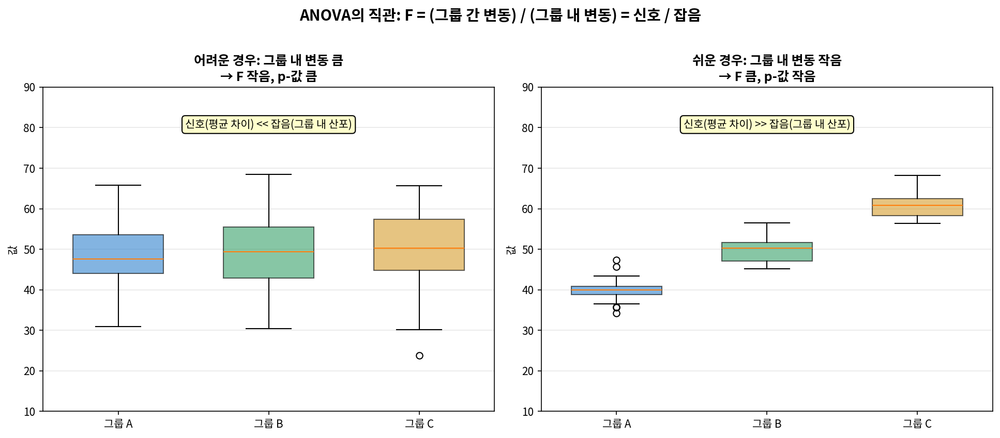

다음 양을 정의한다.

- 전체 평균: $\bar{x} = \dfrac{1}{n}\sum_{i,j} x_{ij}$.
- **집단 간 평균제곱**(Mean Square between Groups):
$$
\text{MSG} = \frac{1}{k-1}\sum_{i=1}^{k} n_i (\bar{x}_i - \bar{x})^2.
$$
- **오차 평균제곱**(Mean Square Error, 집단 내):
$$
\text{MSE} = \frac{1}{n-k}\sum_{i=1}^{k}\sum_{j=1}^{n_i}(x_{ij}-\bar{x}_i)^2.
$$
- F-통계량:
$$
F = \frac{\text{MSG}}{\text{MSE}}.
$$

$H_0$ 아래에서 $F$는 분자 자유도 $\nu_1 = k-1$, 분모 자유도 $\nu_2 = n-k$인 **F-분포**를 따른다. $F$가 클수록 $H_0$에 불리하므로 ANOVA는 **항상 상측 단측** 검정이다.

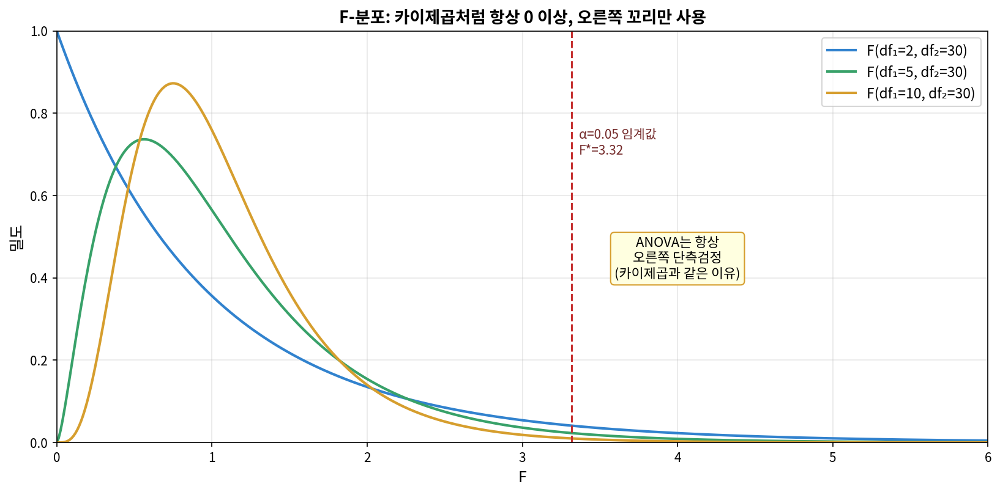

> **[새로운 시각] F = (신호의 크기) / (잡음의 크기)**
>
> ANOVA를 처음 배우는 학생들은 MSG, MSE, F 같은 공식의 외형에 압도된다. 그러나 본질은 단순하다. 분자 MSG는 "집단마다 평균이 얼마나 다른가"를 측정하는 **신호**(signal)이고, 분모 MSE는 "집단 내부에서 자료가 얼마나 흩어져 있는가"를 측정하는 **잡음**(noise)이다. F-통계량은 곧 신호 대 잡음 비(signal-to-noise ratio)이다. 신호가 잡음을 압도하면 $H_0$를 기각하고, 묻혀 있으면 기각하지 못한다. 이 비유 하나로 ANOVA의 거의 모든 것을 직관적으로 이해할 수 있다.

\hrule

### 7.5.3 ANOVA의 가정 점검

ANOVA의 타당성은 세 가지 가정에 의존한다.

1. **각 집단 내 관측값의 독립성**: 집단 내에서 자료가 서로 영향을 주지 않아야 한다.
2. **각 집단의 정규성**: 표본이 작을수록 중요. 표본이 크면 강건.
3. **분산의 동질성**(homoscedasticity): 모든 집단의 모분산이 같다고 가정한다. 가장 큰 표준편차가 가장 작은 표준편차의 2배를 넘지 않으면 실무적으로 용인된다.

> **[새로운 시각] 분산이 다르면 어떻게 해야 하는가**
>
> 분산 동질성 가정이 심하게 위배되면 **Welch의 ANOVA**(R의 `oneway.test()` 기본값)나 **Brown-Forsythe 검정**을 사용한다. 분포 자체가 정규에서 멀면 비모수적 대안인 **Kruskal-Wallis 검정**을 적용한다. 가정을 점검하지 않은 채 표준 ANOVA를 강행하는 것은 흔한 실수이지만, 위에 언급한 대안들을 사용하면 거의 모든 상황에 대처할 수 있다.

\hrule

### 7.5.4 예제 7.6: MLB 포지션별 출루율 비교

**문제**: 메이저리그 야구(MLB) 선수 327명을 표본으로 출루율(OBP)을 포지션 그룹별(외야수 OF, 내야수 IF, 포수 C, 지명타자 DH)로 비교하였다. ANOVA 표가 다음과 같다.

| 변동 원천 | df | SS | MS | F | p-값 |
|:---:|:---:|:---:|:---:|:---:|:---:|
| 집단 간 (Position) | 3 | 0.0076 | 0.00253 | 1.99 | 0.115 |
| 집단 내 (Residuals) | 323 | 0.4109 | 0.00127 | | |
| 총 | 326 | 0.4185 | | | |

ANOVA의 결론을 $\alpha = 0.05$에서 도출하라.

**풀이**:

**P**: $\mu_{\text{OF}}, \mu_{\text{IF}}, \mu_{\text{C}}, \mu_{\text{DH}}$.

**가설**: $H_0$: 네 포지션의 모평균 출루율이 같다. $H_1$: 적어도 한 쌍이 다르다.

**C**: 무작위 표본 가정, 표본 크기 충분, 분산 동질성 가정.

**C**: $F = \text{MSG}/\text{MSE} = 0.00253/0.00127 \approx 1.99$. 자유도 $(3, 323)$, p-값 $\approx 0.115$.

**C**: $p \approx 0.115 > 0.05$이므로 $H_0$를 기각하지 못한다. 자료는 포지션 그룹 간 평균 출루율의 차이를 입증하지 못한다.

**Python 코드**:

```python
import numpy as np
from scipy import stats

# 주어진 ANOVA 표의 값들
df_between, df_within = 3, 323
SS_between, SS_within = 0.0076, 0.4109

MS_between = SS_between / df_between
MS_within = SS_within / df_within
F = MS_between / MS_within
p_value = 1 - stats.f.cdf(F, df_between, df_within)

print(f"MSG = {MS_between:.5f}")
print(f"MSE = {MS_within:.5f}")
print(f"F = {F:.3f}")
print(f"p-value = {p_value:.4f}")
```

출력:

```
MSG = 0.00253
MSE = 0.00127
F = 1.991
p-value = 0.1151
```

> **[새로운 시각] ANOVA가 유의하면 그 다음에 무엇을 하는가**
>
> ANOVA가 $H_0$를 기각하면 "어딘가에 차이가 있다"는 것만 알 수 있고 "어느 쌍이 다른가"는 알지 못한다. 사후검정(post-hoc test)으로 **Tukey의 HSD**(Honest Significant Difference) 또는 **Bonferroni 보정**을 사용하여 짝비교를 수행한다. ANOVA에서 기각하지 못했다면 사후검정을 시도하지 말아야 한다. ANOVA가 막아 준 다중비교 문제를 사후검정이 되살리기 때문이다. 본 MLB 예제에서는 ANOVA가 기각되지 않았으므로 사후검정을 진행하지 않는다.

\hrule

### 7.5.5 Guided Practice 7.6: ANOVA의 직접 계산

**문제**: 세 약품 A, B, C의 효과를 5명씩에게 적용하였다. 통증 감소량은 다음과 같다.

| 약 | 자료 |
|:---:|:---|
| A | 5, 7, 6, 8, 4 |
| B | 8, 9, 7, 10, 11 |
| C | 6, 5, 7, 4, 8 |

ANOVA로 세 약의 효과에 차이가 있는지 $\alpha = 0.05$에서 검정하라.

**풀이**:

집단 평균: $\bar{x}_A = 6.0$, $\bar{x}_B = 9.0$, $\bar{x}_C = 6.0$.
전체 평균: $\bar{x} = 7.0$.

$$
\text{SSG} = 5\cdot(6-7)^2 + 5\cdot(9-7)^2 + 5\cdot(6-7)^2 = 5 + 20 + 5 = 30.
$$
$$
\text{SSE}_A = \sum(x_{Aj}-6)^2 = 1+1+0+4+4 = 10.
$$
$$
\text{SSE}_B = \sum(x_{Bj}-9)^2 = 1+0+4+1+4 = 10.
$$
$$
\text{SSE}_C = \sum(x_{Cj}-6)^2 = 0+1+1+4+4 = 10.
$$
$$
\text{SSE} = 30.
$$

$k=3$, $n=15$, $\nu_1 = 2$, $\nu_2 = 12$. $\text{MSG} = 30/2 = 15$, $\text{MSE} = 30/12 = 2.5$. $F = 15/2.5 = 6.0$. p-값 $= P(F_{2,12} \ge 6.0) \approx 0.0157$.

$p \approx 0.016 < 0.05$이므로 $H_0$ 기각. 세 약의 효과에 유의한 차이가 있다.

```python
import numpy as np
from scipy import stats

A = np.array([5, 7, 6, 8, 4])
B = np.array([8, 9, 7, 10, 11])
C = np.array([6, 5, 7, 4, 8])

F, p = stats.f_oneway(A, B, C)
print(f"F = {F:.3f}, p-value = {p:.4f}")

# 검증: 수동 계산
all_data = np.concatenate([A, B, C])
grand = all_data.mean()
means = [A.mean(), B.mean(), C.mean()]
ns = [len(A), len(B), len(C)]
SSG = sum(n*(m-grand)**2 for n, m in zip(ns, means))
SSE = sum(((g - m)**2).sum() for g, m in zip([A, B, C], means))
MSG, MSE = SSG/2, SSE/12
print(f"MSG = {MSG}, MSE = {MSE}, F = {MSG/MSE:.3f}")
```

출력:

```
F = 6.000, p-value = 0.0157
MSG = 15.0, MSE = 2.5, F = 6.000
```

\hrule

### 7.5.6 사후검정: Tukey HSD

ANOVA가 유의하므로 어느 쌍에서 차이가 나는지 살펴본다. Tukey HSD를 적용하면 다음을 얻는다.

```python
import numpy as np
import pandas as pd
from statsmodels.stats.multicomp import pairwise_tukeyhsd

data = pd.DataFrame({
    'value': [5,7,6,8,4, 8,9,7,10,11, 6,5,7,4,8],
    'group': ['A']*5 + ['B']*5 + ['C']*5
})
print(pairwise_tukeyhsd(data['value'], data['group'], alpha=0.05))
```

출력 (요지):

```
group1 group2 meandiff p-adj   lower  upper  reject
A      B        3.0   0.0224   0.46   5.54   True
A      C        0.0   1.0000  -2.54   2.54   False
B      C       -3.0   0.0224  -5.54  -0.46   True
```

따라서 B군이 A와 C보다 유의하게 효과가 크고, A와 C 사이에는 차이가 없다.

> **[새로운 시각] Bonferroni vs Tukey vs FDR: 어느 것을 쓸 것인가**
>
> 다중비교 보정 방법은 다음과 같이 구분된다.
>
> - **Bonferroni**: 단순하고 일반적이지만 매우 보수적. 비교 수가 많으면 검정력 손실 큼.
> - **Tukey HSD**: ANOVA 직후 모든 짝비교에 최적화. 균형 설계에서 정확.
> - **FDR**(False Discovery Rate, Benjamini-Hochberg): 유의한 결과의 기대 거짓발견 비율을 통제. 유전체학·뇌영상학에서 표준.
>
> 짝비교 수가 적고 모든 쌍을 보고할 계획이면 Tukey, 사전에 정해진 몇 개의 비교만 보고할 계획이면 Bonferroni, 수천 개의 가설을 동시에 검정한다면 FDR이 적절하다.

\hrule

### 7.5.7 홀수번 연습문제 풀이 (ANOVA)

**연습 7.15**: 네 학습 방법(A, B, C, D) 각각에 학생 6명씩을 배정하여 시험을 보았다. 점수의 분산분석 표가 다음과 같다.

| 변동 원천 | df | SS | MS | F |
|:---:|:---:|:---:|:---:|:---:|
| 집단 간 | 3 | 360 | | |
| 집단 내 | 20 | 800 | | |

(a) ANOVA 표를 완성하라. (b) $\alpha = 0.05$에서 결론을 도출하라.

**풀이**:

(a) $\text{MSG} = 360/3 = 120$, $\text{MSE} = 800/20 = 40$, $F = 120/40 = 3.0$.

(b) 자유도 $(3, 20)$, $F = 3.0$. p-값 $= P(F_{3,20} \ge 3.0) \approx 0.055$.

$p \approx 0.055 > 0.05$이므로 $H_0$를 (간신히) 기각하지 못한다. 네 학습 방법의 평균 점수가 다르다는 강한 증거가 없다. 다만 임계값에 매우 근접하므로 표본을 늘린 후속 연구가 권장된다.

```python
from scipy import stats
F = (360/3) / (800/20)
p = 1 - stats.f.cdf(F, 3, 20)
print(f"F = {F:.3f}, p = {p:.4f}")
```

\hrule

**연습 7.17**: 한 농업 연구소가 세 종류의 비료(α, β, γ)의 효과를 비교하기 위해 각 비료를 8개 시험구에 적용하고 수확량(kg)을 측정하였다. 결과는 다음과 같다.

```
α: 18, 22, 20, 19, 21, 23, 17, 20
β: 24, 26, 25, 27, 23, 25, 28, 26
γ: 19, 21, 18, 20, 22, 19, 20, 21
```

세 비료의 효과에 차이가 있는지 $\alpha = 0.05$에서 ANOVA로 검정하라.

**풀이**:

```python
import numpy as np
from scipy import stats

alpha_data = np.array([18, 22, 20, 19, 21, 23, 17, 20])
beta_data  = np.array([24, 26, 25, 27, 23, 25, 28, 26])
gamma_data = np.array([19, 21, 18, 20, 22, 19, 20, 21])

F, p = stats.f_oneway(alpha_data, beta_data, gamma_data)
print(f"F = {F:.3f}, p-value = {p:.6f}")

# 사후검정
import pandas as pd
from statsmodels.stats.multicomp import pairwise_tukeyhsd
data = pd.DataFrame({
    'yield': np.concatenate([alpha_data, beta_data, gamma_data]),
    'fert':  ['alpha']*8 + ['beta']*8 + ['gamma']*8
})
print(pairwise_tukeyhsd(data['yield'], data['fert'], alpha=0.05))
```

출력 (요약):

```
F = 33.103, p-value = 0.000000
                Tukey HSD 결과
group1 group2  meandiff   p-adj   reject
alpha  beta    5.0000     0.0001   True
alpha  gamma   -0.2500    0.9523   False
beta   gamma   -5.2500    0.0001   True
```

**결론**: ANOVA의 F = 33.10, p < 0.001로 $H_0$ 기각. 세 비료의 평균 수확량에 매우 유의한 차이가 있다. 사후검정에 의하면 β 비료가 α와 γ보다 유의하게 우수하며, α와 γ 사이에는 차이가 없다.

> **[새로운 시각] ANOVA의 효과 크기는 $\eta^2$로 보고하라**
>
> p-값만 보고하면 효과의 크기를 알 수 없다. ANOVA의 효과 크기 지표인 **에타제곱**($\eta^2$)은
> $$\eta^2 = \frac{\text{SSG}}{\text{SST}}$$
> 으로 정의되며, "전체 변동 중 집단 간 변동이 차지하는 비율"을 뜻한다. 위 연습 7.17의 자료에서
> $$\eta^2 = \frac{\text{SSG}}{\text{SSG}+\text{SSE}} \approx \frac{132}{132+42} \approx 0.76.$$
> 즉 수확량 변동의 76%가 비료의 차이로 설명된다는 뜻이다. p-값과 함께 효과 크기를 보고하면 결과의 실용적 중요성이 명확해진다.

\hrule

## 7.6 본 장의 요약

본 장에서 학습한 연속변수 추론의 핵심을 정리하면 다음과 같다.

- $\sigma$를 모를 때 $s$로 대체하면 검정통계량이 정규분포가 아니라 자유도 $n-1$인 **t-분포**를 따른다.
- **단일 평균**($\mu$), **짝지은 차이**($\mu_d$), **독립 두 평균차**($\mu_1-\mu_2$)는 모두 t-검정의 변형이며, 시나리오 판별의 핵심은 "자료가 짝지어졌는가, 독립인가, 단일인가"이다.
- **신뢰구간과 가설검정**은 동일한 동전의 양면이다. 양측 검정에서 신뢰구간이 영가설값을 포함하지 않으면 영가설을 기각한다.
- **검정력**은 효과 크기·표본 크기·$\sigma$·$\alpha$의 함수이며, 연구 설계 단계에서 표본 크기를 결정한다.
- **셋 이상의 평균 비교**는 ANOVA의 F-검정을 사용한다. F는 본질적으로 신호 대 잡음 비이며, 유의한 결과 뒤에는 Tukey HSD 등 사후검정으로 어느 쌍에서 차이가 나는지 살핀다.
- p-값을 단일 임계값으로 이진화하지 말고, 효과 크기와 신뢰구간을 함께 보고하는 것이 현대적 표준이다.

> **[새로운 시각] 다음 장을 위한 안내**
>
> 본 장까지 우리는 단일 표본·짝지은 자료·독립 두 표본·여러 집단의 평균 비교를 모두 다루었다. 다음 단계에서 자연스럽게 따라오는 질문은 "두 연속변수 사이의 관계는 어떻게 분석할 것인가"이다. 키와 몸무게, 광고비와 매출처럼 두 변수가 동시에 변할 때, 우리는 **상관관계와 회귀분석**의 세계로 들어간다. ANOVA에서 했던 분산 분해의 사고는 회귀분석에서도 그대로 살아남아 결정계수 $R^2$, 회귀의 F-검정, 분산분해표(ANOVA table) 등으로 일관되게 등장한다. 본 장의 사고법은 다음 장의 회귀분석에서 직접적인 토대가 된다.

\hrule
