# 제8장: 선형 회귀 입문

## 목차

- 8.1 직선 적합, 잔차, 상관관계
- 8.2 최소제곱 회귀
- 8.3 선형 회귀에서의 이상치 유형
- 8.4 선형 회귀에 대한 추론

---

**선형 회귀**(linear regression)는 매우 강력한 통계 기법이다. 많은 사람들이 뉴스에서 산점도 위에 직선이 덧씌워진 것을 보며 회귀에 대해 어느 정도 친숙함을 갖고 있다. **선형 모형**(linear model)은 예측에 사용되거나 두 수치형 변수 사이에 선형 관계가 있는지 평가하는 데 사용될 수 있다.

---

## 8.1 직선 적합, 잔차, 상관관계

직선 적합 과정에 대해 깊이 생각하는 것이 도움이 된다. 이 절에서는 선형 모형의 형태를 정의하고, 좋은 적합이란 무엇인지에 대한 기준을 탐구하며, **상관관계**(correlation)라는 새로운 통계량을 소개한다.

---

### 8.1.1 데이터에 직선 적합하기

그림 8.1은 관계가 직선으로 완벽하게 모형화될 수 있는 두 변수를 보여준다. 직선의 방정식은 다음과 같다:

**y = 5 + 64.96x**

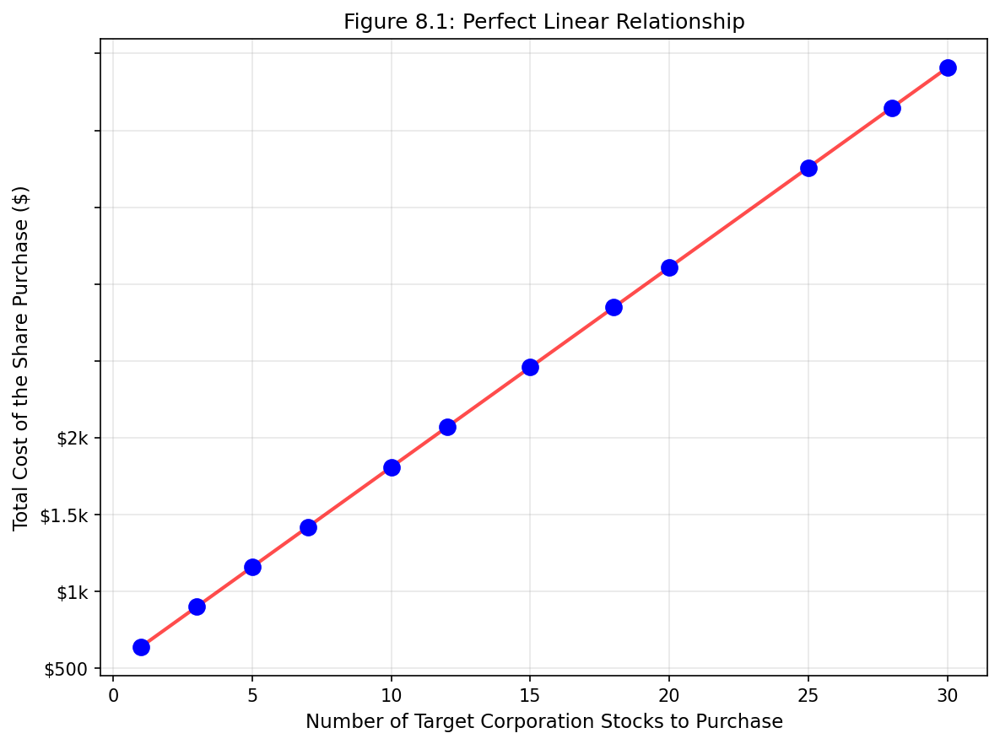

*그림 8.1: Target Corporation 주식 매수 요청. 12명의 개별 구매자가 동시에 거래 회사에 Target Corporation 주식(티커 TGT, 2018년 12월 28일) 매수 요청을 했고, 주식의 총 비용이 보고되었다. 비용이 선형 공식을 사용하여 계산되기 때문에, 선형 적합은 완벽하다.*

완벽한 선형 관계가 의미하는 바를 생각해보자: x의 값만 알면 y의 정확한 값을 알 수 있다. 이것은 거의 모든 자연 과정에서 비현실적이다. 예를 들어, **가족 소득**(x)을 알면 대학이 예비 학생에게 제공할 **재정 지원**(y)에 대한 유용한 정보를 얻을 수 있다. 그러나 가족 재정 외에도 다른 요인들이 재정 지원에 영향을 미치므로 예측은 완벽과는 거리가 멀 것이다.

**선형 회귀**는 두 변수 x와 y 사이의 관계가 약간의 오차를 가진 직선으로 모형화될 수 있는 데이터에 직선을 적합하는 통계적 방법이다:

**y = β₀ + β₁x + ε**

값 β₀와 β₁은 모형의 **모수**(parameters)를 나타내며(β는 그리스 문자 베타), 오차는 ε(그리스 문자 엡실론)로 나타낸다. 모수는 데이터를 사용하여 추정되며, 점추정치를 b₀와 b₁로 쓴다. x를 사용하여 y를 예측할 때, x를 보통 **설명변수**(explanatory variable) 또는 **예측변수**(predictor variable)라고 부르고, y를 **반응변수**(response variable)라고 부른다.

모든 데이터가 직선 위에 완벽하게 놓이는 것은 드문 일이다. 대신, 데이터가 점들의 구름으로 나타나는 것이 더 일반적이다(그림 8.2). 데이터는 직선 주위에 떨어지지만, 관측치 중 어느 것도 정확히 직선 위에 놓이지 않는다.

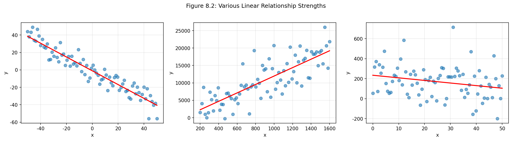

*그림 8.2: 직선으로 모형화하는 것이 유용할 수 있는 세 가지 데이터 세트. 첫 번째 그림은 비교적 강한 하향 선형 추세를 보여주고, 두 번째는 분명하지만 강하지 않은 상향 추세를 보여주며, 마지막 그림은 거의 알아차리기 어려운 매우 약한 하향 추세를 보여준다.*

직선을 적합하는 것이 적절하지 않은 경우도 있다. 그림 8.3은 변수들 사이에 명확한 관계가 있지만 추세가 선형이 아닌 경우를 보여준다.

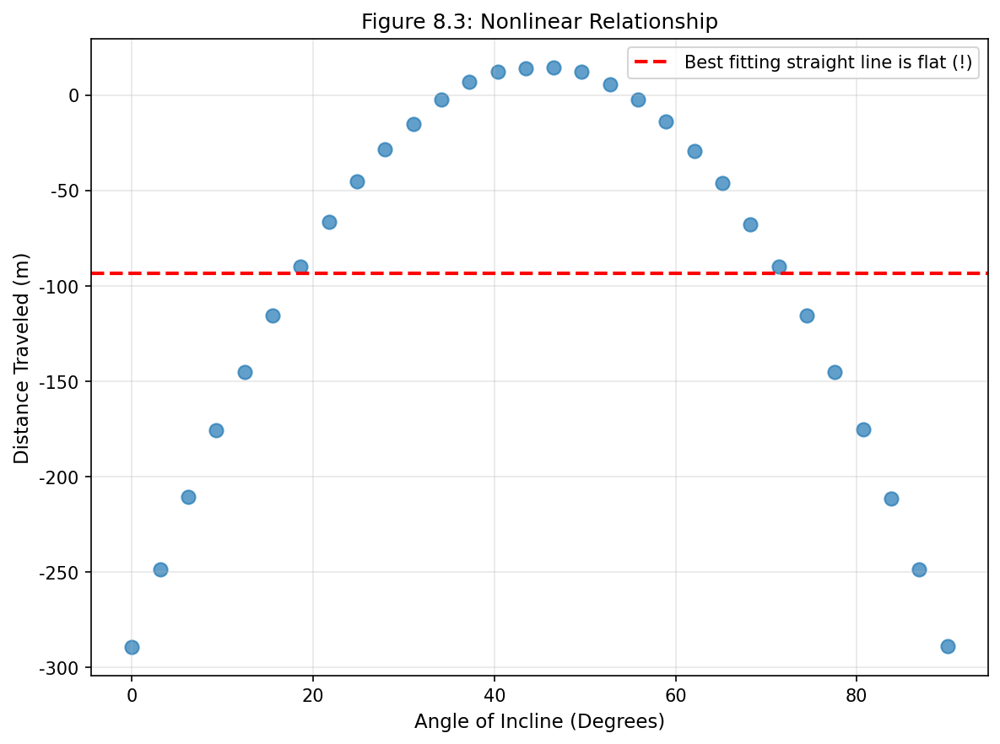

*그림 8.3: 비선형 경우에서 선형 모형은 유용하지 않다. 이 데이터는 입문 물리학 실험에서 나온 것이다.*

---

### 8.1.2 주머니쥐 머리 길이를 예측하기 위한 선형 회귀 사용

**주머니쥐**(brushtail possum)는 호주에 사는 유대류이다. 연구자들은 104마리의 이 동물들을 포획하여 야생으로 다시 방사하기 전에 신체 측정을 했다. 우리는 두 가지 측정값을 고려한다: 각 주머니쥐의 머리부터 꼬리까지의 전체 길이와 머리 길이.

그림 8.5는 주머니쥐의 머리 길이와 전체 길이에 대한 산점도를 보여준다. 머리와 전체 길이 변수는 연관되어 있다: 평균 이상의 전체 길이를 가진 주머니쥐는 평균 이상의 머리 길이를 가지는 경향이 있다.

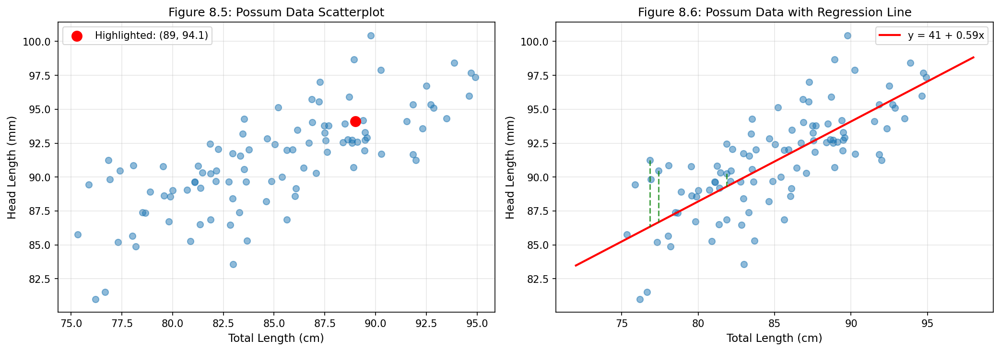

*그림 8.5(왼쪽): 104마리 주머니쥐의 머리 길이 대 전체 길이를 보여주는 산점도. 그림 8.6(오른쪽): 머리 길이와 전체 길이 사이의 관계를 나타내기 위해 합리적인 선형 모형이 적합되었다.*

**산점도**(scatterplot)는 두 수치형 변수 사이의 관계를 보여주며, 산점도에서 나타난 추세를 설명하기 위해 직선을 추가할 수 있다. 직선 적합에서 각 관측치(xᵢ, yᵢ)에 대해 직선 위의 예측값은 다음과 같다:

**ŷᵢ = b₀ + b₁xᵢ**

**ŷ**는 "y-hat"으로 읽으며, 이 표기는 y의 예측값을 나타낸다. "^" 기호는 예측값과 실제 관측값을 구별하는 데 사용된다.

주머니쥐 데이터에 대해 적합한 직선 방정식은 다음과 같다:

**ŷ = 41 + 0.59x**

---

#### 예제 8.1: 주머니쥐 머리 길이 예측

**문제**: 전체 길이가 80cm인 주머니쥐의 머리 길이를 예측하라.

**풀이**: 회귀 방정식 ŷ = 41 + 0.59x에 x = 80을 대입한다.

**단계별 계산:**

1. 방정식 설정: ŷ = 41 + 0.59 × x
2. x = 80 대입: ŷ = 41 + 0.59 × 80
3. 곱셈 수행: ŷ = 41 + 47.2
4. 덧셈 수행: ŷ = **88.2 mm**

전체 길이가 80cm인 주머니쥐의 머리 길이는 약 **88.2mm**로 예측된다. 이 추정치는 평균으로 볼 수 있다: 방정식은 전체 길이가 80cm인 주머니쥐들의 **평균** 머리 길이가 88.2mm일 것으로 예측한다.

```python
# 예제 8.1: 주머니쥐 머리 길이 예측
def predict_head_length(total_length):
    """
    회귀 방정식을 사용하여 머리 길이 예측
    
    매개변수:
        total_length: 주머니쥐 전체 길이 (cm)
    
    반환:
        예측된 머리 길이 (mm)
    """
    b0 = 41      # 절편
    b1 = 0.59    # 기울기
    y_hat = b0 + b1 * total_length
    return y_hat

# 전체 길이가 80cm인 주머니쥐
x = 80
y_hat = predict_head_length(x)

print("=" * 50)
print("예제 8.1: 주머니쥐 머리 길이 예측")
print("=" * 50)
print(f"회귀 방정식: ŷ = 41 + 0.59x")
print(f"전체 길이 (x): {x} cm")
print(f"계산: ŷ = 41 + 0.59 × {x}")
print(f"     = 41 + {0.59 * x}")
print(f"     = {y_hat} mm")
print(f"\n예측 머리 길이: {y_hat} mm")
```

**출력:**
```
==================================================
예제 8.1: 주머니쥐 머리 길이 예측
==================================================
회귀 방정식: ŷ = 41 + 0.59x
전체 길이 (x): 80 cm
계산: ŷ = 41 + 0.59 × 80
     = 41 + 47.2
     = 88.2 mm

예측 머리 길이: 88.2 mm
```

---

#### 안내 실습 8.2: 76cm 주머니쥐 예측

**문제**: 전체 길이가 76cm인 주머니쥐의 머리 길이 예측값은 얼마인가?

**풀이**: 회귀 방정식에 x = 76을 대입한다.

**단계별 계산:**

1. 방정식: ŷ = 41 + 0.59x
2. 대입: ŷ = 41 + 0.59 × 76
3. 계산: ŷ = 41 + 44.84 = **85.84 mm**

```python
# 안내 실습 8.2: 76cm 주머니쥐 예측
x = 76
y_hat = 41 + 0.59 * x

print("=" * 50)
print("안내 실습 8.2: 76cm 주머니쥐 예측")
print("=" * 50)
print(f"전체 길이: {x} cm")
print(f"ŷ = 41 + 0.59 × {x}")
print(f"  = 41 + {0.59 * x:.2f}")
print(f"  = {y_hat:.2f} mm")
```

---

### 8.1.3 잔차

**잔차**(residuals)는 모형 적합 후 데이터에 남은 변동이다:

**데이터 = 적합 + 잔차**

각 관측치는 잔차를 가진다. 관측치가 회귀선 위에 있으면 잔차(관측치에서 직선까지의 수직 거리)는 양수이다. 직선 아래의 관측치는 음의 잔차를 가진다. 올바른 선형 모형을 선택하는 한 가지 목표는 이러한 잔차가 가능한 한 작도록 하는 것이다.

> **잔차: 관측값과 예측값의 차이**
>
> 잔차는 직선에서 관측값이 얼마나 멀리 떨어져 있는지와 그 방향을 나타낸다.
>
> **eᵢ = yᵢ - ŷᵢ**
>
> - **양의 잔차**(eᵢ > 0): 실제값이 예측값보다 크다 → 직선이 **과소예측**(underprediction)
> - **음의 잔차**(eᵢ < 0): 실제값이 예측값보다 작다 → 직선이 **과대예측**(overprediction)

---

#### 예제 8.2: 잔차 계산

**문제**: 한 주머니쥐의 머리 길이가 86.7mm이고 전체 길이가 84cm이다. 이 주머니쥐에 대한 잔차는 얼마인가?

**풀이**: 

**단계 1: 예측값 계산**
- ŷ = 41 + 0.59 × 84
- ŷ = 41 + 49.56
- ŷ = 90.56 mm

**단계 2: 잔차 계산**
- e = y - ŷ
- e = 86.7 - 90.56
- e = **-3.86 mm**

**해석**: 음의 잔차(-3.86mm)는 모형이 이 주머니쥐의 머리 길이를 **과대예측**했음을 의미한다. 실제 머리 길이(86.7mm)는 예측값(90.56mm)보다 약 3.86mm 작다.

```python
# 예제 8.2: 잔차 계산
def calculate_residual(y_observed, x):
    """
    잔차 계산
    
    매개변수:
        y_observed: 실제 관측값
        x: 설명변수 값
    
    반환:
        (예측값, 잔차) 튜플
    """
    b0, b1 = 41, 0.59
    y_hat = b0 + b1 * x
    residual = y_observed - y_hat
    return y_hat, residual

# 주어진 데이터
y_observed = 86.7  # 실제 머리 길이 (mm)
x = 84             # 전체 길이 (cm)

y_hat, e = calculate_residual(y_observed, x)

print("=" * 50)
print("예제 8.2: 잔차 계산")
print("=" * 50)
print(f"실제 머리 길이 (y): {y_observed} mm")
print(f"전체 길이 (x): {x} cm")
print(f"\n단계 1: 예측값 계산")
print(f"ŷ = 41 + 0.59 × {x} = {y_hat:.2f} mm")
print(f"\n단계 2: 잔차 계산")
print(f"e = y - ŷ = {y_observed} - {y_hat:.2f} = {e:.2f} mm")
print(f"\n해석: {'과대예측 (음의 잔차)' if e < 0 else '과소예측 (양의 잔차)'}")
```

**출력:**
```
==================================================
예제 8.2: 잔차 계산
==================================================
실제 머리 길이 (y): 86.7 mm
전체 길이 (x): 84 cm

단계 1: 예측값 계산
ŷ = 41 + 0.59 × 84 = 90.56 mm

단계 2: 잔차 계산
e = y - ŷ = 86.7 - 90.56 = -3.86 mm

해석: 과대예측 (음의 잔차)
```

---

#### 안내 실습 8.3: 또 다른 잔차 계산

**문제**: 한 주머니쥐의 머리 길이가 95.4mm이고 전체 길이가 85cm이다. 이 주머니쥐에 대한 잔차는 얼마인가?

**풀이**:

**단계 1: 예측값 계산**
- ŷ = 41 + 0.59 × 85 = 41 + 50.15 = **91.15 mm**

**단계 2: 잔차 계산**
- e = 95.4 - 91.15 = **4.25 mm**

**해석**: 양의 잔차(4.25mm)는 실제 머리 길이가 예측값보다 크다는 것을 의미한다. 모형이 이 주머니쥐의 머리 길이를 **과소예측**했다.

```python
# 안내 실습 8.3: 또 다른 잔차 계산
y_observed = 95.4  # 실제 머리 길이 (mm)
x = 85             # 전체 길이 (cm)

y_hat = 41 + 0.59 * x
residual = y_observed - y_hat

print("=" * 50)
print("안내 실습 8.3: 또 다른 잔차 계산")
print("=" * 50)
print(f"실제 머리 길이: {y_observed} mm")
print(f"전체 길이: {x} cm")
print(f"예측값: ŷ = 41 + 0.59 × {x} = {y_hat:.2f} mm")
print(f"잔차: e = {y_observed} - {y_hat:.2f} = {residual:.2f} mm")
print(f"해석: {'과소예측' if residual > 0 else '과대예측'}")
```

---

#### 안내 실습 8.4: 잔차 시각적 추정

**문제**: 그림 8.6에서 표시된 세 점의 잔차를 시각적으로 추정하라.

**풀이**: 잔차 그림(residual plot)에서 각 점의 수직 거리를 측정한다. 직선 위의 점은 양의 잔차를, 아래의 점은 음의 잔차를 가진다.

---

#### 잔차 그림

**잔차 그림**(residual plot)은 잔차와 설명변수 x의 관계를 보여주는 산점도이다. 잔차 그림은 선형 모형이 데이터에 적절한지 평가하는 데 유용하다.


*그림 8.7: 그림 8.6 모형에 대한 잔차 그림*

```python
# 잔차 그림 생성 코드
import matplotlib.pyplot as plt
import numpy as np

np.random.seed(123)

# 주머니쥐 데이터 시뮬레이션
total_length = np.random.uniform(75, 95, 50)
head_length = 41 + 0.59 * total_length + np.random.normal(0, 2.5, 50)

# 예측값과 잔차 계산
predicted = 41 + 0.59 * total_length
residuals = head_length - predicted

# 잔차 그림
fig, ax = plt.subplots(figsize=(10, 5))
ax.scatter(total_length, residuals, alpha=0.6, s=50)
ax.axhline(y=0, color='r', linestyle='--', linewidth=2)
ax.set_xlabel('Total Length (cm)')
ax.set_ylabel('Residuals (mm)')
ax.set_title('Residual Plot for Possum Data')
ax.grid(True, alpha=0.3)
plt.tight_layout()
plt.show()
```

---

#### 예제 8.5: 잔차 그림에서 패턴 식별

**문제**: 그림 8.8은 세 개의 산점도와 선형 모형(첫 번째 행), 그리고 해당하는 잔차 그림(두 번째 행)을 보여준다. 잔차에 남아있는 패턴을 식별할 수 있는가?

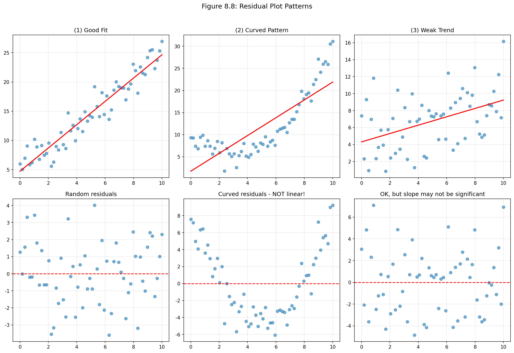

*그림 8.8: 세 개의 데이터 세트와 최적 적합선(위쪽 행) 및 해당 잔차 그림(아래쪽 행)*

**풀이**:

**첫 번째 데이터 세트**(첫 번째 열): 잔차가 명확한 패턴을 보이지 않는다. 잔차는 0을 나타내는 점선 주위에 무작위로 흩어져 있는 것처럼 보인다. 이것은 **좋은 선형 적합**을 나타낸다.

**두 번째 데이터 세트**(두 번째 열): 잔차에 패턴이 나타난다. 산점도에 곡률이 있으며, 이는 잔차 그림에서 더 명확하게 보인다. 이 데이터를 모형화하기 위해 직선을 사용해서는 안 된다. 대신, 더 고급 기법을 적용해야 한다.

**세 번째 데이터 세트**(세 번째 열): 매우 약한 상향 추세를 보이며, 잔차도 명확한 패턴을 보이지 않는다. 데이터에 선형 모형을 적합하려고 시도하는 것은 합리적이다. 그러나 기울기 모수가 0과 통계적으로 유의하게 다른지는 불분명하다.

```python
# 예제 8.5: 잔차 패턴 분석
import numpy as np
import matplotlib.pyplot as plt

np.random.seed(42)

fig, axes = plt.subplots(2, 3, figsize=(15, 10))

# 데이터 1: 좋은 적합
x1 = np.linspace(0, 10, 60)
y1 = 2*x1 + 5 + np.random.normal(0, 2, 60)
z1 = np.polyfit(x1, y1, 1)
r1 = y1 - np.polyval(z1, x1)

axes[0,0].scatter(x1, y1, alpha=0.6)
axes[0,0].plot(x1, np.polyval(z1, x1), 'r-', lw=2)
axes[0,0].set_title('(1) 좋은 적합')

axes[1,0].scatter(x1, r1, alpha=0.6)
axes[1,0].axhline(0, color='r', linestyle='--')
axes[1,0].set_title('무작위 잔차 - 좋음!')

# 데이터 2: 곡선 패턴
x2 = np.linspace(0, 10, 60)
y2 = 0.5*x2**2 - 3*x2 + 10 + np.random.normal(0, 1.5, 60)
z2 = np.polyfit(x2, y2, 1)
r2 = y2 - np.polyval(z2, x2)

axes[0,1].scatter(x2, y2, alpha=0.6)
axes[0,1].plot(x2, np.polyval(z2, x2), 'r-', lw=2)
axes[0,1].set_title('(2) 곡선 패턴')

axes[1,1].scatter(x2, r2, alpha=0.6)
axes[1,1].axhline(0, color='r', linestyle='--')
axes[1,1].set_title('곡선 잔차 - 선형 아님!')

# 데이터 3: 약한 추세
x3 = np.linspace(0, 10, 60)
y3 = 0.3*x3 + 5 + np.random.normal(0, 3, 60)
z3 = np.polyfit(x3, y3, 1)
r3 = y3 - np.polyval(z3, x3)

axes[0,2].scatter(x3, y3, alpha=0.6)
axes[0,2].plot(x3, np.polyval(z3, x3), 'r-', lw=2)
axes[0,2].set_title('(3) 약한 추세')

axes[1,2].scatter(x3, r3, alpha=0.6)
axes[1,2].axhline(0, color='r', linestyle='--')
axes[1,2].set_title('OK, 기울기 유의성 불확실')

for ax in axes.flatten():
    ax.grid(True, alpha=0.3)

plt.tight_layout()
plt.show()
```

---

### 8.1.4 상관관계로 선형 관계 설명하기

강한 선형 관계를 가진 그림과 매우 약한 선형 관계를 가진 그림을 보았다. 이러한 선형 관계의 강도를 통계량으로 정량화할 수 있다면 유용할 것이다.

> **상관관계: 선형 관계의 강도**
>
> **상관관계**(correlation)는 항상 -1과 1 사이의 값을 가지며, 두 변수 사이의 선형 관계의 강도를 설명한다. 상관관계를 **R**로 표기한다.

상관계수는 공식을 사용하여 계산할 수 있다:

**R = (1/(n-1)) × Σᵢ[(xᵢ - x̄)/sₓ × (yᵢ - ȳ)/sᵧ]**

여기서 x̄, ȳ는 표본평균이고, sₓ, sᵧ는 각 변수의 표본표준편차이다.

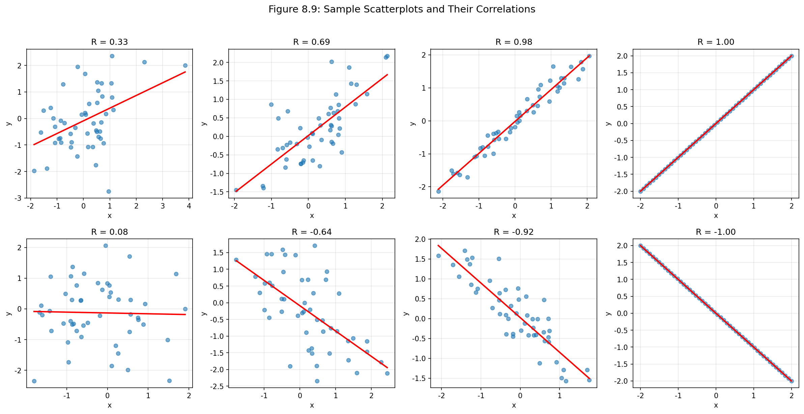

*그림 8.9: 표본 산점도와 상관계수. 첫 번째 행은 양의 관계(오른쪽 위로 향하는 추세)를 보여주고, 두 번째 행은 대략 중립적인 추세 하나와 음의 추세 세 개를 보여준다.*

---

#### 상관계수 해석 지침

| R 값 범위 | 해석 |
|:---:|:---|
| R = 1 | 완벽한 양의 선형 관계 |
| 0.7 ≤ R < 1 | 강한 양의 선형 관계 |
| 0.3 ≤ R < 0.7 | 중간 정도의 양의 선형 관계 |
| 0 < R < 0.3 | 약한 양의 선형 관계 |
| R = 0 | 선형 관계 없음 |
| -0.3 < R < 0 | 약한 음의 선형 관계 |
| -0.7 < R ≤ -0.3 | 중간 정도의 음의 선형 관계 |
| -1 < R ≤ -0.7 | 강한 음의 선형 관계 |
| R = -1 | 완벽한 음의 선형 관계 |

상관관계는 **선형 추세의 강도**를 정량화하려는 것이다. 강할 때도 비선형 추세는 때때로 관계의 강도를 반영하지 않는 상관관계를 생성한다(그림 8.10 참조).

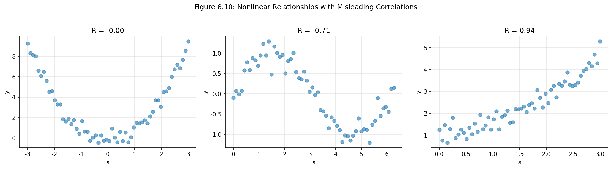

*그림 8.10: 표본 산점도와 상관계수. 각 경우에 변수들 사이에 강한 관계가 있지만, 관계가 비선형이기 때문에 상관관계는 비교적 약하다.*

---

#### 안내 실습 8.5: 상관관계 식별

**문제**: 그림에서 양의 상관관계 또는 음의 상관관계를 나타내는지 식별하라. 또한 상관관계가 약한지, 보통인지, 강한지 결정하라.

**풀이**: 두 변수의 추세를 살펴본다:
- **상향 추세**(오른쪽으로 갈수록 위로): 양의 상관관계
- **하향 추세**(오른쪽으로 갈수록 아래로): 음의 상관관계
- 점들이 직선 주위에 얼마나 **밀집**해 있는지에 따라 강도 결정

```python
# 안내 실습 8.5: 상관관계 계산
import numpy as np

def calculate_correlation(x, y):
    """두 변수의 상관계수 계산"""
    n = len(x)
    x_mean, y_mean = np.mean(x), np.mean(y)
    x_std, y_std = np.std(x, ddof=1), np.std(y, ddof=1)
    
    # 상관계수 공식 적용
    r = np.sum((x - x_mean) * (y - y_mean)) / ((n-1) * x_std * y_std)
    return r

# 예시 데이터
np.random.seed(42)
x = np.linspace(0, 10, 30)

# 강한 양의 관계
y_strong_pos = 2*x + np.random.normal(0, 1, 30)
r1 = calculate_correlation(x, y_strong_pos)
print(f"강한 양의 관계: R = {r1:.3f}")

# 약한 음의 관계
y_weak_neg = -0.3*x + 5 + np.random.normal(0, 3, 30)
r2 = calculate_correlation(x, y_weak_neg)
print(f"약한 음의 관계: R = {r2:.3f}")

# 관계 없음
y_none = np.random.normal(5, 2, 30)
r3 = calculate_correlation(x, y_none)
print(f"관계 없음: R = {r3:.3f}")
```

---

#### 안내 실습 8.6: 상관관계의 한계

**문제**: 상관계수가 비선형 관계의 강도를 측정하지 못하는 이유는 무엇인가?

**풀이**: 상관계수는 **선형 관계만** 측정하도록 설계되었다. 

- U자형, 포물선, 지수, 로그 등 **비선형 관계**에서는 상관계수가 0에 가까울 수 있지만, 실제로는 매우 강한 관계가 존재할 수 있다
- 예를 들어, 완벽한 포물선 관계(y = x²)의 상관계수는 **0에 가깝다**
- 그림 8.10은 이러한 예시를 보여준다

---

#### 안내 실습 8.7: 엘름허스트 데이터의 상관관계

**문제**: 엘름허스트 데이터에서 가족 소득이 높을수록 장학금이 낮아지는 경향이 있다. 이 상관관계는 양인가 음인가?

**풀이**: 가족 소득이 **증가**하면 장학금이 **감소**하므로, 상관관계는 **음**(negative)이다.

실제로 엘름허스트 데이터의 상관계수는 **R = -0.499**이다.

```python
# 안내 실습 8.7: 엘름허스트 데이터 상관관계
# 가족 소득이 높을수록 장학금이 낮아지는 경향

R = -0.499
print(f"엘름허스트 데이터 상관계수: R = {R}")
print(f"해석: 음의 상관관계 (소득 증가 → 장학금 감소)")
print(f"관계 강도: 중간 정도 (|R| = {abs(R):.3f})")
```

---

> **새로운 시각: 상관관계 ≠ 인과관계**
>
> 통계학에서 가장 중요한 원칙 중 하나는 **"상관관계가 인과관계를 의미하지 않는다"**(Correlation does not imply causation)는 것이다.
>
> 두 변수 사이에 강한 상관관계가 있다고 해서 한 변수가 다른 변수를 "유발"한다고 결론 내릴 수 없다.
>
> **예시:**
> - 아이스크림 판매량과 익사 사고 사이에 양의 상관관계가 있다 (둘 다 여름에 증가)
> - 하지만 아이스크림이 익사를 유발하는 것은 아니다!
> - **공통 원인**(confounding variable): 더운 날씨가 두 변수에 모두 영향을 미친다
>
> **인과관계를 확립하려면:**
> 1. **무작위 대조 실험**(randomized controlled experiment)이 필요
> 2. 또는 관측 연구에서 교란변수를 통제하는 고급 기법 사용
>
> 회귀분석 결과를 해석할 때 항상 이 점을 명심해야 한다.

---

## 8.1절 연습문제

### 연습문제 8.1: 잔차 시각화

**문제**: 아래 산점도에는 회귀선이 중첩되어 있다. 각각에 대해 잔차 그림(잔차 대 x)을 구성한다면 어떻게 보일지 설명하라.

**풀이**:

(a) 잔차가 0 주위에 **무작위로 흩어져** 있을 것이다. 왼쪽에서 약간 양의 잔차가 있고, 중간과 오른쪽에서 음과 양의 잔차가 혼합되어 있다.

(b) 잔차가 0 주위에 대칭적으로 흩어져 있을 것이며, **명확한 패턴이 없다**.

```python
# 연습문제 8.1: 잔차 시각화
import numpy as np
import matplotlib.pyplot as plt

np.random.seed(42)

# 데이터 생성
x = np.linspace(0, 10, 50)
y = 2*x + 5 + np.random.normal(0, 2, 50)

# 회귀선 적합
z = np.polyfit(x, y, 1)
y_pred = np.polyval(z, x)
residuals = y - y_pred

fig, axes = plt.subplots(1, 2, figsize=(12, 4))

# 산점도와 회귀선
axes[0].scatter(x, y, alpha=0.6)
axes[0].plot(x, y_pred, 'r-', lw=2)
axes[0].set_title('산점도와 회귀선')
axes[0].set_xlabel('x')
axes[0].set_ylabel('y')
axes[0].grid(True, alpha=0.3)

# 잔차 그림
axes[1].scatter(x, residuals, alpha=0.6)
axes[1].axhline(0, color='r', linestyle='--', lw=2)
axes[1].set_title('잔차 그림')
axes[1].set_xlabel('x')
axes[1].set_ylabel('잔차')
axes[1].grid(True, alpha=0.3)

plt.tight_layout()
plt.show()

print("잔차 그림 해석:")
print("- 점들이 0 주위에 무작위로 흩어져 있음")
print("- 명확한 패턴 없음 → 선형 모형이 적절함")
```

---

### 연습문제 8.3: 신체 측정, 파트 I

**문제**: 신체 측정 데이터에서 어깨 둘레(cm)로부터 키(cm)를 예측하는 모형을 적합했다. 아래의 잔차 그림은 어깨 둘레를 이용하여 키를 예측하기 위한 선형 모형을 적합하는 것에 대해 무엇을 나타내는가?

**풀이**: 잔차 그림을 검토하여 다음을 확인해야 한다:

1. **선형성**: 곡선 패턴이 있는가?
2. **등분산성**: 변동성이 일정한가?
3. **정규성**: 잔차가 0 주위에 대칭적으로 분포하는가?

만약 잔차 그림에서:
- 점들이 0 주위에 **무작위로 흩어져** 있고
- **명확한 패턴이 없으며**
- 변동성이 **대략 일정**하다면

→ 선형 모형이 **적절**하다고 판단할 수 있다.

---

### 연습문제 8.5: 고양이, 파트 I

**문제**: 산점도는 144마리 가정용 고양이의 심장 무게(g)와 체중(kg) 사이의 관계를 보여준다.

(a) 체중과 심장 무게 사이의 관계를 설명하라.
(b) 데이터가 최소제곱 회귀선을 적합하기 위한 조건을 만족하는지 설명하라.

**풀이**:

**(a) 관계 설명**:
- 체중과 심장 무게 사이에 **양의 중간 정도에서 강한 선형 관계**가 있는 것으로 보인다
- 체중이 증가함에 따라 심장 무게도 **증가하는 경향**이 있다
- 관계가 선형으로 보이며, 명확한 곡률이 없다

**(b) 조건 확인**:

| 조건 | 확인 방법 |
|:---|:---|
| **선형성** | 산점도에서 선형 추세가 보인다 ✓ |
| **정규 잔차** | 잔차 히스토그램이나 Q-Q 그림 필요 |
| **등분산성** | 잔차 그림에서 팬 모양이 없어야 함 |
| **독립 관측치** | 각 고양이가 독립적으로 선택됨 ✓ |

```python
# 연습문제 8.5: 고양이 데이터 분석
import numpy as np
import matplotlib.pyplot as plt

np.random.seed(42)

# 고양이 데이터 시뮬레이션
n = 144
body_weight = np.random.uniform(2, 4, n)  # 체중 (kg)
heart_weight = 0.5 + 3.5 * body_weight + np.random.normal(0, 0.8, n)  # 심장 무게 (g)

# 상관계수 계산
r = np.corrcoef(body_weight, heart_weight)[0, 1]

fig, axes = plt.subplots(1, 2, figsize=(12, 5))

# 산점도
axes[0].scatter(body_weight, heart_weight, alpha=0.5, s=30)
z = np.polyfit(body_weight, heart_weight, 1)
x_line = np.linspace(body_weight.min(), body_weight.max(), 100)
axes[0].plot(x_line, np.polyval(z, x_line), 'r-', lw=2)
axes[0].set_xlabel('체중 (kg)')
axes[0].set_ylabel('심장 무게 (g)')
axes[0].set_title(f'고양이: 체중 vs 심장 무게 (R = {r:.3f})')
axes[0].grid(True, alpha=0.3)

# 잔차 그림
residuals = heart_weight - np.polyval(z, body_weight)
axes[1].scatter(body_weight, residuals, alpha=0.5, s=30)
axes[1].axhline(0, color='r', linestyle='--', lw=2)
axes[1].set_xlabel('체중 (kg)')
axes[1].set_ylabel('잔차 (g)')
axes[1].set_title('잔차 그림')
axes[1].grid(True, alpha=0.3)

plt.tight_layout()
plt.show()

print(f"상관계수: R = {r:.3f}")
print(f"관계: 강한 양의 선형 관계")
```

---

### 연습문제 8.7: 상관관계 매칭

**문제**: 각 상관관계를 해당 산점도에 매칭하라.

(a) r = 0.7    (b) r = 0.45    (c) r = 0.06    (d) r = 0.92

**풀이 가이드**:

| 상관계수 | 특징 |
|:---:|:---|
| **r = 0.92** | 가장 강한 양의 관계, 점들이 직선에 가장 가깝게 밀집 |
| **r = 0.7** | 강한 양의 관계, 약간의 흩어짐 |
| **r = 0.45** | 중간 정도의 양의 관계 |
| **r = 0.06** | 거의 선형 관계 없음, 무작위로 흩어짐 |

```python
# 연습문제 8.7: 상관관계 매칭
import numpy as np
import matplotlib.pyplot as plt

def generate_corr_data(r, n=50):
    """특정 상관계수를 갖는 데이터 생성"""
    x = np.random.normal(0, 1, n)
    y = r * x + np.sqrt(1 - r**2) * np.random.normal(0, 1, n)
    return x, y

np.random.seed(42)

correlations = [0.92, 0.7, 0.45, 0.06]
fig, axes = plt.subplots(1, 4, figsize=(16, 4))

for i, r in enumerate(correlations):
    x, y = generate_corr_data(r)
    actual_r = np.corrcoef(x, y)[0, 1]
    
    axes[i].scatter(x, y, alpha=0.6, s=30)
    axes[i].set_title(f'R = {actual_r:.2f}')
    axes[i].grid(True, alpha=0.3)
    
plt.suptitle('상관관계 매칭: 다양한 R 값', fontsize=12)
plt.tight_layout()
plt.show()

print("매칭 전략:")
print("1. R ≈ 1: 점들이 직선에 거의 정확히 놓임")
print("2. R ≈ 0.7-0.9: 강한 추세, 약간의 흩어짐")
print("3. R ≈ 0.3-0.5: 추세 보이지만 상당한 흩어짐")
print("4. R ≈ 0: 추세 없음, 무작위")
```


---

## 8.2 최소제곱 회귀

눈으로 선형 모형을 적합하는 것은 개인의 선호에 기반하기 때문에 비판에 열려 있다. 이 절에서는 더 엄격한 접근법인 **최소제곱 회귀**(least squares regression)를 사용한다.

### 8.2.1 엘름허스트 대학 신입생에 대한 장학금

이 절에서는 일리노이주 **엘름허스트 대학**(Elmhurst College) 신입생 반의 50명 학생 무작위 표본에서 가족 소득과 장학금 데이터를 고려한다.

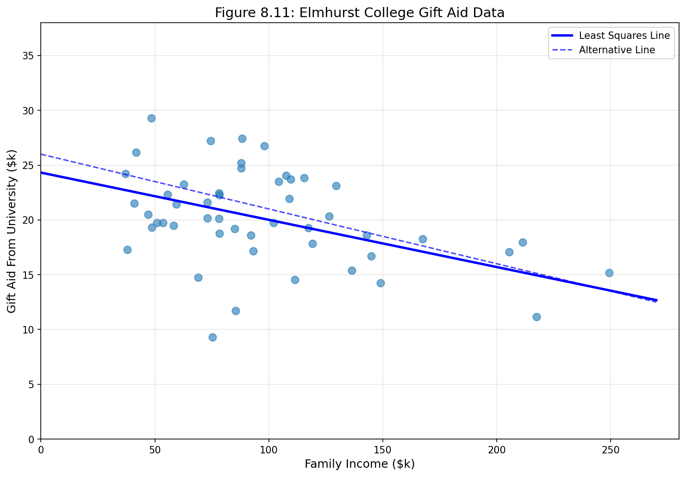

*그림 8.11: 엘름허스트 대학 신입생 반 50명의 무작위 표본에 대한 장학금과 가족 소득*

### 8.2.2 최적의 직선을 찾기 위한 객관적 측도

**최소제곱 기준**: e₁² + e₂² + ... + eₙ² 를 최소화하는 직선

### 8.2.3 최소제곱선을 위한 조건

> **최소제곱 회귀의 4가지 조건**
>
> 1. **선형성**(Linearity): 데이터가 선형 추세를 보여야 한다
> 2. **거의 정규인 잔차**(Nearly normal residuals): 잔차가 거의 정규분포를 따라야 한다
> 3. **등분산성**(Constant variability): 최소제곱선 주위의 변동성이 대략 일정해야 한다
> 4. **독립 관측치**(Independent observations): 관측치들이 서로 독립이어야 한다

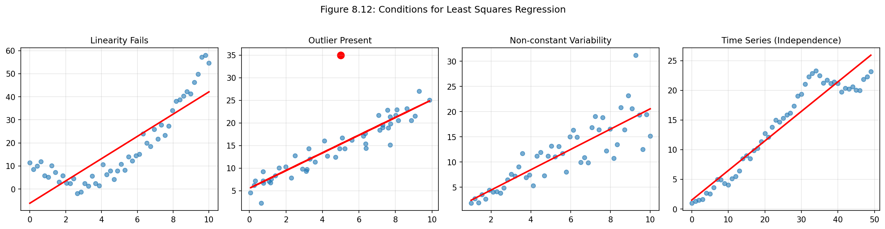

*그림 8.12: 최소제곱 회귀 조건 위반 예시*

#### 안내 실습 8.8: 엘름허스트 데이터 조건 확인

**문제**: 엘름허스트 데이터에 최소제곱 회귀를 적용하는 것에 대해 우려가 있어야 하는가?

**풀이**: 
- 추세가 **선형**으로 보인다
- 데이터가 직선 주위에 떨어지며 명확한 **이상치가 없다**
- 분산이 **대략 일정**하다
- **시계열 관측치가 아니다**

→ 최소제곱 회귀를 **적용할 수 있다**

### 8.2.4 최소제곱선 구하기

> **최소제곱선 식별 방법**
>
> 1. **기울기 추정**: b₁ = (sᵧ / sₓ) × R
> 2. **절편 추정**: b₀ = ȳ - b₁ × x̄
>
> (직선이 점 (x̄, ȳ)를 지남)

**엘름허스트 데이터 요약 통계량:**

| 변수 | 평균 | 표준편차 |
|:---|---:|---:|
| 가족 소득 (x) | $101,780 | $63,200 |
| 장학금 (y) | $19,940 | $5,460 |
| 상관계수 R | -0.499 | |

#### 예제 8.8: 기울기 계산

**문제**: 회귀선의 기울기를 계산하라.

**풀이**: 

b₁ = (sᵧ / sₓ) × R = (5460 / 63200) × (-0.499) = **-0.0431**

```python
# 예제 8.8: 기울기 계산
R = -0.499
s_y = 5460
s_x = 63200

b1 = (s_y / s_x) * R
print(f"기울기: b₁ = ({s_y}/{s_x}) × {R} = {b1:.4f}")
```

#### 예제 8.9: 절편 계산

**문제**: 절편을 계산하라.

**풀이**:

b₀ = ȳ - b₁ × x̄ = 19940 - (-0.0431) × 101780 = **24,327**

회귀 방정식: **ŷ = 24,327 - 0.0431 × x**

```python
# 예제 8.9: 절편 계산
y_mean = 19940
x_mean = 101780
b1 = -0.0431

b0 = y_mean - b1 * x_mean
print(f"절편: b₀ = {y_mean} - ({b1}) × {x_mean} = {b0:.0f}")
print(f"회귀 방정식: ŷ = {b0:.0f} - 0.0431 × x")
```

### 8.2.5 회귀 모형 모수 추정치 해석

> **절편과 기울기 해석**
>
> - **절편**(b₀): x = 0일 때 y의 예측값
> - **기울기**(b₁): x가 1단위 증가할 때 y의 예측된 평균 변화량

#### 예제 8.10: 기울기 해석

**문제**: 모형에서 기울기를 해석하라.

**풀이**: 가족 소득이 **$1,000 증가**할 때마다, 장학금은 평균적으로 **$43.10 감소**할 것으로 예상된다.

```python
# 예제 8.10: 기울기 해석
b1 = -0.0431
change_per_1000 = b1 * 1000
print(f"가족 소득 $1,000 증가 → 장학금 ${abs(change_per_1000):.2f} 감소")
```

### 8.2.6 외삽의 위험성

> **외삽**(Extrapolation)
>
> 원래 데이터의 범위 밖의 값에 모형 추정치를 적용하는 것

#### 예제 8.14: 외삽의 위험성

**문제**: 가족 소득이 $1,000,000인 학생의 장학금을 추정하라.

**풀이**:

ŷ = 24,319 - 0.0431 × 1,000,000 = **-$18,781**

음의 장학금은 불가능하다! 이것이 **외삽의 위험성**이다.

```python
# 예제 8.14: 외삽의 위험성
def predict_aid(income):
    return 24319 - 0.0431 * income

# 데이터 범위 내 (적절)
print(f"소득 $100,000 → 장학금 ${predict_aid(100000):,.0f}")

# 외삽 (위험!)
print(f"소득 $1,000,000 → 장학금 ${predict_aid(1000000):,.0f}")
print("⚠️ 음의 장학금은 불가능!")
```

### 8.2.7 R²를 사용하여 적합의 강도 설명하기

> **R² **(결정계수)
>
> 모형에 의해 설명되는 반응변수의 변동 비율
>
> R² = 1 - (잔차 분산) / (y 분산)

**엘름허스트 데이터**: R = -0.499 → R² = 0.25 (25%)

#### 안내 실습 8.15: R² 계산

**문제**: 상관계수가 -0.97이면 설명되는 변동은 얼마인가?

**풀이**: R² = (-0.97)² = **0.94** (94%)

```python
# 안내 실습 8.15: R² 계산
R = -0.97
R_squared = R ** 2
print(f"R = {R}")
print(f"R² = {R_squared:.4f} ({R_squared*100:.1f}%)")
```

### 8.2.8 두 수준의 범주형 예측변수

**지시변수**(indicator variable)를 사용하여 범주형 변수를 수치로 변환한다.

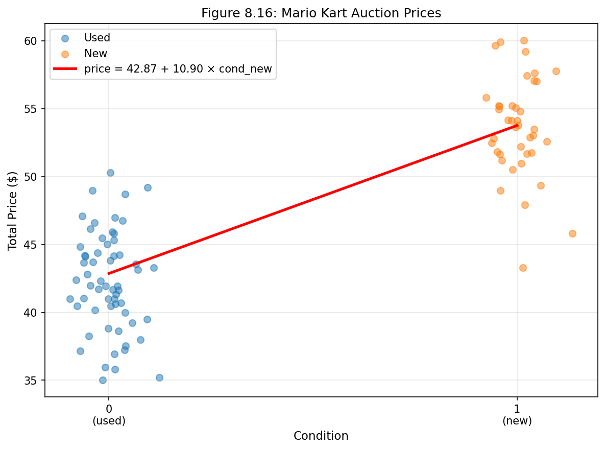

*그림 8.16: 마리오 카트 경매 가격 (중고 vs 새 것)*

모형: **ŷ = 42.87 + 10.90 × cond_new**

#### 예제 8.16: 범주형 예측변수 해석

**풀이**:
- **절편**(42.87): 중고 게임의 평균 가격 = $42.87
- **기울기**(10.90): 새 게임은 중고보다 평균 $10.90 더 비쌈

```python
# 예제 8.16: 범주형 예측변수
def predict_price(is_new):
    return 42.87 + 10.90 * is_new

print(f"중고 게임: ${predict_price(0):.2f}")
print(f"새 게임: ${predict_price(1):.2f}")
print(f"차이: ${10.90:.2f}")
```

---

## 8.3 선형 회귀에서의 이상치 유형

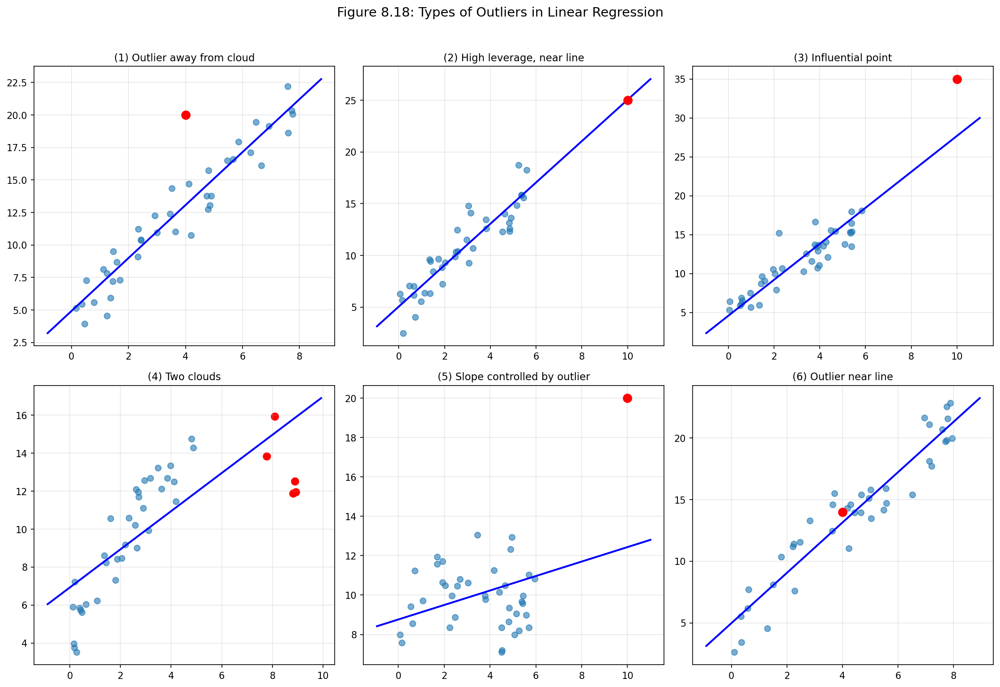

*그림 8.18: 선형 회귀에서의 다양한 이상치 유형*

> **이상치 유형**
>
> 1. **높은 지렛대 점**(High leverage): x 방향으로 데이터 중심에서 멀리 떨어진 점
> 2. **영향력 있는 점**(Influential point): 회귀선의 기울기에 상당한 영향을 미치는 점
> 3. **이상치**(Outlier): 다른 점들의 패턴에서 벗어난 점

**이상치 처리 원칙**: 매우 좋은 이유 없이는 이상치를 제거하지 말라!

---

## 8.4 선형 회귀에 대한 추론

### 8.4.1 중간선거와 실업률

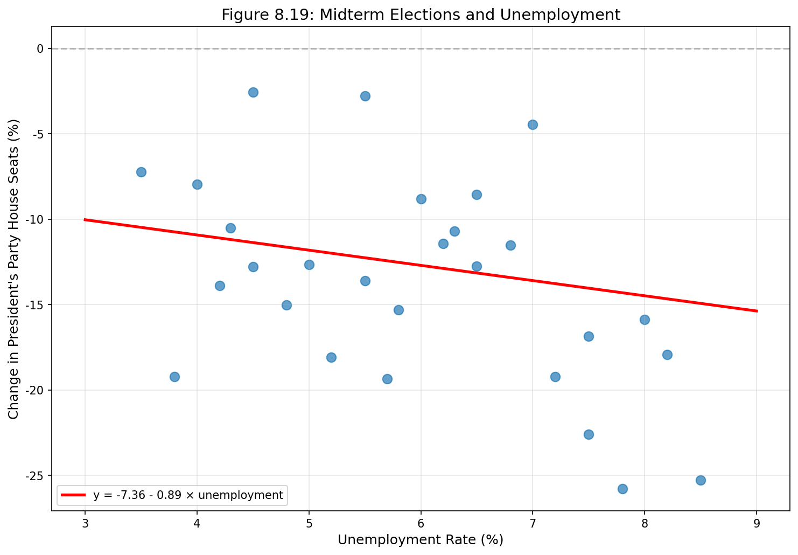

*그림 8.19: 중간선거와 실업률*

**가설 검정**:
- H₀: β₁ = 0 (기울기가 0)
- Hₐ: β₁ ≠ 0 (기울기가 0이 아님)

### 8.4.2 소프트웨어의 회귀 출력 이해하기

**엘름허스트 데이터 회귀 출력:**

| 변수 | Estimate | Std. Error | t value | Pr(>t) |
|:---|---:|---:|---:|---:|
| (Intercept) | 24319.3 | 1291.5 | 18.83 | <0.0001 |
| family_income | -0.0431 | 0.0108 | -3.98 | 0.0002 |

df = 48

**검정 통계량**: T = (b₁ - 0) / SE = (-0.0431 - 0) / 0.0108 = -3.98

**p-값** = 0.0002 < 0.05 → **H₀ 기각**

결론: 가족 소득과 장학금은 유의하게 관련되어 있다.

### 8.4.3 계수에 대한 신뢰구간

> **신뢰구간 공식**
>
> bᵢ ± t*_df × SE_bᵢ

#### 예제 8.23: 95% 신뢰구간

**풀이**:
- 점추정치: -0.0431
- SE = 0.0108
- t*₄₈ = 2.01

**95% CI**: -0.0431 ± 2.01 × 0.0108 = **(-0.0648, -0.0214)**

```python
# 예제 8.23: 신뢰구간 계산
from scipy import stats

b1 = -0.0431
se = 0.0108
df = 48
confidence = 0.95

t_star = stats.t.ppf(1 - (1-confidence)/2, df)
margin = t_star * se

lower = b1 - margin
upper = b1 + margin

print(f"95% 신뢰구간: ({lower:.4f}, {upper:.4f})")
```

---

## 8절 연습문제 풀이 (홀수번)

### 연습문제 8.1: 잔차 시각화

**문제**: 산점도에 회귀선이 중첩되어 있다. 잔차 그림을 구성한다면 어떻게 보일지 설명하라.

**풀이**: 
- (a) 잔차가 0 주위에 무작위로 흩어져 있을 것이다
- (b) 잔차에 특별한 패턴이 없을 것이다

```python
# 연습문제 8.1
import numpy as np
import matplotlib.pyplot as plt

np.random.seed(42)
x = np.linspace(0, 10, 50)
y = 2*x + 5 + np.random.normal(0, 2, 50)

z = np.polyfit(x, y, 1)
residuals = y - np.polyval(z, x)

fig, axes = plt.subplots(1, 2, figsize=(12, 4))
axes[0].scatter(x, y, alpha=0.6)
axes[0].plot(x, np.polyval(z, x), 'r-', lw=2)
axes[0].set_title('산점도와 회귀선')

axes[1].scatter(x, residuals, alpha=0.6)
axes[1].axhline(0, color='r', linestyle='--')
axes[1].set_title('잔차 그림: 무작위 분포')
plt.tight_layout()
plt.show()
```

---

### 연습문제 8.3: 신체 측정

**문제**: 어깨 둘레로 키를 예측하는 모형의 잔차 그림이 무엇을 나타내는가?

**풀이**: 잔차가 0 주위에 대칭적으로 무작위하게 흩어져 있으면 선형 모형이 적절하다.

---

### 연습문제 8.5: 고양이

**문제**: (a) 관계 설명 (b) 조건 확인

**풀이**:

(a) 체중과 심장 무게 사이에 **양의 강한 선형 관계**가 있다

(b) 조건 확인:
- 선형성 ✓
- 정규 잔차: 확인 필요
- 등분산성 ✓
- 독립성 ✓

```python
# 연습문제 8.5: 고양이 데이터
import numpy as np

np.random.seed(42)
n = 144
body_weight = np.random.uniform(2, 4, n)
heart_weight = 0.5 + 3.5 * body_weight + np.random.normal(0, 0.8, n)

r = np.corrcoef(body_weight, heart_weight)[0, 1]
print(f"상관계수: R = {r:.3f}")
print(f"해석: 강한 양의 선형 관계")
```

---

### 연습문제 8.7: 상관관계 매칭

**문제**: r = 0.7, 0.45, 0.06, 0.92를 산점도에 매칭

**풀이**:
- r = 0.92: 가장 밀집된 상향 추세
- r = 0.7: 강한 상향 추세
- r = 0.45: 중간 상향 추세
- r = 0.06: 거의 추세 없음

---

### 연습문제 8.23: Coast Starlight, 파트 II

**문제**: 
- 평균 이동 시간: 129분, SD: 113분
- 평균 거리: 108마일, SD: 99마일
- R = 0.636

(a) 회귀선 방정식 작성
(b) 기울기와 절편 해석
(c) R² 계산
(d) 103마일 이동 시간 예측
(e) 잔차 계산 (실제 168분)
(f) 500마일 예측이 적절한가?

**풀이**:

**(a) 회귀선 방정식**:

```python
# 연습문제 8.23 풀이
y_mean, s_y = 129, 113  # 이동 시간
x_mean, s_x = 108, 99   # 거리
R = 0.636

# 기울기
b1 = R * (s_y / s_x)
print(f"(a) 기울기: b₁ = {R} × ({s_y}/{s_x}) = {b1:.3f}")

# 절편
b0 = y_mean - b1 * x_mean
print(f"    절편: b₀ = {y_mean} - {b1:.3f} × {x_mean} = {b0:.1f}")
print(f"    회귀선: ŷ = {b0:.1f} + {b1:.3f}x")

# (b) 해석
print(f"\n(b) 기울기: 거리 1마일 증가 → 시간 {b1:.3f}분 증가")
print(f"    절편: 거리 0마일일 때 시간 {b0:.1f}분 (의미 없음)")

# (c) R²
R_squared = R ** 2
print(f"\n(c) R² = {R_squared:.3f} ({R_squared*100:.1f}%)")

# (d) 103마일 예측
distance = 103
predicted = b0 + b1 * distance
print(f"\n(d) 103마일 예측: {predicted:.1f}분")

# (e) 잔차
actual = 168
residual = actual - predicted
print(f"\n(e) 잔차: {actual} - {predicted:.1f} = {residual:.1f}분")
print(f"    해석: 실제 시간이 예측보다 {residual:.1f}분 더 걸림")

# (f) 500마일 예측
print(f"\n(f) 500마일 예측은 적절하지 않음 (외삽)")
print(f"    데이터 범위를 벗어나므로 신뢰할 수 없음")
```

---

### 연습문제 8.25: 살인과 빈곤, 파트 I

**회귀 출력:**

| 변수 | Estimate | Std. Error | t value | Pr(>t) |
|:---|---:|---:|---:|---:|
| (Intercept) | -29.901 | 7.789 | -3.839 | 0.001 |
| poverty% | 2.559 | 0.390 | 6.562 | 0.000 |

R² = 70.52%

**풀이**:

```python
# 연습문제 8.25 풀이
import numpy as np

b0 = -29.901
b1 = 2.559
R_squared = 0.7052

print("(a) 선형 모형:")
print(f"    ŷ = {b0} + {b1} × 빈곤율%")

print(f"\n(b) 절편: {b0}")
print("    빈곤율 0%일 때 살인율 = -29.9 (의미 없음)")

print(f"\n(c) 기울기: {b1}")
print("    빈곤율 1% 증가 → 살인율 2.559건 증가")

print(f"\n(d) R² = {R_squared*100:.2f}%")
print("    살인율 변동의 70.52%가 빈곤율에 의해 설명됨")

R = np.sqrt(R_squared)
print(f"\n(e) 상관계수: R = √{R_squared} = {R:.2f}")
print("    (기울기가 양수이므로 R도 양수)")
```

---

### 연습문제 8.31: 신체 측정, 파트 IV

**회귀 출력** (키로 체중 예측, 507명):

| 변수 | Estimate | Std. Error | t value | Pr(>t) |
|:---|---:|---:|---:|---:|
| (Intercept) | -105.0113 | 7.5394 | -13.93 | 0.0000 |
| height | 1.0176 | 0.0440 | 23.13 | 0.0000 |

**풀이**:

```python
# 연습문제 8.31 풀이
b0 = -105.0113
b1 = 1.0176
t_value = 23.13
p_value = 0.0000
R = 0.72

print("(a) 관계: 키와 체중 사이에 양의 강한 선형 관계")

print(f"\n(b) 회귀선: ŷ = {b0:.2f} + {b1:.4f} × 키")
print(f"    기울기: 키 1cm 증가 → 체중 {b1:.2f}kg 증가")

print(f"\n(c) 가설 검정:")
print(f"    H₀: β₁ = 0, p-값 = {p_value}")
print("    결론: H₀ 기각, 유의한 관계 있음")

R_squared = R ** 2
print(f"\n(d) R² = {R_squared:.2f} ({R_squared*100:.0f}%)")
print("    체중 변동의 52%가 키에 의해 설명됨")
```

---

### 연습문제 8.35: 살인과 빈곤, 파트 II

**(c) 95% 신뢰구간**

```python
# 연습문제 8.35 풀이
from scipy import stats

b1 = 2.559
se = 0.390
df = 18  # n-2 = 20-2

t_star = stats.t.ppf(0.975, df)
print(f"t* (df={df}): {t_star:.2f}")

margin = t_star * se
lower = b1 - margin
upper = b1 + margin

print(f"95% CI: ({lower:.2f}, {upper:.2f})")
print("해석: 빈곤율 1% 증가 시 살인율 1.74~3.38건 증가")
```

**(d) 일관성**: 가설 검정(H₀ 기각)과 신뢰구간(0 미포함) 결과가 일관됨

---

### 연습문제 8.37: 참/거짓

**(a)** 상관계수 -0.90은 0.5보다 더 강한 선형 관계를 나타낸다.

**정답**: **참**. |-0.90| = 0.90 > |0.5| = 0.5

**(b)** 상관관계는 두 변수 간의 연관성 측도이다.

**정답**: **거짓**. 상관관계는 두 **수치형** 변수 간의 **선형** 연관성만 측정한다.

---

> **새로운 시각: 베이지안 관점에서의 회귀**
>
> **빈도주의**(frequentist) 접근법에서는 모수를 고정된 미지의 상수로 취급한다.
>
> **베이지안**(Bayesian) 접근법에서는:
> - 기울기와 절편에 **사전분포**(prior) 설정
> - 관측 데이터로 **사후분포**(posterior) 업데이트
> - "신뢰구간" 대신 **"신용구간"**(credible interval) 사용
>
> **장점**: 이전 연구나 전문가 지식을 공식적으로 통합 가능

---

## 종합 Python 코드: LinearRegressionAnalysis 클래스

```python
"""
선형 회귀 분석 종합 도구
"""
import numpy as np
import matplotlib.pyplot as plt
from scipy import stats

class LinearRegressionAnalysis:
    def __init__(self, x, y, x_name='x', y_name='y'):
        self.x = np.array(x)
        self.y = np.array(y)
        self.x_name = x_name
        self.y_name = y_name
        self.n = len(x)
        self._fit()
    
    def _fit(self):
        # 기본 통계량
        self.x_mean = np.mean(self.x)
        self.y_mean = np.mean(self.y)
        self.x_std = np.std(self.x, ddof=1)
        self.y_std = np.std(self.y, ddof=1)
        self.r = np.corrcoef(self.x, self.y)[0, 1]
        
        # 최소제곱 추정
        self.b1 = self.r * (self.y_std / self.x_std)
        self.b0 = self.y_mean - self.b1 * self.x_mean
        
        # 예측값과 잔차
        self.y_pred = self.b0 + self.b1 * self.x
        self.residuals = self.y - self.y_pred
        
        # R²
        ss_total = np.sum((self.y - self.y_mean)**2)
        ss_residual = np.sum(self.residuals**2)
        self.r_squared = 1 - (ss_residual / ss_total)
        
        # 표준오차
        self.df = self.n - 2
        self.s = np.sqrt(ss_residual / self.df)
        self.se_b1 = self.s / np.sqrt(np.sum((self.x - self.x_mean)**2))
        
        # t-통계량과 p-값
        self.t_b1 = self.b1 / self.se_b1
        self.p_b1 = 2 * (1 - stats.t.cdf(abs(self.t_b1), self.df))
    
    def summary(self):
        print("=" * 60)
        print("선형 회귀 분석 결과")
        print("=" * 60)
        print(f"회귀선: ŷ = {self.b0:.4f} + {self.b1:.4f}x")
        print(f"상관계수: R = {self.r:.4f}")
        print(f"결정계수: R² = {self.r_squared:.4f}")
        print(f"\n기울기 검정:")
        print(f"  t = {self.t_b1:.4f}, p = {self.p_b1:.6f}")
        print(f"  결론: {'유의함' if self.p_b1 < 0.05 else '유의하지 않음'}")
    
    def predict(self, x_new):
        return self.b0 + self.b1 * x_new
    
    def confidence_interval(self, confidence=0.95):
        t_star = stats.t.ppf(1 - (1-confidence)/2, self.df)
        margin = t_star * self.se_b1
        return (self.b1 - margin, self.b1 + margin)

# 사용 예시
if __name__ == "__main__":
    np.random.seed(42)
    x = np.linspace(0, 100, 50)
    y = 50 - 0.3*x + np.random.normal(0, 5, 50)
    
    model = LinearRegressionAnalysis(x, y)
    model.summary()
    
    ci = model.confidence_interval()
    print(f"\n95% 신뢰구간: ({ci[0]:.4f}, {ci[1]:.4f})")
```

---

*OpenIntro Statistics 제8장 한국어 번역 완료*
