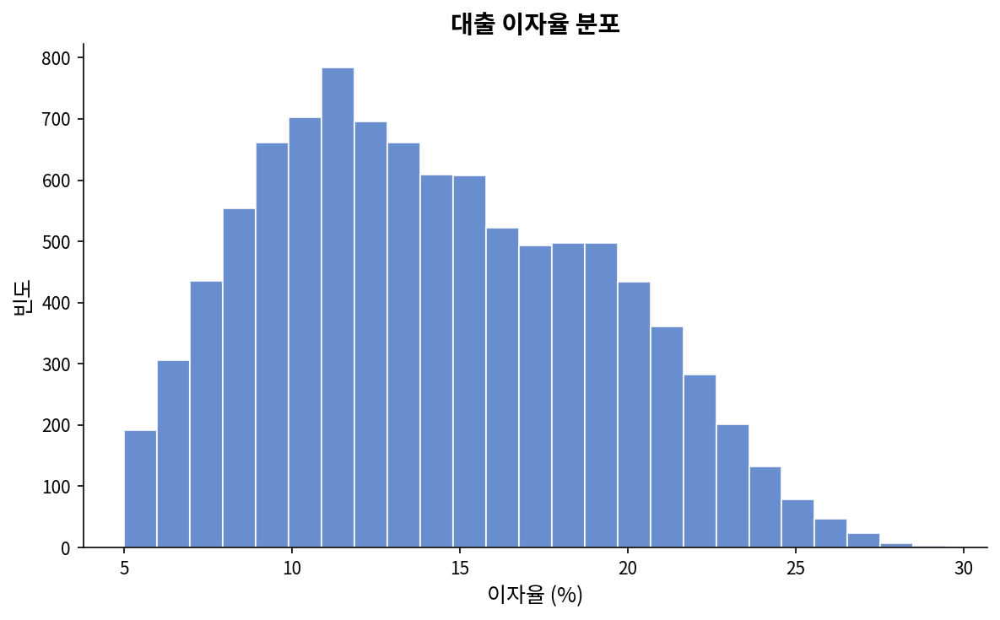
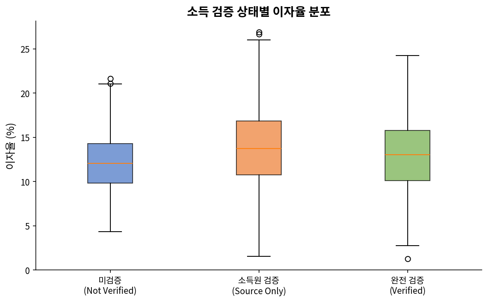
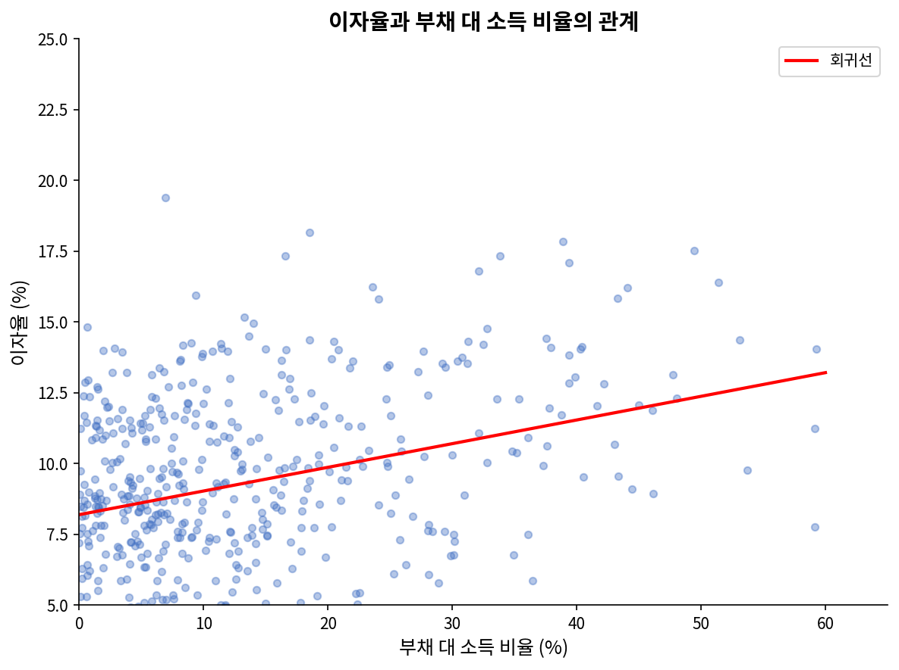
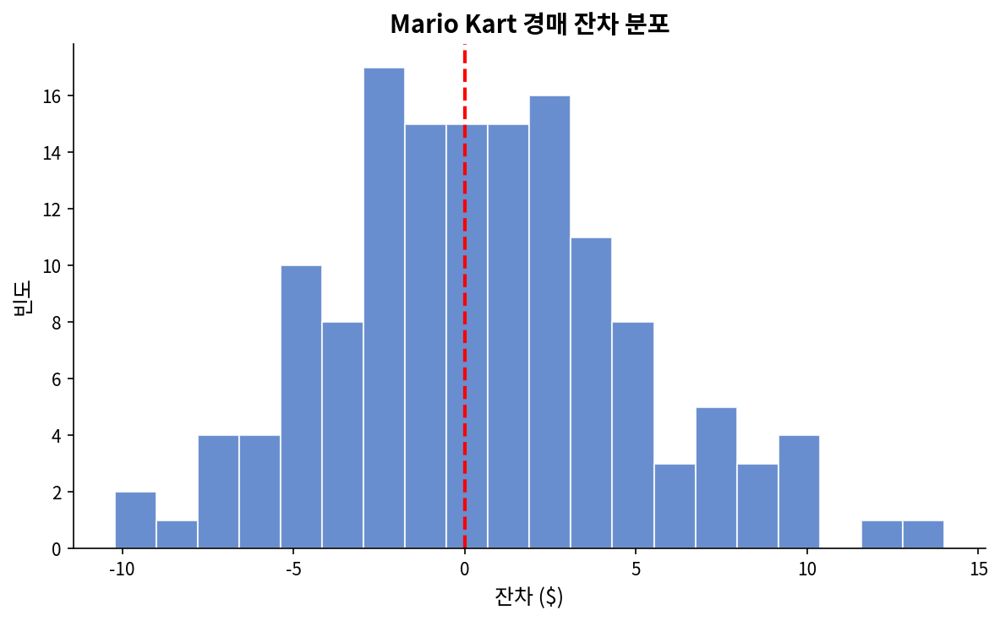
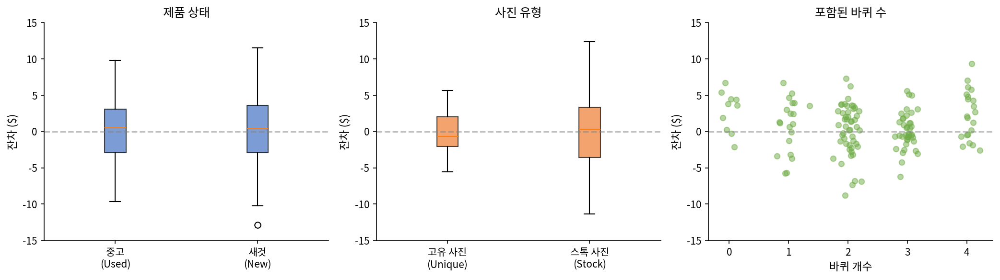
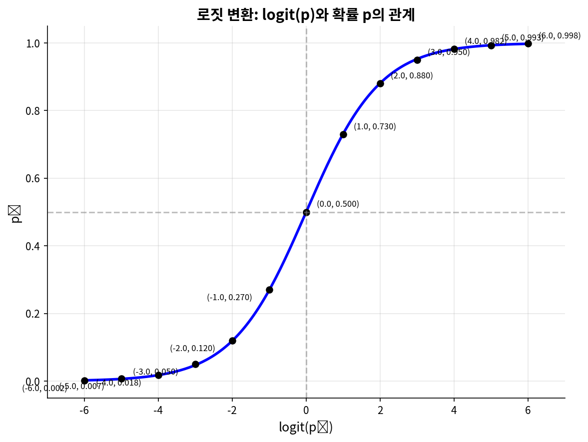
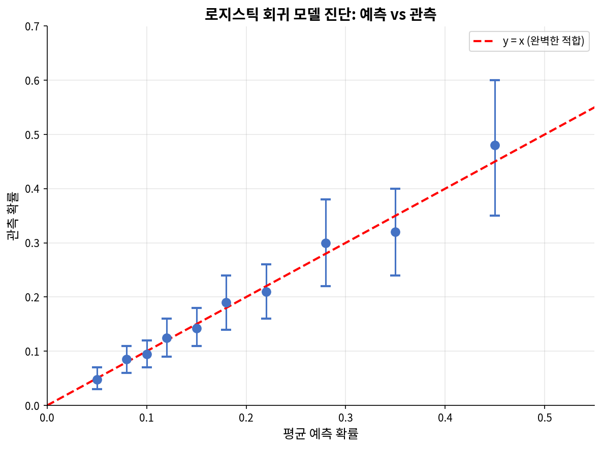

# 제9장: 다중회귀와 로지스틱 회귀

## 목차

- 9.1 다중회귀 소개
- 9.2 모델 선택
- 9.3 그래프를 이용한 모델 조건 검토
- 9.4 다중회귀 사례연구: Mario Kart
- 9.5 로지스틱 회귀 소개

---

단순 선형회귀의 원리는 다양하고 복잡한 상황에서 사용되는 보다 정교한 회귀 모델의 기초가 된다. 제9장에서는 하나의 선형 모델에 둘 이상의 예측변수를 도입하는 **다중회귀**(multiple regression)와 두 수준을 가진 범주형 결과를 예측하는 기법인 **로지스틱 회귀**(logistic regression)를 탐구한다.

---

## 9.1 다중회귀 소개

다중회귀는 하나의 반응변수에 여러 예측변수(x₁, x₂, x₃, ...)가 있는 경우로 단순 이변량 회귀를 확장한다. 이 방법은 여러 변수가 동시에 결과에 연결될 수 있는 시나리오에서 동기를 얻는다.

P2P 대출업체 Lending Club의 대출 데이터를 살펴보겠다. 이 데이터셋은 제1장과 제2장에서 처음 접한 것이다. 대출 데이터는 대출 조건과 대출자 정보를 포함한다. 우리가 더 잘 이해하고자 하는 결과변수는 대출에 부과된 **이자율**이다. 예를 들어, 다른 모든 특성이 동일할 때 누군가가 이미 가진 부채 규모가 중요할까? 소득이 검증되었는지 여부가 중요할까? 다중회귀는 이러한 질문과 다른 여러 질문에 답하는 데 도움이 된다.

데이터셋 `loans`는 10,000건의 대출 결과를 포함하며, 우리는 사용 가능한 변수의 일부를 살펴볼 것이다.

### 그림 9.1: loans 데이터셋의 처음 6개 관측값

| interest_rate | income_ver | debt_to_income | credit_util | bankruptcy | term | issued | credit_checks |
|---------------|------------|----------------|-------------|------------|------|--------|---------------|
| 14.07 | verified | 18.01 | 0.55 | 0 | 60 | Mar2018 | 6 |
| 12.61 | not | 5.04 | 0.15 | 1 | 36 | Feb2018 | 1 |
| 17.09 | source_only | 21.15 | 0.66 | 0 | 36 | Feb2018 | 4 |
| 6.72 | not | 10.16 | 0.20 | 0 | 36 | Jan2018 | 0 |
| 14.07 | verified | 57.96 | 0.75 | 0 | 36 | Mar2018 | 7 |
| 6.72 | not | 6.46 | 0.09 | 0 | 36 | Jan2018 | 6 |

### 그림 9.2: loans 데이터셋의 변수 설명

| 변수 | 설명 |
|------|------|
| interest_rate | 대출 이자율 |
| income_ver | 대출자의 소득원과 금액이 검증되었는지를 나타내는 범주형 변수. 수준: verified, source_only, not |
| debt_to_income | 부채 대 소득 비율: 대출자의 총 부채를 총 소득으로 나눈 백분율 |
| credit_util | 대출자가 이용 가능한 전체 신용 중 사용하고 있는 비율 |
| bankruptcy | 대출자의 과거 파산 여부를 나타내는 지시변수 (1=있음, 0=없음) |
| term | 대출 기간 (개월) |
| issued | 대출 발행 월 |
| credit_checks | 최근 12개월 동안 대출자의 신용 조회 횟수 |

`bankruptcy` 변수는 **지시변수**(indicator variable)로, 대출자가 과거에 파산 기록이 있으면 1, 없으면 0의 값을 갖는다. 범주 이름 대신 지시변수를 사용하면 이러한 변수를 회귀에 직접 사용할 수 있다. 다른 두 변수는 범주형(`income_ver`와 `issued`)이며, 각각 몇 가지 다른 비수치적 값을 가질 수 있다. 이러한 변수가 모델에서 어떻게 처리되는지는 9.1.1절에서 논의한다.



**그림 9.3**: loans 데이터셋에서 이자율의 분포. 분포는 단봉형이며 약간 오른쪽으로 치우쳐 있다.

---

### 9.1.1 예측변수로서의 지시변수와 범주형 변수

먼저 단순히 `bankruptcy`가 이자율 결과를 예측하는지 확인해보자.

---

#### 예제 9.1

**문제**: `bankruptcy` 변수를 예측변수로 사용하여 이자율을 예측하는 선형 모델을 적합한다. 통계 소프트웨어가 다음 출력을 제공한다:

| | 추정값 | 표준오차 | t 값 | Pr(>|t|) |
|---|--------|----------|------|----------|
| (절편) | 12.338 | 0.053 | 231.49 | <0.0001 |
| bankruptcy | 0.737 | 0.153 | 4.82 | <0.0001 |

`bankruptcy` 변수의 계수를 해석하라.

**풀이**: 먼저 모델이 어떻게 작동하는지 확인해보자. 파산 기록이 없는 사람(bankruptcy = 0)에 대해 모델은 12.34%의 이자율을 예측한다:

$$\widehat{rate} = 12.34 + 0.74 \times 0 = 12.34$$

파산 기록이 있는 사람에 대해서는:

$$\widehat{rate} = 12.34 + 0.74 \times 1 = 13.08$$

차이는 정확히 0.74이다. 이는 파산 기록이 있는 대출자가 없는 대출자보다 평균적으로 0.74 퍼센트 포인트 더 높은 이자율을 받는다는 것을 의미한다.

**Python 코드**:
```python
import numpy as np
import pandas as pd
from scipy import stats
import statsmodels.api as sm

# 시뮬레이션 데이터 생성 (실제 데이터와 유사)
np.random.seed(42)
n = 10000

# bankruptcy 변수 생성 (약 10%가 파산 경험 있음)
bankruptcy = np.random.binomial(1, 0.1, n)

# 이자율 생성 (파산 효과 포함)
interest_rate = 12.338 + 0.737 * bankruptcy + np.random.normal(0, 4, n)

# 데이터프레임 생성
loans = pd.DataFrame({
    'interest_rate': interest_rate,
    'bankruptcy': bankruptcy
})

# 회귀 모델 적합
X = sm.add_constant(loans['bankruptcy'])
model = sm.OLS(loans['interest_rate'], X).fit()
print(model.summary().tables[1])
print(f"\n파산 없음 예측 이자율: {12.338 + 0.737 * 0:.2f}%")
print(f"파산 있음 예측 이자율: {12.338 + 0.737 * 1:.2f}%")
```

---

#### 예제 9.2

**문제**: 다중 범주를 가진 `income_ver` 변수를 사용하여 이자율을 예측하는 모델을 적합한다. 이 변수는 verified, source_only, not의 세 수준을 갖는다. 통계 소프트웨어가 다음 출력을 제공한다:

| | 추정값 | 표준오차 | t 값 | Pr(>|t|) |
|---|--------|----------|------|----------|
| (절편) | 11.10 | 0.08 | 137.2 | <0.0001 |
| income_ver_source_only | 1.42 | 0.11 | 12.8 | <0.0001 |
| income_ver_verified | 3.25 | 0.13 | 25.5 | <0.0001 |

이 모델의 방정식을 작성하라.

**풀이**: `income_ver` 변수는 3개의 수준을 가지므로 모델에서는 2개의 지시변수로 표현된다. 세 번째 수준인 `not`은 **기준 수준**(reference level)이 되어 별도의 계수를 갖지 않는다.

모델 방정식:
$$\widehat{rate} = 11.10 + 1.42 \times \text{income\_ver}_{source\_only} + 3.25 \times \text{income\_ver}_{verified}$$

여기서:
- income_ver_source_only: 소득원만 검증된 경우 1, 아니면 0
- income_ver_verified: 소득원과 금액 모두 검증된 경우 1, 아니면 0

**Python 코드**:
```python
import pandas as pd
import statsmodels.api as sm
import statsmodels.formula.api as smf

# 시뮬레이션 데이터
np.random.seed(42)
n = 10000

income_ver = np.random.choice(['not', 'source_only', 'verified'], n, p=[0.3, 0.3, 0.4])
interest_rate = (11.10 + 
                 1.42 * (income_ver == 'source_only') + 
                 3.25 * (income_ver == 'verified') + 
                 np.random.normal(0, 3.5, n))

loans = pd.DataFrame({
    'interest_rate': interest_rate,
    'income_ver': pd.Categorical(income_ver, categories=['not', 'source_only', 'verified'])
})

# 범주형 변수로 회귀
model = smf.ols('interest_rate ~ C(income_ver, Treatment(reference="not"))', data=loans).fit()
print(model.summary().tables[1])
```

---

#### 예제 9.3

**문제**: 예제 9.2의 모델을 사용하여 소득이 검증되지 않은 대출자의 평균 이자율을 계산하라.

**풀이**: `income_ver`가 `not`인 경우, 두 지시변수 모두 0이 된다:

$$\widehat{rate} = 11.10 + 1.42 \times 0 + 3.25 \times 0 = 11.10$$

`not` 수준이 기준 수준이기 때문에 다른 수준의 지시변수들이 모두 0이 되면 절편값만 남게 된다.

---

#### 예제 9.4

**문제**: 예제 9.2의 모델을 사용하여 소득원은 검증되었지만 금액은 검증되지 않은 대출자의 평균 이자율을 계산하라.

**풀이**: `income_ver`가 `source_only`인 경우:

$$\widehat{rate} = 11.10 + 1.42 \times 1 + 3.25 \times 0 = 12.52$$

이 대출자들의 평균 이자율은 12.52%다.

---

#### 연습문제 9.5 ✏️

**문제**: 소득원과 금액이 모두 검증된 대출자의 평균 이자율을 계산하라.

**풀이**: `income_ver`가 `verified`인 경우:

$$\widehat{rate} = 11.10 + 1.42 \times 0 + 3.25 \times 1 = 14.35$$

이 대출자들의 평균 이자율은 14.35%다.

**Python 코드**:
```python
# 각 그룹의 예측 이자율 계산
intercept = 11.10
coef_source_only = 1.42
coef_verified = 3.25

print("예측 이자율:")
print(f"  검증되지 않음 (not):     {intercept:.2f}%")
print(f"  소득원만 검증 (source_only): {intercept + coef_source_only:.2f}%")
print(f"  완전 검증 (verified):    {intercept + coef_verified:.2f}%")
```

---

> **여러 범주를 가진 예측변수**
> 
> k > 2인 k개의 수준을 가진 범주형 변수를 회귀 모델에 적합할 때, 소프트웨어는 k - 1개의 수준에 대한 계수를 제공한다. 계수를 받지 않는 마지막 수준은 **기준 수준**(reference level)이 되며, 다른 수준에 대해 나열된 계수들은 모두 이 기준 수준에 상대적으로 해석된다.

---

#### 연습문제 9.6 ✏️

**문제**: 예제 9.2의 income_ver 모델의 계수들을 해석하라.

**풀이**: 
- **절편 (11.10)**: 소득이 검증되지 않은(not) 대출자들의 평균 이자율이다.
- **income_ver_source_only (1.42)**: 소득원만 검증된 대출자는 검증되지 않은 대출자보다 평균 1.42 퍼센트 포인트 더 높은 이자율을 받는다.
- **income_ver_verified (3.25)**: 소득원과 금액 모두 검증된 대출자는 검증되지 않은 대출자보다 평균 3.25 퍼센트 포인트 더 높은 이자율을 받는다.

> **흥미로운 발견**: 소득이 검증된 대출자가 더 높은 이자율을 받는다는 것은 직관에 반하는 것처럼 보인다. 이는 아마도 신용이 좋지 않은 대출자에게 소득 검증을 요구하기 때문일 수 있다. 즉, 소득 검증은 대출자에 대한 우려의 신호일 수 있다.

---

#### 연습문제 9.7 ✏️

**문제**: 소득원과 금액이 모두 검증된 대출자는 소득원만 검증된 대출자보다 얼마나 더 높은 이자율을 받을까?

**풀이**: 
$$3.25 - 1.42 = 1.83$$

완전 검증된 대출자는 소득원만 검증된 대출자보다 약 1.83 퍼센트 포인트 더 높은 이자율을 받는다.

---



**그림 9.5**: 소득 검증 상태에 따른 대출 이자율 분포

---

### 🔍 새로운 시각: 지시변수의 본질

지시변수는 단순히 0과 1로 코딩된 숫자가 아니다. 이는 **범주의 존재 여부를 이진 신호로 변환**하는 장치다. 예를 들어, "소득이 검증됨"이라는 질적 정보를 "verified=1"이라는 양적 정보로 바꾸는 것이다.

k개의 범주를 가진 변수에 k-1개의 지시변수만 필요한 이유는 **완전 다중공선성**(perfect multicollinearity)을 피하기 위함이다. 모든 범주에 지시변수를 만들면, 그들의 합이 항상 1이 되어 절편과 완전히 상관되기 때문이다. 

수학적으로, 만약 세 개의 지시변수 D₁, D₂, D₃가 있고 모든 관측에서 D₁ + D₂ + D₃ = 1이라면, 이 세 변수는 선형 종속이 되어 회귀 계수를 유일하게 추정할 수 없다.

---

### 9.1.2 모델에 여러 변수 포함하고 평가하기

이제 더 많은 변수를 모델에 추가해보자. 목표는 이자율을 예측하는 모델을 구축하는 것이다.

### 그림 9.5: 전체 다중회귀 모델 출력

| | 추정값 | 표준오차 | t 값 | Pr(>|t|) |
|---|--------|----------|------|----------|
| (절편) | 1.9251 | 0.2102 | 9.16 | <0.0001 |
| income_ver: source_only | 0.9750 | 0.0991 | 9.83 | <0.0001 |
| income_ver: verified | 2.5374 | 0.1172 | 21.65 | <0.0001 |
| debt_to_income | 0.0211 | 0.0029 | 7.18 | <0.0001 |
| credit_util | 4.8959 | 0.1619 | 30.24 | <0.0001 |
| bankruptcy | 0.3864 | 0.1324 | 2.92 | 0.0035 |
| term | 0.1537 | 0.0039 | 38.96 | <0.0001 |
| issued: Jan2018 | 0.0276 | 0.1081 | 0.26 | 0.7981 |
| issued: Mar2018 | -0.0397 | 0.1065 | -0.37 | 0.7093 |
| credit_checks | 0.2282 | 0.0182 | 12.51 | <0.0001 |

자유도(df) = 9990

---

> **다중회귀 모델**
> 
> 다중회귀 모델은 여러 예측변수를 포함하는 선형 모델이다. 일반적으로 k개의 예측변수가 있을 때 다음과 같이 작성한다:
> 
> $$\hat{y} = \beta_0 + \beta_1 x_1 + \beta_2 x_2 + \cdots + \beta_k x_k$$
> 
> 항상 통계 소프트웨어를 사용하여 βᵢ 모수들을 추정한다.

---

#### 예제 9.9

**문제**: 그림 9.5의 점 추정값을 사용하여 회귀 모델을 작성하라. 이 모델에는 몇 개의 예측변수가 있는가?

**풀이**: 이자율에 대한 적합 모델은 다음과 같다:

$$\widehat{rate} = 1.925 + 0.975 \times \text{income\_ver}_{source\_only} + 2.537 \times \text{income\_ver}_{verified}$$
$$+ 0.021 \times \text{debt\_to\_income} + 4.896 \times \text{credit\_util}$$
$$+ 0.386 \times \text{bankruptcy} + 0.154 \times \text{term}$$
$$+ 0.028 \times \text{issued}_{Jan2018} - 0.040 \times \text{issued}_{Mar2018}$$
$$+ 0.228 \times \text{credit\_checks}$$

예측변수 계수의 수를 세면 모델의 유효 예측변수 수를 얻는다: k = 9. `income_ver` 범주형 예측변수는 모델에서 두 개의 항으로 나타나고, `issued` 역시 두 개의 항으로 나타난다. 일반적으로 p개의 서로 다른 수준을 가진 범주형 예측변수는 다중회귀 모델에서 p - 1개의 항으로 표현된다.

**Python 코드**:
```python
import statsmodels.formula.api as smf
import pandas as pd
import numpy as np

# 시뮬레이션 데이터 생성
np.random.seed(42)
n = 10000

loans = pd.DataFrame({
    'interest_rate': np.random.normal(12, 4, n),
    'income_ver': np.random.choice(['not', 'source_only', 'verified'], n),
    'debt_to_income': np.random.exponential(15, n),
    'credit_util': np.random.uniform(0, 1, n),
    'bankruptcy': np.random.binomial(1, 0.1, n),
    'term': np.random.choice([36, 60], n),
    'issued': np.random.choice(['Jan2018', 'Feb2018', 'Mar2018'], n),
    'credit_checks': np.random.poisson(3, n)
})

# 다중회귀 모델 적합
formula = '''interest_rate ~ C(income_ver) + debt_to_income + credit_util + 
             bankruptcy + term + C(issued) + credit_checks'''
model = smf.ols(formula, data=loans).fit()
print(model.summary())
print(f"\n모델의 예측변수 수: {len(model.params) - 1}")
```

---

#### 연습문제 9.10 ✏️

**문제**: β₄, 즉 `credit_util` 변수의 계수는 무엇을 나타내는가? β₄의 점 추정값은 얼마인가?

**풀이**: β₄는 **다른 모든 변수가 일정할 때**, 신용 이용률이 0에서 1로 변할 때 이자율의 예상 변화를 나타낸다. 즉, 대출자가 가용 신용을 전혀 사용하지 않는 상태에서 전부 사용하는 상태로 바뀔 때 이자율이 얼마나 변하는지를 나타낸다.

점 추정값은 b₄ = 4.90%다.

이는 다른 조건이 동일할 때, 신용 이용률이 100% 포인트 증가하면 이자율이 평균 4.90 퍼센트 포인트 증가한다는 것을 의미한다.

---

#### 예제 9.11

**문제**: 연습문제 9.9에서 식별된 방정식을 사용하여 그림 9.1의 첫 번째 관측값의 잔차를 계산하라.

**풀이**: 잔차를 계산하려면 먼저 예측값이 필요하다. 예제 9.9의 방정식에 값을 대입한다:
- income_ver_source_only = 0 (verified이므로)
- income_ver_verified = 1
- debt_to_income = 18.01
- credit_util = 0.55
- bankruptcy = 0
- term = 60
- issued_Jan2018 = 0, issued_Mar2018 = 1
- credit_checks = 6

$$\widehat{rate}_1 = 1.925 + 0.975(0) + 2.537(1) + 0.021(18.01) + 4.896(0.55)$$
$$+ 0.386(0) + 0.154(60) + 0.028(0) - 0.040(1) + 0.228(6)$$
$$= 1.925 + 2.537 + 0.378 + 2.693 + 0 + 9.24 + 0 - 0.040 + 1.368 = 18.10$$

관측된 이자율은 14.07%이므로, 잔차는:
$$e_1 = 14.07 - 18.10 = -4.03$$

**Python 코드**:
```python
# 첫 번째 관측값
obs1 = {
    'income_ver_source_only': 0,
    'income_ver_verified': 1,
    'debt_to_income': 18.01,
    'credit_util': 0.55,
    'bankruptcy': 0,
    'term': 60,
    'issued_Jan2018': 0,
    'issued_Mar2018': 1,
    'credit_checks': 6
}

# 계수
coef = {
    'intercept': 1.925,
    'income_ver_source_only': 0.975,
    'income_ver_verified': 2.537,
    'debt_to_income': 0.021,
    'credit_util': 4.896,
    'bankruptcy': 0.386,
    'term': 0.154,
    'issued_Jan2018': 0.028,
    'issued_Mar2018': -0.040,
    'credit_checks': 0.228
}

# 예측값 계산
predicted = (coef['intercept'] + 
             coef['income_ver_source_only'] * obs1['income_ver_source_only'] +
             coef['income_ver_verified'] * obs1['income_ver_verified'] +
             coef['debt_to_income'] * obs1['debt_to_income'] +
             coef['credit_util'] * obs1['credit_util'] +
             coef['bankruptcy'] * obs1['bankruptcy'] +
             coef['term'] * obs1['term'] +
             coef['issued_Jan2018'] * obs1['issued_Jan2018'] +
             coef['issued_Mar2018'] * obs1['issued_Mar2018'] +
             coef['credit_checks'] * obs1['credit_checks'])

observed = 14.07
residual = observed - predicted

print(f"예측값: {predicted:.2f}%")
print(f"관측값: {observed}%")
print(f"잔차: {residual:.2f}")
```

---

#### 예제 9.12

**문제**: 9.1.1절에서 단순선형회귀를 사용했을 때 bankruptcy의 계수를 b₄ = 0.74, 표준오차 SE = 0.15로 추정했다. 왜 이 추정값과 다중회귀 설정에서의 추정값 0.39가 다른가?

**풀이**: 데이터를 자세히 살펴보면 일부 예측변수들이 서로 상관되어 있음을 알 수 있다. 예를 들어, 단순선형회귀로 결과변수 interest_rate와 예측변수 bankruptcy 간의 관계를 추정할 때, 대출자의 소득이 검증되었는지 여부, 대출자의 부채 대 소득 비율 등 다른 변수들을 통제할 수 없었다. 그 원래 모델은 전체 맥락을 고려하지 않고 독립적으로 구성되었다.

모든 변수를 포함하면, 이러한 다른 변수들에 의해 놓쳐진 숨겨진 비의도적 편향이 줄어들거나 제거된다. 물론 다른 교란변수로 인한 편향은 여전히 존재할 수 있다.

> **다중공선성(Collinearity)**
> 
> 예제 9.12는 다중회귀에서 흔히 발생하는 문제를 설명한다: 예측변수들 간의 상관관계. 두 예측변수가 상관되어 있을 때 이를 **공선성**(collinear)이 있다고 한다. 이러한 공선성은 모델 추정을 복잡하게 만든다. 관측 데이터에서 공선성이 발생하는 것을 완전히 방지하는 것은 불가능하지만, 실험은 보통 예측변수들이 공선적이지 않도록 설계된다.

---

#### 연습문제 9.13 ✏️

**문제**: 절편의 추정값은 1.925이고, 누군가는 이 계수에 대해 어떤 해석을 하고 싶을 수 있다. 예를 들어, "각 변수가 0의 값을 가질 때 모델이 예측하는 가격이다: 소득원이 검증되지 않고, 대출자에게 부채가 없고(debt-to-income과 credit utilization이 0), 등등." 이것이 합리적인가? 이러한 해석을 하는 것에 어떤 가치가 있는가?

**풀이**: 많은 변수들이 적어도 하나의 데이터 포인트에서 0의 값을 가지며, 그러한 변수들에 대해서는 합리적이다. 그러나 하나의 변수는 절대 0의 값을 가지지 않는다: 대출 기간을 월 단위로 설명하는 `term`이다. term이 0으로 설정되면 대출은 즉시 상환되어야 한다. 즉, 대출자가 돈을 받자마자 돌려줘야 하므로 실제 대출이 아니다. 궁극적으로 이 설정에서 절편의 해석은 통찰력이 없다.

---

### 9.1.3 다중회귀를 위한 더 나은 도구로서의 수정된 R²

8.2절에서 모델이 설명하는 반응변수의 변동 비율을 결정하기 위해 R²를 처음 사용했다:

$$R^2 = 1 - \frac{\text{잔차의 변동성}}{\text{결과의 변동성}} = 1 - \frac{Var(e_i)}{Var(y_i)}$$

여기서 eᵢ는 모델의 잔차를, yᵢ는 결과를 나타낸다. 이 방정식은 다중회귀 프레임워크에서도 유효하지만, 모델을 비교할 때 더 유용하게 만들 수 있는 작은 개선이 있다.

---

#### 연습문제 9.14 ✏️

**문제**: 연습문제 9.9에서 주어진 모델의 잔차 분산은 18.53이고, 모든 경매에서 총 가격의 분산은 25.01이다. 이 모델의 R²를 계산하라.

**풀이**:
$$R^2 = 1 - \frac{18.53}{25.01} = 1 - 0.741 = 0.259$$

이 모델은 이자율 변동의 약 25.9%를 설명한다.

**Python 코드**:
```python
var_residuals = 18.53
var_outcome = 25.01

r_squared = 1 - var_residuals / var_outcome
print(f"R² = {r_squared:.4f}")
print(f"모델이 설명하는 변동 비율: {r_squared * 100:.1f}%")
```

---

단일 변수만 있을 때 이 R² 추정 전략은 적절하다. 그러나 변수가 많을 때는 덜 유용해진다. 일반적인 R²는 새로운 데이터 샘플에 적용될 때 모델이 설명하는 변동의 양에 대해 **편향된** 추정값이다. 더 나은 추정값을 얻기 위해 **수정된 R²**를 사용한다.

---

> **모델 평가 도구로서의 수정된 R²**
> 
> 수정된 R²는 다음과 같이 계산된다:
> 
> $$R^2_{adj} = 1 - \frac{s^2_{residuals}/(n-k-1)}{s^2_{outcome}/(n-1)} = 1 - \frac{s^2_{residuals}}{s^2_{outcome}} \times \frac{n-1}{n-k-1}$$
> 
> 여기서 n은 모델을 적합하는 데 사용된 케이스 수이고, k는 모델의 예측변수 수다. p개의 수준을 가진 범주형 예측변수는 모델의 변수 수에 p - 1을 기여한다는 것을 기억하라.

k는 절대 음수가 아니므로 수정된 R²는 조정되지 않은 R²보다 작아진다(종종 조금만 더 작아진다). 수정된 R²의 근거는 각 분산과 관련된 자유도에 있으며, 이는 다중회귀 맥락에서 n - k - 1과 같다. 현재 모델을 사용하여 새 데이터에 대한 예측을 수행한다면, 조정되지 않은 R²는 약간 지나치게 낙관적인 경향이 있는 반면, 수정된 R² 공식은 이 편향을 교정하는 데 도움이 된다.

---

#### 연습문제 9.15 ✏️

**문제**: loans 데이터셋에는 n = 10,000개의 경매가 있고 모델에는 k = 9개의 예측변수가 있다. n, k, 그리고 연습문제 9.14의 분산을 사용하여 이자율 모델의 R²_adj를 계산하라.

**풀이**:
$$R^2_{adj} = 1 - \frac{18.53}{25.01} \times \frac{10000-1}{10000-9-1}$$
$$= 1 - 0.7409 \times \frac{9999}{9990}$$
$$= 1 - 0.7409 \times 1.0009$$
$$= 1 - 0.7416 = 0.2584$$

차이는 매우 작지만(0.2591 vs 0.2584), 다음 절에서 모델을 미세 조정할 때 중요해질 것이다.

**Python 코드**:
```python
n = 10000
k = 9
var_residuals = 18.53
var_outcome = 25.01

r_squared = 1 - var_residuals / var_outcome
r_squared_adj = 1 - (var_residuals / var_outcome) * ((n - 1) / (n - k - 1))

print(f"R² = {r_squared:.4f}")
print(f"R²_adj = {r_squared_adj:.4f}")
print(f"차이 = {r_squared - r_squared_adj:.4f}")
```

---

#### 연습문제 9.16 ✏️

**문제**: 모델에 다른 예측변수를 추가했지만 오차의 분산 Var(eᵢ)가 줄어들지 않았다고 가정하자. R²에는 무슨 일이 일어날까? 수정된 R²에는 무슨 일이 일어날까?

**풀이**: 
- **R²**: 변하지 않거나 약간 증가한다. 예측변수를 추가하면 R²는 절대 감소하지 않는다(이것이 R²의 수학적 특성이다).
- **수정된 R²**: 감소한다. k가 증가하면 (n-1)/(n-k-1) 비율이 증가하여 R²_adj가 감소한다. 이것이 수정된 R²가 불필요한 변수를 추가하는 것에 대해 "벌점"을 부과하는 방식이다.

---

### 🔍 새로운 시각: 왜 수정된 R²가 필요한가?

통계 모델링에서 **과적합**(overfitting)은 항상 주의해야 할 위험이다. 변수를 무한정 추가하면 훈련 데이터에는 완벽하게 맞지만, 새로운 데이터를 예측하는 능력은 오히려 떨어진다.

수정된 R²의 벌점 항 (n-1)/(n-k-1)는 이런 과적합을 방지한다. 변수를 추가할 때마다 "이 변수가 정말 모델을 개선하는가?"를 묻는 것이다. 개선 효과가 벌점보다 크면 수정된 R²가 증가하고, 그렇지 않으면 감소한다.

**역사적 맥락**: 수정된 R²는 1961년 Henri Theil에 의해 제안되었다. 정보 이론의 관점에서 유사한 개념인 AIC(Akaike Information Criterion)는 1973년 일본의 통계학자 아카이케 히로츠구에 의해 개발되었다.

---



**그림 9.4**: 대출 이자율과 부채 대 소득 비율의 관계. 양의 상관관계가 관찰된다.

---
## 9.1절 연습문제

---

### 연습문제 9.1 신생아 체중, Part I ⭐

Child Health and Development Studies는 다양한 주제를 조사한다. 한 연구는 샌프란시스코 동부 지역 Kaiser Foundation Health Plan에서 1960년과 1967년 사이의 모든 임신을 고려했다. 여기서 우리는 흡연과 아기 체중 사이의 관계를 연구한다. `smoke` 변수는 어머니가 흡연자이면 1, 아니면 0으로 코딩된다.

| | 추정값 | 표준오차 | t 값 | Pr(>|t|) |
|---|--------|----------|------|----------|
| (절편) | 123.05 | 0.65 | 189.60 | 0.0000 |
| smoke | -8.94 | 1.03 | -8.65 | 0.0000 |

흡연자와 비흡연자 내의 변동성은 거의 같고 분포는 대칭적이다. 이러한 조건이 충족되면 모델을 적용하는 것이 합리적이다.

**(a)** 회귀 모델의 방정식을 작성하라.

**풀이**:
$$\widehat{bwt} = 123.05 - 8.94 \times smoke$$

여기서 bwt는 아기의 출생 체중(온스)이다.

**(b)** 이 맥락에서 기울기를 해석하고, 흡연자와 비흡연자 어머니에게서 태어난 아기의 예측 출생 체중을 계산하라.

**풀이**: 
- **기울기 해석**: 흡연하는 어머니에게서 태어난 아기의 추정 체중은 비흡연 어머니에게서 태어난 아기보다 8.94온스 낮다.
- **비흡연자**: $123.05 - 8.94 \times 0 = 123.05$ 온스
- **흡연자**: $123.05 - 8.94 \times 1 = 114.11$ 온스

**(c)** 평균 출생 체중과 흡연 사이에 통계적으로 유의한 관계가 있는가?

**풀이**:
- H₀: β₁ = 0 (흡연과 출생 체중 사이에 관계가 없다)
- Hₐ: β₁ ≠ 0 (흡연과 출생 체중 사이에 관계가 있다)
- t = -8.65, p-값 ≈ 0

p-값이 매우 작으므로 H₀를 기각한다. 데이터는 출생 체중과 흡연 사이에 연관성이 있다는 강력한 증거를 제공한다. 더 나아가 흡연이 낮은 출생 체중과 연관되어 있다고 결론지을 수 있다.

**Python 코드**:
```python
import numpy as np
import statsmodels.api as sm

# 모델 계수
intercept = 123.05
slope = -8.94
se_slope = 1.03
t_value = -8.65

# 예측값 계산
non_smoker = intercept + slope * 0
smoker = intercept + slope * 1

print("신생아 체중 예측 (온스):")
print(f"  비흡연자 어머니: {non_smoker:.2f}")
print(f"  흡연자 어머니: {smoker:.2f}")
print(f"  차이: {non_smoker - smoker:.2f}")

# 가설검정
from scipy import stats
p_value = 2 * (1 - stats.t.cdf(abs(t_value), df=1000))  # 대략적인 df
print(f"\nt-통계량: {t_value}")
print(f"p-값: {p_value:.6f}")
print("결론: p < 0.05이므로 H₀ 기각. 흡연과 출생 체중 사이에 유의한 관계가 있다.")
```

---

### 연습문제 9.3 신생아 체중, Part III ⭐

연습문제 9.1과 9.2에서 `smoke`와 `parity` 변수를 각각 고려했다. 영아 체중을 모델링하는 더 현실적인 접근법은 모든 가능하게 관련된 변수를 동시에 고려하는 것이다. 관심 있는 다른 변수로는 임신 기간(일, gestation), 어머니 나이(세, age), 어머니 키(인치, height), 어머니 임신 체중(파운드, weight)이 있다.

**전체 모델 출력**:

| | 추정값 | 표준오차 | t 값 | Pr(>|t|) |
|---|--------|----------|------|----------|
| (절편) | -80.41 | 14.35 | -5.60 | <0.0001 |
| gestation | 0.44 | 0.03 | 15.26 | <0.0001 |
| parity | -3.33 | 1.13 | -2.95 | 0.0033 |
| age | -0.01 | 0.09 | -0.10 | 0.9170 |
| height | 1.15 | 0.21 | 5.63 | <0.0001 |
| weight | 0.05 | 0.03 | 1.99 | 0.0471 |
| smoke | -8.40 | 0.95 | -8.81 | <0.0001 |

**(a)** 모델 방정식을 작성하라.

**풀이**:
$$\widehat{bwt} = -80.41 + 0.44 \times gestation - 3.33 \times parity - 0.01 \times age$$
$$+ 1.15 \times height + 0.05 \times weight - 8.40 \times smoke$$

**(b)** βgestation과 βage의 의미를 해석하라.

**풀이**:
- **βgestation (0.44)**: 다른 모든 변수가 일정할 때, 임신 기간이 하루 증가할 때마다 아기의 출생 체중은 평균 0.44온스 증가한다고 예측된다.
- **βage (-0.01)**: 다른 모든 변수가 일정할 때, 어머니 나이가 1년 증가할 때마다 아기의 출생 체중은 평균 0.01온스 감소한다고 예측된다. (그러나 이 효과는 통계적으로 유의하지 않다: p = 0.9170)

**(c)** 연습문제 9.2의 단순회귀에서 `parity`의 기울기는 -1.93이었고 다중회귀에서는 -3.33이다. 왜 기울기 추정값이 이렇게 다를까?

**풀이**: Parity는 모델의 다른 변수들 중 하나 이상과 상관되어 있을 수 있으며, 이것이 모델 추정을 복잡하게 만든다. 예를 들어, 첫째 아이를 낳는 어머니는 평균적으로 더 젊거나, 임신 기간이 다르거나, 흡연 비율이 다를 수 있다.

**(d)** 첫 관측값의 예측값과 잔차를 계산하라. 첫 번째 아기는 120온스(7파운드 8온스)의 출생 체중을 가졌다.

첫 관측값: gestation=284, parity=0, age=27, height=62, weight=100, smoke=0

**풀이**:
$$\widehat{bwt}_1 = -80.41 + 0.44(284) - 3.33(0) - 0.01(27) + 1.15(62) + 0.05(100) - 8.40(0)$$
$$= -80.41 + 124.96 - 0 - 0.27 + 71.30 + 5.00 - 0 = 120.58$$

잔차: $e_1 = 120 - 120.58 = -0.58$

모델은 이 아기의 출생 체중을 약간 과대예측했다.

**(e)** 이 모델의 R²와 R²_adj를 계산하라 (분산이 제공된다고 가정: Var(e) = 249.28, Var(y) = 332.57, n = 1236, k = 6).

**풀이**:
$$R^2 = 1 - \frac{249.28}{332.57} = 0.2504$$
$$R^2_{adj} = 1 - \frac{249.28}{332.57} \times \frac{1236-1}{1236-6-1} = 1 - 0.7496 \times 1.0049 = 0.2468$$

**Python 코드**:
```python
import numpy as np

# 첫 관측값
obs = {
    'gestation': 284,
    'parity': 0,
    'age': 27,
    'height': 62,
    'weight': 100,
    'smoke': 0
}

# 계수
coef = {
    'intercept': -80.41,
    'gestation': 0.44,
    'parity': -3.33,
    'age': -0.01,
    'height': 1.15,
    'weight': 0.05,
    'smoke': -8.40
}

# 예측값 계산
predicted = (coef['intercept'] + 
             coef['gestation'] * obs['gestation'] +
             coef['parity'] * obs['parity'] +
             coef['age'] * obs['age'] +
             coef['height'] * obs['height'] +
             coef['weight'] * obs['weight'] +
             coef['smoke'] * obs['smoke'])

observed = 120
residual = observed - predicted

print(f"예측 출생 체중: {predicted:.2f} 온스")
print(f"관측 출생 체중: {observed} 온스")
print(f"잔차: {residual:.2f} 온스")

# R² 계산
var_e = 249.28
var_y = 332.57
n = 1236
k = 6

r_squared = 1 - var_e / var_y
r_squared_adj = 1 - (var_e / var_y) * ((n - 1) / (n - k - 1))

print(f"\nR² = {r_squared:.4f}")
print(f"R²_adj = {r_squared_adj:.4f}")
```

---

### 연습문제 9.5 GPA ⭐

여러 변수를 사용하여 대학생의 GPA를 예측하는 모델:

| | 추정값 | 표준오차 | t 값 | Pr(>|t|) |
|---|--------|----------|------|----------|
| (절편) | 3.45 | 0.35 | 9.86 | <0.0001 |
| gender_male | -0.08 | 0.12 | -0.67 | 0.5010 |
| study_hours | 0.03 | 0.01 | 3.00 | 0.0030 |
| sleep_hours | 0.05 | 0.03 | 1.67 | 0.0960 |

**(a)** `gender_male`의 95% 신뢰구간을 구하라.

**풀이**:
95% 신뢰구간 = 점 추정값 ± t* × SE = -0.08 ± 1.96 × 0.12 = -0.08 ± 0.24 = (-0.32, 0.16)

우리는 다른 변수들을 통제했을 때 남학생의 GPA가 여학생보다 평균적으로 0.32점 낮은 것부터 0.16점 높은 것까지의 범위에 있다고 95% 확신한다.

**(b)** 이 연구에서 성별이 GPA의 유의한 예측변수인가?

**풀이**: 아니다. gender_male의 p-값이 0.5010으로 0.05보다 크므로, 다른 변수들을 통제했을 때 성별은 GPA의 통계적으로 유의한 예측변수가 아니다.

**Python 코드**:
```python
from scipy import stats

estimate = -0.08
se = 0.12
t_critical = 1.96  # 95% 신뢰구간

ci_lower = estimate - t_critical * se
ci_upper = estimate + t_critical * se

print("gender_male의 95% 신뢰구간:")
print(f"  ({ci_lower:.2f}, {ci_upper:.2f})")
print(f"\n해석: 신뢰구간이 0을 포함하므로 성별 효과는 유의하지 않다.")
```

---

## 9.2 모델 선택

모델에 포함할 변수를 선택하는 것은 회귀 분석의 중요한 단계다. 목표는 **절약의 원칙**(principle of parsimony)을 따르는 것이다: 데이터를 잘 설명하는 가장 단순한 모델을 찾는다.

---

### 9.2.1 도움이 되지 않는 변수 식별하기

변수가 모델에 기여하는지 평가하는 방법 중 하나는 그 변수의 계수에 대한 t-검정을 사용하는 것이다. 귀무가설은 "다른 변수들이 모델에 있을 때, 이 변수는 예측에 도움이 되지 않는다" (즉, βᵢ = 0)이다.

---

#### 예제 9.17

**문제**: 그림 9.5의 결과에서 issued 변수를 살펴보자. issued_Jan2018의 p-값이 0.7981, issued_Mar2018의 p-값이 0.7093이다. 이 변수를 모델에서 제외해야 하는가?

**풀이**: p-값이 모두 매우 높다(유의수준 0.05보다 훨씬 큼). 이는 issued 변수(대출이 발행된 월)가 이자율을 예측하는 데 통계적으로 유의하지 않다는 것을 나타낸다. 다른 변수들이 모델에 있을 때, 대출이 발행된 월은 이자율에 추가적인 정보를 제공하지 않는 것으로 보인다.

따라서 이 변수를 모델에서 제외하는 것을 고려할 수 있다.

---

### 9.2.2 두 가지 모델 선택 전략

여러 예측변수 중에서 최적의 부분집합을 찾는 두 가지 일반적인 전략이 있다:

---

> **후진 제거법 (Backward Elimination)**
> 
> 모든 변수를 포함한 전체 모델에서 시작하여, 하나씩 변수를 제거한다. 각 단계에서 제거했을 때 수정된 R²가 가장 많이 증가하는(또는 가장 적게 감소하는) 변수를 제거한다. 더 이상 제거해도 개선이 없으면 멈춘다.

---

> **전진 선택법 (Forward Selection)**
> 
> 절편만 있는 빈 모델에서 시작하여, 하나씩 변수를 추가한다. 각 단계에서 추가했을 때 수정된 R²가 가장 많이 증가하는 변수를 추가한다. 더 이상 추가해도 개선이 없으면 멈춘다.

---

#### 예제 9.18

**문제**: 후진 제거법을 사용하여 loans 데이터에 대한 모델을 구축하라.

**풀이**: 모든 예측변수를 포함한 모델로 시작한다. 전체 모델의 R²_adj = 0.25854이다.

**1단계**: 각 변수를 하나씩 제외했을 때의 R²_adj를 계산한다:

| 제외 변수 | R²_adj |
|-----------|--------|
| income_ver | 0.22395 |
| debt_to_income | 0.25479 |
| credit_util | 0.19074 |
| bankruptcy | 0.25798 |
| term | 0.14592 |
| issued | 0.25854 |
| credit_checks | 0.24701 |

issued를 제외해도 R²_adj가 변하지 않는다(0.25854). 이는 issued가 모델에 기여하지 않음을 의미한다. issued를 제거한다.

**2단계**: issued를 제외한 모델에서 다시 각 변수를 제외해본다:

| 제외 변수 | R²_adj |
|-----------|--------|
| income_ver | 0.22395 |
| debt_to_income | 0.25479 |
| credit_util | 0.19074 |
| bankruptcy | 0.25798 |
| term | 0.14592 |
| credit_checks | 0.24701 |

어떤 변수를 제외해도 R²_adj가 현재보다 개선되지 않으므로 여기서 멈춘다.

**최종 모델**:
$$\widehat{rate} = 1.921 + 0.974 \times income\_ver_{source\_only} + 2.535 \times income\_ver_{verified}$$
$$+ 0.021 \times debt\_to\_income + 4.896 \times credit\_util$$
$$+ 0.387 \times bankruptcy + 0.154 \times term + 0.228 \times credit\_checks$$

**Python 코드**:
```python
import pandas as pd
import numpy as np
import statsmodels.formula.api as smf

# 후진 제거법 구현
def backward_elimination(data, response, predictors, threshold=0.0):
    """
    수정된 R²를 기준으로 후진 제거법 수행
    """
    current_predictors = predictors.copy()
    
    while len(current_predictors) > 0:
        formula = f"{response} ~ " + " + ".join(current_predictors)
        model = smf.ols(formula, data=data).fit()
        current_adj_r2 = model.rsquared_adj
        
        print(f"\n현재 모델: {', '.join(current_predictors)}")
        print(f"R²_adj = {current_adj_r2:.5f}")
        
        # 각 변수를 제외했을 때의 R²_adj 계산
        best_adj_r2 = current_adj_r2
        worst_predictor = None
        
        for pred in current_predictors:
            reduced_predictors = [p for p in current_predictors if p != pred]
            if len(reduced_predictors) == 0:
                continue
            
            formula = f"{response} ~ " + " + ".join(reduced_predictors)
            reduced_model = smf.ols(formula, data=data).fit()
            
            print(f"  {pred} 제외: R²_adj = {reduced_model.rsquared_adj:.5f}")
            
            if reduced_model.rsquared_adj >= best_adj_r2:
                best_adj_r2 = reduced_model.rsquared_adj
                worst_predictor = pred
        
        if worst_predictor is not None:
            print(f"\n'{worst_predictor}' 제거")
            current_predictors.remove(worst_predictor)
        else:
            print("\n더 이상 제거할 변수 없음. 종료.")
            break
    
    return current_predictors

# 예시 사용 (시뮬레이션 데이터 필요)
print("후진 제거법 예시")
```

---

#### 예제 9.19

**문제**: 전진 선택법을 사용하여 loans 데이터에 대한 모델을 구축하라.

**풀이**: 변수가 없는 모델에서 시작한다(R²_adj = 0).

**1단계**: 각 변수를 하나씩 추가했을 때의 R²_adj:

| 추가 변수 | R²_adj |
|-----------|--------|
| income_ver | 0.05926 |
| debt_to_income | 0.01946 |
| credit_util | 0.06452 |
| bankruptcy | 0.00222 |
| term | **0.12855** |
| issued | -0.00018 |
| credit_checks | 0.01711 |

term이 가장 높은 R²_adj를 가지므로 추가한다.

**2단계**: term이 있는 모델에 다른 변수 추가:

| 추가 변수 | R²_adj |
|-----------|--------|
| income_ver | 0.16851 |
| debt_to_income | 0.14368 |
| credit_util | **0.20046** |
| bankruptcy | 0.13070 |
| issued | 0.12840 |
| credit_checks | 0.14294 |

credit_util을 추가한다.

이 과정을 반복하면 후진 제거법과 동일한 최종 모델에 도달한다.

---

### 9.2.3 p-값 접근법: 수정된 R²의 대안

수정된 R² 대신 p-값을 사용하여 변수 선택을 할 수도 있다. 후진 제거법에서는 가장 큰 p-값을 가진 변수(유의하지 않은 변수)를 제거하고, 전진 선택법에서는 가장 작은 p-값을 가진 변수를 추가한다.

---

### 🔍 새로운 시각: 모델 선택의 철학

모델 선택은 단순히 통계적 기준만의 문제가 아니다. **세 가지 관점**을 균형있게 고려해야 한다:

1. **통계적 기준**: 수정된 R², AIC, BIC 등
2. **실질적 의미**: 변수가 이론적으로 중요한가?
3. **예측 목적**: 새 데이터에서 얼마나 잘 작동할까?

예를 들어, 어떤 변수가 통계적으로 유의하지 않더라도 이론적으로 중요하다면 모델에 유지할 수 있다. 반대로, 통계적으로 유의하더라도 해석이 불가능하거나 측정 비용이 너무 높으면 제외할 수 있다.

**George Box의 명언**: "모든 모델은 틀렸지만, 일부는 유용하다." 완벽한 모델을 찾으려 하지 말고, 목적에 맞는 유용한 모델을 찾아라.

---

## 9.2절 연습문제

---

### 연습문제 9.7 ⭐

**문제**: 연습문제 9.5의 GPA 모델에서 어떤 변수를 먼저 제거해야 하는가?

| | 추정값 | 표준오차 | t 값 | Pr(>|t|) |
|---|--------|----------|------|----------|
| (절편) | 3.45 | 0.35 | 9.86 | <0.0001 |
| gender_male | -0.08 | 0.12 | -0.67 | 0.5010 |
| study_hours | 0.03 | 0.01 | 3.00 | 0.0030 |
| sleep_hours | 0.05 | 0.03 | 1.67 | 0.0960 |
| age | -0.02 | 0.04 | -0.50 | 0.6170 |

**풀이**: p-값 기준 후진 제거법을 사용하면, 가장 높은 p-값을 가진 변수부터 제거한다.

- age: p = 0.6170 (가장 높음)
- gender_male: p = 0.5010
- sleep_hours: p = 0.0960
- study_hours: p = 0.0030

**age를 먼저 제거해야 한다.** age의 p-값이 0.6170으로 가장 크고, 이는 다른 변수들을 통제했을 때 나이가 GPA를 예측하는 데 거의 기여하지 않음을 나타낸다.

---

### 연습문제 9.9 ⭐

**문제**: 신생아 체중 데이터에 전진 선택법을 적용할 때, 첫 번째 단계에서 어떤 변수를 추가해야 하는가?

각 변수를 개별적으로 추가했을 때:

| 변수 | p-값 | R²_adj |
|------|------|--------|
| gestation | <0.0001 | 0.1850 |
| parity | 0.1052 | 0.0018 |
| age | 0.8620 | -0.0009 |
| height | <0.0001 | 0.0400 |
| weight | 0.0012 | 0.0096 |
| smoke | <0.0001 | 0.0580 |

**풀이**: p-값만 보면 gestation이나 smoke 중 하나를 먼저 추가해야 한다(둘 다 p < 0.0001). 그러나 수정된 R²를 보면 gestation이 있는 모델의 R²_adj(0.1850)가 더 높으므로, **gestation을 첫 번째 단계에서 추가하는 것이 바람직하다**.

(다른 설명도 가능하다. 예를 들어, 수정된 R²만 사용하는 것도 합리적이다.)

---

### 연습문제 9.11 ⭐

**문제**: 한 연구자가 어떤 예측변수들이 결과와 유의한 관계가 있는지 알고 싶어한다. 예측을 최적화하는 것보다 유의한 변수를 찾는 것이 목표라면, 어떤 선택 기준을 사용해야 하는가?

**풀이**: **p-값 선택법을 사용해야 한다**. 그 이유는:

1. **연구 목표 일치**: 연구자의 목표가 유의한 예측변수를 찾는 것이므로, 통계적 유의성(p-값)이 직접적으로 관련된 기준이다.

2. **해석 가능성**: p-값은 "이 변수가 결과와 통계적으로 유의한 관계가 있는가?"라는 질문에 직접 답한다.

3. **R²_adj의 한계**: 수정된 R²는 예측 정확도를 최적화하는 데 유용하지만, 개별 변수의 유의성에 대한 정보를 직접 제공하지 않는다.

단, p-값 기반 선택도 한계가 있다: 다중 비교 문제, 표본 크기에 대한 민감성 등. 이상적으로는 둘 다 고려하는 것이 좋다.

---
르다는 강력한 증거가 있다.

**해석**: cond_new는 게임이 새것이면 1, 중고이면 0의 값을 갖는 두 수준 범주형 변수다. 10.90의 계수는 새 게임이 중고 게임보다 $10.90 더 높은 가격에 판매된다고 예측한다.

- 중고 게임 예측 가격: $42.87 + $10.90 × 0 = $42.87
- 새 게임 예측 가격: $42.87 + $10.90 × 1 = $53.77

**Python 코드**:
```python
import numpy as np

# 단순 회귀 결과
intercept = 42.8711
slope_cond = 10.8996

print("Mario Kart 단순 회귀 모델:")
print(f"price = {intercept:.2f} + {slope_cond:.2f} × cond_new")
print(f"\n예측 가격:")
print(f"  중고 게임: ${intercept:.2f}")
print(f"  새 게임: ${intercept + slope_cond:.2f}")
print(f"  차이: ${slope_cond:.2f}")
```

---

#### 연습문제 9.22 ✏️

**문제**: 그림 9.15의 점 추정값을 사용하여 모델 방정식을 작성하라. 이 모델에 몇 개의 예측변수가 있는가?

| | 추정값 | 표준오차 | t 값 | Pr(>|t|) |
|---|--------|----------|------|----------|
| (절편) | 36.2110 | 1.5140 | 23.92 | <0.0001 |
| cond_new | 5.1306 | 1.0511 | 4.88 | <0.0001 |
| stock_photo | 1.0803 | 1.0568 | 1.02 | 0.3085 |
| duration | -0.0268 | 0.1904 | -0.14 | 0.8882 |
| wheels | 7.2852 | 0.5547 | 13.13 | <0.0001 |

자유도 = 136

**풀이**:
모델 방정식:
$$\widehat{price} = 36.21 + 5.13 \times cond\_new + 1.08 \times stock\_photo - 0.03 \times duration + 7.29 \times wheels$$

이 모델에는 k = 4개의 예측변수가 있다: cond_new, stock_photo, duration, wheels

---

#### 연습문제 9.23 ✏️

**문제**: β₄, 즉 변수 x₄(Wii wheels)의 계수는 무엇을 나타내는가? β₄의 점 추정값은 얼마인가?

**풀이**: β₄는 **다른 모든 변수가 일정할 때**, 포함된 Wii 휠 수가 1개 증가할 때 예상되는 가격 변화를 나타낸다.

점 추정값은 b₄ = $7.29다.

즉, 제품 상태, 사진 유형, 경매 기간이 동일할 때, Wii 휠이 하나 더 포함되면 경매 가격이 평균 $7.29 증가한다고 예측한다.

---

#### 연습문제 9.24 ✏️

**문제**: 연습문제 9.22에서 식별된 방정식을 사용하여 그림 9.13의 첫 번째 관측값의 잔차를 계산하라.

첫 관측값: total_pr = 51.55, cond = new, stock_photo = 1, duration = 3, wheels = 1

**풀이**:
$$\widehat{price}_1 = 36.21 + 5.13(1) + 1.08(1) - 0.03(3) + 7.29(1)$$
$$= 36.21 + 5.13 + 1.08 - 0.09 + 7.29 = 49.62$$

잔차:
$$e_1 = 51.55 - 49.62 = 1.93$$

모델은 이 경매의 가격을 약 $1.93 과소예측했다.

**Python 코드**:
```python
# 첫 번째 관측값
obs1 = {
    'cond_new': 1,      # new
    'stock_photo': 1,
    'duration': 3,
    'wheels': 1
}

# 다중회귀 계수
coef = {
    'intercept': 36.2110,
    'cond_new': 5.1306,
    'stock_photo': 1.0803,
    'duration': -0.0268,
    'wheels': 7.2852
}

# 예측값 계산
predicted = (coef['intercept'] + 
             coef['cond_new'] * obs1['cond_new'] +
             coef['stock_photo'] * obs1['stock_photo'] +
             coef['duration'] * obs1['duration'] +
             coef['wheels'] * obs1['wheels'])

observed = 51.55
residual = observed - predicted

print(f"예측 가격: ${predicted:.2f}")
print(f"관측 가격: ${observed:.2f}")
print(f"잔차: ${residual:.2f}")
```

---

#### 예제 9.25

**문제**: 연습문제 9.21의 단순회귀에서 cond_new의 계수를 b₁ = 10.90, 표준오차 SE = 1.26으로 추정했다. 왜 이 추정값과 다중회귀 설정에서의 추정값(5.13)이 다를 수 있는가?

**풀이**: 데이터를 자세히 살펴보면 일부 예측변수들 사이에 **공선성**(collinearity)이 있음을 알 수 있다. 예를 들어, 단순선형회귀로 결과 price와 예측변수 cond_new 간의 관계를 추정할 때, 경매에 포함된 Wii 휠 수와 같은 다른 변수들을 통제할 수 없었다. 그 모델은 교란변수 wheels에 의해 편향되었다.

실제로 새 게임 경매는 더 많은 Wii 휠을 포함하는 경향이 있어 더 높은 가격을 설명할 수 있다. 두 변수를 함께 사용하면 이러한 특정 숨겨진 비의도적 편향이 줄어들거나 제거된다(다른 교란변수로 인한 편향은 여전히 남아있을 수 있다).

---

### 9.4.2 모델 선택

Mario Kart 경매 모델에 후진 제거법을 적용해보자.

---

#### 예제 9.26

**문제**: 전체 모델에 대한 결과가 그림 9.15에 나와 있다. 이 모델에서 각 변수를 제외했을 때:

| 제외 변수 | R²_adj |
|-----------|--------|
| (없음 - 전체 모델) | 0.7108 |
| cond_new | 0.6626 |
| stock_photo | 0.7107 |
| duration | 0.7128 |
| wheels | 0.3487 |

후진 제거 전략에서 어떻게 진행해야 하는가?

**풀이**: duration을 제외한 모델의 R²_adj가 0.7128로, 전체 모델(0.7108)보다 높다. 따라서 **duration을 제거**한다.

제거 후 모델:
$$\widehat{price} = 36.21 + 5.13 \times cond\_new + 1.08 \times stock\_photo + 7.29 \times wheels$$

---

#### 예제 9.27

**문제**: duration을 제거한 후, 남은 예측변수들로 후진 제거를 계속하라.

| 제외 변수 | R²_adj |
|-----------|--------|
| (없음 - 현재 모델) | 0.7128 |
| cond_new | 0.6641 |
| stock_photo | 0.7126 |
| wheels | 0.3502 |

**풀이**: 어떤 변수를 제거해도 R²_adj가 현재(0.7128)보다 개선되지 않는다. stock_photo를 제거하면 0.7126으로 약간 감소한다. 따라서 **더 이상 변수를 제거하지 않는다**.

최종 모델:
$$\widehat{price} = 36.21 + 5.13 \times cond\_new + 1.08 \times stock\_photo + 7.29 \times wheels$$

---

#### 연습문제 9.28 ✏️

**문제**: 위 모델을 사용하여 다음 경매의 예측 가격을 계산하라: 중고 게임, 스톡 사진 사용, Wii 휠 2개 포함.

**풀이**:
$$\widehat{price} = 36.21 + 5.13(0) + 1.08(1) + 7.29(2)$$
$$= 36.21 + 0 + 1.08 + 14.58 = 51.87$$

예측 가격은 **$51.87**이다.

---

#### 연습문제 9.29 ✏️

**문제**: 연습문제 9.28의 예측값은 실제 경매 가격과 정확히 일치할 것인가?

**풀이**: **아니다**. 모델은 예상되는 평균 경매 가격을 제공하며, 실제 개별 경매 가격은 이 평균 주변에서 변동할 것이다. 그러나 모델 없이 예측하는 것보다는 변동이 적을 것이다.

---

### 9.4.3 모델 진단

Mario Kart 모델의 진단 플롯을 검토한다.



**그림 9.16**: Mario Kart 모델의 잔차 히스토그램. 100개 이상의 데이터로, 주요 이상치를 확인한다. 상단에 하나의 경미한 이상치가 있지만, 이 크기의 데이터셋에서는 우려할 만큼 크지 않다.


**그림 9.17**: 적합값에 대한 잔차 절대값. 상수 분산 가정에서 명백한 이탈이 보이지 않는다.



**그림 9.19**: 각 예측변수에 대한 잔차 플롯. 
- 제품 상태(cond)와 사진 유형(stock_photo)의 경우 그룹 간 분산 차이를 확인한다. stock_photo 변수에서 고유 사진 그룹이 스톡 사진 그룹보다 변동성이 약간 적다.
- wheels 변수에서 약간의 곡선 구조가 보여 비선형 관계가 있을 수 있음을 나타낸다.

---

### 진단 요약

loans 분석과 마찬가지로 모델 결과를 보고할 때 진단을 요약해야 한다. 이 경매 데이터의 경우:
- stock_photo 변수에서 비상수 분산이 있는 것으로 보인다.
- 총 가격과 포함된 휠 수 사이에 비선형 관계가 있을 수 있다.

이 정보는 분석을 검토할 수 있는 구매자와 판매자에게 중요하며, 이 정보를 생략하면 모델이 도울 수 있는 바로 그 사람들에게 차질을 줄 수 있다.

---

### 🔍 새로운 시각: Mario Kart 사례가 가르치는 것

이 사례연구는 여러 중요한 교훈을 제공한다:

1. **교란변수의 영향**: 단순회귀에서 cond_new의 계수(10.90)가 다중회귀에서(5.13)로 거의 절반으로 줄었다. 이는 wheels 변수가 교란변수 역할을 했음을 보여준다.

2. **모든 변수가 중요하지는 않다**: duration 변수는 통계적으로 유의하지 않았고, 제거 시 모델이 개선되었다.

3. **진단은 필수**: 모델이 "작동"하더라도 가정 위반이 있을 수 있다. wheels 변수와의 비선형 관계는 모델 개선의 여지가 있음을 나타낸다.

4. **맥락이 중요하다**: 왜 새 게임이 더 많은 휠과 함께 판매되는지? 아마도 번들 판매나 선물용으로 구매되기 때문일 것이다. 통계적 결과를 해석할 때 도메인 지식이 필수적이다.

---

## 9.4절 연습문제

참고: 원본 교재에는 이 절에 연습문제가 없다.

---
## 9.5 로지스틱 회귀 소개

이 절에서는 예/아니오와 같이 두 수준을 가진 범주형 반응변수가 있을 때 모델을 구축하는 도구로서 **로지스틱 회귀**(logistic regression)를 소개한다. 로지스틱 회귀는 일반 다중회귀가 잘 작동하지 않는 반응변수에 대한 **일반화 선형 모델**(GLM, Generalized Linear Model)의 한 유형이다. 특히 이러한 설정에서 반응변수는 잔차가 정규분포와 완전히 다르게 보이는 형태를 갖는다.

---

### 9.5.1 이력서 실험 데이터

이름이 취업 면접 콜백률에 어떤 영향을 미치는지 연구한 실험 데이터를 분석한다. 연구자들은 구인 광고에 응답하여 가짜 이력서를 보냈다. 이력서의 이름은 특정 인종/민족 집단과 연관되도록 무작위로 선택되었다.

### 그림 9.20: resume 데이터셋의 변수 설명

| 변수 | 설명 |
|------|------|
| received_callback | 콜백 받았으면 1, 아니면 0 (반응변수) |
| job_city | 구인 광고가 게시된 도시 (Boston, Chicago) |
| college_degree | 대학 학위 여부 |
| years_experience | 경력 연수 |
| honors | 수상 경력 여부 |
| military | 군 복무 경험 여부 |
| has_email_address | 이메일 주소 포함 여부 |
| race | 이름이 암시하는 인종 (White, Black) |
| sex | 이름이 암시하는 성별 (male, female) |

데이터셋에는 4,870개의 이력서가 포함되어 있다.

---

### 9.5.2 일반적인 선형회귀 모델링의 문제점

이항 반응(0 또는 1)에 대해 일반적인 선형회귀를 적용하면 문제가 발생한다:

1. **잔차의 비정규성**: 잔차가 두 개의 뚜렷한 그룹으로 나뉜다.
2. **예측값 범위**: 확률은 0과 1 사이여야 하지만, 선형 모델은 이 범위를 벗어날 수 있다.
3. **비등분산성**: 이항 변수의 분산은 확률에 따라 달라진다.

---

### 9.5.3 로지스틱 회귀를 사용한 확률 모델링

이항 결과를 모델링하기 위해 **로짓 변환**(logit transformation)을 사용한다:

$$\text{logit}(p_i) = \log\left(\frac{p_i}{1-p_i}\right)$$

여기서 pᵢ는 i번째 관측에 대해 반응이 1일 확률이다.



**그림 9.22**: 로짓 변환: logit(p)와 확률 p의 관계. 확률이 0에 가까우면 로짓은 음의 무한대로, 1에 가까우면 양의 무한대로 간다. 확률 0.5에서 로짓은 0이다.

---

> **로지스틱 회귀 모델**
> 
> 로지스틱 회귀 모델에서 로짓은 예측변수들의 선형 함수로 모델링된다:
> 
> $$\log\left(\frac{p_i}{1-p_i}\right) = \beta_0 + \beta_1 x_{1,i} + \beta_2 x_{2,i} + \cdots + \beta_k x_{k,i}$$

---

#### 예제 9.30

**문제**: `honors` 변수(수상 경력)만을 사용하여 콜백 확률을 예측하는 로지스틱 회귀 모델을 적합했다:

| | 추정값 | 표준오차 | z 값 | Pr(>|z|) |
|---|--------|----------|------|----------|
| (절편) | -2.4998 | 0.0656 | -38.1 | <0.0001 |
| honors | 0.8668 | 0.2011 | 4.3 | <0.0001 |

모델 방정식을 작성하라.

**풀이**:
$$\log\left(\frac{\hat{p}}{1-\hat{p}}\right) = -2.4998 + 0.8668 \times honors$$

---

#### 예제 9.31

**문제**: 수상 경력이 없는(honors = 0) 이력서의 콜백 확률은?

**풀이**:
1단계: 로짓 계산
$$\log\left(\frac{\hat{p}}{1-\hat{p}}\right) = -2.4998 + 0.8668 \times 0 = -2.4998$$

2단계: 로짓을 확률로 변환
$$\frac{\hat{p}}{1-\hat{p}} = e^{-2.4998} = 0.0821$$

$$\hat{p} = \frac{0.0821}{1 + 0.0821} = \frac{0.0821}{1.0821} = 0.076$$

수상 경력이 없는 이력서의 콜백 확률은 약 **7.6%**다.

**Python 코드**:
```python
import numpy as np
from scipy.special import expit  # 로지스틱 함수

# 모델 계수
intercept = -2.4998
coef_honors = 0.8668

# 수상 경력 없는 경우
logit_no_honors = intercept + coef_honors * 0
prob_no_honors = expit(logit_no_honors)  # 또는 1 / (1 + np.exp(-logit))

# 수상 경력 있는 경우
logit_honors = intercept + coef_honors * 1
prob_honors = expit(logit_honors)

print("콜백 확률:")
print(f"  수상 경력 없음: {prob_no_honors:.3f} ({prob_no_honors*100:.1f}%)")
print(f"  수상 경력 있음: {prob_honors:.3f} ({prob_honors*100:.1f}%)")
print(f"\n확률 변환 검증:")
print(f"  logit = {logit_no_honors:.4f}")
print(f"  exp(logit) = {np.exp(logit_no_honors):.4f}")
print(f"  p = {np.exp(logit_no_honors) / (1 + np.exp(logit_no_honors)):.4f}")
```

---

#### 연습문제 9.32 ✏️

**문제**: 수상 경력이 있는(honors = 1) 이력서의 콜백 확률은?

**풀이**:
1단계: 로짓 계산
$$\log\left(\frac{\hat{p}}{1-\hat{p}}\right) = -2.4998 + 0.8668 \times 1 = -1.6330$$

2단계: 확률로 변환
$$\hat{p} = \frac{e^{-1.6330}}{1 + e^{-1.6330}} = \frac{0.1955}{1.1955} = 0.164$$

수상 경력이 있는 이력서의 콜백 확률은 약 **16.4%**다.

이는 수상 경력이 없는 경우(7.6%)의 두 배 이상이다.

---

### 9.5.4 콜백률에 대한 다중 예측변수

여러 예측변수를 포함한 전체 로지스틱 회귀 모델:

### 그림 9.24: 전체 로지스틱 회귀 모델 출력

| | 추정값 | 표준오차 | z 값 | Pr(>|z|) |
|---|--------|----------|------|----------|
| (절편) | -2.7162 | 0.1551 | -17.51 | <0.0001 |
| job_city: Chicago | -0.4364 | 0.1141 | -3.83 | 0.0001 |
| years_experience | 0.0206 | 0.0102 | 2.02 | 0.0430 |
| honors | 0.7634 | 0.1852 | 4.12 | <0.0001 |
| military | -0.3443 | 0.2157 | -1.60 | 0.1104 |
| has_email_address | 0.2183 | 0.1134 | 1.92 | 0.0543 |
| race: White | 0.4429 | 0.1080 | 4.10 | <0.0001 |
| sex: male | -0.1959 | 0.1352 | -1.45 | 0.1473 |

---

#### 예제 9.33

**문제**: 모델 방정식을 작성하고, race: White 변수의 계수를 해석하라.

**풀이**:
모델 방정식:
$$\log\left(\frac{\hat{p}}{1-\hat{p}}\right) = -2.7162 - 0.4364 \times job\_city_{Chicago}$$
$$+ 0.0206 \times years\_experience + 0.7634 \times honors$$
$$- 0.3443 \times military + 0.2183 \times has\_email\_address$$
$$+ 0.4429 \times race_{White} - 0.1959 \times sex_{male}$$

**race: White 계수 해석**: 
- 계수 0.4429는 양수이고 p-값이 매우 작다(< 0.0001).
- 다른 모든 변수가 일정할 때, 백인으로 인식되는 이름을 가진 이력서는 흑인으로 인식되는 이름을 가진 이력서보다 **통계적으로 유의하게 더 높은 콜백률**을 보인다.
- 이는 채용 과정에서 **인종 차별의 증거**를 제공한다.

---

#### 예제 9.34

**문제**: 보스턴에서 3년 경력, 수상 경력 없음, 군 복무 경험 없음, 이메일 없음, 흑인 여성 이름의 이력서가 콜백을 받을 확률은?

**풀이**:
$$\log\left(\frac{\hat{p}}{1-\hat{p}}\right) = -2.7162 - 0.4364(0) + 0.0206(3) + 0.7634(0)$$
$$- 0.3443(0) + 0.2183(0) + 0.4429(0) - 0.1959(0)$$
$$= -2.7162 + 0.0618 = -2.6544$$

$$\hat{p} = \frac{e^{-2.6544}}{1 + e^{-2.6544}} = \frac{0.0703}{1.0703} = 0.0657$$

콜백 확률은 약 **6.6%**다.

**Python 코드**:
```python
import numpy as np

# 전체 모델 계수
coef = {
    'intercept': -2.7162,
    'job_city_Chicago': -0.4364,
    'years_experience': 0.0206,
    'honors': 0.7634,
    'military': -0.3443,
    'has_email_address': 0.2183,
    'race_White': 0.4429,
    'sex_male': -0.1959
}

# 예시 이력서: 보스턴, 3년 경력, 흑인 여성
resume1 = {
    'job_city_Chicago': 0,  # Boston
    'years_experience': 3,
    'honors': 0,
    'military': 0,
    'has_email_address': 0,
    'race_White': 0,  # Black
    'sex_male': 0     # Female
}

# 로짓 계산
logit = coef['intercept']
for key, value in resume1.items():
    logit += coef[key] * value

# 확률로 변환
prob = 1 / (1 + np.exp(-logit))

print(f"로짓: {logit:.4f}")
print(f"콜백 확률: {prob:.4f} ({prob*100:.1f}%)")

# 같은 이력서이지만 백인 이름인 경우
resume2 = resume1.copy()
resume2['race_White'] = 1

logit2 = coef['intercept']
for key, value in resume2.items():
    logit2 += coef[key] * value
prob2 = 1 / (1 + np.exp(-logit2))

print(f"\n같은 자격, 백인 이름:")
print(f"콜백 확률: {prob2:.4f} ({prob2*100:.1f}%)")
print(f"확률 비율: {prob2/prob:.2f}배")
```

---

#### 연습문제 9.35 ✏️

**문제**: 같은 조건이지만 백인 여성 이름의 이력서가 콜백을 받을 확률은?

**풀이**:
$$\log\left(\frac{\hat{p}}{1-\hat{p}}\right) = -2.7162 + 0.0618 + 0.4429 = -2.2115$$

$$\hat{p} = \frac{e^{-2.2115}}{1 + e^{-2.2115}} = \frac{0.1095}{1.1095} = 0.0987$$

콜백 확률은 약 **9.9%**다.

이는 흑인 여성(6.6%)보다 약 1.5배 높은 콜백률이다.

---

### 9.5.5 오즈비 해석

로지스틱 회귀에서 계수는 **로그 오즈비**(log odds ratio)로 해석된다.

---

> **오즈비(Odds Ratio)**
> 
> 계수 βᵢ에 대해:
> - e^βᵢ는 다른 변수가 일정할 때, xᵢ가 1 단위 증가할 때의 오즈비다.
> - OR > 1: xᵢ 증가 시 성공 오즈 증가
> - OR < 1: xᵢ 증가 시 성공 오즈 감소
> - OR = 1: xᵢ가 오즈에 영향 없음

---

#### 예제 9.36

**문제**: race: White의 오즈비를 계산하고 해석하라.

**풀이**:
$$OR = e^{0.4429} = 1.557$$

다른 모든 조건이 동일할 때, 백인으로 인식되는 이름을 가진 이력서는 흑인으로 인식되는 이름을 가진 이력서보다 콜백 받을 **오즈가 약 1.56배** 높다.

또는: 백인 이름은 흑인 이름보다 콜백 오즈가 약 56% 더 높다.

**Python 코드**:
```python
import numpy as np

# 계수들의 오즈비 계산
coefficients = {
    'job_city_Chicago': -0.4364,
    'years_experience': 0.0206,
    'honors': 0.7634,
    'military': -0.3443,
    'has_email_address': 0.2183,
    'race_White': 0.4429,
    'sex_male': -0.1959
}

print("오즈비 (Odds Ratio):")
print("-" * 40)
for var, coef in coefficients.items():
    odds_ratio = np.exp(coef)
    print(f"{var:25s}: OR = {odds_ratio:.3f}")
    
# 해석
print("\n해석:")
print(f"race_White OR = {np.exp(0.4429):.3f}")
print("-> 백인 이름은 흑인 이름보다 콜백 오즈가 55.7% 더 높다")
```

---

### 9.5.6 로지스틱 회귀의 조건

로지스틱 회귀를 적용하기 위한 조건:

> **로지스틱 회귀의 조건**
> 
> 1. **독립성**: 각 결과 Yᵢ가 다른 결과들과 독립이다.
> 2. **선형성**: 다른 예측변수가 일정할 때, 각 예측변수 xᵢ가 log(p/(1-p))와 선형 관계를 갖는다.

---

### 9.5.7 모델 진단



**그림 9.26**: 모델 진단: 예측 확률 vs 관측 확률. 데이터를 예측 확률에 따라 그룹화하고, 각 그룹의 실제 콜백 비율을 계산했다. 점들이 45도 선(완벽한 보정) 근처에 있으면 모델이 잘 보정되었음을 의미한다.

---

### 🔍 새로운 시각: 로지스틱 회귀의 역사와 확장

**역사적 배경**:
로지스틱 함수는 1838년 벨기에 수학자 피에르 프랑수아 베르훌스트(Pierre François Verhulst)가 인구 성장을 모델링하기 위해 처음 소개했다. 통계적 회귀로의 적용은 1940년대와 1950년대에 이루어졌다.

**로지스틱 회귀의 확장**:

| 유형 | 반응변수 | 예시 |
|------|----------|------|
| 이항 로지스틱 | 2개 범주 | 합격/불합격 |
| 다항 로지스틱 | 3개+ 순서 없는 범주 | 선호 브랜드 (A, B, C) |
| 순서형 로지스틱 | 3개+ 순서 있는 범주 | 만족도 (낮음, 중간, 높음) |
| 조건부 로지스틱 | 매칭된 데이터 | 환자-대조군 연구 |

**현대적 응용**:
오늘날 로지스틱 회귀는 다양한 분야에서 핵심 도구로 사용된다:
- **의학**: 질병 진단, 위험 예측
- **금융**: 신용 평가, 부도 예측
- **마케팅**: 고객 이탈 예측, 구매 확률
- **사회과학**: 투표 행동, 범죄 재발 예측

**인종 차별 연구의 시사점**:
이 이력서 연구는 노동 시장에서의 인종 차별에 대한 중요한 실증적 증거를 제공한다. 무작위 배정 실험 설계를 통해 이름(인종의 대리변수)의 인과적 효과를 추정할 수 있었다. 이러한 연구는 차별 금지 정책과 다양성 이니셔티브의 필요성을 뒷받침한다.

---
## 9.5절 연습문제

---

### 연습문제 9.15 주머니쥐 분류, Part I ⭐

오스트레일리아의 브러시테일 주머니쥐(brushtail possum) 데이터를 분석한다. 두 지역(Victoria vs 다른 지역)을 예측하는 모델을 구축한다.

| | 추정값 | 표준오차 | z 값 | Pr(>|z|) |
|---|--------|----------|------|----------|
| (절편) | 33.5095 | 8.2977 | 4.04 | <0.0001 |
| sex_male | -1.4207 | 0.6662 | -2.13 | 0.0330 |
| skull_width | -0.2787 | 0.1226 | -2.27 | 0.0231 |
| total_length | 0.5687 | 0.1322 | 4.30 | <0.0001 |
| tail_length | -1.8057 | 0.3599 | -5.02 | <0.0001 |

**(a)** 모델 방정식을 작성하라. 어떤 변수가 Victoria 출신일 확률과 양의 상관관계가 있는가?

**풀이**:
$$\log\left(\frac{\hat{p}}{1-\hat{p}}\right) = 33.5095 - 1.4207 \times sex\_male - 0.2787 \times skull\_width$$
$$+ 0.5687 \times total\_length - 1.8057 \times tail\_length$$

양의 계수를 가진 변수만이 Victoria 출신일 확률과 양의 상관관계가 있다:
- **total_length** (계수 = 0.5687)

다른 변수들(sex_male, skull_width, tail_length)은 모두 음의 계수를 가지므로 Victoria 출신일 확률과 음의 상관관계가 있다.

**(b)** 미국 동물원에서 야생 포획된 브러시테일 주머니쥐를 보았다. 표지판에 수컷이고, 두개골 너비가 약 63mm, 꼬리 길이 37cm, 총 길이 83cm라고 되어 있다. 이 주머니쥐가 Victoria 출신일 확률을 계산하라.

**풀이**:
$$\log\left(\frac{\hat{p}}{1-\hat{p}}\right) = 33.5095 - 1.4207(1) - 0.2787(63) + 0.5687(83) - 1.8057(37)$$
$$= 33.5095 - 1.4207 - 17.5581 + 47.2021 - 66.8109 = -5.0781$$

$$\hat{p} = \frac{e^{-5.0781}}{1 + e^{-5.0781}} = \frac{0.0062}{1.0062} = 0.0062$$

이 주머니쥐가 Victoria 출신일 확률은 약 **0.62%**로, 매우 낮다.

**모델 정확도에 대한 신뢰**: 이 확률 추정에 대해 조심해야 한다. 데이터가 야생에서 수집되었고, 동물원의 주머니쥐가 이 데이터의 범위를 벗어난 특성을 가질 수 있다. 또한 표본 크기가 작을 경우 추정의 불확실성이 클 수 있다.

**Python 코드**:
```python
import numpy as np

# 모델 계수
coef = {
    'intercept': 33.5095,
    'sex_male': -1.4207,
    'skull_width': -0.2787,
    'total_length': 0.5687,
    'tail_length': -1.8057
}

# 주머니쥐 데이터
possum = {
    'sex_male': 1,
    'skull_width': 63,
    'total_length': 83,
    'tail_length': 37
}

# 로짓 계산
logit = coef['intercept']
for key, value in possum.items():
    logit += coef[key] * value
    print(f"{key}: {coef[key]} × {value} = {coef[key] * value:.4f}")

print(f"\n총 로짓: {logit:.4f}")

# 확률로 변환
prob = 1 / (1 + np.exp(-logit))
print(f"Victoria 출신 확률: {prob:.4f} ({prob*100:.2f}%)")
```

---

### 연습문제 9.17 주머니쥐 분류, Part II ⭐

축소된 모델을 사용하여 같은 주머니쥐에 대해 예측한다.

| | 추정값 | 표준오차 | z 값 | Pr(>|z|) |
|---|--------|----------|------|----------|
| (절편) | 16.4608 | 4.8121 | 3.42 | 0.0006 |
| total_length | 0.3931 | 0.0925 | 4.25 | <0.0001 |
| tail_length | -1.2376 | 0.2188 | -5.66 | <0.0001 |

**풀이**:
$$\log\left(\frac{\hat{p}}{1-\hat{p}}\right) = 16.4608 + 0.3931(83) - 1.2376(37)$$
$$= 16.4608 + 32.6273 - 45.7912 = 3.2969$$

$$\hat{p} = \frac{e^{3.2969}}{1 + e^{3.2969}} = \frac{27.03}{28.03} = 0.9643$$

이 축소된 모델에서 주머니쥐가 Victoria 출신일 확률은 약 **96.4%**다.

**주목할 점**: 전체 모델(0.62%)과 축소된 모델(96.4%)의 예측이 매우 다르다! 이는 모델 선택이 예측에 큰 영향을 미칠 수 있음을 보여준다. 축소된 모델에서는 성별과 두개골 너비 정보가 없어 다른 결론에 도달했다.

**Python 코드**:
```python
import numpy as np

# 축소된 모델 계수
coef_reduced = {
    'intercept': 16.4608,
    'total_length': 0.3931,
    'tail_length': -1.2376
}

# 계산
logit = 16.4608 + 0.3931 * 83 - 1.2376 * 37
prob = 1 / (1 + np.exp(-logit))

print(f"로짓: {logit:.4f}")
print(f"Victoria 출신 확률: {prob:.4f} ({prob*100:.1f}%)")
print(f"\n전체 모델 예측: 0.62%")
print(f"축소 모델 예측: {prob*100:.1f}%")
print("큰 차이가 있음!")
```

---

## 장 연습문제 (Chapter Exercises)

---

### 연습문제 9.19 다중회귀 사실 확인 ⭐

다음 진술이 참인지 거짓인지 판단하라. 거짓인 경우 그 이유를 설명하라.

**(a)** 예측변수들이 공선적이면, 한 변수를 제거해도 다른 변수의 계수 점 추정값에 영향이 없다.

**풀이**: **거짓**. 예측변수들이 공선적(상관되어 있을) 때, 한 변수를 제거하면 남은 변수의 계수 추정값이 변할 수 있다. 이는 제거된 변수의 효과가 남은 변수들로 "재분배"되기 때문이다.

**(b)** 다중회귀 모델에서 수치형 변수 x의 계수가 b₁ = 2.5라고 하자. 첫 번째 관측이 x₁ = 7.2, 두 번째 관측이 x₁ = 8.2이고, 두 관측이 다른 모든 예측변수에서 같은 값을 가지면, 두 번째 관측의 반응변수가 첫 번째보다 2.5 단위 더 높을 것으로 예측된다.

**풀이**: **참**. 다른 모든 예측변수가 일정할 때, x가 1 단위 증가하면 예측값이 b₁ = 2.5 단위 증가한다. x₁ = 8.2 - 7.2 = 1이므로, 예측 차이는 정확히 2.5다.

**(c)** 만약 모델에 잔차의 이분산성(비상수 분산)이 있어도, 계수들의 점 추정값은 여전히 유효하다.

**풀이**: **거짓 (부분적으로)**. 이분산성이 있어도 OLS 추정량은 **불편**(unbiased)이지만, **표준오차가 부정확**해져 t-검정과 신뢰구간이 신뢰할 수 없게 된다. 따라서 점 추정값 자체는 불편이지만, 추론은 문제가 있다.

---

### 연습문제 9.21 ⭐

연습문제 9.3의 신생아 체중 모델에서 gestation(임신 기간)의 효과가 선형인지 확인하려면 어떻게 해야 하는가?

**풀이**: 
1. **잔차 대 gestation 플롯**을 그린다. 잔차가 gestation에 대해 무작위로 분포되어 있으면 선형성 가정이 충족된다.

2. **비선형 패턴 확인**: 곡선 패턴이 보이면 gestation²(제곱 항)을 모델에 추가하거나 다른 변환을 고려한다.

3. **정량적 검정**: Ramsey의 RESET 검정 등을 사용하여 비선형성을 통계적으로 검정할 수 있다.

**Python 코드**:
```python
import numpy as np
import matplotlib.pyplot as plt

# 시뮬레이션 데이터
np.random.seed(42)
n = 1000
gestation = np.random.normal(280, 12, n)
bwt = -80 + 0.44 * gestation + np.random.normal(0, 15, n)

# 모델 적합
from sklearn.linear_model import LinearRegression
model = LinearRegression()
model.fit(gestation.reshape(-1, 1), bwt)
predicted = model.predict(gestation.reshape(-1, 1))
residuals = bwt - predicted

# 잔차 플롯
plt.figure(figsize=(10, 6))
plt.scatter(gestation, residuals, alpha=0.5)
plt.axhline(y=0, color='r', linestyle='--')
plt.xlabel('임신 기간 (일)')
plt.ylabel('잔차')
plt.title('잔차 vs 임신 기간 (선형성 검토)')
plt.savefig('linearity_check.png', dpi=150)
plt.show()

# 추세선 추가 (LOWESS)
from statsmodels.nonparametric.smoothers_lowess import lowess
smoothed = lowess(residuals, gestation, frac=0.3)
plt.plot(smoothed[:, 0], smoothed[:, 1], 'r-', linewidth=2, label='LOWESS 추세선')
plt.legend()
```

---

### 연습문제 9.23 ⭐

**문제**: 어떤 상황에서 단순회귀의 계수와 다중회귀의 계수가 매우 다를 수 있는가?

**풀이**: 다음 상황에서 계수가 크게 달라질 수 있다:

1. **교란변수 존재**: 다중회귀에서 추가된 변수가 원래 예측변수와 반응변수 모두와 상관되어 있을 때. 예: 흡연과 폐암의 관계에서 나이를 통제하면 계수가 변할 수 있다.

2. **공선성**: 예측변수들이 서로 상관되어 있을 때. 예: 키와 체중을 함께 사용하면 개별 계수가 달라질 수 있다.

3. **Simpson's Paradox**: 전체 데이터와 하위 그룹에서 관계의 방향이 반대일 때.

4. **억제 변수**: 추가 변수가 다른 변수의 효과를 "억제"하거나 "강화"할 때.

**예시**: Mario Kart 데이터에서 단순회귀의 cond_new 계수(10.90)가 다중회귀(5.13)보다 컸다. 새 게임이 더 많은 휠과 함께 판매되는 경향이 있어 wheels가 교란변수 역할을 했기 때문이다.

---

### 연습문제 9.25 ⭐

**문제**: 로지스틱 회귀에서 예측 확률이 0.5를 초과하면 "성공"으로 분류하는 규칙을 사용할 때, 이 임계값이 항상 적절한가?

**풀이**: **아니다**, 항상 적절하지 않다. 임계값 선택은 다음 요소에 따라 달라져야 한다:

1. **기저율 (Base Rate)**: 성공의 기저 확률이 낮으면(예: 희귀 질병 진단) 0.5 임계값은 거의 모든 것을 "실패"로 분류하게 된다.

2. **비용 비대칭**: 거짓 양성과 거짓 음성의 비용이 다를 때. 암 검진에서는 거짓 음성(암을 놓침)이 더 심각하므로 낮은 임계값이 적절하다.

3. **ROC 곡선 분석**: 민감도와 특이도의 최적 균형점을 찾기 위해 ROC 곡선을 분석해야 한다.

**Python 코드**:
```python
import numpy as np
from sklearn.metrics import roc_curve, roc_auc_score
import matplotlib.pyplot as plt

# 예시: 희귀 사건 (5% 기저율)
np.random.seed(42)
n = 1000
y_true = np.random.binomial(1, 0.05, n)  # 5% 성공
y_prob = np.random.beta(2, 20, n)  # 예측 확률

# 다양한 임계값에서 분류 결과
for threshold in [0.1, 0.2, 0.3, 0.5]:
    y_pred = (y_prob >= threshold).astype(int)
    sensitivity = np.sum((y_pred == 1) & (y_true == 1)) / np.sum(y_true == 1)
    specificity = np.sum((y_pred == 0) & (y_true == 0)) / np.sum(y_true == 0)
    print(f"임계값 {threshold}: 민감도={sensitivity:.2f}, 특이도={specificity:.2f}")
```

---

## 요약

| 주제 | 핵심 개념 |
|------|-----------|
| **다중회귀** | 여러 예측변수를 사용하여 수치형 반응변수를 모델링. "다른 변수가 일정할 때" 해석이 중요. |
| **지시변수** | k개 수준의 범주형 변수는 k-1개의 지시변수로 표현. 기준 수준은 계수 없음. |
| **수정된 R²** | 예측변수 수에 벌점 부과. 변수를 추가해도 항상 증가하지 않음. |
| **모델 선택** | 후진 제거법 또는 전진 선택법. 수정된 R² 또는 p-값 기준. |
| **모델 진단** | 잔차 분석: 히스토그램, 적합값 대 잔차, 예측변수별 잔차 플롯. |
| **로지스틱 회귀** | 이항 반응변수에 대한 모델. 로짓 변환 사용: log(p/(1-p)). |
| **오즈비** | e^β의 해석. 1보다 크면 성공 오즈 증가, 작으면 감소. |

---

## 참고: 주요 공식 요약

### 다중회귀
$$\hat{y} = \beta_0 + \beta_1 x_1 + \beta_2 x_2 + \cdots + \beta_k x_k$$

### 수정된 R²
$$R^2_{adj} = 1 - \frac{s^2_{residuals}}{s^2_{outcome}} \times \frac{n-1}{n-k-1}$$

### 로지스틱 회귀
$$\log\left(\frac{p}{1-p}\right) = \beta_0 + \beta_1 x_1 + \beta_2 x_2 + \cdots + \beta_k x_k$$

### 확률 변환
$$p = \frac{e^{\beta_0 + \beta_1 x_1 + \cdots}}{1 + e^{\beta_0 + \beta_1 x_1 + \cdots}} = \frac{1}{1 + e^{-(\beta_0 + \beta_1 x_1 + \cdots)}}$$

### 오즈비
$$OR_i = e^{\beta_i}$$

---
